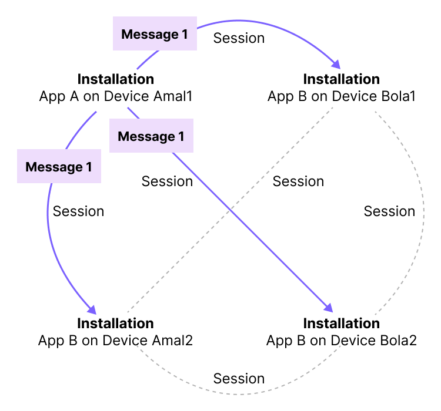
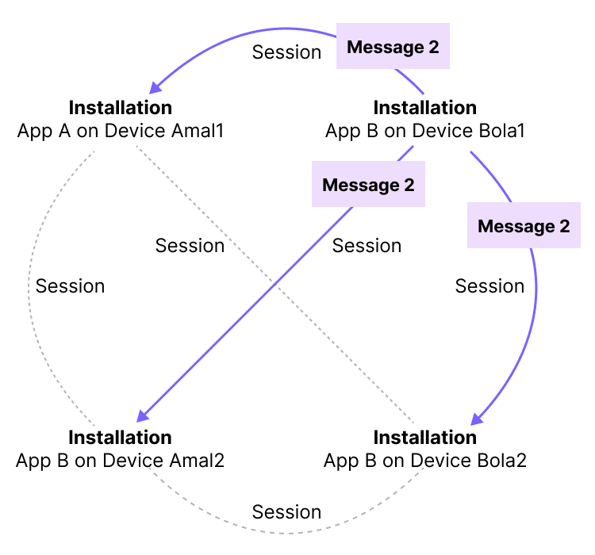

# LibXMTP

  

LibXMTP is a shared library encapsulating the core functionality of the XMTP messaging protocol, such as cryptography, networking, and language bindings.

> **Important**  
> This software is in **alpha** status and ready for you to start experimenting with. However, we do not recommend using alpha software in production apps. Expect frequent changes as we add features and iterate based on feedback.

## Requirements

- Install [Rustup](https://rustup.rs/)
- Install [Docker](https://www.docker.com/get-started/)

## Development

Start Docker Desktop.

- To install other dependencies and start background services:

  ```
  dev/up
  ```

  Specifically, this command creates and runs an XMTP node in Docker Desktop.

  > **Tip**  
  > You can use this local node with the [example CLI](https://github.com/xmtp/libxmtp/blob/main/examples/cli/README.md) to try out sending XMTP v3-alpha double ratchet messages.

- To run tests:

  ```
  dev/test
  ```

## Structure

- [`xmtp`](https://github.com/xmtp/libxmtp/tree/main/xmtp): Pure Rust implementation of XMTP APIs, agnostic to any per-language or per-platform binding
- [`xmtp_cryptography`](https://github.com/xmtp/libxmtp/tree/main/xmtp_cryptography): Cryptographic operations
- [`xmtp_networking`](https://github.com/xmtp/libxmtp/tree/main/xmtp_networking): API client for XMTP's gRPC API, using code from `xmtp_proto`
- [`xmtp_proto`](https://github.com/xmtp/libxmtp/tree/main/xmtp_proto): Generated code for handling XMTP protocol buffers
- [`examples/cli`](https://github.com/xmtp/libxmtp/tree/main/examples/cli): Example XMTP console client
- [`examples/android/xmtpv3_example`](https://github.com/xmtp/libxmtp/tree/main/examples/android/xmtpv3_example): Example Android app (in progress)
- [`bindings_ffi`](https://github.com/xmtp/libxmtp/tree/main/bindings_ffi): FFI bindings for Android and iOS (in progress)
- [`bindings_js`](https://github.com/xmtp/libxmtp/tree/main/bindings_js): JS bindings (in progress)
- [`bindings_wasm`](https://github.com/xmtp/libxmtp/tree/main/bindings_wasm): Wasm bindings (in progress)

## Key features of XMTP v3-alpha

### Double ratchet messaging

**What**: XMTP v3-alpha introduces the use of the [double ratchet algorithm](https://signal.org/docs/specifications/doubleratchet/) to keep past and future messages secure.

**Why**: With double ratchet messaging, each message is encrypted by its own session key. If the session key a sender used to send a message becomes compromised:

- All of their past messages remain secure. (Forward secrecy)

  Specifically, a malicious actor can’t decrypt and read the user’s past messages.

- Future messages will be secure. (Future, or post-compromise, secrecy)

  Specifically, a malicious actor can’t decrypt and read future messages. They also can’t send new messages impersonating the user.

In contrast, with XMTP v2, if a user’s key bundle becomes compromised:

- All of their past messages might not remain secure.
- Future messages might not remain secure.

**How**: Specifically, it uses the Rust version of [Olm](https://gitlab.matrix.org/matrix-org/olm/-/blob/master/docs/olm.md), which is Matrix protocol’s implementation of double ratchet. To learn more about the double ratchet algorithm and how sessions and session keys work, see [The Double Ratchet Algorithm](https://signal.org/docs/specifications/doubleratchet/).

### Installation key bundles

**What**: With XMTP v2, a user signs with their blockchain account to create an XMTP identity the first time they use an app built with XMTP. The user then signs to create a [user key bundle](https://xmtp.org/docs/concepts/key-generation-and-usage) that is stored on the XMTP network and used to [encrypt](https://xmtp.org/docs/concepts/invitation-and-message-encryption) and exchange messages.

With XMTP v3-alpha, there is no XMTP user key bundle. Instead, the user signs with their blockchain account to grant permission to an installation key bundle to send messages from their account address. The user signs to grant permission to an installation key bundle for each installation of an app built with XMTP. The installation key bundle is stored on each device and is not required to be stored on the XMTP network.

**Why**: Storing keys on the XMTP network makes them potentially available to anyone. Moving key storage to devices significantly improves security, as keys never leave a user’s device. Additionally, installation key bundles provide separate and revocable keys for each app installation on a device, simplifying key management. When a user revokes (deletes) a key from a device, you can be sure that it is gone.

**How**: If a user has App A installed on Device 1, App B installed on Device 1, and App A installed on Device 2, they will sign three times to grant permission to an installation key bundle per installation.

When a user sends a message using an installation, the installation sends the message to all installations associated with the blockchain account addresses in the conversation.

For example, let’s take a look at a conversation between Amal and Bola. Amal sends a message to Bola using App A on their Amal1 device. The message is [sent in a session](#double-ratchet-messaging) (with its own session key) to each installation for which Bola has granted permission to an installation key bundle. The message is also sent to all installations for which Amal has granted permission to an installation key bundle.



The same sending pattern applies when Bola sends a message to Amal:


