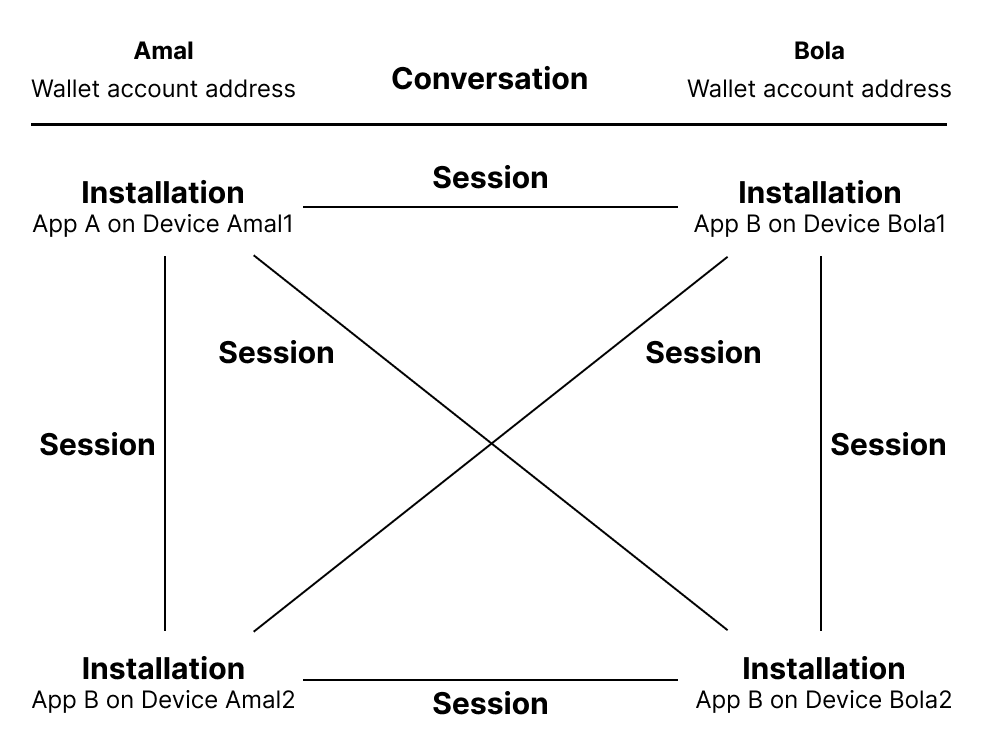
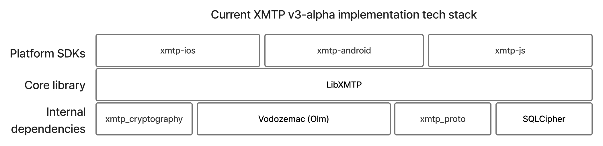

# XMTP v3 technical overview

This is a living document that reflects the technical design of XMTP v3 functionality, planned and delivered. XMTP v3 will be delivered in alpha, beta, and production releases, with v3-alpha announced on Aug. XX, 2023.

XMTP Labs welcomes all questions and feedback as we build v3 in the open and in partnership with the XMTP community. Your collective expertise and insights are key to ensuring an informed path forward for XMTP, web3’s secure, private, and portable messaging network.

Repos to explore:

- [https://github.com/xmtp/libxmtp](https://github.com/xmtp/libxmtp)
- [https://github.com/xmtp/proto](https://github.com/xmtp/proto)

**Note**: Not all details described in this document have been implemented in these repos yet. As with this document, the repos are living and will evolve as this document evolves. To learn more, see [Roadmap](#roadmap).

---

## Abstract

XMTP v3 introduces double-ratchet messaging to the XMTP network. This provides users with forward secrecy, post-compromise security, and the ability to grant and revoke messaging access at the per-app-installation level. The one-to-one encryption channel introduced in XMTP v3 additionally provides a building block for future work described in [Roadmap](#roadmap).

The first iteration is built on top of [Matrix’s Olm](https://gitlab.matrix.org/matrix-org/olm/-/blob/master/docs/olm.md), an implementation of the cryptographic ratchet described by Signal’s [Double Ratchet Algorithm](https://whispersystems.org/docs/specifications/doubleratchet/). This document describes the details of this system in the context of XMTP, a permissionless messaging network for blockchain identities.

## Objectives

- **Grow the XMTP network securely:** The suite of security properties introduced in XMTP v3 will reduce risk from potentially malicious apps and actors as we grow the XMTP network. These properties are displayed below.
- **More transparent and agile protocol development:** The core of XMTP v3 is [libxmtp](https://www.notion.so/DRAFT-XMTP-v3-technical-design-17e63194ef7c4803b7eb3dd6051b6019?pvs=21), a Rust library that can be consumed across multiple platforms. Streamlining XMTP’s cryptographic code and protocol logic into one open-source repository allows for increased auditability, security, and development velocity.
- **A foundation for group chat, account abstraction, and more:** A more adaptable protocol with strong security and privacy guarantees allows us to develop highly requested features, such as group chat, that rely heavily on handling sensitive key material.

| Protocol property                          | XMTP v2 | XMTP v3 | Description of property                                                                                                                                |
| ------------------------------------------ | ------- | ------- | ------------------------------------------------------------------------------------------------------------------------------------------------------ |
| Forward secrecy                            | N       | Y       | Prevent messages sent today from leaking even if a future compromise happens                                                                           |
| Post-compromise security                   | N       | Y       | Prevent messages sent in the future from leaking even if a compromise happens today                                                                    |
| Key revocation (at per-installation level) | N       | Y       | Allow users to disable keys if they ever become compromised/or no longer needed. e.g. Allows recovery if a phone is stolen.                            |
| Anonymity - social graph                   | N       | Y       | Prevent network from determining which users are communicating with each other                                                                         |
| Anonymity - sender                         | Y       | Y       | Prevent network from determining who each message originates from                                                                                      |
| Anonymity - recipient                      | Y       | N       | Prevent attackers from determining who each message is addressed to                                                                                    |
| Deniability                                | N       | TBD     | Prevent the recipient of a message from proving to an outsider that a message originated from the sender (as opposed to being forged by the recipient) |
| Message authentication                     | Y       | Y       | Prevent attackers from masquerading as a conversation participant                                                                                      |
| Message confidentiality                    | Y       | Y       | Prevent attackers from reading the contents of each message                                                                                            |
| Message integrity                          | Y       | Y       | Prevent attackers from tampering with the contents of each message                                                                                     |

**Why Olm?**

- Olm is actively used in production and its open source implementations have been tested and [independently audited](https://matrix.org/media/Least%20Authority%20-%20Matrix%20vodozemac%20Final%20Audit%20Report.pdf), which is a signal of reliability.
- The Olm protocol and implementations such as [vodozemac](https://github.com/matrix-org/vodozemac) are actively maintained and updated, and continue to benefit from security improvements and updates over time.
- Olm implementations such as vodozemac carry an Apache license, allowing third party organizations to use the XMTP SDK in closed source applications. Additionally, XMTP may make modifications to it, or replace it, in the future as needed.

Using an existing library like Olm for the first iteration of double ratchet in XMTP can reduce the risks associated with "rolling your own" cryptographic implementation. Limitations of Olm are described in [Limitations and future work](#limitations-and-future-work).

## The messaging protocol

In XMTP v3, **conversations** between **accounts** are carried out via pair-wise **sessions** between app **installations**:

- An **account** consists of multiple app installations. To learn more, see [Account management](#account-management).
- A **conversation** consists of multiple pair-wise sessions between installations. To learn more, see [Conversation management](#conversation-management).
- Messages are individually encrypted and delivered at the **session** level. To learn more, see [Session management](#session-management).
- Delivery of messages happens via network **topics**. To learn more, see [Network topic structure](#network-topic-structure).

### Network topic structure

XMTP nodes currently store data using Waku topics. Clients may publish, request, or subscribe to data from these topics. The purpose of these topics will be described in subsequent sections.

- **`contact-<walletAddress>`**: Signed installation contact bundles for a given user account.
- **`revoked-<walletAddress>`**: Signed revocation payloads for a given user account.
  - Separated from the contact topic so that it can be queried separately on receiving messages.
- **`prekey-<installationId>`**: Prekeys for a given installation.
- **`message-<installationId>`**: Inbox topic containing encrypted messaging payloads for a given installation.

To prevent denial-of-service via spamming of unauthorized payloads, nodes should validate that publishes onto the `contact`, `revoked`, and `prekey` topics were produced by an installation that is authorized to do so. More details about the signature scheme TBD.

Although verification of payload signatures can be used by clients to validate that nodes do not fabricate data on these topics, we currently require node cooperation to not censor or omit data. For the state of XMTP decentralization and future plans for node incentivization, see [XMTP: The journey to decentralization](https://xmtp.org/blog/journey-to-decentralization).

### Account management

In XMTP v3, a messaging account is represented by an Ethereum wallet address. An account consists of multiple app installations that may send and receive messages on behalf of it. Each installation is a separate cryptographic identity with its own set of keys.

```
Amal's account (Ethereum wallet address)
│
├── Converse app (mobile phone)
│   └── Installation key bundle 1
│
├── Coinbase Wallet (mobile phone)
│   └── Installation key bundle 2
│
├── Lenster (tablet)
│   └── Installation key bundle 3
│
└── Coinbase Wallet (tablet)
    └── Installation key bundle 4
```

Using per-installation keys provides the following benefits:

- Installation private keys are never shared across devices or published onto the network.
- The user may enumerate the installations that have messaging access to their account.
- The user may revoke keys on a per-installation level. (🛠 Planned for v3-beta)

**Installation provisioning**

With XMTP v3 account management, every new app installation gains messaging access as follows:

1. A new installation contact bundle is generated and stored on the device. The installation contact bundle contains the following Olm installation identity keys:
   1. A Curve25519 key used for establishing shared secrets
   2. An Ed25519 key used for signing
2. The app prompts the user to sign the contact bundle with their Ethereum wallet, establishing an association between the installation identity keys and the user’s account. Example text:

   ```jsx
   XMTP: Grant Messaging Access

   Current Time: <current time and local timezone>
   Installation Key: <Curve25519PublicKey:Ed25519PublicKey>
   ```

3. A new set of prekeys, used for session initiation via [Triple Diffie-Hellman](https://gitlab.matrix.org/matrix-org/olm/-/blob/master/docs/olm.md#the-olm-algorithm), is generated and stored on the device. This comprises:
   1. A configurable number of one-time Curve25519 prekeys
   2. A single fallback Curve25519 prekey
4. The app signs each public prekey using its private Ed25519 identity key, without any user involvement.
5. The app publishes the public contact bundle and wallet signature to the XMTP network on the user account’s contact topic, and the prekeys and corresponding signatures to the installation’s prekey topic. This enables other apps to understand that the installation is on the network, associated with the account, and how to contact it.

**Installation management**

At any time, the user may enumerate active installations by querying the contact topic for the user account. The user may identify each installation by the creation time as well as the installation key from the signing text.

In the event of a compromise, malicious app, or no longer used installation, the user may revoke an installation’s messaging access going forward by signing a revocation payload containing the installation’s identity keys using their wallet and publishing it onto the revocation topic. (🛠 Payload and verification processes are planned for v3-beta with more details to come.)

### Conversation management

In XMTP v3, a **conversation** consists of pair-wise sessions between installations (known as ’client-side fanout’). For example, this diagram illustrates the sessions that comprise a conversation consisting of two users, each with two installations. Each message in the conversation is sent from the sending installation to all other installations in the conversation.



XMTP v3 introduces a secure peer-to-peer channel that serves as a primitive building block for future versions of the protocol. To learn more, see [Roadmap](#roadmap).

**Message lifecycle**

The message lifecycle in XMTP v3 is as follows:

1. If Amal wants to message Bola, Amal’s app client makes requests to Amal and Bola’s contact and revocation topics to assemble a list of valid installations of both users.
2. If one or more contact bundles exist for Bola, Amal’s client establishes (or reuses an existing) session between each of Bola’s installations and each of Amal’s remaining installations, as described in [Session management](#session-management).
3. Amal’s client encrypts the message on each session, and publishes it to each installation’s inbox topic.
4. When Bola’s installations come online, they will each fetch all incoming message payloads via their respective inbox topics and decrypt them via their relevant sessions.
5. Once an encrypted payload has been fetched, it is stored locally on the installation. The server may choose to delete the payload.

In XMTP v3, sending the first message implicitly establishes the conversation. Messages are associated with conversations via the `convo_id` identifier: `<conversation_type>:<lower_account_address>:<higher_account_address>`. In the event that two accounts simultaneously initiate a conversation of the same type with each other, they will resolve to the same `convo_id`.

**Inbox topics**

All messages intended for a given installation are published onto the same ‘inbox topic’ for that installation and associated with a conversation via the `convo_id` identifier.

This type of topic structure will reveal the number of payloads being sent to the user. Privacy measures on the message headers mean that sender information is not publicly visible. The fact that a message was sent to an account is not tied to a specific user action (assuming sufficient volume) and so the harm here is reduced.

There may be future plans which would result in higher privacy protections around how many messages have been received, however that is still an open area.

**Adding and removing installations**

It is possible for either participant in the conversation to grant messaging access to additional installations, or revoke access from existing installations, while the conversation is ongoing. The active sessions for a given conversation must reflect this.

When sending a message, XMTP clients must ensure that the installation list is up to date. The XMTP SDK schedules message sends in the background and uses a pull-based approach to refresh the installation list prior to encrypting and committing messages to the network. Future performance improvements may be implemented at the SDK level.

When receiving a message, clients must verify that the sending installation was valid and unrevoked at the time that the message was sent. (🛠 Installation revocation is planned for v3-beta with more details to come.)

### Session management

**Session lifecycle**

XMTP v3 uses Matrix’s Olm implementation to manage session encryption. A brief summary follows. For more information, see the [Olm specification](https://gitlab.matrix.org/matrix-org/olm/-/blob/master/docs/olm.md).

Given a valid target installation contact bundle, a session is established as follows:

1. Fetch a valid Curve25519 prekey from the target installation’s prekey topic. Additionally, generate an ephemeral Curve25519 keypair.
2. Perform a [Triple Diffie-Hellman](https://gitlab.matrix.org/matrix-org/olm/-/blob/master/docs/olm.md#initial-setup) using the Curve25519 identity keys of both installations, the ephemeral key pair, and the prekey of the target installation to obtain a shared secret.
   1. The use of 3DH rather than X3DH is inherited from Olm. Future protocol versions may deviate.
3. The shared secret is used to initialize Olm’s [implementation](https://gitlab.matrix.org/matrix-org/olm/-/blob/master/docs/olm.md#advancing-the-root-key) of the [Double Ratchet](https://signal.org/docs/specifications/doubleratchet/) algorithm, which is subsequently used to encrypt all messages.
   1. The first message on the session, and subsequent messages until a response is received, are **prekey messages**. The public keys of the prekeys used to initiate the session will be attached to the Olm message payload so that the receiver can reproduce the 3DH exchange.
   2. All other messages are regular messages and do not contain prekey material.

It is possible for two installations to simultaneously establish separate sessions, and for both sessions to be valid for a period of time. In the event that multiple sessions exist when sending a payload to a given installation, the most recently active session is favored. To protect past key material, older sessions should be removed once they have been inactive for more than one day.

If an installation is unable to decrypt an incoming payload, it may request retransmission of that payload on a new session. The new session will replace the old session using the same process as above. (🛠 Planned for v3-beta with more details to come.)

**Payload metadata and sealed sender**

To identify the session to use to decrypt an incoming payload, metadata about the sending installation must be included alongside the message. XMTP implements [sealed sender](https://signal.org/blog/sealed-sender/) to encrypt this metadata so that it is not revealed to anyone other than the receiving installation.

The full structure of the message payload and metadata is described below and subject to change. For more details, see the [proto definition](https://github.com/xmtp/proto/blob/xmtpv3/proto/v3/message_contents/message.proto).

```jsx
// Metadata that is encrypted via SealedSender and only visible to the recipient
message PadlockMessageSealedMetadata {
    string sender_user_address = 1;
    string sender_installation_id = 2;
    string recipient_user_address = 3;
    string recipient_installation_id = 4;
    bool is_prekey_message = 5;
}

// Plaintext header included with messages, visible to all
// Recipients can verify this header has not been tampered with.
// Servers are unable to verify if the header has been tampered with.
message PadlockMessageHeader {
    uint64 sent_ns = 1;
    bytes sealed_metadata = 2;  // PadlockMessageSealedMetadata
}

// Encrypted body included with messages, only visible to recipients
message PadlockMessagePayload {
    PadlockMessagePayloadVersion message_version = 1;
    EdDsaSignature header_signature = 2;    // Signs PadlockMessageHeader
    string convo_id = 3;
    bytes content_bytes = 4;                // EncodedContent
}

// Combines the plaintext header with the encrypted payload
message PadlockMessageEnvelope {
    bytes header_bytes = 1;     // PadlockMessageHeader
    bytes ciphertext = 2;       // Encrypted PadlockMessagePayload (a serialized OlmMessage)
}
```

**Payload validation**

When receiving a message payload, recipients must:

1. Decrypt the sealed metadata in the header via `SealedSender`.
2. Verify that the receiving installation matches the `recipient_user_address` and `recipient_installation_id`. Verify that a valid, unrevoked contact bundle for the `sender_installation_id` exists and is signed by the `sender_user_address`.
3. Find the relevant session using the `sender_user_address` and `sender_installation_id` in the unsealed metadata. If no session exists and `is_prekey_message` is true, establish a new session.
4. Use the session to decrypt the payload.
5. Verify that the `header_signature` in the decrypted payload was produced by signing the `header_bytes` with the ed25519 key matching the `sender_installation_id`.
6. Verify that both the `sender_user` and `recipient_user `are participants of the conversation referenced by `convo_id`.

**Prekey management**

The XMTP SDK must manage prekeys as follows:

1. When a prekey message is received, if a one-time prekey was used, it must be deleted from the device after use. If a fallback prekey was used, no action needs to be taken.
2. When an installation’s one-time prekeys have been exhausted, it should generate and upload a new batch of prekeys to the server.
3. When an installation’s fallback prekey is older than a certain threshold, it should generate and upload a new fallback prekey to replace the older one.

XMTP nodes must behave as follows when a prekey is requested from the prekey topic:

1. In the event that a valid one-time prekey is available, serve it and then delete it.
2. Otherwise, serve the latest uploaded fallback key.

In the event that a node behaves incorrectly, and in race conditions, an invalidated prekey may be served. If an invalidated prekey is used to send a prekey message, the receiving side will be unable to decrypt it because the corresponding private key will have been deleted. The receiving side may request retransmission as with any other decryption failure.

It is currently possible for a malicious entity to exhaust the one-time prekeys for an installation, causing all handshakes to use the fallback prekey. This is an area of future work.

Future work is described in [Limitations and future work](#limitations-and-future-work).

## Limitations and future work

**Olm dependency**

- Olm uses 3DH (with no signed prekey) instead of X3DH. XMTP may implement support for this in the future.
- [libolm](https://gitlab.matrix.org/matrix-org/olm) was designed to be compatible with [libsignal](https://github.com/signalapp/libsignal), which has a high maintenance cost. XMTP should be careful about inheriting protocol choices. Choosing an approach which makes use of newer primitives (e.g. ChaChaPoly) would be more future-proof, given there is currently no requirement for backward compatibility.
- Matrix implementations have seen recent vulnerabilities, which lead to questions about its robustness in a secure context. For example, see [Practically-exploitable Cryptographic Vulnerabilities in Matrix](https://nebuchadnezzar-megolm.github.io/).

**Client-side fanout**

XMTP v3 uses pair-wise sessions between all of the installations in a conversation, which carries the following drawbacks:

- $*O(n)*$ processing time and network usage as the number of installations in the conversation increases.
- No transcript consistency guarantee: Senders are not guaranteed to send the same message content to all installations in a conversation.

Future versions of the protocol will build group messaging channels on top of the peer-to-peer messaging primitive introduced in v3 to mitigate these issues.

**Exposed metadata**

- **Contact bundles:** All contact bundles (and accompanying signature text) are visible to the XMTP network. This is by design and necessary for session-based encryption. Observers are able to deduce the following for a given wallet address:
  - Number of messaging installations
  - Creation time of each installation
- **Payload metadata**: Payload metadata available on the network is limited to:
  - Recipient installation address: Inbound topics contain a unique `installation_id`. for example, `message-0dYHO5xN+oj3T1gjC3odBj81j0ToP4l62N7oAFzrvGs`.
  - Recipient user address: Discoverable as the mapping between `installation_id` and wallet address is established via contact bundles.
  - Sender-reported send time
  - Payload byte length: Currently unpadded
- **Connection metadata**: Personal identifiable information (PII) may be exposed via the network connection to the node.

The sender of the payload is concealed via sealed sender, allowing social graph metadata to remain private.

Future versions of the protocol may incorporate message padding and private installation inbox topics.

**Message portability**

More details TBD.

**Node cooperation**

Uncooperative or malicious nodes may choose to omit messages, prekeys, installation contact bundles, or revocation payloads, although they are unable to fabricate them. This creates a denial-of-service risk as well as the possibility of preventing installation revocation in the event of a compromise.

XMTP is committed to progressive decentralization. All XMTP nodes are currently operated by XMTP Labs, with active progress on decentralization and incentivization of good node behavior. To learn more, see [XMTP: The journey to decentralization](https://xmtp.org/blog/journey-to-decentralization).

**Prekey exhaustion**

## Implementation

The implementation of the protocol has been consolidated into LibXMTP, a core Rust library that is shared between all platform SDKs. Basing all SDKs on a shared single source of truth for cryptographic libraries delivers improved auditability, security, and development velocity.

In XMTP v3, client state is now database-first, rather than network-first as it is in XMTP v2. Using a database-first architecture supports the higher security requirements of v3, as well as providing performance and reliability improvements.

Relevant repos:

- [https://github.com/xmtp/libxmtp](https://github.com/xmtp/libxmtp)
- [https://github.com/xmtp/proto](https://github.com/xmtp/proto)

### Tech stack

The XMTP v3 protocol implementation uses the following tech stack:



| Tech                                                        | Responsibility                                                                                                                                                                                              |
| ----------------------------------------------------------- | ----------------------------------------------------------------------------------------------------------------------------------------------------------------------------------------------------------- |
| https://github.com/xmtp/libxmtp/tree/main/xmtp_cryptography | Cryptographic operations                                                                                                                                                                                    |
| Vodezemac (Olm)                                             | Native Rust implementation of Matrix’s https://gitlab.matrix.org/matrix-org/olm/blob/master/docs/olm.md E2EE protocol.                                                                                      |
| https://github.com/xmtp/libxmtp/tree/main/xmtp_proto        | Generated code for handling XMTP protocol buffers                                                                                                                                                           |
| SQLCipher                                                   | Open source extension to the SQLite database engine that provides transparent 256-bit AES encryption of database files. Adds a layer of protection to local data storage that can be enabled by developers. |
| https://github.com/xmtp/libxmtp                             | A shared library encapsulating the core functionality of the XMTP messaging protocol, such as cryptography, networking, and language bindings.                                                              |
| https://xmtp.org/docs/introduction                          | Used by developers to build apps with XMTP across a variety of platforms.                                                                                                                                   |

State machine (out of date): [https://github.com/xmtp/libxmtp/tree/main/xmtp#state-machine](https://github.com/xmtp/libxmtp/tree/main/xmtp#state-machine)

## Roadmap

### XMTP v3 status

XMTP v3 is currently in alpha stage and many components have not yet been implemented.

| Component                               | Status         |
| --------------------------------------- | -------------- |
| Installation provisioning               | 🟢 Done        |
| Installation management and revocation  | 🟡 In Progress |
| One-time prekeys                        | 🔴 Not Started |
| Prekey replenishment and rotation       | 🔴 Not Started |
| Message sending                         | 🟢 Done        |
| Sealed sender                           | 🟡 In Progress |
| Message receiving (pull-based)          | 🟢 Done        |
| Message receiving (streaming-based)     | 🔴 Not Started |
| Decryption failure recovery             | 🔴 Not Started |
| Rust support                            | 🟢 Done        |
| Android support                         | 🟡 In Progress |
| iOS support                             | 🟡 In Progress |
| Web/Node.js/wasm support                | 🟡 In Progress |
| Portable inbox                          | 🔴 Not Started |
| Backward compatibility and rollout plan | 🔴 Not Started |

### Delivered in v3-alpha

Explore components and features delivered in XMTP v3-alpha:

- LibXMTP shared library: [GitHub repo](https://github.com/xmtp/libxmtp)
- Double ratchet messaging: [README](https://github.com/xmtp/libxmtp#key-features-of-xmtp-v3-alpha)
- Installation key bundles: [README](https://github.com/xmtp/libxmtp#installation-key-bundles)
- Try out v3-alpha messaging: [Demo CLI](https://github.com/xmtp/libxmtp/blob/main/examples/cli/README.md)

### Beyond v3

More details TBD.

- Group messaging and performance improvements
- Consent mechanism
- Decentralization/incentivization
