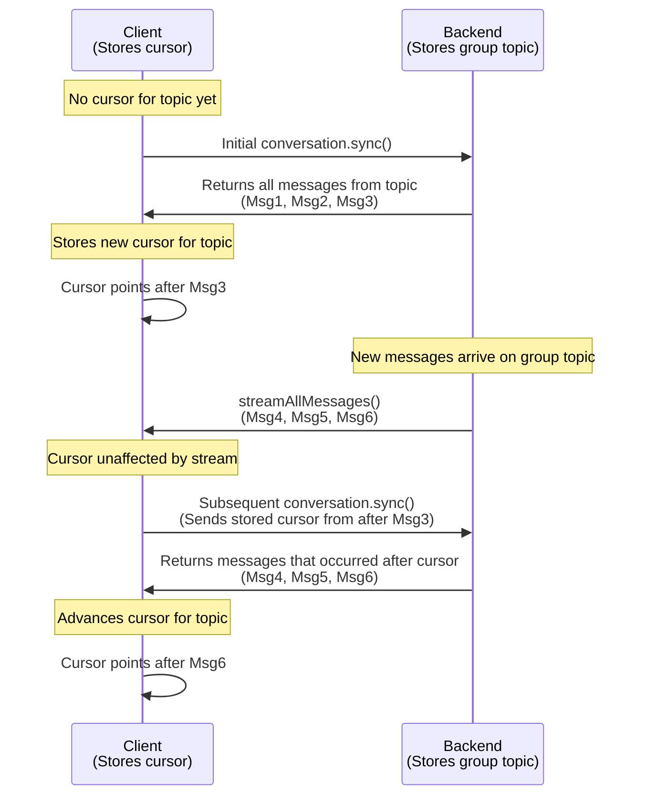

While cursors are managed automatically by the XMTP SDKs, understanding how they work is crucial for debugging and for grasping the underlying mechanics of message synchronization.

## What is a cursor?

Think of it as a bookmark in the chronological log of messages and events for a given topic. Its purpose is to remember the exact point up to which an installation has successfully synchronized its data.

A cursor is one number per topic: the highest sequence ID the installation processed on that topic. Zero means the beginning. Each installation stores its cursors in its local database. A cursor only moves forward.

## How a read uses a cursor

A read names topics and a cursor for each topic. The backend returns later envelopes in topic order. Only topics that return rows advance. A full response sets `has_more`; repeat the read until it is false.

Order is total within one topic. A sequence ID has no ordering meaning across topics.

| Call                      | Topics it advances                             |
| ------------------------- | ---------------------------------------------- |
| `conversation.sync()`     | That conversation's group-message topic        |
| `conversations.sync()`    | The installation's Welcome topic               |
| `conversations.syncAll()` | The Welcome topic and every conversation topic |

`conversations.sync()` fetches new conversations. It does not fetch their messages.

- **Streaming does not advance the cursor:** A successfully processed streamed message is stored, but the durable cursor stays at the last sync position. The stream tracks its own in-memory position. A later sync can read the envelope again; storage processing is idempotent.

- **Access old messages from the local database:** Once `sync()` fetches messages from the backend, they are stored in a local database managed by the SDK. You can query this database at any time to retrieve historical messages without making a backend request. This provides fast, local access to the full message history available to the installation.

