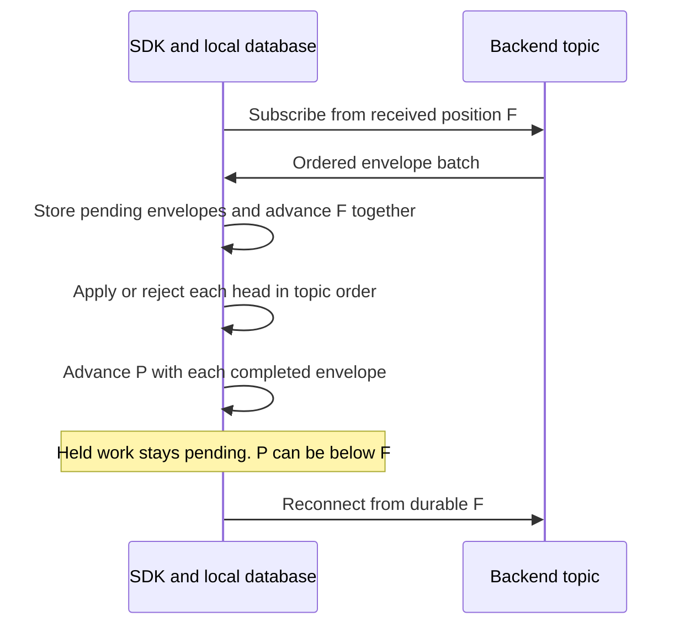

The SDK stores progress for each topic in its local database. A wire cursor is a
sequence ID. Zero means the start of retained history. Sequence IDs can have
gaps. The order is defined within each topic; do not use IDs to infer an order
between topics.

## Received and processed positions

The SDK keeps two positions for group and identity topics:

- **Received position (`F`)**: The topic prefix stored as pending envelopes or
  already handled. Storing the envelopes and advancing this position happen in
  one database transaction.
- **Processed position (`P`)**: The topic prefix applied to local state or
  rejected with a recorded terminal reason. This position cannot exceed `F`.

Both positions only move forward. A stream can advance `F` before the SDK can
process the envelopes. If an envelope cannot be processed safely, it stays
pending and blocks later envelopes on that topic. Other topics can still advance.
A rejected envelope advances `P` only when the SDK has the state and preceding
history needed to establish a terminal rejection.

Welcome topics track received progress and unresolved Welcomes. They do not use
the group processed position. A later Welcome can complete while an earlier one
remains unresolved.

## Reads, streams, and sync

A query names topics and an exclusive cursor for each topic. It returns retained
envelopes after those cursors. Advance each topic only through the envelopes
returned for that topic. `has_more` is true only when more matching rows exist
in that query's database snapshot. A page at the row limit can still have
`has_more = false`.

Streams and queries use the same durable receipt and processing path. A stream
reconnects from the received position. Overlap is safe: admission and processing
prevent duplicate effects. A crash can leave received envelopes pending; the
SDK resumes that work from the local database.

An explicit sync captures fixed topic targets. It completes after it processes
those targets and the required discovery work. Later traffic does not extend
that sync. A target from a read replica can lag the primary. A newest-envelope
result or publish receipt supplies a target; it does not prove that the SDK has
received all earlier envelopes.

| Call                      | Scope                                                |
| ------------------------- | ---------------------------------------------------- |
| `conversation.sync()`     | That conversation's group-message topic              |
| `conversations.sync()`    | The installation's Welcome topic and group discovery |
| `conversations.syncAll()` | Welcomes and the selected conversation topics        |

`conversations.sync()` discovers conversations. Use conversation sync or
`syncAll()` to fetch their message history.

## Local history and delivery

Message history reads use the local database. They do not fetch new backend
messages. The available history depends on the installation's membership,
backend retention, and the data it has already received and processed.

A message delivery cursor is separate from the wire cursor. It contains a local
database identity and delivery number. It resumes local message delivery after
that item. Default stream delivery advances when the app acknowledges an item
by returning normally from its callback or requesting the next iterator item.
A crash before the acknowledgement is stored can repeat an item. Deduplicate
app effects with the message ID when needed.

```mermaid
sequenceDiagram
  participant Client as SDK and local database
  participant Backend as Backend topic

  Client ->> Backend: Subscribe from received position F
  Backend ->> Client: Ordered envelope batch
  Client ->> Client: Store pending envelopes and advance F together
  Client ->> Client: Apply or reject each head in topic order
  Client ->> Client: Advance P with each completed envelope
  Note over Client: Held work stays pending. P can be below F
  Client ->> Backend: Reconnect from durable F
```
