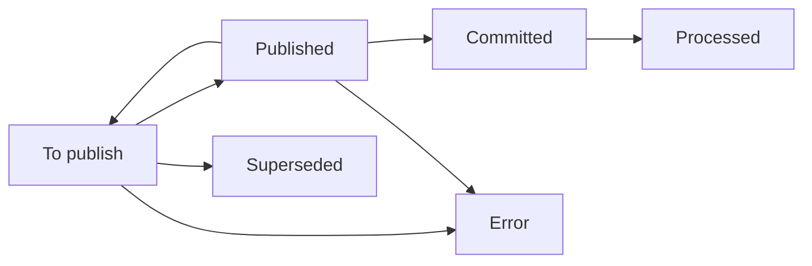

Intents provide an internal state machine, or "bookkeeping" mechanism, for reliably applying changes to XMTP group chat states, even when the process encounters retries, crashes, race conditions, or ordering issues.

Developers building apps and agents with XMTP don't need to work with intents directly, but understanding them provides insight into how the protocol maintains integrity behind the scenes.

## Intent actions

An intent stores a group operation and the data needed to retry it. Some intents create a [commit](/protocol/envelope-types/#group-messages). Others publish an application message or proposal.

Each commit rotates the group's encryption state into a new [epoch](/protocol/epochs/) and must be applied in epoch order. A stale commit is rejected after the client has processed the preceding topic history. Missing local state can hold processing until the state is available.

Intents provide a structured way to track the multi-step process of publishing commits, handling retries, and recovering from interruptions. The SDK can rebuild a stale commit against the current group state. Permanent errors stop retries.

Examples of intent actions include:

- Add member: Add a participant to a group
- Remove member: Remove a participant from a group
- Send message: Deliver an application message to the group
- Change metadata: Rename a group, for example

## Intent states

Each intent progresses through a series of states as it is processed:

- **To publish**: Intent has been created and queued, but not yet sent
- **Published**: The envelope has been sent to the backend
- **Error**: Intent failed with a permanent, non-retryable error (for example, a member without adequate permission tries to add a member, or the member was removed from the group). These intents will not be retried.
  - Note: Temporary, retryable failures (such as backend connectivity issues or app restarts) keep the intent in the **To publish** state for retry on the next sync.
- **Committed**: The operation has been applied to local group state, and dependent operations can now be performed. For example, after adding group members, welcome messages can be sent with the new encryption state.
- **Processed**: Intent is fully complete and all related operations have finished
- **Superseded**: A guarded write is stale because the committed value changed before publication. The SDK does not publish it. The caller can read the new value and submit a new write.

By tracking intent states, XMTP ensures that if an app crashes before a commit has been accepted, for example, the commit process can resume later from the stored state without losing intent information.

## Example intent flow

```mermaid
flowchart LR
  A[To publish] --> B[Published]
  B --> C[Committed]
  C --> D[Processed]
  A --> E[Error]
  A --> F[Superseded]
  B --> E
  B --> A
```
