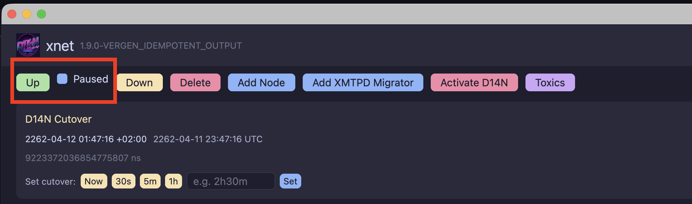
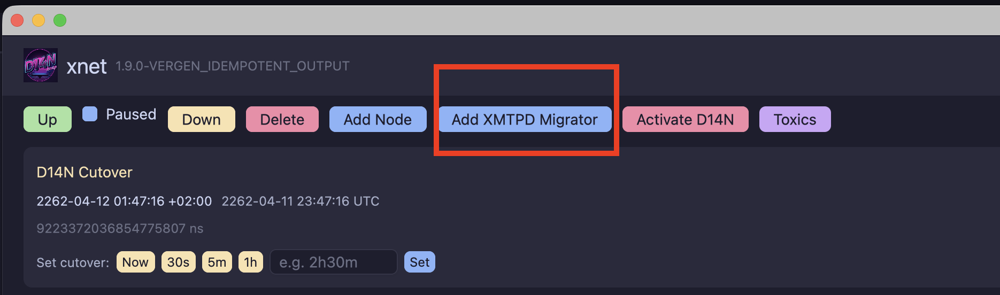
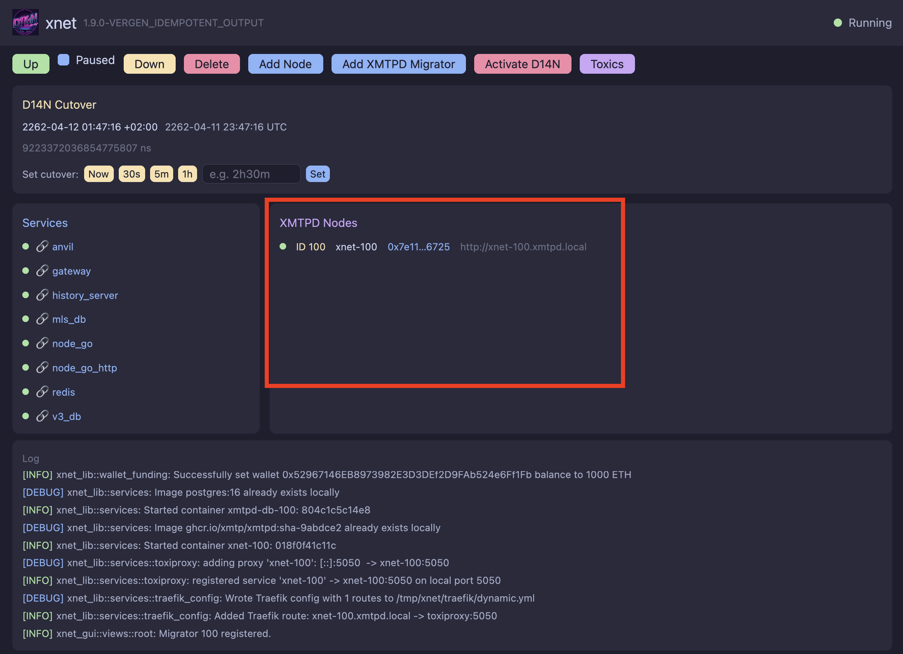
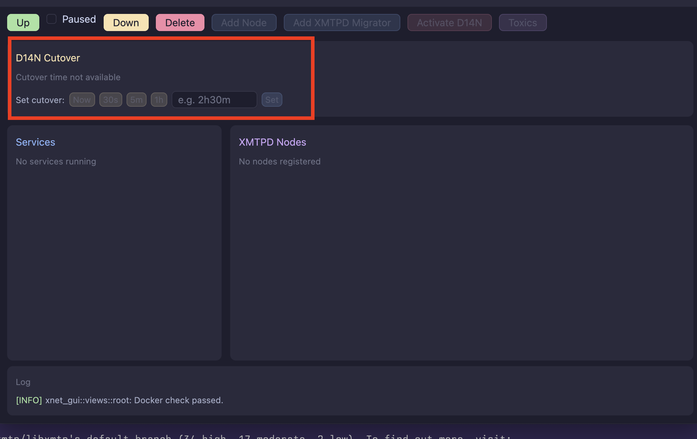
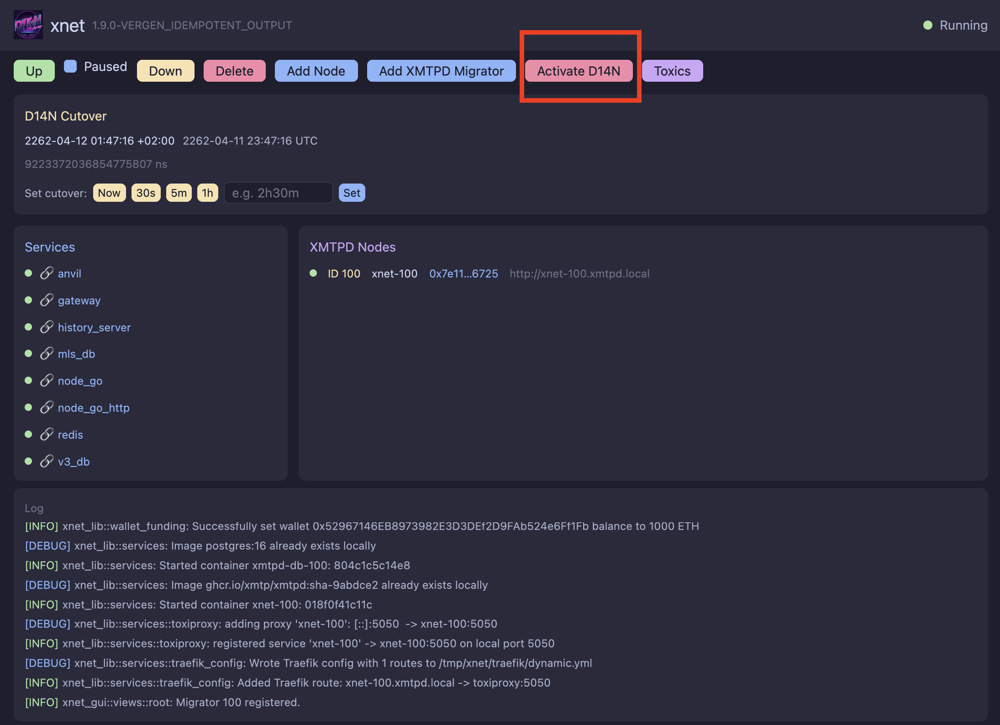

# XNet

XNet is a opinionated orchestration tool for XMTPD, with a focus on testing the
centralized -> d14n client migration of the XMTP network. It is a tool to spawn,
add, remove and modify network conditions and evaluate the health of a local
XMTP network.

## Requirements

- Docker Daemon
- DNS to redirect *.xmtpd.local queries
  [DNS Setup Instructions](#dns-setup-instructions)

# Migration Testing Steps

## Installation

### Nix

Install the GUI imperatively:

> [!NOTE]
> the gui install will only work imperatively on aarch64-darwin systems

```
nix profile add github:xmtp/libxmtp#xnet-gui
```

`nix profile add github:xmtp/libxmtp#xnet-cli`

Install with Brew
```
brew tap xmtp/tap
brew install xnet-gui
```

Install from Github Release DMG

-- Download from sidebar

Installing from the overlay

```nix
{
  inputs = {
    nixpkgs.url = "github:NixOS/nixpkgs/nixpkgs-unstable";
    libxmtp.url = "github:xmtp/libxmtp/push-mtruypwzqklu";
  };

  nixConfig = {
    extra-trusted-public-keys = [
      "xmtp.cachix.org-1:nFPFrqLQ9kjYQKiWL7gKq6llcNEeaV4iI+Ka1F+Tmq0="
    ];
    extra-substituters = [
      "https://xmtp.cachix.org"
    ];
  };

  outputs = { nixpkgs, libxmtp, ... }:
    let
      pkgs = import nixpkgs {
        system = "x86_64-linux";
        overlays = [ libxmtp.overlays.default ];
      };
      system = "x86_64-linux";
    in
    {
      devShells."${system}".default = pkgs.mkShell
        {
          buildInputs = with pkgs; [ xnet-cli ];
        };
      # can also use the package directly without an overlay
      devShells.${system}.direct = pkgs.mkShell
        {
          buildInputs = [ libxmtp.packages."${system}".xnet-cli ];
        };
    };
}
```

### Setup DNS

this allows you to resolve *.xmtpd.local domains on the host system outside of
the docker network (to allow a local app to access the xmtpd nodes).

#### MacOS

Create a resolver configuration.

```bash
sudo mkdir -p /etc/resolver
```

```bash
sudo tee /etc/resolver/xmtpd.local <<EOF
nameserver 127.0.0.1
port 5354
EOF
```

### Linux with systemd-resolved

```bash
sudo mkdir -p /etc/systemd/resolved.conf.d
sudo tee /etc/systemd/resolved.conf.d/xmtp.conf <<EOF
[Resolve]
DNS=127.0.0.1:5354
Domains=~xmtpd.local
EOF

sudo systemctl restart systemd-resolved
```

### Get the network up
Ensure network is "Paused"


### Add an XMTP Migrator Node


### Wait for XMTPD to showup in nodes section


### Network is now ready to be used with V3 pre-migration

- XMTP V3 is at `http://localhost:5556/`
- XMTP D14n Gateway is at `http://localhost:5052/`
- XMTPD is at url in GUI, (`xnet-100.xmtpd.local`). the scheme is `xnet-NODEID.xmtpd.local`
- Grafana & migration dashboard is at `http://localhost:3000`
- Block Explorer is at `http://localhost:5100/`

### Migrate to D14n



### Activate D14n
_after_ cutover occurs, d14n is still paused.
You must hit `activate` to restart d14n without the migrator and
unpause the smart contracts for writes.



# Configuration

XNet can be configured via a `xnet.toml` file. Below are the default values:

<details>
<summary>Default Configuration</summary>

```toml
[xnet]
use_standard_ports = true
toxiproxy_port = 8474
paused = false

[migration]
enable = false
migration_timestamp = 2_147_483_647

[xmtpd]
image = "ghcr.io/xmtp/xmtpd"
version = "sha-695b07e"

[v3]
image = "ghcr.io/xmtp/node-go"
version = "main"
port = 5556

[gateway]
image = "ghcr.io/xmtp/xmtpd-gateway"
version = "sha-695b07e"

[validation]
image = "ghcr.io/xmtp/mls-validation-service"
version = "main"

[contracts]
image = "ghcr.io/xmtp/contracts"
version = "main"

[history]
image = "ghcr.io/xmtp/message-history-server"
version = "main"

[toxiproxy]
image = "ghcr.io/shopify/toxiproxy"
version = "2.12.0"

## No XMTPD nodes are included by default, but can be added like this:
# [[xmtpd.nodes]]
# enable = true
# name = "alice-operator"
# port = 3000
# migrator = true

# [[xmtpd.nodes]] # add the node but use defaults everywhere
# enable = true
```

</details>
