# Device Sync V2: Incremental Sync Architecture

## Table of Contents

1. [Executive Summary](#executive-summary)
2. [Current Solution](#current-solution)
3. [Proposed Solution](#proposed-solution)
4. [Architecture Overview](#architecture-overview)
5. [Privacy Model](#privacy-model)
6. [Key Management](#key-management)
7. [Archive Format](#archive-format)
8. [Sync Flows](#sync-flows)
9. [Server API](#server-api)
10. [Migration Path](#migration-path)
11. [Appendix: Data Structures](#appendix-data-structures)

---

## Executive Summary

This document proposes a comprehensive redesign of the device sync system. The new architecture delivers:

- **Sub-second initial sync** vs. potentially minutes for full history
- **On-demand message loading** per conversation
- **Resumable transfers** - failed uploads/downloads resume from last position, not restart
- **Zero-knowledge server** that cannot correlate data to user identities
- **Forward secrecy** with proper key rotation
- **Incremental sync** reducing bandwidth by 90%+ for typical usage
- **Explicit API control** - all sync operations triggered via explicit function calls

The redesign transforms device sync from an opaque, error-prone, all-or-nothing operation into a fast, reliable system with explicit developer control that enables a much smoother user experience.

---

## Current Solution

### Architecture

The current device sync uses a request-response model coordinated through an MLS sync group. When a new installation comes online, it automatically sends a `DeviceSyncRequest`. An existing installation must explicitly sync to receive this request, then creates a full archive of all data, encrypts it with a random key, uploads it to the sync server, and sends a `DeviceSyncReply` containing the download URL and decryption key. The new installation must then explicitly sync again to receive the reply and download the archive.

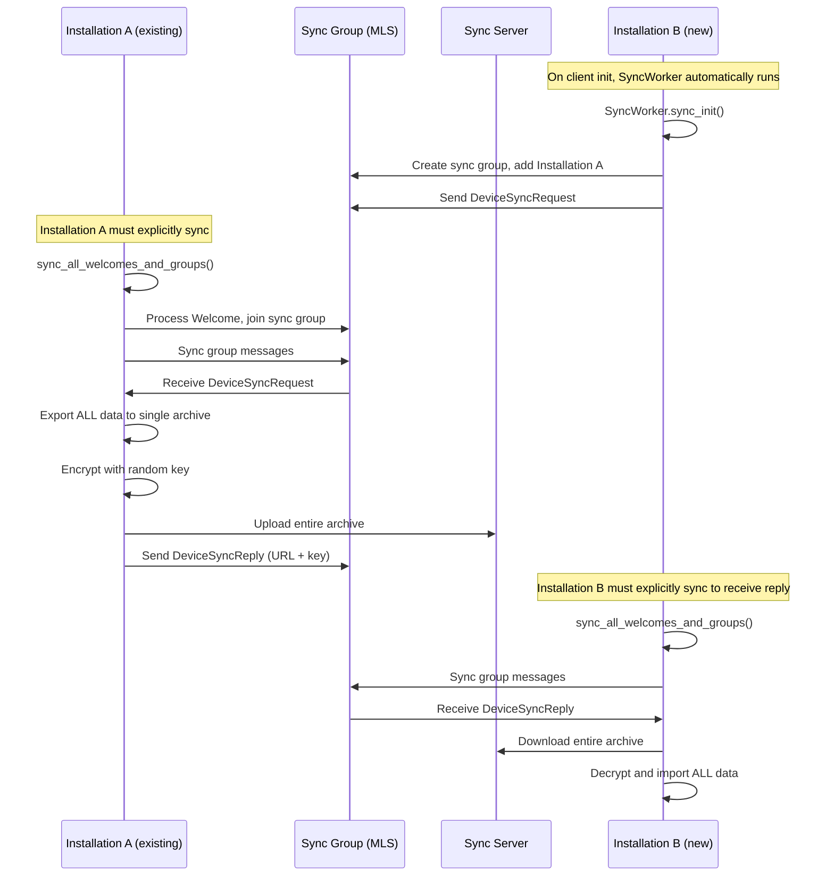

### Key Limitations Summary

| Issue                      | Impact                                                                                                |
| -------------------------- | ----------------------------------------------------------------------------------------------------- |
| **No incremental sync**    | Must upload/download full history (potentially 100MB+) on every sync                                  |
| **No transfer resilience** | Failed transfers must restart from beginning with no automatic retry; failures are silently swallowed |
| **Opaque process**         | Syncing requires a specific function call; no visibility into sync state or progress                  |
| **No transfer size info**  | Cannot determine bandwidth requirements before sync; can be problematic on metered connections        |

### User Experience Problems

1. **New device setup takes minutes** - User waits for sync without any indication of progress
2. **Can't see conversations immediately** - Must wait for full download
3. **Unknown data usage** - May incur unexpected costs
4. **Silent failures** - If upload or download fails, user is unaware and stuck without history; manual retry required

---

## Proposed Solution

### Architecture

The proposed solution decouples data transfer from sync group updates. Installations share a `SyncIdentity` (containing server credentials and encryption keys) through the MLS sync group. Each installation can independently sync consent, group, and message data with the sync server. All transfers are resumable and incremental.

**Step 1: Retrieve Sync Identity from MLS Sync Group**

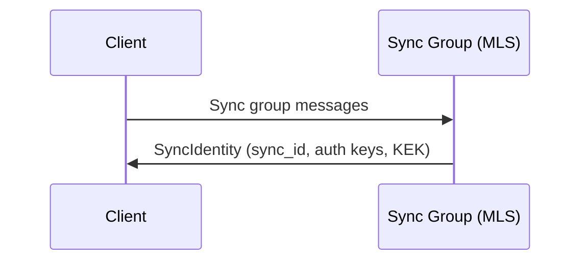

**Step 2: Sync Data from Server**

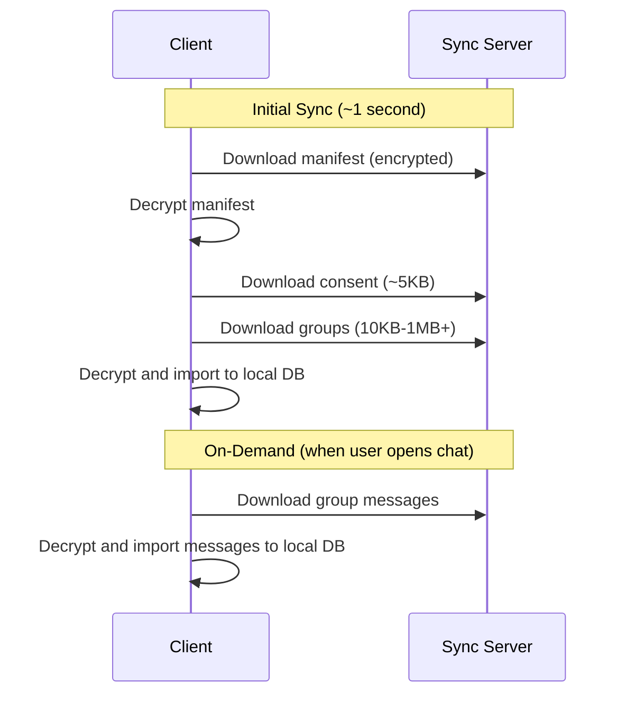

### Key Improvement Summary

| Aspect                    | Current                   | Proposed                                                               |
| ------------------------- | ------------------------- | ---------------------------------------------------------------------- |
| Initial sync time         | Potentially minutes       | < 1 second                                                             |
| Initial sync size         | Entire history            | Metadata only (varies by group count/metadata size)                    |
| Message loading           | All at once               | Per-conversation, on-demand                                            |
| Server identity knowledge | Anonymous uploads         | Opaque sync_id with auth                                               |
| Archive encryption key    | Random per-request        | Derived KEK shared via MLS sync group; rotated on installation changes |
| Incremental updates       | No                        | Yes                                                                    |
| Resumable downloads       | No                        | Yes (byte-range support)                                               |
| Resumable uploads         | No                        | Yes                                                                    |
| Forward secrecy           | Yes (random key per sync) | Yes (KEK rotated on installation changes)                              |
| Transfer size visibility  | Unknown until complete    | Exact sizes known upfront for bandwidth planning                       |
| API control               | Opaque background worker  | Explicit function calls with error handling                            |

### User Experience Improvements

1. **Instant conversation list** - See all chats in < 1 second
2. **Progressive loading** - Messages load when you open a conversation
3. **Low bandwidth** - Only downloads what you need
4. **Resumable downloads** - Interrupted transfers resume from last position, not restart
5. **Error visibility** - Sync failures are surfaced to the user with actionable feedback

### Developer Experience Improvements

1. **Explicit control** - All sync operations triggered via function calls
2. **Error handling** - Functions return `Result<T, E>` for proper error propagation
3. **Progress callbacks** - Optional callbacks for upload/download progress
4. **Cancellation support** - Ability to cancel in-progress sync operations
5. **Predictable behavior** - No surprising background activity or hidden state changes

---

## Architecture Overview

```mermaid
graph TB
    subgraph "Client (Installation)"
        LS[Local Storage]
        SC[Sync Client]
        MLS[MLS Sync Group]
    end

    subgraph "Sync Server (Flat Storage)"
        MA[{sync_id}.manifest]
        BS[{content_hash} blobs]
    end

    SC -->|"sync_id"| MA
    SC -->|"content_hash"| BS

    MLS -->|"Sync Identity<br/>KEK, auth keys"| SC
```

### Core Components

1. **Sync Identity** - Random ID + auth keypair, distributed via MLS sync group
2. **Encrypted Manifest** - Stored as `{sync_id}.manifest`, index of all archives with content hashes
3. **Content-Addressed Blobs** - Stored by content hash, shared across all users
4. **Key Encryption Key (KEK)** - Wraps individual archive keys, rotated on installation changes

### Public API

```rust
impl SyncClient {
    // ============ Download Operations ============

    /// Download manifest from sync server.
    /// Required for syncing consent, groups, and messages.
    pub async fn download_manifest(&self) -> Result<SyncManifest, SyncError>;

    /// Download and import consent records.
    pub async fn sync_consent(
        &self,
        manifest: &SyncManifest,
    ) -> Result<SyncDownloadResult, SyncError>;

    /// Download and import group metadata (names, settings, etc.).
    pub async fn sync_groups(
        &self,
        manifest: &SyncManifest,
    ) -> Result<SyncDownloadResult, SyncError>;

    /// Download and import messages for a specific group.
    pub async fn sync_group_messages(
        &self,
        group_id: &GroupId,
        manifest: &SyncManifest,
        opts: SyncDownloadOptions,
    ) -> Result<SyncDownloadResult, SyncError>;

    /// Download and import all message history for all groups.
    pub async fn sync_all_messages(
        &self,
        manifest: &SyncManifest,
        opts: SyncDownloadOptions,
    ) -> Result<SyncDownloadResult, SyncError>;

    /// Calculate the exact download size for a sync operation without downloading.
    /// Use this to inform users of bandwidth requirements before starting.
    pub fn calculate_download_size(
        &self,
        manifest: &SyncManifest,
        scope: SyncScope,
    ) -> SyncTransferSize;

    // ============ Upload Operations ============

    /// Upload local consent records to sync server.
    /// Call periodically or after consent changes.
    pub async fn upload_consent(&self) -> Result<SyncUploadResult, SyncError>;

    /// Upload local group metadata to sync server.
    /// Call periodically or after group changes.
    pub async fn upload_groups(&self) -> Result<SyncUploadResult, SyncError>;

    /// Upload messages for a specific group.
    /// Call periodically or after sending messages.
    pub async fn upload_group_messages(
        &self,
        group_id: &GroupId,
    ) -> Result<SyncUploadResult, SyncError>;

    /// Upload all pending changes (consent, groups, messages).
    /// Convenience method that calls all upload functions.
    pub async fn upload_all(&self) -> Result<SyncUploadResult, SyncError>;

    /// Resume any uploads that were interrupted (e.g., app killed, network lost).
    /// Call on app startup to complete partial uploads from previous session.
    pub async fn resume_pending_uploads(&self) -> Result<SyncResumeResult, SyncError>;

    /// Calculate the exact upload size for pending changes without uploading.
    /// Use this to inform users of bandwidth requirements before starting.
    pub async fn calculate_upload_size(&self) -> Result<SyncTransferSize, SyncError>;

    // ============ Identity Management ============

    /// Performs full identity rotation (triggered on installation add/revoke).
    ///
    /// Steps performed:
    /// 1. Generate completely new SyncIdentity (new sync_id, auth keypair, KEK)
    /// 2. Download and decrypt current manifest from server
    /// 3. Re-wrap all DEKs (consent, groups, all message archives) with new KEK
    /// 4. Encrypt manifest with new KEK
    /// 5. Send atomic rotation request to server (RotateRequest with old signature)
    /// 6. Handle response
    ///    - On success: Broadcast IdentityRotation message to sync group, update local sync_identity
    ///    - On ConcurrentRotation error: Another installation beat us; sync the group to get
    ///      their IdentityRotation message and process it instead
    ///    - On other errors: Propagate error to caller
    /// 7. Update local sync_identity to new identity
    pub async fn rotate_identity(&self) -> Result<(), SyncError>;

    /// Get current sync status and statistics.
    pub fn status(&self) -> SyncStatus;

    // ============ Data Management ============

    /// Delete all sync data from the server (manifest and all blobs).
    /// This is a destructive operation - other installations will lose access to
    /// synced history until data is re-uploaded.
    /// Local data is NOT affected.
    pub async fn delete_all_server_data(&self) -> Result<(), SyncError>;

    /// Get detailed breakdown of sync storage usage on the server.
    /// Requires downloading the manifest to compute sizes.
    pub async fn storage_usage(&self) -> Result<SyncStorageUsage, SyncError>;
}

/// Options for download operations
pub struct SyncDownloadOptions {
    /// Only download messages after this timestamp
    pub after_ns: Option<i64>,
    /// Only download messages before this timestamp
    pub before_ns: Option<i64>,
    /// Progress callback (bytes_transferred, total_bytes)
    pub on_progress: Option<Box<dyn Fn(u64, u64) + Send>>,
    /// Cancellation token
    pub cancel_token: Option<CancellationToken>,
}

/// Scope of a sync operation for size calculation
pub enum SyncScope {
    /// Just consent records
    Consent,
    /// Just group metadata
    Groups,
    /// Messages for a specific group
    GroupMessages(GroupId),
    /// All messages for all groups
    AllMessages,
    /// Everything (consent + groups + all messages)
    Everything,
}

/// Transfer size information for bandwidth planning
pub struct SyncTransferSize {
    /// Total bytes to transfer
    pub total_bytes: u64,
    /// Breakdown by category
    pub consent_bytes: u64,
    pub groups_bytes: u64,
    pub messages_bytes: u64,
    /// Number of archives involved
    pub archive_count: u64,
}

/// Result of a sync operation
pub struct SyncDownloadResult {
    /// Number of records imported
    pub records_imported: u64,
    /// Number of records skipped
    pub records_skipped: u64,
    /// Bytes downloaded
    pub bytes_downloaded: u64,
}

pub struct SyncUploadResult {
    /// Number of records uploaded
    pub records_uploaded: u64,
    /// Bytes uploaded
    pub bytes_uploaded: u64,
    /// Whether manifest was updated
    pub manifest_updated: bool,
}

pub struct SyncResumeResult {
    /// Number of uploads successfully resumed and completed
    pub resumed: u64,
    /// Number of uploads that could not be resumed (will need to re-upload)
    pub failed: u64,
    /// Total bytes uploaded during resume
    pub bytes_uploaded: u64,
}

pub struct SyncStatus {
    /// Whether sync identity is initialized
    pub is_initialized: bool,
    /// Last successful manifest download
    pub last_manifest_sync_ns: Option<i64>,
    /// Number of groups with pending message uploads
    pub groups_pending_upload: u64,
    /// Total bytes pending upload
    pub bytes_pending_upload: u64,
}

/// Detailed breakdown of sync storage usage on the server
pub struct SyncSyncStorageUsage {
    /// Size of encrypted manifest
    pub manifest_bytes: u64,
    /// Size of consent archive
    pub consent_bytes: u64,
    /// Size of groups archive
    pub groups_bytes: u64,
    /// Total size of all message archives
    pub messages_total_bytes: u64,
    /// Per-group message storage breakdown
    pub messages_by_group: HashMap<GroupId, GroupSyncStorageUsage>,
    /// Total storage across all categories
    pub total_bytes: u64,
}

/// Storage usage for a single group's messages
pub struct GroupSyncStorageUsage {
    /// Total bytes for this group's message archives
    pub total_bytes: u64,
    /// Number of message archives for this group
    pub archive_count: u64,
    /// Total message count across all archives
    pub message_count: u64,
    /// Time range covered by archives
    pub time_range_start_ns: i64,
    pub time_range_end_ns: i64,
}

/// Client configuration for sync behavior
pub struct SyncConfig {
    /// When enabled, automatically upload local changes when a peer requests sync
    /// via the sync group. This ensures new installations get fresh data.
    /// Default: false (developer must explicitly call upload_all)
    pub auto_upload_on_request: bool,

    /// When enabled, periodically upload in the background at the specified interval.
    /// This keeps the server up-to-date for faster new device onboarding.
    /// Default: None (no automatic uploading)
    pub auto_upload_interval: Option<Duration>,

    /// Threshold for considering server data "stale". When downloading manifest,
    /// if last_updated_ns is older than this, the manifest is marked as stale.
    /// Default: 24 hours
    pub stale_threshold: Duration,
}

impl Default for SyncConfig {
    fn default() -> Self {
        Self {
            auto_upload_on_request: false,
            auto_upload_interval: None,
            stale_threshold: Duration::from_secs(24 * 60 * 60),
        }
    }
}
```

### Handling Stale Syncs

A sync is considered "stale" when the server's manifest hasn't been updated recently. This occurs when active installations haven't uploaded their latest changes.

**Scenario:** Installation A has been active for a month without uploading. Installation B (new) syncs from the server but doesn't get the latest data.

**Solution:** Sync from server immediately, then request updates from peers if stale.

```rust
impl SyncManifest {
    /// Returns true if the manifest is older than the given threshold.
    /// Compares (now_ns - last_updated_ns) against threshold.as_nanos().
    pub fn is_stale(&self, threshold: Duration) -> bool;
}

impl SyncClient {
    /// Sends a SyncUpdateRequest message to the MLS sync group.
    /// All peer installations will receive this request.
    /// Peers with auto_upload_on_request enabled will respond by calling upload_all().
    /// Returns immediately after sending; peer uploads happen asynchronously.
    pub async fn request_update_from_peers(&self) -> Result<(), SyncError>;
}
```

**Flow for new installation:**

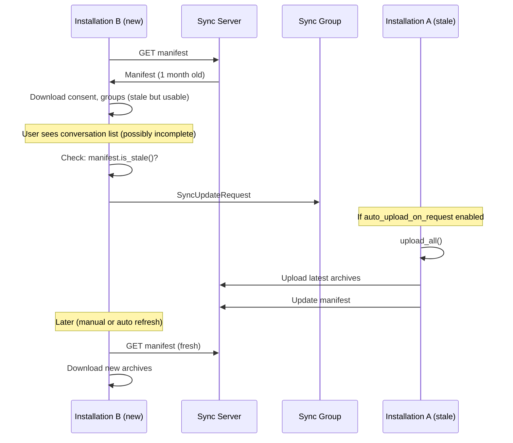

**Sync group message for update requests:**

```rust
pub enum SyncMessage {
    // ... existing variants ...

    /// Request peers to upload their latest changes to the server.
    /// Sent when a new installation detects stale server data.
    SyncUpdateRequest {
        /// Installation ID of the requester
        requester_id: Vec<u8>,
        /// Timestamp of the stale manifest (so peers know what's needed)
        manifest_timestamp_ns: i64,
    },
}
```

**Handling the request (responder side):**

```rust
impl SyncClient {
    /// Handles incoming SyncUpdateRequest from a peer installation.
    ///
    /// Behavior:
    /// 1. If auto_upload_on_request is disabled in config, ignores the request and returns Ok.
    /// 2. Compares local last_change_timestamp_ns against request.manifest_timestamp_ns.
    /// 3. If local data is newer, calls upload_all() to upload latest changes.
    /// 4. Returns Ok(()) regardless of whether upload was triggered.
    async fn handle_sync_update_request(&self, request: SyncUpdateRequest) -> Result<()>;
}
```

---

## Privacy Model

### Opaque Sync Identity

Instead of using `inbox_id` (which links to on-chain identity), we generate a random `sync_id` that is:

- Completely unlinkable to XMTP identity
- Distributed only via MLS-encrypted sync group
- Rotated on every installation change

```rust
struct SyncIdentity {
    /// Random 32-byte identifier - no connection to inbox_id
    sync_id: [u8; 32],

    /// Ed25519 keypair for authenticating with sync server
    auth_keypair: Ed25519Keypair,

    /// Current Key Encryption Key for archives
    kek: [u8; 32],
    kek_version: u64,

    /// Creation timestamp
    created_at_ns: i64,
}
```

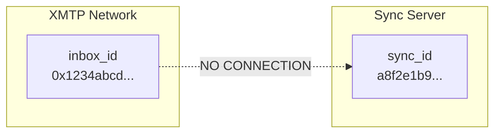

### Encrypted Manifest

The manifest contains sensitive metadata that must be protected:

```rust
/// Stored on server - encrypted, opaque to server
struct EncryptedManifest {
    /// DEK for manifest, wrapped with KEK
    wrapped_manifest_dek: Vec<u8>,

    /// KEK version (so client knows which KEK)
    kek_version: u64,

    /// Encrypted manifest blob (AES-256-GCM)
    ciphertext: Vec<u8>,
    nonce: [u8; 12],
}

/// Decrypted manifest - only client sees this
struct Manifest {
    inbox_id: String,
    last_updated_ns: i64,

    /// Consent and groups archives
    consent: ArchiveEntry,
    groups: ArchiveEntry,

    /// Per-group message archives
    /// Group IDs only visible after decryption
    group_messages: HashMap<GroupId, Vec<MessageArchiveEntry>>,
}

struct ArchiveEntry {
    /// SHA-256 hash of encrypted blob (used to fetch from server)
    content_hash: [u8; 32],

    /// DEK wrapped with KEK
    wrapped_dek: Vec<u8>,

    /// Metadata
    size_bytes: u64,
    created_at_ns: i64,
}

struct MessageArchiveEntry {
    /// SHA-256 hash of encrypted blob (used to fetch from server)
    content_hash: [u8; 32],
    /// Data Encryption Key wrapped with KEK
    wrapped_dek: Vec<u8>,
    /// Size of the encrypted blob in bytes
    size_bytes: u64,
    /// Timestamp when this archive was created
    created_at_ns: i64,

    /// Earliest message timestamp in this archive
    time_range_start_ns: i64,
    /// Latest message timestamp in this archive
    time_range_end_ns: i64,
    /// Number of messages in this archive
    message_count: u64,
}
```

### Content-Addressed Storage

Manifests are stored with sync_id prefix, blobs are stored by content hash (shared globally):

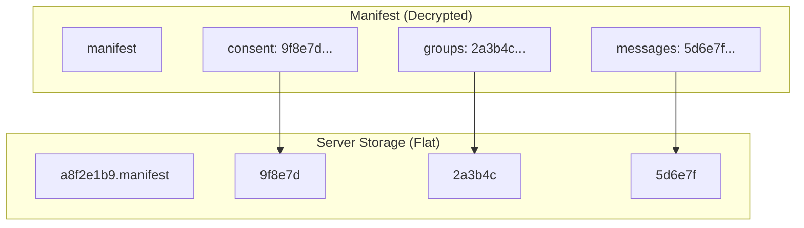

### Server's View

The server sees only:

| Data            | Server Can See              | Server Cannot See                           |
| --------------- | --------------------------- | ------------------------------------------- |
| Sync ID         | ✓ Manifest filename prefix  | ✗ Real identity (inbox_id)                  |
| Manifest        | ✓ Opaque blob               | ✗ Group IDs, message counts                 |
| Blobs           | ✓ Content hash filenames    | ✗ Contents, who owns them                   |
| Access patterns | ✓ Which files downloaded    | ✗ What that data represents                 |

---

## Key Management

### Key Hierarchy

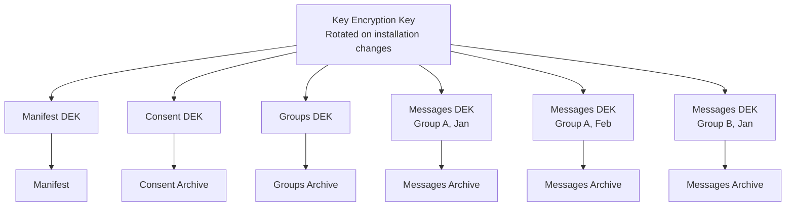

### Key Wrapping

Each archive has a unique, random Data Encryption Key (DEK). The DEK is wrapped (encrypted) with the KEK:

```rust
/// Creates an encrypted archive from plaintext data.
///
/// Steps performed:
/// 1. Generate random 32-byte DEK
/// 2. Generate random 12-byte nonce
/// 3. Encrypt data with AES-256-GCM using DEK and nonce
/// 4. Wrap DEK with KEK using AES key wrap (RFC 3394)
/// 5. Return EncryptedArchive (nonce + ciphertext) and ArchiveEntry (metadata + wrapped DEK)
fn create_archive(data: &[u8], kek: &[u8]) -> (EncryptedArchive, ArchiveEntry);

/// Decrypts an encrypted archive using wrapped DEK and KEK.
///
/// Steps performed:
/// 1. Unwrap DEK from wrapped_dek using KEK (AES key unwrap)
/// 2. Decrypt ciphertext with AES-256-GCM using DEK and archive.nonce
/// 3. Return plaintext bytes
fn decrypt_archive(archive: &EncryptedArchive, wrapped_dek: &[u8], kek: &[u8]) -> Vec<u8>;
```

### Key Rotation

Key rotation occurs when installations are added or revoked:

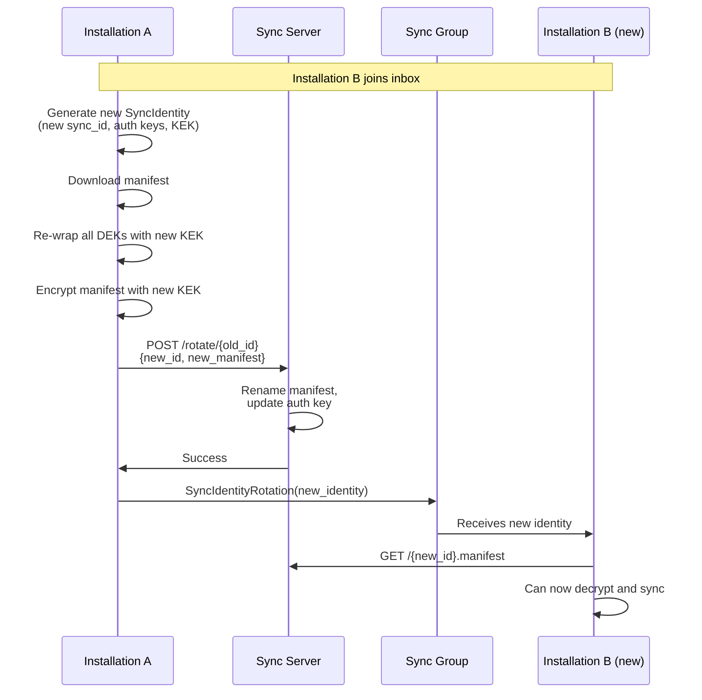

**Rotation is efficient:**

- Archives (blobs) are NOT re-uploaded or moved (content-addressed, shared globally)
- Only the manifest is renamed and updated (~KB)
- Old manifest deleted, new manifest stored with new sync_id prefix

```rust
/// Rotates the sync identity to achieve forward secrecy.
///
/// Steps performed:
/// 1. Generate new SyncIdentity with fresh sync_id, auth_keypair, and KEK
/// 2. Download and decrypt current manifest using old KEK
/// 3. Re-wrap all DEKs (consent, groups, and all message archives) with new KEK
/// 4. Encrypt manifest with new KEK
/// 5. Call server.rotate() (deletes old manifest, stores new manifest with new sync_id)
/// 6. Broadcast SyncIdentityRotation message to sync group so peers update
/// 7. Update local sync_identity to new identity
async fn rotate_sync_identity(&self, reason: RotationReason) -> Result<()>;

/// Unwraps a DEK using old_kek, then re-wraps it using new_kek.
/// Uses AES key wrap (RFC 3394) for both operations.
fn rewrap_dek(old_kek: &[u8], new_kek: &[u8], wrapped_dek: &mut Vec<u8>);
```

### Forward Secrecy

Forward secrecy ensures that compromising a current key doesn't expose past data:

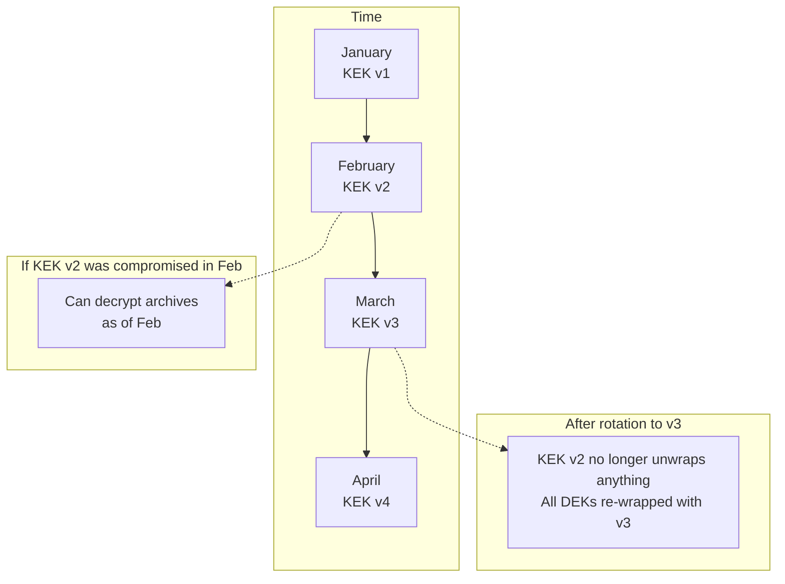

**How it works:**

1. Each archive has a unique random DEK
2. DEKs are wrapped with the current KEK
3. On rotation, all DEKs are re-wrapped with the new KEK
4. Old KEK is discarded
5. Attacker with old KEK cannot decrypt current archives

---

## Archive Format

### Granular Archives

Instead of one monolithic archive, data is split by type and scope:

```
# Manifests (one per sync_id)
{sync_id}.manifest            # Encrypted index (~2-5KB)

# Blobs (shared globally by content hash)
{content_hash_a}              # Consent archive (~5-20KB)
{content_hash_b}              # Groups archive (10KB-1MB+)
{content_hash_c}              # Messages for group_a/2024-01 (~100KB-2MB)
{content_hash_d}              # Messages for group_a/2024-02 (~100KB-2MB)
{content_hash_e}              # Messages for group_b/2024-01 (~100KB-2MB)
...
```

Storage model:

- Manifests are prefixed with sync_id (e.g., `a8f2e1b9.manifest`)
- Blobs are stored by content hash and shared across all users
- Content hashes are SHA-256 of the encrypted blob contents

### Archive Types

| Type     | Contents                                | Typical Size | Sync Priority |
| -------- | --------------------------------------- | ------------ | ------------- |
| Consent  | All consent records                     | 5-20 KB      | Immediate     |
| Groups   | All group metadata                      | 10KB-1MB+    | Immediate     |
| Messages | Messages for one group, one time period | 100KB-2MB    | On-demand     |

---

## Sync Flows

### Initial Sync

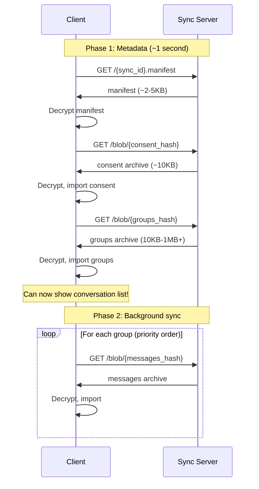

```rust
impl SyncClient {
    /// Performs fast initial sync of metadata only (consent + groups).
    ///
    /// Steps performed:
    /// 1. Download and decrypt manifest from server
    /// 2. Download consent blob using manifest.consent.content_hash, decrypt, import to local DB
    /// 3. Download groups blob using manifest.groups.content_hash, decrypt, import to local DB
    /// 4. Return SyncManifest for use in subsequent message sync operations
    ///
    /// Note: Manifest is not cached locally for security.
    pub async fn sync_metadata(&self) -> Result<SyncManifest>;
}
```

### On-Demand Message Sync

```rust
impl SyncClient {
    /// Loads messages for a specific group on-demand (called when user opens conversation).
    ///
    /// Requires manifest from prior sync_download_manifest() call.
    ///
    /// Steps performed:
    /// 1. Look up group_id in manifest.group_messages; return Ok if not found
    /// 2. Sort archives by time_range_end_ns descending (most recent first)
    /// 3. For each archive not already imported (checked via db.has_imported):
    ///    a. Download blob from server using archive.content_hash
    ///    b. Decrypt archive using unwrapped DEK
    ///    c. Import messages to local DB
    ///    d. Mark archive as imported to avoid re-downloading
    pub async fn sync_group_messages(
        &self,
        group_id: &GroupId,
        manifest: &SyncManifest,
    ) -> Result<()>;
}
```

### Resumable Downloads

Failed downloads can resume from the last successful byte position using HTTP Range requests:

```rust
impl SyncClient {
    /// Downloads a blob with HTTP Range resume support.
    ///
    /// Steps performed:
    /// 1. Check for existing partial download at {cache_dir}/{hash}.partial
    /// 2. If partial exists, read it and set start_byte = buffer.len()
    /// 3. Send GET request with "Range: bytes={start_byte}-" header if resuming
    /// 4. Handle response status:
    ///    - 200 OK: Full response, replace buffer with response body
    ///    - 206 Partial Content: Append response body to existing buffer
    ///    - 416 Range Not Satisfiable: Partial invalid, clear buffer and retry full download
    /// 5. Verify SHA-256 hash of complete buffer matches content_hash
    /// 6. Delete partial file on success, return buffer
    async fn download_blob_resumable(&self, content_hash: &ContentHash) -> Result<Vec<u8>>;

    /// Downloads a blob with automatic progress checkpointing.
    ///
    /// Steps performed:
    /// 1. Check for existing partial download, resume from last byte if found
    /// 2. Stream response body in chunks
    /// 3. Every 256KB, save current buffer to {cache_dir}/{hash}.partial
    /// 4. On completion, verify SHA-256 hash matches content_hash
    /// 5. Delete partial file and return complete buffer
    ///
    /// This ensures progress is preserved even if download is interrupted.
    async fn download_blob_with_progress(&self, content_hash: &ContentHash) -> Result<Vec<u8>>;
}
```

This approach provides:

- **Automatic resume** - Partial downloads are saved and resumed on retry
- **Progress preservation** - Every 256KB is checkpointed to disk
- **Hash verification** - Content hash ensures integrity after resume
- **Graceful fallback** - Works even if server doesn't support Range requests

### Upload Flow

```rust
impl SyncClient {
    /// Uploads all local changes to the sync server.
    ///
    /// Steps performed:
    /// 1. Download and decrypt current manifest from server
    /// 2. Check if consent records changed since manifest.consent.created_at_ns:
    ///    - If changed, create encrypted consent archive, upload blob, update manifest entry
    /// 3. Check if groups changed since manifest.groups.created_at_ns:
    ///    - If changed, create encrypted groups archive, upload blob, update manifest entry
    /// 4. For each group with new messages since last sync:
    ///    - Create encrypted message archive, upload blob, update manifest entry
    /// 5. Encrypt and upload updated manifest
    pub async fn upload_changes(&self) -> Result<()>;

    /// Creates an encrypted message archive and uploads it to the server.
    ///
    /// Steps performed:
    /// 1. Serialize messages to bytes
    /// 2. Generate random 32-byte DEK
    /// 3. Generate random 12-byte nonce
    /// 4. Encrypt serialized data with AES-256-GCM using DEK and nonce
    /// 5. Compute SHA-256 content hash of ciphertext
    /// 6. Upload ciphertext blob to server (stored by content hash)
    /// 7. Create MessageArchiveEntry with:
    ///    - content_hash from step 5
    ///    - DEK wrapped with current KEK
    ///    - Metadata (size, time range, message count)
    /// 8. Return MessageArchiveEntry for manifest update
    async fn create_and_upload_message_archive(
        &self,
        group_id: &GroupId,
        messages: Vec<Message>,
    ) -> Result<MessageArchiveEntry>;
}
```

### Resumable Uploads

Failed uploads can be retried with automatic resume support:

```rust
/// Pending upload tracked in local database for resume support
#[derive(Serialize, Deserialize)]
struct PendingUpload {
    /// SHA-256 hash of the complete blob (for integrity verification)
    content_hash: [u8; 32],
    /// Total size of the blob in bytes
    total_size: u64,
    /// Path to locally cached encrypted blob (needed for resume if app restarts)
    local_cache_path: PathBuf,
    /// Timestamp when this upload was initiated (nanoseconds since epoch)
    started_at_ns: i64,
}

impl SyncClient {
    /// Uploads a blob with retry support.
    ///
    /// Steps performed:
    /// 1. Compute SHA-256 content hash of data
    /// 2. Check local DB for existing pending upload with same content_hash:
    ///    - If found, use cached blob
    ///    - If not found, cache blob locally and store PendingUpload record
    /// 3. Upload with retry logic (exponential backoff)
    /// 4. Delete PendingUpload record and local cache file on success
    /// 5. Return content_hash
    async fn upload_blob_resumable(&self, data: &[u8]) -> Result<ContentHash>;

    /// Resumes any pending uploads from previous sessions.
    ///
    /// Called on app startup to complete interrupted uploads.
    ///
    /// Steps performed:
    /// 1. Load all PendingUpload records from local DB
    /// 2. For each pending upload:
    ///    a. Check if local cache file still exists; if not, mark as failed and skip
    ///    b. Read cached blob and retry upload
    /// 3. Return SyncResumeResult with count of resumed vs failed uploads
    pub async fn resume_pending_uploads(&self) -> Result<SyncResumeResult>;
}
```

This approach provides:

- **Automatic resume** - Pending uploads tracked in local DB and resumed on next sync
- **Local caching** - Encrypted blob cached locally until upload completes
- **Retry with backoff** - Transient failures automatically retried

### Rotation Coordination

When a new installation joins or an existing one is revoked, exactly one installation must perform the rotation (update KEK, re-wrap DEKs, update server). We use **deterministic leader election** based on installation ID to avoid race conditions.

#### Leader Election Rules

1. **New installation joins**: The existing installation with the **lexicographically smallest installation_id** performs the rotation
2. **Installation revoked**: The remaining installation with the **lexicographically smallest installation_id** performs the rotation
3. **Only one installation**: That installation is always the leader

```rust
impl SyncClient {
    /// Determines if this installation should perform the rotation.
    ///
    /// Leader election logic:
    /// 1. Get list of active installations from sync group members
    ///    - For InstallationAdded: exclude the new installation (it can't lead its own onboarding)
    ///    - For InstallationRevoked: exclude the revoked installation
    /// 2. Sort installations by installation_id (lexicographically)
    /// 3. Return true if this installation has the smallest ID (is the leader)
    fn is_rotation_leader(&self, event: &SyncGroupEvent) -> bool;

    /// Handles sync group membership changes (installation added or revoked).
    ///
    /// Behavior:
    /// - On InstallationAdded: If is_rotation_leader() returns true, calls rotate_identity()
    ///   to generate new KEK and broadcast to all installations including the new one.
    ///   Non-leaders wait for IdentityRotation message from the leader.
    /// - On InstallationRevoked: If is_rotation_leader() returns true, calls rotate_identity()
    ///   to revoke forward secrecy (revoked installation can't decrypt new archives).
    ///   Non-leaders wait for IdentityRotation message from the leader.
    pub async fn handle_membership_change(&self, event: SyncGroupEvent) -> Result<()>;
}
```

#### Handling Leader Failures

If the leader fails to perform rotation (crashes, goes offline), other installations need a fallback:

```rust
impl SyncClient {
    /// Checks if rotation is overdue and takes over leadership if needed.
    ///
    /// Called periodically (e.g., on app foreground, after sync).
    ///
    /// Behavior:
    /// 1. Compare last_membership_change_ns with last_rotation_ns from local DB
    /// 2. If membership changed more recently than last rotation:
    ///    - Calculate elapsed time since membership change
    ///    - If elapsed > 30 seconds, rotation is overdue
    ///    - Call should_take_over_rotation() to check if we should become leader
    ///    - If yes, call rotate_identity() to perform the rotation
    pub async fn check_rotation_timeout(&self) -> Result<()>;

    /// Determines if this installation should take over rotation leadership.
    ///
    /// Steps performed:
    /// 1. Sync the sync group to get latest messages
    /// 2. Check if an IdentityRotation message was received since the membership change;
    ///    if so, return false (rotation already happened)
    /// 3. Get list of currently online installations (those that responded to ping recently)
    /// 4. Return true if this installation has the smallest ID among online installations
    async fn should_take_over_rotation(&self) -> Result<bool>;
}
```

#### Summary

| Scenario                     | Who Rotates                        | Fallback                               |
| ---------------------------- | ---------------------------------- | -------------------------------------- |
| New installation joins       | Smallest existing installation_id  | Timeout + re-election among online     |
| Installation revoked         | Smallest remaining installation_id | Timeout + re-election among online     |
| Leader fails mid-rotation    | Server rejects duplicate           | Next smallest takes over after timeout |
| Concurrent rotation attempts | First to commit wins               | Others sync to get new identity        |

#### Offline Installation Recovery

If an installation is offline during a KEK rotation, it needs a way to recover the current sync identity when it comes back online.

**Primary mechanism: Sync group message history**

The MLS sync group persists all messages indefinitely in the local database (`group_messages` table) with no built-in TTL or expiration. When an offline installation syncs the group, it receives all missed messages including `IdentityRotation` messages. This is the expected recovery path for most scenarios:

```rust
impl SyncClient {
    /// Recovers sync identity after being offline.
    ///
    /// Called on app startup or when coming back online.
    ///
    /// Steps performed:
    /// 1. Sync the sync group to receive any missed messages
    /// 2. Query for all messages after last_processed_sync_message_ns
    /// 3. Iterate through messages in order, processing IdentityRotation messages
    ///    by calling handle_identity_rotation() to update local SyncIdentity
    /// 4. Mark each processed message in local DB to avoid reprocessing
    pub async fn recover_after_offline(&self) -> Result<()>;
}
```

**Fallback: Request identity from peers**

In rare edge cases (sync group recreated, database corruption, or messages manually deleted), an installation may fail to decrypt the manifest. In this case, it can request the current identity from online peers:

```rust
/// Additional SyncMessage variants for identity recovery
#[derive(Serialize, Deserialize)]
pub enum SyncMessage {
    // ... existing variants ...

    /// Request current sync identity (sent by installation that missed rotations)
    IdentityRequest {
        /// Installation ID of the requester
        requester_id: Vec<u8>,
    },

    /// Response with current sync identity (sent by leader to requesting installation)
    IdentityResponse {
        /// Full current sync identity (sync_id, auth keys, KEK)
        identity: SyncIdentity,
        /// Target installation ID (only this installation should process the response)
        target_installation_id: Vec<u8>,
    },
}

impl SyncClient {
    /// Requests current identity from peers when local KEK is stale.
    ///
    /// Called when manifest decryption fails with InvalidKey error.
    ///
    /// Steps performed:
    /// 1. Log warning about stale KEK
    /// 2. Send IdentityRequest message to sync group with this installation's ID
    /// 3. Wait up to 30 seconds for IdentityResponse message
    /// 4. Call handle_identity_response() to update local SyncIdentity
    pub async fn request_current_identity(&self) -> Result<()>;

    /// Handles incoming IdentityRequest from a peer.
    ///
    /// Behavior:
    /// - Uses leader election (smallest installation ID excluding requester) to determine responder
    /// - If this installation is not the leader, returns Ok without responding
    /// - If leader, sends IdentityResponse with current sync_identity to the requester
    async fn handle_identity_request(&self, requester_id: &[u8]) -> Result<()>;

    /// Downloads manifest with automatic KEK recovery on failure.
    ///
    /// Steps performed:
    /// 1. Fetch encrypted manifest from server
    /// 2. Attempt to decrypt with current KEK
    /// 3. If decryption succeeds, return manifest
    /// 4. If InvalidKey error, call request_current_identity() to get updated KEK from peers,
    ///    then retry manifest download and decryption
    /// 5. Propagate other errors to caller
    async fn download_manifest_with_recovery(&self) -> Result<Manifest>;
}
```

**Recovery flow diagram:**

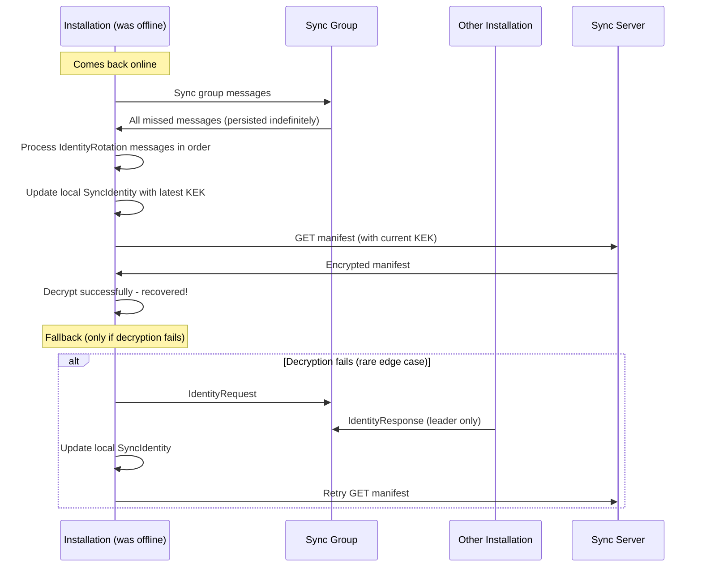

**Edge case: All other installations offline**

If the recovering installation can't reach any peers, it must wait until another installation comes online. The sync server only stores encrypted data it cannot read, so it cannot help directly.

As a last resort, if the user has only one installation and somehow lost the KEK, they would need to:

1. Create a new sync identity from scratch
2. Re-upload all data from local storage
3. This is essentially starting fresh for sync (local data is not lost)

### Handling Rotation Messages

When an installation receives a rotation message via the sync group, it updates its local sync identity. Since the manifest is not cached (fetched fresh each time), there's no cache invalidation needed.

- **SyncIdentity**: New installation joining; store the full identity in local DB
- **IdentityRotation**: Another installation rotated; construct new SyncIdentity from provided fields (deriving public key from private), store in local DB, log info
- **KekRotation**: KEK-only rotation (same sync_id); update just the KEK and version in DB

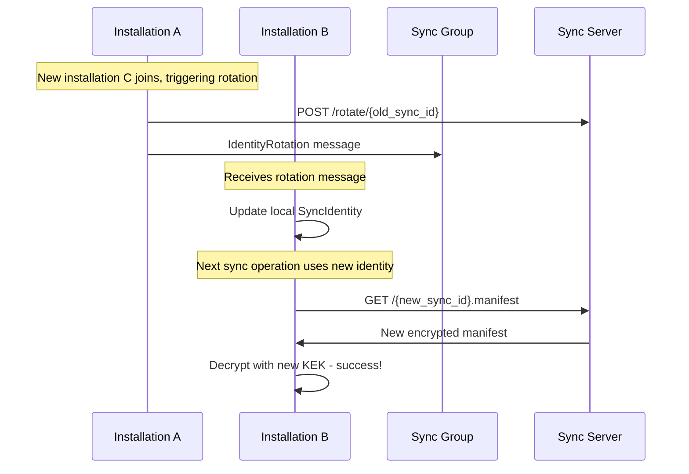

Since the manifest is always fetched fresh from the server (not cached locally), rotation handling is simplified:

- No cache invalidation needed
- No stale data concerns
- Better security (no sensitive metadata in local DB which may be unencrypted)

---

## Server API

```
┌─────────────────────────────────────────────────────────────────┐
│  Sync Server API                                                │
├─────────────────────────────────────────────────────────────────┤
│                                                                 │
│  Storage Model (Flat):                                          │
│  - Manifests: {sync_id}.manifest (one per user)                 │
│  - Blobs: {content_hash} (shared globally)                      │
│  - All files are encrypted blobs opaque to server               │
│                                                                 │
│  Authentication: Ed25519 signature on request                   │
│                                                                 │
│  ─────────────────────────────────────────────────────────────  │
│                                                                 │
│  POST /register                                                 │
│    Body: { sync_id, auth_public_key }                           │
│    → Registers sync_id with auth_public_key                     │
│                                                                 │
│  GET /{sync_id}.manifest                                        │
│    → Returns encrypted manifest                                 │
│                                                                 │
│  GET /blob/{content_hash}                                       │
│    Headers: Range (optional, e.g., "bytes=1024-2047")           │
│    → Returns blob by content hash                               │
│    → Response includes Content-Length, Accept-Ranges: bytes     │
│                                                                 │
│  PUT /{sync_id}.manifest                                        │
│    Body: encrypted manifest blob                                │
│    → Stores/updates manifest                                    │
│                                                                 │
│  PUT /blob/{content_hash}                                       │
│    Body: encrypted blob                                         │
│    → Stores blob (content-addressed, deduplicated)              │
│                                                                 │
│  POST /rotate/{old_sync_id}                                     │
│    Body: {                                                      │
│      new_sync_id,                                               │
│      new_auth_public_key,                                       │
│      new_manifest                                               │
│    }                                                            │
│    → Deletes {old_sync_id}.manifest                             │
│    → Stores {new_sync_id}.manifest                              │
│    → Updates auth_public_key                                    │
│                                                                 │
│  DELETE /{sync_id}.manifest                                     │
│    → Deletes manifest only (blobs are shared, not deleted)      │
│                                                                 │
└─────────────────────────────────────────────────────────────────┘
```

### Server Implementation (Rotation)

```rust
impl SyncServer {
    /// Performs atomic identity rotation with concurrency control.
    ///
    /// Steps performed:
    /// 1. Verify request signature using old account's auth_public_key
    /// 2. Load current manifest and check version matches request.expected_version;
    ///    if version mismatch, return ConcurrentRotation error (another installation already rotated)
    /// 3. Execute atomic transaction:
    ///    - Delete {old_sync_id}.manifest
    ///    - Store {new_sync_id}.manifest
    ///    - Update auth record (old_sync_id -> new_sync_id, new_auth_public_key)
    /// 4. Commit transaction
    ///
    /// Note: Blobs are not touched - they're content-addressed and shared globally.
    async fn rotate(&self, old_sync_id: &str, request: RotateRequest) -> Result<()>;
}
```

---

## Appendix: Data Structures

### Type Definitions

```rust
/// Sync identity - distributed via MLS sync group
#[derive(Clone, Serialize, Deserialize)]
pub struct SyncIdentity {
    /// Random opaque identifier used to authenticate with sync server (unlinkable to inbox_id)
    pub sync_id: [u8; 32],
    /// Ed25519 private key for signing requests to sync server
    pub auth_private_key: [u8; 32],
    /// Ed25519 public key registered with sync server for request verification
    pub auth_public_key: [u8; 32],
    /// Current Key Encryption Key used to wrap/unwrap DEKs for archives
    pub kek: [u8; 32],
    /// Monotonically increasing version number for KEK rotation tracking
    pub kek_version: u64,
    /// Timestamp when this identity was created (nanoseconds since epoch)
    pub created_at_ns: i64,
}

/// Encrypted manifest - stored on server (server cannot read contents)
#[derive(Serialize, Deserialize)]
pub struct EncryptedManifest {
    /// DEK encrypted with KEK - only clients with KEK can unwrap
    pub wrapped_dek: Vec<u8>,
    /// KEK version used to wrap the DEK (for rotation compatibility)
    pub kek_version: u64,
    /// AES-256-GCM nonce used for encryption
    pub nonce: [u8; 12],
    /// Encrypted Manifest struct (AES-256-GCM ciphertext)
    pub ciphertext: Vec<u8>,
}

/// Decrypted manifest - only client sees this (index of all archives)
#[derive(Serialize, Deserialize)]
pub struct Manifest {
    /// The inbox_id this manifest belongs to (for client-side verification)
    pub inbox_id: String,
    /// Timestamp of last manifest update (nanoseconds since epoch)
    pub last_updated_ns: i64,
    /// Archive entry for consent records (allowed/denied contacts)
    pub consent: ArchiveEntry,
    /// Archive entry for group metadata (names, members, settings)
    pub groups: ArchiveEntry,
    /// Map of group_id -> list of message archives for that group
    pub group_messages: HashMap<String, Vec<MessageArchiveEntry>>,
}

/// Archive entry in manifest (metadata for a single archive blob)
#[derive(Serialize, Deserialize)]
pub struct ArchiveEntry {
    /// SHA-256 hash of encrypted blob (used to fetch from server)
    pub content_hash: [u8; 32],
    /// Data Encryption Key wrapped with KEK (unwrap to decrypt archive blob)
    pub wrapped_dek: Vec<u8>,
    /// Size of the encrypted archive blob in bytes
    pub size_bytes: u64,
    /// Timestamp when this archive was created (nanoseconds since epoch)
    pub created_at_ns: i64,
}

/// Message archive entry with time range (extends ArchiveEntry with message-specific metadata)
#[derive(Serialize, Deserialize)]
pub struct MessageArchiveEntry {
    /// SHA-256 hash of encrypted blob (used to fetch from server)
    pub content_hash: [u8; 32],
    /// Data Encryption Key wrapped with KEK (unwrap to decrypt archive blob)
    pub wrapped_dek: Vec<u8>,
    /// Size of the encrypted archive blob in bytes
    pub size_bytes: u64,
    /// Timestamp when this archive was created (nanoseconds since epoch)
    pub created_at_ns: i64,
    /// Earliest message timestamp in this archive (for time-based filtering)
    pub time_range_start_ns: i64,
    /// Latest message timestamp in this archive (for time-based filtering)
    pub time_range_end_ns: i64,
    /// Number of messages contained in this archive
    pub message_count: u64,
}

/// Rotation request to server (atomic identity rotation)
#[derive(Serialize, Deserialize)]
pub struct RotateRequest {
    /// New random sync_id to replace the old one
    pub new_sync_id: [u8; 32],
    /// New Ed25519 public key for authenticating future requests
    pub new_auth_public_key: [u8; 32],
    /// New encrypted manifest blob (with re-wrapped DEKs)
    pub new_manifest: Vec<u8>,
    /// Ed25519 signature over request using OLD auth_private_key (proves ownership)
    pub signature: Vec<u8>,
}

/// Messages sent via MLS sync group (encrypted end-to-end between installations)
#[derive(Serialize, Deserialize)]
pub enum SyncMessage {
    /// Full identity broadcast (sent when a new installation joins the sync group)
    SyncIdentity(SyncIdentity),

    /// Full identity rotation (new sync_id, auth keys, and KEK - triggered on installation removal)
    IdentityRotation {
        /// New random sync_id (old one will be deleted from server)
        sync_id: [u8; 32],
        /// New Ed25519 private key for signing server requests
        auth_private_key: [u8; 32],
        /// New KEK for wrapping future DEKs
        kek: [u8; 32],
        /// Incremented version number for the new KEK
        kek_version: u64,
    },

    /// KEK-only rotation (same sync_id, used for periodic key refresh)
    KekRotation {
        /// New KEK for wrapping future DEKs (old DEKs re-wrapped server-side not needed)
        kek: [u8; 32],
        /// Incremented version number for the new KEK
        kek_version: u64,
    },
}
```

### Size Estimates

| Component          | Typical Size | Notes                                                                                                       |
| ------------------ | ------------ | ----------------------------------------------------------------------------------------------------------- |
| Manifest           | 2-10 KB      | Grows with number of groups/archives; contains content hashes for all blobs                                 |
| Consent archive    | 5-20 KB      | ~100 bytes per consent record                                                                               |
| Groups archive     | 10KB-1MB+    | ~500 bytes minimal, up to ~12KB max per group (name: 100B, description: 1KB, image_url: 2KB, app_data: 8KB) |
| Message archive    | 100KB-2MB    | Per group, per time period                                                                                  |
| Initial sync total | ~20KB-1MB+   | Manifest + consent + groups (varies significantly based on group count and metadata usage)                  |

### Performance Characteristics

| Operation             | Time (3G) | Time (WiFi) | Bandwidth |
| --------------------- | --------- | ----------- | --------- |
| Initial sync (groups) | 1-3 sec   | < 500ms     | ~100 KB   |
| Load one conversation | 2-5 sec   | < 1 sec     | 100KB-2MB |
| Full background sync  | 1-10 min  | 10-60 sec   | 10-100 MB |
| Identity rotation     | 1-2 sec   | < 500ms     | ~10 KB    |
| Upload new messages   | 1-3 sec   | < 500ms     | ~100 KB   |
