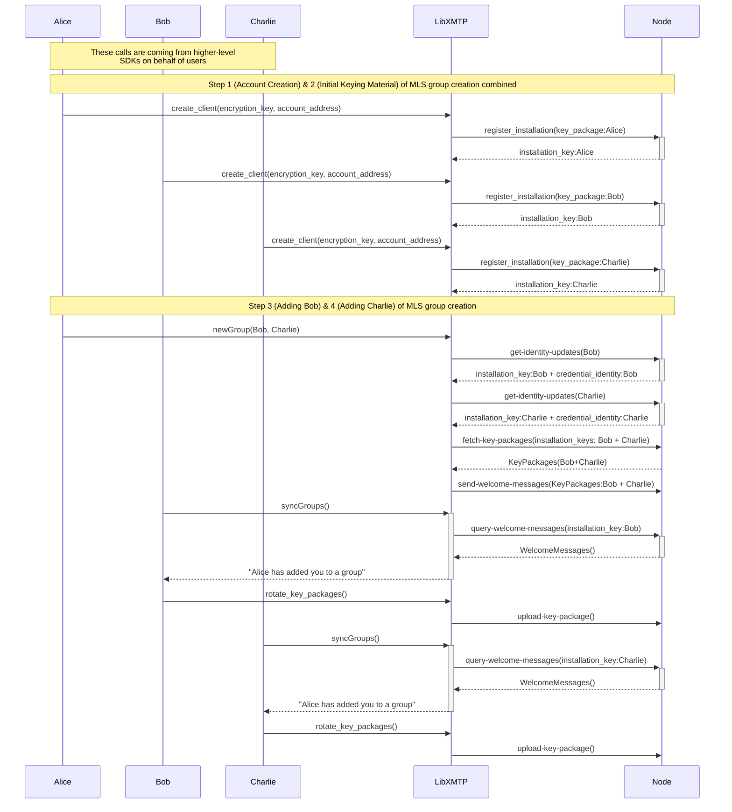
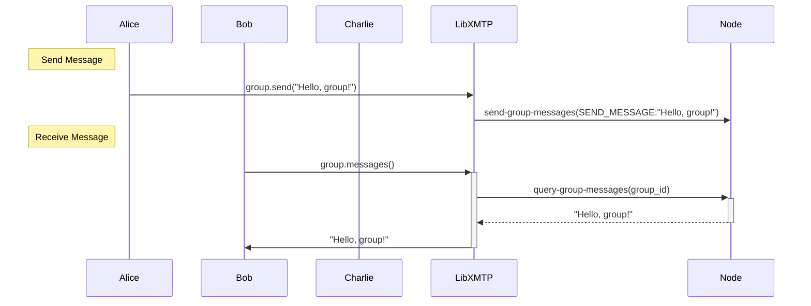
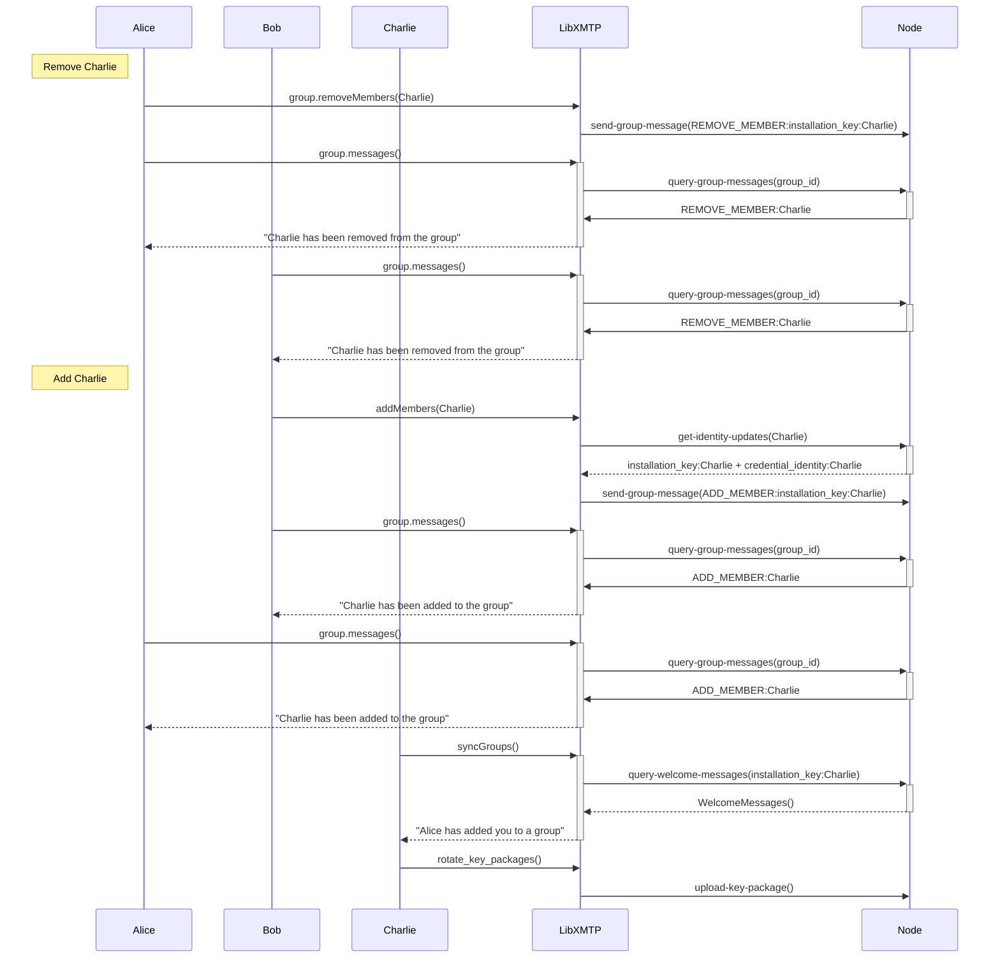
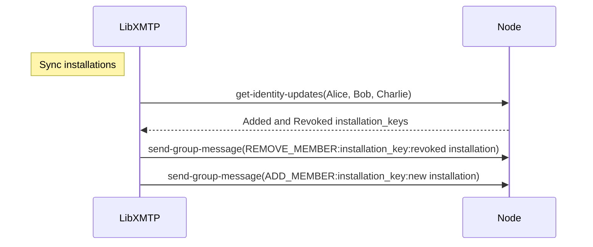

# Sequence Diagrams

The sequence diagrams stored here are for documenting LibXMTP's group chat implementation using MLS.  They are part of a work in progress but we are putting them here for transparency and to keep them current with the implementation.

The diagrams represent the creation of a group chat between Alice, Bob, and Charlie, our implmentation of [Figure 2](https://messaginglayersecurity.rocks/mls-architecture/draft-ietf-mls-architecture.html#fig-group-formation-example) from [The Messaging Layer Security (MLS) Architecture](https://messaginglayersecurity.rocks/mls-architecture/draft-ietf-mls-architecture.html) spec. 

* *form-group.mermaid* - Covers Steps 1-4 of forming a group.  In LibXMTP, steps 1 and 2 happen at the same time, and steps 3 and 4 can also be consolidated by calling `newGroup()` with multiple participants.
* *send-recieve.mermaid* - Covers sending and receiving messages to the newly formed group.
* *add-remove.mermaid* - Covers adding and removing group members.
* *sync-installations.mermaid* - Covers how to find out if group members have added/removed an installation, and how to respond.

## Forming a Group

## Send and Receive Messages

## Add and Remove Group Members

## Sync Installations

