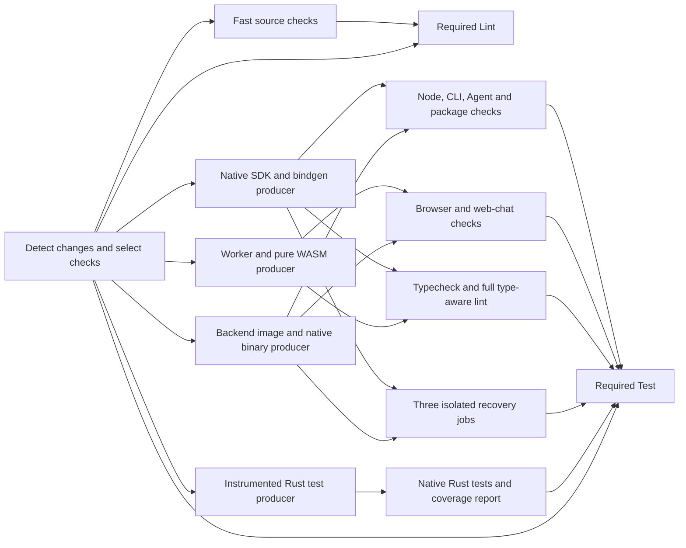

# CI time and cost reduction

Build SDK products once, then use the same products in each required check.
Keep fast source checks in `Lint`. Keep compiler checks, type checks, package
checks, and ordinary test cases in required PR `Test` jobs. Run the eight
recovery cases in isolated jobs after merge. This policy keeps their assertions
and deadlines, but detects recovery regressions after they reach the base branch.

This document records the research, approved plan, and implementation results.
The investigation branch is `codex/ci-efficiency-investigation`, based on
`self-hosted` commit `9bdea4ee226fbcea4963329a2c28ad4172bd4248`.
The implementation now changes the CI graph and build transport tools.
The timing and cost targets remain unproved. The branch was rebased on
`self-hosted` commit `98cb122ececabfc5b2505ea72ff5a73d77dc9207` before integration checks.

## Evidence and measurement

Conformance is outside the optimization scope, per the October 6 update.
The retiring facade and Swift conformance jobs are excluded. Relevant tests
have moved into SDK-specific suites through PRs #4419, #4421, #4424, and #4434.
Their migration is a separate effort;
this plan does not optimize or retain the retiring suite. Keep Android SDK
staging and public package checks in scope. Do not count suite retirement as
a saving from this plan, and measure migrated tests in their SDK owners.

Four research agents studied history, lint and docs, recovery, and build reuse.
The history sample has 60 push revisions from September 30 to October 6 and
40 PR revisions from October 5 to October 6. Times below use workflow creation
to aggregate completion. They include initial queue time. Successful runs
exclude cancellations; cost includes spent work from cancelled runs.

| Sample | Lint | Limit |
| --- | ---: | --- |
| Historical successful `self-hosted` pushes | 14.78 min, n=35 | CI changed during this period. |
| Historical successful PR runs | 17.90 min, n=21 | PR base is mostly inferred from branch metadata. |
| Latest setup, one successful push | 19.28 min | Only one successful sample after the latest SDK generation change. |

The stored historical Test totals include conformance and are not the revised
comparison baseline. In the latest successful push, the last remaining required
consumer was recovery. It finished 26.27 minutes after Test creation, and its
own job took 25.18 minutes. The old aggregate still waited for conformance;
26.27 minutes is the remaining-work completion bound, not an observed new
Test gate time. New SDK test migration costs are not available yet.

The PR cohort uses the run's PR base when available. Otherwise it matches the
run branch to PR metadata with base `self-hosted`. That inferred match is less
reliable than an explicit run association. Many runs were cancelled before
completion. A successful-run median alone has selection bias. Only 18 of
302 sampled PR run records have an explicit association; 284 use inferred
branch matches. Earlier attempts are missing for six unique rerun workflows. The original
collector saved 65 duplicate run rows as pagination moved. The corrected
analyzer counts each run and job once. Raw history remains unchanged. The
correction is in `docs/ci-efficiency-evidence/2026-10-06-dedup-correction.json`.

The latest completed sample is commit `c641aa07bf05d14557986e6ad4fc652f6ac3e07b`:
[Lint](https://github.com/xmtp/libxmtp/actions/runs/37527084214) and
[Test](https://github.com/xmtp/libxmtp/actions/runs/37527084705).
Commit `e09d535c17` changed SDK generation during the sample. Commit
`4e63f8edd5` limited automatic platform checks. Older platform costs must not
be counted as savings from this proposal.

Historical allocated cost is a lower bound. Excluding the retiring facade
and Swift conformance jobs, the same completed cohort has a median of 3,979.53
known core-minutes per push and 3,022.80 per PR revision. This is bookkeeping
exclusion of old jobs, not a measured post-migration baseline or a performance
saving. The migrated SDK test cost is not yet included. Unknown-capacity runner
time and earlier attempts still need measurement. The raw full-workflow
figures remain in the saved history and metrics for audit.

Here, core-minutes means assigned job duration multiplied by the vCPU count
in a Blacksmith runner label. It is a cost proxy, not measured CPU use or a
bill. Other runner capacities remain unknown. The history uses the latest
run attempt; older attempts can add cost. The cost scope includes automatic
checks, cache warming, docs, and automatic deployment builds at each revision.
Manual release runs are outside this scope.

Cancelled workflows consumed 35.8% of known push allocation and 53.3% of known
PR allocation. Keep current cancellation and stop obsolete consumers before
they build. Do not skip the newest revision's checks to make this number lower.

### Where the time goes

| Evidence | Measured result | Implication |
| --- | --- | --- |
| Three recent successful Lint pushes | JS job median 19m29s; SDK stage 13m38s; native Rust lint step 4m07s; WASM lint job 4m09s | Removing SDK preparation alone cannot put the existing Lint gate below three minutes. |
| [Node shard](https://github.com/xmtp/libxmtp/actions/runs/37527084705/job/112487092645) | Native build 215s; bindgen 259s; Node tests 20.33s; CLI tests 24.12s | Compilation dominates normal Node test cost. |
| [Browser shard](https://github.com/xmtp/libxmtp/actions/runs/37527084705/job/112487092953) | Four compiler stages total 706s; Browser tests 7.05s | Four shards repeat preparation for a very short test suite. This shard also runs web-chat checks. |
| [Recovery](https://github.com/xmtp/libxmtp/actions/runs/37527084705/job/112487092755) | Whole job 25m11s; test runtime 602.44s | Build reuse alone cannot make serial recovery finish in six minutes. |
| Ten successful recovery jobs | Median whole job 19m14.5s; four logs show test runtime 598–604s | Recovery's ten-minute runtime is stable across builds. |
| [Docs content push](https://github.com/xmtp/libxmtp/actions/runs/37516911677) | Compound site build 16m54s | A prose change still prepares SDK products. |

On the latest successful Test run, remaining in-scope known allocated cost
was 3,629.33 core-minutes. Browser shards used about 1,070; normal Node shards
452; recovery 403; Agent 217; Android staging 318. This is one run,
not a median. It shows why both build reuse and smaller execution runners
are needed.

## Source findings

- `dev/js/sdk-package` invokes direct Cargo generation. Public SDK tests and
  JS lint do not consume the existing generated Nix products.
- `crates/xmtp_sdk/dev/sdk-artifacts.py` uses separate Cargo target directories
  for native, bindgen, worker WASM, and pure WASM. Native and bindgen therefore
  repeat compatible dependency work. Outside conformance, broad Test runs build eight Linux native
  and eight bindgen copies, plus four worker and four pure copies. Lint and docs
  add further copies in separate workflows.
- Browser-only generation selects native even though Browser rendering uses
  worker and pure WASM. Both the dependency selection and the unconditional
  native read in rendering must change together.
- `pnpm-workspace.yaml` makes lint depend on package build. Typecheck builds
  dependencies. Within one runner, repeated generation usually reuses Cargo
  outputs, but it renders and stages again. Do not count each command as a
  fresh compile. Docs lint also invokes the site build through this task graph.
- Shared sticky disks do not share fresh Cargo outputs between these jobs.
  PR jobs use separate snapshots and cannot commit them. Preserve that trust
  rule. Do not add cache-write secrets to PR consumers.
- Cachix has a different current policy: setup enables authenticated writes
  when a token is supplied, and some same-repository PR callers inherit that
  token. There is no equivalent event guard in the setup action. The proposed
  product-cache boundary is stronger; it is not a claim that current Cachix
  writes already have the sticky-disk restriction. Check existing token callers
  and measure any loss of PR-to-push cache warming when adding that boundary.
- Debug public SDK, release mobile, instrumented release nextest, `wasm-test`,
  and SDK fixture feature builds are distinct. Existing release Nix products
  are not a direct substitute for debug SDK tests. Release uses `panic=abort`
  and can remove debug assertions.
- `XMTP_SDK_GENERATED_DIR` bypasses normal generation. Staging checks recorded
  bytes and contracts but does not compare source hashes with the checkout.
  Transported artifacts need an explicit source and compiler preflight.
- Both aggregate gates omit `detect-changes` from their dependencies. If
  detection fails and child checks skip, the final gate can pass. Existing
  selectors also have gaps for some generator, proto, and toolchain inputs.
  The new graph must close these gaps before it narrows any selection.

## Proposed graph

Use one orchestration workflow for source checks, products, and consumers.
Keep required check names `Lint` and `Test`. This allows artifacts to be shared
inside one run. Keep deployment jobs on their current trusted events.



The diagram omits separate native platform, validation, WASM Rust test,
backend acceptance, and docs lanes. Keep their existing obligations in the
required graph. A producer does not need to wait for unrelated products.

### 1. Fast Lint and required compiler checks

Keep source format, source lint, Markdown, config, proto, Rust format, and
manifest checks in Lint. Separate the source lint recipe from package build.
Move native all-feature Clippy, WASM Clippy, generated public type fixtures,
TypeScript checks, and full type-aware Oxlint to required Test consumers.
Keep every current rule and feature/target combination in those consumers.
Run type-aware checks only against current declarations. A fast pass must
not silently replace them with syntax-only checks.

Coverage loss: none if the same checks still block merge. Type errors arrive
with Test. Moving the checks changes feedback order; it does not itself save
cost. JS setup currently takes about 55s and format about 3s. A focused lint
environment avoids SDK, JVM, and WASM build dependencies. The three-minute
budget still needs a real run, including detection and queues.

### 2. Shared products and compatible compilation

First share current debug products. Add explicit CI debug Nix products, or
keep direct Cargo producers and cache their compatible dependency outputs.
Use a common Cargo target directory for compatible sequential native and
bindgen builds. Keep role receipts separate. Do not combine their packages
into one Cargo command until feature unification is checked. Never use two
concurrent Cargo writers on one directory.

Keep worker and pure artifacts distinct. Share only compatible dependency
compilation. Remove native from Browser-only production while preserving
native coverage in the Node and native checks.

A portable product contains generated roots, contract records, staged JS,
declarations, native/WASM bytes, worker files, and pinned runtime assets.
Its manifest binds run ID, attempt, merge checkout SHA, source and generator
hashes, OS, architecture, toolchain, target, profile, features, instrumentation,
dependency locks, compile context, and artifact byte hashes. Preserve modes
in a tar archive. Dereference runtime store links or transport their Nix
closure. A backend binary must include its runtime closure unless it is
proved static. Normalize absolute paths in raw artifact records.

Validate identities and bytes before each consumer starts. A missing or bad
artifact fails a selected consumer. Cache misses build current inputs.
Cache compilation, not test outcomes: each selected test must execute.
PR-produced outputs stay within the PR run and do not enter trusted release
caches. Trusted cache hits use complete input identity and existing trust
checks. An artifact named `latest-success` is not sufficient.

Coverage loss: none under these conditions. Stale receipts, wrong profiles,
or missing runtime files are the main risks. Existing mutation checks cover
some byte failures; new transport/source guards still need proof.

The producer interface is `target/ci-products/<family>.tar` plus
`target/ci-products/<family>.manifest.json`. Initial families are
`sdk-node-debug-linux-x64`, `sdk-browser-debug-wasm`,
`backend-linux-x64`, and `rust-native-coverage-linux-x64`. Keep SDK fixture
and native platform families separate when their contexts differ.
The manifest is a versioned JSON object with these required fields:

| Field | Type | Meaning |
| --- | --- | --- |
| `schemaVersion` | integer, `1` | Transport format version |
| `family` | string | Family named in the artifact filename |
| `runId`, `runAttempt` | positive integers | Producer run identity |
| `checkoutSha` | 40-character hex string | Tested checkout, including PR merge tree |
| `sourceHash`, `generatorHash` | SHA256 strings | Current complete provenance identities |
| `context` | object | `os`, `arch`, `host`, `target`, `profile`, `compilerIdentity`, `buildContextHash`, and `instrumentation` strings; sorted `features` string array; dependency-lock SHA256 map |
| `runtimes` | object | Required runtime revision and byte-hash records |
| `files` | object | Relative archive path to SHA256 map for every transported file |
| `testInventory` | string array | Collected IDs for test archives; empty for SDK products |

SDK consumers restore under `target/ci-products/<family>/`. They set
`XMTP_SDK_GENERATED_DIR` to its generated root after preflight. Complete
staged packages go under `target/sdk-packages/{node,browser}` and workspace
imports under `sdks/{node,browser}/dist`. Keep the existing `sdk-contract.json`
format and strict staged-package checks. The new transport manifest does not
replace either record. Reject archive paths that escape the destination.
Backend consumers use the transported closure/image with private services.
Coverage consumers retain the compiled archive and LLVM mapping data.

### 3. Recovery in isolated jobs

Retain all eight cases, both callback and iterator modes, every assertion,
all three graceful restart cycles, and the real production deadlines. Use
one process per job, with separate databases, S3 buckets, ports, and cleanup.
Set the real backend binary for drain cases. Without it, they test TCP EOF.

| Job | Exact case set | Summed runtime in four actual logs |
| --- | --- | ---: |
| A | Callback outbound blackhole and callback graceful drain | 211.6–212.9s |
| B | Iterator outbound blackhole and iterator graceful drain | 212.3–213.9s |
| C | Both modes of disconnect and inbound blackhole | 173.3–176.4s |

Use exact title filters or separate files. Vitest file sharding cannot divide
the current single file. Compare collected test IDs with a committed mapping:
each current case must appear exactly once. A new case without a mapping must
fail selection. Keep the two currently local-only budget tests explicit.

The first trial used the three groups above. Their complete jobs took
310s, 311s, and 278s. The candidate now uses eight jobs, with exactly one case
per job. This leaves more time for the SDK producer. At the measured 94s
setup cost per job, this adds about 31.3 core-minutes to recovery allocation.
The cases, one-worker setting, production deadlines, and restart cycles stay
unchanged. The eight-job result still needs a hosted run.

The first partition predicted a longest test step of 213s. That left 147s for the
producer dependency, queue, download, stack startup, tests' shared setup,
and teardown. This is a partition calculation, not a measured new job.
An unchanged seven-minute producer cannot meet this budget. Warm products or
much faster compatible compilation are necessary.

Try four-vCPU execution jobs after product reuse. With unchanged test times
and 100s overhead per job, recovery execution uses about 60 core-minutes,
compared with the old 308 median. Shared producer cost is additional.
Small-runner performance and stability must be measured before adoption.

Coverage loss: none from isolation and partitioning. Reject shorter wire
timeouts, fewer drain cycles, and replacing blackholes with disconnects.
Those changes remove distinct production behavior proofs.

### 4. Short test and Rust consumers

After products are ready, measure one Browser test consumer against four
current shards. Node, CLI, and Agent can use fewer four-vCPU consumers if all
tests still run. Keep services isolated when fixtures change service state.
Do not run recovery beside another suite on a shared mutable stack.

Conformance migration is outside this plan. Run public package smoke,
generated lint/type checks, and relevant moved tests in their SDK-specific
owners. Do not add replacement bridge, Kotlin JVM, Swift, or worker conformance
jobs here. Preserve feature identities for any codec or panic fixtures that
remain in the SDK-specific suites. Keep the current native and WASM coverage
profiles. Do not replace backend `cargo test` with nextest without fixing its
process-local replica test lock.

Use nextest archives only if shared instrumented compilation and transfer
beat the current graph. Retain mapping data and collect every shard's raw
profiles. Generate one coverage report after all selected shards complete.
Missing profiles or test IDs fail acceptance. Reusing a cached Nix test
result is not evidence that tests executed on this push.

Coverage loss: none from fewer jobs or separate execution. A generic target
cache that mixes profile/features can remove debug, panic, or coverage proof.

### 5. Docs, platform checks, and warming

For prose changes, reuse current SDK declarations/products by SDK input
identity. Build a new site and its real freshness stamp. Keep example checks,
Twoslash, composition, local links, browser tests, and accessibility checks.
No registry SDK substitution or mock declarations. A declaration-only output
needs parity against the shipped product before it replaces a full product.

Give language references conservative code/generator/config input maps.
Reuse unchanged references by content identity; changed interfaces regenerate
affected references before merge. Native references already skip PR runs;
that existing exclusion is not a new saving. Keep required local docs and
external-link checks before submission of docs changes.

Separate Android source format from Kotlin type analysis and JNI packaging.
Keep all ABI, AAR, emulator, minimum-API, native toolchain, and SDK-specific
checks that currently apply. Prove Android analysis without JNI before using
that optimization. Moving ABI tests to a nightly run would lose PR coverage.

Replace blanket `om ci run --include-all-dependencies` warming with trusted
warming of shared producer inputs. Retain every test/check output that blanket
warming currently executes in the required test graph or an equivalent
selected job first. Use per-output input identities to avoid rebuilding
unchanged languages. Keep deployment output and publication behavior intact.

Coverage loss: none with exact reuse and equivalent selected checks. Input
map errors are a risk. Keep broad selection on unknown or cross-cutting inputs.
Do not count moving work to another push workflow as a per-push saving.

## Options with coverage losses

| Option | Benefit | Coverage loss or limit | Decision |
| --- | --- | --- | --- |
| Run recovery after merge | Remove the live matrix from PR waits and allocation | Callback, iterator, half-open transport, and graceful restart regressions can merge before this matrix detects them. All eight cases remain after merge. | Adopt per the revised user policy. |
| Run mobile ABI checks only nightly | Large wall and cost reduction | Changed Rust dependencies can break platforms before merge. | Defer. Current required checks remain required. |
| Move all reference generation after merge | Cheaper docs PRs | Misses interface/example drift before merge. | Reject as default. Reuse exact unchanged references instead. |
| Use release products in current debug tests | Existing Nix substitution | Changes debug assertions and panic behavior. | Reject as direct replacement. |
| Use only syntax lint | Fast Lint | Removes type-aware safety rules and public-surface fixture checks. | Reject. Keep full checks in required Test. |
| Add shards before sharing builds | Shorter test execution path | No assertion loss, but more compilation and setup cost. | Reject ordering. Share products first. |
| Add conditional real budget-exhaustion CI | More proof for terminal/replacement changes | Adds about 18 minutes of existing local-only tests; no new loss | Separate improvement. Use the source map in `sdks/node/AGENTS.md`. |

Cold cache, toolchain/lock, generator/public interface, SDK fixture feature,
and platform input changes can take longer. These are recorded change classes,
not excuses to exclude slow normal runs from the median. Initially keep the
current test selection and broaden missing shared inputs. Narrow it only after
dependency and fixture input maps prove the omitted jobs cannot be affected.

## Kache assessment

Kache is a strong candidate for the SDK producer builds. It can cache eligible
Rust executable and linked-library outputs, while sccache cannot cache crates
that invoke the system linker. This matters for `xmtp-sdk-bindgen` and the
SDK's `cdylib` outputs. Most public SDK jobs currently enable neither cache.
Compare Kache with enabled sccache as well as the current uncached path; do
not attribute all compiler-cache benefit to choosing Kache.
[Kache comparison](https://ninja.kunobi.com/docs/kache/getting-started/comparison),
[sccache Rust limits](https://github.com/mozilla/sccache/blob/main/docs/Rust.md).

| Build area | Expected fit | Limit |
| --- | --- | --- |
| Native SDK and bindgen | High priority: repeated compatible compiler and linker work | Changed crate/dependency inputs still miss. Validate the mixed `lib`, `cdylib`, `staticlib` invocation. |
| Worker and pure WASM | High priority: compatible dependency work across isolated target directories | Keep full/pure features distinct. No same-output assumption. |
| Rust Clippy | Trial candidate | Prove diagnostics replay and actual eligible work; do not infer a speedup from SDK builds. |
| Instrumented nextest | Later qualification | Coverage keys retain real paths, which limits cross-checkout reuse. |
| Nix package builds | No automatic benefit from setting the outer job wrapper | The derivation must contain the wrapper and reach the chosen store safely. Keep Nix/Cachix output reuse first. |
| Rendering, staging, docs/site, service startup, recovery timers | No direct benefit | Kache wraps compiler invocations, not arbitrary build commands or test execution. |

Kache normalizes equivalent workspace and target paths, which can help our
separate native/bindgen/worker/pure target directories. Coverage uses a separate
path-local key space. A shared producer still removes more work: one cache
hit per crate in every shard costs more than transporting one finished product.
Keep Kache below the producer/consumer graph, rather than using it as a reason
to rebuild products independently in each suite.
[Cache-key rules](https://ninja.kunobi.com/docs/kache/how-it-works/cache-key),
[Interception boundary](https://ninja.kunobi.com/docs/kache/how-it-works/architecture).

### Integration decisions for a trial

Use a pinned Kache release and action commit after Nix setup, so setup's
sccache option cannot replace `RUSTC_WRAPPER`. Verify the effective wrapper
inside `dev/nix-shell` and `dev/agent-run`. Set `cache-executables: true` and
`pr-comment: false` explicitly. The Action input defaults to false, but current
setup only exports the executable-cache override for true; a false input can
leave the binary's platform default in effect. The trial must not depend on
that ambiguity. Inspect the pinned action's behavior, not only its input text.
[Action inputs](https://github.com/kunobi-ninja/kache-action/blob/main/action.yml),
[Action setup](https://github.com/kunobi-ninja/kache-action/blob/main/src/setup.js).

Cache persistence is necessary across separate runners. Use GitHub cache for
the first controlled trial, or an S3/filesystem remote with a verified writer
path. The Kache documentation and released v1.0.0 policy permit S3/filesystem
writes only on protected-branch pushes in GitHub Actions. The branch API reports
`self-hosted` as unprotected. Its pushes therefore cannot warm that remote
under this policy. Resolve the writer path before expecting remote hits; do
not spoof the protected-ref environment variable. PR consumers stay read-only.
GitHub cache stores the local cache through the Action and has a different
persistence path; verify its scope and save policy separately. A local-only
store does not share entries across Blacksmith VMs.
[CI setup](https://ninja.kunobi.com/docs/kache/remote-cache/ci),
[Released write policy](https://github.com/kunobi-ninja/kache/blob/v1.0.0/src/policy.rs).

Keep a private runtime directory per job. Scope prefetch manifests by target,
profile, and check family, so SDK, Clippy, and coverage runs do not replace each
other's prefetch lists. A prefetch namespace is not a substitute for compiler
input identity. C/C++ caching is a separate optional trial. The lockfile has
`cc` 1.4.0; check the actual vendored SQLCipher/OpenSSL/aws-lc invocation rather
than assuming every native build command uses the Rust wrapper.

### Qualification and performance proof

Run the real SDK generation path in four arms: current cache-off with its
current incremental settings; cache-off with `CARGO_INCREMENTAL=0`; enabled
sccache with `CARGO_INCREMENTAL=0`; and Kache with `CARGO_INCREMENTAL=0` and
adaptive/preserved incremental policies disabled. Record the effective settings
and use a controlled trial config. The three non-incremental arms isolate the
compiler-cache effect; the original arm detects losses from removing Cargo's
incremental reuse. Keep debug, panic, assertion, optimization, and feature flags
unchanged. Use the same pinned source/toolchain and 16-vCPU runner class.
Record five cold samples and ten warm samples per arm.
Warm samples use fresh Cargo target directories, including a second checkout,
so Cargo freshness cannot be mistaken for a compiler-cache hit. Include cache
setup, restore, prefetch, and upload in allocated cost. Add a remote-hit case
after the writer path is verified. Stop the sample timer only after teardown.

Inspect hit/miss/passthrough reports by expensive compiler unit, not only hit
counts. Compare unchanged input, one ordinary Rust edit, a generator edit, and
feature/toolchain/embedded-file changes. Keep production profiles, test IDs,
package receipts, and all SDK-specific assertions unchanged. Qualify restored
artifacts against a cache-disabled compile and execute the same checks.

Check hidden inputs before adoption. Our test proc macro reads `CI` and
`XMTP_TEST_LOGGING` through `std::env`; key those values explicitly. Audit SQLx
offline metadata, migrations, schemas, embedded files, native link inputs,
and generated data. Declare hidden files/environments or bypass affected
invocations until their keys are proved. Kache's `KACHE_VERIFY` recompiles hits
and reports differences while retaining restored outputs; qualification must
inspect `verify_compare` and reject content mismatches. A zero exit code alone
does not prove cache equivalence. Verification builds are outside the speed
sample because they deliberately compile hits again.
[Configuration and verification](https://ninja.kunobi.com/docs/kache/getting-started/configuration).

Adopt Kache only if the complete producer median time and allocated cost beat
the best of the three control arms, with no missing checks, invalid product, new
failure, or content mismatch. It cannot by itself remove ten minutes of serial
recovery waits. No Kache binary was installed and no libxmtp Kache benchmark
was run during this assessment; savings are a hypothesis to test.

## Requirements and proofs

| ID | Title | Requirement | Why |
| --- | --- | --- | --- |
| P1 | Complete lint target | When a PR revision completes, CI MUST record creation-to-required-Lint time; the median across the fixed benchmark sample defined below MUST be less than 180s. | A fast step can hide slow setup and queues. |
| P2 | Complete test target | When a PR revision completes, CI MUST record creation-to-required-Test time; the median across that fixed benchmark sample MUST be less than 360s. | Producers and transfers are part of Test. |
| P3 | Full push cost | When a push triggers CI, measurement MUST sum allocated core-minutes for all automatic workflows and attempts, including cancelled work; the new median MUST be at most 50% of the matched baseline median. | Deferred or cancelled work still costs resources. |
| P4 | Preserve required checks | When an input selects an in-scope check in the old graph, the new graph MUST execute that check with the same rules, cases, targets, features, and build semantics, unless a reviewed dependency proof establishes unchanged inputs. Recovery requires manual invocation and is excluded from normal PR and post-merge runs. Pure Rust PR changes can omit language SDK host checks under P17. A failed run may stop sibling checks under P16; a successful run MUST complete all selected checks. | Recovery delays detection; failure cancellation reduces additional results on failed runs. |
| P5 | Exact shared products | When a consumer starts, it MUST verify the selected source, generator, compiler context, target, profile, features, instrumentation, runtime, and artifact bytes. | A valid old contract is still stale code. |
| P6 | Fail closed | If detection, selection, a selected producer, or a selected check fails, skips unexpectedly, or is cancelled, the required gate MUST fail. | The current aggregate can pass after detector failure. |
| P7 | Manual recovery partition | When a user invokes the dedicated recovery workflow, CI MUST select all eight current recovery cases exactly once in isolated stacks with unchanged assertions and deadlines. Normal PR and post-merge runs MUST omit this matrix. P16 may stop sibling rows after a failure; that partial run MUST NOT pass. | Retain the tests while accepting detection only after manual invocation. |
| P8 | Preserve coverage reports | When instrumented tests are divided, CI MUST collect profiles from every selected test partition before it emits the coverage report. | Successful shards alone do not prove complete coverage data. |
| P9 | Enforce product cache trust | When CI handles PR products, it MUST keep them outside trusted release caches, enforce a non-PR write boundary for the new product caches, and preserve the current sticky-disk restriction without adding PR write tokens. | Untrusted products must not become trusted release inputs. |
| P10 | Current docs inputs | When docs are composed, CI MUST validate examples and references against current products and use a newly generated valid site stamp. | Reused site output can hide source or API changes. |
| P11 | Complete input selection | When a code, generator, dependency, runtime, fixture, service, compiler, or workflow input changes, the selector MUST select all checks that consume that input and their producers; an unknown input or invalid selection result MUST select the full check set or fail the gate. | The old path filters already miss some build inputs. |
| P12 | Complete stable benchmark | When a frozen revision is benchmarked, old and candidate CI MUST each complete all selected checks successfully without replacing or omitting that revision; candidate first-attempt failures and test-level retries MUST NOT exceed the old counts across the fixed sample. | Fast surviving runs can hide more failures and manual retries. |
| P13 | Use Kache in CI and local development | CI and the default local development environment MUST use pinned Kache and remove functional sccache integration. Cold and warm builds, hidden inputs, executable outputs, profile guards, and persistence MUST pass correctness checks before PR submission. P1 to P3 still govern complete time and cost claims. | The user approved adoption; cache hits alone cannot prove valid outputs or full-run savings. |
| P14 | One complete merge | When this CI change is delivered, the implementation MUST use one PR targeting `self-hosted` and one merge after prototype and integrated acceptance proofs pass. | Separate dependent merges can leave an incomplete CI graph. |
| P15 | Stop proved experiments | When a prototype has saved the evidence for its declared result, or has exposed a failure that makes remaining work unable to answer its question, the coordinator MUST cancel unnecessary remaining prototype work. | Extra runtime adds cost without new evidence. |
| P16 | Stop sibling checks after failure | When a selected non-optional target fails, the Lint and Test suite matrices and their child matrices MUST use `fail-fast: true` to cancel queued and running sibling targets. This policy MUST NOT use a cancellation API or add a write token. Cancelled selected work MUST NOT pass the required gate or produce a complete coverage claim. | Stop failed-run work while keeping successful-run checks and the current token boundary. |
| P17 | Gate language SDK checks | On a normal PR with only pure Rust changes, CI MUST keep Rust workspace, WASM, Rust SDK, and Rust docs checks while omitting language SDK host tests, source lint, and generated checks. SDK facade, bindgen, shared binding, language, dependency, runtime, service, build, and unknown inputs MUST select their affected checks. Selected post-merge runs MUST run the language suites. | Save PR work while accepting delayed language-boundary detection for pure Rust changes. |

Proofs for P1–P3: select the latest 30 distinct completed PR revisions with
verified base `self-hosted` and the latest 30 completed base push revisions
available at benchmark start. Freeze their changed files and order before
running candidates. Replay their change classes against the pinned old and
candidate workflow graphs. Record the checkout and workflow versions used.
Establish the baseline after the conformance migration is available. Both
graphs exclude the retired jobs and include their relevant SDK-specific test
owners. Verify that owner inventory before collecting pairs. Do not use the
bookkeeping cost subtraction above as a measured post-migration baseline.
For wall-time acceptance require a successful old/candidate pair for every
frozen revision. Do not remove or replace failed or slow cases after outcomes
are known. Include elapsed time from the first workflow creation through the
successful required gate after any rerun. Keep failures, cancellations, and
all attempts in the stability and cost reports. A revision that cannot pass
blocks acceptance until its cause is resolved. Preserve current automatic
retry limits and fuzz behavior.
Use the same fixed weights for prose, JS-only, backend, Rust core,
SDK/generator, and lock/toolchain classes. Derive weights from those changed
files before running candidates.
Report overall and per-class medians, p90, cancellations, retry rates, and
cache hit rates. Include no-op/empty Test selections separately and report a
second median for revisions with at least one selected test suite. A candidate
cannot pass P4 by turning a formerly selected test revision into a no-op.
No slow class is excluded from the overall median. Measure cold
and warm inputs. Record actual runner CPU capacity for unknown labels before
claiming P3. Only actual hosted old/candidate runs on the same source snapshots
can prove timing acceptance. Local selector replay and lower-bound history
estimates cannot. Follow with the next 30 completed live PR/push revisions to
check that the measured change mix and stability hold after rollout. A rise
in first-attempt failures or test-level retries above the paired old counts
blocks adoption. A new reproducible consumer, isolation, or artifact failure
also blocks adoption, even if the medians meet their targets.

Assign one class per revision in this order: lock/toolchain/build setup;
SDK source or generator; shared Rust Core/API/storage; backend-only; JS-only;
prose-only. The first matching class wins. Runtime/reference/site code is JS;
native platform or cross-cutting changes belong to build setup. An input
outside these classes belongs to build setup and selects all checks.

Proofs for P4 and P7: compare collected test IDs, static rule inventories,
profiles/features, and planned job sets on the same commit. Each case/rule
has a named required PR or post-merge owner. Add a recovery case temporarily
and prove the partition guard fails. Check the actual workflow condition for
PRs, merge queues, feature pushes, and base pushes. Remove that condition and
prove its event-policy fixture fails. The eight-case matrix keeps its existing
partition and result guards after merge. Keep current declared skips explicit.

Proofs for P5, P6, and P9: run real consumer and gate entry points with a stale
source, changed generator, wrong target/profile/features, missing runtime,
changed bytes, missing product, detector failure, malformed selection,
selected-job skip, producer failure, and cancellation. Each must fail at its
intended guard. Restore the valid input and prove it passes. Do not prove
these rules with a copy of the proposed predicate.

For P9, also execute the real setup/cache/publication policy entry points
under same-repository PR, fork PR, and trusted push contexts. Controlled cache
endpoints must record zero writes of new PR products; PR consumers must receive
no new write token and keep sticky-disk commit disabled. Trusted contexts must
keep their selected warming path. Pass a valid PR-origin product to the trusted
cache/publication entry point and prove it is rejected. Validate event origin
from workflow/run context, not an archive's claimed trust flag. Inspect existing
Cachix token callers separately; do not assert their current behavior is safe
without an executed policy check.

Proof for P8: compare the test-ID union and per-file covered/uncovered line
sets from serial and divided instrumented execution on the same commit. A
missing partition must fail collection. Preserve existing exclusions and
retry/fuzz seed behavior. Do not accept only a rounded coverage percentage.

Proof for P10: edit a docs example to use an invalid current API and prove it
fails. Edit SDK source and prove old declarations are rejected. Edit prose
and prove a new site/stamp is built while SDK compilation is reused. Run
`dev/nix-shell 'just docs check'` and `dev/nix-shell 'just docs check-external'`
before submitting docs changes.

Proof for P11: execute the actual selector with a changed-path fixture for each
input class. Derive expected checks from a reviewed dependency/fixture inventory,
not from the selector's own output. At minimum, cover
`apps/xmtp_sdk_bindgen/**`, `crates/xmtp_sdk/**`, transitive Core/API/storage
crates, `proto/**`, `Cargo.toml`, `Cargo.lock`, `.cargo/**`,
`rust-toolchain.toml`, `nix/**`, `flake.nix`, `flake.lock`, pnpm inputs,
host runtime inputs, SDK type/test helpers, backend migrations/SQL metadata,
service config and scripts, docs example/reference config, nextest config,
and shared setup actions/workflows. Generator changes must select both public
SDK families and their consumers. Lock/toolchain/shared setup changes must
select every affected build family. Remove each relevant mapping temporarily
and prove the independent fixture or full-selection fallback detects it.
Keep an unknown-path fixture and malformed-output fixture. Check deleted and
renamed files as well as added and changed files. Compute selection from the
tested merge tree against an ancestor with verified successful coverage
under the required graph. Union PR changes with changes in an advanced or
stacked base after that ancestor. If the tested ancestor or its coverage
cannot be verified, select the full set. Add fixtures where stack A changes
Core and stack B changes only prose, and where the base advances after a run.
Both must select Core checks until the new base's coverage is verified.

## Validation completed

- Read workflow DAGs, package task rules, artifact/staging source, profile
  settings, test fixtures, and repository instructions.
- Collected historical job/step metadata and inspected compiler/test markers
  in representative logs. No remote workflows were changed or triggered.
- Ran existing artifact checks: 20 passed. Generated-record checks: 4 passed.
  SDK staging checks: 4 passed. Generated-assets mutations passed for extra,
  missing, and changed files, followed by restored valid inputs.
- Evaluated current host Nix derivations. They confirm different nextest
  profiles and shared bindgen/runtime inputs. This was not a package build.
- Offline collector fixtures passed for event scope, head selection, automatic
  workflow inclusion, active runs, and PR base matching. Analyzer fixtures
  passed for allocation, cancellation, unknown capacity, gate duration, and
  missing metadata. Mutations to event filtering, core counts, and incomplete
  head handling failed those independent checks as expected.
- `NIX_DEVSHELL=rust dev/nix-shell 'just lint-config'` passed after the formatter
  adjusted the two new Python tools. One earlier run failed the unchanged
  emulator crash fixture because its startup deadline expired first. That
  fixture passed in isolation and on the full rerun. Record this as a local
  timing failure, not a demonstrated Linux CI failure or a fixed defect.
- Compared all eight recovery titles and partition sums in four actual logs.
  Every current case belongs to exactly one proposed group.
- Confirmed the aggregate detector-failure gap from source and a small truth
  table. That calculation is not an executed GitHub gate regression test.
- Linux Nix product evaluation was blocked by the local Darwin host's lack
  of a Linux builder. No Linux product, new sharded recovery job, new coverage
  merge, or declaration-only docs product was built in this investigation.

## Spec changes

None. This work changes CI execution and evidence collection. It does not
change a protocol or SDK promise. Keep the tests that prove those promises.

## Tasks and delivery

| Task | Requirements | Files or areas | Proof and dependency |
| --- | --- | --- | --- |
| 1. Record baseline and fail closed | P1–P4, P6, P11, P15 | CI measurement and prototype log/checkpoints; Lint/Test detection and aggregates; actual selector and input inventory | Compare saved metadata; run detector/selection failure cases and independent changed-input fixtures; record prototype stop evidence and cancelled cost. No dependency. |
| 2. Produce and transport exact products | P4, P5, P9, P13 | SDK artifact/record/staging tools; Nix SDK graph; shared producer workflows; optional Kache trial | Existing receipt tests plus real transport/source mutations; affected `nix build --no-link .#<output>`; four-arm compiler-cache trial. Depends on 1. Kache adoption is conditional on P13. |
| 3. Separate fast lint | P1, P4, P6 | pnpm task rules; JS/Rust/WASM lint; required Test consumers | Rule inventory and injected type/Clippy failure; `dev/nix-shell 'just lint-config'`. Depends on 2. |
| 4. Isolate recovery and short tests | P2, P4, P7 | Node/Browser/Agent workflows; recovery case map | Eight real recovery stacks; test-ID union and failure injection; 4-vCPU runtime benchmark. Depends on 2. |
| 5. Split Rust execution | P2, P4, P8 | nextest/WASM/backend producers and consumers; SDK-specific check owners | Package/fixture inventory; coverage-line equality; profile checks. Depends on 2. Keep backend process rules. |
| 6. Reuse docs and platform inputs | P3–P5, P10 | Docs recipes/workflows; language reference inputs; Android analysis | Current API/example failure, stale receipt rejection, docs checks, actual JNI-free analysis check. Depends on 2. |
| 7. Remove duplicate warming and accept | P1–P4, P9, P12 | Cache-all workflow; trusted cache warming; measurement reports | Inventory every warming check before retirement; full weighted before/after runs with all costs and successful stable pairs for every frozen revision. Depends on 3–6. |

### Prototype campaign

Complete these experiments before assembling the full workflow replacement.
Use experiment commits on `codex/ci-efficiency-investigation`, local harnesses,
and opt-in hosted runs. No experiment requires a separate PR or merge. Keep
the current required CI path active while experiments are isolated. If hosted
PR execution is needed, use the same delivery PR in draft form; do not create
prototype PRs that become dependencies.

| Experiment | Work | Exit evidence |
| --- | --- | --- |
| Input selection and gates | Execute the selector and gate entry points with dependency, stacked-base, failure, skip, and cancellation fixtures. | P6/P11 guards pass; unknown inputs cannot silently omit checks. |
| SDK products and transport | Build a matched debug product once, transport it to a fresh checkout, and run real staging and SDK checks. Test stale source, wrong context, missing runtime, and changed bytes. | P4/P5/P9 pass; complete transfer/setup cost is recorded. |
| Compiler cache | Run the four-arm Kache comparison with controlled incremental settings, cold/warm targets, and a verified remote writer. | P13 passes, or the final change uses the better existing-cache path. |
| Recovery and runner size | Run serial recovery and all three isolated groups against the same products; compare 16-vCPU and 4-vCPU consumers. | Same eight cases, assertions, deadlines, and outcomes; complete path fits the measured budget. |
| Rust coverage transport | Execute the same instrumented tests from a shared archive and merge all profiles. | P8 test IDs and line sets match; missing partitions fail. |
| Lint and docs separation | Run source-only lint, required type/compiler checks, and a fresh docs build with exact reused declarations. Inject type and API errors. | P4/P10 checks retain their failures; no SDK/site build is hidden inside source lint. |
| Complete candidate | Assemble the retained experiments into one graph and run the fixed, paired hosted benchmark and trust/failure checks. | P1–P12 pass on the complete candidate; producer waits, transfers, all workflows, retries, and cancelled cost are included. |

Record each experiment's source, workflow version, inputs, commands, results,
time, allocated cost, and coverage comparison. Reject unsuccessful options
before the full replacement. Remove throwaway workflows and switches from
the final diff. Retain useful measurement and regression tools.

### Stop prototype work early

Before each run, name its question, required evidence, and stop condition.
Emit small result checkpoints before later expensive work. Once the result is
clear, save logs/reports and cancel remaining jobs that cannot add evidence
for that question. Examples include a proved stale-product rejection, a
confirmed cache passthrough, a completed requested cache-hit sample, or a
setup failure that prevents the intended benchmark. Cancel obsolete runs when
a newer experiment replaces their inputs. Cancel only this experiment's work;
use a separate run when shared jobs would make cancellation affect other work.

Record the run ID, obtained evidence, cancellation reason, and spent allocation.
Treat an early-cancelled run as partial evidence, not a complete successful
suite. Do not remove cancelled cost or failed options from the experiment log.
Do not cancel timing samples before setup/transfers/teardown finish if their
complete cost is the question. Full coverage comparisons, fixed acceptance
pairs, and final required checks must finish to provide their declared proof.
A known failure in an acceptance run can still stop useless remaining work,
but that pair remains failed and cannot count as a successful benchmark.
P15 proof is the experiment log and cancellation timestamps compared with
the recorded checkpoint and stop condition.

### One PR and one merge

| PR | Tasks | Base | Merge condition |
| --- | --- | --- | --- |
| Complete CI efficiency change | 1–7 and P14 | `self-hosted` | Prototype proofs and complete-candidate acceptance pass; fresh independent review is clean. |

There is no PR stack, dependent merge, or partial rollout to `self-hosted`.
The final PR switches the required CI graph, its producers and consumers,
selection/gates, docs inputs, and trusted warming together. Kache is included
in CI and default local development; remove sccache. Conformance migration stays outside this PR.
Keep the required check names through the switch.

Internal task dependencies remain useful for experiments. One owner manages
shared workflow and artifact contracts. Parallel work can start after those
contracts are fixed. Recovery test files and docs files are separate lanes,
but their producers are shared dependencies. Artifact trust and coverage
transport need high-risk review. No production recovery timer changes are
part of the plan.

Use a fresh code review on the complete candidate before marking the one PR
ready. Review again if later repairs change transport, trust, profiles, or
coverage. P14 proof is the delivery PR against `self-hosted`, with no required
unmerged branch dependencies and the prototype/acceptance evidence attached.
Before merge, a failed invariant blocks readiness. After merge, revert the
complete change if coverage, product guards, or stability regress. Validate
the pinned old graph as the rollback target; do not rely on partially enabled
old consumers. Do not treat a target miss as permission to delete checks.

## Approved SDK and recovery selection

Keep Rust workspace, WASM, and Rust SDK checks on pure Rust PR changes.
Skip language SDK host and platform tests, language source lint, and generated
product checks for those changes. Keep a separate Rust reference job so Rust
docs checks do not require Node or Browser products. SDK facade, bindgen,
shared binding, language-specific, dependency, service, runtime, build, and
unknown inputs select their affected checks. Post-merge language SDK runs
retain the delayed boundary coverage. This policy accepts that a pure Rust
change can first expose a language adapter failure after merge.

Recovery now requires manual invocation. It is outside every normal PR and
post-merge suite. Keep a dedicated workflow with all eight cases and unchanged
assertions and deadlines. This replaces the earlier post-merge recovery policy.
Detection now depends on someone invoking the workflow. Measure manual cost
separately; do not count it as automatic push work.

Kache is approved for CI and default local development. Remove functional
sccache tools, wrappers, and workflow inputs. Keep the Rust pins and build
semantics. Validate actual cold and warm builds and restored products. The
single diagnostic pairs remain measured evidence, not qualified medians.
The earlier condition to wait for the best-control adoption verdict is replaced
by this user decision; complete-run target and correctness requirements remain.

## Configuration based failure cancellation

Use the existing Lint and Test orchestrators as separate suite matrices.
Each matrix calls a fixed reusable workflow with a suite input. The workflow
keeps literal child workflow paths and the existing selection rules. GitHub
does not permit an expression in a reusable workflow `uses` path. Keep current
producer dependencies, source identity, and required gate rules.

Set `fail-fast: true` on these suite matrices and their child matrices.
Do not add a cancellation API or a write token. A matrix cancels only its own
queued and running members. Independent compiler, product, platform, and docs
jobs can continue. This is the accepted limit of the minimal approach; it is
not whole-run cancellation. A nested workflow must report failure before its
parent matrix can cancel other suites.

Keep short cleanup and available failure artifacts. Matrix cancellation uses
the runner signal path, so it cannot guarantee that a long cleanup finishes.
Passing runs must still execute every selected check. Failed runs can stop
before other tests execute and can expose fewer independent failures.
Keep the original failing result visible. Reject selected cancelled work at
the required gate. Do not publish partial test or profile data as complete
coverage. Count all assigned cancelled work in cost measurements.

P16 proof uses a small hosted matrix with a deliberate failed target and a
running sibling. Compare failure and sibling stop timestamps, retain the
original failure, and prove the successful case executes all selected targets.
Use a configuration-only collect-all control to show that cancellation came
from the matrix policy. Validate local routing, selection, gate failure,
permissions, and workflow syntax. Do not substitute this small proof for the
complete candidate CI run. Measure successful-run targets separately; failure
cancellation mainly cuts allocation and delay on failed runs.

## Models

Research and implementation: `gpt-6.1-sol`, high effort.
Fresh plan and code reviewer: `gpt-6.1-sol`, xhigh effort.
Optional mechanical work: `gpt-6-luna`, high effort; not used for this study.

## Execution notes

CI commands now select targeted Nix shells. SDK compilation and rendering use
`rust`. JavaScript dependency setup uses `js-node`. Browser, docs, Android, and
Apple jobs use their corresponding shells. The audit follows job and step
environments, composite actions, and nested helpers. A required config guard
rejects an implicit or explicit default-shell CI call.

Automatic Nix warming builds and pushes the complete root flake, including
`devShells.<system>.default`, so developers can use the full environment locally.
This is separate from the targeted shells that execute CI commands. The proposed
default-shell exclusion was removed after the user clarified this purpose.
The root lockfile check, all warming outputs, and Darwin full-build guard remain.

The four research lanes are complete. A fresh independent review found gaps
in selection, cache policy proof, and benchmark stability. The plan was
revised. The original final review had no remaining findings. The follow-up
review of the conformance exclusion and Kache trial is also clean. It required
equal post-migration scope in both benchmark graphs and explicit incremental
settings in the compiler-cache controls; both revisions are included.
Delivery now uses one PR and one merge after the prototype campaign. Prototype
work stops early once its declared evidence is saved. Complete acceptance
proofs still require complete runs.
Implementation is in progress. Current-head performance acceptance remains
open. No delivery PR has been created.

The repository ignores `docs/plans`. The retained proposal is
`docs/2026-10-06-ci-efficiency.md`. Supporting history and compact metrics are
in `docs/ci-efficiency-evidence/`. Repeatable read-only collection and offline
analysis tools are in `dev/ci/ci-history-{collect,analyze}.py`. Raw metadata and
filtered logs remain local under `/tmp/ci-history` and `/tmp/ci-*`.

Repeat the metadata study with authenticated `gh`:

```sh
python3 -B dev/ci/ci-history-collect.py --repo xmtp/libxmtp --base self-hosted --output /tmp/ci-history-new --push-count 60 --pr-count 40 --fetch --request-budget 400
python3 dev/ci/ci-history-analyze.py --input /tmp/ci-history-new
```

Use a new output directory for a new snapshot, or `--refresh` to replace
saved metadata. The new collector reads all attempts and deduplicates run
and job IDs. It traces downstream events only from explicit upstream proof.
Missing attempts, downstream links, capacities, runtime records, or matched
successful pairs keep acceptance UNVERIFIED. Network reads have a fixed
request budget. The original history remains a lower bound.
The current site build and Rust reference build passed locally. Full composed
site and external-link checks still need a final matching site stamp.

The follow-up cost exclusion is saved separately as
`docs/ci-efficiency-evidence/2026-10-06-conformance-excluded.json`; the original
full-workflow metrics remain unchanged. Kache documentation and released
write-policy source were checked on October 6. The research did not change credentials or branch protection. The approved
implementation now adds opt-in trials and changes the CI graph.

### Implementation checkpoints

The shared product trial [37547984925](https://github.com/xmtp/libxmtp/actions/runs/37547984925)
passed all 12 jobs on commit `e604e9503c`. Node and Browser products loaded in
fresh Linux consumers. The complete eight-case recovery set passed in three
private stacks. Recovery jobs took 310s, 311s, and 278s on four vCPUs, including
setup and product transfer. The case counts were 2, 2, and 4. Production wait
limits and three backend drain cycles remain unchanged.

The cold Node producer took 697s. Browser took 493s. Thus this trial does not
prove the complete Test target. Its measured subset cost was 458.8 allocated
core-minutes. It omits Rust, native platforms, docs, publication, and other
checks. It does not prove the full push cost target.

The first compiler cache trial completed all four arms. It spent 987.467
allocated core-minutes. Its warm checkout was below the first checkout's
`target` directory. Cargo read two ancestor configuration files and repeated
an array-valued Rust flag. This changed compiler keys. The comparison is
invalid as a cache performance proof. The raw results remain in the trial
records. A corrected Kache-only trial uses one stable checkout outside the
first source tree. It completed as run
[37549692872](https://github.com/xmtp/libxmtp/actions/runs/37549692872), at
114.933 core-minutes. SDK generation took 333.685s cold and 21.696s warm.
All 1,017 distinct cold compiler keys were reused. Native library and generator
binary hashes matched. The generated contract records build time, so its bytes
differed. Content verification, input mutations, persistence, and matched
control comparisons remain open. Kache is
not enabled in the delivery graph.

A small instrumented nextest archive probe exposed absolute fixture paths
from `CARGO_MANIFEST_DIR`. Execution passed while the producer source existed
and failed after that source was removed, despite a workspace remap. The
candidate retains the original instrumented Rust and WASM test commands and
coverage upload. It shares their backend products. It does not split or
transport instrumented test binaries. P8 is therefore not applicable to a
new test partition. This safer option can leave Rust changes above the Test
time target; complete acceptance must measure that cost.

The integrated configuration check passed after the rebase. It includes the
existing fixtures and 12 selection, 6 recovery, and 11 backend product guard
tests. Seven SDK transport tests also passed with pinned tools. These tests
prove guards and transport behavior. They do not replace the required full
candidate run, matched timing sample, or local full-site and external-link
checks. All of those acceptance proofs remain open.

The final recovery candidate uses eight single-case jobs. It also runs Node
and CLI tests in separate jobs. These choices preserve the full commands and
case set. They add setup cost to reduce the path after the SDK producer. The
first hosted three-group result remains valid evidence for those cases, not
for the new complete timing target.

Nix warming retains the full Darwin flow because Apple builds use a dynamic
Xcode installation and SDK. Source identity alone does not prove that host
input. Linux skips blanket warming only with a verified successful ancestor,
an unchanged CI graph, and the audited input contract. Unknown readers and
changes to the contract retain the old complete build. No Mac saving is claimed.

The optional Kotlin reference trial uses the same release-generated Kotlin
output as the full Android package. It gives Dokka an empty JNI directory.
The ordinary docs path stays unchanged until actual Dokka and reference parity
checks pass. The trial's five call fixtures and six failure mutations passed.

### Initial code review and repairs

Two independent reviewers examined commit `c1f61aa1e`. They found four graph
and measurement defects and two SDK cache defects. Selected docs failures now
fail Test. Docs Quality now feeds Lint. Unknown TOML/Nix inputs select the full
set, including Hakari consumers. The failure watcher now subscribes to CI.
The actual old gate accepted a failed, cancelled, or skipped docs job; the
repaired gate rejects each one. Sixteen selection and graph fixtures pass.

Measurement refresh now clears an old incomplete flag only after a complete
new read. Queued jobs with no assigned runner add no CPU allocation. A later
failed required run cannot be replaced by an older successful run in the
acceptance report. Eleven offline measurement fixtures pass. The new assigned
runner correction is saved separately in the evidence folder. Original raw
history stays unchanged.

The SDK input and debug flag repairs pass 31 artifact and 11 transport tests.
The old code fails the input and profile mutation proofs. Compiler keys now
include effective Cargo configuration and native flags. Each compiler context
has its own build directory. Producer and consumer guards reject supported
false debug assertion values before generation or promotion.

A further reference cache probe found a procedural macro that reads Markdown
at compile time. Changing that Markdown changed rustdoc output but not the old
cache key. The repair disables cross-run reuse for unknown readers, mutable
sysroots, and unsupported file flags. Its actual procedural macro proof and
22 reference fixtures pass. Independent review closure still needs current-head
CI and the required scoped review.

The final cold SDK trial
[37554242934](https://github.com/xmtp/libxmtp/actions/runs/37554242934) passed
all 18 jobs on `c1f61aa1e`, including all eight single-case recovery jobs and
separate Node and CLI jobs. The full path was 12m44s. It included 70s initial
queue time. Node production took 7m51s and Browser production took 6m43s.
This is a cold subset result, not a passing Test median or complete push cost.
Its compiler input guards still need the review repairs above.

A follow-up instrumented archive probe restored verified source at the baked
path after removing the original source and target directories. Two partitions
ran all four selected IDs exactly once. The covered and uncovered line sets
matched serial execution. This corrects the earlier feasibility limit. The
current production Rust commands stay in place until the full suite and
coverage parity pass on hosted runners.

On `c1f61aa1e`, the real site build, current Rust references, composed-site check,
and required external-link check passed. The scan reported 6,030 valid links
and zero errors. Subsequent code repairs require a new site stamp and another
final link check. These earlier results do not certify the final source tree.

The actual Kotlin trial
[37558061533](https://github.com/xmtp/libxmtp/actions/runs/37558061533) passed
on `38b49e3513`. Both paths produced exactly the same 3,261 files and
35,781,363 bytes. There were no missing files or metadata exceptions. The
complete 16-vCPU job took 240s, or 64 allocated core-minutes. The JNI-free
path took 99.745s and the following default path took 55.925s. That order
shares caches and does not prove a timing saving. The docs workflow now uses
the proved JNI-free path. Android ABI, package, emulator, and native tests
stay selected in their existing owners.

### First complete candidate run

The complete [run 37561264227](https://github.com/xmtp/libxmtp/actions/runs/37561264227)
tested `b60669ab42`. Lint passed 178 seconds after workflow creation, including
queue time. This is one observation. It does not prove the median target.

Test failed in four jobs. The package fixture found that a later render identity
replaced raw compile provenance. CLI and Agent found that the independent
`js-node` shell lacked Python 3.11. Both causes have local old/new command
proofs and repairs. Swift reference generation passed, but its input stamp
failed because generation changed checkout source after key selection. The
repair will build DocC from an isolated package view with the current generated
product. It must keep the original checkout inputs unchanged.

The other selected checks passed, including all eight recovery jobs. Their
complete jobs took 105–217 seconds on four vCPUs. Android SDK staging took
1,253 seconds, including all four ABI builds. The Node producer took 457 seconds
and Browser took 380 seconds. These are complete job times. SDK build steps
took 352 and 300 seconds.

The CI run used 2,020.2 known core-minutes. Its automatic backend publication
build used another 17.333. Assigned runners with unknown CPU counts added
27.117 runner-minutes. The combined 2,037.533 known core-minutes are a lower
bound. The run failed, and it is not a matched acceptance pair. It does not
prove the Test or cost targets. Final timing, cost, coverage, and stability
acceptance remain open.

The benchmark graph tools are integrated. They bind each original application
tree to real old and candidate overlay checkouts. They reject changed runtime
or dependency bytes. No hosted acceptance sample has started. Current SDK owner
inventories, actual PR merge trees, native execution reports, and automatic
deployment-build scope still need proof before the fixed sample can start.
