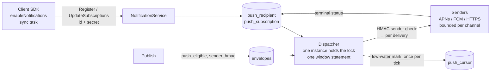
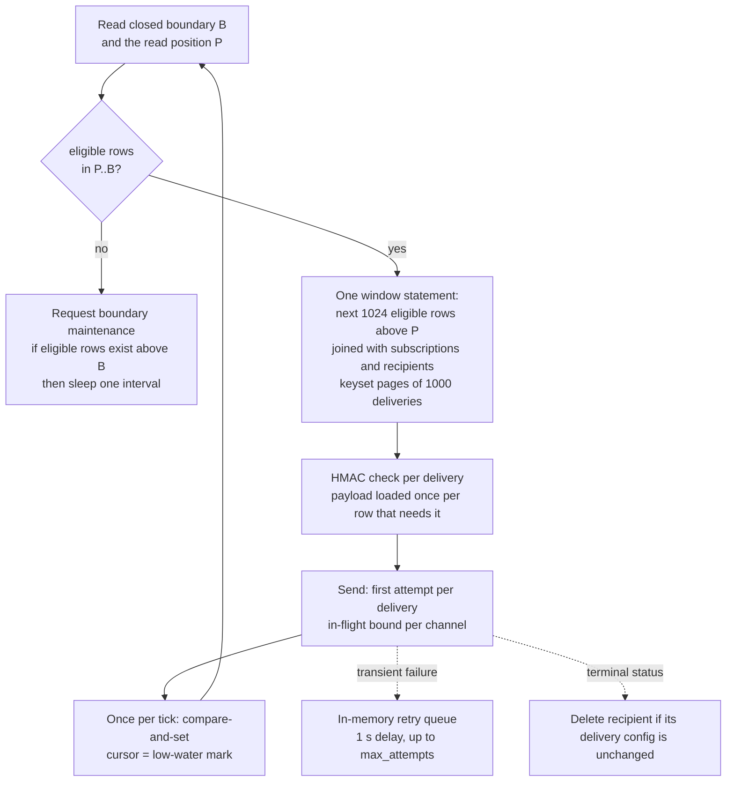

# 005: Push subscriptions

Status: approved by the owner on 2026-09-14 (revision 7, five amendments after adversarial review, re-approved at that revision).

The backend delivers push notifications itself. Requirements use `PUSH-nnn` in EARS form. This spec states behavior and errors; it names no files. The Ref plan that follows approval names files.

## 1. Summary

A client registers a recipient (a random id and a random secret), tells the backend how to reach it (APNs, FCM, or an HTTPS webhook), and keeps a list of topics with HMAC keys on the backend. One backend instance at a time runs a dispatcher that reads settled envelopes from the database, drops the sender's own messages, and sends `{topic, sequence_id}` to every subscribed recipient with bounded parallelism. The client SDKs gain `enableNotifications`, `disableNotifications`, a local state getter, and a per-conversation override; a background task diffs the topics the client wants against the topics it has uploaded and sends the difference.



## 2. Goals and non-goals

### Goals

- One recipient row and one subscription row per topic. No per-message state. At most one cursor write per poll interval. No write per delivery attempt.
- A recipient proves ownership with a 32-byte random secret that the backend stores only as a hash. The secret is a bearer credential on the transport's TLS, the same model as a Phase 4.3 token. Optional JWT auth gates access to the API through the existing global scope list and nothing else.
- No message content leaves the backend in a push. The payload is the topic and the sequence id, plus the recipient id on the webhook channel.
- The sender's own messages are not pushed to the sender's inbox when the backend holds the key for the message's epoch. Missing or mismatched keys fail open: the push is sent. A running client keeps its keys current.
- Exactly one dispatcher sends new windows at a time across all instances. Failover needs no operator action. A shutdown that drains within its deadline sends no duplicate; a crash, a drain that runs out of time, or an ambiguous provider outcome may.
- A settled envelope is never skipped: the dispatcher reads only rows at or below the closed allocation boundary and moves its cursor only past windows whose every delivery has had one attempt.
- One slow recipient never stalls the others. A slow attempt holds the cursor, not the pipeline, and holds permits only on its own channel.
- Rows with no live subscriber cost one index scan and never leave the database. Fan-out is one statement.
- Each channel exists only when its config block does, and an operator can restrict webhook hosts to a domain list.
- A recipient never gets a push for an envelope settled before its subscription was stored.
- Provably dead recipients and recipients that do not renew within the configured period stop receiving pushes and are deleted.
- The webhook channel cannot reach private networks, every webhook body is signed, and every provider request has a bounded duration.
- Memory held by the dispatcher is bounded by named constants, whatever the provider does.
- The client keeps notifications in step with consent, membership, overrides, and key rotation without an app call at every start, needs no bookkeeping inside other transactions, and notification work never blocks or fails messaging work for more than one bounded request.
- Config is the minimum needed: one channel block per provider, a renewal period, an attempt count, one limit.

### Non-goals

- Alert pushes with visible text. Every push is a background or data-only push. The app renders the notification after fetching and decrypting the envelope.
- Per-topic flags such as `is_silent`, and any free-form map in the push body.
- Coalescing. Every eligible row is one push per subscriber; APNs collapses per topic on the device, and other receivers see every row.
- Delivery to browsers or Web Push. The WASM bindings do not expose notifications.
- Retries that survive a restart, delivery receipts, or exactly-once delivery.
- More than one APNs key or FCM project per backend.
- Rate limiting of the registration API (Phase 4.4). Binding a JWT `sub` to a recipient.
- Replay protection beyond the transport. An attacker who can read the TLS stream can replay a request; that attacker already reads the envelopes.
- Pushes for key packages, identity updates, and commit-log entries. Commits and proposals are pushed only to subscriptions that opt in.
- Removing backend topics the client has no record of. The client detects drift by count, logs it, and re-adds its own set.
- Binding a recipient to an installation. A revoked installation that still holds its recipient secret can renew and receive pushes until it stops renewing or the app disables notifications. Operators who need to cut off a revoked device use JWT auth.
- A read call for the backend's view of a recipient. The SDK exposes only its local state; the backend reports its view on every mutating response.

## 3. Context

**Catalysts.** `docs/self-hosted/project.md` §4.7. The owner's high-level design, the 43 answers of 2026-09-11, the owner's review comments of 2026-09-11 and 2026-09-14, and the owner's choice of two simplifications on 2026-09-14. The reference server `xmtp/example-notification-server-go` supplied the HMAC scheme and nothing else.

**Sequencing.** This spec lands after Phase 4.3 merges. Auth is optional on the backend, so every requirement here holds with `[auth]` present or absent.

**Existing behavior this spec relies on.** Spec 001 topic derivation (API-001, API-002), ordering and the global sequence (API-010 to API-013), the `GroupMessage` fields `sender_hmac` and `should_push` stored inside the payload, and the client retry classes (API-153). Spec 002 the closed allocation boundary (ARC-038 to ARC-041), advisory-lock domains (ARC-031), the read-routing table (ARC-060), the one mutable migration (ARC-006), config rules (ARC-100 to ARC-102), and metric hygiene (ARC-099). Spec 003 SEC-003: the backend never authorizes a publisher, and this spec never authorizes a subscriber to a topic. The client already derives per-group HMAC keys over 30-day epochs from an inbox-wide root key and uploads three per topic; the root key rotates through device sync when the installation set changes. The client's durable task runner executes one task at a time while the client process runs and picks the task with the earliest deadline.

**Provider facts that shaped the design.** APNs background pushes need `apns-push-type: background`, `apns-priority: 5`, and an `aps` dictionary holding only `content-available`; APNs returns `410 Unregistered` and `400 BadDeviceToken` for dead tokens; the provider JWT is ES256 and must be refreshed between 20 and 60 minutes. FCM HTTP v1 needs an OAuth2 token from a service account, rejects high-priority data-only messages to Apple devices, returns `UNREGISTERED` for dead tokens, and allows at most four collapse keys per device. Standard Webhooks defines `webhook-id`, `webhook-timestamp`, and `webhook-signature` over `id.timestamp.body`.

**Accepted misses in sender suppression.** The client picks the HMAC key by its own clock at send time; the backend picks by `server_ns`. Near an epoch boundary the two can differ and the sender gets its own push. A message sent before the sender's keys reach the backend, or during the window after a root key cycle and before the re-upload, is pushed to the sender. The owner accepted these on 2026-09-11.

**Accepted visibility lag.** The dispatcher reads recipients and subscriptions from the read database. A deletion or removal becomes effective for dispatch when the read database shows it. The owner accepted replication lag on 2026-09-11.

**Accepted sync lag.** The client sends subscription changes when its sync task runs. The task runs on every wake and at least once per hour, so a wake lost to a crash delays a change by at most one hour. The owner chose this over marks written inside other transactions on 2026-09-14.

### Assumptions

- Metadata is at most 4096 bytes, a fixed protocol constant and not a config key. The owner confirmed a practical limit on 2026-09-14.
- Q9 (deltas or full replacement) had no answer. Assumed: deltas, with a maintained topic count so drift is detectable from one row. See §4.9.
- The secret rides on TLS. A deployment that serves the backend in clear exposes recipient secrets as it exposes Phase 4.3 tokens.

## 4. System design

### 4.1 Terms

| Term | Meaning |
| --- | --- |
| Recipient | A push endpoint. Identified by a 32-byte random `recipient_id` and proven by a 32-byte random `recipient_secret`, both generated once per local database and kept across enable and disable. The backend stores only `SHA-256(recipient_secret)`. |
| Channel | How the backend reaches a recipient: `apns`, `fcm`, or `http`. |
| Delivery config | The APNs device token, the FCM registration token, or the webhook URL with its signing key. |
| Subscription | One (recipient, topic) pair with an optional HMAC key window, a start position, and a commit flag (`include_commits`, default false). |
| Key window | Up to three 42-byte HMAC keys for consecutive 30-day epochs starting at `epoch_base`, stored in three nullable columns rather than an array, so a batch insert binds one flat array per slot. The key for `epoch_base + n` is in slot `n`. |
| Start position | The closed allocation boundary read when the subscription was stored. The dispatcher pushes only rows above it. |
| Push-eligible envelope | A stored envelope the dispatcher may push: a welcome, a group application message whose sender set `should_push`, or a commit or proposal, which reaches only subscriptions with `include_commits`. |
| Settled | A sequence id at or below the closed allocation boundary. No later commit can use it. |
| Dispatcher | The one instance-local loop that holds the dispatcher lock. |
| Read position | The dispatcher's in-memory sequence id up to which windows have been loaded. |
| Window | The next 1024 push-eligible settled rows above the read position, bounded by their first and last sequence id. |
| Delivery | One (row, subscription) send. It has its own attempts. |
| Low-water mark | The sequence id just before the oldest window that still has a delivery without a first attempt, or the read position when there is none. The persisted cursor. |
| Renewal | Any `Register` or `UpdateSubscriptions` call. It resets the recipient's expiry. |
| Mismatch | A provider answer saying the token does not belong to this sender: wrong environment, bundle id, or project. It keeps the recipient, because one config change produces it for every recipient at once. |
| Repair pass | The client re-uploading every topic it believes it has, one request at a time, after a count disagreement. It marks rows stale and clears each mark on confirmation, so it converges. |
| Uploaded set | The client's local record of the topics it has stored on the backend, with each topic's key window base, commit flag, root key fingerprint, and a stale mark used by a repair pass. |

### 4.2 Wire API

One new gRPC service in `xmtp.backend.v1`: `NotificationService` with `Register`, `Unregister`, and `UpdateSubscriptions`. Every request carries `recipient_id` and `recipient_secret`. The backend hashes the secret with SHA-256 and compares it with the stored hash in constant time. The secret is 32 random bytes, so no slower hash is needed.

```proto
message RegisterRequest {
  bytes recipient_id = 1;      // 32 random bytes
  bytes recipient_secret = 2;  // 32 random bytes
  oneof delivery {
    ApnsDelivery apns = 3;     // string token (hex device token)
    FcmDelivery fcm = 4;       // string token
    HttpDelivery http = 5;     // string url; bytes signing_key (16..64 bytes)
  }
  reserved 6;
  reserved "metadata";
}
message UnregisterRequest { bytes recipient_id = 1; bytes recipient_secret = 2; }
message UpdateSubscriptionsRequest {
  bytes recipient_id = 1;
  bytes recipient_secret = 2;
  repeated Subscription adds = 3;
  repeated bytes removes = 4;  // topics
}
message Subscription {
  bytes topic = 1;             // spec 001 topic bytes, kind 0x00 or 0x01
  int64 hmac_epoch_base = 2;   // first epoch of the window; 0 with no keys
  repeated bytes hmac_keys = 3; // 0..3 keys of 42 bytes, consecutive epochs
  bool include_commits = 4;    // also push commits and proposals; default false
}
message RecipientState {
  uint64 topic_count = 1;
  Channel channel = 2;
  int64 expires_at_ns = 3;
}
```

`Register` and `UpdateSubscriptions` return a `RecipientState`. `Unregister` returns an empty response. `Register` is an upsert: an unknown id creates the recipient, a known id with the right secret replaces its delivery config and keeps its subscriptions.

Checks, in order. The first failing check decides the status.

| Order | Condition | Status | Message |
| --- | --- | --- | --- |
| 1 | `[auth]` set and token missing, invalid, or lacking one of `auth.required_scopes` | as Phase 4.3 | as Phase 4.3 |
| 2 | request does not decode, `recipient_id` not 32 bytes, `recipient_secret` not 32 bytes | `INVALID_ARGUMENT` | `request is malformed` |
| 3 | recipient unknown on `Unregister` or `UpdateSubscriptions` | `NOT_FOUND` | `recipient is not registered` |
| 4 | recipient known and `SHA-256(recipient_secret)` differs from the stored hash | `PERMISSION_DENIED` | `recipient secret is not valid` |
| 5 | channel has no config block | `FAILED_PRECONDITION` | `channel is not configured` |
| 6 | webhook URL not `https`, its host outside `allowed_domains` when the list is set, or its host resolves to a blocked address while `allow_private_addresses` is false | `INVALID_ARGUMENT` | `webhook url is not allowed` |
| 7 | webhook signing key outside 16..64 bytes | `INVALID_ARGUMENT` | `webhook signing key length is not allowed` |
| 8 | topic kind not `0x00` or `0x01`, wrong identifier length, more than 3 keys, a key not 42 bytes, `epoch_base` negative, a topic in both adds and removes, a duplicate topic | `INVALID_ARGUMENT` | `subscription is malformed` |
| 9 | adds would raise the recipient's topic count above `max_push_topics` | `RESOURCE_EXHAUSTED` | `recipient topic limit reached` |
| 10 | database unavailable | `UNAVAILABLE` | as spec 001 |

A request that decodes but fails a later check changes nothing. Messages are constants. No status names a recipient id, secret, token, URL, key, or topic.

### 4.3 Storage

Four changes to the one mutable migration.

| Table | Columns | Keys and indexes |
| --- | --- | --- |
| `push_recipient` | `recipient_id bytea` (32), `secret_hash bytea` (32), `channel smallint`, `delivery text` (token or URL), `signing_key bytea` nullable, `topic_count integer`, `renewed_ns bigint` | PK `recipient_id`; index `(renewed_ns)` for expiry |
| `push_subscription` | `recipient_id bytea` references `push_recipient` on delete cascade, `topic bytea`, `since_sequence_id bigint`, `hmac_epoch_base bigint` nullable, `hmac_key_0 bytea`, `hmac_key_1 bytea`, `hmac_key_2 bytea` all nullable and 42 bytes when present, `include_commits boolean not null` | PK `(recipient_id, topic)`; index `(topic)` for the window join |
| `push_cursor` | `singleton boolean`, `sequence_id bigint` | PK `singleton`, one row seeded at 0 |
| `envelopes` | adds `push_eligible boolean not null`, `sender_hmac bytea` nullable, 32 bytes when present | partial index on `(sequence_id)` where `push_eligible` |

`topic_count` changes in the same transaction as the subscription rows. `since_sequence_id` is `allocation_boundary.closed_sequence_id` read on the primary in the transaction that stores the subscription. An add of an existing topic replaces its key window and commit flag and keeps its start position. Deleting a recipient is a hard delete; the cascade removes its subscriptions.

The dispatcher lock is a session advisory lock in the global lock domain with a new key, taken on a dedicated primary connection. The cursor write is a compare-and-set that only moves forward: it names the value it read and fails when the stored value differs. Other writes go to the primary through the request pool. The dispatcher's window, boundary, and payload reads go to the read database, as streams do; replication lag delays a push, delays the effect of a deletion, and never loses a push.

### 4.4 Publish

At publish, after the existing parse, the backend sets `push_eligible` and `sender_hmac`:

| Envelope kind | `push_eligible` | `sender_hmac` |
| --- | --- | --- |
| Group message, not commit or proposal, `should_push` true | true | the wire value when it is exactly 32 bytes, else null |
| Group message, not commit or proposal, `should_push` false | false | same rule |
| Group message, commit or proposal, any `should_push` | true | same rule |
| Welcome | true | null |
| Key package, identity update, commit-log entry | false | null |

Commits and proposals are eligible whatever the wire flag says: the client publishes them with `should_push` false today, and the subscription's `include_commits` flag decides delivery in the window statement through the existing `is_commit_or_proposal` column. Nothing else about publish changes. The message hash, the canonical bytes, the topic, and every response stay the same.

### 4.5 Dispatcher

One loop per instance tries the dispatcher lock once per poll interval. The holder runs the pipeline below; the others idle. The poll interval is the existing `streams.poll_interval_ms`.



Rules the pipeline obeys:

- Only settled rows: `read_position < sequence_id <= closed_boundary` and `push_eligible`. Rows above the boundary wait. When such rows exist the dispatcher asks its instance's boundary task to advance, which is already bounded to once per poll interval (ARC-040). Streams keep delivering visible rows above the boundary; the boundary is a ceiling for push only.
- Window statement: one statement selects the next 1024 eligible rows above the read position, joins them with `push_subscription` on `topic` where `sequence_id > since_sequence_id` and where the row is not a commit or proposal or the subscription has `include_commits`, joins recipients, and returns one delivery per (row, subscription): the row's sequence id, `server_ns`, and `sender_hmac`, the recipient's channel, delivery config and signing key, and the subscription's key window. No rows are merged. The same statement reports the window's first and last sequence id. A row with no subscriber, a row at or below every subscriber's start position, and a commit or proposal with no opted-in subscriber produce no delivery and never leave the database. The read position moves to the window's last row once the window's deliveries are loaded, even when there are none.
- Pages: deliveries are read in keyset pages of 1000 ordered by (sequence id, recipient). A page loads only when retained work has room. A full window loops without sleeping.
- Retained work is bounded: the dispatcher holds at most 10,000 deliveries that await a first attempt or a retry, over any number of windows. When the bound is reached, loading pauses until attempts complete. A transient failure that finds no room for its retry counts as `failed` and is dropped.
- HMAC check, per delivery: epoch = `server_ns / (30 days in ns)` of the row. If the row has a `sender_hmac` and the subscription's window covers the epoch, the dispatcher loads the payload, decodes the group message, and compares `HMAC-SHA256(key, data)` with `sender_hmac` in constant time. Equal means the recipient's inbox sent it and the delivery is suppressed. Any other case sends. Payloads are loaded once per distinct row per window and only for rows that need the check.
- Sends run under one in-flight bound of 256 sends per channel, first attempts and retries alike. A stalled host holds permits on its own channel only. Every provider request, including token fetches, has a 10 second timeout.
- Cursor: once per poll interval the dispatcher writes the low-water mark by forward-only compare-and-set, and skips the write when the value has not moved. A slow first attempt holds the cursor at its window for at most the provider timeout and stops nothing else: later windows load and send while retained work has room. Retries never hold the cursor. A failed compare-and-set means another instance holds the cursor; the loop stops and releases the lock.
- Retry: a transient failure retries after the channel's retry delay, up to `max_attempts` attempts in total. A rejected outcome stops after one attempt. A mismatch outcome stops after one attempt and keeps the recipient: the provider is saying the token does not belong to this sender, which a wrong `environment`, `bundle_id`, or FCM project produces for every recipient at once, so it must not delete anything. A terminal outcome deletes the recipient when its stored delivery config still equals the one the send used, and drops the recipient's pending work. An attempt whose outcome is unknown (timeout after the request was sent, connection lost before a response) is transient; its retry may produce a duplicate.
- Shutdown: stop loading windows, let in-flight attempts and queued retries finish within the server drain period, write the low-water mark, release the lock. Retries still queued at the deadline are dropped. Deliveries still awaiting a first attempt at the deadline keep the cursor below their window, so the next holder resends those windows.
- Lock loss: the loop loads no further window. Attempts in flight finish. The successor starts from the persisted cursor and may resend every window at or above it. The compare-and-set stops the old holder from moving the cursor after the successor has.
- Takeover: an idle instance tries the lock once per poll interval. It acquires the lock on its first attempt after the primary reports the lock free.
- A recipient deleted while a window is in flight may still receive that window, and later windows until the read database shows the deletion.
- Expiry sweep: once per hour the holder deletes recipients whose `renewed_ns` is older than `recipient_ttl_seconds`.

### 4.6 Channels

Payload, all channels: JSON object `{"topic": "<base64 of the topic bytes>", "sequence_id": "<decimal>"}`. `sequence_id` is decimal text on every channel so that JavaScript consumers never round it. Recipients parse the kind byte from the topic; the welcome topic contains the recipient's own installation key by construction.

| Channel | Request | Delivered | Terminal (delete recipient) | Mismatch and rejected (one attempt, keep recipient) | Transient (retry) |
| --- | --- | --- | --- | --- | --- |
| APNs | HTTP/2 to the production or sandbox host from config, provider JWT (ES256, key id, team id) refreshed every 55 minutes, headers `apns-topic` = bundle id, `apns-push-type: background`, `apns-priority: 5`, `apns-collapse-id` = the base64 topic, body `{"aps":{"content-available":1},"topic":..,"sequence_id":..}` | `200` | `410 Unregistered`, `410 ExpiredToken` | mismatch: `400 BadDeviceToken`, `400 DeviceTokenNotForTopic`; rejected: any other `400`, `403`, `404`, `405`, `413` | `429`, `500`, `503`, timeout, connection error |
| FCM | HTTP v1 `messages:send` with an OAuth2 service-account token, `data` = `{"topic": .., "sequence_id": ..}`, `android.priority: HIGH`, `apns.headers` `apns-priority: 5` and `apns-push-type: background`, `apns.payload.aps.content-available: 1`, no collapse key | `200` | `UNREGISTERED` | mismatch: `SENDER_ID_MISMATCH`; rejected: `INVALID_ARGUMENT`, `THIRD_PARTY_AUTH_ERROR`, other `4xx` | `QUOTA_EXCEEDED`, `UNAVAILABLE`, `INTERNAL`, timeout, connection error |
| HTTPS | `POST` to the URL, `content-type: application/json`, headers `webhook-id`, `webhook-timestamp`, `webhook-signature: v1,<base64 HMAC-SHA256(signing_key, id.timestamp.body)>`, no redirects, 10 s timeout, body adds `"recipient_id": "<hex>"` | any `2xx` | `404` or `410` on every one of `max_attempts` attempts | other `4xx`, including a redirect | `5xx`, timeout, connection error |

On the HTTPS channel a `404` or `410` is retried like a transient failure; the recipient is terminal only when every attempt answered `404` or `410`. A mismatch outcome names a token that does not belong to this sender: it is one attempt, no delete, and its own counter, because an operator who changes `environment`, `bundle_id`, or the FCM project would otherwise delete every affected recipient in one sweep. Those recipients stop receiving pushes until the config is corrected, and expire on their own if it never is. FCM reports its code in a typed `FcmError` detail rather than the HTTP status; a response with no recognizable detail is rejected. Android uses high priority because the app shows a notification on receipt; FCM downgrades senders that do not. Apple devices through FCM must use priority 5 or FCM rejects the message.

Webhook safety: the URL scheme must be `https`. When `allowed_domains` is set, the host must equal an entry, or, for an entry that starts with `*.`, end with the entry's text after the star with at least one label before it; matching is case-insensitive on the host name alone. The list is checked at `Register`; a recipient registered before the list changed keeps its URL until its next `Register`. Before each attempt the backend resolves the host and connects only to the resolved address; if any resolved address is private (`10/8`, `172.16/12`, `192.168/16`), loopback, link-local (including `169.254.169.254`), unspecified, or an IPv6 or IPv4-mapped equivalent, the attempt fails as rejected unless `allow_private_addresses` is true. The same check runs at `Register`.

### 4.7 Configuration

```toml
[push]
recipient_ttl_seconds = 2592000   # 30 days without renewal deletes the recipient
max_attempts = 3                  # attempts per delivery

[push.apns]                       # optional; absent means APNs registrations fail
key = "env:XMTP_APNS_KEY"         # PKCS#8 PEM, secret
key_id = "ABC123DEFG"
team_id = "TEAM123456"
bundle_id = "org.example.app"
environment = "production"        # or "sandbox"

[push.fcm]                        # optional; absent means FCM registrations fail
service_account = "env:XMTP_FCM_SERVICE_ACCOUNT"  # service-account JSON, secret; project id comes from it

[push.http]                       # optional; absent means webhook registrations fail
allowed_domains = ["hooks.example.com", "*.example.org"]  # empty means any public host
allow_private_addresses = false   # webhooks to private or loopback hosts; dev and test only

[limits]
max_push_topics = 100000          # topics per recipient
```

Rules: `[push]` is optional and every key has a default. A channel exists when its block is present and not otherwise; `[push.http]` may be empty. `recipient_ttl_seconds` is at least 86400. `max_attempts` is 1 to 10. `environment` is `production` or `sandbox`. An `allowed_domains` entry is a host name, optionally with a leading `*.`; a star anywhere else, an empty label, a scheme, a port, or a path fails startup. `key` and `service_account` accept `env:NAME` and never appear in `Debug`, logs, or errors. The JSON schema describes every key. Fixed protocol constants shared with the client: recipient id and secret 32 bytes each, key window at most 3 keys of 42 bytes, HMAC epoch 30 days. Fixed backend constants: window 1024 rows, page 1000 deliveries, retained deliveries 10,000, in-flight sends 256 per channel, provider timeout 10 seconds. Retry delay is per channel: 1 second on APNs and HTTPS; on FCM 60 seconds after `QUOTA_EXCEEDED` and the response's `Retry-After` when it carries one, bounded to 300 seconds, because FCM denylists senders that retry quota failures faster. Fixed client constants: 1000 subscriptions per request, notification request timeout 30 seconds, first retry backoff 60 seconds, sync period 1 hour.

### 4.8 Client

State the client keeps, on the installation's local settings row, an uploaded-topic table, and the group record:

- Recipient identity: id and secret. Generated on the first `enableNotifications` and kept for the life of the local database, across disable and enable.
- Notification state: `disabled`, `enabled`, or `failed` with a typed error. With `enabled`: delivery config, rules (`consent_states`, default `[Allowed]`; `include_welcomes`, default true; `include_sync_groups`, default false; `include_commits`, default false), the renewal deadline, the sync deadline, and the last `RecipientState` seen.
- Uploaded set: one row per topic stored on the backend with its key window `epoch_base`, its `include_commits` value, the fingerprint of the root key its keys derive from, and a stale mark that a repair pass sets and each confirmed upload clears.
- Per group or DM: an override, `enabled`, `disabled`, or none. An override beats the rules. Sync groups have no override; `include_sync_groups` alone decides them.

Public SDK surface, native and Node only:

- `client.enableNotifications(config)`: fails with a typed non-retryable error when the task runner is disabled. Otherwise, in one local transaction, stores the config, creates the identity on first use, and sets `enabled`; then calls `Register` inline and returns its result. A terminal error from `Register` sets `failed` and is returned. Any other error leaves the state `enabled` with the registration retried by the task. A later call with a new token, URL, or rule does the same and keeps the uploaded set; the next sync run sends whatever the new rules change.
- `client.disableNotifications()`: in one local transaction sets `disabled` and clears the config and the uploaded set, keeping the identity; then calls `Unregister`. `NOT_FOUND` counts as success. A failed `Unregister` leaves the local state disabled; the backend deletes the recipient at expiry. Overrides stay.
- `client.notificationState()`: returns the local state, `disabled`, `enabled`, or `failed` with its error, without a backend call.
- `conversation.setNotifications(enabled | disabled | none)` and `conversation.notificationsEnabled()`, which returns the effective value.

The sync task, driven by the existing task runner:

- Desired set = groups and DMs where the installation is an active member, whose effective value after overrides is enabled, plus the installation's welcome topic when `include_welcomes`, plus sync groups when `include_sync_groups`. Duplicate DM groups that match are all included. Every group subscription carries the `include_commits` rule.
- Each run computes the diff from local tables alone: adds = desired topics missing from the uploaded set, plus uploaded topics that are marked stale, whose key window does not cover `current + 1`, whose commit flag differs from the rule, or whose root key fingerprint differs from the current root key; removes = uploaded topics not desired. It sends one request of at most 1000 subscriptions, updates the uploaded set from the request on success, and reschedules itself at once while work remains.
- Wakes: a consent write, a membership change, an override change, a group creation, a welcome, a root key cycle, and `enableNotifications` wake the task runner after their own commit and write nothing else. The task also runs at every client start with state `enabled` and at least once per hour, so a lost wake costs at most one hour.
- Every task checks the notification state before any call and stops when it is not `enabled`.
- Renewal: a durable recurring task with a persisted deadline, in the pattern of key package rotation. After each successful `Register` or `UpdateSubscriptions` the next deadline is `now + (expires_at_ns - now) / 4`. An overdue task runs as soon as the task runner starts. It calls `Register` with the stored config.
- Every `RecipientState` the client receives, from `Register` as well as `UpdateSubscriptions`, is compared with the uploaded set. A different `channel` logs a warning. `NOT_FOUND` on any call clears the uploaded set, starts a repair pass, and runs `Register` before the next diff.
- Drift repair: when `topic_count` disagrees with the uploaded row count and no repair pass is running, the client logs a warning and starts a repair pass by marking every uploaded row stale rather than deleting it. While a pass runs, each run re-uploads at most 1000 stale rows, clearing each row's stale mark as the response confirms it, and the count comparison is suspended. The pass ends when no stale row remains; the count is compared again on the next response after that. A pass that is interrupted by a crash resumes from the stale marks. Because a run only clears marks and never sets them, a client with more topics than fit in one request converges in ceiling(topics / 1000) runs whatever the backend reports.
- Removing what the backend has and the client does not is out of scope, as stated in §2, so a count that stays high after a completed pass logs a warning once per pass and changes nothing else.
- Error classes on any notification call: `PERMISSION_DENIED`, `INVALID_ARGUMENT`, `OUT_OF_RANGE`, `UNIMPLEMENTED`, and `FAILED_PRECONDITION` for an unconfigured channel set `failed`, stop the tasks, and are visible through `notificationState()`. `RESOURCE_EXHAUSTED` drops the remaining adds of that run, logs a warning, and retries them only when the desired set changes. Every other error is retried by the task runner's backoff.
- Bounds: a notification request has a 30 second timeout and its first retry backoff is 60 seconds, so another due task waits at most one request timeout. A failed notification call never fails a message send, a consent write, welcome processing, or key package maintenance.
- Idle: a client whose diff is empty and whose deadlines have not passed makes no notification call at creation; the diff itself is local.

Legacy Android and iOS push code (`XMTPPush`, the checked-in stubs, push preferences, `getPushTopics`) is deleted, and the SDK docs describe the new surface.

### 4.9 Alternatives considered

- **Ed25519 keypair, signed bodies, per-recipient revisions, tombstones, and a timestamp window** (revisions 1 to 4 of this spec). Dropped by the owner on 2026-09-14: they defended against replay by an attacker who can read the TLS stream, who can already read the envelopes. A bearer secret hashed at rest is one column and one constant-time compare, and matches the bearer model of Phase 4.3 tokens.
- **A slow password hash for the secret.** Not needed: the secret is 32 random bytes, so a key-derivation function adds cost and no entropy.
- **Full-list replacement on every update.** Not chosen: replacement costs one row per topic per change and cannot be chunked. Deltas with a maintained count give drift detection at one row per changed topic.
- **Clearing the uploaded set on every count disagreement.** Replaced on 2026-09-14 after review: with more topics than fit in one request, each batch's response disagreed again and cleared the progress just made, so topics past the first batch were never subscribed. A repair pass that marks rows stale and clears each mark on confirmation converges in ceiling(topics / 1000) runs.
- **Deleting a recipient on every terminal provider status.** Narrowed on 2026-09-14 after review: APNs `BadDeviceToken` and `DeviceTokenNotForTopic` and FCM `SENDER_ID_MISMATCH` also fire when an operator changes `environment`, `bundle_id`, or the FCM project, so the old rule would delete every affected registration on the first send after a config typo. They are now a `mismatch` outcome with its own counter, and only the statuses that name a dead token delete. The cost is that a genuinely stale token waits for its renewal expiry.
- **One retry delay for every channel.** Replaced on 2026-09-14 after review: FCM requires at least a minute after a quota failure and honors `Retry-After`, and a fixed 1 second burns the attempt budget inside the throttle window and risks a denylist. The delay is per channel.
- **An array column for the HMAC key window.** Replaced on 2026-09-14 after review: the pinned SQLx Postgres driver rejects arrays of arrays, so a `bytea[]` column per row cannot be bulk-inserted through the `unnest` pattern every other backend insert uses. Three nullable key columns hold the same fixed window of at most three keys and bind as three flat arrays.
- **A per-method `api_scopes` map.** Removed on 2026-09-14 after review: the backend has one global `auth.required_scopes` and no per-method map, and the owner asked for one scope. The three methods take the same check as every other RPC.
- **A server-maintained topic digest.** Dropped by the owner on 2026-09-14: the count alone catches every drift this design can produce (expiry, a lost local record), and a full re-add is idempotent. The digest cost a hash per topic per mutation and a shared function for nothing more.
- **A `GetStatus` call and pending marks written inside consent, membership, welcome, and key-cycle transactions.** Dropped by the owner on 2026-09-14: every mutating response already carries the backend's view, and a diff computed from local tables on each run needs no bookkeeping in other code paths. The cost is a sync lag of at most one hour after a lost wake, recorded in §3.
- **Reading the envelope sequence for the start position.** Rejected by review: a read of the sequence does not join the allocation protocol. The closed boundary is a settled point.
- **A separate key table with one row per epoch.** Rejected: unbounded growth, a purge job, and a join on the fan-out path. The window array stays at one row per topic.
- **Storing a digest for the HMAC input.** Rejected: it would change the client's HMAC input and add a column to every row. Loading the payload for the rows that need the check costs at most one read per row per window, which the stream path already pays per row.
- **Loading rows, then fanning out in memory.** Rejected by the owner: rows with no subscriber were loaded for nothing, and fan-out was a second query. The window statement does the join and the start-position filter.
- **Coalescing to the highest sequence id per recipient and topic.** Dropped by the owner on 2026-09-14. In the window statement it ran before the HMAC check and could hide another sender's row behind the recipient's own; later in the pipeline it was memory and code for a performance gain the owner can live without. Every eligible row is one delivery; APNs collapses per topic on the device through `apns-collapse-id`.
- **An `enabled` key per channel.** Not chosen: the presence of the channel's block already says it, and one fewer key is one fewer way to misconfigure.
- **Cursor written after every first attempt of a batch.** Rejected by the owner: one slow webhook governed every channel's throughput. The cursor is a low-water mark over loaded windows, written once per tick, so a slow attempt delays only the cursor and only for the provider timeout.
- **One cursor and one pipeline per channel.** Considered for the same problem: three cursor rows and three window scans per tick, and a slow webhook still stalled the other webhooks. The low-water mark gives the isolation with one row; per-channel in-flight bounds keep a stalled host on its own channel.
- **Reusing the stream tailer as the firehose.** Rejected by the owner: the tailer has no durable cursor and a topic-keyed registry.
- **Gap tracking in the dispatcher.** Rejected: the closed boundary already proves settlement; the dispatcher only needs to ask for it.
- **Every instance dispatching a partition.** Rejected by the owner for v1; the single holder has internal parallelism.
- **`a2` for APNs.** Rejected after research: unmaintained since 2024, wrong sandbox host, unknown reason strings dropped. Its maintained fork `apns-h2` is used.
- **FCM collapse keys.** Rejected: FCM allows four per device and a user has more topics than that.
- **Numeric `sequence_id` in JSON.** Rejected by review: JavaScript rounds above 2^53.

## 5. Libraries and utilities

| Package | Purpose |
| --- | --- |
| `apns-h2` | APNs HTTP/2 client with token auth, background push type, collapse id, typed reasons |
| `gcp_auth` | Service-account OAuth2 token for FCM, cached and refreshed |
| `hmac`, `sha2` (already in the workspace) | Sender check, webhook signatures, secret hash |
| `reqwest` through the shared HTTP client builder | FCM and webhook requests, redirects off, pinned resolution, 10 second timeout |

Shared between backend and client, in a shared crate: the push payload type and its JSON form, the HMAC epoch function, and the topic-kind eligibility rule.

## 6. Testing and validation

### 6.1 Acceptance criteria

Registration and ownership

- PUSH-001: WHEN a `Register` names an unknown `recipient_id`, carries a 32-byte secret, and names a configured channel THE SYSTEM SHALL store a recipient with `secret_hash` equal to `SHA-256(recipient_secret)`, `renewed_ns` set to the backend clock, zero topics, and return its `RecipientState`.
- PUSH-002: WHEN a `Register` names a known recipient and its secret hashes to the stored hash THE SYSTEM SHALL replace the delivery config, reset `renewed_ns`, keep every subscription with its start position and flags, and return the `RecipientState`.
- PUSH-003: WHEN any request names a known recipient and its secret does not hash to the stored hash THE SYSTEM SHALL respond `PERMISSION_DENIED` and change nothing, and the comparison SHALL run in constant time.
- PUSH-004: WHEN a request fails a structural check THE SYSTEM SHALL respond `INVALID_ARGUMENT` with the constant message of §4.2, and the checks SHALL run in the order of §4.2.
- PUSH-005: WHEN a `Register` names a channel whose config block is absent, `[push.http]` included, THE SYSTEM SHALL respond `FAILED_PRECONDITION`.
- PUSH-006: WHEN `Unregister` verifies THE SYSTEM SHALL delete the recipient and every subscription and respond success; `Unregister` or `UpdateSubscriptions` on an unknown id SHALL respond `NOT_FOUND`.
- PUSH-007: THE SYSTEM SHALL store no recipient secret in clear; a value read from the database SHALL NOT be accepted as a secret.
- PUSH-010: WHERE `[auth]` is configured THE SYSTEM SHALL apply the Phase 4.3 token check and the existing `auth.required_scopes` check to the three methods exactly as to every other RPC, and SHALL NOT read any claim for ownership; WHERE `[auth]` is absent THE SYSTEM SHALL accept the three methods with no token.

Subscriptions

- PUSH-020: WHEN `UpdateSubscriptions` verifies THE SYSTEM SHALL apply every add and remove in one transaction, store `since_sequence_id` equal to the closed allocation boundary read on the primary in that transaction for each new topic, treat an add of an existing topic as a replacement of its key window and commit flag that keeps its start position, treat a remove of an absent topic as a no-op, update `topic_count` in the same transaction, reset `renewed_ns`, and return the `RecipientState`.
- PUSH-021: WHEN the adds would raise the topic count above `max_push_topics` THE SYSTEM SHALL respond `RESOURCE_EXHAUSTED` and apply nothing from that request.
- PUSH-022: WHEN a subscription has a topic kind other than `0x00` or `0x01`, an identifier of the wrong length, more than 3 keys, a key that is not 42 bytes, a negative `epoch_base`, or appears twice in the request THE SYSTEM SHALL respond `INVALID_ARGUMENT` and apply nothing.
- PUSH-023: WHEN `Register` or `UpdateSubscriptions` succeeds THE SYSTEM SHALL return the stored `topic_count`, channel, and `renewed_ns + recipient_ttl_seconds` as `expires_at_ns` from the recipient row alone, and SHALL NOT read any subscription row for the response.
- PUSH-024: WHEN the hourly sweep finds a recipient whose `renewed_ns` is older than `recipient_ttl_seconds` THE SYSTEM SHALL delete it and its subscriptions.
- PUSH-025: THE SYSTEM SHALL NOT push to a subscription any envelope whose `sequence_id` is at or below its `since_sequence_id`, however late that envelope is dispatched; an envelope above it that was not yet dispatched when the subscription was stored MAY be pushed.
- PUSH-026: THE SYSTEM SHALL keep `topic_count` equal to the number of the recipient's subscription rows after every mutation, and SHALL store `include_commits` per subscription, false when the request omits it.

Publish

- PUSH-030: WHEN a group message is stored THE SYSTEM SHALL set `push_eligible` to true when it is a commit or proposal or when `should_push` is set, false otherwise, and SHALL store `sender_hmac` when it is exactly 32 bytes.
- PUSH-031: WHEN a welcome is stored THE SYSTEM SHALL set `push_eligible` to true and `sender_hmac` to null; WHEN a key package, identity update, or commit-log entry is stored THE SYSTEM SHALL set `push_eligible` to false and `sender_hmac` to null.
- PUSH-032: THE SYSTEM SHALL CONTINUE TO compute the same message hash, topic, canonical bytes, and publish response for every envelope as before this spec.

Dispatcher

- PUSH-040: WHILE more than one instance runs THE SYSTEM SHALL let exactly one hold the dispatcher lock; WHEN the holder's lock connection ends THE SYSTEM SHALL let an idle instance acquire the lock on its first attempt after the primary reports it free, attempting once per poll interval, and the old holder SHALL load no further window.
- PUSH-041: THE SYSTEM SHALL push only rows with `push_eligible` and `sequence_id` in `(cursor, closed_boundary]`, in windows of at most 1024 rows in sequence order, through one statement per window that joins subscriptions and recipients, applies the start position and the commit flag, and returns one delivery per (row, subscription) in keyset pages of at most 1000; a row with no subscriber SHALL produce no delivery and SHALL NOT be loaded.
- PUSH-042: WHEN eligible rows exist above the closed boundary THE SYSTEM SHALL request boundary maintenance and SHALL push them once the boundary covers them.
- PUSH-043: THE SYSTEM SHALL NOT merge rows: every eligible row above a subscription's start position SHALL be one delivery to that recipient, and a delivery suppressed by PUSH-044 SHALL NOT affect any other delivery.
- PUSH-044: WHEN a delivery's row carries a `sender_hmac` and the subscription's window covers `server_ns / 30 days` AND `HMAC-SHA256(key, data)` equals `sender_hmac` THE SYSTEM SHALL NOT send that delivery and SHALL count `suppressed`; in every other case, including no key for the epoch and no `sender_hmac`, THE SYSTEM SHALL send.
- PUSH-045: THE SYSTEM SHALL write the cursor at most once per poll interval by a forward-only compare-and-set, only when the low-water mark has moved, SHALL never write a cursor value past a window that has a delivery without a first attempt, SHALL stop the loop when the compare-and-set fails, and SHALL NOT write any row per delivery attempt.
- PUSH-046: WHEN an attempt fails with a transient outcome, including an unknown outcome after the request was sent THE SYSTEM SHALL retry after the channel's retry delay up to `max_attempts` attempts in memory while retained work is below 10,000, and SHALL count `failed` and drop the delivery otherwise; WHEN it fails with a rejected outcome THE SYSTEM SHALL stop after one attempt; WHEN it fails with a mismatch outcome THE SYSTEM SHALL stop after one attempt, keep the recipient, and count `mismatch`; WHEN it fails with a terminal outcome AND the recipient's stored delivery config equals the one the attempt used THE SYSTEM SHALL delete the recipient and drop its pending work; WHEN the stored config differs THE SYSTEM SHALL keep the recipient.
- PUSH-047: WHEN the server shuts down THE SYSTEM SHALL load no further window, finish in-flight attempts and queued retries within the drain period, write the low-water mark, and release the lock; WHEN the drain completes THE SYSTEM SHALL send no delivery twice after restart.
- PUSH-048: WHEN the dispatcher crashes, loses its lock, or exceeds the drain period while a window has a delivery without a first attempt THE SYSTEM SHALL resend that window and every later window from the next holder.
- PUSH-049: WHILE one delivery's first attempt is in progress THE SYSTEM SHALL continue to load and send later windows up to the retained bound, and a delivery on one channel SHALL NOT hold a permit of another channel.
- PUSH-050: THE SYSTEM SHALL run at most 256 sends at once per channel, first attempts and retries included, SHALL hold at most 10,000 retained deliveries, SHALL load a page only when it fits, SHALL run the sends of one page concurrently, and SHALL bound every provider request and token fetch to 10 seconds.
- PUSH-051: THE SYSTEM SHALL do no periodic per-subscription work on the backend; a subscription row is read only when an envelope on its topic is dispatched or when its recipient is mutated, and deleted with its recipient.
- PUSH-052: WHEN a delivery's row is a commit or proposal THE SYSTEM SHALL send it only to subscriptions with `include_commits`, and a commit whose topic has no opted-in subscriber SHALL produce no delivery; an application message SHALL reach subscriptions with either flag value.

Channels

- PUSH-060: WHEN sending through APNs THE SYSTEM SHALL use the configured host, a provider JWT for the configured key refreshed at least every 60 minutes and at most every 20 minutes, `apns-topic` equal to `bundle_id`, `apns-push-type: background`, `apns-priority: 5`, `apns-collapse-id` equal to the base64 topic, and a body whose `aps` holds only `content-available: 1` beside `topic` and `sequence_id`.
- PUSH-061: WHEN APNs answers `200` THE SYSTEM SHALL count the delivery as delivered; WHEN it answers `410 Unregistered` or `410 ExpiredToken` THE SYSTEM SHALL treat the attempt as terminal; WHEN it answers `400 BadDeviceToken` or `400 DeviceTokenNotForTopic` THE SYSTEM SHALL treat it as mismatch; WHEN it answers `429`, `500`, `503`, a timeout, or a connection error THE SYSTEM SHALL treat it as transient; every other status SHALL be rejected.
- PUSH-062: WHEN sending through FCM THE SYSTEM SHALL post to the v1 send endpoint of the service account's project with a cached OAuth2 token, `data` holding `topic` and `sequence_id` as strings, `android.priority` `HIGH`, `apns.headers` `apns-priority` `5` and `apns-push-type` `background`, `apns.payload.aps.content-available` `1`, and no collapse key.
- PUSH-063: WHEN FCM answers `200` THE SYSTEM SHALL count the delivery as delivered; WHEN it answers `UNREGISTERED` THE SYSTEM SHALL treat the attempt as terminal; WHEN it answers `SENDER_ID_MISMATCH` THE SYSTEM SHALL treat it as mismatch; WHEN it answers `QUOTA_EXCEEDED`, `UNAVAILABLE`, `INTERNAL`, a timeout, or a connection error THE SYSTEM SHALL treat it as transient; every other error SHALL be rejected. THE SYSTEM SHALL read the provider code from the typed `FcmError` detail of the response, and SHALL treat a response with no recognizable detail as rejected.
- PUSH-064: WHEN sending through HTTPS THE SYSTEM SHALL post the JSON body with `recipient_id` added, `content-type: application/json`, `webhook-id`, `webhook-timestamp`, and `webhook-signature` computed as `v1,` plus base64 of `HMAC-SHA256(signing_key, id + "." + timestamp + "." + body)`, with no redirects and a 10 second timeout.
- PUSH-065: WHEN an HTTPS attempt answers `2xx` THE SYSTEM SHALL count the delivery as delivered; WHEN it answers `404` or `410` THE SYSTEM SHALL retry after the channel's retry delay, and WHEN every one of `max_attempts` attempts answered `404` or `410` THE SYSTEM SHALL treat the delivery as terminal; WHEN an attempt answers `5xx`, times out, or fails to connect THE SYSTEM SHALL treat it as transient; any other non-2xx, including a redirect, SHALL be rejected.
- PUSH-066: WHEN a webhook host resolves to a private, loopback, link-local, unspecified, or IPv6 or IPv4-mapped equivalent address AND `allow_private_addresses` is false THE SYSTEM SHALL reject the URL at `Register` and reject the attempt at send time, and SHALL connect only to the address it checked.
- PUSH-068: WHERE `allowed_domains` is set THE SYSTEM SHALL accept a webhook URL at `Register` only when its host equals an entry or matches an entry's `*.` suffix with at least one label before it, case-insensitive, SHALL respond `INVALID_ARGUMENT` otherwise, and SHALL keep sending to a recipient registered before the list changed until its next `Register`.
- PUSH-069: THE SYSTEM SHALL wait at least the channel's retry delay between attempts on one delivery: 1 second on APNs and HTTPS, and on FCM 60 seconds after `QUOTA_EXCEEDED` and the value of `Retry-After` when the response carries one, bounded to 300 seconds. A delivery whose next attempt is not yet due SHALL hold no in-flight permit.
- PUSH-067: THE SYSTEM SHALL put nothing in a push body except the topic, the sequence id, and on the HTTPS channel the recipient id; no payload bytes, message hash, inbox id, or secret.

Configuration

- PUSH-070: WHEN the config has no `[push]` section THE SYSTEM SHALL start with the defaults of §4.7, serve no channel, and answer `FAILED_PRECONDITION` to every `Register`; WHEN `[push.http]` is present and empty THE SYSTEM SHALL serve the HTTPS channel to any public host.
- PUSH-071: WHEN `recipient_ttl_seconds` is below 86400, `max_attempts` is outside 1 to 10, `environment` is not `production` or `sandbox`, a provider block lacks a required key, or an `allowed_domains` entry has a star not as a leading `*.`, an empty label, a scheme, a port, or a path THE SYSTEM SHALL fail startup naming the key.
- PUSH-072: THE SYSTEM SHALL resolve `env:NAME` in `key` and `service_account`, SHALL print neither in `Debug`, logs, or errors, and the published JSON schema SHALL describe every `[push]` key and `limits.max_push_topics`.

Client

- PUSH-080: WHEN `enableNotifications` runs THE SYSTEM SHALL fail with a typed non-retryable error and store nothing when the task runner is disabled; otherwise SHALL, in one local transaction, create the recipient identity on first use, store the config, and set the state to `enabled`, then SHALL call `Register` inline and return its result; a terminal error SHALL set the state to `failed`; any other error SHALL leave the state `enabled` with the registration retried by the task.
- PUSH-081: WHEN `disableNotifications` runs THE SYSTEM SHALL, in one local transaction, set the state to `disabled` and clear the config and the uploaded set while keeping the recipient id and secret, then call `Unregister`, treat `NOT_FOUND` as success, keep per-conversation overrides, and no later task SHALL call the backend while the state is not `enabled`; a later `enableNotifications` SHALL reuse the same id and secret.
- PUSH-082: WHEN the sync task runs THE SYSTEM SHALL compute the adds and removes of §4.8 from local tables alone, send at most one request of at most 1000 subscriptions, update the uploaded set only after a successful response, and reschedule itself at once while work remains.
- PUSH-083: WHEN a consent write, a membership change, an override change, a group creation, a welcome, a root key cycle, or `enableNotifications` commits THE SYSTEM SHALL wake the task runner after that commit and SHALL write no notification record inside it; WHEN a client starts with state `enabled` THE SYSTEM SHALL run the sync task once; THE SYSTEM SHALL run the sync task at least once per hour while the state is `enabled`.
- PUSH-084: WHEN an override is `enabled` THE SYSTEM SHALL subscribe the group regardless of the rules; WHEN it is `disabled` THE SYSTEM SHALL NOT subscribe it; WHEN it is none THE SYSTEM SHALL apply the rules; sync groups SHALL follow `include_sync_groups` only; a group where the installation is no longer an active member SHALL NOT be desired.
- PUSH-085: WHERE `include_welcomes` is true THE SYSTEM SHALL subscribe the installation's welcome topic without keys; WHERE `include_sync_groups` is false THE SYSTEM SHALL NOT subscribe sync groups; THE SYSTEM SHALL send the `include_commits` rule on every group subscription and SHALL re-send a group topic whose uploaded flag differs from the rule.
- PUSH-086: THE SYSTEM SHALL upload for each group topic the keys for epochs `current - 1` to `current + 1`, and every sync run SHALL include re-uploads for topics whose uploaded window does not cover `current + 1` or whose root key fingerprint differs from the current root key, independent of the renewal deadline.
- PUSH-087: THE SYSTEM SHALL keep a persisted renewal deadline equal to `now + (expires_at_ns - now) / 4` after each successful `Register` or `UpdateSubscriptions`, SHALL run the renewal when the deadline has passed and the task runner is running, including at the first run after start, and SHALL make no backend call at client creation when the diff is empty and no deadline has passed.
- PUSH-088: WHEN any `RecipientState`, from `Register` or `UpdateSubscriptions`, reports a `topic_count` that differs from the uploaded row count AND no repair pass is running THE SYSTEM SHALL log a warning and start a repair pass that marks every uploaded row stale without deleting it; WHILE a repair pass runs THE SYSTEM SHALL re-upload at most 1000 stale rows per run, clear each row's stale mark only when the response confirms it, and SHALL NOT compare `topic_count`; WHEN no stale row remains THE SYSTEM SHALL end the pass; WHEN it differs in `channel` THE SYSTEM SHALL log a warning; WHEN any call answers `NOT_FOUND` THE SYSTEM SHALL clear the uploaded set, start a repair pass, and call `Register` before the next diff.
- PUSH-092: THE SYSTEM SHALL subscribe every desired topic within ceiling(desired topics / 1000) sync runs of the desired set becoming stable, whatever `topic_count` the backend reports, and a repair pass SHALL NOT restart while it is running.
- PUSH-089: WHEN the backend answers `PERMISSION_DENIED`, `INVALID_ARGUMENT`, `OUT_OF_RANGE`, `UNIMPLEMENTED`, or `FAILED_PRECONDITION` for an unconfigured channel THE SYSTEM SHALL set the state to `failed` with the error, stop notification tasks, and return that state from `notificationState()`; WHEN it answers `RESOURCE_EXHAUSTED` THE SYSTEM SHALL drop the remaining adds of that run, log a warning, and retry them only after the desired set changes; every other error SHALL be retried by the task runner's backoff.
- PUSH-090: THE SYSTEM SHALL expose the surface of §4.8 in the mobile and Node bindings and the Android, iOS, and Node SDKs, SHALL NOT expose it in the WASM binding or the browser SDK, and SHALL remove the legacy Android and iOS push clients and stubs with the SDK docs updated.
- PUSH-091: THE SYSTEM SHALL bound each notification request to 30 seconds, SHALL send at most one request per task run, and SHALL set the first retry backoff of a failed notification task to 60 seconds, so that a due task of another kind waits at most 30 seconds for a notification task.

Observability

- PUSH-095: THE SYSTEM SHALL count `xmtp_push_deliveries_total{channel, outcome}` with `outcome` in `delivered`, `failed`, `rejected`, `mismatch`, `dead`, `suppressed`; `xmtp_push_recipients_total{action}` with `action` in `registered`, `unregistered`, `expired`, `dead`; `xmtp_push_subscriptions_total{action}` with `action` in `added`, `removed`; and `xmtp_push_dispatcher` equal to 1 on the holder and 0 elsewhere. All four SHALL be in the catalogue, spec 002 §7, and the observability guide, and the three methods SHALL be in the bounded RPC label map.
- PUSH-096: THE SYSTEM SHALL NOT put a recipient id, secret, token, URL, key or topic in any log, span field, metric label, or status message.

### 6.2 Regression protection

- PUSH-100: THE SYSTEM SHALL CONTINUE TO pass every backend publish, query, stream, and config test with the two new envelope columns present and `[push]` absent.
- PUSH-101: THE SYSTEM SHALL CONTINUE TO serve the existing four application services and the health service unchanged, with `NotificationService` added to the served services, the health list, and the RPC label map.
- PUSH-102: THE SYSTEM SHALL CONTINUE TO compute per-group HMAC keys and `sender_hmac` on the client exactly as today.
- PUSH-103: THE SYSTEM SHALL CONTINUE TO pass every SDK suite with notifications never enabled, and WHEN notifications are enabled against a backend whose notification methods fail or stall THE SYSTEM SHALL CONTINUE TO send messages, persist consent, process welcomes, and rotate key packages with no task delayed by more than 30 seconds per notification attempt.
- PUSH-104: THE SYSTEM SHALL CONTINUE TO run the boundary task at most once per poll interval when the dispatcher requests maintenance every poll, SHALL CONTINUE TO deliver visible rows above the closed boundary to streams, and SHALL CONTINUE TO retain a boundary request across a lock timeout and across tailer recovery, whichever caller made it.
- PUSH-105: THE SYSTEM SHALL CONTINUE TO persist a consent change and emit its events after the commit; the notification wake SHALL happen after the commit and SHALL NOT delay or fail it.

Coverage gaps closed by new tests: the two publish columns (none exist today), the boundary request path from a second caller, stream delivery above the boundary while the dispatcher is active, task-runner fairness under a stalled notification backend, and the Android and iOS suites that today exercise the legacy push client and are deleted with it.

### 6.3 Edge cases

- Concurrency: two instances start together and one wins the lock; the holder loses its connection mid-window and the successor resends from the low-water mark while the old holder's compare-and-set fails; a recipient unregisters while a window is in flight and may receive that window and later ones until the replica shows the deletion; two `Register` calls for one recipient arrive together and the later commit wins; a topic with 10,000 subscribers is delivered in ten pages; a subscription stored while its topic is mid-dispatch receives only rows above the boundary it read.
- Slow recipients: one webhook host that accepts connections and never answers holds HTTPS permits for 10 seconds each while APNs and FCM continue at full rate, and the cursor stays at that host's window for at most 10 seconds; a host with more pending deliveries than the retained bound pauses loading until its attempts time out, and recovers when the host recovers; a window of 1024 rows where every row has a subscriber on such a host.
- Dependency failure: APNs or FCM down for longer than `max_attempts` seconds drops those deliveries and counts `failed`; a provider that returns transient failures at once fills the retained bound and further failures are dropped as `failed`; a provider that accepts connections and stalls holds a permit for at most 10 seconds; the read database lags and pushes and deletions lag by the same amount; the primary is down and the cursor write fails, so the windows after the last written mark are resent after recovery.
- Boundaries: a recipient with exactly `max_push_topics` topics adds one more; an update with 1000 adds; a topic with three keys at epoch base `current - 1` observed at `current + 2` sends unsuppressed; a window of 1024 rows all on one topic with 1000 subscribers produces about one million deliveries, paged within the retained bound; a commit on a topic with one opted-in and one default subscriber produces one delivery, and an application message in the same window reaches both; a window with no subscribed row moves the read position and the cursor without a delivery; the recipient's own message and another sender's message on one topic in one window are two deliveries and only the first is suppressed; `recipient_ttl_seconds` of one day with the client renewing every 6 hours; a group updated every day for a year keeps its keys current through the per-run re-upload.
- Security: a request with the right id and a wrong secret is refused; a webhook URL on a host outside `allowed_domains` is refused at `Register`, and `*.example.org` matches `a.b.example.org` but not `example.org` or `evilexample.org`; a config with no `[push.http]` refuses every webhook `Register`; a request with another recipient's secret for this id is refused; the database holds only hashes, so a database read yields no accepted secret; the secret and the webhook signing key never appear in a log, error, metric, or webhook request; a webhook host that resolves to a public address at `Register` and a private one at send time is rejected at send time; a revoked installation keeps renewing until it stops, which is a stated non-goal.
- Client: the app's push token changes and `enableNotifications` is called again; the client crashes after a consent write and the next run's diff sends the change; the client crashes between `enableNotifications` and its first run and the start-up run sends the whole desired set; the wake after a membership change is lost and the hourly run sends it; a recipient deleted by expiry is re-created by the renewal `Register`, whose zero `topic_count` starts a repair pass that re-uploads every topic; a client with 2500 desired topics whose backend count never matches still subscribes all of them in three runs and does not restart the pass; a backend restored from a backup answers `NOT_FOUND` and the client registers again; a local database restored from a backup keeps its id and secret and repairs its uploaded set from the next `topic_count`; `disableNotifications` runs while a renewal is queued and the renewal exits without a call.

### 6.4 Verification commands

```bash
just lint
just backend sql-prepare && just backend sql-check && just backend schema && git diff --exit-code docs/schemas
just backend test                       # service, storage, dispatcher, channel tests against fake providers
just check && just test                 # client sync task, payload tests
just node test-ci && just js test-node-sdk-ci
just android test-integration && XMTP_BACKEND_URL=http://localhost:5050 just ios test
just backend up && just backend observe-check
dev/nix-shell 'buf lint proto'
```

## 7. Implementation plan

Five pull requests, in order. Each lands with its tests, lint, and docs, and each leaves the product working whatever the state of the later ones. Each has a Ref plan that names files: `oHGg9yCzHsMhzCXL`, `TV7MMU8eXeYJCzyz`, `Z7osH40gJ8Se7OcS`, `rqLSIxYzVsav3tHT`, `r9Z6QEkczAGVuT6O`.

1. **Backend: registration API and storage.** The migration for `push_recipient`, `push_subscription`, `push_cursor`, and the two `envelopes` columns, with publish setting them (§4.3, §4.4). The proto for `NotificationService` with its three methods, the check table of §4.2, config parsing and validation for `[push]` and the three channel blocks with the JSON schema, the `allowed_domains` and private-address checks at `Register`, the recipient and subscription counters, the RPC label map, the health list, and the auth scopes. Covers PUSH-001 to 026, 030 to 032, 070 to 072, 095 and 096 on the API side, 100 and 101. Verified with `just backend test`, `just backend sql-check`, and `just backend schema`.
2. **Backend: dispatcher and HTTPS channel.** The lock, the window statement, keyset paging, the retained bound, the HMAC check, the low-water-mark cursor, retries, shutdown and takeover, the expiry sweep, the webhook sender with Standard Webhooks signing, pinned resolution, and the private-address check, the delivery counters and `xmtp_push_dispatcher`, spec 002 §7, and the observability guide. Tests use a fake webhook receiver. Covers PUSH-040 to 052, 064 to 068, and 104.
3. **Backend: APNs and FCM channels.** The APNs sender with provider JWT refresh and reason mapping, the FCM sender with service-account tokens and error mapping, fake providers in tests, and the deploy docs for the two secrets. Covers PUSH-060 to 063.
4. **Client core and bindings.** The shared payload type, epoch function, and eligibility rule; recipient identity and secret, notification state, the uploaded-topic table, the sync and renewal tasks, wakes, the per-conversation override, error classes and bounds; the mobile and Node bindings. Covers PUSH-080 to 089, 091, 102, 103, and 105. Verified with `just check && just test` and `just node test-ci`.
5. **SDKs and docs.** The Android, iOS, and Node surface, deletion of the legacy Android and iOS push code and stubs, the SDK docs, and the self-hosted docs page for push configuration. The browser SDK gains nothing. Covers PUSH-090. Verified with `just android test-integration`, `just ios test`, `just js test-node-sdk-ci`, and `just docs lint`.

PR 4 starts after PR 1 merges, since it needs the proto. PRs 2 and 3 do not depend on PR 4. PR 5 follows PR 4.

## Review record

- 2026-09-15: owner review of PR 4119 removed unused recipient metadata from registration, storage, webhook payloads, and client options. The protobuf field number and name remain reserved.
- 2026-09-11: owner answers to the 43 design questions (Ref `O10M7N3MTgzjp61Z`).
- 2026-09-11: adversarial review round 1 (Codex `gpt-6-astra`, read-only, report Ref `arl71rkYU1VowtmD`): 1 critical, 24 major, 4 minor, all folded in.
- 2026-09-11: adversarial review round 2 (Codex `gpt-6-astra`, read-only, report Ref `oekUYHAFF3stAqoJ`): 1 critical, 11 major, 3 minor, all folded in. The replay findings of both rounds (method-bound signatures, revisions, tombstones) were later superseded by the owner's choice of a bearer secret; the rest stand.
- 2026-09-11: owner comments on §4.5 (Ref `S5KxfsGYiG1GgrK7`), folded in on 2026-09-14: fan-out, start-position filter, and coalescing moved into one grouped window statement so unsubscribed rows never load; the cursor became a low-water mark written once per tick so one slow send holds the cursor and not the pipeline; in-flight bounds became per channel; the coalescing-before-HMAC miss is recorded in §3.
- 2026-09-14: owner review comments (Ref `S5KxfsGYiG1GgrK7`), folded in the same day: `delivery` stored as text; commits and proposals pushed per subscription through `include_commits`, default false, with publish marking them eligible whatever the wire flag says; the server-maintained topic digest dropped in favor of the count.
- 2026-09-14: approved by the owner at revision 6, with one request: a high-level implementation plan in at most five PRs, added as §7.
- 2026-09-14: owner review comments on revision 5, folded in as revision 6: coalescing dropped altogether, so every row is one delivery per subscriber and the coalescing miss is gone; every channel, HTTPS included, exists only when its config block does; `[push.http]` gains `allowed_domains` with leading-wildcard entries, checked at `Register`.
- 2026-09-14: adversarial review of the five implementation plans (Codex CLI, `gpt-6-astra`, read-only, high effort) returned ISSUES on all five and found five defects in this spec. The owner chose all five fixes, revision 7: auth uses the existing global `auth.required_scopes`; drift repair is a converging repair pass instead of clear-and-restart; provider statuses that mean wrong sender become `mismatch` and never delete; retry delay is per channel to satisfy FCM; the HMAC key window is three nullable columns instead of an array.
- 2026-09-14: owner chose two simplifications, revision 5: a 32-byte bearer secret hashed at rest replaces the Ed25519 key, signed bodies, revisions, tombstones, and the timestamp window, and `Register` becomes an upsert with hard deletes; the client computes its diff from local tables on each run instead of writing pending marks inside other transactions, `GetStatus` is dropped, and drift detection rides on the `RecipientState` of every mutating response.
