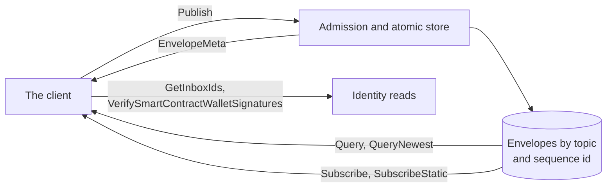

# Backend API contract

The gRPC contract every client depends on: what a caller sends, what it gets back, and what the backend guarantees about order, atomicity, and failure. A client publishes envelopes, reads them back by topic and position, and streams them as they arrive. Every promise here survives a reimplementation of the backend, because a client written against it has no other way to tell one backend from another.



## Scope

In scope: sequence ids, ordering, and visibility; the envelope wire format and the metadata the backend assigns; publish atomicity, idempotency, and admission, including what admission establishes and what it does not; query and paging; the subscribe frame contracts; identity lookups; request bounds; the status codes; and the transport.

Out of scope: credentials and which requests need one ([AUTH section 1](AUTH-backend-auth.md#1-admission)); the values of the published limits and how a client sizes its requests to them (`CONF`); the topic layout (`TOPIC`); push registration and delivery ([PUSH](PUSH-push-subscriptions.md)); retention enforcement, readiness, and health ([OPS](OPS-backend-operations.md)); the association log an identity update is checked against (IDENT-004, IDENT-005); the MLS objects a key package and a Welcome carry (`JOIN`); the commit-log entry ([FORK section 2](FORK-fork-recovery.md#2-keys-and-signatures)); and what a client does with a frame once received, including its positions on a topic ([PROC](PROC-message-processing.md)).

| Related | Relation |
| --- | --- |
| `TOPIC` | Owns the kind bytes, the identifier lengths, and the rejection of a malformed topic. This spec references it wherever a request names or an envelope carries a topic. |
| `CONF` | Owns every published limit and the rule that a published value is the enforced value (CONF-069). This spec owns what the backend does when a request exceeds one. |
| `JOIN` | Owns the key package validation the backend runs at admission (JOIN-007, JOIN-008), and the sequence id promises a join relies on. |
| [PROC](PROC-message-processing.md) | Owns durable receipt and processing positions (PROC-002, PROC-005) and stream recovery (PROC-021). |
| [SEND](SEND-message-sending.md) | Owns the client's retry of a prepared publish (SEND-007). |

## Terms

| Term | Meaning |
| --- | --- |
| Read | A `Query`, `QueryNewest`, `Subscribe`, or `SubscribeStatic` request. |
| Visible | The state of a stored envelope that a read can return. |
| Duplicate | An envelope whose topic and `message_hash` equal a stored envelope's. |
| Registration | One topic added to a stream, with the cursor it starts after and the catch-up target it was given. |
| Catch-up target | The `CatchupTarget.through_sequence_id` a registration receives, captured under API-252. |
| Frame | One message of a stream response. |
| Transport ceiling | The largest encoded request or response the transport carries, stated by API-282. |
| Wire length | The number of bytes of a request as the client encoded it, which the transport measures. |
| Re-encoded length | The number of bytes of the backend's own encoding of a decoded request (API-211), which admission measures. |
| Closed allocation boundary | The sequence id API-203 maintains, at or below which every publish has finished. |

## 1. Sequence ids, order, and visibility

The backend assigns every stored envelope a sequence id that is unique across all topics. Once an envelope is visible, each later publish receives a greater sequence id. Sequence ids on one topic need not be contiguous: other topics and failed publishes can leave gaps.

Order matters only within a topic. A read of a topic returns a prefix of that topic's order: no envelope becomes visible on a topic while a lower sequence id on the same topic is still being stored, and no later publish enters behind one already visible. Across topics the backend promises nothing: an envelope with a higher sequence id on one topic can be visible while a lower one on another topic is not yet.

A deployment may answer some reads from a lagging copy of its store. `QueryNewest`, a stream's catch-up target, and `GetInboxIds` can therefore answer from an earlier point in time than a publish response the client already holds; each still returns a prefix of every topic. Only `Query` is promised to read the client's own writes (API-202). PROC-021 defines when a client uses `Query` to reach a target, including a target from its own publish receipt.

A sequence id can be allocated to a publish that then fails, so at any moment some ids below the newest are neither visible nor ever will be, and others belong to publishes still in progress. The closed allocation boundary separates the two: at or below it, every publish has finished. The push dispatcher reads only up to the boundary under PUSH-257; a stream holds a gap open until the boundary passes it. The boundary only rises (API-291); a subscription start read from it under PUSH-216 stays final.

| ID | Title | Requirement | Why |
| --- | --- | --- | --- |
| API-286 | Sequence id range | The backend MUST assign every stored envelope a sequence id from 1 through 9223372036854775807 inclusive. | |
| API-287 | Sequence ids are globally unique | The backend MUST NOT assign the same sequence id to two different envelopes, including envelopes on different topics. | A join anchor and an identity reference compare sequence ids across topics (JOIN-037, JOIN-050). |
| API-288 | Sequence ids do not change | Once the backend assigns an envelope a sequence id, it MUST return that same sequence id for the envelope in every publish response and read. | A changed sequence id invalidates stored cursors and references. |
| API-289 | Later publishes have greater ids | When a publish arrives after an envelope became visible, the backend MUST assign each new envelope in that publish a sequence id greater than the visible envelope's sequence id, regardless of topic. | A later publish behind a stored cursor is never read by a client that resumes from that cursor. |
| API-201 | A read returns a prefix | The backend MUST NOT make an envelope visible on a topic while an envelope with a higher sequence id on that topic is already visible, and MUST return the envelopes of one topic in ascending sequence id from every read, including a read answered from a lagging copy of the store. | A client advances its cursor past what it received; an envelope that appears later behind that cursor is lost to it for ever. |
| API-202 | Query reads its own writes | When a `Query` request arrives after the backend sent the publish response that stored an envelope on a topic `Query` accepts (API-243), the response MUST include that envelope if its sequence id is greater than the cursor supplied for its topic and the effective limit (API-241) does not cut it under API-240. | A client that published a commit confirms it by reading the topic; a read that cannot see the client's own publish never confirms. |
| API-203 | The closed allocation boundary | The backend MUST maintain a closed allocation boundary: a sequence id at or below which every publish has committed or will never commit. Every envelope stored with a sequence id at or below the boundary MUST be visible to every read, and the backend MUST NOT later store an envelope with a sequence id at or below it. | A reader that takes the boundary as "nothing below here is still coming" skips an envelope for ever if one lands behind it. |
| API-291 | The boundary never decreases | The backend MUST NOT compute a closed allocation boundary lower than one it computed before, including one it computed before a restart. | A subscription stored against a later, lower boundary under PUSH-216 is woken for envelopes its client had already read when it subscribed. |

## 2. The envelope

A client publishes a `ClientEnvelope`. The backend decodes it, encodes the decoded message again with its own encoder, stores those bytes, and returns them inside a `ServerEnvelope` with the metadata it assigned. The payload byte fields, which carry MLS objects and signed structures, are returned byte for byte; only the protobuf framing around them is re-encoded, so the stored length can differ from the wire length. The message hash is computed over the stored bytes, so it is a stable identity for the same input and an opaque value to the client: a hash a client computes over its own encoding need not match. PROC-001 governs client validation and preservation of that hash.

```proto
// Position on one topic. `sequence_id` 0 means "from the beginning".
message Cursor {
  uint64 sequence_id = 1;
}

// One kind byte followed by an identifier; the layout is TOPIC-001.
message Topic {
  bytes topic = 1;
}

// Idempotency key, unique with the topic.
message MessageHash {
  oneof hash {
    bytes sha256 = 1;
  }
}

// Server-assigned metadata for one stored envelope.
message EnvelopeMeta {
  Cursor cursor = 1;
  uint64 server_ns = 2;
  MessageHash message_hash = 3;
  Topic topic = 4;
  uint64 expiry_ns = 5;
  bool is_commit_or_proposal = 6;
}

message GroupMessage {
  // Serialized MlsProtocolMessage.
  bytes data = 1;
  bytes sender_hmac = 2;
  bool should_push = 3;
}

message CommitLogEntry {
  // Serialized PlaintextCommitLogEntry.
  bytes serialized_commit_log_entry = 1;
  xmtp.identity.associations.RecoverableEd25519Signature signature = 2;
}

// What a client publishes. WelcomeMessage and KeyPackage are defined in JOIN.
message ClientEnvelope {
  oneof payload {
    GroupMessage group_message = 1;
    WelcomeMessage welcome_message = 2;
    KeyPackage key_package = 3;
    xmtp.identity.associations.IdentityUpdate identity_update = 4;
    CommitLogEntry commit_log_entry = 5;
  }
}

// A stored envelope with its server-assigned metadata.
message ServerEnvelope {
  EnvelopeMeta meta = 1;
  ClientEnvelope envelope = 2;
}
```

Every field of `EnvelopeMeta` is set by the backend. The table below says how, and API-212 makes it binding. `expiry_ns` is the retention bound; its value per kind, and what the backend does when it passes, are owned by OPS (OPS-001, OPS-002).

| Field | Value |
| --- | --- |
| `cursor.sequence_id` | The envelope's sequence id under API-286 through API-289. |
| `server_ns` | The backend's clock in nanoseconds since the Unix epoch, read once in the transaction that stores the request, after admission; every envelope one publish stores carries the same value. |
| `message_hash.sha256` | The SHA-256 of the stored bytes under API-211. |
| `topic.topic` | The topic under TOPIC-001. |
| `expiry_ns` | The value OPS-001 gives for the envelope's kind. |
| `is_commit_or_proposal` | `true` when the payload is a group message whose `content_type` ([RFC 9420 §6](https://www.rfc-editor.org/rfc/rfc9420.html#section-6)) is `commit` or `proposal`; `false` for every other envelope. |

| ID | Title | Requirement | Why |
| --- | --- | --- | --- |
| API-210 | Wire format | The backend MUST accept and return every message defined in a `proto` block of this spec with the field numbers, types, and presence shown, and MUST NOT reuse a field number of any of them for another meaning. | |
| API-211 | Stored bytes and hash | The backend MUST store the bytes its own encoder produces for the decoded `ClientEnvelope`, MUST return every `bytes` field of the payload exactly as received, and MUST set `message_hash.sha256` to the SHA-256 of the stored bytes, so that two `ClientEnvelope` messages that decode to the same value yield the same hash. | The payload fields carry signatures and ciphertext that a changed byte invalidates. The hash is the idempotency key, so it has to be the same on a retry. |
| API-212 | Metadata is assigned by the backend | The backend MUST set every field of `EnvelopeMeta` on every envelope it returns to the value the table above gives. | A client-chosen `is_commit_or_proposal` would exempt spam from retention; a client-chosen `server_ns` would reorder a conversation on every other member's screen. |

## 3. Publish

A publish is one atomic request: every envelope in it is stored, or none is. Its idempotency key is the topic and the message hash, so a client that did not receive a response retries the same bytes and gets the stored metadata back, whether the first attempt committed or not. Storage and the response are separate steps: a publish can commit and then fail on the way back, when its response is longer than the transport carries or the connection drops, so a failed response is not proof that nothing was stored (API-224). After `OUT_OF_RANGE`, which API-284 forbids the client to retry unchanged, a `Query` of the topic is the recovery read: it settles each envelope as committed with its receipt or as not stored (API-290). SEND-007 owns retries and SEND-008 owns publish receipts; SEND-011 distinguishes publication from confirmed send success.

A duplicate is accepted on its stored identity. The checks that depend on time or on state, a key package's lifetime or an identity update's history, are not run again for it, so a retry of an envelope that was valid when stored succeeds after the moment it would have been rejected as new. What is still checked for a duplicate is what admission must do to recognise it: the envelope parses and the request is within its bounds.

```proto
message PublishRequest {
  repeated ClientEnvelope envelopes = 1;
}

// Same order as the request, including duplicates.
message PublishResponse {
  repeated EnvelopeMeta envelope_metas = 1;
}

// Attached as a google.rpc.Status detail on a publish INVALID_ARGUMENT.
message PublishError {
  enum Reason {
    REASON_UNSPECIFIED = 0;
    REASON_MALFORMED_PAYLOAD = 1;
    REASON_INVALID_KEY_PACKAGE = 2;
    REASON_INVALID_IDENTITY_UPDATE = 3;
    REASON_INVALID_SIGNATURE = 4;
    REASON_TOO_LARGE = 5;
  }

  // Index of the failing envelope in the request. Absent for request-level
  // errors.
  optional uint32 index = 1;
  Reason reason = 2;
  string message = 3;
}
```

| ID | Title | Requirement | Why |
| --- | --- | --- | --- |
| API-220 | A publish is atomic | The backend MUST store every envelope of a publish request that is not a duplicate in one transaction that commits all of them or none of them, and MUST NOT answer with success unless that transaction committed. | A commit and the Welcomes it produces travel in one request. Storing one without the other forks the group for the members it left out. |
| API-224 | A failed response proves no rollback | When a publish request has committed, the backend MUST answer a later request carrying the same envelopes under API-222 whether or not the first response reached the client. When a publish returns a status other than `INVALID_ARGUMENT` or `ABORTED`, the client MUST NOT publish a different envelope for the same message until a retry of the same bytes or a `Query` of the topic has returned that message's outcome. | A response can be lost after the commit. A client that re-encrypts on the strength of the lost response publishes the same message twice, and every member sees both. |
| API-290 | Recovery after `OUT_OF_RANGE` | When a publish has returned `OUT_OF_RANGE`, the backend MUST return each envelope of that request that committed, with the sequence id and `message_hash` the publish assigned, from a `Query` of its topic that arrives after that status, under API-202. An envelope of that request that such a `Query` does not return MUST NOT have been stored by that publish. | A client may not resend the request unchanged (API-284), so without a read that settles each envelope it can only re-encrypt, and every member then sees the message twice. |
| API-221 | One entry per envelope, in order | The backend MUST answer a publish with one `EnvelopeMeta` for each envelope in the request, at the same index, including an envelope that is a duplicate of another in the same request. | |
| API-222 | Publishing Is Idempotent | When an envelope is a duplicate, whether of an envelope stored by an earlier request, by a request in progress at the same time, or by an earlier index of the same request, the backend MUST NOT store it again, MUST return the stored envelope's `EnvelopeMeta` for it as success, and MUST NOT apply to it any check of the admission table beyond parsing under API-230. The bounds table (section 7) MUST still apply to the request. | A retry after a lost response would otherwise store a second copy or fail, and a client cannot tell either from a first attempt. A key package retried after its lifetime would be rejected for a copy the backend already serves. |
| API-223 | Failure names the envelope | When the backend fails a publish with `INVALID_ARGUMENT`, the status MUST carry a `PublishError` detail whose `reason` is the value the admission table names for the failure, or `REASON_TOO_LARGE` for a bound in the bounds table (section 7), and whose `index` is the lowest request index of a failing envelope, or absent when the whole request exceeded a bound. | A client with no index can only drop the whole batch; with one it drops the bad envelope and resends the rest. |

### 3.1 Admission

The backend parses every envelope to derive its topic and metadata, and validates the two kinds it holds the state to validate: a key package, whose signatures and lifetime are self-contained, and an identity update, whose whole history is the inbox's identity topic. Nothing else is checked. The backend holds no group key, so a group message is stored on the strength of its framing alone, and a Welcome or a commit-log entry on the strength of one identifier. What acceptance does not establish is listed so that no client reads a stored envelope as more than it is.

The identity update is validated against the complete history of the inbox, read once from the store that publishes commit, so an update that depends on one the client has just had confirmed is validated against it. If that history grows between the read and the store, the validation may have passed against a state that no longer exists, so the request is aborted and the client starts over from the new history. IDENT-005 owns the association validation required at admission, including the signature rules in [IDENT section 4](IDENT-identity-updates.md#4-signature-kinds).

A key package is validated by the MLS rules and nothing more. Four properties a stricter validator might check are accepted on purpose, because the installations on the network today publish packages that have them, and a backend that started rejecting them would cut those installations off from every group (API-235).

| Kind | Parsed as | Also checked | Reason on failure | Not established |
| --- | --- | --- | --- | --- |
| Group message | `GroupMessage.data` as an `MLSMessage` whose body is a `PublicMessage` or `PrivateMessage` ([RFC 9420 §6](https://www.rfc-editor.org/rfc/rfc9420.html#section-6)); bytes after the message are accepted and stored | Nothing | `REASON_MALFORMED_PAYLOAD` | That the sender is a member, that the signature verifies, that the epoch is current, or that any member can decrypt it |
| Welcome | `WelcomeMessage` with `version` set | Nothing | `REASON_MALFORMED_PAYLOAD` | That `installation_key` names a registered installation, or that the recipient can decrypt it |
| Key package | `KeyPackage.key_package_tls_serialized` as a `KeyPackage` ([RFC 9420 §10](https://www.rfc-editor.org/rfc/rfc9420.html#section-10)), consuming every byte | JOIN-007, JOIN-008, and that the credential decodes under JOIN-004 | `REASON_MALFORMED_PAYLOAD` when it does not parse or TOPIC-002 rejects it, `REASON_INVALID_KEY_PACKAGE` otherwise | That the inbox the credential names exists or associates the leaf node's `signature_key`; the four properties API-235 names |
| Identity update | `IdentityUpdate` with `inbox_id` accepted by TOPIC-002 | IDENT-005: signature verification and application to the association state built from every envelope on the inbox's identity topic | `REASON_MALFORMED_PAYLOAD` when TOPIC-002 rejects it, `REASON_INVALID_SIGNATURE` when a signature does not verify, `REASON_INVALID_IDENTITY_UPDATE` otherwise | That the caller is authorized to act for the inbox |
| Commit-log entry | `CommitLogEntry.serialized_commit_log_entry` as a `PlaintextCommitLogEntry` | Nothing; `signature` is stored and returned unverified | `REASON_MALFORMED_PAYLOAD` | That the signature verifies, that the epoch continues the previous entry, or that the hash chain holds |

| ID | Title | Requirement | Why |
| --- | --- | --- | --- |
| API-230 | Admission by kind | The backend MUST parse each envelope as the admission table above states for its kind, apply the checks the table names, and fail the request with the reason the table names when a parse or a check fails; an envelope whose `payload` is unset, or that TOPIC-002 rejects, fails with `REASON_MALFORMED_PAYLOAD`. The backend MUST NOT apply a check the table does not name and MUST NOT reject an envelope for a property the table lists as not established. | Every client on the network parses what the backend stored. A stored envelope that no client can parse blocks a topic; a rejection for a property the backend cannot judge blocks a valid one. |
| API-235 | Accepted key package shapes | The backend MUST NOT reject a key package that passes JOIN-007 and JOIN-008 because its credential's `inbox_id` is not 64 hexadecimal characters, because its `cipher_suite` is a suite other than the one JOIN-072 names whose signature scheme yields a 32-byte `signature_key`, because its leaf node `Capabilities` omit an extension or proposal type, or because its `Lifetime` is longer than any bound. | Installations already on the network publish packages with each of these shapes. A backend that rejects one makes those installations unaddable everywhere at once. |
| API-231 | A verifier failure is not a verdict | If a smart contract wallet signature cannot be verified because the chain RPC or the verifier fails, rather than because the signature is invalid, then the backend MUST fail the request with `UNAVAILABLE` and MUST NOT report the signature as invalid. | An `INVALID_ARGUMENT` is never retried, so a transient outage would turn a valid identity update into a permanent rejection. |
| API-232 | One history, or start over | The backend MUST validate an identity update against every envelope on the inbox's identity topic, including every one a publish response has confirmed, read in one snapshot; if at commit the highest sequence id on that topic is not the highest in that snapshot, or 0 when the snapshot was empty, then it MUST fail the request with `ABORTED` and store nothing. | An update validated against a history that has since grown can conflict with the update that grew it, and two conflicting updates in one log make the inbox's state undefined. |
| API-233 | One update per inbox per request | When a request carries two identity updates for one inbox that are not duplicates of each other, the backend MUST fail the request with `REASON_INVALID_IDENTITY_UPDATE`. | The second cannot be validated against a history that includes the first until the first is stored. |
| API-234 | The association log is bounded | When an identity update that is not a duplicate names an inbox whose identity topic already holds `max_identity_entries` (CONF-069) envelopes, the backend MUST fail the request with `REASON_INVALID_IDENTITY_UPDATE`. | Every validator replays the whole log. An unbounded log is a cost imposed on every party that ever resolves the inbox. |

## 4. Query

`Query` accepts topics, a cursor for each topic, and a total result limit. Its response contains envelopes after those cursors, in ascending sequence-id order within each topic, and `has_more` indicates whether another page is available. It does not omit an eligible envelope below another returned envelope on the same topic. `QueryNewest` returns the envelope with the greatest sequence id, or only its metadata, for each requested topic that has an envelope. Results identify their topics; a topic with no envelope has no result. Key package topics are accepted only by `QueryNewest`. To request the next page, a client advances each topic's cursor under PROC-002 and repeats the query while `has_more` is true.

```proto
// One topic and the position to read from.
message TopicQuery {
  Topic topic = 1;
  // Return envelopes with sequence_id > cursor. Absent = 0.
  Cursor cursor = 2;
}

message QueryRequest {
  repeated TopicQuery queries = 1;
  // Total across all topics.
  uint32 limit = 2;
}

message QueryResponse {
  repeated ServerEnvelope envelopes = 1;
  Continuation continuation = 2;
}

message Continuation {
  bool has_more = 1;
}

message QueryNewestRequest {
  repeated Topic topics = 1;
  bool include_full_envelope = 2;
}

message QueryNewestResponse {
  message Result {
    Topic topic = 1;
    EnvelopeMeta meta = 2;
    // Set only when `include_full_envelope` was true.
    ClientEnvelope envelope = 3;
  }

  repeated Result results = 1;
}
```

| ID | Title | Requirement | Why |
| --- | --- | --- | --- |
| API-240 | A page above the cursors | The backend MUST answer `Query` with envelopes whose sequence id is greater than the cursor supplied for their topic, at most the effective limit (API-241) in total, each stored envelope at most once, and for every topic the page includes, the envelopes with the lowest eligible sequence ids on that topic with none omitted between them. When any envelope is eligible the page MUST contain at least one, and `has_more` MUST be whether more envelopes were eligible than the effective limit allowed, computed from the same read as the page. | A page that leaves out an envelope below one it returns loses that envelope to a client that moves its cursor forward, and a page cut short with `has_more` false is history a client never asks for again. |
| API-241 | Limit default and ceiling | When `QueryRequest.limit` is 0, the backend MUST page by `default_query_limit`; when it is greater than `max_query_limit`, the backend MUST page by `max_query_limit` (CONF-069). | |
| API-242 | Repeated topics read from the lowest cursor | When `QueryRequest.queries` names one topic more than once, the backend MUST read that topic from the lowest cursor supplied for it. | Reading from a higher one skips the range another entry asked for. |
| API-243 | No paging on key package topics | When a `Query` names a topic whose kind is key package under TOPIC-001, the backend MUST fail the request with `INVALID_ARGUMENT`. | |
| API-244 | The newest envelope per topic | The backend MUST answer `QueryNewest` with one `Result` for each distinct requested topic that has a visible envelope, carrying the `EnvelopeMeta` of the envelope with the highest sequence id on that topic, and the `envelope` only when `include_full_envelope` is true; a topic with no visible envelope MUST be absent from `results`. | A sender picks an installation's key package by this read. A result for an older package addresses a Welcome to keys the installation may have destroyed (JOIN-074). |
| API-245 | Results match by topic | When the client reads a `QueryNewestResponse`, it MUST take each `Result` for the topic its `topic` field names and MUST NOT pair results with requested topics by position. | A topic left out of `results` shifts every later position, so a client pairing by position reads one installation's key package as another's and addresses a Welcome to the wrong installation. |

## 5. Subscribe

A stream delivers, for each registered topic, every visible envelope above the registration's cursor, in sequence id order, first the history and then new publications as they arrive, with no frame that distinguishes the two. A `Subscribe` stream is bidirectional: the client adds and removes topics while it runs, each update is acknowledged with the catch-up targets of the topics it added, and either side proves the other is alive with `Ping` and `Pong`. A `SubscribeStatic` stream takes its whole topic set from the request, for a client that cannot send on an open stream, and receives one-way `Keepalive` frames instead.

The catch-up target is the head of the topic, read once after the topic is registered so that no publish can land between the two. It tells the client how far history runs; the client decides for itself when it has processed that far, because the backend cannot see processing. A target of 0 means the topic was empty. Catch-up is shared fairly: while several registrations still have history to deliver, none of them waits on another's, so a client that adds many topics sees all of them advance. PROC-016 and PROC-023 own client catch-up completion and reporting; PROC-021 owns recovery from durable receipt positions.

```proto
// Fixed catch-up boundary for one newly registered topic.
message CatchupTarget {
  Topic topic = 1;
  // Observed head in the serving database. Zero means empty.
  uint64 through_sequence_id = 2;
}

message SubscribeRequest {
  message Update {
    // Nonzero and strictly increasing within this connection.
    uint64 id = 1;
    repeated TopicQuery adds = 2;
    repeated Topic removes = 3;
  }

  oneof request {
    Update update = 1;
    Ping ping = 2;
    Pong pong = 3;
  }
}

message SubscribeResponse {
  message Started {
    uint32 keepalive_interval_ms = 1;
  }

  message Applied {
    uint64 id = 1;
    // Newly registered topics only, in add order.
    repeated CatchupTarget added_targets = 2;
  }

  message Messages {
    repeated ServerEnvelope envelopes = 1;
  }

  oneof response {
    Started started = 1;
    Applied applied = 2;
    Messages messages = 3;
    Ping ping = 4;
    Pong pong = 5;
  }
}

message Ping {
  uint64 nonce = 1;
}

message Pong {
  // Echoes the Ping nonce.
  uint64 nonce = 1;
}

message SubscribeStaticRequest {
  repeated TopicQuery topics = 1;
}

message SubscribeStaticResponse {
  message Started {
    uint32 keepalive_interval_ms = 1;
    // One per requested topic, in request order, including empty topics.
    repeated CatchupTarget targets = 2;
  }

  message Messages {
    repeated ServerEnvelope envelopes = 1;
  }

  // One-way liveness signal. No reply is expected.
  message Keepalive {}

  oneof response {
    Started started = 1;
    Messages messages = 2;
    Keepalive keepalive = 3;
  }
}
```

A frame of `Messages` can carry envelopes of more than one topic, and the order across topics inside a frame carries no meaning. A client that stops reading is closed rather than throttled: the backend holds a bounded amount of output for each stream and, when live traffic cannot be queued, fails the stream with `RESOURCE_EXHAUSTED` so that one slow client cannot hold up every other. The stream's closing status tells the client what to do next: reconnect after `UNAVAILABLE`, `RESOURCE_EXHAUSTED`, or `DEADLINE_EXCEEDED`, and fix the request after `INVALID_ARGUMENT`.

| ID | Title | Requirement | Why |
| --- | --- | --- | --- |
| API-250 | Started comes first | The backend MUST send `Started` as the first frame of a `Subscribe` stream, before it reads any request frame, with `keepalive_interval_ms` set to the interval API-255 uses. | |
| API-251 | An invalid update fails the stream | When an `Update` has an `id` of 0 or not greater than the previous accepted `id` on the stream, names one topic more than once across `adds` and `removes`, names a topic TOPIC-003 rejects, or carries a cursor greater than 9223372036854775807, or when a request frame's `request` is unset, the backend MUST fail the stream with `INVALID_ARGUMENT`. | |
| API-252 | Applied acknowledges every update | The backend MUST answer every accepted `Update` with one `Applied` carrying the same `id`, in the order the updates were received, whose `added_targets` lists exactly the topics the update newly registered, in add order, each with `through_sequence_id` set to the highest sequence id visible on that topic in one read made after the topic was registered, or 0 when none was visible. The backend MUST NOT send a `Messages` frame for a registration before its `Applied`, and MUST NOT change a registration's target after it. | A client that sees `Applied` knows every later envelope on that topic is above the cursor it supplied, and a target captured before registration could miss a publish that landed between the two. |
| API-253 | Adds and removes are idempotent | When an `Update` adds a topic that is already registered, the backend MUST leave that registration unchanged, whatever cursor the add supplied, and MUST NOT list it in `added_targets`; when it removes a topic that is not registered, the backend MUST do nothing for it. When an `Update` removes a registered topic, the backend MUST NOT send an envelope of that registration after that update's `Applied`, and a later add of the same topic MUST start a new registration from the cursor that add supplies. | A client reconciles its interest set by resending it; an add that moved a live registration would rewind or skip delivery for it. |
| API-254 | Deliver everything, in order, or fail | While a topic is registered, the backend MUST deliver every visible envelope on it with a sequence id greater than the registration's cursor, in strictly increasing sequence id across frames, and MUST NOT skip one; when it cannot, it MUST fail the stream with the status the table in section 7 names. | A skipped envelope is invisible to the client until it reconnects; a skipped commit is a fork. |
| API-255 | Idle keepalive | When `keepalive_interval_ms` passes with no frame sent on a stream, the backend MUST send a `Keepalive` on a `SubscribeStatic` stream, and a `Ping` on a `Subscribe` stream unless a `Ping` it sent is still unanswered. | Without it a client behind a dropped connection waits for ever on a stream that no longer exists. |
| API-256 | Ping is answered | When the backend or the client receives a `Ping` on a `Subscribe` stream, it MUST send a `Pong` whose `nonce` equals the `Ping`'s. | |
| API-257 | A missed Pong closes the stream | When the backend has sent a `Ping` and no `Pong` carrying its `nonce` arrives within the interval the operator configures, 90 seconds by default, the backend MUST fail the stream with `DEADLINE_EXCEEDED`. The backend MUST NOT send a second `Ping` while one is unanswered. | A stream nobody reads holds registrations and output for as long as it stays open. |
| API-258 | Frame rate is bounded per stream | The backend MUST admit `Update` frames at `max_update_frames_per_second` with a burst of `max_update_burst`, and client `Ping` frames at `max_ping_frames_per_second` with a burst of `max_ping_burst` (CONF-069), and when a frame exceeds its bucket MUST fail the stream with `RESOURCE_EXHAUSTED`. A `Pong` MUST NOT count against either bucket. | A client answering the backend's own challenges must never be closed for answering them. |
| API-259 | Only the client ends a healthy stream | The backend MUST NOT end a `Subscribe` stream while the client's request stream is open and no failure in the status table has occurred, whether or not a topic is registered; when the client ends its request stream, the backend MUST end the response stream without an error status. A `SubscribeStatic` stream MUST stay open until the client cancels it or a failure closes it. | A client opens its stream before it knows its topics, and a client that half-closes to say "no more updates" and expects delivery to continue loses every envelope from then on. |
| API-261 | Catch-up does not starve | While two or more registrations each have visible envelopes at or below their catch-up target not yet delivered, the backend MUST NOT send a second `Messages` frame of such envelopes to one of them before every other has received one. | A client that registers a group beside a thousand busy ones would otherwise see that group's history only after all of theirs. |
| API-260 | A static stream starts with its targets | The backend MUST fail a `SubscribeStatic` request with `INVALID_ARGUMENT` when `topics` is empty or names one topic more than once, and otherwise MUST send `Started` as the first frame, with one `CatchupTarget` per requested topic in request order, including a topic with no envelope, before any `Messages` frame. | |

## 6. Identity reads

`GetInboxIds` resolves external identifiers to inbox ids from the association state the backend has admitted. An identifier can be associated with more than one inbox over its life; the lookup answers with the inbox of the most recent association that has not been revoked, and revoking that one can bring an older association back into view. Lookup keys are compared in a normalized form, so an Ethereum address matches whatever its letter case; the signed bytes of an identity update are never normalized. `VerifySmartContractWalletSignatures` verifies ERC-1271 and ERC-6492 signatures over the chains the deployment publishes (CONF-070) for a client that holds no chain access of its own.

```proto
message GetInboxIdsRequest {
  message Request {
    string identifier = 1;
    xmtp.identity.associations.IdentifierKind identifier_kind = 2;
  }

  repeated Request requests = 1;
}

message GetInboxIdsResponse {
  message Response {
    string identifier = 1;
    xmtp.identity.associations.IdentifierKind identifier_kind = 2;
    optional string inbox_id = 3;
  }

  repeated Response responses = 1;
}

message VerifySmartContractWalletSignaturesRequest {
  message Signature {
    // CAIP-10 account id.
    string account_id = 1;
    // Block to verify at. Absent = latest.
    optional uint64 block_number = 2;
    bytes hash = 3;
    bytes signature = 4;
  }

  repeated Signature signatures = 1;
}

message VerifySmartContractWalletSignaturesResponse {
  message Response {
    bool is_valid = 1;
    optional uint64 block_number = 2;
    optional string error = 3;
  }

  repeated Response responses = 1;
}
```

| ID | Title | Requirement | Why |
| --- | --- | --- | --- |
| API-270 | Resolve to the latest live association | The backend MUST answer `GetInboxIds` with one `Response` per request entry, at the same index, echoing `identifier` and `identifier_kind` as sent, whose `inbox_id` is the inbox whose association with that identifier and kind has the highest sequence id among those not revoked, comparing an Ethereum address without regard to letter case and a passkey by its public key bytes, or absent when there is none. | A DM addressed by identifier reaches whichever inbox this answers with; an answer that ignores revocation reaches an inbox the user gave up. |
| API-271 | One verdict per signature | When every `account_id` is a CAIP-10 account id and every `hash` is 32 bytes, the backend MUST answer `VerifySmartContractWalletSignatures` with one `Response` per request entry, at the same index, whose `is_valid` is the verdict at `block_number`, or at the latest block when it is absent, and whose `block_number` is the block the verdict was reached at; a verdict that a signature is invalid is `is_valid` `false`, not a failed request. When an `account_id` or `hash` is malformed, the backend MUST fail the request with `INVALID_ARGUMENT`; when a verdict cannot be reached, it MUST fail under API-231. | A client verifying a signature at "latest" needs the block to record with the association, and a whole request failed for one invalid signature hides the verdicts of the others. |

## 7. Bounds, errors, and transport

Every request has a bound it cannot exceed, published so that a client sizes its requests before it sends (CONF-073). The backend enforces each one; a client that sends past a bound gets `INVALID_ARGUMENT` and nothing stored. The byte budget on a request is measured twice: the transport measures the wire length before the backend sees the request, so a request that is too long on the wire is `OUT_OF_RANGE`, and admission measures the re-encoded length, which can be longer than the wire length when the client used a shorter varint encoding than the backend does, so a request that is within the budget on the wire and over it re-encoded is `INVALID_ARGUMENT` with `REASON_TOO_LARGE`. The transport ceiling is fixed, and configuration keeps every published byte budget under it (CONF-008), so a request within the published limits is always carried. The one response not bounded by `max_response_bytes` is `GetConfiguration`, which CONF-009 bounds separately.

The bounds table names each request's limits and the field of `LimitsConfiguration` that publishes them (CONF-069). A publish that exceeds one carries `REASON_TOO_LARGE`; a bound checked on the input count is checked before repeated topics are merged.

| Request | Bound |
| --- | --- |
| `Publish` | Re-encoded request not longer than `max_request_bytes`; each envelope's re-encoded length not longer than `max_envelope_bytes`; distinct topics not more than `max_publish_topics`; ERC-6492 signatures in one identity update not more than `max_scw_signatures` |
| `Query` | Entries in `queries` not more than `max_query_topics` |
| `QueryNewest` | Topics not more than `max_newest_full_topics` with `include_full_envelope` true and `max_newest_metadata_topics` with it false |
| `GetInboxIds` | Entries not more than `max_lookup_identifiers` |
| `VerifySmartContractWalletSignatures` | Entries not more than `max_scw_signatures` |
| `SubscribeStatic` | Topics not more than `max_static_topics` |
| `Subscribe` `Update` | `adds` not more than `max_update_adds`; `removes` not more than `max_update_removes`; topics registered after the update not more than `max_stream_topics` |
| Any request | Every `Cursor.sequence_id` not greater than 9223372036854775807 |

The status table maps each failure a client can meet to the code it receives. A client classifies by code, never by message text, because the text is free to change. `INVALID_ARGUMENT` is never retried unchanged: the same request fails the same way. `ABORTED` on a publish means the identity history moved (API-232); the client re-reads the inbox's identity topic, rebuilds the update against it, and sends that. `UNAVAILABLE` and `DEADLINE_EXCEEDED` are retried with backoff; on a publish, a retry is safe under API-222 whether or not the first attempt committed. `OUT_OF_RANGE` on a publish does not prove the publish was not stored: a response can exceed the ceiling after the request committed.

| Condition | Code |
| --- | --- |
| An envelope fails admission (API-230), or a request exceeds a bound in the bounds table or is malformed in a way this spec names | `INVALID_ARGUMENT`, with a `PublishError` detail on a publish (API-223) |
| The wire length of a request is longer than `max_request_bytes` or the transport ceiling; an encoded unary response, or a `Messages` frame, is longer than `max_response_bytes` or the ceiling | `OUT_OF_RANGE` |
| A request arrives with a compression encoding | `UNIMPLEMENTED` |
| The identity history changed during validation (API-232) | `ABORTED` |
| A chain RPC or verifier failure (API-231); the store is unreachable; a stream is opened or running while the backend is recovering its stream state; the backend is shutting down | `UNAVAILABLE` |
| A publish or a store operation exceeds the backend's own time limit; a `Pong` did not arrive (API-257) | `DEADLINE_EXCEEDED` |
| A stream's frame bucket is exhausted (API-258); a stream's output cannot be queued because the client is not reading; a stored envelope cannot fit a frame; a `Started`, `Applied`, `Ping`, or `Pong` frame would be longer than `max_response_bytes` | `RESOURCE_EXHAUSTED` |
| A stored value violates an invariant the backend maintains | `INTERNAL` |

| ID | Title | Requirement | Why |
| --- | --- | --- | --- |
| API-281 | Status codes | The backend MUST fail a request or a stream with the code the status table above names for its condition, and MUST NOT fail it with `INVALID_ARGUMENT` for a condition the table maps to another code. | A client retries by code. A retryable failure reported as `INVALID_ARGUMENT` is dropped for good; a permanent one reported as `UNAVAILABLE` is retried for ever. |
| API-282 | The transport ceiling | The backend MUST carry a request whose wire length, and a response whose encoded length, is not longer than 26214400 bytes (25 MiB) and is within `max_request_bytes` or `max_response_bytes`, and when a message is longer than the ceiling or the budget it MUST fail it rather than truncate it. | A client sizes its requests to the published budget (CONF-073); a ceiling below it fails every request the client was told it may send. |
| API-283 | A response is complete or fails | The backend MUST NOT omit an envelope, a result, or a response entry from a successful response to keep it under a byte limit. | A page that silently drops rows and reports `has_more` false is history the client never fetches. |
| API-284 | Retry by code | A client MUST NOT resend a request unchanged after `INVALID_ARGUMENT`, `OUT_OF_RANGE`, or `UNIMPLEMENTED`, and after `ABORTED` on a publish MUST read the inbox's identity topic and rebuild the identity update before it resends. | A client that retries a permanent rejection loads the deployment with a request that can never succeed, and one that resends a stale identity update aborts again for ever. |
| API-285 | One port for gRPC and gRPC-Web | The backend MUST serve every service on one port over both gRPC and gRPC-Web, and MUST expose the `grpc-status`, `grpc-message`, and `grpc-status-details-bin` headers to a cross-origin browser client. | A browser client cannot open an HTTP/2 gRPC connection, and without the exposed headers it cannot read the status or the `PublishError` detail. |

## Known limitations

A read other than `Query` can lag a publish the client already holds a response for. An installation that has just published its key package or identity update can be absent from `QueryNewest` and `GetInboxIds` for a short time, and a catch-up target captured then is below the publish. Elapsed time is not proof that an envelope is absent; only `Query` reads its own writes (API-202).

Sequence ids allocated but never stored leave gaps on a topic that look like envelopes not yet visible. A stream holds such a gap open until the closed allocation boundary (API-203) passes it; a `Query` and a `QueryNewest` do not wait and can return an envelope above the boundary. A client cannot distinguish a gap from a lagging publish by any read.

Publish admission establishes only what the admission table says. A stored group message is not evidence that its sender is a member; a stored Welcome is not evidence that its destination exists; a stored commit-log entry is not evidence that its signature verifies. Storage and the recipient's processing capacity can be consumed by anyone who can reach the backend, subject to the credential checks in [AUTH section 1](AUTH-backend-auth.md#1-admission).

Bytes after the MLS message in `GroupMessage.data` are accepted and stored. No client is known to produce them. They are not a forgery or a disclosure: the parsed message and its topic are unchanged. They are malleability and amplification: each different suffix changes the stored bytes and the message hash, so one message becomes as many stored envelopes, each with its own sequence id, as an attacker cares to publish, bypassing API-222 and consuming storage and every recipient's processing; a commit or proposal variant also keeps its zero expiry (OPS-001). Rejecting trailing bytes at admission would close this without rejecting any envelope already stored, because reads do not re-run admission; no such change is approved by this spec.

The backend does not read a client's version on a request, and it does not enforce the advisory group shapes it publishes; both are the client's to apply (CONF-049, CONF-043).

A `Subscribe` stream with no registered topic stays open and costs the deployment a connection. There is no quota on concurrent streams per caller beyond the connection's HTTP/2 stream limit, which the operator configures.
