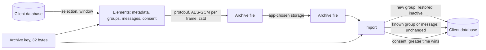
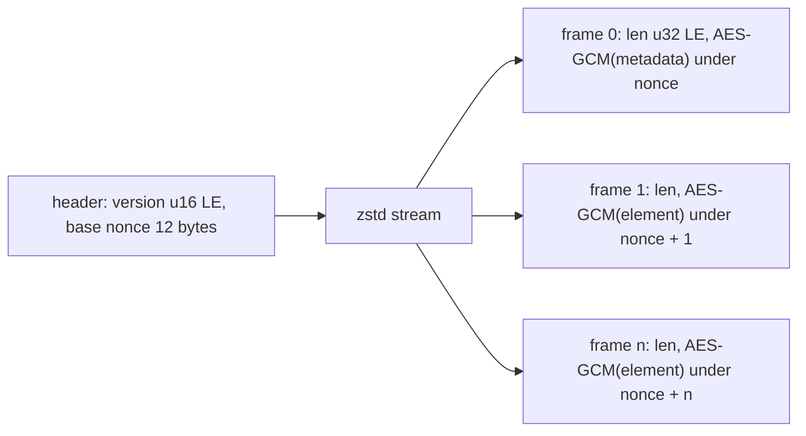

# Archive format

The format a client exports for backup and device transfer. An archive outlives the version that wrote it, so the compatibility promise is the whole point of specifying it.

An archive is a file the client writes from its own database under a key the app supplies, and reads back into a database that may be empty or may already hold some of the same conversations. It carries what a user owns and can read: the groups they were in, the messages of those groups, and their consent records. It carries nothing that would let its holder act as the installation: no MLS state, no private key, no key package. A group installed from an archive is readable and inactive until a member adds the installation again with a Welcome, which is the one way MLS admits a new installation to a group.



## Scope

In scope: the container framing, its encryption, and its version; the element kinds and their wire form; what an export includes and excludes and the selection an app makes; the promise that an archive written under this version loads in every later client; what an app can read from an archive without importing it; and how an import merges each element with existing local state.

Out of scope: what a consent record means and how two records merge (`?CONS`); what a message's content means (CTYPE); what group metadata means (`?META`); how a restored group becomes active again, which is a Welcome (JOIN); the device sync channel, which does not carry archives (`?SYNC`); and where an app stores an archive and its key.

| Related | Relation |
| --- | --- |
| `?CONS` | Owns the `ConsentSave` form of a consent element and the merge rule an import applies to it. |
| CTYPE | Owns the `EncodedContent` a message element carries in `decrypted_message_bytes`. |
| JOIN | Owns the Welcome that replaces a restored group's state. A restored group holds no epoch secrets, so it is an ended group for JOIN-042. |
| `?META` | Owns the meaning of the metadata attributes and admin lists a group element carries. |
| `?PROC` | Owns the storage of a received message and the message id that an import deduplicates on. |

## Terms

| Term | Meaning |
| --- | --- |
| Archive | One file in the container format of section 1: a header, then frames. |
| Archive key | The 32-byte key the app supplies to write or read an archive. |
| Header | The first 14 bytes of an archive: the version and the base nonce, in the clear. |
| Frame | One encrypted `BackupElement`, prefixed by its length, inside the compressed stream. |
| Element | One `BackupElement`: metadata, a group, a message, or a consent record. |
| Metadata element | The first element of every archive: what was selected, the window, and when the archive was written. |
| Selection | The `elements` list of the options an app exports with: `MESSAGES`, `CONSENT`, or both. |
| Window | The `start_ns` and `end_ns` of the options, bounding the messages exported by their send time. |
| Restored group | A group whose local state an import created: the stored row and metadata, with no MLS state. |

## 1. The container

An archive is a header followed by one zstd stream. The header is the container version as two little-endian bytes and a 12-byte base nonce, both in the clear. Inside the stream are frames. Each frame is a 4-byte little-endian length and then that many bytes of AES-GCM ciphertext, tag included, of one encoded `BackupElement` under the 256-bit archive key. The nonce of frame *i* is the base nonce plus *i*, treated as a 96-bit little-endian counter that wraps. Encryption comes before compression: the stream compresses ciphertext, so its size gain is nil, and the format is stated as it is.

The container version is 0. It changes only when the header or the framing changes; an element gains fields without it. An archive written by the first exporter used the base nonce for every frame; the current importer retries a frame that fails under its counter nonce with the nonce decremented by one, which recovers those archives. A wrong key fails the first frame under both nonces, so a wrong key is detected before any element is applied.



| ID | Title | Requirement | Why |
| --- | --- | --- | --- |
| ARCH-001 | Container layout | When the client writes an archive, it MUST write the header as the version 0 as two little-endian bytes and then a 12-byte base nonce drawn from a cryptographically secure random source for this archive alone, followed by one zstd stream of frames. Each frame MUST be a 4-byte little-endian length and then the AES-GCM ciphertext, tag included, of one encoded `BackupElement` under the 256-bit archive key with no associated data, where frame *i* uses the base nonce plus *i* as a 96-bit little-endian counter. | A nonce reused under one key discloses both frames and forfeits the authentication. |
| ARCH-002 | Legacy nonce | If a frame fails authentication under its counter nonce, then the client MUST retry it under that nonce decremented by 1 and, when that succeeds, MUST continue the counter from the nonce that succeeded; if that also fails, it MUST fail the import. | Archives written before the counter existed used one nonce for every frame, and they are the only copy a user may have. |
| ARCH-003 | Reject a later version | When the header's version is greater than 0, the client MUST fail the import before it reads any frame, naming the version. | A later container may frame or encrypt differently, and reading it as version 0 either fails on the first frame or applies elements it misread. |
| ARCH-004 | Elements never change meaning | The client MUST NOT reuse a field number of any message in section 2 for another meaning, MUST NOT change the type of a field, and MUST NOT reuse a retired value of any enum in section 2. | Every archive already written is read by every later client. |
| ARCH-005 | Unknown elements are skipped | When an element's `element` is unset, or is a variant the client does not implement, including `event`, the client MUST skip it and continue with the next frame. | An archive from a later client would otherwise fail on the first element the older client has not learned. |

## 2. Elements

An element is one `BackupElement`. The first is always the metadata element, so that a reader learns what the archive holds before it reads the rest and an app can show that to a user before importing. The rest are groups, messages, and consent records, in whatever order the writer produces them, with one constraint: a message's group comes before the message, so that a reader applying frames as it reads them holds the group before its first message.

The metadata element records the selection, the window, and the export time. The container version is not in it; the header carries that.

```proto
// Union type representing everything that can be serialied and saved in a backup archive.
message BackupElement {
  oneof element {
    BackupMetadataSave metadata = 1;
    xmtp.device_sync.group_backup.GroupSave group = 2;
    xmtp.device_sync.message_backup.GroupMessageSave group_message = 3;
    xmtp.device_sync.consent_backup.ConsentSave consent = 4;
    xmtp.device_sync.event_backup.EventSave event = 5 [deprecated = true];
  }
}

// Proto representation of backup metadata
// (Backup version is explicitly missing - it's stored as a header.)
message BackupMetadataSave {
  repeated BackupElementSelection elements = 2;
  int64 exported_at_ns = 3;
  optional int64 start_ns = 4;
  optional int64 end_ns = 5;
}

// Backup Options
message ArchiveOptions {
  repeated BackupElementSelection elements = 1;
  optional int64 start_ns = 2;
  optional int64 end_ns = 3;
  bool exclude_disappearing_messages = 4;
}

// Elements selected for backup
enum BackupElementSelection {
  BACKUP_ELEMENT_SELECTION_UNSPECIFIED = 0;
  BACKUP_ELEMENT_SELECTION_MESSAGES = 1;
  BACKUP_ELEMENT_SELECTION_CONSENT = 2;
  BACKUP_ELEMENT_SELECTION_EVENT = 3 [deprecated = true];
}
```

A group element is the stored group row with the metadata read from its MLS group: the creator, the attributes, and the admin lists. The `welcome_id` is the sequence id of the Welcome the group was joined from, where the writer had one. A message element is the stored message with its content bytes verbatim. `content_type_save` is a retired enum; `content_type` carries the type as its `type_id` string and the three other identifier parts have fields of their own, so a type the writer did not know is carried as well as one it did. A consent element is the `ConsentSave` that `?CONS` states, which is expected to fix its `entity` and `state` encoding and to own the merge in section 4.

```proto
// Proto representation of a stored group
message GroupSave {
  bytes id = 1;
  int64 created_at_ns = 2;
  GroupMembershipStateSave membership_state = 3;
  int64 installations_last_checked = 4;
  string added_by_inbox_id = 5;
  optional int64 welcome_id = 6;
  int64 rotated_at_ns = 7;
  ConversationTypeSave conversation_type = 8;
  optional string dm_id = 9;
  optional int64 last_message_ns = 10;
  optional int64 message_disappear_from_ns = 11;
  optional int64 message_disappear_in_ns = 12;

  // metadata fields
  ImmutableMetadataSave metadata = 13;
  MutableMetadataSave mutable_metadata = 14;

  optional string paused_for_version = 15;
}

// Group membership state
enum GroupMembershipStateSave {
  GROUP_MEMBERSHIP_STATE_SAVE_UNSPECIFIED = 0;
  GROUP_MEMBERSHIP_STATE_SAVE_ALLOWED = 1;
  GROUP_MEMBERSHIP_STATE_SAVE_REJECTED = 2;
  GROUP_MEMBERSHIP_STATE_SAVE_PENDING = 3;
  // A group is marked as this state when it is restored
  // from a backup. This is a non-functional archive state
  // that can be reactivated when the user is re-added to
  // the group.
  GROUP_MEMBERSHIP_STATE_SAVE_RESTORED = 4;
  GROUP_MEMBERSHIP_STATE_SAVE_PENDING_REMOVE = 5;
}

// Conversation type
enum ConversationTypeSave {
  CONVERSATION_TYPE_SAVE_UNSPECIFIED = 0;
  CONVERSATION_TYPE_SAVE_GROUP = 1;
  CONVERSATION_TYPE_SAVE_DM = 2;
  CONVERSATION_TYPE_SAVE_SYNC = 3;
}

// A Groups's mutable metadata
message MutableMetadataSave {
  map<string, string> attributes = 1;
  repeated string admin_list = 2;
  repeated string super_admin_list = 3;
}

// A Group's immutable metadata
message ImmutableMetadataSave {
  string creator_inbox_id = 1;
}
```

```proto
// Proto representation of a stored group message
message GroupMessageSave {
  bytes id = 1;
  bytes group_id = 2;
  bytes decrypted_message_bytes = 3;
  int64 sent_at_ns = 4;
  GroupMessageKindSave kind = 5;
  bytes sender_installation_id = 6;
  string sender_inbox_id = 7;
  DeliveryStatusSave delivery_status = 8;
  ContentTypeSave content_type_save = 9 [deprecated = true];
  int32 version_major = 10;
  int32 version_minor = 11;
  string authority_id = 12;
  optional bytes reference_id = 13;
  optional int64 sequence_id = 14;
  optional int64 originator_id = 15;
  string content_type = 16;
}

// Group message kind
enum GroupMessageKindSave {
  GROUP_MESSAGE_KIND_SAVE_UNSPECIFIED = 0;
  GROUP_MESSAGE_KIND_SAVE_APPLICATION = 1;
  GROUP_MESSAGE_KIND_SAVE_MEMBERSHIP_CHANGE = 2;
}

// Group message delivery status
enum DeliveryStatusSave {
  DELIVERY_STATUS_SAVE_UNSPECIFIED = 0;
  DELIVERY_STATUS_SAVE_UNPUBLISHED = 1;
  DELIVERY_STATUS_SAVE_PUBLISHED = 2;
  DELIVERY_STATUS_SAVE_FAILED = 3;
}

// Group message content type
enum ContentTypeSave {
  option deprecated = true;
  CONTENT_TYPE_SAVE_UNSPECIFIED = 0;
  CONTENT_TYPE_SAVE_UNKNOWN = 1;
  CONTENT_TYPE_SAVE_TEXT = 2;
  CONTENT_TYPE_SAVE_GROUP_MEMBERSHIP_CHANGE = 3;
  CONTENT_TYPE_SAVE_GROUP_UPDATED = 4;
  CONTENT_TYPE_SAVE_REACTION = 5;
  CONTENT_TYPE_SAVE_READ_RECEIPT = 6;
  CONTENT_TYPE_SAVE_REPLY = 7;
  CONTENT_TYPE_SAVE_ATTACHMENT = 8;
  CONTENT_TYPE_SAVE_REMOTE_ATTACHMENT = 9;
  CONTENT_TYPE_SAVE_TRANSACTION_REFERENCE = 10;
}
```

| ID | Title | Requirement | Why |
| --- | --- | --- | --- |
| ARCH-006 | Metadata comes first | When the client writes an archive, frame 0 MUST be a `metadata` element whose `elements`, `start_ns`, and `end_ns` are the options the archive was written with and whose `exported_at_ns` is the write time. When frame 0 of an archive the client reads is not a `metadata` element, the client MUST fail the import before it applies any element. | |
| ARCH-007 | Groups precede their messages | When the client writes an archive, every `group_message` element's `group_id` MUST equal the `id` of a `group` element in an earlier frame of the same archive. | A reader applies frames as it reads them; a message before its group, or with no group, fails the import at that frame. |
| ARCH-008 | Message element content | When the client writes a `group_message` element, it MUST set `id` to the message id, `decrypted_message_bytes` to the stored `EncodedContent` bytes unchanged, and `content_type`, `authority_id`, `version_major`, and `version_minor` to the four parts of the content's identifier, whether or not the writer has a codec for it. | A type the writer cannot decode is one the reader may; re-encoding or dropping it loses the message on the other side. |

## 3. What an export includes

An app selects messages, consent, or both, and bounds messages by their send time. `MESSAGES` writes the groups and their messages; `CONSENT` writes every consent record. A group is written whatever its own timestamps, and a message is written when its send time falls in the window. A message whose disappearing deadline has passed is never written; one whose deadline is still ahead is written unless the app excludes disappearing messages, in which case no message with a deadline is.

Two kinds of content never leave the database. The installation's key material and the MLS state of every group stay, so that an archive cannot be used to send, read new messages, or impersonate. The conversations the client keeps for itself, a sync group and a one-shot group, stay, because their messages are instructions between an inbox's installations, not conversation history.

| ID | Title | Requirement | Why |
| --- | --- | --- | --- |
| ARCH-009 | The window bounds messages | When the client writes an archive, every `group_message` element MUST have `sent_at_ns` greater than `start_ns` where it is set and not greater than `end_ns` where it is set, and MUST NOT be a message whose disappearing deadline is at or before the write time. When `exclude_disappearing_messages` is `true`, no `group_message` element MUST have a disappearing deadline. | A user who backs up one month, or excludes what was meant to vanish, relies on the file holding nothing else. |
| ARCH-010 | Secrets and internal conversations stay | The client MUST NOT write into an archive any MLS group state or epoch secret, any private key of the installation, any key package, any HMAC or preference key, or any group whose conversation type is sync or one-shot, or a message of such a group. | Whoever holds the archive and its key holds everything in it. |

## 4. Reading and importing

An app reads an archive's metadata with the key alone, before it decides to import: the container version, the selection, the window, and the export time. The metadata element is frame 0, so that read applies nothing.

An import is additive. A message the database already holds, by message id, is left as it is; a group the database already holds is left as it is, except that its last message time rises to the archive's when that is later; a consent record merges under the rule `?CONS` states, which is expected to require that the record with the greater consent time wins. A group the database does not hold is created as a restored group: the stored row and its metadata, and no MLS state. It is inactive. Its history reads, and a send or a sync on it fails, until a Welcome for it arrives and JOIN section 7 installs live state. A restored group holds no epoch secrets, so JOIN-042 treats it as ended and the Welcome replaces it.

Because every element is applied by the same rule whether or not it is already present, importing an archive twice leaves the database as one import did, and an import that stopped part way is completed by running it again.

| ID | Title | Requirement | Why |
| --- | --- | --- | --- |
| ARCH-011 | Metadata without import | An SDK MUST let an app read an archive's container version and its `metadata` element with the archive key alone, without applying any other element. | |
| ARCH-012 | Key length | When an app supplies an archive key whose length is not 32 bytes, the client MUST reject it before it reads or writes any byte of the archive. | A key silently shortened opens the file under a key the app never chose, and the app cannot tell which bytes it was. |
| ARCH-013 | Known messages are unchanged | When an imported `group_message` element's `id` equals the id of a stored message, the client MUST leave the stored message unchanged. | |
| ARCH-014 | Known groups are unchanged | When an imported `group` element's `id` equals the id of a stored group, the client MUST leave the stored group's state, membership state, and metadata unchanged, and MUST set its last message time to the greater of the stored and the imported `last_message_ns`. | A live group overwritten from an archive loses its MLS state and the conversation with it. |
| ARCH-015 | Restored groups are inactive | When the client creates a group from a `group` element, it MUST record it with membership state restored and no MLS state, and while a group is in that state the client MUST fail every send and sync on it with an inactive-group error and MUST NOT publish to the group's topics. | An archive proves the user read the group once, not that they are a member now. |
| ARCH-016 | Import is idempotent | After the client imports an archive into a database, importing the same archive into that database again MUST leave every stored group, message, and consent record as the first import left it. | An import that cannot be repeated cannot be resumed after an interruption. |

## Known limitations

An archive is authenticated by the key alone. Anyone who holds the key can write an archive with any message under any sender, and an importing client cannot tell it from one the user wrote. The key is the whole trust.

A disappearing message whose deadline is still ahead is written unless the app excludes it, and once written it stays in the file after the deadline. The importing client applies the deadline to the imported message; the file keeps it.

A message element for a group the archive does not hold, or an element whose conversion fails, stops the import at that frame. The elements applied before it stay, and a second import continues from where the first stopped under ARCH-016.

The zstd stream compresses ciphertext, so an archive is not smaller than the sum of its frames.
