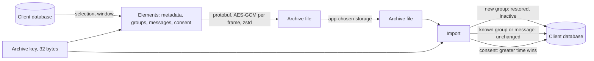
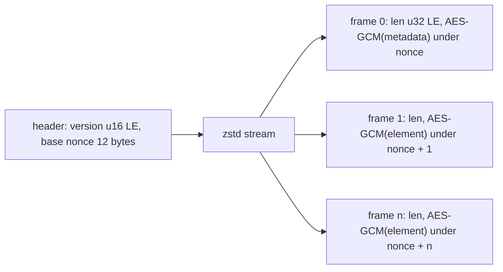

# Archive format

An archive preserves selected conversation history and consent for another installation or a later client version. Its container, record formats, and import rules form one compatibility contract.

An archive is a file the client writes from its own database under a key the app supplies, and reads back into a database that may be empty or may already hold some of the same conversations. It carries what a user owns and can read: the groups they were in, the messages of those groups, and their consent records. It carries no installation secrets or group epoch secrets. Import makes historical content readable but grants no authority to send or decrypt subsequent group traffic. A validated Welcome can activate a restored group under the pending activation rule in section 4.



## Scope

In scope: the container framing, its encryption, and its version; the element kinds and their wire form; what an export includes and excludes and the selection an app makes; the promise that an archive written under this version loads in every later client; what an app can read from an archive without importing it; and how an import merges each element with existing local state.

Out of scope: what a consent record means and how two records merge (CONS-002, CONS-010); what a message's content means (CTYPE); what group metadata means (META); how a restored group becomes active again, which requires a validated Welcome (JOIN-080); the device sync channel, which does not carry archives (SYNC); and where an app stores an archive and its key.

| Related | Relation |
| --- | --- |
| CONS-002, CONS-010 | Own the consent wire form and merge rule. |
| CTYPE | Owns the `EncodedContent` a message element carries in `decrypted_message_bytes`. |
| `JOIN-080` | Owns activation of a restored group by a validated Welcome; JOIN-042 applies only after a removal commit. |
| META | Owns the meaning of the metadata attributes and admin lists a group element carries. |
| `SEND-002` | Owns the message id that an import uses for deduplication. |
| EVENT | EVENT-001 reports a changed import once it ends; EVENT-004 excludes events for each stored element. |

## Terms

| Term | Meaning |
| --- | --- |
| Archive | One file in the container format of section 1: a header, then frames. |
| Archive key | The 32-byte key the app supplies to write or read an archive. |
| Header | The first 14 bytes of an archive: the version and the base nonce, in the clear. |
| Frame | One encrypted `BackupElement`, prefixed by its length, inside the compressed stream. |
| Element | One `BackupElement`: metadata, a group, a message, or a consent record. |
| Metadata element | The first element of every archive: what was selected, the window, and when the archive was written. |
| Selection | The `elements` list of the options an app exports with: `MESSAGES`, `CONSENT`, both, or an explicit empty list. |
| Window | The `start_ns` and `end_ns` of the options, bounding the messages exported by their send time. |
| Restored group | A conversation created by import whose history is readable but which this installation has not joined through a Welcome. |
| Export time | The single `exported_at_ns` captured at the start of export; eligibility and exported values are measured at this time. |

## 1. The container

An archive has a clear header followed by one zstd stream. The header carries a two-byte little-endian container version and a 12-byte base nonce. Each decompressed frame has a four-byte little-endian ciphertext length followed by that ciphertext, including its 16-byte authentication tag. Frame numbering starts at 0. The cipher is AEAD_AES_256_GCM under [RFC 5116 §5.2](https://www.rfc-editor.org/rfc/rfc5116.html#section-5.2); zstd uses the frame format in [RFC 8878 §3.1](https://www.rfc-editor.org/rfc/rfc8878.html#section-3.1). Associated data is empty. Compression covers the framed ciphertext, not the header or plaintext.

The container version is 0. The legacy nonce form uses the base nonce for every frame. The retry in ARCH-002 reads that form; it does not repair the loss of confidentiality or authentication caused by nonce reuse ([RFC 5116 §5.1.1](https://www.rfc-editor.org/rfc/rfc5116.html#section-5.1.1)).



| ID | Title | Requirement | Why |
| --- | --- | --- | --- |
| ARCH-001 | Container layout | When the client writes an archive, it MUST use the header, cipher, tag length, associated data, and zstd format stated above, with version 0 and a base nonce drawn from a cryptographically secure random source for that archive. It MUST encrypt each protobuf `BackupElement` as one frame, prefix the ciphertext with its four-byte little-endian length, and use the base nonce plus the frame number modulo 2^96 as a little-endian nonce. | A different frame or nonce encoding makes the archive unreadable by another client. |
| ARCH-002 | Legacy nonce | If a frame fails authentication under its counter nonce, then the client MUST retry it under that nonce decremented by 1 and, when that succeeds, MUST continue the counter from the nonce that succeeded; if that also fails, it MUST fail the import. | Archives written before the counter existed used one nonce for every frame, and they are the only copy a user may have. |
| ARCH-003 | Reject a later version | When the header's version is greater than 0, the client MUST fail the import before it reads any frame, naming the version. | A later container may frame or encrypt differently, and reading it as version 0 either fails on the first frame or applies elements it misread. |
| ARCH-004 | Elements never change meaning | The client MUST NOT reuse a field number of any message in section 2 for another meaning, MUST NOT change a field's type, and MUST NOT reuse a retired enum value in section 2. | Reinterpreting a saved field changes existing archive content. |
| ARCH-022 | Earlier archives remain importable | When given a valid version 0 archive in the counter-nonce form or the legacy form under ARCH-002, the client MUST import it and preserve its groups, message ids and bytes, historical metadata, and consent under sections 2 through 4, including in a later client version. | Retaining field numbers alone does not preserve the ability to restore an older backup. |
| ARCH-005 | Unknown elements are skipped | When an element's `element` is unset, or is a variant the client does not implement, including `event`, the client MUST skip it and continue with the next frame. | An archive from a later client would otherwise fail on the first element the older client has not learned. |
| ARCH-018 | Reject incomplete framing | When a header is incomplete, a frame length is less than 16, the stream ends within a length prefix or before its declared ciphertext length, or zstd reports an incomplete or invalid stream, the client MUST end the import with an error. It MUST report end-of-stream success only after complete metadata and a complete zstd stream with no pending length or ciphertext bytes. | Truncated input must not hang or appear to be a complete backup. |

## 2. Elements

An element is one `BackupElement`. The first is always the metadata element, so that a reader learns what the archive holds before it reads the rest and an app can show that to a user before importing. The rest are groups, messages, and consent records, in whatever order the writer produces them, with one constraint: a message's group comes before the message, so that a reader applying frames as it reads them holds the group before its first message.

The metadata element records the selection, the window, and the export time. The container version is not in it; the header carries that.

```proto
// Union type representing everything that can be serialied and saved in a backup archive.
message BackupElement {
  oneof element {
    BackupMetadataSave metadata = 1;
    xmtp.device_sync.group_backup.GroupSave group = 2;
    xmtp.device_sync.message_backup.GroupMessageSave group_message = 3;
    xmtp.device_sync.consent_backup.ConsentSave consent = 4;
    xmtp.device_sync.event_backup.EventSave event = 5 [deprecated = true];
  }
}

// Proto representation of backup metadata
// (Backup version is explicitly missing - it's stored as a header.)
message BackupMetadataSave {
  repeated BackupElementSelection elements = 2;
  int64 exported_at_ns = 3;
  optional int64 start_ns = 4;
  optional int64 end_ns = 5;
}

// Backup Options
message ArchiveOptions {
  repeated BackupElementSelection elements = 1;
  optional int64 start_ns = 2;
  optional int64 end_ns = 3;
  bool exclude_disappearing_messages = 4;
}

// Elements selected for backup
enum BackupElementSelection {
  BACKUP_ELEMENT_SELECTION_UNSPECIFIED = 0;
  BACKUP_ELEMENT_SELECTION_MESSAGES = 1;
  BACKUP_ELEMENT_SELECTION_CONSENT = 2;
  BACKUP_ELEMENT_SELECTION_EVENT = 3 [deprecated = true];
}
```

A group element carries conversation identity, timestamps, and historical metadata. Its `welcome_id`, when present, identifies the Welcome from which the source installation joined. A message element carries message identity, sender, time, delivery status, and content bytes. The identifier inside a typed `EncodedContent` controls over the separate identifier fields and the retired `content_type_save` enum; the separate fields serve records whose content is not a typed envelope. Consent uses the wire form in CONS-002 and merges under CONS-010.

```proto
// Proto representation of a stored group
message GroupSave {
  bytes id = 1;
  int64 created_at_ns = 2;
  GroupMembershipStateSave membership_state = 3;
  int64 installations_last_checked = 4;
  string added_by_inbox_id = 5;
  optional int64 welcome_id = 6;
  int64 rotated_at_ns = 7;
  ConversationTypeSave conversation_type = 8;
  optional string dm_id = 9;
  optional int64 last_message_ns = 10;
  optional int64 message_disappear_from_ns = 11;
  optional int64 message_disappear_in_ns = 12;

  // metadata fields
  ImmutableMetadataSave metadata = 13;
  MutableMetadataSave mutable_metadata = 14;

  optional string paused_for_version = 15;
}

// Group membership state
enum GroupMembershipStateSave {
  GROUP_MEMBERSHIP_STATE_SAVE_UNSPECIFIED = 0;
  GROUP_MEMBERSHIP_STATE_SAVE_ALLOWED = 1;
  GROUP_MEMBERSHIP_STATE_SAVE_REJECTED = 2;
  GROUP_MEMBERSHIP_STATE_SAVE_PENDING = 3;
  // A group is marked as this state when it is restored
  // from a backup. This is a non-functional archive state
  // that can be reactivated when the user is re-added to
  // the group.
  GROUP_MEMBERSHIP_STATE_SAVE_RESTORED = 4;
  GROUP_MEMBERSHIP_STATE_SAVE_PENDING_REMOVE = 5;
}

// Conversation type
enum ConversationTypeSave {
  CONVERSATION_TYPE_SAVE_UNSPECIFIED = 0;
  CONVERSATION_TYPE_SAVE_GROUP = 1;
  CONVERSATION_TYPE_SAVE_DM = 2;
  CONVERSATION_TYPE_SAVE_SYNC = 3;
}

// A Groups's mutable metadata
message MutableMetadataSave {
  map<string, string> attributes = 1;
  repeated string admin_list = 2;
  repeated string super_admin_list = 3;
}

// A Group's immutable metadata
message ImmutableMetadataSave {
  string creator_inbox_id = 1;
}
```

```proto
// Proto representation of a stored group message
message GroupMessageSave {
  bytes id = 1;
  bytes group_id = 2;
  bytes decrypted_message_bytes = 3;
  int64 sent_at_ns = 4;
  GroupMessageKindSave kind = 5;
  bytes sender_installation_id = 6;
  string sender_inbox_id = 7;
  DeliveryStatusSave delivery_status = 8;
  ContentTypeSave content_type_save = 9 [deprecated = true];
  int32 version_major = 10;
  int32 version_minor = 11;
  string authority_id = 12;
  optional bytes reference_id = 13;
  optional int64 sequence_id = 14;
  optional int64 originator_id = 15;
  string content_type = 16;
  optional int64 expires_at_ns = 17; // pending: absolute expiry under ARCH-019
  optional bool expiry_known = 18;   // pending: true distinguishes no expiry from unknown
}

// Group message kind
enum GroupMessageKindSave {
  GROUP_MESSAGE_KIND_SAVE_UNSPECIFIED = 0;
  GROUP_MESSAGE_KIND_SAVE_APPLICATION = 1;
  GROUP_MESSAGE_KIND_SAVE_MEMBERSHIP_CHANGE = 2;
}

// Group message delivery status
enum DeliveryStatusSave {
  DELIVERY_STATUS_SAVE_UNSPECIFIED = 0;
  DELIVERY_STATUS_SAVE_UNPUBLISHED = 1;
  DELIVERY_STATUS_SAVE_PUBLISHED = 2;
  DELIVERY_STATUS_SAVE_FAILED = 3;
}

// Group message content type
enum ContentTypeSave {
  option deprecated = true;
  CONTENT_TYPE_SAVE_UNSPECIFIED = 0;
  CONTENT_TYPE_SAVE_UNKNOWN = 1;
  CONTENT_TYPE_SAVE_TEXT = 2;
  CONTENT_TYPE_SAVE_GROUP_MEMBERSHIP_CHANGE = 3;
  CONTENT_TYPE_SAVE_GROUP_UPDATED = 4;
  CONTENT_TYPE_SAVE_REACTION = 5;
  CONTENT_TYPE_SAVE_READ_RECEIPT = 6;
  CONTENT_TYPE_SAVE_REPLY = 7;
  CONTENT_TYPE_SAVE_ATTACHMENT = 8;
  CONTENT_TYPE_SAVE_REMOTE_ATTACHMENT = 9;
  CONTENT_TYPE_SAVE_TRANSACTION_REFERENCE = 10;
}
```

| ID | Title | Requirement | Why |
| --- | --- | --- | --- |
| ARCH-006 | Metadata comes first | When the client writes an archive, it MUST write frame 0 as a `metadata` element containing the resolved selection and window under ARCH-017 and the export time. When frame 0 is not a `metadata` element, the client MUST fail import before it applies any element. | |
| ARCH-007 | Groups precede their messages | When the client writes an archive, it MUST include a `group` element before every `group_message` whose `group_id` names it, regardless of the group's creation time. If a required group cannot be exported, the client MUST fail export and MUST NOT report the archive complete. | An archive with a message but no group fails restoration into a destination that lacks the group. |
| ARCH-008 | Message content survives | When the client exports and imports a message, it MUST preserve the message id and content bytes unchanged, including unknown types, and MUST derive the four identifier fields from `EncodedContent.type` when present, regardless of conflicting separate fields or `content_type_save`. When the content is not a typed `EncodedContent`, it MUST preserve the separate identifier fields and MUST NOT invent a type. | Another installation may have the codec this one lacks. |

## 3. What an export includes

An app selects messages, consent, or both. The selection includes complete categories measured at the export time, not a sample from each. A window bounds application messages by send time; it does not bound group creation times or consent times. Groups without messages in the window still carry conversation history and metadata.

The eligibility table defines the exported set. An empty explicit selection selects nothing; omitted selection selects both categories. A failed read is not evidence that a record is ineligible. Export failure can leave a partial file, but that file is not a completed backup.

| Category | Eligible records at export time |
| --- | --- |
| MESSAGES: groups | Every group and DM, excluding sync and one-shot conversations |
| MESSAGES: messages | Every application message in those conversations that satisfies ARCH-009 |
| CONSENT | Every consent record, with no time window |

Expiry is the absolute deadline assigned under META-050, not one recalculated from group settings at restore time. Settings may have changed after a message was sent. The pending fields in `GroupMessageSave` distinguish a known deadline, known absence of a deadline, and missing historical information.

| ID | Title | Requirement | Why |
| --- | --- | --- | --- |
| ARCH-009 | The window bounds messages | When the client writes an archive, it MUST include only messages whose `sent_at_ns` is greater than `start_ns` when set and not greater than `end_ns` when set, and whose expiry is absent or greater than the export time. When `exclude_disappearing_messages` is true, it MUST exclude every message with an expiry and every restored message whose expiry is unknown under ARCH-019. | The archive must not retain content the app excluded. |
| ARCH-017 | Complete selected history | When the app omits selection, time bounds, or the disappearing-message option, the SDK MUST default them to both categories, no time bounds, and `false`, respectively; an explicit empty selection MUST remain empty. On successful export, the client MUST include every selected record and no unselected record from the eligibility table above, with its values at the export time, and MUST fail rather than silently omit a record it cannot read or encode. On successful import, it MUST preserve those records under sections 2 and 4. | A metadata-only file cannot replace selected history. |
| ARCH-019 | Preserve message expiry | When the client exports a message with known expiry information, it MUST set `expiry_known` to true and carry its absolute deadline in `expires_at_ns`, or omit that deadline when the message has no expiry. On import, it MUST retain that information and apply META-051, without recalculating a deadline from current group settings. When `expiry_known` is absent or false, it MUST preserve the message as history with expiry reported to the app as unknown, MUST retain that distinction on re-export, and MUST NOT infer that it never expires. | Current group settings cannot recover a historical deadline. |
| ARCH-010 | Secrets and internal conversations stay | The client MUST NOT write into an archive any MLS group state or epoch secret, any private key of the installation, any key package, any HMAC or preference key, or any group whose conversation type is sync or one-shot, or a message of such a group. | Whoever holds the archive and its key holds everything in it. |

## 4. Reading and importing

An app reads an archive's metadata with the key alone, before it decides to import: the container version, the selection, the window, and the export time. The metadata element is frame 0, so that read applies nothing.

An import is additive. Message ids deduplicate under ARCH-013. Existing groups retain their live state under ARCH-014. Consent merges under CONS-010. A new conversation exposes the historical metadata in ARCH-020 and remains inactive under ARCH-015. An internal placeholder does not confer membership or make imported admin lists authoritative.

JOIN-080 lets a validated Welcome activate a group created only by archive import, without comparing the Welcome's epoch to an internally generated placeholder epoch. It retains all Welcome validation, preserves imported history under JOIN-044, and installs positions from the validated join anchor. JOIN-042 continues to guard replacement of a group previously joined through MLS; missing archived secrets alone do not satisfy its removal-commit condition.

Successful-import idempotence is separate from failure recovery. A failed import retains completed elements. Retrying after a transient read or storage failure can apply the remaining elements; repeating unchanged malformed input cannot repair it.

| ID | Title | Requirement | Why |
| --- | --- | --- | --- |
| ARCH-011 | Metadata without import | An SDK MUST let an app read an archive's container version and its `metadata` element with the archive key alone, without applying any other element. | |
| ARCH-012 | Key length | When an app supplies an archive key whose length is not 32 bytes, the client and SDK MUST reject it before reading or writing any archive byte. | Truncation makes keys with the same 32-byte prefix identical and discards all suffix entropy. |
| ARCH-013 | Known messages are unchanged | When an imported `group_message` element's `id` equals the id of a stored message, the client MUST leave the stored message unchanged. | |
| ARCH-014 | Known groups are unchanged | When an imported `group` element's `id` equals the id of a stored group, the client MUST leave the stored group's state, membership state, and metadata unchanged, and MUST set its last message time to the greater of the stored and the imported `last_message_ns`. | A live group overwritten from an archive loses its MLS state and the conversation with it. |
| ARCH-015 | Restored groups are inactive | Until a validated Welcome activates a restored group under JOIN-080, the client MUST NOT use import to authorize sending to that group or decrypting its subsequent traffic. It MUST reject send and sync requests for the restored group with an inactive-group error and MUST NOT publish to its topics. | Historical access does not prove current membership to the other members. |
| ARCH-016 | Import is idempotent | After a successful import, and absent other writes or expiry under META-051, the client MUST leave groups, messages, and consent unchanged when the same archive is imported again. | Repeating a restore must not duplicate history or overwrite live state. |
| ARCH-020 | Historical metadata stays visible | When the client creates a conversation from a `group` element, it MUST expose the archived group id, conversation type, DM identity where present, creation time, creator and adder inbox ids, mutable attributes, admin and super-admin lists, disappearing settings, and last-message time to the app as historical metadata. It MUST NOT replace these values with values generated for an internal placeholder. | The app would show a different conversation history after restore. |
| ARCH-021 | Failure preserves completed work | When import fails, the client MUST return an error and retain the groups, messages, and consent already applied, without applying the failing element or later elements. After a transient read or storage failure has ended, it MUST allow a retry from the start using the same merge rules; a malformed recognized element or a still-missing required group MUST fail again, rather than be skipped or reported successful. | Idempotence alone does not recover a failed import. |

## Known limitations

An archive is authenticated by the key alone. Anyone who holds the key can write an archive with any message under any sender, and an importing client cannot tell it from one the user wrote. The key is the whole trust.

A message with a future expiry can remain in the archive after its deadline. Import applies META-051 only when the archive preserves that deadline. Legacy archives lack per-message expiry information; they remain readable with unknown expiry under ARCH-019.

A frame for a missing group fails restoration when the destination lacks that group. This does not delete source data or corrupt the destination. Earlier completed elements remain, and an unchanged retry reaches the same failure.

Legacy repeated-nonce archives remain readable, but nonce retry cannot restore the confidentiality or authentication lost by the writer. The container has no authenticated record count or final marker, so a valid zstd stream cut at a complete frame boundary cannot prove backup completeness.

The zstd stream compresses ciphertext, so it provides no useful size reduction.
