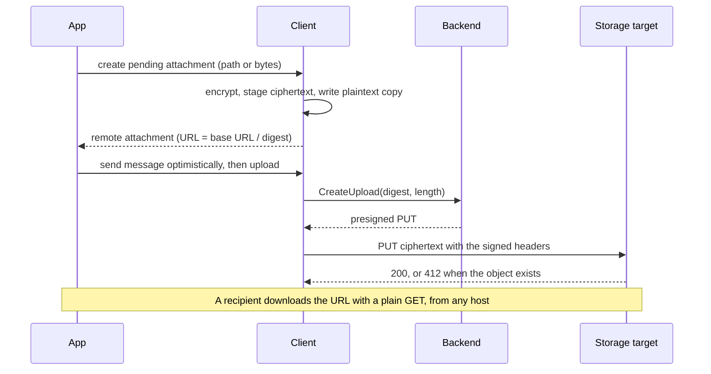

# Remote attachments

A remote attachment is a file that a message carries by reference. The sender encrypts the file under CTYPE-015, stores the ciphertext at a URL, and sends a remote attachment content type that holds the URL, the key material, and the digest of the ciphertext. A recipient fetches the URL, checks the digest, and decrypts.

This spec makes storage an optional service of the backend. A backend whose operator configures a storage target publishes a base URL, and the download URL of an object is the base URL followed by the digest of its ciphertext. A client can therefore build the complete remote attachment before any byte is uploaded, and an app can send the message optimistically while the upload runs. The backend does not carry the bytes. It signs a request that lets the client put exactly those bytes, once, into the operator's object storage. A backend with no storage target publishes no attachments configuration and answers `UNIMPLEMENTED` to the upload method, and an app reads which case applies from the client's configuration snapshot.

The client keeps a plaintext copy of every attachment it creates or downloads in an attachments directory, at a path it derives from the remote attachment alone, and keeps a record of each one. An app finds the file for a message without a lookup, and every client version finds the same file.



## Scope

In scope: what the backend publishes about attachment storage; the download URL of an object; the upload request and what its signature binds; the pending attachment and its status; the attachments directory, the attachment key, the local file name, and the records of pending and local attachments; downloads, the address and size rules they follow, and their verification; the failure causes an SDK reports.

Out of scope: the remote attachment encodings and the encryption of the payload (CTYPE section 7, CTYPE-014, CTYPE-015); the event kinds and their delivery (`EVENT`); credentials (`AUTH`); the operator's configuration file and its keys; the storage target's own lifecycle, access, and cache configuration; how an SDK names its methods.

| Related | Relation |
| --- | --- |
| [CTYPE](CTYPE-content-types.md#7-the-catalogue) | Owns the remote attachment and multiple remote attachment encodings and their parameters (CTYPE-014), and the payload encryption and digest (CTYPE-015). This spec produces and consumes them. |
| [CONF](CONF-backend-configuration.md) | Owns the public configuration message, the snapshot (CONF-020), absent values and their defaults (CONF-025), the blocked connection (CONF-075), and the app's view of the snapshot (CONF-061). `GetConfigurationResponse.attachments` carries the `AttachmentsConfiguration` this spec owns. |
| [AUTH](AUTH-backend-auth.md#1-admission) | Owns admission and client credential failures. `CreateUpload` is not a public method, so AUTH-001 applies to it. |
| [API section 7](API-backend-api.md#7-bounds-errors-and-transport) | Owns the status codes and the client's retry rule (API-284). The admission table of section 3 adds the conditions of `CreateUpload`. |
| [EVENT](EVENT-client-events.md#1-kinds-and-payloads) | Owns the `attachment.*` kinds, their payloads, and their delivery. This spec owns the transitions they report. |
| [OPS](OPS-backend-operations.md#5-telemetry) | Owns the route table and the metric catalogue, including the row for `CreateUpload`. |

## Terms

| Term | Meaning |
| --- | --- |
| Ciphertext | The bytes stored at a download URL: the CTYPE-015 encryption of an `xmtp.org/attachment:1.0` encoded content, with its tag. |
| Content digest | The lowercase hexadecimal SHA-256 of a ciphertext, as CTYPE-015 defines it. On the wire of `CreateUpload`, the same 32 bytes unencoded. |
| Storage target | The object storage the operator configures. It accepts the signed requests the backend issues and serves the objects at their download URLs. |
| Object key | The name under which the storage target stores the ciphertext of one content digest: the operator's configured key prefix, which may be empty, followed by the lowercase hexadecimal content digest. The operator maps the base URL to that prefix, so the download URL of ATCH-010 serves the object. |
| Base URL | `AttachmentsConfiguration.base_url`. |
| Download URL | The URL ATCH-010 derives from a base URL and a content digest. |
| Offered | A snapshot offers attachments when it carries an `AttachmentsConfiguration` to which ATCH-008 does not apply. |
| Pending attachment | The client's record of one ciphertext that it created and has not yet stored at the storage target, with a status of `waiting`, `uploading`, `complete`, or `failed`. |
| Upload | One run of `CreateUpload` and the signed request for a pending attachment, from the moment its status becomes `uploading` until it becomes `complete` or `failed`. |
| Staged ciphertext | The copy of a pending attachment's ciphertext that the client keeps from its creation until its upload completes. |
| Attachments directory | The directory under which the client stores plaintext files and staged ciphertext (ATCH-040, ATCH-049). |
| Attachment key | The value ATCH-041 derives from a remote attachment. It names the plaintext file's directory. |
| Plaintext path | The path ATCH-043 derives from a remote attachment. |
| Plaintext file | The file at a plaintext path. |
| Local attachment | A plaintext file the client wrote by a creation or a download that succeeded, and has not deleted. |
| Download host | The host a download URL names, or a host a redirect names. It need not be a backend's storage target. |

## 1. What the backend publishes

Attachment storage is optional. The backend offers it only when the operator configures a storage target, and it then publishes where objects are served, how large one may be, and how long the operator keeps them. A client builds every download URL from this message, so a wrong base URL sends every recipient to the wrong place, and a published ceiling the backend does not enforce lets a client build an attachment it can never upload.

A client that receives an unusable attachments message still works for messaging. It behaves as if the deployment offered no storage. Downloads do not depend on the offer: a client downloads from any host whether or not its own backend offers storage (ATCH-050).

```proto
// Published as GetConfigurationResponse.attachments (CONF section 2.1).
// Absent when the deployment offers no attachment storage.
message AttachmentsConfiguration {
  // Absolute URL with no query, fragment, or trailing "/".
  string base_url = 1;                 // pending
  // Largest ciphertext CreateUpload accepts, in bytes.
  uint64 max_upload_bytes = 2;         // pending
  // Seconds the operator keeps an object after it is stored. 0: no expiry.
  uint64 retention_seconds = 3;        // pending
}
```

| ID | Title | Requirement | Why |
| --- | --- | --- | --- |
| ATCH-001 | Offered exactly when configured | The backend MUST set `GetConfigurationResponse.attachments` if and only if a storage target is configured. | A client that sees no message never builds an attachment; one that sees a message for a target that does not exist builds attachments nobody can upload. |
| ATCH-002 | Base URL form | When the configured base URL is not an absolute URL under [RFC 3986 §4.3](https://www.rfc-editor.org/rfc/rfc3986#section-4.3) whose scheme is exactly lowercase `https`, or exactly lowercase `http` with a host that is `localhost` or a loopback address, or when its host is not a non-empty reg-name with no percent-encoded octet, an IPv4address, or an IPv6address (IPvFuture is not allowed), its port when present is greater than 65535, or it carries userinfo, a `.` or `..` path segment (including percent-encoded forms), a query, a fragment, or a trailing `/`, the backend MUST refuse to start and name the key under CONF-065. | Every recipient would derive a download URL that a content type decoder may reject under ATCH-011, that a client may not fetch under ATCH-053, that discloses a credential, or that has a doubled separator. |
| ATCH-003 | Upload ceiling | When the configured upload ceiling is 0 or greater than the largest `contentLength` the CTYPE-014 parameters table admits, the backend MUST refuse to start. The backend MUST set `max_upload_bytes` to the ceiling it enforces under ATCH-021, which is the default the CONF defaults table gives for `attachments.max_upload_bytes` when the operator sets none. | A larger ceiling admits an attachment whose length no remote attachment can carry. |
| ATCH-004 | Published retention | When the configured retention exceeds 9007199254740991 seconds, the backend MUST refuse to start and name the key under CONF-065. Otherwise, the backend MUST set `retention_seconds` to the configured retention, and to 0 when none is configured. | A larger value loses precision in clients that represent seconds as an IEEE 754 integer. |
| ATCH-005 | Retention matches the target | An operator SHOULD configure a retention equal to the expiry rule of the storage target, and none when the target keeps objects without expiry. | An app that shows an attachment as available after its object expired shows a file no recipient can fetch. |
| ATCH-006 | Storage secrets stay private | The backend MUST NOT place in any field of `GetConfigurationResponse` a storage target credential, a bucket name, or a storage endpoint URL other than the base URL. | The message is served without a credential (CONF-010). |
| ATCH-007 | The target enforces the signed request | An operator SHOULD configure only a storage target that rejects a PUT whose body's SHA-256 or length differs from the value its signature binds, and a PUT whose signature binds the create-only precondition when an object is at the key; that serves the object at each key unchanged at the download URL of its content digest; and that, where browser clients use the deployment, allows a cross-origin PUT with the signed headers and a cross-origin GET. | ATCH-023 holds only on a target that enforces what the backend signs. On any other target, a member who knows a digest can store other bytes at it. |
| ATCH-073 | Signing credential sources | The backend MUST obtain the credentials it signs with from the source that `attachments.target.S3.credentials.kind` names: `static`, `default_chain`, `environment`, `profile`, `sso`, `process`, `web_identity`, `container`, `instance`, or `assume_role`, as the AWS SDK credential providers define them. When the kind is not one of these, or a field that kind requires is missing, the backend MUST refuse to start and name the key under CONF-065. | An operator who runs the backend in a cloud account must not have to copy a long-lived secret into the configuration file. |
| ATCH-008 | An unusable offer is no offer | If the snapshot carries an `AttachmentsConfiguration` whose `base_url` fails the form of ATCH-002, whose `max_upload_bytes` is greater than the largest `contentLength` the CTYPE-014 parameters table admits, or whose `retention_seconds` exceeds the bound in ATCH-004, then the client MUST apply this spec as if the snapshot carried no `AttachmentsConfiguration`. | A client that builds URLs from a malformed base URL sends every recipient to nothing; one that fails creation over it loses messaging for an attachments fault (CONF-027). |
| ATCH-009 | Apps read the offer | An SDK MUST let an app read, from the client's snapshot and without a request, whether the snapshot offers attachments. | An app that cannot tell hides no attach button, and its users meet `not_offered` after choosing a file. |

## 2. The download URL and the remote attachment

The download URL is a function of the base URL and the content digest. The client builds it when it creates the pending attachment, and the backend signs a request for the object key of the same digest. The same ciphertext therefore has one URL at one deployment. Two creations of one file have two URLs, because each has a fresh secret, salt, and nonce under CTYPE-015.

| ID | Title | Requirement | Why |
| --- | --- | --- | --- |
| ATCH-010 | Download URL derivation | The client MUST set the download URL of a ciphertext to the snapshot's `base_url`, followed by `/`, followed by its content digest. | A client that builds another URL sends recipients to an object that does not exist. |
| ATCH-011 | The remote attachment the client builds | When the client creates a pending attachment, it MUST build a remote attachment whose `url` is the download URL under ATCH-010, whose `content_digest`, `secret`, `salt`, and `nonce` are those of CTYPE-015 for the ciphertext, whose `content_length` is the ciphertext length, and whose `scheme` is the download URL's scheme followed by `://`. It MUST set `filename` to the `AttachmentSource` `filename`, or, when that is absent and the source is a path, to the final component of the path, and MUST leave it absent otherwise. | A recipient bounds its download by `content_length` (ATCH-056) and names the local file by `filename` (ATCH-042). |
| ATCH-012 | The encrypted content | The client MUST encrypt, for a pending attachment, the `xmtp.org/attachment:1.0` encoded content whose content is the bytes of the `AttachmentSource`, whose `mimeType` is its `mime_type`, and whose `filename` is the remote attachment's `filename`, absent when that is absent. | A recipient that decodes another type fails under ATCH-051, and one that reads another MIME type opens the file with the wrong app. |

## 3. The upload request

The client asks the backend for permission to store one ciphertext, named by its digest and length. `CreateUpload` is the one method of `xmtp.backend.v1.AttachmentService`: a unary call that takes a `CreateUploadRequest` and answers a `CreateUploadResponse`. The backend answers with a request the client sends unchanged to the storage target. The signature binds the method, the object key, the length, the SHA-256 of the body, and a create-only precondition, so the target accepts exactly the declared bytes, and only when no object is at the key.

A second upload of stored bytes is not an error. The backend does not look for the object before it signs. The target answers 412 when an object is already at the key, and the client counts that as stored.

```proto
message CreateUploadRequest {
  bytes content_digest = 1;            // pending; 32 bytes: SHA-256 of the ciphertext
  uint64 content_length = 2;           // pending; ciphertext length in bytes
}

message CreateUploadResponse {
  string method = 1;                   // pending; "PUT"
  string url = 2;                      // pending; the storage target's URL for the object key
  repeated HttpHeader headers = 3;     // pending; sent exactly as given
  uint32 expires_in_seconds = 4;       // pending; from the response until the target refuses the request
}

message HttpHeader {
  string name = 1;                     // pending
  string value = 2;                    // pending
}
```

The admission table adds the conditions of `CreateUpload` to the status table of API section 7. The backend checks the rows in order, after admission under AUTH-001; the first row that matches decides the code.

| Condition | Code |
| --- | --- |
| No storage target is configured | `UNIMPLEMENTED` |
| `content_digest` is not 32 bytes, or `content_length` is 0 or greater than the enforced `max_upload_bytes` | `INVALID_ARGUMENT` |
| The backend cannot obtain a credential to sign with, or cannot sign the request | `UNAVAILABLE` |

| ID | Title | Requirement | Why |
| --- | --- | --- | --- |
| ATCH-020 | Attachment wire format | The backend MUST publish `AttachmentsConfiguration` and serve `AttachmentService.CreateUpload` with the messages of sections 1 and 3, with the field numbers and types shown, and MUST NOT reuse a field number of any of them for another meaning. | |
| ATCH-021 | Upload admission | The backend MUST fail a `CreateUpload` with the code the admission table names for the first row its request matches. | A retryable failure reported as `INVALID_ARGUMENT` is dropped for good under API-284. |
| ATCH-023 | The signature binds the bytes | When the backend answers a `CreateUpload`, it MUST sign the request so that a storage target that meets ATCH-007 accepts it only as a PUT of exactly `content_length` bytes whose SHA-256 is `content_digest`, to the object key of `content_digest`, while no object is at that key. | A request that admits other bytes lets a member who has read the message replace the file every recipient downloads; one that admits an overwrite lets anyone erase it. |
| ATCH-028 | Signed request lifetime | The backend MUST set `expires_in_seconds` to a value from 300 through 3600, equal to the lifetime of the signature it issues. | A client that trusts a longer lifetime starts a PUT the target refuses. |
| ATCH-024 | The client sends the request as signed | When the client uploads, it MUST send a request with the `method` and `url` of the `CreateUploadResponse`, every header of `headers` with its value, and the staged ciphertext as the body. A header that the client's HTTP transport sets from the body, such as `content-length`, MUST have the value `headers` gives. | The target refuses a request that differs from its signature. |
| ATCH-025 | Upload outcome | The client MUST end an upload as `complete` when the target answers the signed request with a 2xx status or 412, and as `failed` on any other answer or transport failure, including a timeout under ATCH-070. | A 412 is a stored object under ATCH-023, so reporting it as a failure makes an app retry for ever. |
| ATCH-026 | Blocked clients do not upload | When an upload starts while the client has a blocked connection under CONF-075, the client MUST end it as `failed` with the cause `connection_blocked` before it sends any request. | A client with a blocked connection is bound to another deployment or refused by this one. |
| ATCH-029 | Permanent rejections are not resent | When an upload has ended as `failed` because `CreateUpload` answered `INVALID_ARGUMENT`, `OUT_OF_RANGE`, or `UNIMPLEMENTED`, the client MUST end each later upload of that pending attachment as `failed` with the same cause without sending a request. | API-284: the same request fails the same way, and a retry loop loads the deployment for nothing. |
| ATCH-027 | No credential off the backend | The client MUST NOT send a backend credential under AUTH section 6, or any other value that identifies the inbox or the installation, on a request to a storage target or a download host. Where the client does not open its own connections, it MUST make these requests with credentials omitted and no referrer, so the browser sends no cookie, HTTP authentication, client certificate, or `Referer`. | The request goes to a host the backend does not control, and a download host is chosen by the sender of a message. A browser would otherwise attach the app origin's cookies to a download URL on that origin. |
| ATCH-071 | Secure upload URL | When the configured storage endpoint URL has neither an `https` scheme nor an `http` scheme with `localhost` or a loopback address, the backend MUST refuse to start and name the key under CONF-065. The client MUST NOT send an upload PUT to a URL that does not use `https`, except `http` to `localhost` or a loopback address, and MUST end the upload as `failed` with cause `insecure_url`. When the upload PUT receives a redirect, the client MUST NOT follow it and MUST end the upload as `failed` with cause `target_rejected`. | A network attacker could fake a 2xx response to a plaintext PUT; the client would drop the staged ciphertext under ATCH-037, and every recipient would get `not_found`. |

## 4. Pending attachments

An app creates a pending attachment from a file path or from bytes. Creation reads the source once. It writes the plaintext file and the staged ciphertext, and returns the complete remote attachment. After that the source is not read again, so a source that moves or is deleted after creation does not affect the upload. When creation fails, it leaves nothing behind, and the app can create again.

A client holds one pending attachment for each content digest, and records it in its database until the upload completes. An app can list the pending attachments, or ask for one by its remote attachment, including after the client was stopped and created again, and can upload it many times through a handle it holds: after a failure, from two places at once, or after completion. After the client is created again, it holds only pending attachments that are not `complete`. A pending attachment that is not complete within a maximum age, one day unless the app sets another, is dropped with its staged ciphertext. The upload table says what each request does. The `attachment.upload_*` events report each change of status (EVENT section 1).

```webidl
enum AttachmentSourceKind { "path", "bytes" };
dictionary AttachmentSource {
  required AttachmentSourceKind kind;   // exactly one of path and bytes is present
  DOMString path;
  sequence<octet> bytes;
  DOMString filename;                   // ATCH-011
  required DOMString mime_type;         // ATCH-012
};

enum PendingAttachmentStatus { "waiting", "uploading", "complete", "failed" };
```

The upload table: what the client does when an app asks to upload a pending attachment, by its status at that moment.

| Status | What the client does |
| --- | --- |
| `waiting` or `failed` | Sets the status to `uploading` and starts an upload, which begins with `CreateUpload` unless ATCH-026, ATCH-029, or ATCH-036 ends it first |
| `uploading` | Sends no request; the request ends with the running upload's outcome |
| `complete` | Sends no request; the request ends successfully |

| ID | Title | Requirement | Why |
| --- | --- | --- | --- |
| ATCH-030 | Creation preconditions | If the snapshot does not offer attachments, or the ciphertext of the source would be longer than the snapshot's `max_upload_bytes`, then the client MUST fail creation with the cause ATCH-060 names, before it writes any file. | An app that sends the remote attachment of an object that can never be stored sends a message no recipient can open. |
| ATCH-031 | The remote attachment comes first | When creation succeeds, the client MUST return the remote attachment of ATCH-011 without sending any request. | An app sends the message optimistically, before the upload. |
| ATCH-032 | Creation reads the source once | When creation returns successfully, the client MUST have made the plaintext file readable at its plaintext path and written the staged ciphertext so that it survives the end of the process, and MUST NOT read the source again for that pending attachment. | An app that moves or deletes its file after creation, or whose process ends after an optimistic send, would otherwise hold a message whose object can never be uploaded. |
| ATCH-033 | Failed creation leaves nothing | If creation fails, then the client MUST leave no plaintext file, no staged ciphertext, no pending attachment record, and no local attachment record for it. | An app retries creation; a leftover partial file is a file ATCH-052 would return as complete. |
| ATCH-072 | Source shape | If an `AttachmentSource` whose `kind` is `path` has no `path` or has `bytes`, or one whose `kind` is `bytes` has no `bytes` or has `path`, then the SDK MUST fail creation with the cause `malformed` before the client reads the source or writes any file. | An SDK that guesses which member to read attaches the wrong content. |
| ATCH-034 | Status transitions | The client MUST set a pending attachment's status to `waiting` at creation, MUST handle each request to upload as the upload table states, and MUST set the status only to the outcome of an upload under ATCH-025, ATCH-026, ATCH-029, ATCH-036, ATCH-047, or ATCH-071 when the upload ends. An upload that the end of the process interrupts has no outcome: a client created later holds that pending attachment as `waiting` under ATCH-066 and emits no event for it. After `complete`, the status MUST NOT change. | Two concurrent PUTs of one object race the create-only precondition for no gain; a completed upload repeated by a retry loop must not fail. |
| ATCH-035 | One pending attachment per digest | The client MUST hold at most one pending attachment for each content digest, and every handle an SDK returns for that digest MUST report that pending attachment's status and share its uploads. | Two handles would run two uploads of one staged ciphertext, and the one that completes first deletes the file under the other (ATCH-037). |
| ATCH-036 | Unusable staged ciphertext | If an upload starts and the staged ciphertext is absent, or its SHA-256 differs from the content digest, then the client MUST end the upload as `failed` with the cause `staged_unusable` before it sends any request. | A truncated file would be rejected by the target on every retry, and the app would loop on `target_rejected` for an object it can never store. |
| ATCH-037 | Staged ciphertext is released | When a pending attachment becomes `complete`, the client MUST delete its staged ciphertext and its pending attachment record. | Every sent attachment would otherwise occupy its size twice on the device. |
| ATCH-038 | Resuming by remote attachment | When an app asks for the pending attachment of a remote attachment, the SDK MUST return the pending attachment the client holds for its content digest, with its current status, and otherwise a failure with the cause `staged_unusable`. | An app that sent a message optimistically and was stopped before the upload completed can upload the same object, instead of sending a new message. |
| ATCH-066 | Pending attachments persist | The client MUST keep each pending attachment that is not `complete` across the end of the process until ATCH-068 drops it, and a client created later on the same database MUST hold it with the status `waiting`. | An app restarted after an optimistic send would hold a message whose object nothing uploads. |
| ATCH-067 | Pending attachments are listed | An SDK MUST let an app list the pending attachments the client holds that are not `complete`, each with its remote attachment and its status. | An app cannot restart uploads it cannot find. |
| ATCH-068 | Pending attachments expire | When a pending attachment that is not `uploading` was created more than the app's `max_pending_age_seconds` ago, or 86400 seconds when the app sets none, the client MUST NOT list or return it, and MUST delete its staged ciphertext and its record at the next client creation, or within 3600 seconds while the client runs. | Staged ciphertext that nobody uploads occupies its size on the device for ever. |
| ATCH-039 | Bounded memory | While the client creates a pending attachment from a path, uploads it, or downloads an attachment, the memory it has allocated for that attachment's plaintext and ciphertext MUST NOT exceed 1048576 bytes at any moment. | Attachments are as large as 4 GiB; a client that holds one in memory ends a mobile app. |

## 5. Local files

The client stores plaintext files in the attachments directory, one directory for each attachment key. The attachment key is derived from the fields of the remote attachment that determine the plaintext, so an app finds the file for any message from the remote attachment alone, and a remote attachment that reuses another message's digest with other key material does not resolve to that message's file. The file name is the sender's filename, made safe for every file system the client runs on.

The client keeps a record of each local attachment: its path relative to the attachments directory and when the client stored it. The record holds no attachment content; the remote attachment itself is already stored with its message. The record lets an app list what the client has stored without scanning the directory. A local attachment has no expiry: it stays until the app deletes it.

An app gives the client one data directory, or, as an advanced option, a database path and an attachments directory. With a data directory, everything the client stores for an inbox on one deployment is under one directory named by the deployment and the inbox id, so an app removes an account by removing that directory, and one inbox can use two deployments from one data directory. The data directory also records which deployment answered at each backend URL, so a client created offline finds its database without a request.

```webidl
enum StorageLayout { "data_dir", "explicit" };
dictionary StorageLocation {
  required StorageLayout layout;        // "data_dir": data_dir is present; "explicit": db_path and attachments_dir are present
  DOMString data_dir;
  DOMString db_path;
  DOMString attachments_dir;
};

dictionary LocalAttachment {
  required DOMString path;              // relative to the attachments directory: {attachment key}/{local file name}
  required long long created_at_ns;     // when the client made the file readable, in nanoseconds since the Unix epoch
};
```

The local file name is the result of these steps, applied in order to the remote attachment's `filename`:

| Step | Rule |
| --- | --- |
| 1 | When `filename` is absent, the name is `attachment`, and the remaining steps are skipped. |
| 2 | Keep the characters after the last `/` or `\`. |
| 3 | Remove every character in U+0000 to U+001F, U+007F to U+009F, U+202A to U+202E, U+2066 to U+2069, and `<`, `>`, `:`, `"`, `\|`, `?`, `*`. |
| 4 | Remove leading `.` and space characters, and trailing `.` and space characters. |
| 5 | When the part before the first `.` equals, ignoring ASCII case, `CON`, `PRN`, `AUX`, `NUL`, `CONIN$`, `CONOUT$`, or `COM` or `LPT` followed by one of `1` to `9`, `¹`, `²`, `³`, prefix the name with `_`. |
| 6 | While the UTF-8 encoding is longer than 255 bytes, remove the last character before the last `.`; when there is no `.`, or nothing remains before it, remove the last character. |
| 7 | Apply step 4 again. |
| 8 | When the name is empty, it is `attachment`. |

| ID | Title | Requirement | Why |
| --- | --- | --- | --- |
| ATCH-040 | Data directory layout | When a client is created with a `data_dir` `StorageLocation`, it MUST store every file it writes for the inbox under `{data_dir}/{deployment}/{inbox_id}/` and MUST use `{data_dir}/{deployment}/{inbox_id}/attachments` as the attachments directory. The `deployment` component MUST be the deployment identifier the database is bound to under CONF-030 after the file name table's steps 2 to 8, with step 6 truncating to 190 bytes, and ASCII lowercasing, followed by `-` and the 64 lowercase hexadecimal characters of the SHA-256 of the identifier's UTF-8 bytes; `inbox_id` MUST be the inbox id in lowercase hexadecimal. | Two deployments' databases for one inbox would share one path, and CONF-030 would stop the second for good; an app that removes an account's directory would leave plaintext behind. |
| ATCH-069 | Deployment directory lookup | When an SDK resolves the deployment identifier for the `deployment` component of ATCH-040 for a backend URL, it MUST use the identifier the data directory records for that URL without sending a request, and only when it records none, MUST send `GetConfiguration` to that URL under CONF-062 and use its `identifier`. When the app creates the client offline under CONF-034 and the data directory records no identifier for that URL, the SDK MUST NOT send a request and MUST fail client creation with a storage-location error; an app that must start offline before its first connection uses an explicit location. After each `GetConfiguration` answer that the client stores under CONF-026, CONF-033, or CONF-040 for a data directory, the SDK MUST record its `identifier` for that backend URL. | A client created offline would not find its database, and one that fetched on every start could not start offline at all (CONF-034). |
| ATCH-048 | Browser storage | Where the client runs in a browser, it MUST resolve every path of a `StorageLocation` and every path this section derives as an entry of the origin private file system. | |
| ATCH-049 | Staged ciphertext location | The client MUST store every staged ciphertext under the attachments directory, outside every attachment key directory. | An app that removes the attachments directory would leave ciphertext behind; one that lists a key directory would find a second file. |
| ATCH-041 | Attachment key | The client MUST set the attachment key of a remote attachment to the lowercase hexadecimal SHA-256 of the 32 bytes of its content digest, followed by its 32-byte `secret`, its 32-byte `salt`, and its 12-byte `nonce`. | A key from the URL alone lets a sender who reuses another message's URL point the recipient at that message's file. |
| ATCH-042 | Local file name | The client MUST derive the local file name of a remote attachment by the steps of the file name table above. | A name that differs between client versions loses every file stored before the upgrade; an unsanitized name writes outside the attachments directory. |
| ATCH-043 | Plaintext path and content | The client MUST store the plaintext file of a remote attachment at `{attachments directory}/{attachment key}/{local file name}`, holding exactly the `content` of the decrypted `xmtp.org/attachment:1.0` encoded content. | |
| ATCH-044 | Path without I/O | An SDK MUST let an app derive the plaintext path of a remote attachment from the client and the remote attachment alone, without a request and without reading a file. | An app that renders a list of messages cannot make a call per row to find its files. |
| ATCH-045 | An existing file is not an error | When creation or a download finds a file at the plaintext path, the client MUST NOT fail because of it. | |
| ATCH-046 | Files are the app's to delete | The client MUST NOT delete a plaintext file or an attachment key directory, except when an app asks it to under ATCH-047, and except a partial file of a creation or download that did not succeed. | An app that shows a file the client removed shows a broken attachment. |
| ATCH-047 | Local deletion | When an app asks the client to delete the local files of a remote attachment, the client MUST end each running upload of its content digest and each running download to its plaintext path as `failed` with the cause `deleted`, and then delete its attachment key directory, its staged ciphertext, and its local attachment record, if any exists. | A running download that completes after the deletion puts the file back. |
| ATCH-062 | Local attachments are listed | An SDK MUST let an app list the local attachments of a client as `LocalAttachment` values, with one entry for each local attachment and no other. | An app that cannot list what the client stored cannot apply its own storage limits without scanning the directory. |
| ATCH-063 | Records follow the files | The client MUST add the local attachment record in the same step that makes a plaintext file readable under ATCH-032 or ATCH-051, and MUST remove it in the same step that deletes the file under ATCH-047. | A record without a file lists an attachment the app cannot open; a file without a record is never cleaned up. |

## 6. Downloads

A download takes a remote attachment from any sender and any host. The client downloads only when an app asks; it never downloads an attachment on its own. The URL is chosen by the sender, so it is untrusted. The client fetches only secure URLs, and by default only public addresses. Where it follows redirects itself, it checks each redirect as it checks the first URL. It stops at a size bound measured after content decoding. The plaintext file appears at its path only after the digest, the authentication tag, and the content type all pass, so a file at a plaintext path is always a complete, verified attachment.

A download that returns `not_found` can succeed later. Under optimistic sending, a recipient can ask for an object before its sender's upload completes.

A private address is an address in an entry of the [IANA IPv4 Special-Purpose Address Registry](https://www.iana.org/assignments/iana-ipv4-special-registry/) or the [IANA IPv6 Special-Purpose Address Registry](https://www.iana.org/assignments/iana-ipv6-special-registry/) ([RFC 6890 §2.2](https://www.rfc-editor.org/rfc/rfc6890#section-2.2)) whose "Globally Reachable" value is `False` or `N/A`, a multicast address, or an IPv4-mapped or NAT64 IPv6 address whose embedded IPv4 address is private.

```webidl
dictionary AttachmentOptions {
  unsigned long long max_download_bytes;   // absent: ATCH-056
  unsigned long long max_pending_age_seconds;   // absent: ATCH-068
  boolean allow_private_network;           // absent means false
};
```

| ID | Title | Requirement | Why |
| --- | --- | --- | --- |
| ATCH-065 | Downloads are explicit | The client MUST NOT send a download request for a remote attachment except in a download an app asked for. | A client that fetches on receipt tells every download host, which the sender chose, the recipient's network address and when the recipient was online. |
| ATCH-050 | Any host | The client MUST download a remote attachment whose URL passes ATCH-053 whatever its host, whether or not the snapshot offers attachments, and MUST NOT require the URL to begin with the snapshot's `base_url`. | Attachments sent by an app that stores its own files, or by another deployment, would not open. |
| ATCH-051 | Verified before readable | The client MUST write a download's plaintext outside the plaintext path and MUST put a file at the path only by an atomic move, after the ciphertext passes the digest check and the decryption of CTYPE-015 and decodes as `xmtp.org/attachment:1.0` encoded content. A download that fails, or that the end of the process interrupts, MUST leave no file at the path. | A partial or forged file at the path is shown by every later reader as the attachment. |
| ATCH-052 | Existing files are not fetched | When a download is asked for and a file is at the plaintext path, the client MUST return that path without sending a request. | |
| ATCH-053 | Secure URLs only | The client MUST NOT send a download request to a URL whose scheme is not `https`, or, where it follows redirects itself, follow a redirect to one, except `http` to `localhost` or a loopback address while `allow_private_network` is true. | A plain-HTTP fetch shows every observer which attachment a user opens, and lets an observer replace the response. |
| ATCH-054 | Private addresses | Where the client opens its own connections, it MUST NOT connect a download request, or a redirected request, to a private address while `allow_private_network` is false, and MUST check the address it connects to, not the host name. Where the client opens its own connections, it MUST NOT send a download through a proxy. Where the client does not open its own connections, `allow_private_network` is false, and the parsed download URL host is `localhost`, `localhost.`, a name ending in `.localhost` or `.localhost.`, or an IP literal that is a private address as defined above, it MUST end the download as `failed` with cause `blocked_address` without sending a request. | A message whose URL names the cloud metadata address or an internal host makes a server-side client fetch it. A proxy could resolve the host to an address the client did not check. A browser could fetch a private host that the sender put in the URL. |
| ATCH-055 | Redirects are checked | Where the client follows redirects itself, it MUST follow at most 10 redirects for one download, apply ATCH-053 and ATCH-054 to each, and fail the download at the first redirect that fails either. Where the client does not follow redirects itself, it MUST NOT follow any redirect of a download and MUST end the download as `failed` with cause `too_many_redirects` on the redirect. In a browser, the client MUST set manual redirect handling on the fetch GET and MUST treat an opaque redirect as a redirect. | A redirect from a public host to a blocked one would bypass both rules. |
| ATCH-056 | Download size bound | The client MUST fail a download, and stop reading, once the response body after content decoding is longer than the least of `content_length` when the remote attachment carries it, the app's `max_download_bytes`, and the largest `contentLength` the CTYPE-014 parameters table admits. When the app sets no `max_download_bytes`, the client MUST use the snapshot's `max_upload_bytes` under CONF-025. | A hostile host that streams without end, or sends a small compressed body that inflates, fills the device's storage. |
| ATCH-057 | Success status | The client MUST read the ciphertext only from a final response with status 200, and MUST fail a download with `not_found` on a final 404 or 410 and with `http_status` on any other final status. | An app tells an object that is not yet stored, or no longer stored, from a failure of the host. |
| ATCH-058 | One fetch per path | While a download to a plaintext path is running in a client, the client MUST end a second download to the same plaintext path with the running download's outcome, and MUST NOT send a request for it. | Two downloads to one path race to write it and fetch the object twice. |
| ATCH-059 | Malformed key material | If a remote attachment's `content_digest` is not 64 lowercase hexadecimal characters, its `secret` or `salt` is not 32 bytes, or its `nonce` is not 12 bytes, then the client MUST fail a download of it and a derivation of its plaintext path with the cause `malformed`, without sending a request. | The attachment key and the path are undefined for such a remote attachment. |

## 7. Failures

An SDK reports every attachment failure with one cause from a fixed set, so an app can tell a failure it can retry from one it cannot. The same cause appears in the `attachment.upload_failed` and `attachment.download_failed` events.

```webidl
enum AttachmentFailureCause {
  "not_offered",          // ATCH-030: the snapshot does not offer attachments
  "too_large",            // ATCH-030, ATCH-056
  "source_unreadable",    // creation could not read the path
  "local_storage",        // the client could not write or read the attachments directory or its records
  "staged_unusable",      // ATCH-036, ATCH-038
  "connection_blocked",   // ATCH-026
  "credential",           // CreateUpload failed with a client credential failure of AUTH section 6 (ATCH-061)
  "backend_rejected",     // CreateUpload failed with INVALID_ARGUMENT, OUT_OF_RANGE, or UNIMPLEMENTED
  "backend_unavailable",  // CreateUpload failed with any other code, or did not reach the backend
  "target_rejected",      // the upload PUT received a redirect, or the storage target answered a status other than 2xx or 412
  "network",              // ATCH-070, or a request to a storage target or download host failed in transport
  "insecure_url",         // ATCH-053 for a download, or ATCH-071 for an upload PUT
  "blocked_address",      // ATCH-054
  "too_many_redirects",   // ATCH-055: over 10 followed redirects or any redirect under manual handling
  "not_found",            // ATCH-057
  "http_status",          // ATCH-057
  "malformed",            // ATCH-059, ATCH-072
  "digest_mismatch",      // ATCH-051: the ciphertext does not match content_digest
  "decryption_failed",    // ATCH-051: the tag does not verify
  "not_an_attachment",    // ATCH-051: the plaintext is not xmtp.org/attachment:1.0 encoded content
  "deleted"               // ATCH-047
};
```

The cause tells an app when a later attempt can succeed:

| Cause | A later attempt can succeed |
| --- | --- |
| `not_offered` | After the deployment offers attachments |
| `too_large`, `staged_unusable`, `backend_rejected`, `insecure_url`, `too_many_redirects`, `malformed`, `digest_mismatch`, `decryption_failed`, `not_an_attachment` | No. The same input fails again |
| `source_unreadable` | After the app makes the source readable |
| `local_storage` | Yes, when the device has space and the directory is writable |
| `connection_blocked` | After the client is updated or bound to its deployment again (CONF-075) |
| `credential` | After the app renews the credential of the kind ATCH-061 reports |
| `backend_unavailable`, `network`, `http_status` | Yes, after a backoff |
| `target_rejected` | Yes, for a new upload request, which gets a new signed URL; a target that rejects every signed request fails again |
| `blocked_address` | Only with `allow_private_network` set |
| `not_found` | Yes, while the sender has not completed the upload; no, after the target has deleted the object (ATCH-004) |
| `deleted` | Yes. The app can download again |

| ID | Title | Requirement | Why |
| --- | --- | --- | --- |
| ATCH-060 | Typed failure causes | An SDK MUST report a failed creation, upload, download, or path derivation as an error that carries exactly one `AttachmentFailureCause`, the one whose comment in the block above names the failure. | An app that cannot tell `not_found` from `network` retries an expired object for ever, or gives up on a transient one. |
| ATCH-061 | Credential failures keep their kind | When an upload fails with a client credential failure of AUTH section 6, an SDK MUST report the cause `credential` together with the failure kind AUTH-026 names and whether it is retryable. | An app that sees only an upload failure cannot tell a lockout that clears from a credential it must replace. |
| ATCH-070 | Transfer deadlines | Where the client opens its own connections, it MUST use a 30 s connect timeout for an upload PUT and a download GET, and MUST end the upload or download as `failed` with cause `network` when that timeout expires. Where the client opens its own connections and no bytes are sent or received for 60 s during an upload PUT, it MUST end the upload as `failed` with cause `network`; where the client can observe response reads and no response bytes are read for 60 s during a download GET, it MUST end the download as `failed` with cause `network`. The client MUST NOT apply a total-time cap to either request. | A stalled target or host would keep an upload `uploading` or a download joined under ATCH-058 forever. |

## Known limitations

The upload contract is only as strong as the storage target. ATCH-023 depends on a target that enforces what the backend signs (ATCH-007). A target that enforces neither a signed SHA-256 nor a create-only precondition, such as Google Cloud Storage through its XML API, is not a supported target.

The client sends the upload PUT to whatever `https` URL, or loopback `http` URL, the backend it is bound to (CONF-030) signs, including a private address, so an on-premises storage target works. A backend that the operator does not control could direct a client's PUT at an internal host; the body is ciphertext and carries no credential (ATCH-027), and ATCH-071 stops redirects. The client already trusts that backend with its messages.

When auth is disabled (AUTH-003), anyone who can reach the backend can store objects up to `max_upload_bytes`. When auth is enabled, any holder of a credential can. The backend cannot tell a ciphertext from any other bytes, so a deployment's storage can be used to host arbitrary files. There is no per-caller quota.

An object is public to anyone who has its URL. Its confidentiality rests on the encryption of CTYPE-015 alone. The storage target and every download host learn the size of the object, the time of each fetch, and the network address of the downloader.

The backend does not apply retention. The operator's expiry rule on the storage target does, and ATCH-005 cannot be checked by a client. The client does not read retention: it attempts every download an app asks for, and an expired object fails with `not_found`.

A remote attachment forwarded unchanged in another message shares its plaintext path, so deleting the local files for one message deletes them for both, and the next download fetches them again.

A failed upload or download starts again from the first byte. There is no multipart or ranged transfer, and the largest single upload is bounded by the target's own limit on one PUT as well as by `max_upload_bytes`.

A host that sends a byte at least every 60 s can keep a download, and every download joined to it under ATCH-058, running up to the ATCH-056 size bound. The app can end the download under ATCH-047.

In a browser, ATCH-054 rejects `localhost` names and private IP literals in a download URL while `allow_private_network` is false. The client cannot check the address to which another hostname resolves before the browser connects; the browser's private-network rules apply to those hostnames. ATCH-055 ends the download on every redirect, including an opaque redirect. A browser client cannot set a connect timeout or observe upload progress of a fetch PUT, so its PUT has no deadline beyond the browser's own. The client can observe response reads of a download GET and applies ATCH-070 to them. A download host that sends no CORS headers cannot serve a browser client.

A file that an app removes from the attachments directory without asking the client leaves its record behind until the app asks the client to delete the local files of that remote attachment.
