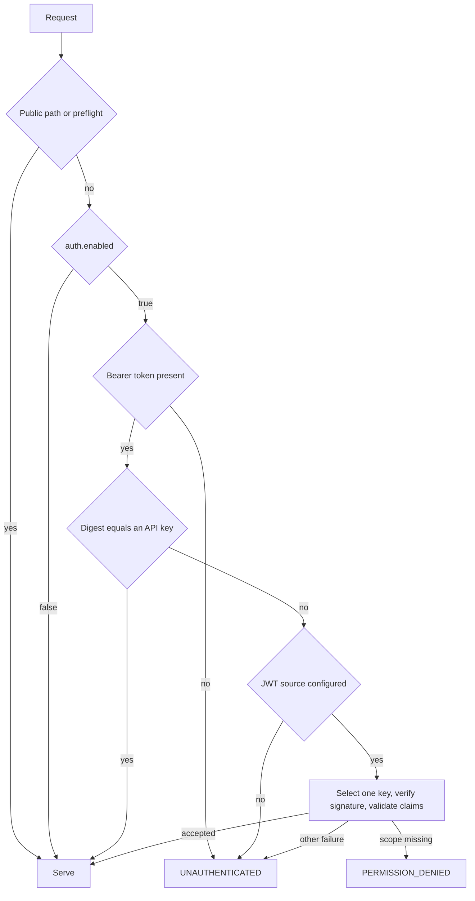

# Backend auth

Authentication is optional per deployment. While it is enabled, every request outside a small public set carries a bearer credential: a named API key the operator issued, or a JWT signed by a key the deployment trusts. The client obtains credentials from a source the app supplies, attaches one to every request, refreshes it when it expires or is rejected, and stops after repeated failures. This spec owns both sides of that exchange, the checks an enabled configuration must pass before the backend serves, and the failure vocabulary between them. Getting the terminal cases wrong strands a client in a retry loop it can never leave, or lets a broken credential source hit the backend at the client's full request rate.



## Scope

In scope: which paths need a credential and which never do; the bearer form; how an API key is matched; how a JWT is verified, including the accepted algorithms, key selection, the claim types, and the time, audience, issuer, and scope claims; how the key set is loaded, refreshed, bounded, and retired; the checks an enabled `[auth]` table must pass at startup; the rejection vocabulary; how the client obtains, attaches, refreshes, and replaces a credential; when the client stops trying; and what the backend records about a credential.

Out of scope: the presence rule for `auth.enabled` and what is published about auth (`CONF`); the general status code table ([API section 7](API-backend-api.md#7-bounds-errors-and-transport)); what an operator's identity provider does; and the metric families themselves (`OPS`).

| Related | Relation |
| --- | --- |
| `CONF` | Owns whether an `[auth]` table must state `enabled` (CONF-005), that a disabled table is not validated (CONF-066), the published auth summary (CONF-068), the unauthenticated configuration read (CONF-010, CONF-029), and the deployment identifier (CONF-002). This spec owns every other check of an enabled table. |
| [API section 7](API-backend-api.md#7-bounds-errors-and-transport) | Owns general gRPC status codes. This spec owns the auth-specific `UNAUTHENTICATED` and `PERMISSION_DENIED` conditions under AUTH-014. |
| `OPS` | Owns the metric catalogue, including `xmtp_auth_rejections_total` (OPS-017), and the drain that AUTH-019 triggers (OPS-007, OPS-008). This spec owns the reason vocabulary. |

## Terms

| Term | Meaning |
| --- | --- |
| Credential | The value of the `authorization` request header: the scheme `Bearer`, one space, and a token. |
| Token | The part of a credential after the scheme: an API key value or a JWT. |
| API key | A name and a secret value the operator configures under `auth.api_keys`. |
| JWT | A JSON Web Token in compact serialization, signed as a JWS ([RFC 7519 §3](https://www.rfc-editor.org/rfc/rfc7519.html#section-3)). |
| Signing key source | Where the backend gets the public keys it verifies JWTs with: keys inline under `auth.keys`, or a JWKS document at `auth.jwks_url`. |
| Key set | The signing keys the backend holds at one moment. |
| Public path | A request path that begins with `/grpc.health.v1.` or `/xmtp.backend.v1.ConfigurationService/`. |
| Principal | What a request is admitted as: an API key's name, or a JWT's verified claims. |
| Reason | One of the fixed labels in the rejection table of section 4. |
| Leeway | The configured `auth.leeway_seconds`, default 60: the clock skew the time claims tolerate. |
| Now | The verifier's current time, in seconds since the Unix epoch. |
| Credential source | The callback or fixed credential an app gives a client, as in `CONF`. A callback returns a held credential on demand; a fixed credential is set by the app and used until the app sets another. |
| Held credential | The record a client keeps between requests: the header to send, its value, and when it expires. Defined in section 6. |
| Attempt | One request the client sends with a held credential, or one invocation of the callback. |
| Lockout | The state a client enters after 13 consecutive failed attempts, held for a 60-second cool-down. |

## 1. Admission

Admission is decided by the request path before the request body is read. While auth is enabled, a request to any path outside the public set needs a credential the backend accepts, including a path no service implements. While auth is disabled, the `authorization` header is not read at all, so a deployment on a trusted network serves any caller. Health is public so that an orchestrator can probe the process, and the configuration service is public so that a client can learn what the deployment requires before it holds a credential (CONF-010). A CORS preflight is answered before admission, because a browser sends it without credentials.

A stream is admitted once, when it opens. Nothing that happens to the credential later ends it.

| ID | Title | Requirement | Why |
| --- | --- | --- | --- |
| AUTH-001 | Enabled admission by path | While the configured `auth.enabled` is `true`, when a request to a path that is not a public path carries no credential, or a credential the backend does not accept under section 2 or section 3, the backend MUST reject it with the status and reason the rejection table in section 4 gives, before it validates the request body, whatever the HTTP method, content type, or path. | An unknown path admitted without a credential is the one path an attacker probes, and a validation error returned first tells the caller about the payload before the caller has proven anything. |
| AUTH-002 | Health and preflight are public | Whatever `auth.enabled`, the backend MUST serve a request to a public path that begins with `/grpc.health.v1.` and MUST answer a CORS preflight request without reading the `authorization` header. | An orchestrator holds no credential, and a browser sends the preflight before it can attach one. |
| AUTH-003 | Disabled admission | While `auth.enabled` is `false` or the configuration has no `[auth]` table, the backend MUST serve every request without reading the `authorization` header. | |
| AUTH-004 | Streams are checked at open | When the backend has admitted a `Subscribe` or `SubscribeStatic` request, it MUST NOT end that stream because the credential's `exp` has passed, because the key set no longer holds the key that signed it, or because a later request from the same caller was rejected. | A client holds a stream open for hours on a token that lives minutes; ending it at every expiry forces a reconnect storm at the token lifetime. |
| AUTH-005 | Bearer form | The backend MUST accept a credential only as an `authorization` header whose value is the scheme `Bearer`, compared without regard to case, one space, and a token that is not empty after trimming whitespace and is at most 8192 bytes; any other value MUST be rejected with reason `malformed`. | |

## 2. API keys

An API key is a shared secret an operator hands to a caller it runs itself, such as a bot or a bridge. It is checked before any JWT work, so its value does not have to look like a JWT, and it carries no scopes: the required scopes apply to JWTs only. The match compares SHA-256 digests in constant time, so response timing does not depend on how much of a key a caller guessed.

An enabled table must name at least one mechanism, and a key value must be a usable secret: long enough that it cannot be guessed, made of bytes a header can carry, and distinct from every other key so that the recorded principal is unambiguous. The name syntax, the map layout, and the number of keys a table may hold are documentation of the backend.

| ID | Title | Requirement | Why |
| --- | --- | --- | --- |
| AUTH-006 | API key admits by digest | When the SHA-256 digest of the token equals the SHA-256 digest of a configured API key value, the backend MUST admit the request with that key's name as its principal and MUST NOT apply the scope, audience, or issuer checks of section 3. The comparison MUST take the same time over every configured key whichever key matches, and whether or not one does. | A comparison that stops at the first differing byte lets a caller recover a key from response timing, one byte at a time. |
| AUTH-007 | A miss falls through | When the token matches no API key, the backend MUST verify it as a JWT under section 3 where a signing key source is configured, and MUST reject it with reason `untrusted` where none is. | |
| AUTH-029 | Enabled auth names a mechanism | When `auth.enabled` is `true` and the table configures none of `api_keys`, `jwks_url`, or `keys`, or configures both `jwks_url` and `keys`, the backend MUST refuse to start and MUST name the offending key. | A deployment that enables auth with nothing to check against rejects every caller while its operator believes it is protected. |
| AUTH-030 | API key values are usable secrets | When `auth.enabled` is `true` and an API key value is shorter than 32 bytes, longer than 8192 bytes, contains a byte outside `0x21` to `0x7E`, or equals another key's value, the backend MUST refuse to start, naming the key's name and not its value. | A short key is guessable by every caller; a value with whitespace or control bytes cannot be sent as a header; two names with one value make the recorded principal a coin toss. |

## 3. JWT verification

A JWT is accepted when a key in the key set verifies its signature and its claims pass the configured checks. The backend decodes the token's syntax first, so a token that is not a JWS with a JSON object of claims is `malformed` whatever else is wrong with it. It then selects exactly one key before it verifies anything: by `kid` when the token names one, otherwise by algorithm. It never tries a second key and never fetches keys while a request waits. No claim value affects admission until the signature has verified, because a claim trusted first is a claim the attacker wrote. The verified claims are then checked in a fixed order, so a caller fixing a token gets one stable answer.

The JOSE header, the signature, and the registered claims are defined by [RFC 7515 §4](https://www.rfc-editor.org/rfc/rfc7515.html#section-4), [RFC 7515 §5.2](https://www.rfc-editor.org/rfc/rfc7515.html#section-5.2), and [RFC 7519 §4](https://www.rfc-editor.org/rfc/rfc7519.html#section-4). This spec states only what the backend adds: which algorithms it accepts, how it picks a key, which claim types it accepts, which claims it requires, and what the `scope` claim must hold.

| ID | Title | Requirement | Why |
| --- | --- | --- | --- |
| AUTH-008 | Supported algorithms | The backend MUST accept a JWT only when its header `alg` is `RS256`, `RS384`, `RS512`, `ES256`, `ES384` ([RFC 7518 §3.1](https://www.rfc-editor.org/rfc/rfc7518.html#section-3.1)), or `EdDSA` ([RFC 8037 §3.1](https://www.rfc-editor.org/rfc/rfc8037.html#section-3.1)), and MUST reject any other value, including `none` and every HMAC algorithm, with reason `unsupported_alg`. | An HMAC algorithm verified against a public key makes that public key the signing secret. |
| AUTH-009 | One key, selected first | Before it verifies a signature, the backend MUST select exactly one key from the key set: when the header carries `kid`, the one key with that `kid`; otherwise the one key whose algorithm equals `alg`. When no key or more than one key matches, or the selected key's algorithm differs from `alg`, the backend MUST reject the token with reason `untrusted`, and MUST NOT try another key or fetch keys during the request. | Trying every key makes each request a signature oracle over the whole set, and a fetch during a request lets a slow key server stall admission. |
| AUTH-010 | Signature before trusting claims | The backend MUST verify the JWS signature under the selected key before any claim value affects admission, the principal, or the reason it reports, other than `malformed` for a claims segment that is not a JSON object, and MUST reject a token whose signature does not verify with reason `untrusted`. | |
| AUTH-031 | Claim types | The backend MUST accept `exp` and `nbf` only as a NumericDate ([RFC 7519 §2](https://www.rfc-editor.org/rfc/rfc7519.html#section-2)) that is a finite JSON number not less than 0, rounding a fractional part to the nearest second; `aud` and `scope` only as a string or an array of strings; and `iss` and `sub` only as a string. A claim that is present with any other type MUST be rejected with reason `malformed`. | A claim of the wrong type reported as expired or missing sends the caller to fix its clock instead of its issuer. |
| AUTH-011 | Time claims | The backend MUST reject a token with no `exp` claim, or whose `exp` is less than now minus the leeway, with reason `expired`, and a token whose `nbf` is greater than now plus the leeway with reason `not_yet_valid`. | |
| AUTH-012 | Audience and issuer | Where `auth.audiences` is configured, the backend MUST reject a token whose `aud` claim contains none of the configured values with reason `audience`. Where `auth.issuers` is configured, it MUST reject a token whose `iss` claim equals none of the configured values with reason `issuer`. A token without the claim fails the check. | |
| AUTH-013 | Required scopes | When any value in `auth.required_scopes` is absent from the token's `scope` claim, read as a space-separated string or an array of strings, the backend MUST reject the request with reason `scope`, on every path that is not a public path. | |
| AUTH-032 | Leeway ceiling | When the configured `auth.leeway_seconds` is greater than 300 and `auth.enabled` is `true`, the backend MUST refuse to start and MUST name the key. | Leeway extends every token's life; an unbounded value makes `exp` meaningless. |

## 4. Rejections

Every rejection carries a fixed reason. The reason selects the status and the message the caller sees and the label the backend counts under. The table is in processing order: the header, the token's syntax, the key, the signature, then the verified claims. When more than one reason applies, the earliest stage wins.

| Reason | Status | Message | Given when |
| --- | --- | --- | --- |
| `missing` | `UNAUTHENTICATED` | `missing bearer token` | The request has no `authorization` header. |
| `malformed` | `UNAUTHENTICATED` | `authorization header is not a bearer token` | The header fails the scheme or empty-token part of AUTH-005. |
| `malformed` | `UNAUTHENTICATED` | `token is not a supported JWT` | The token is longer than 8192 bytes, or its JOSE header does not decode as a JSON object with a string `alg`. |
| `unsupported_alg` | `UNAUTHENTICATED` | `token is not a supported JWT` | AUTH-008. |
| `malformed` | `UNAUTHENTICATED` | `token is not a supported JWT` | The header's `kid` is longer than 256 bytes, or the claims segment does not decode as a JSON object. |
| `untrusted` | `UNAUTHENTICATED` | `token signature is not trusted` | AUTH-007, AUTH-009, or AUTH-010. |
| `expired` | `UNAUTHENTICATED` | `token has expired` | AUTH-011, `exp`. |
| `not_yet_valid` | `UNAUTHENTICATED` | `token is not yet valid` | AUTH-011, `nbf`. |
| `audience` | `UNAUTHENTICATED` | `token audience is not allowed` | AUTH-012, `aud`. |
| `issuer` | `UNAUTHENTICATED` | `token issuer is not allowed` | AUTH-012, `iss`. |
| `malformed` | `UNAUTHENTICATED` | `token is not a supported JWT` | AUTH-031, for a verified claim of the wrong type. |
| `scope` | `PERMISSION_DENIED` | `token is missing a required scope` | AUTH-013. |

| ID | Title | Requirement | Why |
| --- | --- | --- | --- |
| AUTH-014 | Rejection vocabulary | When the backend rejects a request under this spec, it MUST answer with the status and message the rejection table above gives for the reason, MUST count the reason as the `reason` label of `xmtp_auth_rejections_total` (OPS-017), and when more than one reason applies MUST use the one from the earliest stage in table order. | A status message that varies with the token's contents is a channel for the token's contents. |

## 5. The key set

The backend loads its key set before it binds its listener, from inline keys or from a JWKS document ([RFC 7517 §5](https://www.rfc-editor.org/rfc/rfc7517.html#section-5)); the configuration names one source (AUTH-029). A JWKS is fetched again on a period, and a successful fetch replaces the whole set, so a key the identity provider withdraws stops verifying at the next refresh and one it adds starts. A failed fetch keeps the last successful set, so a transient outage of the key server does not log every caller out. That tolerance has a bound: after `auth.jwks_max_stale_seconds` without a successful fetch the backend stops serving rather than keep verifying against keys that may have been revoked, and the refresh timing must fit inside that window or a healthy deployment drains itself. Every fetch is bounded in time, size, and keys kept, so a slow or hostile key server cannot stall startup or exhaust the backend. The keys published in the auth summary are the ones loaded at startup (CONF-068); a refresh does not republish them (CONF-012).

| ID | Title | Requirement | Why |
| --- | --- | --- | --- |
| AUTH-015 | Key source transport | The backend MUST fetch a JWKS only over HTTPS, or over HTTP when the URL's host is `localhost` or a loopback address, and MUST NOT follow a redirect. | A key set fetched over plain HTTP or through a redirect is a key set anyone on the path can replace. |
| AUTH-016 | Usable JWKS entries | The backend MUST load from a JWKS only an entry whose `alg` is a value AUTH-008 accepts, whose `kty` and `crv` are the pair that algorithm needs (`RSA`; `EC` with `P-256` for `ES256` or `P-384` for `ES384`; `OKP` with `Ed25519`), whose `use` is absent or `sig`, and whose `kid`, when present, is a string of at most 256 bytes, and MUST skip every other entry. | An entry with no `alg` gives no way to fix the verification algorithm without letting the token choose it. |
| AUTH-033 | Bounded key fetch | The backend MUST abandon a JWKS fetch that has not completed after 10 seconds, MUST NOT read more than 262144 bytes of its body, MUST keep at most the first 64 usable entries of one document, and MUST treat a fetch that exceeds the time or size bound as failed. | An unbounded fetch lets the key server hold the backend's startup or its memory. |
| AUTH-017 | Startup needs a key set | When `auth.enabled` is `true` and a JWKS URL is configured, and no usable entry has been loaded after 3 fetch attempts 1 second apart, the backend MUST refuse to start. When `auth.enabled` is `true` and an inline key is not a SubjectPublicKeyInfo of the key type its `alg` needs, or two inline keys share a `kid`, the backend MUST refuse to start. | A backend that serves with an empty key set rejects every JWT while reporting itself healthy. |
| AUTH-018 | Refresh replaces the set | The backend MUST fetch the JWKS again every `auth.jwks_refresh_seconds` (default 300) plus a random delay of at most one tenth of that period, and when a fetch yields at least one usable entry MUST replace the whole key set with the fetched entries. When a fetch fails or yields no usable entry, the backend MUST keep the last successful set. | |
| AUTH-034 | Refresh fits the stale window | When `auth.enabled` is `true` and the configured `auth.jwks_refresh_seconds` is less than 1, or `auth.jwks_max_stale_seconds` is less than `auth.jwks_refresh_seconds` plus one tenth of it, rounded up, plus 10, the backend MUST refuse to start and MUST name the key. | One refresh cycle, with its jitter and a fetch that runs to its timeout, must fit inside the stale window, or a deployment whose key server is healthy drains under AUTH-019. |
| AUTH-019 | Stale key set stops serving | When `auth.jwks_max_stale_seconds` (default 3600) have passed since the last successful JWKS fetch, the backend MUST report `NOT_SERVING`, drain under OPS-007 and OPS-008, and exit with a failure status, and a fetch that completes after that deadline MUST NOT keep it serving. | A backend verifying against keys an hour old accepts tokens under keys the provider has revoked. |

## 6. Client credentials

The app gives the client a credential source: a callback that returns a held credential with an expiry, a fixed credential the app sets through a handle, or both. The client attaches the held credential to every request except the configuration read (CONF-029), asks the callback for a new one when the held one has expired or was rejected, replays a rejected request once with the new credential, and gives up after 13 consecutive failed attempts. Only an `UNAUTHENTICATED` answer counts as a rejection of the credential; a `PERMISSION_DENIED` answer is returned to the caller, because a new token from the same source has the same scopes.

The rules below apply in this order. The configuration read carries nothing and invokes nothing (CONF-029). A credential the app sets replaces whatever the client held and clears any lockout (AUTH-024). Lockout fails an attempt before any refresh or send (AUTH-023). Otherwise the client refreshes an expired or rejected credential before it sends (AUTH-021), and replays a rejected request once (AUTH-022). A replay is an attempt of its own: a request whose first send and replay are both rejected adds two failures.

```webidl
dictionary HeldCredential {
  DOMString header_name;                 // absent means "authorization"
  required DOMString value;              // the full header value, including the scheme
  required long long expires_at_seconds; // seconds since the Unix epoch
};
```

The failures a client reports are the four kinds below. Whether a kind is retryable depends on whether a callback exists: with a callback, a new credential may cure a rejection; without one, only the app can.

| Kind | Meaning | Retryable |
| --- | --- | --- |
| Credential rejected | The backend answered `UNAUTHENTICATED` to the credential the client sent. | Only when a callback exists. |
| Callback failed | The callback returned an error instead of a credential. | Yes. |
| Exhausted | The client is in lockout, or this attempt put it there. | Not now; it clears when the cool-down ends. |
| Missing credential | The client holds no credential and has no callback. | No. |

| ID | Title | Requirement | Why |
| --- | --- | --- | --- |
| AUTH-020 | Credential on every request | Where the app supplied a credential source, the client MUST send the held credential's `value` in the header its `header_name` names, replacing any header of that name already on the request, on every request except `GetConfiguration`. | |
| AUTH-021 | Refresh before use | When the client is about to send a request that carries a credential and it holds none, or the held credential's `expires_at_seconds` is not greater than now, or the last attempt with the held credential was answered `UNAUTHENTICATED`, the client MUST obtain a new held credential from the callback before it sends, and MUST NOT run two invocations of the callback at once. When no callback exists, the client MUST send the held credential unchanged, or fail the request as `missing credential` when it holds none. | A callback invoked by every parallel request hits the identity provider once per request instead of once per expiry. |
| AUTH-022 | One replay after rejection | When a unary request or a server-stream open is answered `UNAUTHENTICATED`, a callback exists, and the attempt does not enter lockout under AUTH-023, the client MUST obtain a new held credential and resend the request once, and MUST return a second `UNAUTHENTICATED` answer to the caller as `credential rejected`. An answer with any other status MUST be returned to the caller without invoking the callback. | A second rejection with a fresh credential is a deployment refusing this caller, not a stale token, and a scope rejection is not cured by a new token from the same source. |
| AUTH-023 | Lockout after repeated failures | Where a callback exists, the client MUST count each attempt answered `UNAUTHENTICATED` or ended by a callback error as one failure, and reset the count when an attempt succeeds. When the count reaches 13, the client MUST fail that attempt's request as `exhausted` and enter lockout: for 60 seconds it MUST fail every request that carries a credential as `exhausted` without invoking the callback or sending the request. When the cool-down ends, the client MUST obtain one held credential from the callback and send the waiting requests with it, and MUST re-enter lockout for a further 60 seconds when an attempt with it is rejected. | Without a bound, a broken credential source hits the backend at the client's full request rate for ever. |
| AUTH-024 | The app can replace the credential | An SDK MUST let an app set a held credential at any time. When the app does, the client MUST leave lockout, reset its failure count, keep that credential over one a callback already running returns afterwards, and send it on every later request that carries a credential under AUTH-020 until AUTH-021 replaces it. | |
| AUTH-025 | Streams wait out a lockout | While the client is in lockout, a subscription stream that needs to reconnect MUST wait for the cool-down and then reconnect, and MUST NOT end because of the lockout. When a reconnect fails with a failure that is not retryable under the table above, the stream MUST end with that failure. | A stream ended for a timed condition loses every subscription for the life of the process. |
| AUTH-026 | Failures are distinguishable | An SDK MUST let an app distinguish the four kinds in the client failure table above and read whether each is retryable. | |

## 7. Recording and redaction

A rejection is counted and logged so an operator can see a misconfigured caller, and nothing more. The one place a secret leaves a well-run deployment is its log pipeline, so no token, key value, claim value, JWKS URL beyond its host, or JWKS body reaches a log, a status message, a metric label, or a span. An API key name is an operator-chosen label and is recorded on the request span; a JWT subject is an end user and, like every other claim, is not.

| ID | Title | Requirement | Why |
| --- | --- | --- | --- |
| AUTH-027 | Nothing secret in diagnostics | The backend MUST NOT write a token, an API key value, a JWT claim value including `sub`, a JWKS URL beyond its host, or a JWKS response body to a log, a status message, a metric label, or a span field. A rejection log entry MUST carry only the request id, the deployment identifier (CONF-002), and the reason, and a log entry for a skipped JWKS entry MUST carry at most the first 32 bytes of its `kid`. | |
| AUTH-028 | Principal on the request | When the backend admits a request under an API key, it MUST record the key's name as `auth.principal` on the request span. | An operator tracing a bot's traffic needs the name it configured. |

## Known limitations

A stream keeps running after its token expires or its signing key is withdrawn (AUTH-004). Revocation takes effect at the next open, which the client controls. An operator who must cut a caller off at once restarts the backend or removes the key and waits for the client's next reconnect.

A deployment with only API keys answers a token that matches none of them with `untrusted`, while a deployment with a JWT source answers a non-JWT token with `malformed`. One probe tells the two apart. Both answers are `UNAUTHENTICATED`, and the deployment's auth summary is public anyway (CONF-010).

`auth.required_scopes` is one set for every path. A deployment cannot require one scope to publish and another to read.

The lockout is per client, not per deployment. Two clients in one app each get 13 attempts, and a client that is recreated starts its count again.

The published auth summary names the keys loaded at startup. A key added by a JWKS refresh verifies tokens but is not published until the backend restarts.

The configured API key values stay in process memory in plaintext for the life of the process. Only the comparison uses digests.
