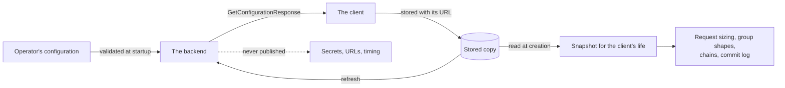

# Backend configuration

An operator configures one deployment. The backend publishes part of that configuration to every client and keeps the rest private. This spec owns that boundary, the public configuration wire format, and how a client fetches, stores, binds to, and applies it. A client sizes its requests to the published values, not to compiled constants, and a client database is bound to exactly one deployment by the identifier the operator chooses.



## Scope

In scope: the configuration checks the backend makes before it serves; the boundary between what is published and what stays private; the public configuration wire format; how a client fetches, validates, stores, and binds to it; what a refresh may change; the conditions under which a client stops; what a client sizes or rejects using it; and what an SDK exposes to an app.

Out of scope: the backend's configuration file and its keys; credentials and authorization ([AUTH](AUTH-backend-auth.md)); the backend API's enforcement of limits and its errors ([API section 7](API-backend-api.md#7-bounds-errors-and-transport)); operations such as retention, readiness, and telemetry ([OPS](OPS-backend-operations.md)); and the platform a deployment runs on.

| Related | Relation |
| --- | --- |
| [AUTH](AUTH-backend-auth.md#6-client-credentials) | Owns what a credential is, when a client attaches one, and which failures are terminal. This spec owns only what is published about it. |
| [API section 7](API-backend-api.md#7-bounds-errors-and-transport) | Owns what the backend does when a request exceeds a limit, and the fixed transport ceiling. This spec owns the published values and what a client does before it sends. |
| [OPS](OPS-backend-operations.md) | Owns retention enforcement, health, and the identifier's use in telemetry. |
| `EVENT` | EVENT-016 keeps local event subscriptions open after a server rejection. EVENT-001 owns the `client.rejected_by_server` event. |

## Terms

| Term | Meaning |
| --- | --- |
| Deployment | One backend an operator runs, with one configuration and one identifier. |
| Deployment identifier | The value of `GetConfigurationResponse.identifier`: the name an operator gives a deployment. A client database is bound to exactly one. |
| Backend URL | The address a client is configured to reach a deployment at. |
| Stored copy | The `GetConfigurationResponse` a client keeps in its database, with the backend URL it was fetched from and any conflicting identifier recorded under CONF-030. |
| Snapshot | The configuration a client resolves when it is created and reads for its life. |
| Compiled default | The value in the defaults table of section 3 that a client uses for a field its snapshot does not carry. |
| Advisory value | A published value the backend does not enforce, because only a client holds the state it is about. |
| Blocked connection | A condition that, once observed, fails later network work for the life of the client. |
| Refresh | A fetch of `GetConfiguration` by a client that already holds a snapshot, on its own schedule or when the app asks. |
| Credential source | The callback or key an app gives a client so that it can obtain credentials. [AUTH section 6](AUTH-backend-auth.md#6-client-credentials) defines the credential. |

## 1. What an operator configures

The backend validates its configuration before it serves. The checks below are the ones a client or an operator relies on: a published value a client would reject, or one the transport cannot honour. The ranges of other keys are documentation of the backend. A key the operator did not set takes the default in section 3.

| ID | Title | Requirement | Why |
| --- | --- | --- | --- |
| CONF-002 | Identifier is required | When the configured deployment identifier is absent, empty, longer than 256 bytes, or contains a whitespace or control character, the backend MUST refuse to start. | |
| CONF-003 | Stable identifier | An operator SHOULD NOT change a deployment identifier once a client has connected. | Every client database that reached this deployment is bound to the old value, and CONF-030 stops each of them permanently. |
| CONF-067 | Minimum version is a semantic version | When the configured minimum client version is set and is not a version under [Semantic Versioning 2.0.0 §2](https://semver.org/spec/v2.0.0.html#spec-item-2), the backend MUST refuse to start. | A client rejects an answer whose minimum does not parse (CONF-071), so a deployment that starts with one is unusable by every client. |
| CONF-005 | Explicit credential intent | When the configuration contains an `[auth]` table without an `enabled` key, the backend MUST refuse to start. | A configuration that gained the table before the key existed would otherwise serve without credentials, on the strength of an omission. |
| CONF-066 | Disabled auth table is not validated | While the `[auth]` table has `enabled` set to `false`, the backend MUST start without validating the other keys of that table and MUST NOT fetch a key set. | |
| CONF-008 | Request budgets fit the transport | When the configured `max_request_bytes` or `max_response_bytes` is greater than the transport ceiling API-282 states, the backend MUST refuse to start. | A larger budget publishes a request size the transport refuses to carry, so a client sized to it fails every large request. |
| CONF-009 | Public configuration stays small | When the encoded `GetConfigurationResponse` the backend would publish is longer than 65536 bytes (64 KiB), the backend MUST refuse to start. | The message is served without a credential, so an unbounded one is an amplification source. Bounding the whole message bounds every list in it without a limit per list. |
| CONF-065 | Refusal names the key | When the backend refuses to start under a rule in this section, it MUST report the configuration key that failed, or that the public configuration is too large. | |

API-282 states the transport ceiling and the failure rule for a message above the ceiling or byte budget. API-281 owns the status codes.

## 2. What is published and what is not

The backend publishes the values a client or an app acts on, on a request that needs no credential, and nothing else. Connection strings, key material, the JWKS URL, API key values, and credential-verification timing stay private. Of the auth configuration, a client acts on `enabled` and `required_scopes`; the key identities, audiences, and issuers are published for inspection. AUTH-001 through AUTH-003 own credential admission; [AUTH section 3](AUTH-backend-auth.md#3-jwt-verification) defines the audience, issuer, and scope checks.

The message is built once at startup from the validated configuration and the key set loaded then. A key set refreshed while the process runs is not republished. An operator changes what is published by restarting.

### 2.1 Public configuration wire format

This is the public configuration wire format. An absent scalar reads as 0 or empty, which a client treats as not provided under CONF-025; `commit_log_enabled` carries explicit presence because absent and `false` mean different things.

```proto
message GetConfigurationRequest {}

// Admission settings a client needs before it holds a credential. Never
// includes a JWKS URL, key material, leeway, or refresh timing.
message AuthConfiguration {
  // Public identity of one accepted signing key. Never the key itself.
  message SigningKey {
    string kid = 1;
    string alg = 2;
  }

  bool enabled = 1;
  repeated SigningKey keys = 2;
  repeated string audiences = 3;
  repeated string issuers = 4;
  repeated string required_scopes = 5;
}

message RetentionConfiguration {
  uint64 group_message_seconds = 1;
  uint64 welcome_seconds = 2;
  uint64 key_package_seconds = 3;
}

// Request shapes the backend accepts. A client chunks its work to these values.
message LimitsConfiguration {
  uint64 max_envelope_bytes = 1;
  uint64 max_request_bytes = 2;
  uint64 max_response_bytes = 3;
  uint32 max_publish_topics = 4;
  uint32 max_query_topics = 5;
  uint32 max_query_limit = 6;
  uint32 default_query_limit = 7;
  uint32 max_newest_metadata_topics = 8;
  uint32 max_newest_full_topics = 9;
  uint32 max_update_adds = 10;
  uint32 max_update_removes = 11;
  uint32 max_stream_topics = 12;
  uint32 max_static_topics = 13;
  uint32 max_lookup_identifiers = 14;
  uint32 max_scw_signatures = 15;
  uint32 max_identity_entries = 16;
  uint32 max_update_frames_per_second = 17;
  uint32 max_update_burst = 18;
  uint32 max_ping_frames_per_second = 19;
  uint32 max_ping_burst = 20;
}

// Advisory group shapes. The backend does not enforce these values.
message MlsConfiguration {
  uint32 max_group_members = 1;
  uint32 max_installations_per_inbox = 2;
  // Absent means the client keeps its compiled default.
  optional bool commit_log_enabled = 3;
}

message GetConfigurationResponse {
  // Stable operator-chosen name for this deployment. Never changes once
  // clients have connected.
  string identifier = 1;
  string server_version = 2;
  // Empty when the operator published no minimum.
  string min_libxmtp_version = 3;
  AuthConfiguration auth = 4;
  RetentionConfiguration retention = 5;
  LimitsConfiguration limits = 6;
  MlsConfiguration mls = 7;
  // CAIP-2 chain ids this backend verifies smart contract wallet signatures on.
  repeated string smart_contract_wallet_chains = 8;
  // Attachment storage this deployment offers; absent when it offers none.
  // The message and its rules are owned by ATCH section 1.
  xmtp.backend.v1.AttachmentsConfiguration attachments = 9;
}
```

| ID | Title | Requirement | Why |
| --- | --- | --- | --- |
| CONF-017 | Public configuration wire format | The backend MUST answer `GetConfiguration` with the `GetConfigurationResponse` defined above, with the field numbers and types shown, and MUST NOT reuse a field number of any message above for another meaning. | |
| CONF-010 | Published without a credential | The backend MUST answer `GetConfiguration` for a request that carries no credential, whatever the configured `auth.enabled`. | A client cannot learn that credentials are required if learning it requires one. |
| CONF-011 | Nothing secret is published | The backend MUST NOT place in any field of `GetConfigurationResponse` a signing key's key material, a JWKS URL, a database URL, a chain RPC URL, or an API key value. | The message has no access control, so the only protection a value has is not being in it. |
| CONF-012 | Stable for a process | While a backend process is running, it MUST answer every `GetConfiguration` with the same `GetConfigurationResponse`. | |
| CONF-069 | Published values are the applied values | The backend MUST set every field of `LimitsConfiguration` and `RetentionConfiguration` to the value it enforces or applies for that key, every field of `MlsConfiguration` to the configured value, and `min_libxmtp_version` to the configured minimum or to the empty string when none is configured. It MUST NOT set a numeric field of those three messages to 0. | A client reads 0 as "not provided" (CONF-025), so a 0 for a value the backend enforces tells the client to use a different one. |
| CONF-068 | Auth summary equals enforcement | The backend MUST set `AuthConfiguration.enabled` to the configured `auth.enabled`. While that is `true`, it MUST set `keys` to the `kid` and `alg` of each signing key accepted at startup and `audiences`, `issuers`, and `required_scopes` to the values it checks credentials against; while it is `false`, it MUST leave every other field of `AuthConfiguration` empty. | Leftover scopes from a disabled table would tell a client to satisfy demands nothing checks. |
| CONF-070 | Published chains are the verifiable set | The backend MUST set `smart_contract_wallet_chains` to the CAIP-2 identifier of every chain it verifies smart contract wallet signatures on, and to no other. | |

## 3. The snapshot

A client resolves its snapshot once, when it is created, and reads it for its life. The client configures itself from the values it receives from the server. A changed value takes effect for a client created afterwards.

Two conditions block a client's connection: a different deployment answering, and a raised minimum version. The blocked connection lasts for the life of the client. It fails operations that would reach the backend and closes streams that hold network interest with its error. Local event subscriptions stay open under EVENT-016. Which cause the client reports when both arise is the implementation's choice. PROC-002 owns durable receipt and PROC-005 owns processed positions. Closing a stream can leave received work above the processed position; it does not erase that work.

A field the snapshot does not carry, or carries as 0 or empty, takes the compiled default below, which is the value the backend defaults the same key to.

| Field | Default value |
| --- | --- |
| `min_libxmtp_version` | No minimum: every client version is accepted |
| `auth` | `enabled` `false`, every list empty |
| `retention.group_message_seconds` | 7776000 |
| `retention.welcome_seconds` | 7776000 |
| `retention.key_package_seconds` | 7776000 |
| `limits.max_envelope_bytes` | 1048576 |
| `limits.max_request_bytes` | 26214400 |
| `limits.max_response_bytes` | 26214400 |
| `limits.max_publish_topics` | 1000 |
| `limits.max_query_topics` | 1000 |
| `limits.max_query_limit` | 1000 |
| `limits.default_query_limit` | 100 |
| `limits.max_newest_metadata_topics` | 1000 |
| `limits.max_newest_full_topics` | 100 |
| `limits.max_update_adds` | 100000 |
| `limits.max_update_removes` | 100000 |
| `limits.max_stream_topics` | 100000 |
| `limits.max_static_topics` | 10000 |
| `limits.max_lookup_identifiers` | 250 |
| `limits.max_scw_signatures` | 100 |
| `limits.max_identity_entries` | 256 |
| `limits.max_update_frames_per_second` | 10 |
| `limits.max_update_burst` | 100 |
| `limits.max_ping_frames_per_second` | 10 |
| `limits.max_ping_burst` | 100 |
| `mls.max_group_members` | 250 |
| `mls.max_installations_per_inbox` | 10 |
| `mls.commit_log_enabled` (absent) | `true` |
| `smart_contract_wallet_chains` (empty) | No chain: every app-supplied smart contract wallet signature is rejected under CONF-046 |
| `attachments` (absent) | No attachment storage: creation fails under ATCH-030 |
| `attachments.max_upload_bytes` | 104857600 |
| `attachments.retention_seconds` | No expiry |

`identifier` has no default: an empty one is rejected under CONF-071. A present `commit_log_enabled` of `false` is not a missing value; it switches the commit log off under CONF-045.

| ID | Title | Requirement | Why |
| --- | --- | --- | --- |
| CONF-020 | One snapshot per client | The client MUST NOT replace its snapshot after it is created, whatever a later fetch returns. | |
| CONF-025 | Absent means the compiled default | When a field of a snapshot is 0, empty, or absent, the client MUST use the value the table above gives for that field. | |
| CONF-075 | Blocked connection stops network work | While the client has a blocked connection, every operation that would publish an envelope, publish or apply an identity update, or sync a group MUST fail with the blocked connection's error before any request is sent, and every open stream that holds network interest MUST close with that error. | The client has lost its binding or been refused by the deployment. Network work against that deployment cannot succeed. |

## 4. Fetching, storing, and binding

A client fetches the public configuration once, stores it with the backend URL, and reads the stored copy on every later creation. A stored copy that does not decode reads as the compiled defaults, with its identifier kept for CONF-030.

The identifier binds the database to a deployment. The URL does not, because an operator moves a deployment to a new address; a changed URL only triggers a re-check (CONF-033). A stored copy whose identifier is empty binds nothing.

A client validates an answer before it stores it (CONF-071). A `uint64` above 2^53 - 1 is rejected because the JavaScript number cannot hold it exactly.

An app may create a client that does no network work (CONF-034). A client told to reach the deployment that cannot fails under CONF-027 and does not fall back to working offline.

| ID | Title | Requirement | Why |
| --- | --- | --- | --- |
| CONF-026 | Fetch before other work | When a client that may reach the backend is created on a database with no stored copy, the client MUST send `GetConfiguration`, apply CONF-071 and CONF-030 to the answer, and store the answer with the backend URL, before it sends any other request. | Identity work is sized by the limits and bound by the identifier. Run first, it can register an installation on the wrong deployment. |
| CONF-027 | Failed first fetch | If the fetch under CONF-026 or CONF-033 fails, or its answer cannot be stored, then the client MUST fail creation and MUST NOT use the compiled defaults in place of the answer. | Compiled defaults would bind the database to nothing and size every request to values this deployment never published. |
| CONF-071 | Reject an unusable answer | If a `GetConfigurationResponse` carries an `identifier` that CONF-002 would refuse, a non-empty `min_libxmtp_version` that is not a version under [Semantic Versioning 2.0.0 §2](https://semver.org/spec/v2.0.0.html#spec-item-2), a `smart_contract_wallet_chains` entry that does not match the syntax of [CAIP-2](https://github.com/ChainAgnostic/CAIPs/blob/main/CAIPs/caip-2.md#syntax), or a `uint64` or `uint32` field of `retention`, `limits`, or `mls` greater than 9007199254740991, then the client MUST reject it and MUST NOT store it. | |
| CONF-029 | Fetch carries no credential | When the client sends `GetConfiguration`, it MUST NOT attach a credential and MUST NOT invoke the app's credential source. | |
| CONF-030 | Identifier binds the database | When a `GetConfigurationResponse` carries an `identifier` that differs from the stored copy's non-empty `identifier`, the client MUST record the received identifier as a conflict in the stored copy, MUST block the connection with a backend mismatch naming both identifiers whether or not the record succeeded, and MUST NOT store the answer. | Stored positions, group state, and identity state are meaningful only against the deployment that issued them. |
| CONF-072 | A recorded conflict fails creation | When a client is created on a database whose stored copy records a conflict, the client MUST fail creation with a backend mismatch naming the stored and the conflicting identifier, without sending any request. | |
| CONF-031 | A conflict is permanent | The client MUST NOT clear a recorded conflict, including when a later answer's `identifier` equals the stored one. | A database that has seen two deployments cannot be shown to hold consistent state for either. Only a database created for the deployment in use can. |
| CONF-033 | A moved deployment is re-checked | When a client that may reach the backend is created on a database whose stored copy carries a backend URL that differs from the client's backend URL, the client MUST send `GetConfiguration`, apply CONF-071 and CONF-030, and store the answer with the new URL, before it sends any other request. | |
| CONF-034 | Offline creation | Where an app creates a client that may not reach the backend, the client MUST use the stored copy when the database has one and the compiled defaults when it does not, and MUST NOT send `GetConfiguration`. | |

## 5. Refreshing

A refresh rewrites the stored copy and never the running snapshot (CONF-020). It can stop a live client in the two cases of section 3; everything else it learns takes effect when a client is next created on that database.

The client refreshes on its own schedule, spread at random. The interval, the spread, and the number of attempts in one run are the implementation's choice. A refresh is never driven by a failed request, and a failed refresh leaves the stored copy unchanged.

| ID | Title | Requirement | Why |
| --- | --- | --- | --- |
| CONF-040 | Refreshes are persisted | When a refresh returns an answer that passes CONF-071 and whose `identifier` equals the stored copy's, the client MUST replace the stored copy with that answer. | |
| CONF-036 | A raised minimum | When a refresh returns a `min_libxmtp_version` that is greater than the client's version under CONF-050, the client MUST store the answer and MUST block the connection because the client is too old, naming both versions. | |
| CONF-037 | A failed refresh changes nothing | If a refresh does not return an answer that passes CONF-071, then the client MUST keep the stored copy unchanged and MUST NOT fail any other operation because of it. | |

## 6. Applying the snapshot

The client splits and bounds its requests to the published limits, so that a request the backend would reject is never sent. The table below names the bound for each request. The fields it does not name (`max_response_bytes`, `max_stream_topics`, `max_identity_entries`, and the four rate-limit fields) are published for an app to read. API-281 and API-282 own response and request bounds, API-234 owns the identity-log limit, and API-258 owns stream frame rate limits.

| Request | Bound from the snapshot |
| --- | --- |
| Publish | Encoded request not longer than `max_request_bytes`; distinct topics not more than `max_publish_topics`; each envelope not longer than `max_envelope_bytes` |
| Query | Topics per request not more than `max_query_topics`; `limit` not more than `max_query_limit` |
| QueryNewest | Topics per request not more than `max_newest_full_topics` with full envelopes and `max_newest_metadata_topics` without |
| GetInboxIds | Identifiers per request not more than `max_lookup_identifiers` |
| VerifySmartContractWalletSignatures | Signatures per request not more than `max_scw_signatures` |
| SubscribeStatic | Topics per stream not more than `max_static_topics` |
| Subscribe update | `adds` not more than `max_update_adds`; `removes` not more than `max_update_removes`; encoded frame not longer than `max_request_bytes` |

Group size and installation count are advisory: the backend has no view of the state they are about, so only a client can check them (Known limitations). [GMOD section 2](GMOD-modifying-groups.md#2-the-membership-component) owns group membership; [IDENT section 8](IDENT-identity-updates.md#8-installations) defines the installations in an association state. [FORK](FORK-fork-recovery.md) owns the commit log; this spec owns only the switch.

The chain check runs on a signature an app is about to produce. It does not run on a signature read from the network, which the network already accepted, or when the app supplied its own verifier. PROC-012 owns the preservation of unresolved work.

The version gate and the credential requirement fail creation, so an app gets one clear reason instead of every request failing.

| ID | Title | Requirement | Why |
| --- | --- | --- | --- |
| CONF-073 | Size every request to the snapshot | The client MUST split or bound every request it sends so that it stays within each bound in the table above. When one envelope alone is longer than `max_envelope_bytes`, the client MUST reject the publish before it sends any request. | |
| CONF-043 | Advisory group size | When the number of distinct inboxes in a group's `GROUP_MEMBERSHIP` component plus the inboxes a change would add is greater than `max_group_members`, the client MUST reject the change before it builds a commit. | |
| CONF-044 | Advisory installation count | When the number of installations an inbox's association state names is not less than `max_installations_per_inbox`, the client MUST NOT register a new installation for that inbox. | |
| CONF-045 | Commit log follows the deployment | While the snapshot's `commit_log_enabled` is `false`, the client MUST NOT publish a commit-log entry and MUST NOT read the commit log. | A deployment that keeps no commit log would be sent entries it discards, and clients would read an always-empty log as evidence about groups. |
| CONF-046 | Only published chains are accepted | When an app that supplied no verifier of its own supplies a smart contract wallet signature whose CAIP-2 chain id is not in `smart_contract_wallet_chains`, the client MUST reject it before it sends any request, naming the chain and the accepted chains. | |
| CONF-048 | Chains and received data | The client MUST NOT apply CONF-046 to a signature it reads from a received identity update or envelope. | A signature the network already accepted is a fact. Refusing it would hold the client on that envelope for ever. |
| CONF-049 | Too old to run | When the snapshot's `min_libxmtp_version` is greater than the client's version under CONF-050, the client MUST fail creation, naming both versions. | |
| CONF-050 | Version compare ignores prerelease | When the client compares its version with a `min_libxmtp_version`, it MUST compare the major, minor, and patch numbers in that order ([Semantic Versioning 2.0.0 §11](https://semver.org/spec/v2.0.0.html#spec-item-11)) and MUST ignore the pre-release and build metadata of both. | A prerelease build of the version the operator named would otherwise be too old, which stops every development build. |
| CONF-051 | Credentials required but absent | When the snapshot's `AuthConfiguration.enabled` is `true` and the app supplied no credential source, the client MUST fail creation and MUST report `required_scopes`. | |

AUTH-020 owns when the client attaches a credential, including when `enabled` is `false` and the app supplied a source.

## 7. What an app can read

An app needs the public configuration before a client exists, to choose credentials, scopes, and chains, so it is readable from a backend URL alone. After that it reads the snapshot the client holds, which under CONF-020 can differ from what the deployment publishes now.

| ID | Title | Requirement | Why |
| --- | --- | --- | --- |
| CONF-061 | Apps read the snapshot | An SDK MUST expose to an app the snapshot the client holds, with every field of `GetConfigurationResponse`. | |
| CONF-062 | Reading before building | An SDK MUST let an app fetch a deployment's `GetConfigurationResponse` from a backend URL alone, with no database, no client, and no credential, and MUST apply CONF-071 to the answer. | |
| CONF-074 | Explicit refresh | An SDK MUST let an app start a refresh, and that refresh MUST apply CONF-071, CONF-030, CONF-036, and CONF-040 and return the fetched configuration. | |
| CONF-064 | Failures are distinguishable | An SDK MUST let an app distinguish, as distinct error kinds, an unreachable deployment or an unstorable answer (CONF-027), an invalid answer (CONF-071), a backend mismatch (CONF-030, CONF-072), a client that is too old (CONF-049, CONF-036), a missing credential source (CONF-051), and a chain that is not accepted (CONF-046). | |

## Known limitations

An advisory value binds only a client that applies it. A modified client can exceed the published group size or installation count, and the deployment will not notice. These values are a deployment's policy for cooperating clients, not a protection against a hostile one.

The backend does not read a client's version on a request. `min_libxmtp_version` is applied by the client alone, at creation and at refresh, so a client that never refreshes keeps working against a deployment that has raised its minimum.

A deployment behind one address may be more than one process, and two of them may hold different configurations during a rolling change. A client holds whichever it fetched. A limit lowered on one of them is still enforced by that one, so the client's request is rejected rather than silently accepted; a differing identifier across processes is an operator error and stops every client that reaches the odd one.

An operator's change reaches an existing client's stored copy within one refresh interval and its behaviour only when a client is next created. If every refresh fails there is no upper bound on how stale a stored copy may be; the client keeps using it rather than falling back to the compiled defaults.

Anyone who can reach the backend API can read the public configuration, including the auth summary and the accepted chains (CONF-010). CONF-011 keeps it harmless to disclose.

`GetConfiguration` is not rate limited.
