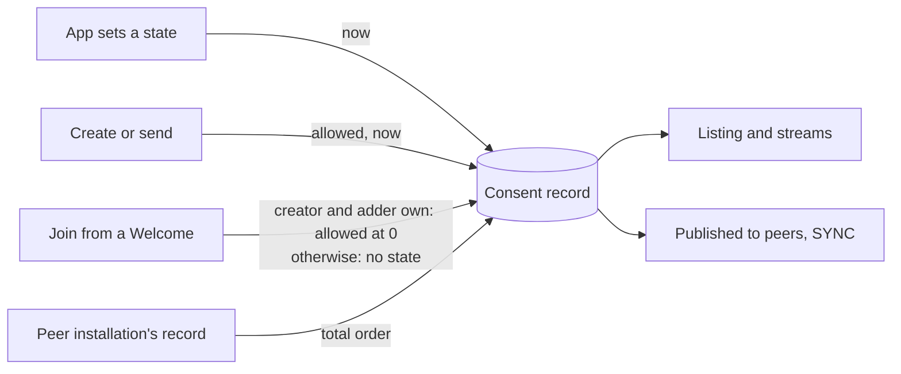

# Consent

Consent decides what a user sees. A conversation the user allowed is listed and streamed; one the user denied is not; one the user has not decided on is listed so that it can be decided. Consent is set on more than one installation and merged without coordination, so the merge rule has to be deterministic or two devices disagree about the same conversation.

A consent record names an entity, a state, and the time the state was set. The merge is a total order on records: the greater time wins, and on an equal time the greater state wins, so every installation that has seen the same records holds the same one whatever order they arrived in. A default is a record that carries no decision; it sits at time 0, so any decision replaces it and it replaces nothing. A DM inherits the decision made for an earlier DM with the same other party (`DMS`).



## Scope

In scope: the consent states, the two entities a record names, the wire form of a record, the merge rule, the records a client stores on creation, on send, and on join, the precedence between a join default and an inherited record, how consent filters listings and streams, and what an SDK exposes to an app.

Out of scope: how records travel between installations (`SYNC`), the DM identifier and how a record carries across the groups of one DM (`DMS`), how a stream is delivered (`PROC`), push suppression by consent (`PUSH`), readd requests gated by consent (`?FORK`), and archive import (`ARCH`).

| Related | Relation |
| --- | --- |
| `SYNC` | Owns the message that carries a record to a peer installation and when one is published. This spec owns the record and the merge. |
| `JOIN` | Owns the join itself. This spec owns the record a conversation starts with when the join completes. |
| `DMS` | Owns the DM identifier and DMS-010, which carries a record across the groups of one DM. CONS-024 owns only its precedence against a join default. |
| `META` | Owns `CREATOR_INBOX_ID` and `CONVERSATION_TYPE`, which CONS-023 reads, and META-018, which binds the creator to write its own inbox id. |
| `PUSH` | Owns which conversations produce push notifications. It reads conversation consent. |
| `?FORK` | Owns readd requests. It answers one only for a conversation whose consent is allowed. |
| `ARCH` | Owns the archive. An imported record is merged under CONS-010. |

## Terms

| Term | Meaning |
| --- | --- |
| Consent record | One stored decision: an entity, a state, and a consent time. |
| Entity | What a record is about: a conversation, named by its group id, or an inbox, named by its inbox id. |
| Conversation consent | The record whose entity is the conversation's group id. |
| Inbox consent | The record whose entity is an inbox id. |
| Consent time | The `consented_at_ns` of a record: the clock of the installation that set the state, in nanoseconds since the Unix epoch, or 0 for a default. |
| App act | An app setting a state through an SDK. |
| Default | A record the client stores without a decision, at consent time 0. |
| Consent filter | The set of states an app passes when it lists or streams conversations or messages. An absent filter and an empty filter are different things. |

## 1. States and entities

A record is in one of three states. Unknown is both a stored state and the state of an entity with no record; the two are indistinguishable to an app and to a filter. Allowed and denied are decisions.

A record names one of two entities. Conversation consent is what the client acts on: it gates listing and streaming (section 4), push notifications (`PUSH`), and readd requests (`?FORK`). Inbox consent is state an app reads and sets, and that the client reports for each member of a group; the client does not derive conversation consent from it, and no listing or stream reads it (Known limitations).

The record has one wire form. A peer installation reads it (`SYNC`) and an archive stores it (`ARCH`), so its encoding is a compatibility contract between installations and between versions.

```proto
// Proto representation of a consent record save
message ConsentSave {
  ConsentTypeSave entity_type = 1;
  ConsentStateSave state = 2;
  string entity = 3;
  int64 consented_at_ns = 4;
}

// Consent record type
enum ConsentTypeSave {
  CONSENT_TYPE_SAVE_UNSPECIFIED = 0;
  CONSENT_TYPE_SAVE_CONVERSATION_ID = 1;
  CONSENT_TYPE_SAVE_INBOX_ID = 2;
  CONSENT_TYPE_SAVE_ADDRESS = 3 [deprecated = true];
}

// Consent record state
enum ConsentStateSave {
  CONSENT_STATE_SAVE_UNSPECIFIED = 0;
  CONSENT_STATE_SAVE_UNKNOWN = 1;
  CONSENT_STATE_SAVE_ALLOWED = 2;
  CONSENT_STATE_SAVE_DENIED = 3;
}
```

`CONSENT_TYPE_SAVE_ADDRESS` is the entity type of a retired record kind. A current client never writes it and rejects it on read (CONS-003).

| ID | Title | Requirement | Why |
| --- | --- | --- | --- |
| CONS-001 | No record is unknown | When an app reads the consent of an entity, or a consent filter is applied to a conversation, the client MUST report and filter an entity with no record as unknown. | |
| CONS-002 | One wire form | When the client encodes a consent record for a peer installation or an archive, it MUST encode it as the `ConsentSave` above, with `entity` set to the lowercase hexadecimal group id for a conversation or the inbox id for an inbox, `state` set to the value named for the record's state, and `consented_at_ns` set to the record's consent time. | Two installations that encode the same conversation differently hold two records for it and never merge them. |
| CONS-003 | Reject an unusable record | When a received `ConsentSave` carries `entity_type` `CONSENT_TYPE_SAVE_UNSPECIFIED` or `CONSENT_TYPE_SAVE_ADDRESS`, or `state` `CONSENT_STATE_SAVE_UNSPECIFIED`, the client MUST NOT store it. | |

## 2. Merging records

Every installation of an inbox sets consent, and the records meet without coordination: over the sync group, from an archive, and from the app on this installation. Records for one entity are totally ordered: by consent time, and on an equal time by state, with denied above allowed above unknown, which is the order of the `ConsentStateSave` values. The greater record is stored; the lesser changes nothing. A record for an entity with no record is stored. Applied in any order, and any number of times, a set of records leaves the same record on every installation that has seen them all.

An app act is the user's decision on this installation now. It is stored with the current time, whatever the stored record's time or state, and whether or not the state differs: a repeated decision moves the record's time forward, and that is what lets it win against a decision another installation made in between. Clock skew between installations can make one installation's "now" older than another's stored time (Known limitations).

| ID | Title | Requirement | Why |
| --- | --- | --- | --- |
| CONS-010 | The greater record wins | When the client receives a consent record for an entity from a peer installation or an archive, it MUST store the received state and `consented_at_ns` when the entity has no record, or when the received `consented_at_ns` is greater than the stored consent time, or when they are equal and the received state is greater under the `ConsentStateSave` order; otherwise it MUST leave the stored record unchanged. | A stored time that is not replaced with the winner's lets a third record, older than the winner, replace it later; a tie left to arrival order leaves two devices with two states. |
| CONS-011 | An app act is now | When an app sets the consent of an entity, the client MUST store that state with the client's current time as the consent time, whatever record is stored for the entity and whether or not the state differs from the stored one. | A repeated decision that does not move the time loses to a decision made elsewhere in between. |

## 3. Defaults and inherited consent

A conversation the user starts, or writes in, is one the user wants. Creating a group or a DM sets it to allowed, and sending a message in a conversation that is not allowed sets it to allowed. Each is a decision, stored with the current time.

A conversation the user is added to is not: a join stores no record, so the conversation is unknown, unless the group was created by another installation of the user's own inbox. The group states its creator in `CREATOR_INBOX_ID` (`META`), and META-018 binds an honest creator to write its own inbox id; nothing binds a dishonest one, so the field alone is a claim by whoever created the group. The evidence the joiner has is the adder under JOIN-025: the inbox whose installation signed the `GroupInfo` in the Welcome, which an attacker cannot forge. Allowed is stored only when both name the own inbox. That proves an installation of the own inbox was a member and added this one; it does not prove the own inbox created the group (Known limitations).

A default carries no decision. It is stored at consent time 0, so under CONS-010 any record with a time replaces it, and it is stored only when the conversation has no record, because a record that arrived over the sync group before the Welcome is a decision. Neither `SYNC` nor an archive needs to carry a default: every installation derives it from its own Welcome.

A DM has one identifier for the pair of inboxes, and a client can hold more than one group for it. DMS-010 carries the record with the greatest consent time across those groups to a new one. Where a join qualifies for DMS-010 and for a rule in this section, the inherited record is the record this section's rules test (CONS-024).

Leaving a group and being added back is the one join that replaces a record. The user asked to leave, so the group is unknown again until the user decides. The reset is stored at the backend's timestamp on the Welcome, the time of the re-add, so a decision the user makes after the re-add on any installation wins, and the decision that preceded the leave does not. The leave request is owned by `?GMOD`, which is expected to define the request and the removal that follows it.

| ID | Title | Requirement | Why |
| --- | --- | --- | --- |
| CONS-020 | Creating allows | When the client creates a group or a DM at an app's request, it MUST store allowed for that conversation with the current time as the consent time. | |
| CONS-021 | Sending allows | When the client publishes a message an app sent in a conversation whose conversation consent is not allowed, it MUST store allowed for that conversation with the current time as the consent time. | A conversation the user replied in that stays unknown drops out of the listing on the next filter. |
| CONS-022 | Joining stores no decision | When the client completes a join from a Welcome, it MUST NOT store a record with a consent time other than 0 for that conversation, except under CONS-025 and DMS-010. | A conversation the user did not ask for that starts allowed is presented as wanted, on every installation at once. |
| CONS-023 | The own inbox's group is allowed | When the client completes a join from a Welcome whose `CREATOR_INBOX_ID` is the own inbox and whose adder under JOIN-025 is the own inbox, and the conversation has no record, it MUST store allowed for it at consent time 0. When either names another inbox, it MUST NOT store allowed. | `CREATOR_INBOX_ID` alone is the creator's claim; a group that names the recipient as its creator and is added by a stranger is a stranger's group. |
| CONS-024 | Inherited beats a default | When a join qualifies for DMS-010 and for CONS-023, the client MUST store the inherited record and MUST NOT store the default; when it qualifies for DMS-010 and for CONS-025, the client MUST apply CONS-025 to the inherited record. | An inherited record is the user's decision about the pair; a default replacing it undoes a block. |
| CONS-025 | Re-added after leaving | When the client completes a join from a Welcome for a group it holds a published leave request for, and the stored record's consent time is less than the backend's timestamp on the Welcome, it MUST store unknown for that conversation with that timestamp as the consent time. | A user who left is added back without asking. Allowed carried over lists the group as if they had agreed. |

## 4. Gating listing and streaming

Consent is applied as a filter on conversation consent. An app passes the states it wants; the client returns or delivers only conversations in those states, and a conversation with no record counts as unknown (CONS-001). An empty filter names no state and so includes nothing; it is not the same as no filter. Without a filter, a listing returns the conversations the user has allowed and the ones the user has not decided on, and never the denied ones. The same filter applies to a stream of conversations and to a stream of messages across conversations; PROC-032 owns what a message stream does with a candidate the filter excludes.

A message listing within one conversation is not filtered: the app named the conversation. A sync group is never listed or streamed unless the app asks for sync groups (SYNC-005).

| ID | Title | Requirement | Why |
| --- | --- | --- | --- |
| CONS-030 | The filter is on conversation consent | When an app lists or streams conversations, or streams messages across conversations, with a consent filter, the client MUST include only conversations whose conversation consent is in the filter, so that an empty filter includes none, and MUST NOT read inbox consent to decide. | |
| CONS-031 | Default listing excludes denied | When an app lists conversations with no consent filter, the client MUST return the conversations whose conversation consent is allowed or unknown and MUST NOT return one whose consent is denied. | A denied conversation that appears is the block failing; an unknown one that disappears can never be decided on. |

## 5. What an app can read and set

An app reads consent to build its inbox and its request list, sets it when the user decides, and follows changes that arrive from the user's other installations. A change the app is not told about leaves the app's view behind the client's, and the app cannot poll every entity.

| ID | Title | Requirement | Why |
| --- | --- | --- | --- |
| CONS-040 | Read, set, and follow consent | An SDK MUST let an app read and set the consent of a conversation and of an inbox, and MUST deliver to a subscribed app every consent record whose stored state changes, whether by an app act on this installation or by a record received from a peer installation. | |

## Known limitations

The consent time is the setting installation's clock. An installation whose clock is behind loses every merge against one whose clock is ahead, including for a decision the user made later. The client does not correct for skew.

CONS-023 proves that an installation of the own inbox added this one to a group that names the own inbox as creator, not that the own inbox created it. A stranger's group that names the recipient as creator is unknown on the installation the stranger added, and allowed on a second installation that the first one adds under GMOD-029. The window closes when the user decides on either.

Inbox consent gates nothing. Denying an inbox does not hide its DM or block its group invitations; only the conversation's own consent does. An app that offers "block this person" sets the conversation consent of every conversation with that inbox itself.

A join default is derived on each installation and not published. Two installations converge because each applies the same rule to the same Welcome, and because a default sits at time 0 under every decision, not because either tells the other.

Two groups for one DM identifier can hold different consent after an app act, because the act names one group. A listing presents one group per DM identifier (DMS-007), so the app sees one state, and a further duplicate inherits the greatest under DMS-010.
