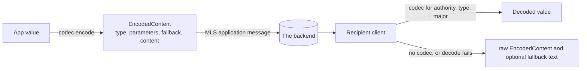

# Content types

How a message payload declares what it is, so that a client which does not understand a type can still show something useful rather than nothing.

Every application message a client publishes carries an `EncodedContent`: a content type identifier, the content bytes, the parameters a decoder needs, and optional fallback text. The identifier names an authority, a type, and a version. A codec is the pair of functions that turn a value into an `EncodedContent` and back for one identifier. This spec owns the identifier scheme, the envelope, what a client does with a type it cannot decode, and the catalogue of standard types with their encodings.



## Scope

In scope: the content type identifier and how a client matches one; the `EncodedContent` envelope and its parameters, fallback, and compression fields; the codec contract and the errors it reports; the push flag a type carries; content nested inside content; content type versions; what a client does with a type it cannot decode; and the catalogue of standard types with their schemas.

Out of scope: the `PlaintextEnvelope` that carries an `EncodedContent` inside an MLS message, the message id, and publishing (SEND); receipt, ordering, and storage of messages (PROC); the group metadata a commit changes and the transcript message a client derives from it (GMOD, META); the device sync payload (SYNC); what a push server does with the push flag (PUSH-219); the archive that carries stored content between installations (ARCH); and the effect of a delete or a leave request on group state (PROC-037, GMOD).

| Related | Relation |
| --- | --- |
| SEND section 1 | Owns the `PlaintextEnvelope` and message identity. SEND-021 owns the explicit push override and SEND-020 the default text type referenced in sections 3 and 4. |
| `PROC-037` | Owns deletion authorization and application. CTYPE-018 owns type and message-kind eligibility. |
| `PUSH-219` | Owns backend push eligibility. CTYPE-010 owns the default value for catalogue content; PUSH-218 needs to defer to it. |
| SYNC | Owns the sync message, an `EncodedContent` of its own type whose schema it states. |
| `GMOD-034`, `GMOD-035` | Own transcript derivation and the publication restriction referenced in section 7; GMOD owns group changes. |
| ARCH | Carries a stored message's `EncodedContent` bytes unchanged (ARCH-008), so a type a client does not decode survives export and import. |
| EVENT | EVENT-020 filters received messages by content type. EVENT-021 tests reply and reaction references. |

## Terms

| Term | Meaning |
| --- | --- |
| Content type identifier | A `ContentTypeId`: `authority_id`, `type_id`, `version_major`, and `version_minor`. |
| Human-readable form | The string `authority_id/type_id:version_major.version_minor` of an identifier, for example `xmtp.org/text:1.0`. It appears on the wire only where a catalogue schema names it. |
| Encoded content | An `EncodedContent` as defined in section 2. |
| Codec | The encode and decode functions for one identifier, with the push value in section 4. Catalogue decoders can be supplied by the client or an SDK; an app can register additional codecs under CTYPE-017. |
| Standard type | A type under authority `xmtp.org`, or one of the two `coinbase.com` types, in the catalogue in section 7. |
| Custom type | A type outside the catalogue, whether or not an app has registered a codec for it. |
| Unknown type | An identifier for which the client and SDK have no matching decoder under CTYPE-001. |
| Fallback | The `fallback` string of an encoded content: text a client shows when it cannot decode the content. |
| Nested content | An `EncodedContent` carried inside the `content` of another, as a reply carries the content it replies with. |
| Push value | The boolean a codec supplies for a type, which the client publishes as `should_push` under PUSH-219. |

## 1. The identifier

An identifier has three parts that name the type and one that does not. The authority is the party that defines the type, named by a DNS name. The type is a name unique under that authority. The major version separates encodings that do not decode one another. The minor version marks an additive change: content under a later minor version decodes under a codec for an earlier one, so a client matches a codec without it.

The catalogue in section 7 reserves identifiers under `xmtp.org` and lists two types under `coinbase.com`. An unlisted identifier may be implemented by an app. It does not become a standard type by using the `xmtp.org` authority.

```proto
message ContentTypeId {
  string authority_id = 1; // authority governing this content type
  string type_id = 2; // type identifier
  uint32 version_major = 3; // major version of the type
  uint32 version_minor = 4; // minor version of the type
}
```

| ID | Title | Requirement | Why |
| --- | --- | --- | --- |
| CTYPE-001 | Match on three values | When the client or an SDK selects a codec, including through the Kotlin, Swift, or TypeScript registry, it MUST match `authority_id`, `type_id`, and `version_major`, and MUST NOT require `version_minor` to match. | Ignoring authority can select another party's codec; requiring the minor version rejects compatible content. |
| CTYPE-002 | Standard authority is reserved | An app SHOULD NOT register a codec whose `authority_id` is `xmtp.org` for a `type_id` the catalogue in section 7 does not list. | |
| CTYPE-016 | Published identifiers retain meaning | When the client or an SDK implements a published identifier, it MUST retain that identifier's meaning and accept later minor versions with the earlier minor version's decoding rules. When a sender uses an encoding that those rules cannot decode, it MUST use a new major version or a new type identifier. | Reassigning an identifier makes stored messages change meaning and separates clients by version. |

## 2. The envelope

An `EncodedContent` carries the identifier, the parameters a decoder needs beyond the bytes, optional fallback text, optional compression, and the content. A recipient reads parameters under CTYPE-014. Fallback text is available without decoding the content. It is optional for every type, including types whose codecs can supply it (CTYPE-021).

`compression` names an algorithm applied to `content` before encoding. `COMPRESSION_DEFLATE` is 0, so absent and deflate are told apart by presence alone. Decompression is not shared by all receive paths (Known limitations), so CTYPE-006 excludes compressed publication.

```proto
// Recognized compression algorithms
enum Compression {
  COMPRESSION_DEFLATE = 0;
  COMPRESSION_GZIP = 1;
}

// EncodedContent bundles the content with metadata identifying its type
// and parameters required for correct decoding and presentation of the content.
message EncodedContent {
  // content type identifier used to match the payload with
  // the correct decoding machinery
  ContentTypeId type = 1;
  // optional encoding parameters required to correctly decode the content
  map<string, string> parameters = 2;
  // optional fallback description of the content that can be used in case
  // the client cannot decode or render the content
  optional string fallback = 3;
  // optional compression; the value indicates algorithm used to
  // compress the encoded content bytes
  optional Compression compression = 5;
  // encoded content itself
  bytes content = 4;
}
```

| ID | Title | Requirement | Why |
| --- | --- | --- | --- |
| CTYPE-003 | Every message names its type | When the client publishes an application message, it MUST require a protobuf `EncodedContent` with a present `type` containing non-empty `authority_id` and `type_id`, and MUST reject input that lacks that envelope or identifier. It MUST carry the identifier as the protobuf `ContentTypeId`, not its human-readable form; a catalogue parameter that explicitly carries that form does not replace `type`. | Recipients need the structured identifier to select a decoder. |
| CTYPE-021 | Fallback is optional | The client and an SDK MUST accept otherwise valid content without `fallback` when encoding, sending, or decoding any content type. | Missing display text does not make the content invalid. |
| CTYPE-005 | Custom fallback recommendation | An app SHOULD set `fallback` on every content it encodes under a custom type it registers. | |
| CTYPE-006 | No compression | When the client publishes an application message, it MUST NOT set `compression`. | |

## 3. Codecs and undecodable content

A codec turns a value into an `EncodedContent` and back. What the encode function writes is the contract with every other client: the identifier, the content bytes in the encoding the catalogue states, the parameters, and the fallback. A codec that writes a different encoding under the same identifier splits the network at that type.

A client meets content it cannot decode as a matter of course: a custom type from a different application, a standard type from a newer client, or bytes a buggy sender produced. The message is still a message: it has an id, a sender, a position in the conversation, and it may be the target of a reply, a reaction, or a deletion. The client keeps it and hands the app what it has, which is the identifier, the fallback when present, and the raw envelope. Dropping it would make the conversation differ between a client that has the codec and one that does not.

An SDK reports no matching codec, decode failure, encode failure, and malformed envelope as distinct outcomes. A registry lookup that fails is not permission to call the text decoder.

For CTYPE-007, equality means the same strings, byte sequences, numeric values, optional-member presence, and sequence order; map-member order is irrelevant. An action timestamp is compared after conversion to UTC and truncation below millisecond precision, as required by its encoding in section 7.

SEND-020 requires an SDK that accepts string content without an explicit content type to encode it as the catalogue text type. This default applies to a send request, not to received content with a missing or unknown identifier.

| ID | Title | Requirement | Why |
| --- | --- | --- | --- |
| CTYPE-007 | Encode round trip | When the client or an SDK encodes an app value with a codec, it MUST return an envelope whose `type` equals that codec's identifier and whose decoding with the same codec returns an equal value under the comparison above. | The app and the recipient must receive the value that was sent. |
| CTYPE-008 | Undecodable content is kept | When a received application message has no matching codec, fails decoding, or is not a typed `EncodedContent`, the client MUST retain its original bytes and message id. The client and SDK MUST expose those bytes and that id to the app, with the actual content identifier and fallback when present, without replacing the identifier with a text or fallback type. | Dropping undecodable content gives installations different conversation histories. |
| CTYPE-009 | Failures are distinguishable | When encoding, decoding, or selecting a codec, an SDK MUST let the app distinguish no matching codec, codec decode failure, codec encode failure, and a malformed or untyped envelope. On a lookup failure, the Kotlin and Swift SDK registries MUST report no matching codec and MUST NOT return a successful text decode instead. | Unknown UTF-8 content can otherwise appear to be ordinary text. |
| CTYPE-017 | Apps supply custom codecs | An SDK MUST let an app register a codec for a custom type, use it for received custom content matched under CTYPE-001, and send typed envelopes that the app encodes with it. | An app-defined type must be usable without changing the client. |

## 4. The push value

A type supplies a default push value. The client can obtain it from a codec or from the identifier of an app-supplied envelope. PUSH-219 owns backend push eligibility. SEND-021 requires that an explicitly supplied `shouldPush` value, including false, overrides the type default. An omitted options object and an object with no `shouldPush` field both leave that default in effect. PUSH-218 needs to defer to CTYPE-010 for catalogue application messages instead of imposing a blanket true default.

| ID | Title | Requirement | Why |
| --- | --- | --- | --- |
| CTYPE-010 | Push value from the catalogue | When the client or an SDK publishes catalogue content without an explicit app push override under SEND-021, it MUST set the push flag to the catalogue's Push value, including for an app-supplied raw envelope and for an options object with no push field. | Incorrect defaults suppress wanted notifications or send unwanted ones to recipients. |

## 5. Nested content

A reply carries the content it replies with as a complete `EncodedContent` inside its own `content`, with the nested identifier repeated in human-readable form in the `contentType` parameter. The nested content is decoded with the same rule as a top-level one, so a reply with a custom type inside it is a reply the recipient can still place in the conversation: the reply retains its reference and its outer fallback when present. The reserved `editMessage` schema also contains nested content, but CTYPE-020 gives it no mutation effect.

| ID | Title | Requirement | Why |
| --- | --- | --- | --- |
| CTYPE-011 | Nested content is complete | When the client or an SDK encodes nested content, it MUST require a complete protobuf `EncodedContent` with a present `type` and non-empty `authority_id` and `type_id`, and MUST fail encoding when these are absent. | An outer type cannot identify the nested payload. |
| CTYPE-012 | Nested decode outcomes | When the client or an SDK decodes a reply with a complete typed nested envelope but no matching nested codec, it MUST return the reply reference and that envelope unchanged as custom content; the nested `type` MUST control over a conflicting `contentType` parameter. When nested bytes are malformed or untyped, or a matching nested codec fails, it MUST report a decode failure and preserve the outer bytes and fallback under CTYPE-008. | Malformed bytes do not supply an envelope to return as a valid custom value. |

## 6. Content type versions

An incompatible encoding needs a different major version under CTYPE-016. A codec is not selected merely because its major version is greater than the message's. The legacy reaction type `xmtp.org/reaction:1.0` is deprecated and is outside this spec's catalogue. The current reaction type is `xmtp.org/reaction:2.0`.

| ID | Title | Requirement | Why |
| --- | --- | --- | --- |
| CTYPE-022 | Publish current reactions | When the client publishes a new `xmtp.org/reaction`, it MUST use `version_major` 2. | |

## 7. The catalogue

The catalogue lists identifiers, encodings, parameters, push values, and deletion eligibility. CTYPE-018 binds deletion eligibility; it is authorization behavior, not a wire value. PROC-037 requires that a deletion affects only a target in the same group, passes CTYPE-018, and is sent by the target's sender or a current super admin; a rejected deletion leaves the target unchanged.

Catalogue presence does not promise a codec class in every SDK. Standard content may be decoded by the client before an SDK registry is reached. SYNC owns its own message identifier and schema. The reserved edit type has a protobuf schema but no active codec.

JSON payloads use [RFC 8259 §§4–8](https://www.rfc-editor.org/rfc/rfc8259.html#section-4). Section 7.2 states member names, types, and presence in tables, without using WebIDL for a wire format. SPEC-043 and [SPEC section 3.1](SPEC-spec-format.md#31-type-blocks) provide no notation for repository-defined JSON type blocks. The tables avoid claiming a WebIDL exception.

| Type | Identifier | Content | Parameters | Push | Deletable |
| --- | --- | --- | --- | --- | --- |
| Text | `xmtp.org/text:1.0` | UTF-8 text | `encoding`: `UTF-8` | true | yes |
| Markdown | `xmtp.org/markdown:1.0` | UTF-8 Markdown | `encoding`: `UTF-8` | true | yes |
| Reaction | `xmtp.org/reaction:2.0` | Protobuf `ReactionV2` | none | false | no |
| Reply | `xmtp.org/reply:1.0` | Protobuf `EncodedContent`: the nested content | `reference`: the replied-to message id in lowercase hexadecimal; `contentType`: the nested identifier in human-readable form; `referenceInboxId`: optional, the replied-to sender's inbox id | true | yes |
| Read receipt | `xmtp.org/readReceipt:1.0` | Empty | none | false | no |
| Attachment | `xmtp.org/attachment:1.0` | The file bytes | `mimeType`; `filename`: optional | true | yes |
| Remote attachment | `xmtp.org/remoteStaticAttachment:1.0` | The URL as UTF-8 text | `contentDigest`, `secret`, `salt`, `nonce`, `scheme`; `contentLength` and `filename`: optional; see the Remote attachment parameters table | true | yes |
| Multiple remote attachments | `xmtp.org/multiRemoteStaticAttachment:1.0` | Protobuf `MultiRemoteAttachment` | none | true | yes |
| Transaction reference | `xmtp.org/transactionReference:1.0` | JSON `TransactionReference` | none | true | yes |
| Wallet send calls | `xmtp.org/walletSendCalls:1.0` | JSON `WalletSendCalls` | none | true | yes |
| Actions | `coinbase.com/actions:1.0` | JSON `Actions` | none | true | no |
| Intent | `coinbase.com/intent:1.0` | JSON `Intent` | none | true | no |
| Group updated | `xmtp.org/group_updated:1.0` | Protobuf `GroupUpdated` | none | false | no |
| Legacy membership change | `xmtp.org/group_membership_change:1.0` | Protobuf `GroupMembershipChanges` | none | false | no |
| Leave request | `xmtp.org/leave_request:1.0` | Protobuf `LeaveRequest` | none | false | no |
| Delete message | `xmtp.org/deleteMessage:1.0` | Protobuf `DeleteMessage` | none | false | no |
| Edit message (reserved) | `xmtp.org/editMessage:1.0` | Protobuf `EditMessage` | none | false | no |

Group updated and legacy membership change represent commit transcripts. GMOD-034 requires that the client derives transcript records from validated commits, and GMOD-035 that it never publishes either transcript type as an application message.

| ID | Title | Requirement | Why |
| --- | --- | --- | --- |
| CTYPE-014 | Catalogue encodings are binding | When the client or an SDK encodes or decodes a catalogue type, it MUST use the identifier, content encoding, parameters, protobuf schemas, Remote attachment parameters table, and JSON member tables in this section, and MUST NOT publish that type under another identifier. On decode, it MUST ignore envelope parameters that the type does not name. | Different encodings under one identifier break interoperability. |
| CTYPE-015 | Remote attachment payload | When the client or an SDK encodes a remote attachment, including each entry of a multiple attachment, it MUST encrypt a serialized attachment `EncodedContent` with AEAD_AES_256_GCM ([RFC 5116 §5.2](https://www.rfc-editor.org/rfc/rfc5116.html#section-5.2)), a 16-byte appended tag, empty associated data, and a fresh 12-byte random nonce. It MUST derive the 32-byte key with HKDF-SHA256 ([RFC 5869 §2](https://www.rfc-editor.org/rfc/rfc5869.html#section-2)) from a fresh 32-byte random secret and 32-byte random salt with empty info, and set `contentDigest` to lowercase hexadecimal SHA-256 of ciphertext including the tag. Before decryption, it MUST reject a digest mismatch; it MUST reject an authentication failure without returning plaintext. | The digest identifies the encrypted object; GCM authenticates its contents. |
| CTYPE-018 | Deletion eligibility | When the client accepts or applies a deletion, it MUST require the target to have application message kind and a catalogue identifier with Deletable `yes`, matched on authority, type, and major version under CTYPE-001. It MUST reject deletion of a transcript, an unknown type, a custom type, a reserved type, or any catalogue type marked `no`, regardless of sender privileges. | A privileged sender must not erase protocol records or content with undefined deletion semantics. |
| CTYPE-020 | Reserved edits do not mutate | When the client receives the reserved edit type, it MUST preserve it under CTYPE-008 and MUST NOT change the referenced message. | A schema alone does not authorize replacement of message history. |

### 7.1 Schemas

The Remote attachment parameters table gives the map values for a single remote attachment. Its URL is the UTF-8 content. The multiple-attachment protobuf carries the same values with its declared field types.

| Parameter | Presence | Value |
| --- | --- | --- |
| `contentDigest` | required | Lowercase hexadecimal SHA-256 of ciphertext and tag |
| `secret` | required | Lowercase hexadecimal, 32 bytes |
| `salt` | required | Lowercase hexadecimal, 32 bytes |
| `nonce` | required | Lowercase hexadecimal, 12 bytes |
| `scheme` | required | `https://` |
| `contentLength` | optional | Decimal unsigned integer, 0 through 4294967295; ciphertext and tag length |
| `filename` | optional | String |

The protobuf encodings:

```proto
// Action enum to represent reaction states
enum ReactionAction {
  REACTION_ACTION_UNSPECIFIED = 0;
  REACTION_ACTION_ADDED = 1;
  REACTION_ACTION_REMOVED = 2;
}

// Schema enum to represent reaction content types
enum ReactionSchema {
  REACTION_SCHEMA_UNSPECIFIED = 0;
  REACTION_SCHEMA_UNICODE = 1;
  REACTION_SCHEMA_SHORTCODE = 2;
  REACTION_SCHEMA_CUSTOM = 3;
}

// Reaction message type
message ReactionV2 {
  // The message ID being reacted to
  string reference = 1;
  // The inbox ID of the user who sent the message being reacted to
  // Optional for group messages
  string reference_inbox_id = 2;
  // The action of the reaction (added or removed)
  ReactionAction action = 3;
  // The content of the reaction
  string content = 4;
  // The schema of the reaction content
  ReactionSchema schema = 5;
}
```

```proto
// MultiRemoteAttachment message type
message MultiRemoteAttachment {
  // Array of attachment information
  repeated RemoteAttachmentInfo attachments = 1;
}

message RemoteAttachmentInfo {
  // The SHA256 hash of the remote content
  string content_digest = 1;
  // A 32 byte array for decrypting the remote content payload
  bytes secret = 2;
  // A byte array for the nonce used to encrypt the remote content payload
  bytes nonce = 3;
  // A byte array for the salt used to encrypt the remote content payload
  bytes salt = 4;
  // The scheme of the URL. Must be "https://"
  string scheme = 5;
  // The URL of the remote content
  string url = 6;
  // The size of the encrypted content in bytes (max size of 4GB)
  optional uint32 content_length = 7;
  // The filename of the remote content
  optional string filename = 8;
}
```

Each `RemoteAttachmentInfo` is encrypted as CTYPE-015 states for a single remote attachment.

```proto
// A summary of the changes in a commit.
// Includes added/removed inboxes and changes to metadata
message GroupUpdated {
  // An inbox that was added or removed in this commit
  message Inbox {
    string inbox_id = 1;
  }

  // A summary of a change to the mutable metadata
  message MetadataFieldChange {
    // The field that was changed
    string field_name = 1;
    // The previous value
    optional string old_value = 2;
    // The updated value
    optional string new_value = 3;
  }

  string initiated_by_inbox_id = 1;
  // The inboxes added in the commit
  repeated Inbox added_inboxes = 2;
  // The inboxes removed in the commit
  repeated Inbox removed_inboxes = 3;
  // The metadata changes in the commit
  repeated MetadataFieldChange metadata_field_changes = 4;
  /// The inboxes that were removed from the group in response to pending-remove/self-remove requests
  repeated Inbox left_inboxes = 5;
  // The inboxes that were added to admin list in the commit
  repeated Inbox added_admin_inboxes = 6;
  // The inboxes that were removed from admin list in the commit
  repeated Inbox removed_admin_inboxes = 7;
  // The inboxes that were added to super admin list in the commit
  repeated Inbox added_super_admin_inboxes = 8;
  // The inboxes that were removed from super admin list in the commit
  repeated Inbox removed_super_admin_inboxes = 9;
}
```

```proto
// A group member and affected installation IDs
message MembershipChange {
  repeated bytes installation_ids = 1;
  string account_address = 2;
  string initiated_by_account_address = 3;
}

// The group membership change proto
message GroupMembershipChanges {
  // Members that have been added in the commit
  repeated MembershipChange members_added = 1;
  // Members that have been removed in the commit
  repeated MembershipChange members_removed = 2;
  // Installations that have been added in the commit, grouped by member
  repeated MembershipChange installations_added = 3;
  // Installations removed in the commit, grouped by member
  repeated MembershipChange installations_removed = 4;
}
```

```proto
// LeaveRequest message type
message LeaveRequest {
  // A serialized AuthenticatedNote containing the sender's signed, member-only verifiable statement
  optional bytes authenticated_note = 1;
}

// DeleteMessage message type
message DeleteMessage {
  // ID of the message to delete
  string message_id = 1;
}

// EditMessage message type
message EditMessage {
  // ID of the message to edit
  string message_id = 1;
  // The new content for the message
  xmtp.mls.message_contents.EncodedContent edited_content = 2;
}
```

`DeleteMessage.message_id` is the target message id in lowercase hexadecimal.

### 7.2 JSON members and validation

These JSON member tables define object shapes. All listed members are required unless marked optional. Strings and numbers are JSON strings and numbers; arrays preserve order. Optional members are omitted on encode when absent. Unknown JSON object members are ignored on decode except for the additional string members of `WalletCallMetadata`.

| Object | Required members | Optional members |
| --- | --- | --- |
| TransactionReference | `networkId`: string; `reference`: string | `namespace`: string; `metadata`: TransactionMetadata |
| TransactionMetadata | `transactionType`, `currency`, `fromAddress`, `toAddress`: strings; `amount`: number; `decimals`: integer from 0 through 4294967295 | none |
| WalletSendCalls | `version`, `chainId`, `from`: strings; `calls`: array of WalletCall | `capabilities`: object with string values |
| WalletCall | none | `to`, `data`, `value`, `gas`: strings; `metadata`: WalletCallMetadata |
| WalletCallMetadata | `description`, `transactionType`: strings | Additional members with string values |
| Actions | `id`, `description`: strings; `actions`: array of Action | `expiresAt`: string |
| Action | `id`, `label`: strings | `imageUrl`: string; `style`: string, one of `primary`, `secondary`, `danger`; `expiresAt`: string |
| Intent | `id`, `actionId`: strings | `metadata`: object with arbitrary JSON values |

The validation table states encode and decode behavior separately. A decode error preserves the received message under CTYPE-008. The action-count and metadata-size limits restrict encoding; they do not reject otherwise decodable historical content.

| Type or field | Encode | Decode |
| --- | --- | --- |
| Text and markdown `encoding` | Set `UTF-8` | Use `UTF-8` when absent; reject any other value |
| JSON object members | Use the JSON member tables, omit absent optional members, and fail for a missing required member or wrong value type | Require the declared member types; accept absent or null optional members and ignore unknown members, except that additional WalletCallMetadata members are retained as strings |
| TransactionReference `networkId` | String | Accept string or number; return a number's decimal text as a string |
| Actions `actions` | Require 1 through 10 entries and unique `id` values | Accept an array without imposing the encode count or uniqueness limits |
| Action and Actions `expiresAt` | RFC 3339 UTC timestamp with exactly three fractional digits; discard precision below milliseconds | Parse RFC 3339 timestamps and normalize to UTC; accept `expires_at` as an alias |
| Action `imageUrl`; Intent `actionId` | Use the camel-case member name | Also accept `image_url` and `action_id`, respectively |
| Intent `metadata` | Reject when its compact UTF-8 JSON encoding exceeds 10240 bytes | Accept an object without imposing the encode size limit |

Timestamp syntax is defined by [RFC 3339 §5.6](https://www.rfc-editor.org/rfc/rfc3339.html#section-5.6). Transaction hashes, addresses, call data, and numeric strings are content values, not client-side authorization of a transaction.

| ID | Title | Requirement | Why |
| --- | --- | --- | --- |
| CTYPE-019 | Encoding and decoding checks | When the client or an SDK encodes or decodes catalogue content, it MUST apply the matching column of the validation table above and MUST return an encode or decode failure for a violated check. | Hidden validation differences make the same content work on one SDK and fail on another. |

## Known limitations

Compression is handled by the Kotlin and Swift envelope decode helpers, but the client's standard decoders and the TypeScript receive path do not share that step. A compression flag therefore does not imply successful decompression across SDKs; CTYPE-006 forbids publishing compressed application content.

The client's standard dispatch checks type and major version but omits authority. Kotlin, Swift, and TypeScript registries include the minor version in their keys. These are gaps in CTYPE-001, but they do not imply that every standard text message with a later minor fails: the client can decode it before the SDK registry is reached.

Kotlin and Swift registry lookup failures select a text codec. Unknown UTF-8 content can therefore decode as text instead of producing the missing-codec outcome in CTYPE-009.

Node raw-envelope sends use false when the options object is absent; browser raw-envelope sends use true. Neither derives that default from the catalogue. A supplied options object is forwarded unchanged; both bindings declare the push field as required, so omission is not the same path as an absent options object. These paths do not yet satisfy CTYPE-010.

JSON member tables state the wire shapes without a JSON type-block notation. SPEC-043 and section 3.1 need a JSON notation before these tables can be replaced with JSON type blocks.
