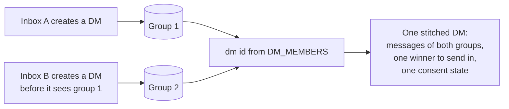

# DMs and stitching

A DM is an MLS group with an immutable pair of inboxes and fixed membership policies. Either inbox can create one before it sees a group created by the other inbox or a peer installation. A client combines these groups into one conversation and selects one group for sends.

## Scope

In scope: the identifier a client derives from the DM pair; what a creator writes into a DM; the fixed DM policy and the one addition it permits; what a joiner checks before it accepts a DM; how a client folds the groups that share an identifier into one conversation and which of them it acts in; how consent carries across those groups; deduplication of the membership-change messages they repeat; and what an SDK exposes about a DM.

Out of scope: the join itself and its rejections (`JOIN`), component ids and encodings (`META`), the policy engine and role rules (`PERM`), commit validation (`GMOD`), consent states and defaults (`CONS`), stream ordering (`PROC`), and archives (`ARCH`).

| Related | Relation |
| --- | --- |
| `META-004`, `META-010`, `META-030` | Own immutability, component encodings, and DM pair structure. This spec owns DM initialization and admission. |
| `JOIN-060` | Rejects a Welcome whose group fails the checks its kind demands. DMS-003 states the checks a DM demands. |
| `JOIN-025` | Names the inbox that added the joiner, which DMS-003 compares against the DM pair. |
| `PERM-005`, `PERM-009`, `PERM-011` | Own hardcoded authority and evaluation against each proposer's operation. This spec owns fixed DM policy values and the participant-add exception. |
| `CONS-010`, `CONS-024` | Own consent conflict ordering and precedence over join defaults. DMS-010 owns inheritance across a DM's groups. |
| `PROC-025`, `PROC-026`, `PROC-034` | Own stream eligibility and delivery order. DMS-009 owns the stitched scope and query ordering. |

## Terms

| Term | Meaning |
| --- | --- |
| DM pair | The two inboxes in a DM's `DM_MEMBERS` component. |
| Peer inbox | The inbox of the DM pair that is not the client's own. |
| Dm id | The string derived from the DM pair under DMS-001. Two groups with equal dm ids are one conversation. |
| Stitched DM | The set of groups a client holds whose dm ids are equal. |
| Winner | The group of a stitched DM the client lists, sends in, and resolves group ids to, chosen under DMS-013. |
| Activity timestamp | The retained `last_message_ns` value used for conversation ordering, including a value imported under ARCH-014. It can outlive the messages that supplied it. |
| Restored placeholder | A group imported without MLS state under ARCH-015. |
| Fixed DM policy | The policy values of section 2. |
| Membership-change message | A message for a commit or join that carries a `GroupUpdated` payload. |

## 1. The DM pair and its identifier

A DM is identified by the two inboxes it is between, not by its MLS group id. The creator records both inboxes in `DM_MEMBERS` at creation, where they are immutable (META-004), and every client derives the same string from them. The derivation is order-free, so the group each side created yields the same dm id, and it is the key under which everything in sections 3 and 4 happens.

A DM is between two different inboxes. A client does not create a DM with itself, and rejects one at the join.

| ID | Title | Requirement | Why |
| --- | --- | --- | --- |
| DMS-001 | Dm id derivation | The client MUST derive a DM's dm id as `dm:` followed by the two inbox ids of `DM_MEMBERS` in lowercase hexadecimal, sorted ascending by byte order and joined by `:`. | Two installations that derive it differently import each other's archives and consent records into different conversations. |
| DMS-002 | What a creator writes | When a client creates a DM, it MUST set `CONVERSATION_TYPE` to `CONVERSATION_TYPE_DM`, `DM_MEMBERS` to its own inbox id and one distinct inbox id, and both `ADMIN_LIST` and `SUPER_ADMIN_LIST` to empty sets. It MUST initialize the registry policies to the values in the fixed DM policy tables in section 2. | |

## 2. The fixed DM policy

A DM's fixed policies deny inbox additions, inbox removals, and admin changes. DMS-004 permits the other participant's addition. Updates to existing membership entries still support installation changes under GMOD. The registry and super-admin list require a super admin under PERM-005; a DM starts with neither role.

| Registry entry | `insert_policy` | `update_policy` | `delete_policy` |
| --- | --- | --- | --- |
| `GROUP_MEMBERSHIP` | `METADATA_BASE_POLICY_DENY` | `METADATA_BASE_POLICY_ALLOW` | `METADATA_BASE_POLICY_DENY` |
| `ADMIN_LIST` | `METADATA_BASE_POLICY_DENY` | `METADATA_BASE_POLICY_DENY` | `METADATA_BASE_POLICY_DENY` |

The settings policies below apply at creation under DMS-002. The component names and wire ids belong to META section 2. Permission evaluation belongs to PERM-011. The commit-log signer is separate from the settings either participant can update; clearing disappearing settings writes disabled values instead of removing the components.

| Registry entries | `insert_policy` | `update_policy` | `delete_policy` |
| --- | --- | --- | --- |
| `GROUP_NAME`, `GROUP_DESCRIPTION`, `GROUP_IMAGE_URL`, `APP_DATA`, `MESSAGE_DISAPPEAR_FROM_NS`, `MESSAGE_DISAPPEAR_IN_NS`, `MIN_SUPPORTED_PROTOCOL_VERSION` | `METADATA_BASE_POLICY_ALLOW` | `METADATA_BASE_POLICY_ALLOW` | `METADATA_BASE_POLICY_ALLOW_IF_SUPER_ADMIN` |
| `COMMIT_LOG_SIGNER` | `METADATA_BASE_POLICY_ALLOW_IF_SUPER_ADMIN` | `METADATA_BASE_POLICY_ALLOW_IF_SUPER_ADMIN` | `METADATA_BASE_POLICY_ALLOW_IF_SUPER_ADMIN` |
| `CONVERSATION_TYPE`, `CREATOR_INBOX_ID`, `DM_MEMBERS` | `METADATA_BASE_POLICY_ALLOW_IF_SUPER_ADMIN` | `METADATA_BASE_POLICY_DENY` | `METADATA_BASE_POLICY_DENY` |

| ID | Title | Requirement | Why |
| --- | --- | --- | --- |
| DMS-003 | A DM is what it claims | When a client joins a DM, it MUST verify that `DM_MEMBERS` is the distinct pair of META-030 and includes its own inbox, that the adder under JOIN-025 is either inbox of that pair, and that every `GROUP_MEMBERSHIP` entry and every ratchet-tree leaf names an inbox in that pair. It MUST also verify that `SUPER_ADMIN_LIST` and `ADMIN_LIST` are empty and that the membership and admin insert and delete policies equal the first table above, including when the adder is its own inbox. If any check fails, it MUST reject the Welcome under JOIN-060. | Valid credentials for a third inbox do not make that inbox a DM participant. |
| DMS-004 | Only the pair is added | When a proposal in a DM adds exactly the other inbox of `DM_MEMBERS` relative to its proposer, the client MUST allow that inbox's `GROUP_MEMBERSHIP` insertion and its MLS Add proposals despite the fixed deny policy, subject to all other validation. It MUST reject an inbox addition outside that exception. | Without the exception the DM cannot gain its second participant. |

## 3. Duplicate groups and the winner

Two groups for one pair arise whenever the two sides, or two installations of one side, each create before they see the other's Welcome. The client keeps every one of them: each is a valid MLS group its peer may be sending in, and a group discarded is a message lost. What the client hides is the multiplicity. Every group that shares a dm id is one conversation to the app: one entry in the list, one message thread, one identifier to send to.

The winner order is deterministic for the state a client holds. Installations with different received history can select different winners. An archive import can raise a group's retained activity timestamp under ARCH-014 without importing a message at that time. Message deletion does not cause selection to fall back to the remaining history.

The client does not create a further group while it holds one that is not a restored placeholder, so the set grows only from races, never from repetition.

| ID | Title | Requirement | Why |
| --- | --- | --- | --- |
| DMS-005 | Reuse before create | When an app asks the client for the DM with an inbox and the client holds a group whose dm id is that pair's and that is not a restored placeholder, the client MUST return that stitched DM's winner and MUST NOT create another group. | Every group created adds a Welcome, a key package fetch, and a group the peer must hold for ever. |
| DMS-013 | Winner uses retained activity | Among the groups of a stitched DM, the client MUST select the winner by preferring non-restored groups, then the greatest retained `last_message_ns` with absent lowest, then the greatest group id under byte order. It MUST retain activity after message deletion and include activity imported under ARCH-014, even when no retained message has that timestamp. | Recomputing from remaining messages can move the winner after expiry or an archive import. |
| DMS-007 | One conversation per dm id | When the client lists conversations, or resolves a group id that belongs to a stitched DM, it MUST return the winner and MUST NOT return another group of the set unless the app asked for duplicates. | |
| DMS-008 | A second group is joined | When a client receives a Welcome for a group whose dm id equals that of a group it holds, it MUST process the Welcome under JOIN and MUST NOT reject it for the equal dm id. | The peer created it and may be sending in it. |
| DMS-009 | The thread is the union | When an app queries or streams a stitched DM through any of its group ids, the client MUST use the union of the groups' messages and apply the requested filters and limit to that union. For history queries, it MUST order by `sent_at_ns` ascending by default, or by the app's requested supported sort field and direction. For streams, it MUST apply the eligibility and delivery order of PROC-025, PROC-026, and PROC-034. | Applying a limit separately to each group gives the app the wrong page. |

## 4. Consent and repeated records

Consent is recorded per group. DMS-010 carries the newest decision to a new group of the same DM. CONS-024 governs its precedence over join defaults and the reset after a leave. Copying a decision does not make it a new decision.

Each group of a set records its own membership-change messages, and the join into a second group records the same add the first one did. The client suppresses a record that repeats what it already holds for the set, so the thread does not show the user being added twice.

CONS-001 owns the unknown state when no record exists. CONS-030 and CONS-031 own consent filtering and default listing.

| ID | Title | Requirement | Why |
| --- | --- | --- | --- |
| DMS-010 | Consent carries across the set | When the client installs a group with a dm id and holds a consent record for another group with that dm id, it MUST inherit the state and original `consented_at_ns` of the record with the greatest consent time, using the state tie-break of CONS-010, before the app sees the group. It MUST apply the precedence rules of CONS-024 to that inherited record. | Giving an older decision a new time can override a newer block. |
| DMS-011 | Repeated adds are shown once | When membership-change messages in a stitched DM have non-empty `added_inboxes` and equal decoded `GroupUpdated` payloads, the client MUST show at most one of them in app queries and streams. It MUST compare `initiated_by_inbox_id`, every repeated field in its listed order, and both presence and value of each optional field. It MUST NOT suppress a message as a duplicate under this rule unless one complete earlier payload equals it. | Combining fields from different records can hide a change that has never been shown. |

## 5. What an app can read

An app addresses a DM by the peer, not by group id, and needs to know which groups a conversation spans so that it can, for example, register push keys for each.

| ID | Title | Requirement | Why |
| --- | --- | --- | --- |
| DMS-012 | Peer and duplicates are readable | An SDK MUST let an app read a DM's peer inbox, list the other groups of its stitched DM, and list conversations with every group of each stitched DM included. | |

## Known limitations

The winner can change when another group's activity timestamp becomes greater, including through an archive import. A late message with an older timestamp need not change it. An app that keeps state by group id can see the conversation's identifier change.

A DM has no super admin, so its registry and `COMMIT_LOG_SIGNER` cannot be changed through the fixed policies. A signer rotation is not possible through those policies.

The current same-inbox Welcome path skips the empty-role-list and fixed-policy checks. Neither join path constrains the admitted membership or ratchet-tree inboxes to the declared pair. Both differ from DMS-003.

Current consent inheritance selects the oldest record and assigns the copy the current time. DMS-010 instead preserves the newest decision and its time.

Current add-record deduplication compares accumulated hashes of the most recent non-empty fields and ignores the initiator. It can suppress a record that does not equal any complete earlier payload, or show one that equals an older payload. This differs from DMS-011. Records without adds are outside that rule; DM history omits membership-change messages by default.
