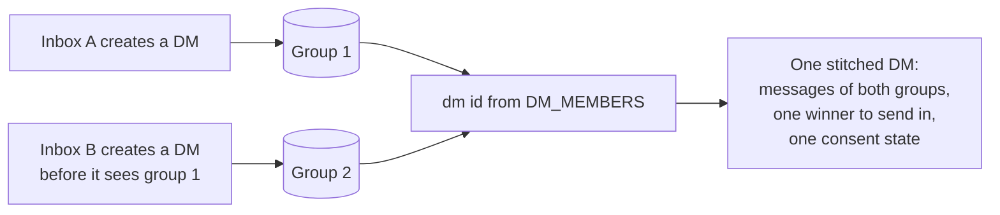

# DMs and stitching

A conversation between two inboxes is an MLS group like any other, with a conversation type of DM, a fixed policy that keeps a third inbox out, and an immutable record of the two inboxes it is between. Nothing coordinates its creation: either inbox creates it, and each installation of an inbox creates it before it has seen the group another installation created. Several MLS groups for one pair are therefore normal, and every client folds them into one conversation, chooses one of them to act in, and hands the user one thread.

## Scope

In scope: the identifier a client derives from the DM pair; what a creator writes into a DM; the fixed DM policy and the one addition it permits; what a joiner checks before it accepts a DM; how a client folds the groups that share an identifier into one conversation and which of them it acts in; how consent carries across those groups; deduplication of the membership-change messages they repeat; and what an SDK exposes about a DM.

Out of scope: the join itself and its rejections (`JOIN`), the encoding and immutability of `CONVERSATION_TYPE` and `DM_MEMBERS` (`META`), the policy engine and the admin lists (`?PERM`), commit validation (`?GMOD`), what a consent state means and how a conversation's state is chosen when no DM record exists (`?CONS`), and the archive's copy of a DM (`?ARCH`).

| Related | Relation |
| --- | --- |
| `META` | Owns `CONVERSATION_TYPE` (META-019), `DM_MEMBERS` (META-030), and the empty admin lists a DM is created with (META-031). This spec owns what those values mean for a DM. |
| `JOIN-060` | Rejects a Welcome whose group fails the checks its kind demands. DMS-003 states the checks a DM demands. |
| `JOIN-025` | Names the inbox that added the joiner, which DMS-003 compares against the DM pair. |
| `?PERM` | Owns how a policy is evaluated. This spec fixes the policy values a DM carries and the one add its policy does not cover. |
| `?CONS` | Owns consent states and records. This spec owns only how a record carries from one group of a DM to another. |

## Terms

| Term | Meaning |
| --- | --- |
| DM pair | The two inboxes in a DM's `DM_MEMBERS` component. |
| Peer inbox | The inbox of the DM pair that is not the client's own. |
| Dm id | The string derived from the DM pair under DMS-001. Two groups with equal dm ids are one conversation. |
| Stitched DM | The set of groups a client holds whose dm ids are equal. |
| Winner | The group of a stitched DM the client lists, sends in, and resolves any of the set's group ids to, chosen under DMS-006. |
| Last activity | The greatest `sent_at_ns` of the messages the client holds for a group; or the backend timestamp of the Welcome the client joined it from when it holds no message; or none, when the client created the group and holds no message in it. |
| Restored placeholder | A group the client holds from an archive import without MLS state it can act in. Owned by `?ARCH`. |
| Fixed DM policy | The policy values of section 2. |
| Membership-change message | The message a client stores for a commit or a join, carrying a `GroupUpdated` payload. Owned by `?PROC`. |

## 1. The DM pair and its identifier

A DM is identified by the two inboxes it is between, not by its MLS group id. The creator records both inboxes in `DM_MEMBERS` at creation, where they are immutable (META-004), and every client derives the same string from them. The derivation is order-free, so the group each side created yields the same dm id, and it is the key under which everything in sections 3 and 4 happens.

A DM is between two different inboxes. A client does not create a DM with itself, and rejects one at the join.

| ID | Title | Requirement | Why |
| --- | --- | --- | --- |
| DMS-001 | Dm id derivation | The client MUST derive a DM's dm id as `dm:` followed by the two inbox ids of `DM_MEMBERS` in lowercase hexadecimal, sorted ascending by byte order and joined by `:`. | Two installations that derive it differently import each other's archives and consent records into different conversations. |
| DMS-002 | What a creator writes | When a client creates a DM, it MUST set `CONVERSATION_TYPE` to `CONVERSATION_TYPE_DM`, `DM_MEMBERS` to exactly its own inbox id and one other inbox id, and the registry's `GROUP_MEMBERSHIP` and `ADMIN_LIST` insert and delete policies to the fixed DM policy of section 2. | |

## 2. The fixed DM policy

A DM's policy exists so that neither party can turn the conversation into a group. It denies every membership and admin change, and a DM has no admin or super admin, so no one can relax it: the registry is writable only by a super admin (`?PERM`), and the super-admin list of a DM stays empty. What the policy cannot express is the one add a DM needs, the creator adding the other inbox, so that add is permitted by this spec in place of the policy.

| Registry entry | `insert_policy` | `delete_policy` |
| --- | --- | --- |
| `GROUP_MEMBERSHIP` (add and remove a member) | `METADATA_BASE_POLICY_DENY` | `METADATA_BASE_POLICY_DENY` |
| `ADMIN_LIST` (add and remove an admin) | `METADATA_BASE_POLICY_DENY` | `METADATA_BASE_POLICY_DENY` |

The mutable settings of a DM carry an `update_policy` of `METADATA_BASE_POLICY_ALLOW`: either party may set the disappearing settings or the version floor. `?PERM` is expected to require that a proposal's authority is evaluated under the registry entry for its operation, which for a DM is the table above, and that `COMPONENT_REGISTRY` and `SUPER_ADMIN_LIST` require a super admin.

| ID | Title | Requirement | Why |
| --- | --- | --- | --- |
| DMS-003 | A DM is what it claims | When a client joins a group whose `CONVERSATION_TYPE` is `CONVERSATION_TYPE_DM`, it MUST establish that `DM_MEMBERS` holds its own inbox id, that the other inbox id is the adder under JOIN-025 or the adder is its own inbox, that `SUPER_ADMIN_LIST` and `ADMIN_LIST` are empty, and that the registry entries of the table above hold the fixed DM policy. A group that fails any of these MUST be rejected under JOIN-060. | A group that claims to be a DM and admits a third inbox is a group the user was told was private. |
| DMS-004 | Only the pair is added | When a proposal in a DM adds an inbox, as an `Add` proposal or as an insert into `GROUP_MEMBERSHIP`, the client MUST reject the commit unless the added inbox is the member of `DM_MEMBERS` other than the proposer's inbox. | Without the exception a DM can never gain its second member; without the bound, the exception admits anyone. |

## 3. Duplicate groups and the winner

Two groups for one pair arise whenever the two sides, or two installations of one side, each create before they see the other's Welcome. The client keeps every one of them: each is a valid MLS group its peer may be sending in, and a group discarded is a message lost. What the client hides is the multiplicity. Every group that shares a dm id is one conversation to the app: one entry in the list, one message thread, one identifier to send to.

The client acts in one group of the set, the winner, and the choice is deterministic so that a client's installations agree. A restored placeholder never wins over a group the client holds MLS state for. Among the rest, the group with the latest activity wins, and the greatest group id breaks a tie, which decides between two fresh groups that hold no message.

The client does not create a further group while it holds one that is not a restored placeholder, so the set grows only from races, never from repetition.

| ID | Title | Requirement | Why |
| --- | --- | --- | --- |
| DMS-005 | Reuse before create | When an app asks the client for the DM with an inbox and the client holds a group whose dm id is that pair's and that is not a restored placeholder, the client MUST return that stitched DM's winner and MUST NOT create another group. | Every group created adds a Welcome, a key package fetch, and a group the peer must hold for ever. |
| DMS-006 | The winner | Among the groups of a stitched DM, the client MUST select as the winner the group that is not a restored placeholder, then the greatest last activity with none lowest, then the greatest group id under byte order. | Two installations that choose differently send in different groups and show the conversation under different identifiers. |
| DMS-007 | One conversation per dm id | When the client lists conversations, or resolves a group id that belongs to a stitched DM, it MUST return the winner and MUST NOT return another group of the set unless the app asked for duplicates. | |
| DMS-008 | A second group is joined | When a client receives a Welcome for a group whose dm id equals that of a group it holds, it MUST process the Welcome under JOIN and MUST NOT reject it for the equal dm id. | The peer created it and may be sending in it. |
| DMS-009 | The thread is the union | When an app reads or streams the messages of any group of a stitched DM, the client MUST return the messages of every group of the set, ordered by `sent_at_ns` as one conversation. | |

## 4. Consent and repeated records

Consent is recorded per group (`?CONS`), and a second group of a DM is a new group with no record. A user who allowed or denied the conversation did so for the pair, so the client carries the state across: the newest record of any group of the set is copied to the new one before the app sees it.

Each group of a set records its own membership-change messages, and the join into a second group records the same add the first one did. The client suppresses a record that repeats what it already holds for the set, so the thread does not show the user being added twice.

`?CONS` is expected to require that a conversation with no record starts in a state that does not present it as wanted, that a record's state is one of allowed, denied, or unknown, and that the state gates whether a conversation is listed and streamed.

| ID | Title | Requirement | Why |
| --- | --- | --- | --- |
| DMS-010 | Consent carries across the set | When the client installs a group with a dm id and holds a consent record for any group with that dm id, it MUST record for the new group the state of the record with the greatest `consented_at_ns` among them before the app is shown the group. | An allowed conversation would reappear as a request, or a denied one as allowed, each time the peer's other installation creates a group. |
| DMS-011 | Repeated adds are recorded once | When the client processes a commit in a group with a dm id that adds at least one inbox, and the resulting `GroupUpdated` payload equals, field for field, a membership-change message it holds for a group of the same stitched DM, it MUST NOT store another. | |

## 5. What an app can read

An app addresses a DM by the peer, not by group id, and needs to know which groups a conversation spans so that it can, for example, register push keys for each.

| ID | Title | Requirement | Why |
| --- | --- | --- | --- |
| DMS-012 | Peer and duplicates are readable | An SDK MUST let an app read a DM's peer inbox, list the other groups of its stitched DM, and list conversations with every group of each stitched DM included. | |

## Known limitations

The winner moves. A message arriving in another group of the set gives that group the latest activity, and the client's next send goes there. An app that keeps state by group id sees the conversation's identifier change; DMS-007 keeps the conversation itself in one place.

A DM has no super admin, so its registry and its `COMMIT_LOG_SIGNER` can never change after creation. A commit-log signer rotation (`?FORK`) is not possible in a DM.

Membership-change messages are recorded per group and deduplicated only for adds (DMS-011). Other repeated records across a stitched DM, such as two disappearing-setting changes made in different groups, are shown twice, and the client omits membership-change messages from a DM's thread unless the app asks for them.
