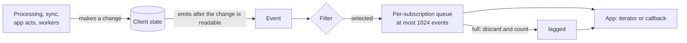

# Client events

A client event tells an app that the client made a change: a conversation joined, a message received, a consent record changed. The app uses the event as a signal to read the state it shows again. An event carries identifiers and a small set of values, not the changed objects.

Events are live. A subscription receives only the events emitted after it starts, and an event is gone once the SDK hands it to the app. Nothing is replayed and nothing is acknowledged. An app that must see every message uses durable message delivery (PROC section 7), not events.

Events report changes that the client makes for some other reason. A subscription causes no network activity: it does not open a stream, register a topic, or send a request. An app that subscribes to received messages and holds no message stream, runs no sync, and has no background worker running receives no `message.received` event.



## Scope

In scope: the event kinds and what each one carries, when the client emits an event, the order of events, which client instance's subscriptions receive it, the typed filter, the queue bound and the `lagged` event, callback delivery, and ending a subscription.

Out of scope: durable message delivery and acknowledgement (PROC section 7), catch-up snapshots and their change notifications (PROC-023), the changes themselves and their validation (the specs in the Related table), push notifications (`PUSH`), and how an SDK names its methods.

| Related | Relation |
| --- | --- |
| `PROC` | Owns durable delivery, delivery numbers (PROC-024), eligibility (PROC-025), deletion (PROC-037), and PROC-023 catch-up notifications. Events do not replace them. |
| `CONS` | Owns consent records and their changes. CONS-041 gives an app access to consent and uses `consent.changed` for stored-state changes, subject to EVENT-030 and EVENT-031. |
| `JOIN` | Owns the join from a Welcome (JOIN-045), replacing an ended group (JOIN-042), activating a restored group (JOIN-080), and the adder (JOIN-025). |
| `GMOD` | Owns commits, removal, and leave (GMOD-031 to GMOD-033). |
| `META` | Owns components and their names (section 2, META-040), disappearing messages (META-050, META-051, META-063), and the protocol version floor (section 7, META-062). |
| `PERM` | Owns the permission policy set and the admin lists. |
| `DMS` | Owns stitched DMs (DMS-007, DMS-009). |
| `SEND` | Owns message delivery status (SEND-003, SEND-009, SEND-013, SEND-016, SEND-018). |
| `CTYPE` | Owns content type ids (CTYPE-001), deletion eligibility (CTYPE-018), and the reply and reaction encodings. |
| `IDENT` | Owns installation keys (section 8), and installation addition and revocation (section 5, IDENT-044). |
| `FORK` | Owns the fork state (FORK-040). |
| `CONF` | Owns the blocked connection and the two conditions that set it (CONF-030, CONF-036). CONF-075 closes streams with network interest while EVENT-016 keeps event subscriptions open. |
| `AUTH` | Owns credential lockout (AUTH-023) and replacing the credential (AUTH-024). |
| `PUSH` | Owns the notification state (PUSH-262). |
| `SYNC` | Owns the HMAC root key (SYNC-015, SYNC-022) and SYNC-005, which hides sync groups from an app. |
| `ARCH` | Owns archive import (section 4, ARCH-021). |
| `ATCH` | Owns pending attachment status (ATCH-034), downloads (section 6), local deletion (ATCH-047), attachment keys (ATCH-041), and the failure causes (ATCH-060). |

## Terms

| Term | Meaning |
| --- | --- |
| Event | One report of one change, with a kind and a payload. |
| Kind | The name of the change an event reports: a row of the kind table in section 1, or `lagged` (section 4). |
| Emission | The client making an event available to its subscriptions. |
| Subscription | An app's request for events that match an `EventFilter`, from the moment the SDK registers it, which is before the call that creates it returns, until it ends. An iterator and a callback are two forms of one subscription. |
| Handoff | The SDK giving one event to the app: an iterator returns it, or a callback starts with it. |
| Queue | The events emitted for one subscription that are not yet handed off, wherever the SDK holds them, plus the event whose callback is running. |
| Running | A callback is running from the moment the SDK starts it until it returns and any value it returns has completed. |
| Fails | A callback fails when it throws, or when the value it returns completes with an error. |
| Names a group | An event names a group when its payload carries a `group_id`, or when it is a `consent.changed` event whose `entity_kind` is `conversation`. Filters use this term; ordering does not. |
| Own inbox | The inbox of the client that emits the event. |

## 1. Kinds and payloads

Each row of the kind table names one change, the unit that gets one event, and the payload member that carries it. An app selects a kind through the typed `EventKind` filter. A kind is never removed and never changes meaning.

One act can produce events of more than one kind. A commit that removes the own inbox produces `conversation.removed` and `conversation.membership_changed`. A commit that removes only this installation while the own inbox remains a member does not produce `conversation.membership_changed`. A deletion produces `message.received` for the deletion message and `message.deleted` for its target. Events from one transaction are emitted in the order of the kind table (EVENT-012).

| Kind | Emitted when | One event for each | Payload member |
| --- | --- | --- | --- |
| `conversation.joined` | The client stores a group or DM it did not hold, one it creates or one it joins from a Welcome under JOIN-045; replaces an ended group's state under JOIN-042; or activates a restored group under JOIN-080 | Group | `conversation_joined` |
| `conversation.removed` | The client applies a commit that removes this installation from a group | Group | `conversation_removed` |
| `conversation.membership_changed` | The client applies a commit that adds or removes a member inbox | Commit | `membership_changed` |
| `conversation.metadata_changed` | The client applies a commit that changes a component of META section 2, the admin or super admin list, or the permission policy set | Commit | `metadata_changed` |
| `conversation.paused` | A group becomes paused for a protocol version floor (META section 7, META-062) | Group | `conversation_paused` |
| `message.received` | The client assigns a delivery number under PROC-024 to an application message whose sender installation is not this installation and whose expiry under META-050, if it has one, is later than the time of emission | Message | `message_received` |
| `message.status_changed` | The status of a message this installation sent changes between `Unpublished`, `Published`, and `Failed` (`SEND`) | Message | `message_status_changed` |
| `message.deleted` | The client applies a deletion under PROC-037, or deletes a message locally at an app's request | Message | `message_deleted` |
| `message.expired` | The client deletes a message under META-063 | Message | `message_expired` |
| `consent.changed` | The stored state of a consent record changes | Record | `consent_changed` |
| `hmac_keys.updated` | The client stores a new HMAC root key under SYNC-015 or SYNC-022, or an open client observes an HMAC epoch increase under EVENT-026 | Stored key or observed epoch increase | `hmac_keys_updated` |
| `identity.registered` | The client reports this installation's registration complete under IDENT-072 | Registration | `identity_registered` |
| `identity.own_installation_added` | The client applies an identity update of the own inbox that adds an installation | Installation | `own_installation_added` |
| `identity.own_installation_revoked` | The client applies an identity update of the own inbox that revokes an installation, including one IDENT-044 revokes with an identifier | Installation | `own_installation_revoked` |
| `client.rejected_by_server` | The server rejects the client and blocks its connection: its backend does not match the stored one, or its version is below the server's minimum (CONF-075) | Rejection | `rejected_by_server` |
| `client.lockout_changed` | The client enters lockout under AUTH-023, or leaves it: when the first request after the cool-down proceeds, or under AUTH-024 | Entry or exit | `lockout_changed` |
| `conversation.fork_detected` | A conversation's fork state becomes `forked` under FORK-040 | Group | `conversation_fork_detected` |
| `notifications.failed` | The notification state becomes failed under PUSH-262 | Failure | `notifications_failed` |
| `archive.restored` | An archive import ends, with or without an error, after it stored at least one element (ARCH-021) | Import | `archive_restored` |
| `connection.state_changed` | The client-wide state of open app streams that hold network interest changes under EVENT-027 | Transition | `connection_state_changed` |
| `attachment.upload_started` | A pending attachment's status becomes `uploading` (ATCH-034) | Transition | `attachment_upload_started` |
| `attachment.upload_completed` | A pending attachment's status becomes `complete` (ATCH-025) | Transition | `attachment_upload_completed` |
| `attachment.upload_failed` | A pending attachment's status becomes `failed` (ATCH-025, ATCH-026, ATCH-036) | Transition | `attachment_upload_failed` |
| `attachment.download_started` | The client begins a download that neither ATCH-052 nor ATCH-058 ends | Download | `attachment_download_started` |
| `attachment.download_completed` | A download makes a plaintext file readable at its path under ATCH-051 | Download | `attachment_download_completed` |
| `attachment.download_failed` | A download that emitted `attachment.download_started` ends without a plaintext file | Download | `attachment_download_failed` |
| `attachment.deleted` | An app's request under ATCH-047 deletes at least one of the attachment key directory, the staged ciphertext, and the local attachment record | Request | `attachment_deleted` |

The payload of every event, including `lagged`, is the `ClientEvent` below. The client and SDK use the typed `EventKind` set in this section.

```webidl
dictionary ClientEvent {
  required EventKind kind;                        // exactly one member below is present: the one the kind table names
  ConversationJoined conversation_joined;
  ConversationRemoved conversation_removed;
  MembershipChanged membership_changed;
  MetadataChanged metadata_changed;
  ConversationPaused conversation_paused;
  MessageReceived message_received;
  MessageStatusChanged message_status_changed;
  MessageDeleted message_deleted;
  MessageRef message_expired;
  ConsentChanged consent_changed;
  HmacKeysUpdated hmac_keys_updated;
  IdentityRegistered identity_registered;
  InstallationRef own_installation_added;
  InstallationRevoked own_installation_revoked;
  ClientRejectedByServer rejected_by_server;
  LockoutChanged lockout_changed;
  GroupRef conversation_fork_detected;
  NotificationsFailed notifications_failed;
  ArchiveRestored archive_restored;
  ConnectionStateChanged connection_state_changed;
  AttachmentRef attachment_upload_started;
  AttachmentRef attachment_upload_completed;
  AttachmentFailed attachment_upload_failed;
  AttachmentRef attachment_download_started;
  AttachmentRef attachment_download_completed;
  AttachmentFailed attachment_download_failed;
  AttachmentRef attachment_deleted;
  Lagged lagged;
};

enum EventKind {
  "conversation.joined", "conversation.removed", "conversation.membership_changed",
  "conversation.metadata_changed", "conversation.paused", "message.received",
  "message.status_changed", "message.deleted", "message.expired", "consent.changed",
  "hmac_keys.updated", "identity.registered", "identity.own_installation_added",
  "identity.own_installation_revoked", "client.rejected_by_server", "client.lockout_changed",
  "conversation.fork_detected", "notifications.failed", "archive.restored",
  "connection.state_changed", "attachment.upload_started", "attachment.upload_completed",
  "attachment.upload_failed", "attachment.download_started", "attachment.download_completed",
  "attachment.download_failed", "attachment.deleted", "lagged"
};
enum ConversationType { "group", "dm" };
enum JoinOrigin { "created", "welcomed" };
enum RemovalCause { "removed", "left" };
enum DeletionCause { "deleted", "deleted_locally" };
enum MessageStatus { "unpublished", "published", "failed" };
enum ConsentEntityKind { "conversation", "inbox" };
enum ConsentState { "unknown", "allowed", "denied" };
enum RejectionCause { "backend_mismatch", "version_too_old" };
enum LockoutChange { "entered", "left" };
enum ConnectionState { "connecting", "connected", "reconnecting", "failed", "closed" };

dictionary GroupRef { required sequence<octet> group_id; };
dictionary MessageRef { required sequence<octet> group_id; required sequence<octet> message_id; };
dictionary ConversationJoined {
  required sequence<octet> group_id;
  required ConversationType conversation_type;
  required JoinOrigin origin;
  DOMString adder_inbox_id;                       // EVENT-023
};
dictionary ConversationRemoved {
  required sequence<octet> group_id;
  required RemovalCause cause;                    // EVENT-006
};
dictionary MembershipChanged {
  required sequence<octet> group_id;
  required sequence<DOMString> added_inbox_ids;
  required sequence<DOMString> removed_inbox_ids;
};
dictionary MetadataChanged {
  required sequence<octet> group_id;
  required sequence<DOMString> changed;           // EVENT-019
};
dictionary ConversationPaused { required sequence<octet> group_id; required DOMString floor; };
dictionary MessageReceived {
  required sequence<octet> group_id;              // EVENT-018
  required sequence<octet> message_id;
  ContentTypeId content_type;                     // EVENT-024
  required DOMString sender_inbox_id;
};
dictionary ContentTypeId {                        // the three values CTYPE-001 matches on
  required DOMString authority_id;
  required DOMString type_id;
  required unsigned long version_major;
};
dictionary MessageStatusChanged {
  required sequence<octet> group_id;
  required sequence<octet> message_id;
  required MessageStatus previous;
  required MessageStatus current;
};
dictionary MessageDeleted {
  required sequence<octet> group_id;
  required sequence<octet> message_id;
  required DeletionCause cause;                   // EVENT-007
};
dictionary ConsentChanged {
  required ConsentEntityKind entity_kind;
  required DOMString entity;                      // EVENT-009
  required ConsentState state;
};
dictionary HmacKeysUpdated {};
dictionary IdentityRegistered {
  required DOMString inbox_id;
  required sequence<octet> installation_key;      // 32 bytes (IDENT section 8)
};
dictionary InstallationRef { required sequence<octet> installation_key; };   // 32 bytes (IDENT section 8)
dictionary InstallationRevoked {
  required sequence<octet> installation_key;      // 32 bytes
  required boolean is_this_installation;
};
dictionary ClientRejectedByServer {
  required RejectionCause cause;
  DOMString min_libxmtp_version;                  // EVENT-008
};
dictionary LockoutChanged { required LockoutChange change; };
dictionary NotificationsFailed { required DOMString cause; };                 // the failure cause PUSH-262 records
dictionary ArchiveRestored { required boolean complete; };                    // EVENT-017
dictionary ConnectionStateChanged {
  required ConnectionState previous;
  required ConnectionState current;
};
dictionary AttachmentRef {
  required DOMString attachment_key;              // ATCH-041
  required DOMString url;                         // the remote attachment's url
  required DOMString content_digest;              // lowercase hexadecimal (ATCH terms)
};
dictionary AttachmentFailed {
  required DOMString attachment_key;
  required DOMString url;
  required DOMString content_digest;
  required DOMString cause;                       // an AttachmentFailureCause value (ATCH-060)
};
dictionary Lagged { required unsigned long long discarded; };

```

The member source table, which EVENT-024 makes binding. Members that other rows of this section state are not repeated here.

| Member | Value |
| --- | --- |
| `group_id` | The id of the group the change is about |
| `message_id` | The id of the message the change is about |
| `conversation_type` | The group's `CONVERSATION_TYPE` (`META`): `dm` for a DM, `group` otherwise |
| `added_inbox_ids`, `removed_inbox_ids` | The inboxes the commit added to and removed from the group's membership |
| `floor` | The protocol version floor the group is paused for (META section 7) |
| `content_type` | The stored message's content type id under CTYPE-001; absent when the message has no typed content type, as for a message CTYPE-008 retains undecoded |
| `sender_inbox_id` | The inbox of the message's authenticated MLS sender |
| `previous`, `current` in `MessageStatusChanged` | The message's status before and after the change |
| `inbox_id` in `IdentityRegistered` | The own inbox's id |
| `installation_key` | The installation key of the installation registered, added, or revoked (IDENT section 8) |
| `is_this_installation` | Whether `installation_key` equals this installation's key |
| `cause` in `NotificationsFailed` | The failure cause PUSH-262 records |
| `change` in `LockoutChanged` | `entered` or `left`, per the kind table's trigger |
| `discarded` in `Lagged` | The count EVENT-031 names |
| `attachment_key`, `url`, `content_digest` in `AttachmentRef` and `AttachmentFailed` | The attachment key under ATCH-041, the `url`, and the `content_digest` of the remote attachment the transition, download, or deletion is about |
| `cause` in `AttachmentFailed` | The `AttachmentFailureCause` the SDK reports for the failure under ATCH-060 |

| ID | Title | Requirement | Why |
| --- | --- | --- | --- |
| EVENT-001 | One event per change | When a change occurs that a row of the kind table in section 1 names, the client MUST emit exactly one event of that kind for each unit the row names, with that row's member of the `ClientEvent` block, including after a transaction that was interrupted before it committed and was retried, except under EVENT-003 and EVENT-004 or when the process ends after the change commits but before emission. It MUST NOT emit an event of a kind in the table for any other change. | A missing event leaves the app showing stale state; a duplicate `message.received` is a duplicate notification to the user. |
| EVENT-002 | Kinds survive upgrades | When a client version emits a kind, every later client version MUST emit that kind for the same trigger, with every payload member that version carried and with the same meaning. | An app that handles a typed kind reads the wrong state, or none, after the client changes under it. |
| EVENT-003 | Sync groups emit nothing | The client MUST NOT emit an event that names a group SYNC-005 hides from the app. | |
| EVENT-004 | Import stores emit nothing | While an archive import runs, the client MUST NOT emit `conversation.joined`, `message.received`, or `consent.changed` for what the import stores. | An import of thousands of messages would fill every queue and end in `lagged`; `archive.restored` reports it once. |
| EVENT-005 | Join origin | The client MUST set `origin` to `created` when this installation created the group, and to `welcomed` otherwise. | |
| EVENT-006 | Removal cause | The client MUST set `RemovalCause` to `left` exactly when the own inbox had a published leave request under GMOD-031. | An app that branches on the cause takes the wrong branch. |
| EVENT-007 | Deletion cause | The client MUST set `DeletionCause` to `deleted_locally` exactly for a local deletion at an app's request. | |
| EVENT-008 | Minimum version on rejection | The client MUST set `min_libxmtp_version` exactly when `RejectionCause` is `version_too_old`, to the minimum under CONF-036. | |
| EVENT-009 | Consent values | The client MUST set `entity_kind` and `entity` to the record's entity as CONS-002 encodes it, and `state` to the record's new stored state. | |
| EVENT-017 | Import completion | The client MUST set `complete` to false exactly when the import ended with an error. | |
| EVENT-018 | Received message group | The client MUST set a `message.received` event's `group_id` to the group the message is stored in, including for a stitched DM. | A DM screen misattributes a message. |
| EVENT-019 | Changed metadata names | The client MUST set a `conversation.metadata_changed` event's `changed` to one entry per changed item: its `field_name` under META-040 where it has one; otherwise its component name in META section 2; otherwise `component:` followed by its component id as four lowercase hexadecimal digits, as for an application component. | An app re-reads the wrong fields, or cannot name an application component. |
| EVENT-023 | Join adder | The client MUST set `adder_inbox_id` exactly when `origin` is `welcomed`, to the adder under JOIN-025. | An app that shows "you were added by" names the wrong inbox, or none. |
| EVENT-024 | Other payload members | The client MUST set each payload member in the member source table to the value that table names for it. | An app that reads a member it cannot trust re-reads everything, or acts on the wrong value. |
| EVENT-026 | Observed HMAC epoch increase | When the current HMAC epoch under PUSH-258 is greater than the epoch the client recorded at startup or when it last emitted `hmac_keys.updated` for an epoch increase, an open client MUST emit exactly one `hmac_keys.updated` event for the current epoch without an app call or network request. It MUST NOT emit an epoch-change event for the startup epoch or for epochs reached while it was closed. | An app that caches the current conversation HMAC keys keeps the old keys after an epoch transition. |
| EVENT-027 | Client connection state | The client MUST compute one connection state over its open app streams that hold network interest, using PROC section 6's states: `failed` if any is `failed`; else `reconnecting` if any is `reconnecting`; else `connecting` if any is `connecting`; else `connected`; and `closed` when none is open. When that state changes, the client MUST emit exactly one `connection.state_changed` event with the previous and current state. It MUST NOT emit when the state does not change. | An app cannot show that it is offline or that it recovered without a signal. |

## 2. Emission and order

An event for a change to stored state is emitted after the change is stored, so an app that reads again on an event sees the change. A change that is not stored, because a transaction failed or was retried, has no event.

Order is kept where an app depends on it: within one group, within one consent entity, and within one attachment key. Events for two groups, including two groups of one stitched DM, and a group's events relative to its consent events, can be emitted in either order, because the client changes them independently.

Emission does not depend on why the change happened: a message stream, a sync call, a push-driven fetch, a background worker, or an app act all produce the same events.

An event subscription carries no network interest, so a server rejection does not close it, and `client.rejected_by_server` reaches the app (EVENT-016, CONF-075).

| ID | Title | Requirement | Why |
| --- | --- | --- | --- |
| EVENT-010 | The change is readable first | When a change to stored state has an event, the client MUST emit the event only after the change is readable through the SDK, and MUST NOT emit it if the change is not stored. | An app that reads again on an event and finds the old state keeps it until the next event. |
| EVENT-012 | Emission order | The client MUST emit the events whose payloads carry the same `group_id`, and the `consent.changed` events for the same entity, in the order it made the changes they report, and the events of one transaction in the order of the kind table. | Two metadata changes that arrive reversed leave the app showing the older value. |
| EVENT-013 | No network interest | When an app starts, holds, or ends a subscription, the client MUST NOT send a request to the backend, open or change a subscription stream, or register a topic because of it. | An app that adds a listener would open streams, use battery, and change which messages the client fetches. |
| EVENT-014 | Live only | An SDK MUST register a subscription before the call that creates it returns, and MUST NOT hand off to it an event the client emitted before it was registered. | An app that also reads current state on start would handle every earlier change twice. |
| EVENT-015 | Handoff order | An SDK MUST hand off each subscription's events in the order the client emitted them. | |
| EVENT-016 | Rejection keeps subscriptions | While the server has rejected the client under CONF-075 and the app has not closed it, an SDK MUST keep every event subscription of that client open unless the app ends it. | A subscription closed by the rejection cannot hand off the `client.rejected_by_server` event that explains it. |
| EVENT-055 | Attachment event order | The client MUST emit the `attachment.*` events whose payloads carry the same `attachment_key` in the order it made the changes they report. | An app that receives `attachment.upload_completed` before `attachment.upload_started` shows a finished upload as running. |
| EVENT-025 | One client's events | An SDK MUST hand off to a subscription only the events emitted by the client instance on which the app created it, including when two client instances in one process share a database or a credential. | An app with two accounts open shows one account's messages and consent changes under the other. |

## 3. Filters

A filter names the kinds a subscription wants and can narrow them to some conversations or some messages. The SDK applies the filter before an event enters the queue, so a subscription's queue holds only the events it selected. An event that names no group is not narrowed by `group_ids`.

```webidl
dictionary EventFilter {
  required sequence<EventKind> kinds;             // an empty sequence selects no kind
  sequence<sequence<octet>> group_ids;            // absent selects every group
  sequence<ContentTypeId> content_types;          // message.received only; absent selects every content type
  boolean references_own_messages;                // message.received only; absent means false
};
```

A stitched DM is one conversation to an app (DMS-007, DMS-009), so a filter that names any group of the DM selects the events of every group of it.

| ID | Title | Requirement | Why |
| --- | --- | --- | --- |
| EVENT-020 | Filter before queueing | An SDK MUST place an event in a subscription's queue, subject to EVENT-030, if and only if its kind is in the `kinds` of the subscription's `EventFilter`; when `group_ids` is present and the event names a group, that group or another group of the same stitched DM under DMS-009 is in `group_ids`; and, for `message.received` when `content_types` is present, its content type is present and matches an entry of `content_types` under CTYPE-001; and it passes EVENT-021. | Events a subscription did not select would fill its queue and discard events it did select; a DM screen would miss messages stored in the DM's other groups. |
| EVENT-021 | References to own messages | Where `references_own_messages` is true, an SDK MUST pass a `message.received` event only when the message is an `xmtp.org/reply:1.0` whose `reference` parameter, or an `xmtp.org/reaction:2.0` whose `ReactionV2.reference`, names a message that the client holds at emission and whose sender inbox is the own inbox. | |
| EVENT-022 | Lagged is always selected | An SDK MUST hand off a `lagged` event to its subscription whether or not the `kinds` of its `EventFilter` names `lagged`. | A subscription that did not select `lagged` loses events without any signal. |

## 4. The queue and lagged

A subscription whose app is slow cannot hold events for ever. Each queue holds at most 1024 events. When the queue is full, the SDK discards new events for that subscription and counts them. Before it hands off any later event, it hands off one `lagged` event with the count, which tells the app that the events it received for that subscription are incomplete.

The bound counts every event in the queue as the Terms define it: every event emitted for the subscription and not yet handed off, in every place the SDK holds it, and the event whose callback is running. A pending `lagged` event is not counted.

| ID | Title | Requirement | Why |
| --- | --- | --- | --- |
| EVENT-030 | The queue bound | While a subscription's queue holds 1024 events other than a pending `lagged` event, an SDK MUST discard each new event for that subscription and count it, and MUST NOT hold more than 1024 such events for the subscription in any place. | An app that stops reading must not make the client use memory without limit. |
| EVENT-031 | Lagged before later events | When an SDK has discarded events for a subscription, it MUST hand off one `lagged` event whose `discarded` is the number discarded since the previous `lagged` handoff, before it hands off any event emitted after the first of those discards. | An app that does not know it missed events keeps state that is wrong. |
| EVENT-033 | Subscriptions do not wait | An SDK MUST NOT delay a handoff to one subscription because another subscription's queue is full or one of its callbacks is running. | One slow subscription would stall every other subscription of the client. |

## 5. Callbacks and ending a subscription

A subscription is read with an iterator or with a callback. With a callback, the SDK calls the app's code for each event. The rules below keep callbacks in order, keep one callback's failure from affecting other work, and let an app end a subscription or close the client from inside a callback.

Apps can keep several subscriptions for different kinds or conversations. They should end listeners they no longer use. An SDK may warn about duplicate listeners whose filters overlap.

| ID | Title | Requirement | Why |
| --- | --- | --- | --- |
| EVENT-050 | One callback at a time | An SDK MUST NOT start a subscription's callback while an earlier callback of that subscription is running. | Two callbacks that run at the same time can finish in the wrong order and apply an older state last. |
| EVENT-051 | A failed callback is contained | When an app's callback fails, an SDK MUST continue to hand off that subscription's later events, and MUST NOT end the subscription, any other subscription, the app's process, or any operation of the client because of the failure. | One bad event would stop all later events, or end the client. |
| EVENT-052 | Calls from a callback complete | While a callback runs, an app MAY call any operation of the same client, including ending a subscription and closing the client, and the SDK MUST complete that operation without waiting for the callback to return. | An app that reads again, or closes, inside the callback would wait for ever. |
| EVENT-053 | Ending stops handoffs | After an app ends a subscription, an SDK MUST NOT hand off another event for it, and MUST complete a pending iterator read of it as ended. | A callback that runs after its screen is gone acts on state the app has released. |
| EVENT-054 | Closing ends subscriptions | When an app closes the client, an SDK MUST end every subscription of that client before the close returns. | A subscription that survives its client hands off events the app can no longer act on. |

## Known limitations

Events are not durable. No subscription receives an event for a change made while it did not exist, and a discarded event is reported only as a count. A process that ends after a change commits and before its event is emitted loses that event; EVENT-001 covers retries of a transaction that did not commit. An app that needs every message uses PROC section 7.

Most payloads name what changed, not the new value. When the app reads again, the state can already include later changes.

A client instance emits events only for changes it makes itself. Another process, or another client instance in the same process, that shares the database makes changes this instance emits no event for.

`message.expired` is emitted when the cleanup pass deletes the message under META-063, which can be later than the expiry itself. META-051 hides the message from the expiry on, whether or not the event has been emitted.

Filters do not read consent. A conversation whose consent is denied still produces events; an app that hides denied conversations applies CONS-030 to events itself.

In a stitched DM, a reply or reaction in one group can arrive before the message it names in another group. It then does not pass `references_own_messages`, and no later event reports it.

Internal receivers, such as device sync and barriers, do not count toward the client connection state. That state can be `closed` while background work uses the network.
