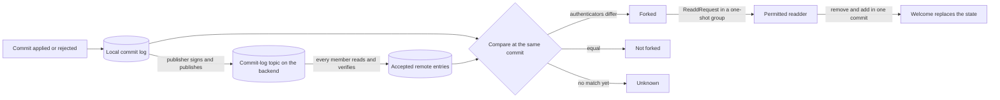

# Fork recovery and the commit log

Members of one group can hold different MLS states for the same epoch: one applied a commit that another rejected, or two clients merged the same commit onto different trees. A member in that condition is forked. It can no longer decrypt what the others send, and nothing in MLS tells it so. The commit log is the record that does. Publishers append to a per-group log on the backend a signed entry for every commit they apply or reject, with the epoch authenticator that resulted. Every member compares its own record against that log. A member whose authenticator differs from the log's at the same commit is forked, and asks the group's permitted readders to remove and re-add it.

The repair is a remove-and-add commit and the Welcome it produces. It restores a member that can still process the removal commit, which is the case when the member's log diverged before its epoch secrets did, or when the readder's commit is the first the member cannot apply. A member whose epoch secrets have already diverged cannot decrypt the removal, stays active in its own view, and refuses the Welcome under JOIN-042. This spec does not promise to repair that member; the Known limitations say why.

The log is sound only while its entries are complete, ordered, and signed under one key per group. The rules here are what make that hold.



## Scope

In scope: the entries a client records for each commit outcome; the per-group signing key and the consensus key; who publishes entries and in what order; how a client verifies and accepts remote entries; the fork state and how it is computed; readd requests, the one-shot groups that carry them, and who may act on them; the readd commit; the recovery policy an app sets; and what an app can read.

Out of scope: commit validation, the membership component, and the protocol-version hold (GMOD-021, GMOD-005, GMOD-025), ordered topic processing and terminal rejection (PROC-005, PROC-011), the publish and query contract, sequence ids, and the admission of a commit-log entry (`API`), the topic layout (`TOPIC`), retention (`OPS`), the super admin role and proposal authorization (`PERM`), consent (`CONS`), the metadata components this spec uses (`META`), when a Welcome replaces existing group state (JOIN section 7), and the deployment switch that turns the log on (CONF-045).

| Related | Relation |
| --- | --- |
| `CONF` | Owns `commit_log_enabled` and CONF-045, the switch that turns publishing and reading off for a deployment. |
| `JOIN` | Owns whether a Welcome replaces state the client already holds (JOIN-041 to JOIN-044), the adder read from the ratchet tree (JOIN-025), and key-package validation (JOIN-007, JOIN-008). A readd is repaired by that path. |
| `API` | Owns `ClientEnvelope` and its `commit_log_entry` payload, sequence ids (API-286 through API-289), the prefix a read returns (API-201), and the admission of a commit-log entry (API-230). |
| `TOPIC` | Owns the commit-log kind byte and its 16-byte group identifier (TOPIC-001, TOPIC-002). |
| `OPS` | Owns retention. API-212 assigns commit-log expiry; OPS-001 prevents deletion of an exempt envelope. |
| PERM-001, GMOD-015 | Own the super admin role and the same-installation readd exception used by FORK-062. |
| [CONS section 1](CONS-consent.md#1-states-and-entities) | Defines the conversation consent state tested by FORK-020, FORK-030, and FORK-053. |
| [META section 2](META-group-metadata.md#2-well-known-components) | Owns the `COMMIT_LOG_SIGNER`, `ONESHOT_MESSAGE`, and minimum protocol version components. This spec states their use. |
| GMOD-021, GMOD-025 | Own commit validation and the hold below a group's minimum protocol version. |
| PROC-011, PROC-012 | Own terminal rejection, which FORK-002 records, and unresolved work, which it does not. |
| `EVENT` | EVENT-001 reports when a conversation's fork state becomes forked. |

## Terms

| Term | Meaning |
| --- | --- |
| Epoch authenticator | The `epoch_authenticator` of a group's key schedule ([RFC 9420 §8](https://www.rfc-editor.org/rfc/rfc9420.html#section-8)). It identifies the encryption state after a commit and is not secret. |
| Commit sequence id | The sequence id of a commit's envelope on the group's message topic. |
| Local entry | One `LocalCommitLogEntry` (section 1) that a client records for a commit outcome. |
| Removal entry | A local entry for a commit that removed the recording installation. It carries the pre-commit epoch as its applied epoch. |
| Membership | The span from one installation of a group's state, by creation, a Welcome, or an archive restore, to the next. Local entries from an earlier membership are not compared. |
| Entry | A `PlaintextCommitLogEntry` (section 2), the plaintext a publisher signs. |
| Commit-log topic | The topic of a group's entries on the backend (TOPIC-001). |
| Signing key | The Ed25519 private key entries for a group are signed under. |
| Consensus key | The public key every member verifies a group's entries under, fixed by FORK-012. |
| Publisher | An installation that publishes entries for a conversation: a member of a DM, or a super admin of a group. |
| Accepted entry | An entry a client read from the commit-log topic and kept under FORK-031 and FORK-032. |
| Fork state | One of `forked`, `not forked`, or `unknown`, held for each conversation and set under section 5. |
| Readd request | A `ReaddRequest` (section 6): a forked installation's request to be removed and added back. |
| One-shot group | A group whose conversation type is one-shot: it carries one `OneshotMessage` in its immutable metadata and never carries an application message. |
| Permitted readder | An inbox a readd request is addressed to and that may act on it, per the table in section 6. |
| Readd commit | The commit under FORK-062 that removes an installation and adds it back. |
| Recovery policy | The app-supplied choice of which conversations a client sends readd requests for. |

## 1. The local commit log

Every commit a client merges or rejects with a terminal outcome leaves one local entry. The entry records the commit's sequence id, the epoch authenticator before it, the result, and the epoch and authenticator after it. A commit that removes the recording installation is a removal entry: the member merges only the public part of that commit and cannot derive the new epoch's secrets, so the entry keeps the pre-commit epoch. A removal entry is neither published nor compared.

A failure is recorded only when it is terminal. PROC-011 and PROC-012 distinguish terminal rejection from unresolved work; a held commit has no outcome yet, and recording one would publish a rejection the group never made.

CONF-045 forbids publishing and reading while a deployment's `commit_log_enabled` is `false`. This spec adds that such a client records no local entries and reports every fork state as `unknown` (FORK-004), so that a log that was never kept is not read as evidence.

```webidl
dictionary LocalCommitLogEntry {
  required sequence<octet> group_id;                    // 16 bytes
  required unsigned long long commit_sequence_id;
  required sequence<octet> last_epoch_authenticator;
  required CommitResult commit_result;                  // the wire enum of section 2
  required unsigned long long applied_epoch_number;     // unchanged when the commit was not applied
  required sequence<octet> applied_epoch_authenticator; // unchanged when the commit was not applied
  required boolean removed_this_installation;           // true for a removal entry
};
```

The result a terminal failure records is the first row below whose condition holds.

| Failure | `commit_result` |
| --- | --- |
| The commit's `epoch` is not the group's current epoch | `COMMIT_RESULT_WRONG_EPOCH` |
| The commit's payload cannot be decrypted or fails MLS processing for another reason | `COMMIT_RESULT_UNDECRYPTABLE` |
| The commit decrypts and fails validation under GMOD-021 | `COMMIT_RESULT_INVALID` |

| ID | Title | Requirement | Why |
| --- | --- | --- | --- |
| FORK-001 | Record every applied commit | While `commit_log_enabled` is `true`, when the client merges a commit into a group's MLS state and its installation is a member after the merge, the client MUST record a local entry whose `commit_sequence_id` is the commit sequence id, whose `last_epoch_authenticator` is the group's epoch authenticator before the merge, whose `commit_result` is `COMMIT_RESULT_APPLIED`, and whose `applied_epoch_number` and `applied_epoch_authenticator` are the group's epoch and epoch authenticator after it. | A commit without an entry can never be compared, so a fork at that commit is read as `unknown` for ever, and a publisher that skips it ends the log for every member under FORK-032. |
| FORK-002 | Record only a terminal failure | While `commit_log_enabled` is `true`, when the client records a terminal rejection for a commit under PROC-011, it MUST record a local entry with the `commit_result` the table above gives and with `applied_epoch_number` and `applied_epoch_authenticator` equal to the group's current values, and MUST NOT record an entry for a commit it holds for a later attempt. | A held failure recorded as terminal publishes a rejection the group never made, and every member that applied the commit then reads itself as forked. |
| FORK-004 | No log, no evidence | While `commit_log_enabled` is `false`, the client MUST report every conversation's fork state as `unknown`. | A `not forked` read from an empty log tells an app a broken conversation is healthy. |

## 2. Keys and signatures

Entries are signed but not encrypted. One Ed25519 key signs every entry of a group for the group's life. The creator generates it, for a group and for a DM alike, and places the private key in the group's `COMMIT_LOG_SIGNER` component, which travels inside the group's encrypted state, so that every member with permission to read it can sign and nobody outside the group can. PERM-010 and PERM-011 govern write authorization; META-010 owns its encoding.

The consensus key is the public key of the first entry on the topic whose signature verifies under its own `public_key`. It is chosen by backend order and never changes. That order is what the trust rests on, and it is thin: anyone who can reach the backend and knows a group id can publish a self-signed entry to its commit-log topic, and if that entry arrives before the creator's first entry, every member fixes the impostor's key and discards every entry the real publishers produce for the group's life. The key in `COMMIT_LOG_SIGNER` is not consulted when the consensus key is chosen. The Known limitations record this and it is open with the owner.

A publisher that holds no private key matching the consensus key has nothing useful to publish; its entries would be discarded under FORK-031. A publisher that holds the matching key and finds the component absent or holding a different key writes its own there, so that later super admins can publish. A DM's component cannot be rewritten after creation, so a DM whose consensus key is not the one in its component has one publisher.

`API` owns `xmtp.backend.v1.CommitLogEntry` as a payload of `ClientEnvelope`; it is shown here because FORK-011 states what its fields carry. `serialized_commit_log_entry` is the protobuf encoding of a `PlaintextCommitLogEntry`; the signature covers exactly those bytes. `xmtp.mls.message_contents.CommitLogEntry`, an older message with a `sequence_id` field, is not used on this backend.

```proto
// xmtp.backend.v1
// One entry of a group's commit log. The server decodes the group_id from the
// entry to derive the topic. The signature is stored and returned, not
// verified: it is made with a per-group key the server does not have. The
// log position is `EnvelopeMeta.cursor`; the entry carries no sequence id.
message CommitLogEntry {
  // Serialized PlaintextCommitLogEntry.
  bytes serialized_commit_log_entry = 1;
  xmtp.identity.associations.RecoverableEd25519Signature signature = 2;
}
```

```proto
// xmtp.mls.message_contents
enum CommitResult {
  COMMIT_RESULT_UNSPECIFIED = 0;
  COMMIT_RESULT_APPLIED = 1;
  COMMIT_RESULT_WRONG_EPOCH = 2;
  COMMIT_RESULT_UNDECRYPTABLE = 3;
  COMMIT_RESULT_INVALID = 4;
}

// PlaintextCommitLogEntry indicates whether a commit was successful or not,
// when applied on top of the indicated `last_epoch_authenticator`.
message PlaintextCommitLogEntry {
  // The group_id of the group that the commit belongs to.
  bytes group_id = 1;
  // The sequence ID of the commit payload being validated.
  uint64 commit_sequence_id = 2;
  // The encryption state before the commit was applied.
  bytes last_epoch_authenticator = 3;
  // Indicates whether the commit was successful, or why it failed.
  CommitResult commit_result = 4;
  // The epoch number after the commit was applied, if successful.
  uint64 applied_epoch_number = 5;
  // The encryption state after the commit was applied, if successful.
  bytes applied_epoch_authenticator = 6;
}
```

```proto
// xmtp.identity.associations
message RecoverableEd25519Signature {
  // 64 bytes [R(32 bytes) || S(32 bytes)]
  bytes bytes = 1;
  // 32 bytes
  bytes public_key = 2;
}
```

| ID | Title | Requirement | Why |
| --- | --- | --- | --- |
| FORK-010 | Creator generates the signing key | When a client creates a group or a DM while `commit_log_enabled` is `true`, it MUST generate a 32-byte Ed25519 private key from a cryptographically secure random source for that conversation alone and MUST place it in the conversation's `COMMIT_LOG_SIGNER` component. When a client holds the private key matching a group's consensus key and the group's `COMMIT_LOG_SIGNER` component is absent or holds a different key, it MUST write that private key to the component. | The component is what lets a later super admin publish entries other members accept. Without it the group has one publisher for its life. |
| FORK-011 | Sign the entry bytes | When the client publishes an entry, it MUST set `serialized_commit_log_entry` to the protobuf encoding of the `PlaintextCommitLogEntry`, `signature.bytes` to the Ed25519 signature ([RFC 8032 §5.1.6](https://www.rfc-editor.org/rfc/rfc8032#section-5.1.6)) of exactly those bytes under the conversation's signing key, and `signature.public_key` to that key's 32-byte public key. | |
| FORK-012 | The consensus key is fixed | The client MUST take as a conversation's consensus key the `signature.public_key` of the envelope with the lowest sequence id on its commit-log topic whose `signature.bytes` verifies over `serialized_commit_log_entry` under that same key, and MUST NOT replace it afterwards. | Two members that pick different keys accept different logs, and a key that can move lets whoever publishes later choose the log every member trusts. |

## 3. Publishing entries

A publisher appends its local entries to the conversation's commit-log topic in the order it recorded them. A reader accepts an entry only when it continues the previous accepted entry (FORK-032), so a gap is not a missing data point: it ends the log for every member. A publish that fails, or whose response does not confirm an entry, is retried from that entry before anything later is sent. Removal entries are never published: a removal entry does not attest the epoch the remaining members moved to.

The backend routes an entry by the `group_id` inside it (TOPIC-001), refuses one whose `group_id` is not 16 bytes (TOPIC-002) or whose bytes do not decode (API-230), assigns it a sequence id (API-286 through API-289), and stores the signature without verifying it. A read returns a prefix of the topic in sequence id order (API-201), and a commit-log entry never expires (OPS-001), so the order every member reads is the order every member reads.

| ID | Title | Requirement | Why |
| --- | --- | --- | --- |
| FORK-020 | Who publishes what | While `commit_log_enabled` is `true` and a conversation's consent state is allowed, the client MUST publish an entry for every local entry other than a removal entry of a DM it is a member of and of a group whose super admin list names its inbox, with `group_id`, `commit_sequence_id`, `last_epoch_authenticator`, `commit_result`, `applied_epoch_number`, and `applied_epoch_authenticator` equal to the local entry's values of the same name. | A super admin that does not publish leaves members with no log to compare against. A published removal entry contradicts the entry the remaining members publish for the same commit. |
| FORK-021 | No gaps, in order | The client MUST publish a conversation's entries in ascending `commit_sequence_id` order, and when a publish request fails or its response does not carry a sequence id greater than 0 for an entry, it MUST publish that entry again before it publishes any later entry of that conversation. | An entry published ahead of one the backend never stored is discarded by every reader under FORK-032, and the missing one can never be inserted behind it. |

## 4. Reading the remote log

Every member reads the commit-log topic of each DM and group it holds and verifies each entry before it counts. Verification has two parts. The signature and the identity of the entry tie it to the conversation's consensus key and topic. The chain rules tie it to the previous accepted entry: sequence ids increase, an applied commit starts from the authenticator the last one produced and advances the epoch by one, and a rejected commit leaves both unchanged. An entry that fails either part is discarded and never counts, however often it is read.

An entry under any key but the consensus key is discarded whoever published it. That stops a publisher that never held the key. It does not stop one that did: a super admin removed from the group keeps the signing key and can publish entries that continue the chain and that every member accepts. The Known limitations say what that costs.

The chain conditions a reader applies once it holds an accepted entry for the conversation:

| `commit_result` of the entry | Condition on the last accepted entry |
| --- | --- |
| Any | `commit_sequence_id` is greater than the last accepted entry's `commit_sequence_id` |
| `COMMIT_RESULT_APPLIED` | `last_epoch_authenticator` equals the last accepted entry's `applied_epoch_authenticator`, when that is non-empty, and `applied_epoch_number` equals the last accepted entry's `applied_epoch_number` plus 1 |
| Not `COMMIT_RESULT_APPLIED` | `applied_epoch_number` and `applied_epoch_authenticator` equal the last accepted entry's |

| ID | Title | Requirement | Why |
| --- | --- | --- | --- |
| FORK-030 | Read every conversation's log | While `commit_log_enabled` is `true`, the client MUST read every envelope on the commit-log topic of every DM and group it holds whose consent state is allowed, other than one-shot and sync groups, and MUST evaluate each under FORK-031 and FORK-032 exactly once, in sequence id order. | A member that does not read cannot learn it is forked, and keeps sending messages nobody can decrypt. An entry evaluated twice is a duplicate under the chain rules. |
| FORK-031 | Verify signature and identity | When the client reads an entry, it MUST discard it unless `signature.public_key` equals the conversation's consensus key, `signature.bytes` verifies over `serialized_commit_log_entry` under that key, the decoded `group_id` equals the topic's group id, and `commit_sequence_id` is greater than 0. | Anyone can publish to a commit-log topic. The signature is the only thing that separates a publisher from an impostor. |
| FORK-032 | Accept only a continuous chain | When an entry passes FORK-031 and the client holds an accepted entry for the conversation, the client MUST discard the entry unless every condition in the table above holds for it. | An entry that does not continue the chain is a duplicate, a publisher's stale view, or a forgery under a leaked key, and any of them accepted moves the consensus. |

## 5. Fork detection

A client's fork state for a conversation is decided at the newest commit both its own log and the accepted remote log hold. Equal authenticators there mean the client is on the group's state; different ones mean it is not, whatever newer entries say. Newer local entries with no remote counterpart yet leave the answer open when the newest shared commit agrees: the publisher may not have published them, or the client may have applied a commit the group rejected. Only entries from the current membership count, and removal entries never do.

`forked` is sticky. Once a member is on a different state, later entries cannot be compared meaningfully, and only a Welcome that replaces the state (JOIN-042) gives it a log worth comparing again. The reset is what an app and a readder observe: a repaired member reports `unknown` until its new membership has been checked, not `forked` for ever and not `not forked` on trust.

The table below is exhaustive and its rows are exclusive. The shared commit is the local entry, other than a removal entry, recorded in the current membership with the highest `commit_sequence_id` for which an accepted remote entry has the same `commit_sequence_id`.

| Fork state | Condition |
| --- | --- |
| `forked` | A shared commit exists and the local `applied_epoch_authenticator` differs from the accepted remote entry's. |
| `not forked` | A shared commit exists, the authenticators are equal, and no local entry of the current membership has a higher `commit_sequence_id`. |
| `unknown` | No shared commit exists, or the authenticators are equal and a local entry of the current membership has a higher `commit_sequence_id`. |

| ID | Title | Requirement | Why |
| --- | --- | --- | --- |
| FORK-040 | The comparison | While `commit_log_enabled` is `true` and a conversation's fork state is not `forked`, the client MUST hold the fork state the table above gives for its local entries and accepted remote entries. | A state computed at an older commit than the newest shared one reports `not forked` for a member that diverged since. |
| FORK-041 | Forked is sticky until replaced | While a conversation's fork state is `forked`, the client MUST NOT set it to another value, except that when it replaces the conversation's state from a Welcome under JOIN-042 it MUST set the fork state to `unknown`. | A state that clears itself when later entries happen to agree hides the fork the readders were asked to repair. One that survives the repair makes the repaired member ask again. |

### 5.1 Epoch mismatch diagnostic

`maybe_forked` is a separate diagnostic. It is not the three-state result above.
A rejected old-epoch commit can be the normal loser of a commit race. Its epoch
alone does not prove that members hold different state. Keep its rejection and
commit-log entry for comparison. A future-epoch or unexpected equal-epoch
failure remains suspicious. A clear diagnostic is not proof of agreement, and
this rule does not clear a diagnostic saved by an earlier failure.

| ID | Title | Requirement | Why |
| --- | --- | --- | --- |
| FORK-073 | Distinguish stale epoch rejections | When the client records a terminal `WrongEpoch` rejection, it MUST NOT set `maybe_forked` solely from that rejection if the envelope epoch is strictly less than the current MLS epoch. It MUST retain the rejection and applicable commit-log entry. A future-epoch or unexpected equal-epoch mismatch MUST retain the diagnostic trigger. | A losing concurrent commit must not make a healthy group appear forked; the log must still expose real divergence. |

## 6. Readd requests

A forked installation cannot send in the group, so the request travels outside it: as the `ONESHOT_MESSAGE` component in the immutable metadata of a new one-shot group whose members are the permitted readders. Their installations receive it as a Welcome and read the message from the metadata. A one-shot group is never a conversation: it is not listed, not streamed, and never carries an application message. JOIN-036 exempts it from carrying a join anchor. The requester's other installations receive the request too, because they are added with the requester's inbox.

The request names the group and the highest commit sequence id among the requester's accepted remote entries. A readder uses that value to tell a request made before its last readd commit from one made after it, so that one fork does not produce a second readd. The requester sends one request per fork and waits for a Welcome.

A recipient checks the request before it records it. The sender is the installation the Welcome's ratchet tree names (JOIN-025), and it has to be a member of the group it wants back into: a non-member asking to be re-added is an add request, which only the group's permissions decide. A group the recipient has not consented to gets no work from it.

| Conversation | Permitted readders |
| --- | --- |
| DM | The other member's inbox |
| Group | Every inbox in the super admin list |

```proto
// xmtp.mls.message_contents
message OneshotMessage {
  oneof message_type {
    ReaddRequest readd_request = 1;
  }
}

// A request sent by an installation to recover from a fork. Other members
// may remove and readd that installation from the group.
message ReaddRequest {
  bytes group_id = 1;
  // The sequence ID of the latest commit log entry at the time the request
  // is sent; used to disambiguate cases where an installation forks
  // and is readded multiple times.
  uint64 latest_commit_sequence_id = 2;
}
```

| ID | Title | Requirement | Why |
| --- | --- | --- | --- |
| FORK-050 | Send a readd request | When a conversation's fork state becomes `forked` and the recovery policy selects it (FORK-070), the client MUST send a `ReaddRequest` whose `group_id` is the conversation's id and whose `latest_commit_sequence_id` is the highest `commit_sequence_id` among its accepted remote entries, as the `ONESHOT_MESSAGE` of a one-shot group whose members are the permitted readders in the table above, and MUST NOT send an application message in that group. | A request sent to anyone else reaches nobody who can act, and one that understates the sequence id is discarded as already answered. |
| FORK-051 | One request per fork | While the client has sent a readd request for a conversation and has not since replaced the conversation's state from a Welcome, the client MUST NOT send another readd request for that conversation. | Every request creates a group and a Welcome for each readder installation. Repeating it while the first is pending multiplies that for nothing. |
| FORK-052 | One-shot groups are not conversations | When a client receives a Welcome for a group whose conversation type is one-shot, it MUST act on the `ONESHOT_MESSAGE` in the group's immutable metadata, and MUST NOT list or stream that group to an app. | An app shown a one-shot group shows its user an empty conversation with a stranger's name on it. |
| FORK-053 | Check the requester | When a client receives a `ReaddRequest`, it MUST discard it unless its consent state for `group_id` is allowed and the adder installation key of the Welcome that carried it (JOIN-025) is the `signature_key` of a leaf node in its ratchet tree for that group. | A request from a non-member accepted as a readd is an add that bypasses the group's permissions. |

## 7. Responding to a readd request

A readder acts only from a state it can vouch for. It processes the group's message topic to the end first, then checks that it still consents, that its own state is active, that it is a permitted readder, and that it is not itself forked. A readder whose fork state is `unknown` waits: readding from an unverified state can readd the requester into a fork. A readder whose fork state is `forked` never acts. A readder that meets every condition acts; a request is not a suggestion.

The repair is one commit that removes the requester's leaf node and adds the same installation back with the key package the backend serves for it, and the Welcome that commit produces. The requester processes the removal, becomes inactive, and accepts the Welcome under JOIN-042, keeping its messages under JOIN-044. Clients older than the version FORK-063 names do not accept a Welcome for a group they already hold, so the readder raises the group's minimum protocol version first. [META section 2](META-group-metadata.md#2-well-known-components) owns that component; GMOD-025 owns the hold below the minimum, and GMOD-015 owns the super-admin readd exception. An installation the readder cannot add back is left in place: a readd that only removes puts a member out of the group with no Welcome and no notice.

After a readd commit, whoever published it, the readder records the commit's sequence id against each readded installation, so a request carrying a lower `latest_commit_sequence_id` is one already answered. A request for a group the readder no longer consents to, is no longer active in, or is no longer a permitted readder of is dropped.

| ID | Title | Requirement | Why |
| --- | --- | --- | --- |
| FORK-060 | An eligible readder responds | When a client holds a readd request that passed FORK-053 and, after it has processed every envelope on the group's message topic with a sequence id not greater than the highest the backend reported for that topic (API-244), its consent state for the group is allowed, its MLS state for the group is active, its inbox is a permitted readder, and its fork state for the group is `not forked`, the client MUST publish a readd commit for the requester under FORK-062. While its fork state for the group is `unknown`, it MUST keep the request for a later attempt. | A readder that is itself forked, or has not applied the latest commits, readds the requester into a state the group does not hold. One that never acts leaves the requester forked with no signal. |
| FORK-061 | Readd only a current member | When the client builds a readd commit, it MUST readd only an installation whose installation key is the `signature_key` of a leaf node in its ratchet tree at that moment, and MUST drop the request of any other installation. | A member removed between request and response would be added back by a commit nobody authorised. |
| FORK-062 | The readd commit | When the client readds an installation, it MUST do so in one commit that removes that installation's leaf node and adds the same installation with the key package the backend serves for it under JOIN section 1, and MUST send that installation the Welcome derived from that commit. When no key package for the installation passes JOIN-007 and JOIN-008, the client MUST NOT remove it. | Two commits leave a window in which the requester is out of the group, and a removal without an add puts a member out with no Welcome. |
| FORK-063 | Version floor for a readd | Before the client publishes a readd commit for a group whose minimum protocol version component is absent or, compared under CONF-050, less than 1.6.0, it MUST set that component to 1.6.0. | A member below that version applies the removal and then rejects the Welcome, and is left out of the group. |
| FORK-064 | Answer each request once | The client MUST NOT publish a readd commit for a request whose `latest_commit_sequence_id` is less than the commit sequence id of a readd commit for the same installation in the same group that it has already applied, whichever readder published it. | A second readd for the same fork removes a member the first one repaired. |

## 8. Recovery policy and what an app can read

Requests are sent only where an app has asked for them. The policy is set when the client is created and has three values: none, a list of group ids, or all conversations. The default is none. An app can also switch off responses, for the case where a readd commit is itself doing harm. Neither switch affects publishing or reading the log, which CONF-045 alone controls.

An app can read each conversation's fork state, and its local and accepted remote entries, so that it can explain a conversation that has stopped and decide whether to enable requests for it.

| ID | Title | Requirement | Why |
| --- | --- | --- | --- |
| FORK-070 | The recovery policy | An SDK MUST let an app set, when it creates a client, a recovery policy of none, a list of group ids, or all, and let it disable readd responses, and MUST apply none and responses enabled when the app sets neither. | An app that cannot scope requests cannot roll recovery out, and one that cannot stop responses cannot stop a readd loop. |
| FORK-071 | Responses can be disabled | While the app has disabled readd responses, the client MUST NOT publish a readd commit. | |
| FORK-072 | Apps read the fork state | An SDK MUST expose for each conversation its fork state, as one of `forked`, `not forked`, and `unknown`, and expose its local entries and accepted remote entries. | |

## Known limitations

A member whose epoch secrets have diverged cannot decrypt the readd commit. It stays active in its own view, so JOIN-041 holds the repair Welcome and JOIN-042 never lets it replace the state. The readd path repairs a member that can still process its removal. A rule that lets a Welcome from a permitted readder replace an active group whose fork state is `forked` would repair the rest; no spec states one, and JOIN is not amended here.

The consensus key is whichever self-verifying entry reaches a conversation's commit-log topic first. Anyone who knows a group id can publish one before the creator does and fix a key no member holds; from then on every real entry is discarded and the conversation's fork state stays `unknown` for its life. The signing key in `COMMIT_LOG_SIGNER` is not used to check the choice.

The commit-log topic is readable by anyone who can reach the backend. It reveals that a group exists, how often it commits, and its epoch authenticators, which are not secret. It is signed but not encrypted.

A super admin removed from a group keeps the signing key. It can publish entries that continue the chain and that every member accepts, and so make every member report `forked` and ask for a readd that no readder's state matches. The log cannot be repaired and no key rotation exists.

The consensus key is fixed by the first publisher. A DM whose consensus key is not the one in its `COMMIT_LOG_SIGNER` component has one publisher, and a group created before the component existed depends on its first publisher writing the key there under FORK-010. If that publisher's key is lost, the log ends.

A readd request is sent once per fork. If every readder drops it, or every readder stays `unknown`, nothing resends it; the requester waits for a Welcome that does not come.

Only permitted readders readd. A group whose super admins are all offline, all forked, or all below the version FORK-063 names cannot recover.

The backend does not check the signature on an entry (API-230). An entry under the wrong key costs the backend storage and every reader a verification, and is then discarded.
