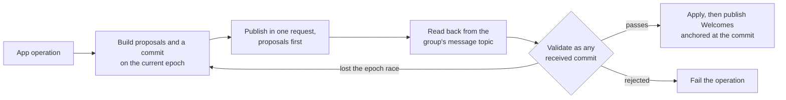

# Modifying groups

How a group changes after it exists: what a change is made of, who may make one, what a receiving client checks before it applies one, and what the sender does between building a commit and knowing that the group accepted it. Every member validates every commit against state it already holds and against identity state it resolves itself, so a client that accepts a commit the others reject, or rejects one they accept, forks the group.

A change is an MLS commit over proposals. MLS Add, Remove, and Update proposals change the ratchet tree. XMTP group settings and membership records live in the app-data dictionary and change through `AppDataUpdate` proposals. The sender does not trust its own commit: it publishes the commit, reads it back from the group's message topic in the order the backend fixed, and validates it as it would a commit from anyone else. Only then does it apply the commit and send Welcomes to the installations it added.



## Scope

In scope: the proposal types and senders a client accepts; the membership component and the rule for writing it; how a commit's leaf changes are checked against identity state; how a change is published, read back, and applied; the order and outcome of the checks on a received commit; commit validation against the protocol-version floor; committing another member's proposals; keeping installations current; and leaving a group.

Out of scope: which member may make a given change (`PERM`), component identifiers, encodings, byte limits, and update ordering (`META`), joining and what a Welcome carries (`JOIN`), the association log and exact association state (IDENT-070 and IDENT-071), fork detection, the commit log, and re-add requests (`FORK`), ordered processing and positions (`PROC`), application-message publication (`SEND`), leave-request encoding (CTYPE-014), and consent after rejoin (CONS-025).

| Related | Relation |
| --- | --- |
| `PERM` | Owns whether a proposer may make a change. GMOD-019 says when it is asked; PERM-009 says whom it judges. |
| `JOIN` | Owns Welcome validation and key-package checks. GMOD-009 supplies the sender accounting that JOIN-053 relies on. |
| `META` | Owns all component identifiers and encodings, except the `GroupMembershipEntry` payload below. META-064 owns update ordering; META-010 owns byte limits. |
| `PROC` | PROC-011 and PROC-012 own terminal advancement and holding. This spec supplies the commit-specific checks. |
| `FORK` | Owns re-add requests. GMOD-015 is the validation exception they rely on. |

## Terms

| Term | Meaning |
| --- | --- |
| Proposer | The member whose leaf node signed a proposal. |
| Committer | The member whose leaf node signed a commit. |
| Membership component | The component of the app-data dictionary that records the group's inboxes, stated in section 2. |
| Membership entry | One inbox's value in the membership component: a `GroupMembershipEntry`. |
| Referenced identity state | The association state of an inbox at the `sequence_id` its membership entry names after the commit. Owned by IDENT-070 and IDENT-071. |
| Previous identity state | The association state of an inbox at the `sequence_id` its entry named before the commit, or no state when the inbox was not a member or its entry named 0. |
| Expected additions | For every inbox whose entry the commit adds or changes: the installation keys the referenced identity state associates with it and the previous identity state does not. |
| Expected removals | The installation keys the previous identity state associates with an inbox and the referenced identity state does not, plus every installation key the previous identity state associates with an inbox the commit removes. |
| Failed installation | An installation key listed in a post-commit membership entry's `failed_installations`, or in a pre-commit entry's list when no current leaf has that key. |
| Floor | The minimum client version a group requires: the minimum protocol version component of its dictionary, a semantic version string. |
| Read-back | The sender's receipt of its own commit from the group's message topic, at the sequence id the backend assigned. |
| Terminal rejection | A refusal recorded under PROC-011. A held envelope remains pending under PROC-012. |

## 1. Proposals and commits

MLS defines the proposal types a commit can carry ([RFC 9420 §12.1](https://www.rfc-editor.org/rfc/rfc9420.html#section-12.1)), and the MLS extensions draft adds `AppDataUpdate` ([draft-ietf-mls-extensions-08 §4.7](https://www.ietf.org/archive/id/draft-ietf-mls-extensions-08.html#section-4.7)), which writes one component of the dictionary. XMTP uses four of them. `GroupContextExtensions` is not one: the dictionary is the only group context extension a commit may change, and it changes through `AppDataUpdate`. Pre-shared keys, re-initialisation, external joins, and self-removal are not used. A proposal from anyone who is not a member, an external sender or a new member, is refused.

| Proposal type | Use |
| --- | --- |
| `add` | Adds an installation's leaf node, from its key package (JOIN section 1). |
| `remove` | Removes a leaf node. |
| `update` | Replaces the proposer's own leaf node. |
| `app_data_update` | Writes one component of the dictionary. |

The MLS validation of a proposal and a commit under [RFC 9420 §12.2](https://www.rfc-editor.org/rfc/rfc9420.html#section-12.2) and [§12.4.2](https://www.rfc-editor.org/rfc/rfc9420.html#section-12.4.2) is not restated here; the rules below are what XMTP adds. A commit references proposals that the group's members already hold, so the sender publishes the proposals it created and the commit that references them in one publish request, proposals first: a commit that arrives without its proposals is rejected by every member.

| ID | Title | Requirement | Why |
| --- | --- | --- | --- |
| GMOD-001 | Four proposal types | When a standalone proposal or a proposal inside a commit is not `add`, `update`, `remove`, or `app_data_update`, the client MUST refuse it under the unsupported-proposal table below. | |
| GMOD-002 | Only members propose | When a proposal's or a commit's sender is not a `member` sender ([RFC 9420 §6.1](https://www.rfc-editor.org/rfc/rfc9420.html#section-6.1)) whose leaf node is in the group, the client MUST record a terminal rejection for it. | |
| GMOD-003 | An update keeps its identity | When a standalone `update` proposal's credential names an inbox other than the proposer's, the client MUST record a terminal rejection for it. | A member could otherwise place its leaf under another member's inbox. |
| GMOD-004 | Proposals travel with their commit | When a client publishes a commit that references proposals it created, it MUST publish those proposals and the commit in one publish request, the proposals first in the order it created them. | |

The unsupported-proposal table gives the outcome after MLS validation has accepted the message. Earlier MLS failures follow PROC-011 and PROC-012. A held proposal is not retained as an accepted proposal for a later commit.

| Unsupported proposal | Standalone outcome | Commit outcome |
| --- | --- | --- |
| `GroupContextExtensions` | Hold | Hold |
| `PreSharedKey` | Hold | Terminal rejection |
| `ReInit` | Hold | Hold |
| `ExternalInit` | Hold | Hold |
| `SelfRemove` | Hold | Hold |
| `AppEphemeral` | Hold | Hold |
| Custom proposal | Hold | Hold |

### 1.1 Proposal-list validity

The proposal-list checks of [draft-ietf-mls-extensions-08 §4.7](https://www.ietf.org/archive/id/draft-ietf-mls-extensions-08.html#section-4.7) apply without a `GroupContextExtensions` proposal. After these checks, the client uses META-064 for both validation and application of app-data updates.

| ID | Title | Requirement | Why |
| --- | --- | --- | --- |
| GMOD-030 | Reject conflicting component operations | When a commit carries `AppDataUpdate` proposals, the client MUST reject an invalid proposal list under draft-ietf-mls-extensions-08 §4.7, including an Update and a Remove, or more than one Remove, for the same component id, whether or not the commit contains a `GroupContextExtensions` proposal. | Conflicting component operations can make clients compute different state for one epoch. |

## 2. The membership component

The membership component names every inbox that is a member and, for each, the identity state its installations are checked against and the installations the group could not add. It is what a joiner validates a Welcome's ratchet tree against (JOIN section 8) and what every member validates a commit's leaf changes against (section 3). The component is a map from inbox id to an encoded `GroupMembershipEntry`; META-010 and META-011 own the map and inbox-id encodings, and META section 2 assigns the component id.

```proto
message GroupMembershipEntry {
  message V1 {
    uint64 sequence_id = 1;
    repeated bytes failed_installations = 2;
  }

  oneof version {
    V1 v1 = 1;
  }
}
```

A `sequence_id` is a promise the sender makes: it resolved that inbox's identity updates through that sequence id and built the commit from the state it found. It is 0 only for the creator's own entry at creation, before any identity reference is needed. Every sequence id a commit writes is less than the sequence id the commit itself receives, because the identity update was published first and the backend assigns sequence ids in publication order, so a reference at or after the commit can never resolve.

JOIN-011 owns partial success when some key packages are invalid. GMOD-009 accounts for the installations in each inbox, including an installation for which the backend returns no key package. JOIN section 8 owns validation of the membership asserted by a Welcome.

| ID | Title | Requirement | Why |
| --- | --- | --- | --- |
| GMOD-005 | Membership entry format | The client MUST encode each member's value in `GROUP_MEMBERSHIP` as the `GroupMembershipEntry` defined above, with `v1` set and exactly one entry per member inbox. | |
| GMOD-006 | An added inbox references resolved state | When a commit adds an inbox, the sender MUST set its entry's `sequence_id` to the sequence id of the latest identity update it resolved for that inbox, greater than 0. | |
| GMOD-007 | References precede the commit | If any entry's `sequence_id` is not less than the commit's own sequence id, or an entry the commit adds has a `sequence_id` of 0, then the client MUST record a terminal rejection for the commit. | A reference at or after the commit can never be resolved, and 0 asserts nothing. |
| GMOD-008 | Sequence ids never decrease | If an inbox's entry after the commit has a `sequence_id` less than before it, then the client MUST record a terminal rejection for the commit. | A lowered reference would let a revoked installation back in. |
| GMOD-009 | Every installation is accounted for | When a sender publishes a commit that adds an inbox or changes its `sequence_id`, the sender MUST ensure that every installation key in that inbox's referenced identity state is either the `signature_key` of a leaf after the commit or in that inbox's `failed_installations`. | An omitted installation loses access, and a later joiner rejects the incomplete membership. |

## 3. Leaf changes against identity

A commit's Add and Remove proposals are not taken at their word. The membership component says which identity state each inbox is at, and the difference between the previous and the referenced identity state says which installations may be added and which must be removed. A leaf added outside the expected additions is a leaf under an identity that never authorised it; a removal missing from the expected removals leaves a revoked installation reading the group. Failed installations are exempt from the removal check, because the group never held a leaf for them.

The checks read identity state the client resolves itself. When it does not hold an inbox's association state at the `sequence_id` an entry names, it fetches that inbox's identity updates through that sequence id before it decides, so that two members with different caches reach the same answer. A reference the backend holds nothing for can never resolve and is rejected. The creator's unchanged zero-sequence entry is a creation placeholder: only a key and inbox already paired in an authenticated committed leaf can use it, without resolving sequence 0. A new key still needs a nonzero identity reference.

One exception exists for recovery. A super admin may remove and re-add an installation in one commit, replacing its leaf without an identity change, or remove a leaf whose installation is listed as failed. `FORK` owns when that is done; this section owns that every member accepts it.

| ID | Title | Requirement | Why |
| --- | --- | --- | --- |
| GMOD-010 | Only expected leaves are added | If a commit adds a leaf node whose `signature_key` is not in the expected additions and is not the `signature_key` of a leaf node already in the group, then the client MUST record a terminal rejection for the commit. | This is the check that stops a member placing a leaf under an identity that never authorised it. |
| GMOD-011 | Expected leaves are removed | If the set of `signature_key`s of the leaf nodes a commit removes is not equal to the expected removals minus the failed installations, then the client MUST record a terminal rejection for the commit. | A removal the identity state does not call for evicts a member; one it calls for and the commit omits keeps a revoked installation in the group. |
| GMOD-012 | Signing keys belong to their inboxes | When the client validates the committer's leaf or an `update` proposal's leaf, it MUST reject the commit unless the leaf's `signature_key` belongs to the credential's inbox in its referenced identity state, or that inbox's entry is 0 both before and after the commit and the same key and inbox pair exists in a committed leaf. | |
| GMOD-013 | Resolve before deciding | When validation needs an inbox's association state at a nonzero `sequence_id`, the client MUST resolve that exact state under IDENT-070 and IDENT-071 before it decides on the commit. | Deciding on cached state makes members disagree about the same commit. |
| GMOD-014 | Unresolvable references are terminal | When a client has fetched an inbox's identity updates and the backend holds no update at the `sequence_id` an entry names, the client MUST record a terminal rejection for the commit. | A reference to a state never published can never become valid. |
| GMOD-015 | A super admin may re-add | When the committer is a super admin, the client MUST remove keys that the commit both adds and removes from its actual addition and removal sets before the GMOD-010 and GMOD-011 comparisons. For the same super-admin condition, it MUST then remove keys present in both the remaining actual removals and failed installations from both of those sets. | |

## 4. Publishing a change

An app's operation becomes an intent the client holds until the group accepts it. The client builds proposals and a commit on the epoch it holds, publishes them, and then waits for the read-back. The commit is not applied from the sender's own copy: the sender processes the group's message topic in order like every other member, meets its own commit there, and validates it under section 5. A commit that fails validation on the sender fails on every member, and the operation is reported to the app as failed.

Two commits built on the same epoch race. SEND-014 owns rebuilding the change after its commit loses that race.

A commit that adds installations owes them a Welcome. The Welcome names the commit by its sequence id on the group's message topic (JOIN section 6), so it cannot be built until the read-back, and an installation that never receives it has no way to join. Welcomes are published after the commit is applied, and the operation is not complete until the backend has accepted every one of them.

A commit may reference proposals other members published. Every member keeps a received proposal only after validating it, so a proposal that one member rejects is one every member rejects, and a commit that references it fails everywhere the same way. PERM-009 judges each proposal by its proposer, so the committer needs no authority of its own over the changes it commits.

| ID | Title | Requirement | Why |
| --- | --- | --- | --- |
| GMOD-016 | Apply only what the topic returns | A client MUST NOT apply a commit it built before it has read that commit back from the group's message topic at the sequence id the backend assigned, and MUST NOT exempt it from any check of section 5 because it built it. | A sender that applies first and loses the race, or built a commit the others reject, is forked from the group. |
| GMOD-018 | Welcomes follow the commit | When a client has applied a commit it built that adds leaf nodes, it MUST publish a Welcome to every installation the commit added, with `message_cursor` equal to the commit's sequence id, and MUST NOT publish any Welcome for that commit before the read-back. | An installation that receives no Welcome cannot join the group. |
| GMOD-019 | Received proposals are validated first | When the client receives a standalone proposal, it MUST check its type and sender under section 1, the same-inbox condition for Update, the Add or Remove authority under PERM-015, and the component structure and write authority under META and PERM for `AppDataUpdate`, before retaining it as an accepted proposal. | A proposal accepted by only some members can make a later commit fork the group. |

## 5. Receiving a commit

A received commit passes through the checks in this spec and in `PERM`, and is applied only when every one passes. A commit that fails leaves the group's state and epoch unchanged. What happens next depends on why it failed. PROC-011 owns terminal rejection and advancement. PROC-012 owns holding after a storage failure, an unresolved identity dependency, or an unsupported proposal. The proposal table in section 1 distinguishes an unsupported standalone PSK from a terminal committed PSK.

The floor is different from both. A client below the group's floor cannot be sure it can even parse what the group now carries, and a rejection it issues alone is a fork. So it pauses: it applies nothing further on that group, publishes nothing to it, and records no rejection, until its version reaches the floor and it reprocesses from where it stopped. While the committed floor is supported, a commit that raises it is validated before it can pause the client. A terminal validation failure rejects that commit; an unresolved dependency or storage failure holds it under PROC-012. A committed floor that is already unsupported pauses the client before further commit validation. Versions compare under [Semantic Versioning 2.0.0 §11](https://semver.org/spec/v2.0.0.html#spec-item-11), including its pre-release precedence, unlike the backend's minimum under CONF-050. The floor only rises, because a lowered floor lets a paused client apply commits it cannot interpret. A new group is created with a floor at the first version that supports the dictionary, and PERM-023 says when a release raises it.

META-010 owns component encodings and byte limits. Standalone checks do not resolve a future commit's identity references, compare its aggregate leaf changes, or apply its proposed floor. The client repeats authorization at commit time under PERM-009 and checks the full change here.

| ID | Title | Requirement | Why |
| --- | --- | --- | --- |
| GMOD-021 | Validate, then apply | The client MUST apply a commit only after the checks in GMOD, PERM, and META have passed, with app-data validation and application in the order META-064 defines. When any check fails, it MUST leave the group state and epoch unchanged. | |
| GMOD-022 | Judge before the floor pauses | When the committed floor is not greater than the client's version and a commit would raise it above that version, the client MUST complete the other commit validation checks before pausing for that raise, and MUST terminally reject a terminal validation failure under PROC-011. | An unauthorized floor raise would otherwise pause the group. |
| GMOD-025 | Pause below the floor | While the committed floor exceeds the client's version, or a commit that passes all other validation would raise it above that version, the client MUST hold before that commit under PROC-012 and MUST NOT publish a message, proposal, or commit in the group. When its version reaches the floor, it MUST resume from the first held envelope. | Rejecting or skipping a commit that newer members accept forks the group. |
| GMOD-026 | The floor only rises | If a proposal sets the floor to a version lower than the committed floor, or removes the floor while one is committed, then the client MUST record a terminal rejection for it. | |
| GMOD-027 | Version precedence | When the client compares its version with a floor, it MUST use [Semantic Versioning 2.0.0 §11](https://semver.org/spec/v2.0.0.html#spec-item-11), including pre-release precedence; a malformed committed floor MUST NOT cause a pause. | |

## 6. Keeping membership current

An inbox's installations can change after it joins: a device is added or revoked through an identity update (IDENT-070), and the group's leaf nodes no longer match. Any member repairs this. A client that syncs a group fetches the identity updates of every member on a schedule, and when an inbox's latest sequence id is greater than its entry, publishes a commit that raises the entry and makes the expected additions and removals. The revoked installation loses the group at that commit, and the new one receives a Welcome. Which member does it first does not matter: the commits race under section 4 and the loser finds nothing left to do.

| ID | Title | Requirement | Why |
| --- | --- | --- | --- |
| GMOD-029 | Members repair changed identity state | When a membership refresh for an active group resolves an inbox's identity state at a sequence id greater than its membership entry's, the client MUST publish a membership change that raises the entry to that sequence id and makes the expected additions and removals under sections 2 and 3. | A new device cannot add itself, and a revoked one keeps reading until a member removes it. |

## 7. Leaving a group

A leave request is an authenticated application message in the group. CTYPE-014 owns its content type and `LeaveRequest` encoding. Its sender asks for removal of the sender's inbox; the note carries no authority over another inbox. Sending the request does not publish a self-removal commit. The requesting inbox is pending removal until another member commits the removal.

PERM-025 owns authority to act on a leave request. The removal still passes PERM-003 and PERM-015 and the membership checks here. A request can remain pending while no authorized super-admin client can publish the removal. CONS-025 owns consent if the inbox later rejoins.

| ID | Title | Requirement | Why |
| --- | --- | --- | --- |
| GMOD-031 | Request a permitted leave | When an app requests leave, the client MUST reject the operation if its inbox is not a member, the group has only one member inbox, the conversation is a DM, or its inbox is a super admin. Otherwise, if its inbox has no pending leave request, it MUST send a `LeaveRequest` under CTYPE-014 without publishing a self-removal commit. | |
| GMOD-032 | Authenticate the leaving inbox | When the client processes a leave request, it MUST take the inbox to remove from the authenticated MLS application-message sender and MUST NOT take it from the request payload. For a request from its own inbox, it MUST expose the group as pending removal until a commit removes that inbox. | A payload chosen by one member cannot authorize another member's leave. |
| GMOD-033 | Complete an authorized leave | When a client processes pending leave requests and has authority under PERM-025, it MUST publish a removal commit for the requesting inboxes that are still members, subject to PERM-003 and PERM-015. It MUST report removal complete only after it applies a commit that removes the inbox, and MUST keep a request pending when publication or validation fails. | Publication of a request alone does not remove any installation from the ratchet tree. |

## Known limitations

The receiver tolerates a commit that adds an inbox without adding every installation the referenced identity state associates and without listing the rest as failed. GMOD-009 binds the sender; existing members accept the commit, and only a later joiner rejects the Welcome under JOIN-053.

A membership refresh does not retry a failed installation key that remains associated in both identity states. Its key package becoming valid does not by itself add it to the group.

A commit sweeps every pending proposal the committer holds, and MLS discards proposals that a commit did not reference once the epoch advances. A member that publishes a proposal and is beaten to the commit by another member's unrelated change has to propose again.

The floor pauses only the clients below it. Members at or above it continue, and the paused client's unpublished changes are built on an epoch the group has left and are rebuilt under SEND-014 after it resumes.

A membership refresh is triggered by client activity. Its interval is an implementation choice, not a deadline for removing a revoked installation or adding a new one. No bound applies while all members are offline.
