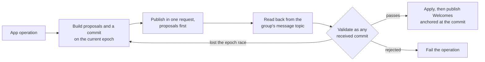

# Modifying groups

How a group changes after it exists: what a change is made of, who may make one, what a receiving client checks before it applies one, and what the sender does between building a commit and knowing that the group accepted it. Every member validates every commit against state it already holds and against identity state it resolves itself, so a client that accepts a commit the others reject, or rejects one they accept, forks the group.

A change is an MLS commit over proposals. Membership travels as MLS Add and Remove proposals; every other part of the group's shared state, including the record of who is a member, lives in the group's app-data dictionary and changes through `AppDataUpdate` proposals. The sender does not trust its own commit: it publishes the commit, reads it back from the group's message topic in the order the backend fixed, and validates it as it would a commit from anyone else. Only then does it apply the commit and send Welcomes to the installations it added.



## Scope

In scope: the proposal types and senders a client accepts; the membership component and the rule for writing it; how a commit's leaf changes are checked against identity state; how a change is published, read back, and applied; the order and outcome of the checks on a received commit; the protocol-version floor; the byte limits on metadata values; committing another member's proposals; and how a member keeps a group's installations current.

Out of scope: which member may make a given change (`PERM`), the app-data dictionary, the registry, and how a component's bytes are applied (`?META`), joining and what a Welcome carries (`JOIN`), the association log and what an inbox's installations are (`?IDENT`), fork detection, the commit log, and re-add requests (`?FORK`), the order in which a client processes a topic and how it holds a position (`?PROC`), application messages (`?SEND`), and a member leaving a group.

| Related | Relation |
| --- | --- |
| `PERM` | Owns whether a proposer may make a change. GMOD-019 says when it is asked; PERM-009 says whom it judges. |
| `JOIN` | Owns what a joiner checks. JOIN-053 is what GMOD-009 protects; JOIN-011 and JOIN-012 own which installations a sender adds and how it records the rest. |
| `?META` | Owns the dictionary, the component ids of the metadata fields, and how a delta is applied. This spec owns the membership component's id and format. |
| `?PROC` | Owns ordered processing of a topic and the durable position. This spec says when a commit is a terminal rejection and when it is held. |
| `?FORK` | Owns re-add requests. GMOD-015 is the validation exception they rely on. |

## Terms

| Term | Meaning |
| --- | --- |
| Proposer | The member whose leaf node signed a proposal. |
| Committer | The member whose leaf node signed a commit. |
| Membership component | The component of the app-data dictionary that records the group's inboxes, stated in section 2. |
| Membership entry | One inbox's value in the membership component: a `GroupMembershipEntry`. |
| Referenced identity state | The association state of an inbox at the `sequence_id` its membership entry names after the commit. Owned by `?IDENT`. |
| Previous identity state | The association state of an inbox at the `sequence_id` its entry named before the commit, or no state when the inbox was not a member or its entry named 0. |
| Expected additions | For every inbox whose entry the commit adds or changes: the installation keys the referenced identity state associates with it and the previous identity state does not. |
| Expected removals | The installation keys the previous identity state associates with an inbox and the referenced identity state does not, plus every installation key the previous identity state associates with an inbox the commit removes. |
| Failed installation | An installation key listed in `failed_installations` of a membership entry. |
| Floor | The minimum client version a group requires: the minimum protocol version component of its dictionary, a semantic version string. |
| Read-back | The sender's receipt of its own commit from the group's message topic, at the sequence id the backend assigned. |
| Terminal rejection | The refusal a client records for an envelope under GMOD-023. |

## 1. Proposals and commits

MLS defines the proposal types a commit can carry ([RFC 9420 §12.1](https://www.rfc-editor.org/rfc/rfc9420.html#section-12.1)), and the MLS extensions draft adds `AppDataUpdate` ([draft-ietf-mls-extensions §4.6](https://datatracker.ietf.org/doc/html/draft-ietf-mls-extensions#section-4.6)), which writes one component of the dictionary. XMTP uses four of them. `GroupContextExtensions` is not one: the dictionary is the only group context extension a commit may change, and it changes through `AppDataUpdate`. Pre-shared keys, re-initialisation, external joins, and self-removal are not used. A proposal from anyone who is not a member, an external sender or a new member, is refused.

| Proposal type | Use |
| --- | --- |
| `add` | Adds an installation's leaf node, from its key package (JOIN section 1). |
| `remove` | Removes a leaf node. |
| `update` | Replaces the proposer's own leaf node. |
| `app_data_update` | Writes one component of the dictionary. |

The MLS validation of a proposal and a commit under [RFC 9420 §12.2](https://www.rfc-editor.org/rfc/rfc9420.html#section-12.2) and [§12.4.2](https://www.rfc-editor.org/rfc/rfc9420.html#section-12.4.2) is not restated here; the rules below are what XMTP adds. A commit references proposals that the group's members already hold, so the sender publishes the proposals it created and the commit that references them in one publish request, proposals first: a commit that arrives without its proposals is rejected by every member.

| ID | Title | Requirement | Why |
| --- | --- | --- | --- |
| GMOD-001 | Four proposal types | When a proposal, standalone or inside a commit, is of a type other than `add`, `update`, `remove`, or `app_data_update`, the client MUST record a terminal rejection for it, and for the commit that carries it. | |
| GMOD-002 | Only members propose | When a proposal's or a commit's sender is not a `member` sender ([RFC 9420 §6.1](https://www.rfc-editor.org/rfc/rfc9420.html#section-6.1)) whose leaf node is in the group, the client MUST record a terminal rejection for it. | |
| GMOD-003 | An update keeps its identity | When an `update` proposal's leaf node carries a credential that names an inbox other than the proposer's, the client MUST record a terminal rejection for it. | A member could otherwise place its leaf under another member's inbox. |
| GMOD-004 | Proposals travel with their commit | When a client publishes a commit that references proposals it created, it MUST publish those proposals and the commit in one publish request, the proposals first in the order it created them. | |

## 2. The membership component

The membership component names every inbox that is a member and, for each, the identity state its installations are checked against and the installations the group could not add. It is what a joiner validates a Welcome's ratchet tree against (JOIN section 8) and what every member validates a commit's leaf changes against (section 3). The component is a map from inbox id to an encoded `GroupMembershipEntry`; `?META` owns the map encoding and the app-data dictionary that carries it, and is expected to require a TLS-encoded map keyed by inbox id.

```proto
// Per-member membership state stored inside the GROUP_MEMBERSHIP component
// as a TlsMap<InboxId, bytes>. Keys are 32-byte inbox ids, values are the
// encoded bytes of this message.
message GroupMembershipEntry {
  // V1 of the per-member membership state.
  message V1 {
    // Latest identity-update sequence id this client has applied for this
    // member. Validator-checked at bootstrap against the pre-flip
    // `GroupMembership.members[inbox_id]` value.
    uint64 sequence_id = 1;
    // Installation ids belonging to this member that we previously failed
    // to add (expired key package, validation failure, etc.). Used to
    // suppress retries on later membership updates.
    //
    // Sender-authoritative at migration: the migrator partitions the
    // global `failed_installations` per inbox by walking identity-update
    // history. Receivers accept these bytes as-is — the validator only
    // checks `sequence_id`, so the blast radius of a bad partition is
    // bounded to extra or silenced retries. Installations whose owning
    // inbox can't be determined are dropped.
    repeated bytes failed_installations = 2;
  }

  oneof version {
    V1 v1 = 1;
  }
}
```

A `sequence_id` is a promise the sender makes: it resolved that inbox's identity updates through that sequence id and built the commit from the state it found. It is 0 only for the creator's own entry at creation, before any identity reference is needed. Every sequence id a commit writes is less than the sequence id the commit itself receives, because the identity update was published first and the backend assigns sequence ids in publication order, so a reference at or after the commit can never resolve.

The sender's obligation is to account for every installation. JOIN-011 and JOIN-012 own which installations of an inbox a sender adds and that it records the rest in `failed_installations`; GMOD-009 states the invariant that results. Without it a joiner rejects every later Welcome under JOIN-053, and the members never learn why.

| ID | Title | Requirement | Why |
| --- | --- | --- | --- |
| GMOD-005 | Membership component format | The membership component MUST be the component with id `0x8003`, whose value maps each member's inbox id to an encoded `GroupMembershipEntry` as defined above, with exactly one entry per member. | |
| GMOD-006 | An added inbox references resolved state | When a commit adds an inbox, the sender MUST set its entry's `sequence_id` to the sequence id of the latest identity update it resolved for that inbox, greater than 0. | |
| GMOD-007 | References precede the commit | If any entry's `sequence_id` is not less than the commit's own sequence id, or an entry the commit adds has a `sequence_id` of 0, then the client MUST record a terminal rejection for the commit. | A reference at or after the commit can never be resolved, and 0 asserts nothing. |
| GMOD-008 | Sequence ids never decrease | If an inbox's entry after the commit has a `sequence_id` less than before it, then the client MUST record a terminal rejection for the commit. | A lowered reference would let a revoked installation back in. |
| GMOD-009 | Every installation is accounted for | When a commit adds an inbox or changes its `sequence_id`, every installation key the referenced identity state associates with that inbox MUST be either the `signature_key` of a leaf node after the commit or listed in that inbox's `failed_installations`. | JOIN-053 rejects every later Welcome for the group, and no member sees the cause. |

## 3. Leaf changes against identity

A commit's Add and Remove proposals are not taken at their word. The membership component says which identity state each inbox is at, and the difference between the previous and the referenced identity state says which installations may be added and which must be removed. A leaf added outside the expected additions is a leaf under an identity that never authorised it; a removal missing from the expected removals leaves a revoked installation reading the group. Failed installations are exempt from the removal check, because the group never held a leaf for them.

The checks read identity state the client resolves itself. When it does not hold an inbox's association state at the `sequence_id` an entry names, it fetches that inbox's identity updates through that sequence id before it decides, so that two members with different caches reach the same answer. A reference the backend holds nothing for can never resolve and is rejected.

One exception exists for recovery. A super admin may remove and re-add an installation in one commit, replacing its leaf without an identity change, or remove a leaf whose installation is listed as failed. `?FORK` owns when that is done; this section owns that every member accepts it.

| ID | Title | Requirement | Why |
| --- | --- | --- | --- |
| GMOD-010 | Only expected leaves are added | If a commit adds a leaf node whose `signature_key` is not in the expected additions and is not the `signature_key` of a leaf node already in the group, then the client MUST record a terminal rejection for the commit. | This is the check that stops a member placing a leaf under an identity that never authorised it. |
| GMOD-011 | Expected leaves are removed | If the set of `signature_key`s of the leaf nodes a commit removes is not equal to the expected removals minus the failed installations, then the client MUST record a terminal rejection for the commit. | A removal the identity state does not call for evicts a member; one it calls for and the commit omits keeps a revoked installation in the group. |
| GMOD-012 | Signing keys belong to their inboxes | If the `signature_key` of the committer's leaf node, or of the leaf node an `update` proposal carries, is not an installation key that the referenced identity state of the inbox its credential names associates with that inbox, then the client MUST record a terminal rejection for the commit. | |
| GMOD-013 | Resolve before deciding | When a client does not hold an inbox's association state at the `sequence_id` its entry names, the client MUST fetch that inbox's identity updates through that sequence id before it decides on the commit, and MUST NOT decide on the state it happens to hold. | Deciding on cached state makes the outcome depend on what each device had, so two members disagree about the same commit. |
| GMOD-014 | Unresolvable references are terminal | When a client has fetched an inbox's identity updates and the backend holds no update at the `sequence_id` an entry names, the client MUST record a terminal rejection for the commit. | A reference to a state never published can never become valid. |
| GMOD-015 | A super admin may re-add | When the committer is a super admin and the commit both removes and adds a leaf node with the same `signature_key`, or removes a leaf node whose `signature_key` is a failed installation, the client MUST exclude those installation keys from the sets GMOD-010 and GMOD-011 compare. | |

## 4. Publishing a change

An app's operation becomes an intent the client holds until the group accepts it. The client builds proposals and a commit on the epoch it holds, publishes them, and then waits for the read-back. The commit is not applied from the sender's own copy: the sender processes the group's message topic in order like every other member, meets its own commit there, and validates it under section 5. A commit that fails validation on the sender fails on every member, and the operation is reported to the app as failed.

Two commits built on the same epoch race, and the backend's order decides. The loser reads back a commit whose epoch the group has already left. It does not apply that commit, and it rebuilds the change on the new state, so the app's change lands unless the new state makes it moot or forbidden.

A commit that adds installations owes them a Welcome. The Welcome names the commit by its sequence id on the group's message topic (JOIN section 6), so it cannot be built until the read-back, and an installation that never receives it holds a key package the group has consumed and no way in. Welcomes are published after the commit is applied, and the operation is not complete until the backend has accepted every one of them.

A commit may reference proposals other members published. Every member keeps a received proposal only after validating it, so a proposal that one member rejects is one every member rejects, and a commit that references it fails everywhere the same way. PERM-009 judges each proposal by its proposer, so the committer needs no authority of its own over the changes it commits.

| ID | Title | Requirement | Why |
| --- | --- | --- | --- |
| GMOD-016 | Apply only what the topic returns | A client MUST NOT apply a commit it built before it has read that commit back from the group's message topic at the sequence id the backend assigned, and MUST NOT exempt it from any check of section 5 because it built it. | A sender that applies first and loses the race, or built a commit the others reject, is forked from the group. |
| GMOD-017 | A lost race is rebuilt | If a commit the client published is read back after the group's epoch has advanced past the epoch it was built on, then the client MUST NOT apply it and MUST rebuild the change on the current state before it publishes again. | |
| GMOD-018 | Welcomes follow the commit | When a client has applied a commit it built that adds leaf nodes, it MUST publish a Welcome to every installation the commit added, with `message_cursor` equal to the commit's sequence id, and MUST NOT publish any Welcome for that commit before the read-back. | A Welcome without a valid anchor is rejected under JOIN-037, and an installation with no Welcome cannot join a group that has already consumed its key package. |
| GMOD-019 | Received proposals are validated first | When a client receives a standalone proposal, it MUST validate it under sections 1 and 3 and under `PERM` before it retains it for a later commit, and MUST NOT retain one that fails. | A proposal one member keeps and another discards makes the commit that references it succeed on one and fail on the other. |
| GMOD-020 | Committing another member's proposals | A client MAY build a commit that references proposals other members published, and a client that receives such a commit MUST judge each proposal by its proposer under PERM-009. | |

## 5. Receiving a commit

A received commit passes through the checks in this spec and in `PERM`, and is applied only when every one passes. A commit that fails leaves the group's state and epoch unchanged. What happens next depends on why it failed. A failure that is a property of the commit itself is terminal: the client records it and continues, because a rejected commit blocks nothing and the group's other members have moved on. A failure that is not, a storage error or identity state the client has not yet fetched, holds the envelope for a later attempt; `?PROC` owns the ordered processing of a topic and is expected to require that a client holds on an envelope it cannot process rather than skipping it.

The floor is different from both. A client below the group's floor cannot be sure it can even parse what the group now carries, and a rejection it issues alone is a fork. So it pauses: it applies nothing further on that group, publishes nothing to it, and records no rejection, until its version reaches the floor and it reprocesses from where it stopped. The commit that raises the floor is judged first, so that a member without the right to raise it cannot pause the group, and pauses the client only after it passes every other check. Versions compare under [Semantic Versioning 2.0.0 §11](https://semver.org/spec/v2.0.0.html#spec-item-11), including its pre-release precedence, unlike the backend's minimum under CONF-050. The floor only rises, because a lowered floor lets a paused client apply commits it cannot interpret. A new group is created with a floor at the first version that supports the dictionary, and PERM-023 says when a release raises it.

Metadata values are bounded in bytes, and every member enforces the bound, because a policy reads only the actor and a bound is a property of the value. `?META` owns the component ids of the fields below.

| Field | Limit |
| --- | --- |
| Group name | 100 bytes |
| Group description | 1000 bytes |
| Group image URL | 2048 bytes |
| App data | 8192 bytes |

| ID | Title | Requirement | Why |
| --- | --- | --- | --- |
| GMOD-021 | Validate, then apply | A client MUST apply a commit only after every check in this spec and in `PERM` has passed, and when any check fails MUST leave its group state and epoch unchanged. | |
| GMOD-022 | Judge before the floor pauses | When a commit sets the floor above the client's version, the client MUST run every other check on that commit first, and MUST record a terminal rejection rather than pause when one fails. | Pausing on an unvalidated commit lets any member freeze the group. |
| GMOD-023 | A rejection is terminal | When a commit fails a check in this spec or in `PERM` for a reason that a later attempt cannot change, the client MUST record a terminal rejection for it and MUST continue to the next envelope. | A held rejection stops every valid commit behind it. |
| GMOD-024 | A local failure is not | If a commit cannot be validated because the client lacks identity state it has not yet fetched, or because of a storage failure, then the client MUST hold the envelope for a later attempt and MUST NOT record a terminal rejection. | A rejection recorded for a transient failure forks the client from a group that accepted the commit. |
| GMOD-025 | Pause below the floor | While the committed floor is greater than the client's version, or when a commit that passes every other check sets it greater, the client MUST NOT apply that commit or any later envelope on the group, MUST NOT record a terminal rejection for them, and MUST resume from the first unapplied envelope once its version is not less than the floor. | A client that rejects what it cannot interpret forks; one that waits catches up. |
| GMOD-026 | The floor only rises | If a proposal sets the floor to a version lower than the committed floor, or removes the floor while one is committed, then the client MUST record a terminal rejection for it. | |
| GMOD-027 | Version precedence | When a client compares its version with a floor, it MUST use Semantic Versioning 2.0.0 §11 precedence, including pre-release precedence, and MUST NOT pause on a floor that is not a semantic version. | A floor that cannot be parsed would otherwise stop every client for ever. |
| GMOD-028 | Metadata values are bounded | If a commit sets a field in the table above to a value longer than its limit, or sets a string field to bytes that are not valid UTF-8, then the client MUST record a terminal rejection for it. | |

## 6. Keeping membership current

An inbox's installations change after it joins: a device is added or revoked through an identity update (`?IDENT`), and the group's leaf nodes no longer match. Any member repairs this. A client that syncs a group fetches the identity updates of every member on a schedule, and when an inbox's latest sequence id is greater than its entry, publishes a commit that raises the entry and makes the expected additions and removals. The revoked installation loses the group at that commit, and the new one receives a Welcome. Which member does it first does not matter: the commits race under section 4 and the loser finds nothing left to do.

| ID | Title | Requirement | Why |
| --- | --- | --- | --- |
| GMOD-029 | Members add missing installations | While a client is a member of a group and syncs it, it MUST, at least once every 30 minutes, fetch every member's identity updates and, for every inbox whose latest sequence id is greater than its entry's `sequence_id`, publish a commit that sets the entry to that sequence id and makes the expected additions and removals. | A new device of another member cannot add itself, and a revoked one keeps reading until someone removes it. |

## Known limitations

The receiver tolerates a commit that adds an inbox without adding every installation the referenced identity state associates and without listing the rest as failed. GMOD-009 binds the sender; existing members accept the commit, and only a later joiner rejects the Welcome under JOIN-053.

A failed installation is not retried by GMOD-029, whose additions are the difference between two identity states. An installation whose key package was invalid when its inbox was added stays out until its inbox publishes an identity update that changes the set, or a super admin re-adds it under GMOD-015.

A commit sweeps every pending proposal the committer holds, and MLS discards proposals that a commit did not reference once the epoch advances. A member that publishes a proposal and is beaten to the commit by another member's unrelated change has to propose again.

The floor pauses only the clients below it. Members at or above it continue, and the paused client's unpublished changes are built on an epoch the group has left and are rebuilt under GMOD-017 after it resumes.

A member cannot remove its own leaf node in a commit, and `self_remove` is not a supported proposal type. Leaving a group is a request another member acts on, and is not stated here.
