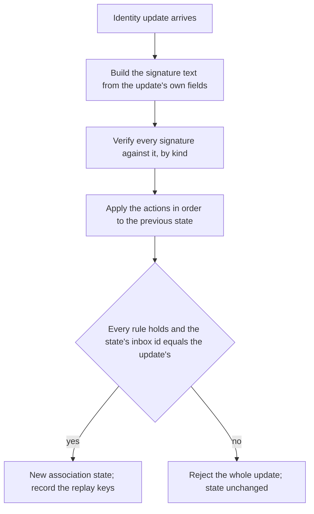

# Identity updates

An inbox is controlled by a chain of signed identity updates. Every rule here is a security boundary: a mistake lets an attacker attach their key to someone else's inbox, or locks a user out of their own.

An inbox has members: the identifiers a user is reached by, and the installation keys that sign on the user's behalf. Membership changes only by an identity update, which every party validates for itself from the signatures it carries. The backend validates an update before it stores it and a client validates every update it reads, under the same rules, so that every party derives the same member set from the same log. One identifier, the recovery identifier, can remove members and reassign its own role; every other member can only add.



## Scope

In scope: the identity update wire format and its actions, the association state and how each action changes it, the signature text and the signature kinds, which kind may sign for which member, inbox id derivation, replay protection, recovery authorization, smart contract wallet verification and chain binding, what an installation's registration and revocation mean, and how an identifier resolves to an inbox.

Out of scope: how an identity update is published, stored, ordered, and read back as an envelope, the snapshot the backend validates against and what it does when that snapshot moves (API-232), duplicate publishes (API-222), the lookup RPC and its answer (API-270), the verifier RPC, and the error codes (`API`); the identity topic layout (`?TOPIC`); the published limits and chains (`CONF`); what a key package carries (`JOIN`); and how a group's membership follows a change of an inbox's installations (`?GMOD`).

| Related | Relation |
| --- | --- |
| `CONF` | Owns the published installation ceiling a client applies (CONF-044), the chains a deployment verifies (CONF-070), and the client's chain check before it signs (CONF-046, CONF-048). |
| `JOIN` | Owns the key package an installation publishes (JOIN-001) and the check of a group's leaves against association state at a sequence id (JOIN-052, JOIN-053, JOIN-059). |
| `API` | Owns the publish and query contract an identity update travels under, the sequence id it receives, the one-snapshot admission and its `ABORTED` (API-232), duplicates (API-222), the resolution RPC (API-270), the verifier RPC, and the error codes. This spec owns what the validation in API-232 checks. |
| `?GMOD` | Owns how a member commits the installations an inbox gained or lost between two sequence ids. |

## Terms

| Term | Meaning |
| --- | --- |
| Association log | The identity updates stored for one inbox, in ascending sequence id order. |
| Sequence id | The position the backend assigns to a stored identity update in its inbox's association log. Assigned under `?API`; greater than 0. |
| Association state | The members, the recovery identifier, and the seen replay keys of an inbox after a prefix of its association log is applied. |
| Member | An identifier or an installation key the association state holds for an inbox. |
| Member kind | Ethereum, passkey, or installation. |
| Recovery identifier | The identifier the association state names as permitted to revoke members and to reassign this role. Not always a member. |
| Signer | The identifier or installation key a validator derives from a signature under section 4. |
| Signature text | The string built from an update under section 3 that every signature in that update signs. |
| Replay key | The bytes a validator records for a signature after it is applied, as section 4 states for each kind. |
| Adder | The existing member whose signature added a member. |
| Chain id | The `eip155` chain of a smart contract wallet signature, as a number; absent for every other signature kind. The association state records one for each member and one for the recovery identifier. |

## 1. The identity update

An identity update is one or more actions signed together. It is published as an envelope on the topic derived from its `inbox_id` and receives its sequence id from the backend; `API` owns that envelope's storage, order, and duplicates (API-222), and `?TOPIC` is expected to derive the identity topic from the 32 bytes the inbox id encodes. The log is validated the same way by the backend before it stores an update (API-232 names the snapshot it validates against) and by a client after it reads one. A validator is either of them. An update with no actions changes nothing, so accepting one would let anyone who can publish fill an inbox's log with signed-by-nobody entries.

`client_timestamp_ns` is set by the sender and is not checked by anyone. It is covered by the signature text, and it is the time a member records as when it was added.

```proto
// The identifier for a member of an XID
message MemberIdentifier {
  oneof kind {
    string ethereum_address = 1;
    bytes installation_public_key = 2;
    Passkey passkey = 3;
  }
}

// Passkey identifier
message Passkey {
  bytes key = 1;
  optional string relying_party = 2;
}

// List of identity kinds
enum IdentifierKind {
  IDENTIFIER_KIND_UNSPECIFIED = 0; // Ethereum on old clients
  IDENTIFIER_KIND_ETHEREUM = 1;
  IDENTIFIER_KIND_PASSKEY = 2;
}

// The first entry of any XID log. The XID must be deterministically derivable
// from the address and nonce.
// The recovery address defaults to the initial associated_address unless
// there is a subsequent ChangeRecoveryAddress in the log.
message CreateInbox {
  string initial_identifier = 1;
  uint64 nonce = 2;
  Signature initial_identifier_signature = 3; // Must be an addressable member
  IdentifierKind initial_identifier_kind = 4;
  // Should be provided if identifier kind is passkey
  optional string relying_party = 5;
}

// Adds a new member for an XID - either an addressable member such as a
// wallet, or an installation acting on behalf of an address.
// A key-pair that has been associated with one role MUST not be permitted to be
// associated with a different role.
message AddAssociation {
  MemberIdentifier new_member_identifier = 1;
  Signature existing_member_signature = 2;
  Signature new_member_signature = 3;
  // Should be provided if identifier kind is passkey
  optional string relying_party = 4;
}

// Revokes a member from an XID. The recovery address must sign the revocation.
message RevokeAssociation {
  MemberIdentifier member_to_revoke = 1;
  Signature recovery_identifier_signature = 2;
}

// Changes the recovery identifier for an XID. The recovery identifier is not required
// to be a member of the XID. In addition to being able to add members, the
// recovery identifier can also revoke members.
message ChangeRecoveryAddress {
  string new_recovery_identifier = 1;
  Signature existing_recovery_identifier_signature = 2;
  IdentifierKind new_recovery_identifier_kind = 3;
  // Should be provided if identifier kind is passkey
  optional string relying_party = 4;
}

// A single identity operation
message IdentityAction {
  oneof kind {
    CreateInbox create_inbox = 1;
    AddAssociation add = 2;
    RevokeAssociation revoke = 3;
    ChangeRecoveryAddress change_recovery_address = 4;
  }
}

// One or more identity actions that were signed together.
message IdentityUpdate {
  repeated IdentityAction actions = 1;
  uint64 client_timestamp_ns = 2;
  string inbox_id = 3;
}
```

An `IdentifierKind` of `IDENTIFIER_KIND_UNSPECIFIED` reads as Ethereum. The `relying_party` fields and `Passkey.relying_party` are carried for display and take no part in identity: two passkey members with the same `key` are the same member.

| ID | Title | Requirement | Why |
| --- | --- | --- | --- |
| IDENT-001 | Identity update wire format | A validator MUST accept an identity update only as the `IdentityUpdate` defined above, with the field numbers and types shown, and MUST reject an update whose `actions` is empty or in which any action's `kind` or any `MemberIdentifier`'s `kind` is unset. | An empty update passes every signature rule, because it carries no signature, and each one stored spends a slot of the inbox's finite log. |
| IDENT-002 | Whole update or nothing | If any action of an update fails a rule in sections 2 to 7, then a validator MUST reject the whole update and MUST leave the association state as it was before the update. | A half-applied update gives two validators two member sets from one log. |
| IDENT-003 | The update names its inbox | When the inbox id of the association state after an update's actions are applied differs from the update's `inbox_id`, a validator MUST reject the update. | The topic is derived from `inbox_id`, so a mismatch stores one inbox's log under another's topic. |
| IDENT-004 | Apply in log order | A validator MUST apply an inbox's updates in ascending sequence id order, and each update's actions in the order listed, each starting from the state the previous one produced. | |
| IDENT-005 | Admission checks this spec | When the backend validates an identity update under API-232, it MUST apply sections 1 to 7 of this spec to the snapshot API-232 names, and MUST NOT store an update that fails them. | A stored update that does not apply stops every client from resolving the inbox at any later sequence id. |

`API` owns what a caller receives for an update rejected under IDENT-005, a duplicate of an update already stored (API-222), and the limit on stored updates per inbox that CONF publishes as `max_identity_entries`.

## 2. Inbox ids and creation

An inbox id is derived from its first identifier and a nonce the app chooses, so that the same identifier can open more than one inbox and any party can check that a `CreateInbox` names the id it claims. The first action ever applied to an inbox is a `CreateInbox`; it makes the initial identifier the only member and the recovery identifier.

| ID | Title | Requirement | Why |
| --- | --- | --- | --- |
| IDENT-010 | Inbox id derivation | A validator MUST derive an inbox id as the 64 lowercase hexadecimal characters of the SHA-256 digest of the UTF-8 bytes of the initial identifier's identifier text under the table in section 3, followed with no separator by the nonce in decimal. | |
| IDENT-011 | Creation opens the log | If the first action applied to an inbox with no association state is not a `CreateInbox`, or a `CreateInbox` is applied to an inbox that has association state, then a validator MUST reject the update. | |
| IDENT-012 | The creator is the first member | If a `CreateInbox`'s `initial_identifier_signature` signer differs from `initial_identifier` under `initial_identifier_kind`, then a validator MUST reject the update. When a validator applies a `CreateInbox`, it MUST produce a state that holds that identifier as its only member and as its recovery identifier, with the signature's chain id recorded for the member and for the recovery identifier. | |
| IDENT-013 | Ethereum identifier form | If an action carries an Ethereum identifier, in `initial_identifier`, `new_recovery_identifier`, or a `MemberIdentifier`, that is not `0x` followed by exactly 40 lowercase hexadecimal characters, then a validator MUST reject the update. | A signer is always derived in that form, so an identifier stored in another form never matches its own later signature, and a recovery identifier stored that way can never recover. |

IDENT-013 rejects, and never rewrites, because the identifier is inside the signed text. It applies to every update a validator reads, including one stored before a validator enforced it; a deployment holds no log written under the earlier rule that tolerated other forms (Known limitations).

## 3. The signature text

Every signature in an update signs one string, the signature text, built from the update's `inbox_id`, its `client_timestamp_ns`, and its actions. A wallet user sees this text; an installation key signs it without display. The text is built by the validator from the update it received, never taken from the update, so a signer authorizes exactly the actions the validator applies.

The template, where `{lines}` is the two lines of each action, in action order, joined by a single newline:

```text
XMTP : Authenticate to inbox

Inbox ID: {inbox_id}
Current time: {timestamp}

{lines}

For more info: https://xmtp.org/signatures
```

The text is UTF-8; every line break is a single line feed, and there is no line feed after the last line. `{timestamp}` is `client_timestamp_ns` reinterpreted as a signed 64-bit two's complement count of nanoseconds since 1970-01-01T00:00:00Z, so a value of 2^63 or more reads as a time before the epoch, divided by 10^9 rounding toward negative infinity, in the `date-time` form of [RFC 3339 §5.6](https://www.rfc-editor.org/rfc/rfc3339#section-5.6) with no fractional seconds and the `Z` designator, such as `2024-04-10T12:00:00Z`.

Each action contributes two lines. The first is a hyphen, a space, and the action's first line below; the second is two spaces, `(`, the label, a colon, a space, the identifier text, and `)`:

```text
- {first line}
  ({label}: {text})
```

| Action | Member kind of the named member | First line | Label |
| --- | --- | --- | --- |
| `CreateInbox` | any | `Create inbox` | `Owner` |
| `AddAssociation` | installation | `Grant messaging access to app` | `ID` |
| `AddAssociation` | Ethereum | `Link address to inbox` | `Address` |
| `AddAssociation` | passkey | `Link passkey to inbox` | `Passkey` |
| `RevokeAssociation` | installation | `Revoke messaging access from app` | `ID` |
| `RevokeAssociation` | Ethereum | `Unlink address from inbox` | `Address` |
| `RevokeAssociation` | passkey | `Unlink passkey from inbox` | `Passkey` |
| `ChangeRecoveryAddress` | any | `Change inbox recovery address` | `Address` |

`{text}` is the identifier text of the named member (`initial_identifier`, `new_member_identifier`, `member_to_revoke`, or `new_recovery_identifier`):

| Member kind | Identifier text |
| --- | --- |
| Ethereum | The address as carried: `0x` and 40 lowercase hexadecimal characters |
| Installation | The 64 lowercase hexadecimal characters of the 32-byte public key, with no prefix |
| Passkey | The lowercase hexadecimal characters of `Passkey.key`, with no prefix |

A `relying_party` never appears in the text. The nonce never appears in the text; it is bound through the inbox id.

| ID | Title | Requirement | Why |
| --- | --- | --- | --- |
| IDENT-020 | One text for every signature | A validator MUST build the signature text of an update from that update's own `inbox_id`, `client_timestamp_ns`, and actions, exactly as the template and the two tables above state, and MUST verify every signature the update carries against that text. | A text built from anything the update does not carry lets a signer authorize actions it never saw. |

## 4. Signature kinds

A signature both proves possession of a key and names the party it stands for. Five kinds exist. Each verifies differently, yields a signer of one member kind, and records one replay key (section 6).

```proto
// RecoverableEcdsaSignature for EIP-191 and V2 signatures
message RecoverableEcdsaSignature {
  // 65-bytes [ R || S || V ], with recovery id as the last byte
  bytes bytes = 1;
}

// EdDSA signature for 25519
message RecoverableEd25519Signature {
  // 64 bytes [R(32 bytes) || S(32 bytes)]
  bytes bytes = 1;
  // 32 bytes
  bytes public_key = 2;
}

// Smart Contract Wallet signature
message SmartContractWalletSignature {
  // CAIP-10 string
  // https://github.com/ChainAgnostic/CAIPs/blob/main/CAIPs/caip-10.md
  string account_id = 1;
  // Specify the block number to verify the signature against
  uint64 block_number = 2;
  // The actual signature bytes
  bytes signature = 3;
}

// Passkey signature
message RecoverablePasskeySignature {
  bytes public_key = 1;
  bytes signature = 2;
  bytes authenticator_data = 3;
  bytes client_data_json = 4;
}

// An existing address on xmtpv2 may have already signed a legacy identity key
// of type SignedPublicKey via the 'Create Identity' signature.
// For migration to xmtpv3, the legacy key is permitted to sign on behalf of the
// address to create a matching xmtpv3 installation key.
// This signature type can ONLY be used for CreateXid and AddAssociation
// payloads, and can only be used once in xmtpv3.
message LegacyDelegatedSignature {
  xmtp.message_contents.SignedPublicKey delegated_key = 1;
  RecoverableEcdsaSignature signature = 2;
}

// A wrapper for all possible signature types
message Signature {
  oneof signature {
    RecoverableEcdsaSignature erc_191 = 1;
    SmartContractWalletSignature erc_6492 = 2;
    RecoverableEd25519Signature installation_key = 3;
    LegacyDelegatedSignature delegated_erc_191 = 4;
    RecoverablePasskeySignature passkey = 5;
  }
}
```

The verification of each kind, the signer it yields, and its replay key. A replay key is a canonical form: two byte strings that verify as the same signature by the same signer produce the same key, so a re-encoding is caught by IDENT-050. A secp256k1 recovery byte is accepted as 0, 1, 27, or 28 and canonicalised to 0 or 1; an ECDSA `s` is canonicalised to the lower half of the curve order.

| Field | Signs for | Verification | Signer | Replay key |
| --- | --- | --- | --- | --- |
| `erc_191` | Ethereum | `bytes` is 65 bytes `r`, `s`, recovery. Recover the secp256k1 public key from the personal-message hash ([EIP 191](https://eips.ethereum.org/EIPS/eip-191), version `0x45`) of the signature text. | The recovered address, lowercase, `0x`-prefixed | 65 bytes: `r`, `s` in the lower half, recovery as 0 or 1 |
| `erc_6492` | Ethereum | Section 7: the account at `account_id` validates `signature` over the personal-message hash of the signature text at block `block_number`. | The address part of `account_id`, lowercase; chain id from its `eip155` reference | The `signature` bytes as given (Known limitations) |
| `installation_key` | Installation | Ed25519ph ([RFC 8032 §5.1](https://www.rfc-editor.org/rfc/rfc8032.html#section-5.1)) over the signature text with the context string `IDENTITY UPDATE SIGNATURE`, under `public_key`. | The 32-byte `public_key` | The 64 signature bytes |
| `delegated_erc_191` | Ethereum | `signature` is an `erc_191` signature over the signature text whose recovered address equals the address of the secp256k1 key in `delegated_key`. `delegated_key`'s own signature is a personal-message signature by the wallet over the text `XMTP : Create Identity`, a newline, the lowercase hexadecimal of `delegated_key.key_bytes`, two newlines, and `For more info: https://xmtp.org/signatures/`. | The wallet address recovered from `delegated_key`'s signature, lowercase | The wallet's signature in `delegated_key`, canonicalised as for `erc_191` |
| `passkey` | Passkey | `client_data_json` parses as WebAuthn client data whose `challenge` equals the base64url encoding without padding of the signature text. `signature` is a DER-encoded ECDSA P-256 signature, under the SEC1 key `public_key`, over `authenticator_data` followed by the SHA-256 digest of `client_data_json` ([WebAuthn Level 2 §6.1](https://www.w3.org/TR/webauthn-2/#sctn-authenticator-data), [§7.2 step 20](https://www.w3.org/TR/webauthn-2/#sctn-verifying-assertion)). | `Passkey` with `key` equal to `public_key`; `relying_party` is the client data's `origin` | 64 bytes: `r`, `s` in the lower half |

A `passkey` signature proves possession of the P-256 key bound to this signature text. It is not a WebAuthn assertion verification: the ceremony `type`, the relying party id hash, the flags, the counter, the minimum authenticator data length, and the `origin` are not checked (Known limitations).

| ID | Title | Requirement | Why |
| --- | --- | --- | --- |
| IDENT-030 | Verify by kind | A validator MUST verify each signature by the verification the table above states for its field, MUST derive its signer as the table states, and MUST reject the update when the verification fails. | |
| IDENT-031 | The kind matches the member | If a signature's field is not one the table above lists for the member kind of the party it stands for, whether the initial identifier, the new member, the existing member, or the recovery identifier, then a validator MUST reject the update. | Without it an installation key stands for a wallet, and the app that holds the key adds members the user never approved. |
| IDENT-032 | Legacy signatures only migrate | A validator MUST accept a `delegated_erc_191` signature only as the `initial_identifier_signature` of a `CreateInbox` whose `nonce` is 0, or as the `existing_member_signature` or `new_member_signature` of an `AddAssociation` on an inbox whose `inbox_id` equals the derivation under IDENT-010 of that signature's own signer with nonce 0. If it is the `recovery_identifier_signature` of a `RevokeAssociation`, the `existing_recovery_identifier_signature` of a `ChangeRecoveryAddress`, or an `existing_member_signature` whose signer is not a current member, then it MUST reject the update. | The legacy key was signed once for a different purpose, so it is limited to the one migration and never to revocation. |

## 5. Adding, revoking, and recovery

Every add is approved by both sides: an existing member or the recovery identifier, and the new member. Only the recovery identifier revokes, and only the recovery identifier hands the role on. A new recovery identifier does not sign, so a user can delegate recovery to a party they do not control without that party being a member.

The pairs an add permits:

| Existing signer | New member |
| --- | --- |
| Ethereum or passkey | Installation, Ethereum, or passkey |
| Installation | Ethereum or passkey |

An installation never adds an installation: a compromised app would otherwise grant itself keys that survive its own revocation. A member is added once; a second add of a current member is rejected rather than rewriting its adder, time, or chain.

An Ethereum address is not one account across chains: a contract at the same address on another chain is another signer. The chain a member was added on is recorded with it, and the chain the recovery identifier was set on is recorded with the role, so that a signature from the same address on another chain stands for neither. The recovery identifier's chain survives its revocation as a member, because the role does.

| ID | Title | Requirement | Why |
| --- | --- | --- | --- |
| IDENT-040 | Both parties approve an add | If an `AddAssociation`'s `new_member_signature` signer differs from `new_member_identifier`, or its `existing_member_signature` signer is neither a current member nor the recovery identifier, or the two signers are equal, or `new_member_identifier` is a current member, then a validator MUST reject the update. | |
| IDENT-041 | Permitted pairs only | If an `AddAssociation`'s existing signer and new member are both installations, then a validator MUST reject the update. | |
| IDENT-042 | An add records its adder | When a validator applies an `AddAssociation`, it MUST produce a state that holds the new member with the existing signer as its adder, the update's `client_timestamp_ns` as its time, and the new member signature's chain id recorded. | IDENT-044 removes installations by adder, so an unrecorded adder leaves a revoked wallet's installations live. |
| IDENT-043 | Only the recovery identifier revokes | If a `RevokeAssociation`'s `recovery_identifier_signature` signer differs from the association state's recovery identifier, then a validator MUST reject the update. | |
| IDENT-044 | Revocation cascades to installations | When a validator applies a `RevokeAssociation`, it MUST produce a state that no longer holds `member_to_revoke` nor any installation member whose adder is `member_to_revoke`, and that holds every other member, the recovery identifier, and its chain id unchanged. | An installation added by a compromised wallet is as compromised as the wallet. |
| IDENT-045 | Only the recovery identifier changes recovery | If a `ChangeRecoveryAddress`'s `existing_recovery_identifier_signature` signer differs from the association state's recovery identifier, then a validator MUST reject the update. When it applies one, the validator MUST set the recovery identifier to `new_recovery_identifier` under `new_recovery_identifier_kind`, without any signature from it, with the chain id recorded for that identifier as a current member or absent when it is not one, and MUST leave the members unchanged. | A new recovery identifier signs nothing, so the only chain it can be bound to is one the log already vouches for. |
| IDENT-046 | A signer keeps its chain | If a signature's signer is a current member, or the signature is the `recovery_identifier_signature` of a `RevokeAssociation`, the `existing_recovery_identifier_signature` of a `ChangeRecoveryAddress`, or an `existing_member_signature` from the recovery identifier, and the signature's chain id differs from the chain id recorded for that member or for the recovery identifier, then a validator MUST reject the update. | A recovery identifier that is not a member has no member record to check against, and the same address on another configured chain would otherwise revoke and reassign. |

A `RevokeAssociation` naming an identifier that is not a member applies: it removes every installation whose adder is that identifier, which is how installations the recovery identifier added while not a member are removed, and it consumes its replay key and a slot of the log. The recovery identifier may revoke itself as a member; it keeps its role and its chain id.

## 6. Replay protection

A signature authorizes one update. Once the update is applied, the same signature cannot be used again, so that an attacker who holds the public log cannot re-add a member the recovery identifier has since revoked. The check is on the replay key of each signature (section 4), recorded in the association state after the update applies, and the key is chosen so that a malleated encoding of the same signature records the same bytes.

| ID | Title | Requirement | Why |
| --- | --- | --- | --- |
| IDENT-050 | A signature is used once | When an update is applied, a validator MUST add the replay key of every signature it carried to the association state's seen keys. If an action carries a signature whose replay key is among the seen keys, then it MUST reject the update. | A revoked member's original add, republished with its signatures, would otherwise re-add it. |

## 7. Smart contract wallets

A smart contract wallet has no private key of its own; its contract decides which signatures it accepts, and that decision can change with every block. The signature therefore names the block at which it is to be judged, and every validator judges it at that block, so an identity update accepted once is accepted by every later reader whatever the wallet's signers become. That pinning cuts the other way at admission: a signer the wallet has removed can still produce a new signature today and name a block from before its removal. The backend therefore admits a new update only when its stated block is close to the chain head, and that freshness check runs once, at admission, never when a stored log is replayed.

Validation needs chain access. A deployment publishes the chains it verifies (CONF-070); a client refuses to produce a signature for any other chain (CONF-046) and never applies that check to a signature it reads (CONF-048). `API` owns the verifier RPC a client may use in place of its own chain access, and the error a caller receives when the backend cannot reach a chain. The form checks in IDENT-060 run before any chain access, so a malformed `account_id` is rejected and never retried.

| ID | Title | Requirement | Why |
| --- | --- | --- | --- |
| IDENT-060 | Verify at the stated block | If an `erc_6492` signature's `account_id` is not a [CAIP-10](https://github.com/ChainAgnostic/CAIPs/blob/main/CAIPs/caip-10.md) account id whose namespace is `eip155` and whose reference is a decimal chain id, then a validator MUST reject the update before any chain access. Otherwise it MUST verify `signature` by [ERC-6492](https://eips.ethereum.org/EIPS/eip-6492) universal signature validation for the account named, over the personal-message hash of the signature text as the table in section 4 states, against the chain state at `block_number`, and MUST reject the update when the result is not valid. | Judged at the current block instead, a signer rotation would invalidate the whole log behind it. |
| IDENT-061 | Unreachable is not invalid | If a validator cannot obtain a result under IDENT-060 for a signature that passed its form check, because it has no route for the chain or the chain call fails, then it MUST NOT reject the update and MUST leave it eligible for a later attempt. | A rejection recorded for an outage is permanent, and the update behind it is valid. |
| IDENT-062 | Fresh block at admission | When the backend validates an update it has not stored, if an `erc_6492` signature's `block_number` is greater than the chain's head block number, or the timestamp of that block is more than 1800 seconds before the timestamp of the head block, then the backend MUST reject the update. | A signer removed from a wallet can otherwise sign for it for ever by naming a block from before its removal. |

## 8. Installations

An installation is a member of kind installation: a 32-byte Ed25519 public key that an app holds and that signs on the inbox's behalf. It is registered by an `AddAssociation` with the installation as the new member, in the same update as the `CreateInbox` for a new inbox or alone for an existing one, and it is revoked by a `RevokeAssociation` from the recovery identifier. What an installation may publish as a key package is JOIN-001.

The number of installations an inbox may hold is a client-side ceiling: CONF-044 stops a client from registering when the installation members in the association state it has resolved, at the highest sequence id it holds, number at least `max_installations_per_inbox`. No validator rejects an update for exceeding it, so two clients that register at once can leave an inbox above the ceiling, and a client that has not fetched the latest updates counts fewer than exist.

Every party that decides whether an installation belongs to an inbox does so at a sequence id: a Welcome names one per inbox (JOIN-052, JOIN-053), a group's membership extension names one per inbox, and `?GMOD` is expected to require that a member commits the installations an inbox gained and lost between the sequence id a group holds and a later one. The state at a sequence id is one value for every party, and the installations an inbox has at that point are the members of kind installation in it. A sequence id that no update in the log carries names no state (JOIN-059). A client caches states it has derived; a cached state is one it derived itself.

| ID | Title | Requirement | Why |
| --- | --- | --- | --- |
| IDENT-070 | State at a sequence id | When a validator needs an inbox's association state at a sequence id, it MUST use the state produced under IDENT-004 by every update in that inbox's association log with a sequence id not greater than it, only when the log holds an update whose sequence id equals it, and MUST NOT substitute the state at any other sequence id. | Two members that check a leaf against different states disagree about whether the group is valid, and a reference no update carries names nothing. |
| IDENT-071 | A client validates for itself | A client MUST derive every association state it uses by applying sections 2 to 7 to the updates it read, and MUST NOT use a member set it did not derive that way. | A client that trusts the backend's acceptance adds whatever installation a compromised backend inserts. |

## 9. Resolving an identifier

An app reaches a user by identifier and needs the inbox it belongs to. The backend keeps that index from the updates it stores and answers under API-270, which resolves to the live association with the highest sequence id. In the terms of this spec, an identifier's association with an inbox is the `CreateInbox` or `AddAssociation` update that made it a member, its sequence id is that update's, and it is live while the identifier is a member of the inbox's association state at the head of the log. Because IDENT-040 rejects an add of a current member, an association's sequence id is that of the one update that made the identifier a member since it was last absent. An identifier can be a member of more than one inbox at once, because nothing in the log forbids it (Known limitations), so a revocation can move the answer to an older inbox.

## Known limitations

One identifier can be a live member of several inboxes at once: a user creates two inboxes from one wallet with two nonces, or links one wallet to two inboxes. No validator rejects this, and the identifier resolves to the inbox of its most recent live association (API-270). Revoking that association exposes the older inbox again.

IDENT-013 replaces an earlier rule that stored an Ethereum identifier in whatever case it was given. A deployment of this backend holds no log written under that rule, because it accepts no data from the earlier networks, so no stored log becomes unreadable. A log imported from elsewhere would.

`client_timestamp_ns` is not checked against any clock. A sender sets any value; it orders members for display and nothing else.

A `passkey` signature verifies the challenge binding and the P-256 signature, and nothing else of the WebAuthn assertion: not the ceremony `type`, the relying party id hash, the user-present or user-verified flags, the signature counter, a minimum authenticator data length, or the `origin`. A forged update still needs the private key. The omitted checks protect against phishing and cloned authenticators, not against forgery, and their absence has not been shown to permit a forgery.

The replay key of an `erc_6492` signature is its bytes as given, because the encoding is the wallet contract's own. A contract that accepts more than one encoding of one signature leaves a replay possible under IDENT-050 when every signature in the replayed update is an `erc_6492` signature with that property.

IDENT-062 bounds the window for a removed signer to 1800 seconds at admission. It does not close it, and it does not run when a stored log is replayed, so a signature admitted in that window stays valid for ever.

A block number names chain state only up to a reorganization. A validator that caches a verdict for a block keeps it after that block is replaced, until the entry is evicted or the process restarts, so a signature validated against an orphaned block can stay accepted. No validator checks block identity or finality.

A client that uses the backend's verifier RPC for smart contract wallet signatures trusts the backend for those verdicts. It can verify against a chain of its own instead.

A backend that cannot reach a chain answers the same way whether the chain is unconfigured or the chain is down (IDENT-061). A client cannot tell the two apart from the answer.

Once an inbox's log reaches the deployment's `max_identity_entries`, no further update is stored for it, and there is no compaction. The log stays readable; the inbox can no longer add or revoke anything.
