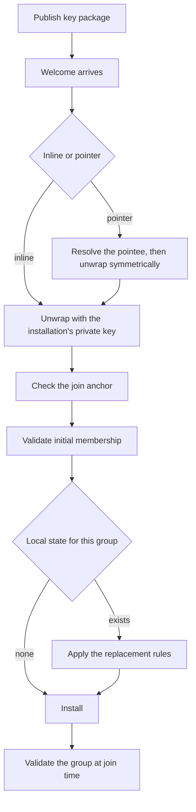
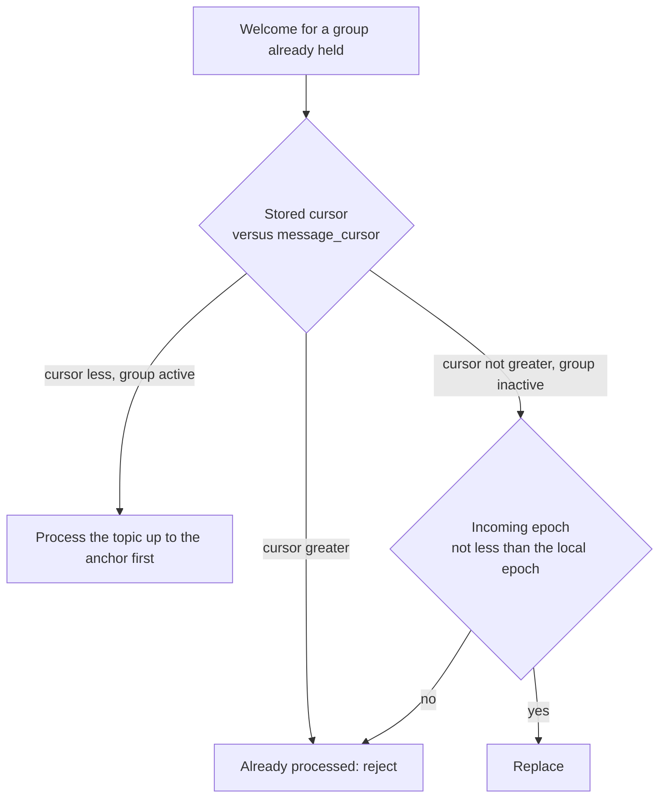

# Joining groups

Everything between publishing a key package and holding group state the client can send and read in. The rules on when a Welcome may replace existing state decide whether a member can still decrypt after a re-add.

A join is the one operation in which an installation accepts a group's membership and state from a single message it did not help produce. Every other group operation is checked against state the client already holds. The rules here supply the checks a Welcome gets instead: the sender is read from the ratchet tree, the membership is checked against identity state the client resolves itself, and the join is tied to a position in the group's message topic that precedes the Welcome.



## Scope

In scope: what a published key package carries and advertises, its lifetime and rotation, when superseded key material is destroyed, unwrapping a Welcome under either wrapper, welcome pointers and their resolution, the join anchor, when a Welcome may replace existing local group state, validation of the membership a Welcome asserts, and the group properties a joiner checks before it accepts.

Out of scope: steady-state commit validation and how a membership change is proposed and committed (`GMOD`), the association log a joiner resolves membership against (`IDENT`), the DM identifier and stitching (`DMS`), consent set on join (`CONS`), the sync conversation's own trust rule (`SYNC`), the policy engine (`PERM`), the metadata model (`META`), topic layout (`TOPIC`), and the publish and query contract (`API`).

## Terms

| Term | Meaning |
| --- | --- |
| Wrapper | The encryption applied to a Welcome or a welcome pointer so that only the addressed installation can read it, in addition to MLS's own encryption of the Welcome. |
| Wrapper algorithm | The `wrapper_algorithm` value a sender sets on a published Welcome or welcome pointer, which names the private key the recipient decrypts with. |
| Welcome pointer | A Welcome variant that carries the topic of a pointee and a symmetric key instead of the Welcome itself. |
| Pointee | The Welcome that a welcome pointer names, shared by every installation the same commit adds. |
| Join anchor | The `message_cursor` a Welcome carries: the sequence id, on the group's message topic, of the commit that added the recipient. |
| Superseded key package | A published key package that a later published key package from the same installation replaces. |
| Terminal rejection | The refusal a client records for an envelope under JOIN-048. |

## 1. What a key package carries

A key package is a public resource that every installation on the network produces. It carries the configuration and key material another installation needs to perform a handshake with this installation: the inbox it belongs to, its installation signature key, its MLS `init_key`, the extension and proposal types it supports, and the wrapper a sender is to encrypt a Welcome under.

A key package is an RFC 9420 [`KeyPackage` (§10)](https://www.rfc-editor.org/rfc/rfc9420.html#section-10) in TLS presentation language. It travels inside `KeyPackage.key_package_tls_serialized` below. A Welcome is an RFC 9420 [`MLSMessage` (§6)](https://www.rfc-editor.org/rfc/rfc9420.html#section-6) whose body is a [`Welcome` (§12.4.3.1)](https://www.rfc-editor.org/rfc/rfc9420.html#section-12.4.3.1); it travels inside `WelcomeMessage.V1.data` (section 4) under the wrapper. Neither format is redefined here.

```proto
// Last-resort key package for one installation. The server validates it and
// derives the topic from its installation key. Every upload is kept; the
// newest per installation is served by QueryNewest. Query with a cursor on a
// key-package topic is not supported.
message KeyPackage {
  bytes key_package_tls_serialized = 1;
}
```

The inbox is carried in the leaf node's credential. The credential is an RFC 9420 [`basic` credential (§5.3)](https://www.rfc-editor.org/rfc/rfc9420.html#section-5.3) whose `identity` is a serialized `MlsCredential`:

```proto
// A credential that can be used in MLS leaf nodes
message MlsCredential {
  string inbox_id = 1;
}
```

A key package carries two XMTP extensions inside the MLS object, under extension types RFC 9420 does not define. The identifiers below are the interoperability contract: an advertisement written under any other identifier is invisible to every other implementation.

```proto
// The KeyPackageExtension that stores the PubKey and the WelcomeWrapperEncryption
message WelcomeWrapperEncryption {
  bytes pub_key = 1;
  WelcomeWrapperAlgorithm algorithm = 2;
}
```

```proto
// Extension message that indicates the types of encryption supported by a client
message WelcomePointeeEncryptionAeadTypesExtension {
  repeated WelcomePointeeEncryptionAeadType supported_aead_types = 1;
}
```

| Extension | Identifier | Carries |
| --- | --- | --- |
| Wrapper encryption | `0xff03` | A `WelcomeWrapperEncryption`: the public key and the wrapper algorithm a sender encrypts a Welcome for this installation under. |
| Welcome pointee encryption | `0xff04` | A `WelcomePointeeEncryptionAeadTypesExtension`: the symmetric algorithms this installation accepts for a pointee. |

A validator reads `cipher_suite` from the key package and verifies its signatures under the signature scheme of that suite, as [RFC 9420 §10.1](https://www.rfc-editor.org/rfc/rfc9420.html#section-10.1) requires. XMTP fixes the suite an installation publishes under, so a package under any other suite cannot be added to a group. The lifetime check in [§7.3](https://www.rfc-editor.org/rfc/rfc9420.html#section-7.3) is RECOMMENDED for a received leaf node; XMTP requires it for a fetched key package (JOIN-008) and omits it for the leaf nodes inside a Welcome's ratchet tree (Known limitations).

A sender fetches the newest key package the backend serves for each installation; the backend serves only that one. Using an older package would not break a protocol guarantee, but its keys may already be destroyed under section 3. When an inbox has some installations with a valid package and some without, the sender adds the inbox with the valid ones (JOIN-011) and records the rest (JOIN-012), so that a joiner can distinguish an installation the sender could not add from one it left out.

| ID | Title | Requirement | Why |
| --- | --- | --- | --- |
| JOIN-001 | Key package names its inbox | An installation MUST publish only a key package whose credential names exactly one inbox and whose leaf node `signature_key` is an installation key that the named inbox's identity state associates with that inbox. | |
| JOIN-002 | Advertised capability is binding | An installation MUST be able to process every extension type and proposal type its published key package lists in its leaf node `Capabilities` ([RFC 9420 §7.2](https://www.rfc-editor.org/rfc/rfc9420.html#section-7.2)). | A sender configures the group from what the recipients advertise. An installation that lacks a capability it advertised forks the group at the first message that uses it. |
| JOIN-004 | One credential encoding | An installation MUST carry its inbox in its key package as a `basic` credential whose `identity` is a serialized `MlsCredential` as defined above, and MUST NOT use any other credential type or encoding. | |
| JOIN-007 | Reject an unverifiable package | When a key package fails the validation in [RFC 9420 §10.1](https://www.rfc-editor.org/rfc/rfc9420.html#section-10.1), including the leaf node validation of [§7.3](https://www.rfc-editor.org/rfc/rfc9420.html#section-7.3) it invokes, a validator MUST reject it and MUST NOT use it to address an installation. | |
| JOIN-008 | Reject an expired package | When the validator's current time is outside the `Lifetime` of the key package's leaf node ([RFC 9420 §7.2](https://www.rfc-editor.org/rfc/rfc9420.html#section-7.2)), at or after `not_after` or before `not_before`, the validator MUST reject the key package. | |
| JOIN-072 | Published ciphersuite | An installation MUST publish its key package with `cipher_suite` `MLS_128_DHKEMX25519_CHACHA20POLY1305_SHA256_Ed25519`. | A package under another suite passes signature verification and then fails at every add, because the group's suite does not match. |
| JOIN-011 | One bad installation | When an inbox has at least one installation whose key package passes JOIN-007 and JOIN-008, a sender MUST add that inbox using those installations and MUST NOT fail the operation because another installation of the same inbox has no such package. | One broken or stale device would otherwise make its owner unaddable by anyone. |
| JOIN-012 | Record what was left out | When a sender adds an inbox without one of its installations, the sender MUST record that installation's installation key in `failed_installations` of the group's `GroupMembership` extension. | Without the record, JOIN-053 rejects the Welcome on every joiner, or a silently dropped device is indistinguishable from one the sender never saw. |

## 2. Lifetime and rotation

MLS as deployed elsewhere uses each key package once: an installation uploads many, the delivery service hands each one out once and then deletes it, and a reusable "last resort" package is the fallback ([RFC 9420 §16.8](https://www.rfc-editor.org/rfc/rfc9420.html#section-16.8)). XMTP is permissionless. Anyone can fetch an installation's key packages, so an attacker can exhaust a supply in one pass and leave the installation with nothing but its last-resort package. XMTP therefore treats the last-resort workflow as the standard one: an installation publishes one key package at a time, every sender uses that package, and the installation bounds the package's exposure with a lifetime and with rotation.

The private keys of a published package open every Welcome addressed to it, so a compromise of the device reaches back as far as the oldest package whose keys it still holds. Two things limit that. The package states a lifetime, after which every validator rejects it. RFC 9420 [§7.2](https://www.rfc-editor.org/rfc/rfc9420.html#section-7.2) asks an application to set a maximum lifetime and reject a longer one; XMTP does not. The lifetime an installation publishes is 12 weeks by default, an installation may publish a longer one at its own risk, and no validator rejects a package for its length. And an installation that is online replaces its package: before `not_after`, and after it accepts a Welcome addressed to the current package. Neither replacement is a requirement, because an installation can be offline past its own expiry or have background work disabled, and the protocol keeps working: while all of an installation's packages are expired, it cannot be added to a group, and nothing else breaks.

| ID | Title | Requirement | Why |
| --- | --- | --- | --- |
| JOIN-003 | Reusable key packages | While a key package is the most recently published one for its installation, that installation MUST retain the private keys that open a Welcome addressed to it, however many Welcomes addressed to the same package it has processed. | Two senders adding the installation at the same time both address the same package. Keys destroyed after the first join lose the second. |
| JOIN-016 | Rotation changes keys | When an installation publishes a replacement key package, that package MUST carry an `init_key`, a leaf node `encryption_key`, and a wrapper public key generated for it, and MUST NOT reuse those of any earlier package. | A rotation that republishes the same keys moves the expiry date and leaves the compromise window unbounded. |

## 3. Destroying key material

Deleting a private key is the only thing that makes a Welcome already sent to it unreadable. Deleting early gives the shortest compromise window; deleting late keeps a Welcome that is still in flight openable. Publication of a replacement is confirmed when the backend's publish response carries a sequence id greater than 0 for the new package; API-221 owns the publish response and API-286 owns the sequence id range. From that confirmation, every superseded package is destroyed after a fixed delay, unless a Welcome the client has received is still waiting to be processed. A Welcome that is being held for a later attempt (JOIN-077, JOIN-057, JOIN-079) delays that destruction until it is completed or rejected.

| ID | Title | Requirement | Why |
| --- | --- | --- | --- |
| JOIN-074 | Destroy superseded key material | When 1 day has passed since the backend's publish response for a later key package carried a sequence id greater than 0, and the client holds no Welcome it has received and not yet completed or rejected, the installation MUST destroy every private key of each superseded key package. | The only value those keys still hold is to whoever takes the device. |
| JOIN-018 | Retain while work is pending | While an installation holds a received Welcome it has not completed or rejected, the installation MUST NOT destroy the private keys of any key package. | Destroying them turns a retriable join into a permanent loss of the conversation, and the client cannot ask for the Welcome again. |
| JOIN-019 | Destroy every part together | When an installation destroys a key package's private key material, it MUST destroy the private key of its `init_key`, of its leaf node `encryption_key`, and of the wrapper public key its `WelcomeWrapperEncryption` extension advertised. | Leaving any one of them behind leaves the Welcome readable and defeats the deletion. |
| JOIN-020 | Confirmation precedes destruction | An installation MUST NOT destroy a key package's private key material before the backend's publish response for a later key package has carried a sequence id greater than 0. | Destroying first and failing to publish leaves the installation with no package anyone can use, and no member can add it back. |

## 4. Unwrapping a Welcome

A standard MLS Welcome is generated once for the whole set of members a commit adds. It is encrypted, but it carries publicly readable metadata that identifies which installations were added at the same time. XMTP adds a second layer of encryption for each recipient, so that a server operator cannot read that metadata, and uses a post-quantum ciphersuite in that outer layer so that traffic recorded now cannot be opened by a quantum computer later. Two wrappers exist, a classical one and the post-quantum one. Which one a sender used is recorded on the message, because a recipient can hold private keys for both and cannot tell them apart from the ciphertext.

The wrapper is not a security boundary against the sender; MLS decides what a Welcome may say. The wrapper decides who can read it at all. The choice belongs to the recipient, stated in its key package, and a sender may not substitute another.

```proto
message WelcomeMessage {
  message V1 {
    // Derives the topic.
    bytes installation_key = 1;
    // Encrypted MLS Welcome.
    bytes data = 2;
    // Unset when this message is the pointee of a WelcomePointer.
    bytes hpke_public_key = 3;
    xmtp.mls.message_contents.WelcomeWrapperAlgorithm wrapper_algorithm = 4;
    bytes welcome_metadata = 5;
  }

  message WelcomePointer {
    // Derives the topic.
    bytes installation_key = 1;
    // Encrypted WelcomePointer.
    bytes welcome_pointer = 2;
    bytes hpke_public_key = 3;
    xmtp.mls.message_contents.WelcomePointerWrapperAlgorithm wrapper_algorithm = 4;
  }

  oneof version {
    V1 v1 = 1;
    WelcomePointer welcome_pointer = 2;
  }
}
```

```proto
enum WelcomeWrapperAlgorithm {
  WELCOME_WRAPPER_ALGORITHM_UNSPECIFIED = 0;
  WELCOME_WRAPPER_ALGORITHM_CURVE25519 = 1;
  WELCOME_WRAPPER_ALGORITHM_XWING_MLKEM_768_DRAFT_6 = 2;
  // Only used for WelcomePointee's
  WELCOME_WRAPPER_ALGORITHM_SYMMETRIC_KEY = 3;
}
```

A Welcome whose `wrapper_algorithm` the client does not implement, or whose MLS `version` it does not implement, is held rather than rejected, because an upgrade is the one thing that makes it readable. The hold has a deadline so that an unreadable Welcome does not keep key material and queue capacity for ever. The adder is read from the ratchet tree, not from the envelope: anyone who reads a key package can wrap a Welcome for its installation, so the wrapper names the recipient and never the sender.

| ID | Title | Requirement | Why |
| --- | --- | --- | --- |
| JOIN-071 | Wrap under the advertised key | When a sender wraps a Welcome or a welcome pointer for an installation, it MUST encrypt it under the `algorithm` and `pub_key` of the `WelcomeWrapperEncryption` extension of that installation's key package, or under `WELCOME_WRAPPER_ALGORITHM_CURVE25519` and the key package's `init_key` when the extension is absent, and MUST set `wrapper_algorithm` and `hpke_public_key` on the message to the values it used. | Any other choice produces a message the recipient cannot open, and the recipient cannot tell that from a corrupt one. |
| JOIN-076 | Unwrap under the advertised key only | When a client unwraps a Welcome, it MUST decrypt with the private key of the key package whose advertised public key equals the message's `hpke_public_key`, under the message's `wrapper_algorithm`, and MUST reject the Welcome when that algorithm is not the one that key package advertised. | Without the rejection, an attacker who can break the classical wrapper strips the post-quantum one by relabelling the message, and the recipient accepts the downgrade silently. |
| JOIN-077 | Hold an unreadable Welcome | When a Welcome's `wrapper_algorithm` or its MLS `version` is a value the client does not implement, the client MUST keep the Welcome for 1 day from the time it first read it, and MUST record a terminal rejection at the first attempt after that day on which it still cannot read it. | An immediate rejection throws away a join the next version could complete. No deadline leaves an unreadable Welcome holding key material and queue capacity for ever. |
| JOIN-063 | A deadline is set once | When a client retries an envelope it is holding to a deadline, it MUST NOT move that deadline later. | A deadline refreshed on every attempt never arrives. |
| JOIN-025 | The adder comes from the ratchet tree | When a client records the inbox and installation that added it to a group, it MUST take them from the credential and `signature_key` of the leaf node at `GroupInfo.signer` ([RFC 9420 §12.4.3.1](https://www.rfc-editor.org/rfc/rfc9420.html#section-12.4.3.1)) in the ratchet tree, and MUST NOT take them from any field outside the Welcome's authenticated payload. | An adder read from an unauthenticated field is one the wrapper's author chose. |
| JOIN-026 | Reject a non-Welcome payload | When the plaintext behind `data` is not an `MLSMessage` whose `wire_format` is `mls_welcome` ([RFC 9420 §6](https://www.rfc-editor.org/rfc/rfc9420.html#section-6)), the client MUST record a terminal rejection for it. | |
| JOIN-027 | Refuse a pre-shared key | When a Welcome's `GroupSecrets.psks` ([RFC 9420 §12.4.3.1](https://www.rfc-editor.org/rfc/rfc9420.html#section-12.4.3.1)) is not empty, the client MUST record a terminal rejection for it. | The client establishes no pre-shared keys, so it cannot derive the group secrets. |

## 5. Welcome pointers

A commit that adds many installations produces one Welcome body repeated for each of them. A welcome pointer splits that: the body is encrypted once under a fresh symmetric key and published to a randomly generated topic, and a small message carrying that topic and the key is encrypted to each recipient. A sender uses the pointer form when more than two of the installations a commit adds advertise `WELCOME_POINTEE_ENCRYPTION_AEAD_TYPE_CHACHA20_POLY1305`; the others receive an inline Welcome in the same publish.

The pointee is published as a `WelcomeMessage.V1` whose `installation_key` is the pointer's `destination`, so it is stored on the welcome topic for that identifier. TOPIC-001 owns the topic layout and TOPIC-002 owns identifier length validation. The pointer is the only thing that carries the topic. That is what keeps the pointee unlinkable to the group and to its recipients, and it is why JOIN-029 forbids deriving `destination` from anything an observer already has.

The lowest sequence id at a topic is a meaningful rule because API-201 owns ordered visibility and reads, API-288 keeps assigned sequence ids stable, and API-289 orders later publishes after visible envelopes.

```proto
message WelcomePointer {
  message WelcomeV1Pointer {
    // The topic of the welcome message. For V1, this means that it will be the first message in the topic, so no other identifier is required
    bytes destination = 1;
    // The algorithm used to encrypt the welcome pointer
    WelcomePointeeEncryptionAeadType aead_type = 2;
    // The encryption key of the welcome message. Must match key size specified by the aead_type.
    bytes encryption_key = 3;
    // Nonce used to encrypt the data field. Must match nonce size specified by the aead_type.
    bytes data_nonce = 4;
    // Nonce used to encrypt the welcome_metadata field. Must match nonce size specified by the aead_type.
    bytes welcome_metadata_nonce = 5;
  }

  oneof version {
    WelcomeV1Pointer welcome_v1_pointer = 1;
  }
}

enum WelcomePointeeEncryptionAeadType {
  WELCOME_POINTEE_ENCRYPTION_AEAD_TYPE_UNSPECIFIED = 0;
  // Use same encoding as openmls::AeadType
  WELCOME_POINTEE_ENCRYPTION_AEAD_TYPE_CHACHA20_POLY1305 = 3;
}

// MUST match the WelcomeWrapperAlgorithm enum values without 25519 so that the i32 transformations are compatible
enum WelcomePointerWrapperAlgorithm {
  WELCOME_POINTER_WRAPPER_ALGORITHM_UNSPECIFIED = 0;
  WELCOME_POINTER_WRAPPER_ALGORITHM_XWING_MLKEM_768_DRAFT_6 = 2;
}
```

`WelcomePointerWrapperAlgorithm` admits no classical value: a welcome pointer is always wrapped under `WELCOME_WRAPPER_ALGORITHM_XWING_MLKEM_768_DRAFT_6`. A sender chooses the pointer form from the pointee advertisement alone and does not check that the recipient also advertised that wrapper; every client that advertises one advertises both.

| ID | Title | Requirement | Why |
| --- | --- | --- | --- |
| JOIN-028 | Mixed recipients are addressed separately | When a commit adds installations of which some advertise `WELCOME_POINTEE_ENCRYPTION_AEAD_TYPE_CHACHA20_POLY1305` and others do not, the sender MUST send a welcome pointer only to the former and an inline Welcome to the latter. | A recipient sent a form it did not advertise loses the conversation while everyone else joins. |
| JOIN-029 | Randomly generated pointee topic | A sender MUST set a pointee's `destination` to 32 bytes drawn from a cryptographically secure random source for that pointee alone, and MUST NOT derive them from the group, the commit, or any recipient. | The topic is the pointee's only access control. Deriving it from the group tells an observer who was added to what. |
| JOIN-030 | Fresh key for each pointee | A sender MUST set `encryption_key` to 32 bytes drawn from a cryptographically secure random source for each pointee it publishes. | One key across pointees lets a recipient of either read both. |
| JOIN-065 | Distinct nonce per value | A sender MUST set `data_nonce` and `welcome_metadata_nonce` to two different 12-byte values. | A nonce reused under one key with ChaCha20-Poly1305 discloses both plaintexts and forfeits the authentication. |
| JOIN-078 | ChaCha20-Poly1305 pointee encryption | A sender MUST encrypt a pointee's `data` and `welcome_metadata` with ChaCha20-Poly1305 under `encryption_key` and the matching nonce, and MUST set `aead_type` to `WELCOME_POINTEE_ENCRYPTION_AEAD_TYPE_CHACHA20_POLY1305`. | The pointee sits on a topic anyone may publish to. Without authentication a third party substitutes a Welcome of its own and the recipient cannot tell. |
| JOIN-064 | Reject an unauthentic pointee | When a pointee's `data` or `welcome_metadata` fails ChaCha20-Poly1305 authentication under the pointer's `encryption_key` and nonce, the client MUST reject it. | |
| JOIN-032 | Take only the first pointee | When a client resolves a welcome pointer, it MUST use the message with the lowest sequence id on the topic `destination` names and MUST NOT use any later one. | Anyone who learns the topic can publish after the sender. Accepting a later message lets the race decide which group the recipient joins. |
| JOIN-056 | Check the pointee's form | When a client resolves a welcome pointer, it MUST reject a pointee whose `installation_key` is not the pointer's `destination` or whose `wrapper_algorithm` is not `WELCOME_WRAPPER_ALGORITHM_SYMMETRIC_KEY`. | Authentication alone says that someone with the key wrote the bytes. The form check stops a Welcome meant for a different recipient being replayed into this one's pointee topic. |
| JOIN-033 | No pointer chains | If the message a welcome pointer resolves to is itself a `WelcomePointer`, then the client MUST record a terminal rejection for the pointer. | Following a chain lets one message send a client round an unbounded number of fetches. |
| JOIN-079 | Bounded resolution window | While a welcome pointer's pointee cannot be retrieved, the client MUST keep the pointer for a later attempt until 3 days after the backend's timestamp on the pointer, and MUST record a terminal rejection at the first attempt after that. | A pointer to nothing costs the sender one message and the recipient unlimited fetches. |
| JOIN-035 | Unresolved is not joined | When a client records a terminal rejection for a welcome pointer under JOIN-079, it MUST NOT install any group state for it. | The client learned nothing about the group, so state installed for it is state no member can reconcile. |

## 6. The join anchor

A Welcome hands over a group that already has history. Without a stated position in that history the joiner has two bad choices: read the whole topic and fail to decrypt everything before it was added, or read nothing and miss messages sent between the commit and its first poll. The sender therefore sets `message_cursor` to the sequence id, on the group's message topic, of the commit that added the recipient. MLS requires that commit to exist before the Welcome derived from it ([RFC 9420 §12.4.3](https://www.rfc-editor.org/rfc/rfc9420.html#section-12.4.3)). GMOD-018 requires the sender to read back and apply the commit before publishing its Welcome, and API-289 orders that later publish after the visible commit. Thus the anchor is less than the Welcome's own sequence id or the Welcome is invalid. A client that installs a group reads its message topic from the anchor; reading earlier produces only messages it holds no secrets for.

The anchor is encrypted with the Welcome and opened under the same key, so it shares the Welcome's trust assumptions: a client that reads a Welcome trusts the sender for that Welcome's contents, and the anchor is one of them. The client bounds the anchor under JOIN-037 and JOIN-038 and does not otherwise verify it. It is also the load-bearing input to the replacement rules in section 7, because it is the only statement in a Welcome about where the group's message topic stood.

```proto
// Encrypted with the welcome message data.
message WelcomeMetadata {
  uint64 message_cursor = 1;
}
```

| ID | Title | Requirement | Why |
| --- | --- | --- | --- |
| JOIN-036 | Every join names an anchor | When a Welcome for a group whose conversation type is not one-shot carries no `WelcomeMetadata` as defined above, the client MUST record a terminal rejection for that Welcome. | An anchor supplied outside the payload is chosen by whoever relays the message. |
| JOIN-037 | The anchor precedes the Welcome | If a Welcome's `message_cursor` is not less than the Welcome's own sequence id, then the client MUST record a terminal rejection for it. | |
| JOIN-038 | New groups start empty | If a Welcome's `message_cursor` is 0 and the group's `GroupContext.epoch` is not 0, then the client MUST record a terminal rejection for it. | A `message_cursor` of 0 for a group with history is an instruction to re-read the whole topic. |
| JOIN-066 | Pre-join messages are not missed | A client MUST NOT report a message whose sequence id is less than its join anchor as one it failed to receive or decrypt. | Counting messages the joiner holds no secrets for as failures reports a fork that does not exist. |

## 7. Replacing local group state

Being added to a group a client already holds is normal: a member is removed and added back, or two devices are added by different commits. A Welcome for a group already present is therefore not an error, but installing it discards the epoch secrets the client holds, and a client that discards live secrets leaves the group in a broken state.

A Welcome replaces existing state only when the client can see that the existing state has ended. Publication order proves nothing, because the backend orders Welcomes by arrival and MLS orders groups by epoch; the two orders are independent. The decision rests on the anchor and the epoch together, compared against the group's stored cursor on its message topic and the client's MLS state for the group. A Welcome whose anchor equals the stored cursor is decided by JOIN-042, because that is where a re-add lands.

PROC-005 owns the ordered processing position `P` used here as the stored cursor. PROC-008 owns durability of that position with the effects of processing.



| ID | Title | Requirement | Why |
| --- | --- | --- | --- |
| JOIN-041 | Process the removal first | When a Welcome names a group the client already holds whose MLS state is active and whose stored cursor on its message topic is less than `message_cursor`, the client MUST process that topic up to `message_cursor` before it decides whether the Welcome replaces the state. | The commit that removed this installation lies in that range. Until it is processed the client cannot tell a re-add from an attempt to displace a live group. |
| JOIN-042 | Replace only an ended group | A client MUST replace existing group state from a Welcome only when its MLS state for the group is inactive, because it has applied a commit that removed this installation, and the Welcome's `GroupContext.epoch` is not less than the existing state's epoch. | An earlier epoch is always stale, and an inactive group has no secrets left to lose. |
| JOIN-043 | Discard a superseded Welcome | If a Welcome's `message_cursor` is less than the group's stored cursor on its message topic, then the client MUST record a terminal rejection for it and MUST NOT alter the group's state. | The client holds everything such a Welcome describes and more, so installing it would move the group backwards. |
| JOIN-044 | Preserve history across a rejoin | When a client replaces group state from a Welcome, it MUST preserve the messages it already holds for that group. | A user removed and added back still owns what they read. |
| JOIN-045 | Join exactly once per Welcome | A client MUST apply the effects of a given Welcome to its local state at most once, whatever the order and repetition in which the Welcome is delivered. | A second application inserts the join twice and moves the stored cursor backwards. |
| JOIN-046 | Install atomically | After any interruption of a join, a client MUST hold either no state for the group or state whose stored cursor on the message topic equals the `message_cursor` of the Welcome it installed. | A group whose cursor disagrees with its secrets is indistinguishable from a fork, and a retry cannot repair it. |
| JOIN-047 | Retry a local failure | If a Welcome fails for a reason that is not a property of the Welcome itself, then the client MUST leave it eligible for a later attempt and MUST NOT record a terminal rejection. | A rejection recorded for a transient failure loses the conversation permanently, and the client cannot ask the backend for the Welcome again. |
| JOIN-048 | Reject invalid input finally | When a Welcome fails for a reason that a later attempt cannot change, the client MUST record a terminal rejection for it. | A Welcome queue that never drains stops every valid Welcome behind it. |

## 8. Validating the asserted membership

A Welcome tells the joiner who is in the group. That statement comes from the sender: the ratchet tree in the `GroupInfo`'s `ratchet_tree` extension ([RFC 9420 §12.4.3.3](https://www.rfc-editor.org/rfc/rfc9420.html#section-12.4.3.3)) lists every leaf node, and each leaf node's credential names an inbox. The joiner has no prior state to check that list against. What it has is the `GroupMembership` group context extension, whose `members` map names, for each inbox in the group, the identity sequence id at which that inbox's installations are to be checked, and whose `failed_installations` list names the installations a sender could not add. The reference to that extension's identifier and encoding remains unresolved (`?GMOD`): GMOD-005 and META section 2 instead define the `GROUP_MEMBERSHIP` dictionary component. GMOD-006 and GMOD-009 own the sender's resolved identity reference and installation accounting. IDENT-070 and IDENT-071 own exact association state and its validation by the client.

The check runs in both directions. Every leaf node's `signature_key` must be an installation key the named identity state associates with the leaf's inbox, or an attacker adds a leaf under a victim's inbox id. Every installation the named identity state associates must be a leaf node or be listed in `failed_installations`, or an attacker silently excludes a victim's other devices and the group never notices they are missing. A joiner resolves the referenced identity state itself: when it does not hold an inbox's association state at the referenced sequence id, it fetches that inbox's identity updates and retries the fetch for a period the implementation chooses before it treats the reference as one that does not exist.

| ID | Title | Requirement | Why |
| --- | --- | --- | --- |
| JOIN-040 | Membership travels with the Welcome | A sender MUST include the group's ratchet tree in the Welcome's `GroupInfo` as a `ratchet_tree` extension ([RFC 9420 §12.4.3.3](https://www.rfc-editor.org/rfc/rfc9420.html#section-12.4.3.3)). | A Welcome that leaves the joiner to fetch the tree elsewhere lets whoever answers that fetch decide who the joiner believes is in the group. |
| JOIN-049 | Membership names exact identity state | When a Welcome's `GroupContext` carries no `GroupMembership` extension, or its `members` map has no entry for the inbox named by a leaf node in the ratchet tree, the client MUST record a terminal rejection for that Welcome. | Without an exact reference the joiner checks against whatever it happens to hold, so two joiners reach different answers about the same group. |
| JOIN-050 | Bound the identity references | If any value in `members` is 0 or is not less than the Welcome's own sequence id, then the client MUST record a terminal rejection for it. | A reference at or after the Welcome can never be resolved, and 0 asserts nothing. |
| JOIN-051 | Resolve before deciding | When a client does not hold an inbox's association state at the sequence id `members` names, it MUST fetch that inbox's identity updates through that sequence id before it decides on the membership, and MUST NOT accept or reject the membership on the state it happens to hold. | Deciding on partial state makes the outcome depend on what this device had cached, so two devices of the same inbox disagree about whether the group is valid. |
| JOIN-052 | Every leaf is accounted for | When any leaf node's `signature_key` is not an installation key that the association state of the leaf's inbox, at the sequence id `members` names for it, associates with that inbox, the client MUST record a terminal rejection for the Welcome. | This is the check that stops one member from placing a leaf under another member's identity. |
| JOIN-053 | Expected installations are present | When an installation key that an inbox's association state, at the sequence id `members` names for it, associates with that inbox is neither the `signature_key` of a leaf node nor listed in the extension's `failed_installations`, the client MUST record a terminal rejection for the Welcome. | Without it a sender quietly leaves a member's other devices out, and the group's own record shows nothing missing. |
| JOIN-054 | Decide on unchanging evidence | When a client accepts a Welcome, it MUST install the same membership it validated, and MUST NOT install one re-derived after the validation. | Validation reads identity state over the network, and the membership can be re-derived in between. |
| JOIN-059 | Unresolvable references are terminal | When a client has fetched an inbox's identity updates and the backend holds no update at the sequence id `members` names for it, the client MUST record a terminal rejection for the Welcome. | A reference that names a state never published can never become valid, and the Welcome would otherwise stay in the queue for ever. |

## 9. Validating the group at join time

The last check is on the group itself. A joiner is being handed a configuration it did not choose, and some configurations are not safe to accept: a conversation that claims to be between two people but whose policies let a third be added, or a group whose rules require behaviour this client does not have. Refusing at join is the only chance to refuse at all, because after the join the client is a member and the configuration is the group's.

DMS-003 owns the checks for a two-party conversation under JOIN-060, including a Welcome from the joiner's own inbox. [META section 2](META-group-metadata.md#2-well-known-components) owns the minimum client version component. [CONS section 3](CONS-consent.md#3-defaults-and-inherited-consent) owns join consent defaults, and CONS-030 and CONS-031 own consent filtering. SYNC-010 owns the checks for a sync-group Welcome under JOIN-060.

| ID | Title | Requirement | Why |
| --- | --- | --- | --- |
| JOIN-060 | Reject an inconsistent group | When the group a Welcome carries does not satisfy every property its stated conversation kind requires, the client MUST record a terminal rejection for the Welcome, whatever privileges that kind carries. | The kinds carrying the most privilege are the ones an attacker names, so a kind exempted from the check is a kind anyone can claim. |
| JOIN-057 | Refuse an unsupported group | When the group a Welcome carries states a minimum client version later than this client's, the client MUST NOT join and MUST leave the Welcome eligible for a later attempt. | Joining a group whose rules the client cannot follow forks it. An upgrade makes the Welcome valid, which no other rejection reason does. |
| JOIN-058 | The joiner is present | When a client joins a group from a Welcome, it MUST establish that one leaf node's `signature_key` is its own installation key, and MUST record a terminal rejection otherwise. | A Welcome the client can open but that adds somebody else installs a group the client can never send in and whose commits it can never apply. |

## Known limitations

A client that has read a group's messages past a Welcome's anchor cannot distinguish a re-add it has already applied from a re-add whose commit it read but whose Welcome arrived late. It rejects both under JOIN-043. The cost is a missed rejoin in a rare ordering; accepting instead would let a stale Welcome displace a live group, which is worse.

A sender cannot tell whether an installation has destroyed a key package's private keys under JOIN-074, only that a replacement was published. A Welcome addressed to a superseded package more than 1 day after the replacement is wrapped for keys that may be gone, and the recipient sees only an unwrap failure.

The client does not validate the `Lifetime` of the leaf nodes in the ratchet tree of a group it joins. RFC 9420 §7.3 makes that check RECOMMENDED for a received tree, and XMTP omits it, so an expired leaf that a sender would reject under JOIN-008 is accepted inside a Welcome. No change is planned.

The window in JOIN-079 makes a welcome pointer that never resolves indistinguishable from one whose pointee is merely slow. A recipient on a long network outage can give up on a valid join, and no later event tells it that it did.

A Welcome held for a later attempt under JOIN-077 or JOIN-057 delays the destruction of every superseded key package under JOIN-074 until the held Welcome is completed or rejected.
