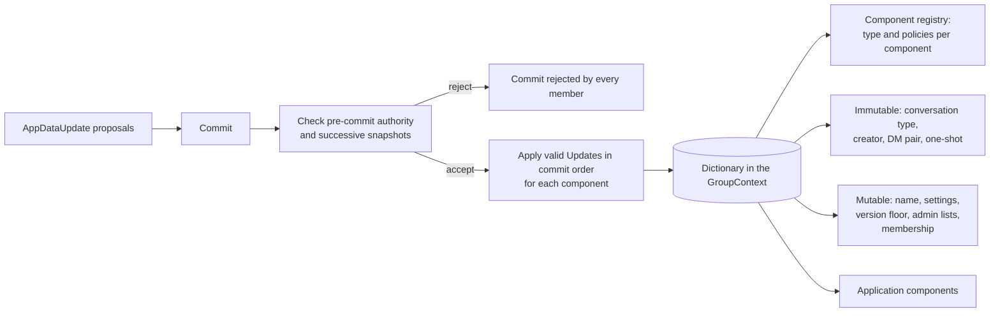

# Group metadata and app data

The app-data dictionary in the MLS group context carries the group's identity, settings, role lists, membership, and component registry. This spec owns the component ids, snapshot and delta encodings, structural checks, and the metadata an app reads.

The dictionary's bytes enter the MLS key schedule. Members that compute different bytes for one epoch cannot read each other's messages.



## Scope

In scope: component ids; snapshot and Update payload encodings; component structure and byte limits; creation of metadata; preservation of untouched bytes; write-once components; disappearing settings and expiry; version-floor encoding; and what an SDK exposes about metadata.

Out of scope: policy semantics and roles (`PERM`); proposal-list validity, commit validation, membership, and version-floor enforcement (`GMOD`); the commit-log signer and one-shot payload (`FORK`); DM identity and policy (`DMS`); consent (`CONS`); message content types (`CTYPE`); and archives (`ARCH`).

| Related | Relation |
| --- | --- |
| `PERM-005`, `PERM-010`, `PERM-012`, `PERM-017` | Own hardcoded authority, pre-commit authorization, denial of unregistered writes, and action-policy validity. |
| `GMOD-001`, `GMOD-005`, `GMOD-021` | Own permitted proposal types, membership content, and validation before commit application. |
| `DMS` | Reads `CONVERSATION_TYPE` and `DM_MEMBERS` from this spec and owns what a DM is. |
| `JOIN-057`, `GMOD-022`, `GMOD-025`, `GMOD-026`, `GMOD-027` | Own Welcome holds, commit pauses, the monotonic floor, and version comparison. |
| `FORK-010`, `FORK-050` | Own the signer key and the one-shot recovery payload. |

## Terms

| Term | Meaning |
| --- | --- |
| Dictionary | The `app_data_dictionary` group context extension ([draft-ietf-mls-extensions §7.2.1](https://www.ietf.org/archive/id/draft-ietf-mls-extensions-08.html#section-7.2.1)): the map from component id to value bytes every member holds in its GroupContext. |
| Component | One entry of the dictionary: a component id and its value bytes. |
| Component id | The 16-bit key of a component. Its ranges are stated in section 1. |
| Well-known component | A component in the XMTP range whose id, type, and encoding section 2 fixes. |
| Application component | A component in the application range; registration and write authority follow PERM-010 and PERM-012. |
| Registry | `COMPONENT_REGISTRY`: the map from component id to a `ComponentMetadata` entry that states the component's type and write policies. |
| Hardcoded component | `COMPONENT_REGISTRY` and `SUPER_ADMIN_LIST`: components whose write authority PERM-005 fixes in place of a registry entry. |
| Immutable component | A component whose id lies in an immutable sub-range: written once and never updated or removed. |
| Update, Remove | The operations of an `AppDataUpdate` proposal ([draft-ietf-mls-extensions-08 §4.7](https://www.ietf.org/archive/id/draft-ietf-mls-extensions-08.html#section-4.7)), distinct from MLS leaf-node Update and Remove proposals. |
| Delta | The payload of an Update for a set or map component: an ordered list of mutations applied to the prior snapshot. |
| Snapshot | The full value the dictionary stores for a component. |
| Pre-commit dictionary | The dictionary of the epoch before the commit being validated. |
| Version floor | The value of `MIN_SUPPORTED_PROTOCOL_VERSION`: the lowest client version that may process the group. |
| Paused | The state of a group whose version floor is greater than the client's version. |
| Disappearing settings | The timestamp `MESSAGE_DISAPPEAR_FROM_NS` and duration `MESSAGE_DISAPPEAR_IN_NS`, interpreted under META-050. |
| Expiry | The deadline assigned under META-050; app visibility and deletion are governed separately by META-051 and META-063. |
| Application message | A stored message of the application kind: one an installation sent, as opposed to the record a client stores for a commit or a join. |
| Membership-change message | A message for a commit or join that carries a `GroupUpdated` payload. |

## 1. The dictionary and its key space

The dictionary is the required representation for the metadata in this spec. Previously migrated groups can have this representation too. Active readers do not use legacy XMTP extensions as a fallback; legacy-only groups lack required dictionary state. A dictionary-bearing group can retain ignored legacy extensions. GMOD-001 owns rejection of `GroupContextExtensions` proposals, subject to the pre-commit floor pause in GMOD-025.

The dictionary and `AppDataUpdate` use [draft-ietf-mls-extensions-08 §4.7](https://www.ietf.org/archive/id/draft-ietf-mls-extensions-08.html#section-4.7). Their identifiers are registered in [§7.2.1](https://www.ietf.org/archive/id/draft-ietf-mls-extensions-08.html#section-7.2.1) and [§7.3.1](https://www.ietf.org/archive/id/draft-ietf-mls-extensions-08.html#section-7.3.1). XMTP assigns the component ids below.

| Range | Use |
| --- | --- |
| `0x0000`–`0x7FFF` | Outside the component space |
| `0x8000`–`0xBDFF` | Well-known mutable components |
| `0xBE00`–`0xBFFF` | Well-known immutable components |
| `0xC000`–`0xFCFF` | Application mutable components |
| `0xFD00`–`0xFEFF` | Application immutable components |
| `0xFF00`–`0xFFFF` | Reserved |

Registry keys use the component id encoding in META-005. Every assigned XMTP or application id takes 4 bytes in that encoding.

GMOD-030 owns rejection of invalid proposal lists under the draft's section 4.7, including mixed Update and Remove operations and repeated Removes for one component. META-064 governs successive XMTP payloads in a valid list. META-010 and META-013 own payload decoding and delta application.

| ID | Title | Requirement | Why |
| --- | --- | --- | --- |
| META-002 | Required capabilities | When a client creates a group, it MUST list the extension type `app_data_dictionary` (`0x0006`) and the proposal type `app_data_update` (`0x0008`) in the group's `RequiredCapabilities` extension ([RFC 9420 §7.2](https://www.rfc-editor.org/rfc/rfc9420.html#section-7.2)). | An installation that does not advertise them cannot read the dictionary or process a commit that updates it. Once added, it forks the group at its first update. |
| META-003 | Reserved ids are never used | When an Update or Remove targets a component id in the reserved range of section 1, the client MUST reject the commit. | |
| META-004 | Immutable components are written once | When an immutable component is absent, the client MUST permit one initial scalar value or insert-only collection delta that passes authorization and structural validation. It MUST reject every Remove and every Update after that first value, including a later Update in the same commit. | Changing a conversation type or DM pair invalidates the checks made at join time. |
| META-005 | Component id encoding | When a client encodes a component id inside a component value, it MUST use the QUIC variable-length integer encoding of [RFC 9000 §16](https://www.rfc-editor.org/rfc/rfc9000.html#section-16), and MUST reject a value that decodes to more than `0xFFFF`. | |

## 2. Well-known components

The well-known component table gives ids, type tags, snapshot encodings, and byte limits. Creation is governed by META-018. The snapshot is the value in the dictionary; it is not necessarily the Update payload.

Collection snapshots contain sorted, unique keys (META-012). Collection Updates carry ordered mutation sequences (META-013). Scalars carry the replacement value directly.

| Id | Name | `component_type` suffix | Snapshot encoding |
| --- | --- | --- | --- |
| `0x8000` | `COMPONENT_REGISTRY` | `TLS_MAP_BYTES_BYTES` | `RegistryMap<ComponentId, ByteString>`; values are serialized `ComponentMetadata` |
| `0x8001` | `SUPER_ADMIN_LIST` | `TLS_SET_INBOX_ID` | `TlsSet<InboxId>` |
| `0x8002` | `ADMIN_LIST` | `TLS_SET_INBOX_ID` | `TlsSet<InboxId>` |
| `0x8003` | `GROUP_MEMBERSHIP` | `TLS_MAP_INBOX_ID_BYTES` | `TlsMap<InboxId, ByteString>`; values are serialized `GroupMembershipEntry` (GMOD-005) |
| `0x8004` | `GROUP_NAME` | `STRING` | UTF-8, at most 100 bytes |
| `0x8005` | `GROUP_DESCRIPTION` | `STRING` | UTF-8, at most 1000 bytes |
| `0x8006` | `GROUP_IMAGE_URL` | `STRING` | UTF-8, at most 2048 bytes |
| `0x8007` | `MESSAGE_DISAPPEAR_FROM_NS` | `BYTES` | 8-byte big-endian signed integer; nanoseconds since the Unix epoch |
| `0x8008` | `MESSAGE_DISAPPEAR_IN_NS` | `BYTES` | 8-byte big-endian signed integer; duration in nanoseconds |
| `0x8009` | `APP_DATA` | `STRING` | UTF-8, at most 8192 bytes |
| `0x800A` | `MIN_SUPPORTED_PROTOCOL_VERSION` | `STRING` | UTF-8 version under [Semantic Versioning 2.0.0 §2](https://semver.org/spec/v2.0.0.html#spec-item-2) |
| `0x800B` | `COMMIT_LOG_SIGNER` | `BYTES` | Raw signing-key bytes of FORK-010 |
| `0xBFFF` | `CONVERSATION_TYPE` | `BYTES` | 4-byte big-endian value of a defined `ConversationType` other than `CONVERSATION_TYPE_UNSPECIFIED` |
| `0xBFFE` | `CREATOR_INBOX_ID` | `BYTES` | One `InboxId` |
| `0xBFFD` | `DM_MEMBERS` | `TLS_SET_INBOX_ID` | `TlsSet<InboxId>` with exactly two entries |
| `0xBFFC` | `ONESHOT_MESSAGE` | `BYTES` | Serialized `OneshotMessage` of FORK section 6 |

The collection wire block below uses TLS presentation language. `K` and `T` are type parameters, with the concrete substitutions in the type table below. `<V>` is the variable-length byte-count prefix of [RFC 9420 §2.1.2](https://www.rfc-editor.org/rfc/rfc9420.html#section-2.1.2). Each `ByteString`, including a byte-string key, carries its own prefix. Scalar payloads have no extra prefix inside `ComponentData`. `TlsSet<K>` is `TlsMap<K, Empty>`; an empty value has no bytes or length prefix.

```tls
opaque ByteString<V>;
struct {} Empty;

struct {
    K key;
    T value;
} TlsMapEntry;

struct {
    TlsMapEntry entries<V>;
} TlsMap;

enum { insert(0), update(1), delete(2) } TlsMapMutationType;   // one byte

struct {
    TlsMapMutationType type;
    K key;
    select (type) {
        case insert: T value;
        case update: T value;
        case delete: struct {};
    };
} TlsMapMutation;

struct {
    TlsMapMutation mutations<V>;
} TlsMapDelta;

enum { insert(0), remove(1), remove_by_hash(2) } TlsSetMutationType;   // one byte

struct {
    TlsSetMutationType type;
    select (type) {
        case insert: K key;
        case remove: K key;
        case remove_by_hash: opaque hash[32];   // SHA-256 of the TLS encoding of the key
    };
} TlsSetMutation;

struct {
    TlsSetMutation mutations<V>;
} TlsSetDelta;

struct {
    varint version;                 // QUIC varint; 0, one byte
    opaque id[32];
} InboxId;
```

The type table uses suffixes of the `COMPONENT_TYPE_` enum values below. `RegistryMap` is the registry-specific `TlsMap<ComponentId, ByteString>` encoding. Despite its `TLS_MAP_BYTES_BYTES` tag, its keys are component ids under META-005, without a byte-string prefix. Its Update payload is `TlsMapDelta<ComponentId, ByteString>`.

| Type suffix | Snapshot | Update payload |
| --- | --- | --- |
| `BYTES` | Raw bytes | Replacement raw bytes |
| `STRING` | UTF-8 bytes | Replacement UTF-8 bytes |
| `TLS_MAP_BYTES_BYTES` | `TlsMap<ByteString, ByteString>` | `TlsMapDelta<ByteString, ByteString>` |
| `TLS_MAP_INBOX_ID_BYTES` | `TlsMap<InboxId, ByteString>` | `TlsMapDelta<InboxId, ByteString>` |
| `TLS_SET_BYTES` | `TlsSet<ByteString>` | `TlsSetDelta<ByteString>` |
| `TLS_SET_INBOX_ID` | `TlsSet<InboxId>` | `TlsSetDelta<InboxId>` |

```proto
// The data structure type of a component's value
enum ComponentType {
  COMPONENT_TYPE_UNSPECIFIED = 0;
  // Opaque bytes, replaced atomically
  COMPONENT_TYPE_BYTES = 1;
  // A utf-8 encoded string, replaced atomically
  COMPONENT_TYPE_STRING = 2;
  // A TlsMap<bytes, bytes> supporting key-level insert/update/delete via deltas
  COMPONENT_TYPE_TLS_MAP_BYTES_BYTES = 3;
  // A TlsMap<InboxId, bytes> supporting key-level insert/update/delete via deltas
  COMPONENT_TYPE_TLS_MAP_INBOX_ID_BYTES = 4;
  // A `TlsSet<bytes>` supporting insert/remove/remove-by-hash via deltas
  COMPONENT_TYPE_TLS_SET_BYTES = 5;
  // A `TlsSet<InboxId>` supporting insert/remove/remove-by-hash via deltas
  COMPONENT_TYPE_TLS_SET_INBOX_ID = 6;
}

message ComponentPermissions {
  // Policy for inserting a new value (component does not yet exist)
  MetadataPolicy insert_policy = 1;
  // Policy for updating an existing value
  MetadataPolicy update_policy = 2;
  // Policy for deleting a value
  MetadataPolicy delete_policy = 3;
}

message ComponentMetadata {
  // The data structure type of the component's value
  ComponentType component_type = 1;
  // Permission policies for this component, evaluated against regular
  // (member-issued) commits.
  ComponentPermissions permissions = 2;
  // Permission policies for this component, evaluated against MLS External
  // Commits (RFC 9420 §12.4.3.2). Absent / unset is equivalent to all-Deny:
  // external committers cannot touch this component.
  ComponentPermissions external_committer_permissions = 3;
}
```

`MetadataPolicy` is defined in PERM section 2. PERM-008 owns policy evaluation failure, and PERM-017 owns action-policy validity and the restricted admin policies. Structural decoding of an entry is separate from type dispatch and policy evaluation. An entry with an unknown or unspecified `component_type` can be structurally complete; it supplies no supported dispatch type. A present policy field can still contain an invalid policy tree.

The registry retains raw entry bytes, including entries that cannot be decoded or used. An authorized delta can repair or delete a mutable entry. Preservation applies to entries that the commit does not change (META-016), not to every entry in every later snapshot.

| ID | Title | Requirement | Why |
| --- | --- | --- | --- |
| META-010 | Encodings are binding | The client MUST encode snapshots and Update payloads under the well-known component table, collection wire block, and type table above, including the registry-specific encoding. For an Update, it MUST decode the replacement scalar or collection delta, apply a delta to the preceding snapshot or an empty collection when absent, and reject the commit if decoding, application, or validation of the resulting snapshot and its stated byte limits fails. When a component has no built-in definition and its registry entry has an unknown or unspecified type, it MUST reject writes to that component. | A payload and a snapshot have different encodings for collections. |
| META-011 | Inbox id encoding | A client MUST encode an inbox id inside a component as the `InboxId` structure above, with a `version` of 0, and MUST reject a value whose `version` is not the single byte `0x00`. | |
| META-012 | Sorted collection snapshots | The client MUST encode each `TlsMap` or `TlsSet` snapshot with unique keys in ascending order, and MUST reject a snapshot that is not in that form. It MUST compare component ids numerically and byte-string and inbox-id keys lexicographically by their value bytes. | Different encodings of one set produce different group contexts. |
| META-013 | Deltas apply atomically | The client MUST apply delta mutations in their listed order, with each mutation using the preceding mutation's result, and MUST NOT reject a delta merely for repeated or unsorted keys. It MUST resolve `remove_by_hash` against the snapshot before that delta, using SHA-256 of the key's TLS encoding. If an insert names a present key, an update or deletion names an absent key, or a hash does not identify exactly one key, it MUST reject the commit without applying any of its changes. | Partial application gives members different snapshots. |
| META-014 | Registry entry form | When a registry delta names an id below the component space, reserved, or hardcoded, or inserts or updates bytes that do not decode as `ComponentMetadata` with `permissions` and all three member policy fields present, the client MUST reject the commit. It MUST also apply the policy-validity checks of PERM-017 to the resulting action policies. | A missing policy cannot authorize a later write. |
| META-015 | Registry and immutable entries persist | When an `AppDataUpdate` removes `COMPONENT_REGISTRY`, or a registry delta updates or deletes an immutable component's entry, the client MUST reject the commit. | Removing the registry prevents later authorization; changing an immutable entry can change interpretation of fixed bytes. |
| META-016 | Untouched registry entries are preserved | When a commit does not explicitly change a registry entry, the client MUST preserve that entry's bytes, including unknown protobuf fields and entries it cannot interpret. | Re-encoding an untouched entry can remove bytes that other members retain. |
| META-017 | Untouched components pass through | When a client applies a commit, it MUST leave the bytes of every component the commit does not target unchanged, including a component it cannot decode. | |
| META-018 | What a creator writes | When a client creates a group, it MUST populate the epoch-0 dictionary with `COMPONENT_REGISTRY`, `SUPER_ADMIN_LIST`, `ADMIN_LIST`, `GROUP_MEMBERSHIP`, `MIN_SUPPORTED_PROTOCOL_VERSION`, `CONVERSATION_TYPE`, and `CREATOR_INBOX_ID`, with the creator set to its own inbox id. It MUST include each supplied name, description, image URL, app-data string, and disappearing setting, and omit each unsupplied optional value. It MUST initialize role lists under PERM-002 or DMS-002, the DM pair under DMS-002, and the signer and one-shot payload under FORK-010 and FORK-050. | |
| META-019 | A joiner needs the identity | When a Welcome's group context has no dictionary, or its dictionary lacks `COMPONENT_REGISTRY`, `CONVERSATION_TYPE`, or `CREATOR_INBOX_ID`, or one of those does not decode under the table above, the client MUST record a terminal rejection for the Welcome (JOIN-048). | Without them the joiner cannot tell which checks JOIN-060 demands of the group. |

## 3. Applying an update

META-010 owns payload decoding and snapshot validation. PERM-010 fixes authorization to the pre-commit registry. These are separate inputs: sequential Updates use the preceding snapshot for delta application, while their authority still comes from the pre-commit state.

PERM-014 owns acceptance of components without built-in definitions. Their supported registry type selects the encoding in section 2. Component-specific invariants unknown to this client cannot be checked (Known limitations).

PERM-012 rejects writes without a usable registry entry, PERM-008 denies malformed policies, and META-010 rejects unsupported type dispatch. These rules do not prevent an authorized change to the registry entry itself. PERM-001 and PERM-005 own role evaluation and hardcoded write authority.

| ID | Title | Requirement | Why |
| --- | --- | --- | --- |
| META-064 | Successive Updates use successive snapshots | When a valid commit carries successive Updates for one component, the client MUST validate and apply each XMTP payload against the snapshot produced by the preceding Update, in the order defined by [draft-ietf-mls-extensions-08 §4.7](https://www.ietf.org/archive/id/draft-ietf-mls-extensions-08.html#section-4.7). | A transition check against the original snapshot can miss a change made by an earlier Update. |

## 4. Immutable metadata

Four components describe what a group is and never change: the conversation type, the creator, the DM pair, and the one-shot payload. They are immutable under META-004, so a joiner that validates them under JOIN-060 validates them for the life of the group.

```proto
// Defines the type of conversation
enum ConversationType {
  CONVERSATION_TYPE_UNSPECIFIED = 0;
  CONVERSATION_TYPE_GROUP = 1;
  CONVERSATION_TYPE_DM = 2;
  CONVERSATION_TYPE_SYNC = 3;
  CONVERSATION_TYPE_ONESHOT = 4;
}
```

`CONVERSATION_TYPE` selects the checks required by JOIN-060. DMS-002 owns the DM pair at creation, PERM-002 owns non-DM role initialization, and PERM-004 owns the non-empty super-admin invariant.

| ID | Title | Requirement | Why |
| --- | --- | --- | --- |
| META-030 | The DM pair is exactly two | When `DM_MEMBERS` is present and does not decode to a set of exactly two `InboxId` values, the client MUST reject the Welcome or commit that carries it. | A pair of one or three is not a conversation between two people, and DMS derives the conversation's identifier from exactly two. |

## 5. Mutable settings and what an app reads

The name, description, image URL, and app-data string are free text an app chooses; the client bounds them (META-010) and otherwise passes them through. A component that was never set is absent from the dictionary, and absent and empty are different bytes, so an app is given one answer for both: the empty string.

An app can guard an `APP_DATA` write with the value it read before it computed the new one. The guard is compared with the committed `APP_DATA` string of the group state the commit is prepared on, so a value another member committed in the meantime is detected and not overwritten. SEND-017 owns what a guard miss does to the intent.

A commit that changes a setting is recorded for the app as a membership-change message whose `GroupUpdated` payload lists each changed field by a stable name. The names below are what an app matches on, and an app written against them keeps working whatever the component id behind a name.

| Component | `field_name` | `old_value` and `new_value` form |
| --- | --- | --- |
| `GROUP_NAME` | `group_name` | The string |
| `GROUP_DESCRIPTION` | `description` | The string |
| `GROUP_IMAGE_URL` | `group_image_url_square` | The string |
| `MESSAGE_DISAPPEAR_FROM_NS` | `message_disappear_from_ns` | The integer in decimal |
| `MESSAGE_DISAPPEAR_IN_NS` | `message_disappear_in_ns` | The integer in decimal |
| `MIN_SUPPORTED_PROTOCOL_VERSION` | `minimum_supported_protocol_version` | The string |
| `COMMIT_LOG_SIGNER` | `_commit_log_signer` | The bytes in lowercase hex |
| `APP_DATA` | `app_data` | The string |

```proto
message GroupUpdated {
  // Other fields and nested messages omitted.
  // A summary of a change to the mutable metadata
  message MetadataFieldChange {
    // The field that was changed
    string field_name = 1;
    // The previous value
    optional string old_value = 2;
    // The updated value
    optional string new_value = 3;
  }

  // The metadata changes in the commit
  repeated MetadataFieldChange metadata_field_changes = 4;
}
```

| ID | Title | Requirement | Why |
| --- | --- | --- | --- |
| META-040 | Changes are recorded by name | When a commit changes the value of a component in the table above, the client MUST record in the membership-change message it stores for that commit a `GroupUpdated.MetadataFieldChange` as defined above, whose `field_name` and value form are the table's, with `old_value` absent when the component was absent before, and MUST NOT record a change for a component whose value the commit left equal. | An app reads the change log by field name, and a change recorded for an unchanged value shows the user an edit nobody made. |
| META-041 | Absent reads as empty | An SDK MUST present an absent `GROUP_NAME`, `GROUP_DESCRIPTION`, `GROUP_IMAGE_URL`, or `APP_DATA` to an app as the empty string. | |
| META-065 | A guard compares the committed app data | When an app supplies an expected value with an `APP_DATA` write, the client MUST compare it as a UTF-8 string with the `APP_DATA` value in the dictionary of the group state it prepares the commit on, and MUST NOT prepare the commit unless the two are equal. An absent `APP_DATA` component MUST NOT be equal to any expected value. | A write built on a value another member has since replaced overwrites that member's change, and neither app sees a conflict. |

## 6. Disappearing messages

Disappearing settings define a start timestamp and a duration. META-050 uses the backend's `sent_at_ns` as the start of each eligible message's lifespan. META-051 excludes expired messages from app reads. META-063 governs later deletion from local storage.

The backend retains messages under its retention policy. A recipient can keep a copy outside the client. This feature does not erase copies already handed to an app.

| ID | Title | Requirement | Why |
| --- | --- | --- | --- |
| META-050 | Expiry from the sent time | When the client first stores a published application message, it MUST assign an expiry exactly when both disappearing settings are present and positive and `sent_at_ns` is not less than `MESSAGE_DISAPPEAR_FROM_NS`. It MUST compute that expiry as `sent_at_ns` plus `MESSAGE_DISAPPEAR_IN_NS` using checked signed 64-bit addition, with a result above `9223372036854775807` clamped to that value. It MUST retain that expiry through later setting changes and MUST NOT assign a disappearing expiry to a membership-change message. | Processing-time expiry gives an offline installation a longer retention period. |
| META-051 | Expired messages are hidden | When a message's expiry is not later than the current time, the client MUST exclude it from history queries, direct message-id lookups, and new stream deliveries to an app. | A delayed delete must not extend the message's visible life. |
| META-063 | Delete at the cleanup pass | When a local disappearing-message cleanup pass completes successfully, the client MUST have deleted every published application message whose expiry was not later than the time that pass began. | A sender relies on cooperating recipients removing expired local copies. |
| META-052 | Settings are readable and settable | An SDK MUST let an app read a conversation's disappearing settings, set both values, and clear them. It MUST report them as enabled exactly when both values are present and greater than 0. | |

## 7. The protocol version floor

A group can require a minimum client version. Section 2 owns the component's encoding. GMOD-026 owns monotonic changes, GMOD-027 owns version comparison and malformed-floor handling, and JOIN-057 owns the Welcome hold.

GMOD-022 requires every other validation check to pass before a floor-setting commit can pause the group. Authorization alone is insufficient. GMOD-025 owns the publication stop and resumption point; its hold follows PROC-012.

PERM-023 owns the prior floor bump for changed acceptance rules, including new registry-entry formats, component types, and delta mutations.

| ID | Title | Requirement | Why |
| --- | --- | --- | --- |
| META-062 | Apps see the pause | An SDK MUST let an app read whether a group is paused and the floor it is paused for. | |

## Known limitations

A client cannot apply a component whose type or entry format it cannot interpret. Without the preceding floor bump described in section 7, a commit using that form can be accepted by newer clients and rejected by older clients.

A component without a built-in definition is applied by its supported registry type (PERM-014 and META-010). An older client cannot check a component-specific bound or transition rule introduced by a later release.

An absent immutable collection can receive an authorized insert-only delta. A scalar's first Update is currently rejected, even when absent. This differs from the uniform write-once contract in META-004.

Every rejection of an `AppDataUpdate` proposal, whether for authority, for a malformed payload, or for an invariant, is reported to the sender as one error kind. An app cannot tell a permission failure from a malformed value.

Current expiry uses processing time plus the duration, without the sent-time threshold or checked addition required by META-050. History queries exclude expired messages, but direct message-id lookups can return them until deletion, contrary to META-051. Cleanup depends on local execution; META-063 imposes no wall-clock deadline while the client or cleanup work is stopped. Apps can retain copies already delivered to them.

Legacy-only groups lack the dictionary identity required by META-019. This spec defines no migration procedure. Previously migrated groups and dictionary-bearing groups with ignored legacy extensions are not excluded.
