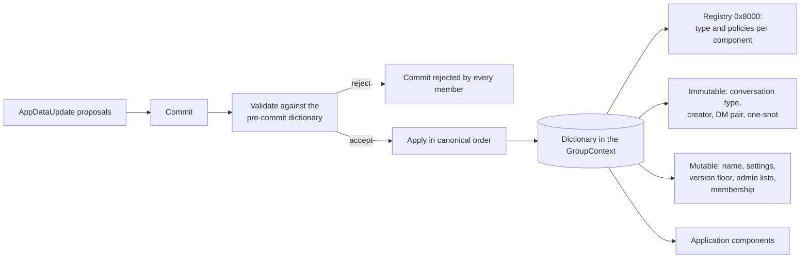

# Group metadata and app data

Everything a group carries besides its messages lives in one place: the app-data dictionary in its MLS group context. The dictionary holds the group's immutable identity (its conversation type, its creator, the two inboxes of a DM), its mutable settings (name, description, image, disappearing-message settings, the protocol version floor, an opaque app-data string, the commit-log signer), the admin lists, the membership map, and a registry that says what each entry is and who may write it. An application can add entries of its own without a client release.

The dictionary is part of the GroupContext, so its bytes feed the MLS key schedule. Two members that hold different bytes for one epoch derive different keys and cannot read each other's messages. Every rule in this spec that fixes an encoding, an order, or a rejection exists so that every member computes the same bytes from the same commit.



## Scope

In scope: the dictionary as the only carrier of group state; the component id key space; the well-known components, their encodings, and which a creator writes; the registry entry format; validation of a component value when it is decoded or applied; preservation of entries a client cannot read; write-once components; the order in which one commit's updates apply; the disappearing-message settings and the expiry they give a message; the protocol version floor and the paused state; what an SDK exposes about them; and the disposition of the legacy group-context extensions.

Out of scope: who may write a component and how a policy is evaluated (`?PERM`); how a proposal and a commit are built, published, and validated as MLS objects (`?GMOD`); the content of the membership map (`?GMOD`); the use of the commit-log signer and the one-shot payload (`?FORK`); the meaning of the DM pair (`DMS`); consent (`?CONS`); the content types of messages (`?CTYPE`); and the archive (`?ARCH`).

| Related | Relation |
| --- | --- |
| `?PERM` | Owns the policies a registry entry carries, their evaluation against a proposer, the fixed authority over the hardcoded components, and the admin lists' semantics. This spec owns the registry's format and the dictionary's structural rules. |
| `?GMOD` | Owns the `AppDataUpdate` proposal and commit flow, the membership map's content, and steady-state commit validation. This spec owns what the proposals may target and how their payloads decode and apply. |
| `DMS` | Reads `CONVERSATION_TYPE` and `DM_MEMBERS` from this spec and owns what a DM is. |
| `JOIN-057` | Holds a Welcome whose version floor is above the client's. This spec owns the floor. |
| `?FORK` | Owns what `COMMIT_LOG_SIGNER` and `ONESHOT_MESSAGE` are used for. |

## Terms

| Term | Meaning |
| --- | --- |
| Dictionary | The `app_data_dictionary` group context extension ([draft-ietf-mls-extensions §7.2.1](https://www.ietf.org/archive/id/draft-ietf-mls-extensions-08.html#section-7.2.1)): the map from component id to value bytes every member holds in its GroupContext. |
| Component | One entry of the dictionary: a component id and its value bytes. |
| Component id | The 16-bit key of a component. Its ranges are stated in section 1. |
| Well-known component | A component in the XMTP range whose id, type, and encoding section 2 fixes. |
| Application component | A component in the application range that an app registers in a group's registry before it writes to it. |
| Registry | The component at `0x8000`: the map from component id to a `ComponentMetadata` entry that states the component's type and write policies. |
| Hardcoded component | `0x8000` and `0x8001`: components whose write authority `?PERM` fixes in place of a registry entry. |
| Immutable component | A component whose id lies in an immutable sub-range: written once and never updated or removed. |
| Update, Remove | The two operations of an `AppDataUpdate` proposal ([draft-ietf-mls-extensions §7.3.1](https://www.ietf.org/archive/id/draft-ietf-mls-extensions-08.html#section-7.3.1)). |
| Delta | The payload of an Update for a set or map component: an ordered list of mutations applied to the prior snapshot. |
| Snapshot | The full value the dictionary stores for a component. |
| Pre-commit dictionary | The dictionary of the epoch before the commit being validated. |
| Version floor | The value of `MIN_SUPPORTED_PROTOCOL_VERSION`: the lowest client version that may process the group. |
| Paused | The state of a group whose version floor is greater than the client's version. |
| Disappearing settings | The pair `MESSAGE_DISAPPEAR_FROM_NS` and `MESSAGE_DISAPPEAR_IN_NS`. They are enabled when both are present and greater than 0. |
| Expiry | The instant from which an application message is not returned to an app and is deleted from local storage. |
| Application message | A stored message of the application kind: one an installation sent, as opposed to the record a client stores for a commit or a join. |
| Membership-change message | The message a client stores for a commit or a join, carrying a `GroupUpdated` payload. Owned by `?PROC`. |

## 1. The dictionary and its key space

XMTP keeps every group setting as a component of the dictionary and nothing in any other group context extension of its own. The legacy XMTP extensions, the `ImmutableMetadata` extension and the three `Unknown` extensions `0xff00`, `0xff01`, and `0xff02`, are retired: a current client neither writes them nor reads them, and it rejects the `GroupContextExtensions` proposal that was the only way to change them. A group that still carries them is unreadable by a current client (Known limitations).

The dictionary's own wire format, its `ComponentID` and `ComponentData` structures, and the `AppDataUpdate` proposal are defined by [draft-ietf-mls-extensions §4.1](https://www.ietf.org/archive/id/draft-ietf-mls-extensions-08.html#section-4.1), [§7.2.1](https://www.ietf.org/archive/id/draft-ietf-mls-extensions-08.html#section-7.2.1), and [§7.3.1](https://www.ietf.org/archive/id/draft-ietf-mls-extensions-08.html#section-7.3.1), and are not restated here. XMTP uses the top half of the 16-bit id space and splits it as follows. Immutable components sit at the end of each block.

| Range | Use |
| --- | --- |
| `0x0000`–`0x7FFF` | Outside the component space |
| `0x8000`–`0xBDFF` | Well-known mutable components |
| `0xBE00`–`0xBFFF` | Well-known immutable components |
| `0xC000`–`0xFCFF` | Application mutable components |
| `0xFD00`–`0xFEFF` | Application immutable components |
| `0xFF00`–`0xFFFF` | Reserved |

Wherever XMTP writes a component id inside a component value (a registry key), it uses the QUIC variable-length integer encoding of [RFC 9000 §16](https://www.rfc-editor.org/rfc/rfc9000.html#section-16), so that the id can grow past 16 bits without a new format. Every id in the ranges above takes 4 bytes under that encoding.

A commit can carry several `AppDataUpdate` proposals, inline or by reference, and two of them can target one component. The dictionary each member ends with depends on the order they apply in, and the validator's verdict depends on the order it evaluates them in. One order is fixed for both so that the state a validator authorizes is the state the dictionary receives.

| ID | Title | Requirement | Why |
| --- | --- | --- | --- |
| META-001 | Reject group context extension proposals | When a commit or a standalone proposal carries a `GroupContextExtensions` proposal, the client MUST reject it. | The legacy extensions carried a second copy of state the dictionary owns. A member that applies one holds settings the others do not. |
| META-002 | Required capabilities | When a client creates a group, it MUST list the extension type `app_data_dictionary` (`0x0006`) and the proposal type `app_data_update` (`0x0008`) in the group's `RequiredCapabilities` extension ([RFC 9420 §7.2](https://www.rfc-editor.org/rfc/rfc9420.html#section-7.2)). | An installation that does not advertise them cannot read the dictionary or process a commit that updates it. Once added, it forks the group at its first update. |
| META-003 | Reserved ids are never used | When an Update or Remove targets a component id in `0xFF00`–`0xFFFF`, or a registry delta names such an id, the client MUST reject the commit. | Those ids have no type any client can dispatch on, so a value under one can never converge. |
| META-004 | Immutable components are written once | When an Update or Remove targets an immutable component that is present in the pre-commit dictionary, the client MUST reject the commit. | A conversation type or a DM pair that can change after the join makes every check a joiner made under JOIN-060 void. |
| META-005 | Component id encoding | When a client encodes a component id inside a component value, it MUST use the QUIC variable-length integer encoding of [RFC 9000 §16](https://www.rfc-editor.org/rfc/rfc9000.html#section-16), and MUST reject a value that decodes to more than `0xFFFF`. | |
| META-006 | One order for every member | When a commit carries more than one `AppDataUpdate` proposal, the client MUST apply and validate them in ascending component id, with a Remove before an Update for the same id, and otherwise in the order the commit lists them. | Two members that order them differently compute different snapshots for one epoch, and the one that reordered fails the confirmation tag. |

## 2. Well-known components

The table below is the contract between every client on the network: the id a value is stored under, the type its registry entry declares, and the bytes it is encoded as. A value that decodes on one client and not on another is a fork waiting for the next commit, so each client validates a value against this table when it applies it, not only when it reads it back.

Sets and maps carry a snapshot in the dictionary and a delta on the wire. Every collection is sorted by key so that two clients that hold the same entries hold the same bytes.

| Id | Name | `component_type` | Value encoding | Creator writes it |
| --- | --- | --- | --- | --- |
| `0x8000` | `COMPONENT_REGISTRY` | `TLS_MAP_BYTES_BYTES` | `TlsMap` from `ComponentId` to the serialized `ComponentMetadata` of that component | Always |
| `0x8001` | `SUPER_ADMIN_LIST` | `TLS_SET_INBOX_ID` | `TlsSet` of `InboxId` | Always |
| `0x8002` | `ADMIN_LIST` | `TLS_SET_INBOX_ID` | `TlsSet` of `InboxId` | Always |
| `0x8003` | `GROUP_MEMBERSHIP` | `TLS_MAP_INBOX_ID_BYTES` | `TlsMap` from `InboxId` to a serialized `GroupMembershipEntry` (`?GMOD`) | Always |
| `0x8004` | `GROUP_NAME` | `STRING` | UTF-8, at most 100 bytes | When set |
| `0x8005` | `GROUP_DESCRIPTION` | `STRING` | UTF-8, at most 1000 bytes | When set |
| `0x8006` | `GROUP_IMAGE_URL` | `STRING` | UTF-8, at most 2048 bytes | When set |
| `0x8007` | `MESSAGE_DISAPPEAR_FROM_NS` | `BYTES` | Exactly 8 bytes: a big-endian signed 64-bit integer | When set |
| `0x8008` | `MESSAGE_DISAPPEAR_IN_NS` | `BYTES` | Exactly 8 bytes: a big-endian signed 64-bit integer | When set |
| `0x8009` | `APP_DATA` | `STRING` | UTF-8, at most 8192 bytes | When set |
| `0x800A` | `MIN_SUPPORTED_PROTOCOL_VERSION` | `STRING` | UTF-8: a version under [Semantic Versioning 2.0.0 §2](https://semver.org/spec/v2.0.0.html#spec-item-2) | Always |
| `0x800B` | `COMMIT_LOG_SIGNER` | `BYTES` | Exactly 32 bytes (`?FORK`) | When the deployment keeps a commit log |
| `0xBFFF` | `CONVERSATION_TYPE` | `BYTES` | Exactly 4 bytes: the big-endian value of a `ConversationType` other than `CONVERSATION_TYPE_UNSPECIFIED` | Always |
| `0xBFFE` | `CREATOR_INBOX_ID` | `BYTES` | One `InboxId` | Always |
| `0xBFFD` | `DM_MEMBERS` | `TLS_SET_INBOX_ID` | `TlsSet` of exactly two `InboxId` | For a DM only |
| `0xBFFC` | `ONESHOT_MESSAGE` | `BYTES` | A serialized `OneshotMessage` (`?FORK`) | For a one-shot group only |

The XMTP-defined structures inside component values are TLS-encoded. `<V>` is the QUIC variable-length vector of [RFC 9420 §2.1.2](https://www.rfc-editor.org/rfc/rfc9420.html#section-2.1.2). A `TlsSet` is a `TlsMap` whose value is empty.

```tls
struct {
    K key;                          // TLS encoding of the key type
    V value;                        // TLS encoding of the value type; absent for a set
} TlsMapEntry;

struct {
    TlsMapEntry entries<V>;         // ascending by key, no duplicate key
} TlsMap;

enum { insert(0), update(1), delete(2) } TlsMapMutationType;   // one byte

struct {
    TlsMapMutationType type;
    K key;
    select (type) {
        case insert: V value;
        case update: V value;
        case delete: struct {};
    };
} TlsMapMutation;

struct {
    TlsMapMutation mutations<V>;    // applied in order, as one atomic change
} TlsMapDelta;

enum { insert(0), remove(1), remove_by_hash(2) } TlsSetMutationType;   // one byte

struct {
    TlsSetMutationType type;
    select (type) {
        case insert: K key;
        case remove: K key;
        case remove_by_hash: opaque hash[32];   // SHA-256 of the TLS encoding of the key
    };
} TlsSetMutation;

struct {
    TlsSetMutation mutations<V>;
} TlsSetDelta;

struct {
    varint version;                 // QUIC varint; 0, one byte
    opaque id[32];                  // the inbox id (?IDENT)
} InboxId;
```

A map component's `V` is an opaque byte string with a `<V>` length prefix. For `COMPONENT_REGISTRY` it holds a `ComponentMetadata`; the registry's value is the dict-storage snapshot, and the wire carries a `TlsMapDelta` whose keys are component ids. `?IDENT` is expected to state that an inbox id is 32 bytes.

```proto
// The data structure type of a component's value
enum ComponentType {
  COMPONENT_TYPE_UNSPECIFIED = 0;
  // Opaque bytes, replaced atomically
  COMPONENT_TYPE_BYTES = 1;
  // A utf-8 encoded string, replaced atomically
  COMPONENT_TYPE_STRING = 2;
  // A TlsMap<bytes, bytes> supporting key-level insert/update/delete via deltas
  COMPONENT_TYPE_TLS_MAP_BYTES_BYTES = 3;
  // A TlsMap<InboxId, bytes> supporting key-level insert/update/delete via deltas
  COMPONENT_TYPE_TLS_MAP_INBOX_ID_BYTES = 4;
  // A `TlsSet<bytes>` supporting insert/remove/remove-by-hash via deltas
  COMPONENT_TYPE_TLS_SET_BYTES = 5;
  // A `TlsSet<InboxId>` supporting insert/remove/remove-by-hash via deltas
  COMPONENT_TYPE_TLS_SET_INBOX_ID = 6;
}

message ComponentPermissions {
  // Policy for inserting a new value (component does not yet exist)
  MetadataPolicy insert_policy = 1;
  // Policy for updating an existing value
  MetadataPolicy update_policy = 2;
  // Policy for deleting a value
  MetadataPolicy delete_policy = 3;
}

message ComponentMetadata {
  // The data structure type of the component's value
  ComponentType component_type = 1;
  // Permission policies for this component, evaluated against regular
  // (member-issued) commits.
  ComponentPermissions permissions = 2;
  // Permission policies for this component, evaluated against MLS External
  // Commits (RFC 9420 §12.4.3.2). Absent / unset is equivalent to all-Deny:
  // external committers cannot touch this component.
  ComponentPermissions external_committer_permissions = 3;
}
```

`MetadataPolicy` and its evaluation are owned by `?PERM`, which is expected to state the base policies `ALLOW`, `DENY`, `ALLOW_IF_ADMIN`, and `ALLOW_IF_SUPER_ADMIN` and the `AndCondition` and `AnyCondition` combinators, and to require that the registry's `GROUP_MEMBERSHIP` and `ADMIN_LIST` entries hold complete policy trees when a group is joined and after every commit.

The registry is the one component that grows the dictionary's vocabulary, so its entries are validated on the wire with the same rules a local writer follows. An entry a client cannot validate, because a newer client wrote it under a format this one does not know, is carried untouched and treated as absent for authority: the client neither drops it nor honours it.

| ID | Title | Requirement | Why |
| --- | --- | --- | --- |
| META-010 | Encodings are binding | A client MUST encode every well-known component as the table above states, and MUST reject a commit whose Update payload for a well-known component does not decode under that encoding, or whose resulting value is longer than the bound the table gives it. | A value accepted by every member but decodable by none leaves the group with a setting nobody can read, and a bound enforced only at the sender is no bound. |
| META-011 | Inbox id encoding | A client MUST encode an inbox id inside a component as the `InboxId` structure above, with a `version` of 0, and MUST reject a value whose `version` is not the single byte `0x00`. | |
| META-012 | Sorted collections | A client MUST encode a `TlsMap` or `TlsSet` with its entries in ascending key order and no duplicate key, and MUST reject a snapshot or a delta that is not. | Two encodings of one set are two GroupContexts, and the members split on them. |
| META-013 | Deltas apply atomically | If a mutation of a delta inserts a key that is present, updates or deletes a key that is absent, or removes by hash a key no entry matches, then the client MUST reject the commit and MUST leave the component unchanged. | Applying part of a delta gives the members that stopped at different mutations different snapshots. |
| META-014 | Registry entry form | When a registry delta inserts or updates an entry that does not decode as a `ComponentMetadata` whose `permissions` and its three policy fields are all set, or names a hardcoded or reserved id, or names `ADMIN_LIST` with a policy other than a base `METADATA_BASE_POLICY_DENY`, `METADATA_BASE_POLICY_ALLOW_IF_ADMIN`, or `METADATA_BASE_POLICY_ALLOW_IF_SUPER_ADMIN`, the client MUST reject the commit. | An entry that cannot be evaluated is an entry every later commit on the group trips over. |
| META-015 | The registry stays and immutable entries hold | When an `AppDataUpdate` removes `COMPONENT_REGISTRY`, or a registry delta updates or deletes the entry of an immutable, hardcoded, or reserved id, the client MUST reject the commit. | Without the registry no write on the group can be authorized again, and an entry that pins an immutable component's type must outlive every commit. |
| META-016 | Unrecognized entries are kept and denied | When the registry holds an entry the client cannot validate under META-014, the client MUST carry that entry's bytes unchanged in every registry it produces, and MUST reject an Update or Remove that targets that entry's component id. | Dropping the entry forks the dictionary against the members that can read it. Honouring it grants authority the client cannot evaluate. |
| META-017 | Untouched components pass through | When a client applies a commit, it MUST leave the bytes of every component the commit does not target unchanged, including a component it cannot decode. | |
| META-018 | What a creator writes | When a client creates a group, it MUST write into the dictionary of epoch 0 every component the table above marks `Always`, `DM_MEMBERS` when the conversation type is DM, and `ONESHOT_MESSAGE` when it is one-shot, and MUST set `CREATOR_INBOX_ID` to its own inbox id. | |
| META-019 | A joiner needs the identity | When a Welcome's group context has no dictionary, or its dictionary lacks `COMPONENT_REGISTRY`, `CONVERSATION_TYPE`, or `CREATOR_INBOX_ID`, or one of those does not decode under the table above, the client MUST record a terminal rejection for the Welcome (JOIN-048). | Without them the joiner cannot tell which checks JOIN-060 demands of the group. |

## 3. Applying an update

An Update of a `BYTES` or `STRING` component replaces the snapshot with the payload. An Update of a set or map component decodes the payload as a delta and applies it to the prior snapshot. A Remove deletes the component. Every decision about a proposal is made against the pre-commit dictionary, with one exception: when one commit carries two proposals for the same component, the second sees the first's result, so that a transition rule cannot be dodged by splitting a change in two.

A client can receive a well-formed update for a component it has no definition of: a well-known id from a later release, or an application component another app registered. It does not reject it. The registry entry names the type, the type names the encoding, and the encoding is the same on every client, so the client applies the update by type and converges with the members that do know the component. What it cannot do for such a component is check an invariant beyond the type (Known limitations).

`?PERM` is expected to require that every write to a component is evaluated against the pre-commit registry entry's policy for the operation and the pre-commit admin lists, that a component id with no registry entry is denied, and that `COMPONENT_REGISTRY` and `SUPER_ADMIN_LIST` are writable only by a super admin whatever the registry says.

| ID | Title | Requirement | Why |
| --- | --- | --- | --- |
| META-020 | Unknown components apply by type | When an Update or Remove targets a component id in `0x8000`–`0xFEFF` for which the client has no definition of its own and the pre-commit registry holds an entry it can validate, the client MUST apply the operation under that entry's `component_type` with the encoding of section 2, and MUST NOT reject the commit because the id is unknown to it. | Rejecting it forks the older client from every member that knows the component, at the first use of any new component. |
| META-021 | Registration precedes a write | When an Update or Remove targets a component id that is not hardcoded and has no entry the client can validate in the pre-commit registry, the client MUST reject the commit. | A registry entry written in the same commit is not yet authorized when the dependent write is evaluated, so a member that accepted the write would hold a component the others refused. |
| META-022 | Decisions read the pre-commit registry | When the client validates the `AppDataUpdate` proposals of a commit, it MUST read the registry from the pre-commit dictionary and MUST NOT read it from a proposal in the same commit. | A commit that both grants an authority and exercises it must fail, or one proposer can rewrite the registry and act under the rewrite at once. |

## 4. Immutable metadata

Four components describe what a group is and never change: the conversation type, the creator, the DM pair, and the one-shot payload. They are immutable under META-004, so a joiner that validates them under JOIN-060 validates them for the life of the group.

```proto
// Defines the type of conversation
enum ConversationType {
  CONVERSATION_TYPE_UNSPECIFIED = 0;
  CONVERSATION_TYPE_GROUP = 1;
  CONVERSATION_TYPE_DM = 2;
  CONVERSATION_TYPE_SYNC = 3;
  CONVERSATION_TYPE_ONESHOT = 4;
}
```

`CONVERSATION_TYPE` selects the checks a joiner runs: a DM is validated under `DMS`, the sync conversation under `?SYNC`, and a one-shot group under `?FORK`. `CREATOR_INBOX_ID` is the inbox that created the group; `?PERM` is expected to state what authority, if any, the creator holds after creation, and META-018 fixes who it is. A group created as a DM lists its two inboxes in `DM_MEMBERS`; a group of any other type has no `DM_MEMBERS`.

| ID | Title | Requirement | Why |
| --- | --- | --- | --- |
| META-030 | The DM pair is exactly two | When `DM_MEMBERS` is present and does not decode to a set of exactly two `InboxId` values, the client MUST reject the Welcome or commit that carries it. | A pair of one or three is not a conversation between two people, and DMS derives the conversation's identifier from exactly two. |
| META-031 | Initial super admin | When a client creates a group whose conversation type is not DM, it MUST write `SUPER_ADMIN_LIST` containing exactly its own inbox id, and when it creates a DM it MUST write `SUPER_ADMIN_LIST` and `ADMIN_LIST` empty. | A group with no super admin can never change its registry or its super-admin list; a DM with one has an inbox that can add a third. |

## 5. Mutable settings and what an app reads

The name, description, image URL, and app-data string are free text an app chooses; the client bounds them (META-010) and otherwise passes them through. A component that was never set is absent from the dictionary, and absent and empty are different bytes, so an app is given one answer for both: the empty string.

A commit that changes a setting is recorded for the app as a membership-change message whose `GroupUpdated` payload lists each changed field by a stable name. The names below are what an app matches on, and an app written against them keeps working whatever the component id behind a name.

| Component | `field_name` | `old_value` and `new_value` form |
| --- | --- | --- |
| `GROUP_NAME` | `group_name` | The string |
| `GROUP_DESCRIPTION` | `description` | The string |
| `GROUP_IMAGE_URL` | `group_image_url_square` | The string |
| `MESSAGE_DISAPPEAR_FROM_NS` | `message_disappear_from_ns` | The integer in decimal |
| `MESSAGE_DISAPPEAR_IN_NS` | `message_disappear_in_ns` | The integer in decimal |
| `MIN_SUPPORTED_PROTOCOL_VERSION` | `minimum_supported_protocol_version` | The string |
| `COMMIT_LOG_SIGNER` | `_commit_log_signer` | The bytes in lowercase hex |
| `APP_DATA` | `app_data` | The string |

```proto
// A summary of a change to the mutable metadata
message MetadataFieldChange {
  // The field that was changed
  string field_name = 1;
  // The previous value
  optional string old_value = 2;
  // The updated value
  optional string new_value = 3;
}
```

| ID | Title | Requirement | Why |
| --- | --- | --- | --- |
| META-040 | Changes are recorded by name | When a commit changes the value of a component in the table above, the client MUST record in the membership-change message it stores for that commit a `MetadataFieldChange` whose `field_name` and value form are the table's, with `old_value` absent when the component was absent before, and MUST NOT record a change for a component whose value the commit left equal. | An app reads the change log by field name, and a change recorded for an unchanged value shows the user an edit nobody made. |
| META-041 | Absent reads as empty | An SDK MUST present an absent `GROUP_NAME`, `GROUP_DESCRIPTION`, `GROUP_IMAGE_URL`, or `APP_DATA` to an app as the empty string. | |

## 6. Disappearing messages

Disappearing messages are a conversation setting, applied by every client that honours it: after a message's expiry the client stops showing it and deletes it. The setting is two integers in nanoseconds since the Unix epoch, `MESSAGE_DISAPPEAR_FROM_NS` for the time from which messages are subject to it and `MESSAGE_DISAPPEAR_IN_NS` for how long a message stays. A message's expiry is computed from the timestamp the backend gave its envelope, which is the same on every installation, so every member's client removes the message at the same instant.

Nothing is enforced at the protocol level: the message is on the backend for its retention period, and an installation that does not implement this section keeps it (Known limitations). A change to the settings applies to messages stored after it; a message already stored keeps the expiry it was given.

| ID | Title | Requirement | Why |
| --- | --- | --- | --- |
| META-050 | Expiry from the sent time | When the client stores an application message in a group whose disappearing settings are enabled and the message's `sent_at_ns` is not less than `MESSAGE_DISAPPEAR_FROM_NS`, it MUST set the message's expiry to `sent_at_ns` plus `MESSAGE_DISAPPEAR_IN_NS`, and MUST NOT set an expiry on any other message. | An expiry taken from the time the client happened to process the message keeps it for longer on every installation that was offline. |
| META-051 | Expired messages are gone | When a message's expiry is not later than the current time, the client MUST NOT return it in any query or stream to an app, and MUST delete it from local storage. | The setting exists so that a message is not on the device after the agreed time. |
| META-052 | Settings are readable and settable | An SDK MUST let an app read a conversation's disappearing settings and whether they are enabled, set both values, and clear them. | |

## 7. The protocol version floor

A group can require a minimum client version. The floor is raised so that a wire format a new release introduces is never processed by a client that cannot interpret it; every commit that uses the new format follows the floor bump, never accompanies it. A client below the floor pauses the group: it neither rejects the commit, which would fork it from the members above the floor, nor applies it, which it cannot. It stops before the first envelope it did not apply, resumes there after an upgrade, and tells the app why it stopped.

Versions compare under [Semantic Versioning 2.0.0 §11](https://semver.org/spec/v2.0.0.html#spec-item-11) with pre-release precedence applied, so `1.12.0-dev` is below `1.12.0`. A client whose version equals the floor is not paused. A floor that is not valid UTF-8 or not a version is read as no floor, so a group can never be paused by bytes nobody can parse; a client that writes such a value is rejected under META-010.

The floor is raised only by an authorized proposer (`?PERM`), and the client reads it from the pre-commit dictionary to decide whether to pause, never from the commit's own proposals: pausing on an unvalidated proposal would let any member freeze the group. The commit that raises the floor above the client's version pauses the client only after the client has validated the proposer's authority. A joiner below a group's floor holds the Welcome under JOIN-057.

| ID | Title | Requirement | Why |
| --- | --- | --- | --- |
| META-060 | The floor never falls | When an Update to `MIN_SUPPORTED_PROTOCOL_VERSION` carries a version lower than the present value, or a Remove targets it while a value is present, the client MUST reject the commit. | A lowered floor readmits the clients the raise excluded, in the middle of the history they cannot read. |
| META-061 | Below the floor, pause | When the version floor in the pre-commit dictionary, or the floor a commit that passed its authorization check would set, is greater than the client's version, the client MUST NOT apply that commit or any later envelope of the group, MUST NOT publish any message, proposal, or commit in it, and MUST keep its stored cursor before that commit. When the client's version is later not less than the floor, it MUST resume from that commit. | A rejection forks the client from every member above the floor; a skipped commit does the same one envelope later. |
| META-062 | Apps see the pause | An SDK MUST let an app read whether a group is paused and the floor it is paused for. | |

## Known limitations

A client that cannot validate a registry entry denies every write to that component (META-016). When a newer client registers a component under an entry format this client does not know and then writes to it, this client rejects the commit and forks. A release that introduces a new entry format, a new `ComponentType`, or a new delta mutation therefore raises the version floor in a commit strictly before the first commit that uses it, and a client below the floor pauses instead.

A component the client has no definition of is applied by type only (META-020). An invariant that a later release enforces beyond the type, such as a length bound or a transition rule, is not enforced by an older client, and the two accept different values until the older one upgrades. The floor bump above is the only protection.

A first write of an immutable component by an `AppDataUpdate` proposal is rejected by the current client whether or not the component is present, so the application immutable range `0xFD00`–`0xFEFF` cannot be populated after creation. META-004 requires rejection only when the component is present; the stricter behaviour is not a violation of it.

Every rejection of an `AppDataUpdate` proposal, whether for authority, for a malformed payload, or for an invariant, is reported to the sender as one error kind. An app cannot tell a permission failure from a malformed value.

Disappearing messages are a cooperative feature. The backend keeps every message for its retention period, and an installation that does not implement section 6, or a modified one, keeps expired messages. Deletion under META-051 is driven by a local timer, so the interval between the expiry and the delete is not bounded here; the message is hidden from the app from the expiry.

A group that carries the legacy XMTP group context extensions is not readable by a current client, which reads only the dictionary. No migration from those extensions is specified; the groups that carried them are treated as gone.
