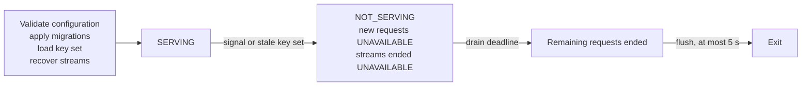

# Backend operations

Behaviour an operator or a client observes that is not any single RPC's contract: what happens to an envelope once its expiry passes, when an instance reports itself ready, what a client sees while an instance drains, which reads may answer from a lagged copy of the store and what such a read still guarantees, and the metrics, spans, and log fields an operator monitors. Each of these is relied on by someone outside the backend: a balancer routes on health, a client plans around retention and lag, and an operator's dashboards and alerts are written against the catalogue.

## Scope

In scope: what the backend may and may not delete, and what a client does not do with an expiry; the startup checks on retention and envelope size that keep every stored envelope deliverable; the health protocol and when `SERVING` is reported; what a client observes during shutdown; which reads may answer from a lagged copy and what they still guarantee; the request id, trace context, deployment identity, the telemetry startup checks, the metric families with their label vocabularies, the operator-facing span names, the request completion log, and what telemetry never contains.

Out of scope: platform and deployment choices such as the database engine, the process model, read routing between database instances, and instance affinity, which live in the backend's module README; per-RPC contracts, ordering, publish atomicity, the envelope metadata including the expiry formula, and the status codes (`API`); the retention and drain values and the telemetry keys (`CONF` and the backend's documentation); credentials (`AUTH`); push delivery and its dispatcher ([PUSH section 5](PUSH-push-subscriptions.md#5-dispatch)); and what a client does with a received envelope ([PROC](PROC-message-processing.md)).

| Related | Relation |
| --- | --- |
| `API` | Owns the expiry formula and every other metadata field (API-212), the per-topic prefix every read returns (API-201), and read-your-writes on `Query` (API-202). This spec owns what happens after an expiry passes and which reads may lag. |
| `CONF` | Owns the retention values (CONF-069, section 3), the request and response budgets (CONF-008), and the deployment identifier (CONF-002) this spec carries into telemetry. |
| `AUTH` | Owns admission, which runs before the drain admission of section 3, and the auth rejection reasons that label `xmtp_auth_rejections_total`; triggers the drain when its key set goes stale (AUTH-019). |
| [PUSH section 5](PUSH-push-subscriptions.md#5-dispatch) | Owns push dispatch and recipient expiry (PUSH-226). This spec lists the push metric families only. |

## Terms

| Term | Meaning |
| --- | --- |
| Instance | One running backend process of a deployment. |
| Envelope kind | The topic kind of an envelope: a group message, a Welcome, a key package, an identity update, or a commit-log entry. TOPIC-001 owns the kind byte. |
| Retention period | The configured seconds for a kind: `retention.group_message_seconds`, `retention.welcome_seconds`, or `retention.key_package_seconds`. |
| Expiry | The `expiry_ns` of an envelope's metadata, set under API-212. |
| Exempt envelope | An envelope whose expiry is 0. |
| Current store | The state of the deployment's store that a publish response reflects: what `Query` reads under API-202. |
| Lagged copy | A copy of the store that reflects the current store as it was at some earlier time. |
| Drain deadline | `server.max_drain_duration_ms`, default 10000. |
| Serving | The `SERVING` status of the gRPC Health Checking Protocol. |
| Request id | The UUID the backend generates for one request. |
| Route table | The table in section 5 that maps a request path to its service, method, and kind labels. |

## 1. Retention

Retention is decided when an envelope is stored: API-212 sets its expiry from the retention period of its kind, and to 0 for the kinds that never expire. This section owns what the expiry then means. An exempt envelope is never deleted, whatever the operator configures, because an identity update, a commit-log entry, a commit, or a proposal is state every later message depends on. An envelope is never deleted before its expiry, and while it is stored its expiry does not hide it from any read. Which stored envelopes a read returns is decided by the request's topics, cursors, and limit under `API`, not by expiry.

Deletion of an envelope after its expiry is not performed today (Known limitations); push recipient expiry under PUSH-226 is a separate mechanism. An expiry is a bound on the backend's storage, not a message deletion rule for a client. [META section 6](META-group-metadata.md#6-disappearing-messages) owns disappearing messages.

| ID | Title | Requirement | Why |
| --- | --- | --- | --- |
| OPS-001 | Exempt envelopes are never deleted | The backend MUST NOT delete an envelope whose `expiry_ns` is 0, whatever the configured retention periods. | A member that loses a commit can never decrypt what followed it, and an inbox that loses an identity update cannot be verified by anyone. |
| OPS-002 | Expiry gates deletion only | The backend MUST NOT delete an envelope while the primary store's clock is not greater than its `expiry_ns`, and MUST NOT exclude a stored envelope from a `Query`, `QueryNewest`, or subscription result because of its `expiry_ns`. | A client that reads a stored envelope's metadata cannot be told it is unreadable by the same store. |
| OPS-003 | Expiry is not a client deletion rule | The client MUST NOT delete, or hide from an app, a message it holds because the envelope's `expiry_ns` has passed. | A message shown to a user and then gone is data loss to that user. |
| OPS-020 | Expiry arithmetic is checked | When a configured retention period, converted to nanoseconds and added to the primary store's clock at startup, cannot be represented as a signed 64-bit nanosecond timestamp, the backend MUST refuse to start and MUST name the key. When that addition cannot be represented at publish time, the backend MUST fail the publish with `INTERNAL` and MUST store nothing from it. | A wrapped expiry is a negative timestamp that reads as already expired. |

## 2. Readiness and health

The backend serves the gRPC Health Checking Protocol ([health-checking.md](https://github.com/grpc/grpc/blob/master/doc/health-checking.md)) on the gRPC port, without a credential (AUTH-002). Every named service and the empty service name report one status, so a balancer probing one name and an orchestrator probing another cannot disagree about an instance. `SERVING` means the instance can take any request: its configuration passed its checks, its migrations are applied, its key set is loaded, and stream recovery has completed once. Unary requests do not depend on stream recovery, so a later recovery keeps health at `SERVING` and refuses only streams.

One configuration check belongs here rather than with the published limits: an envelope the backend would accept must fit every path that delivers it. The backend adds at most 256 bytes of metadata and framing to an envelope in a stream frame, and a frame is 2 MiB. CONF-008 bounds the request and response budgets to the transport; this check bounds the envelope to those budgets and to the frame.

| ID | Title | Requirement | Why |
| --- | --- | --- | --- |
| OPS-004 | Health protocol on the gRPC port | The backend MUST serve `grpc.health.v1.Health` (`Check`, `Watch`, and `List`) on the port that serves the `xmtp.backend.v1` services, and MUST report the same status for the empty service name and for each `xmtp.backend.v1` service name. | |
| OPS-005 | Serving means initialised | The backend MUST NOT accept a connection on the gRPC port or report `SERVING` before its configuration has passed the checks of CONF section 1 and of this spec, its database migrations have been applied, its key set has been loaded under AUTH-017 where `auth.enabled` is `true`, and stream recovery has completed once. | A balancer that routes to an instance mid-migration hands clients `INTERNAL` errors and, for a publish, a lost write. |
| OPS-006 | Streams need recovery | When stream recovery restarts after a loss of the read database connection or after the unresolved gap ranges exceeded `streams.max_gap_ranges`, the backend MUST end every open stream with `UNAVAILABLE`, or with `RESOURCE_EXHAUSTED` in the gap case, and while recovery runs MUST reject a `Subscribe` or `SubscribeStatic` open with `UNAVAILABLE` and MUST continue to report `SERVING`. | A stream admitted during recovery would miss rows the backend has not yet proven delivered; a unary request needs no recovery, so taking the instance out of rotation would refuse work it can do. |
| OPS-021 | Envelope size fits delivery | When the configured `limits.max_envelope_bytes` plus 256 bytes is greater than `limits.max_response_bytes` or than 2097152 bytes, or `limits.max_envelope_bytes` plus its length prefix is greater than `limits.max_request_bytes`, the backend MUST refuse to start and MUST name `limits.max_envelope_bytes`. | An envelope the backend stores but cannot fit in a frame is delivered to nobody, and every stream on its topic stalls behind it. |

## 3. Shutdown

Shutdown begins on the termination signal or when the key set goes stale (AUTH-019). A client sees three things: health reports `NOT_SERVING`, every new request that reaches admission is answered `UNAVAILABLE`, and every open stream ends with `UNAVAILABLE`, whether or not its catch-up had finished. Authentication (AUTH-001) and the CORS preflight answer run before drain admission, so during a drain a request with a bad credential still gets its auth rejection and a preflight is still answered. Unary requests admitted before shutdown get the drain deadline to complete. At the deadline whatever is left is stopped, telemetry is flushed within a further 5 seconds, and the process exits.

A publish admitted before shutdown may commit and still get no response. That is not proof of rollback. `API` is expected to require that a publish resent with the same envelopes returns the stored sequence ids as duplicates, which is what lets a client resend without a second copy.

| ID | Title | Requirement | Why |
| --- | --- | --- | --- |
| OPS-007 | Shutdown as a client sees it | When shutdown begins, the backend MUST report `NOT_SERVING`, MUST end every open stream with `UNAVAILABLE` without waiting for its catch-up to complete, and MUST answer every request that arrives afterwards and passes AUTH-001 with `UNAVAILABLE`, while still answering a CORS preflight and still rejecting a request under AUTH-001 with its auth status. | A stream that finishes its catch-up during shutdown lets a client mistake an interrupted history for a complete one. |
| OPS-008 | Bounded drain | When shutdown begins, the backend MUST stop every unary request admitted before it within the drain deadline, answering `UNAVAILABLE` where a response can still be written, and MUST exit within the drain deadline plus 5 seconds. | An orchestrator kills the process at its own deadline; work still running then ends with no response at all. |

## 4. Lagged reads

A deployment may answer some reads from a lagged copy of its store, so a client that just published can see an older point in time on those reads than on `Query`. The lag is safe because a lagged read is still a prefix of every topic (API-201) and because it equals what the current store would have answered earlier, never a reordering and never a gap. Only `Query` reads the client's own writes (API-202). A client that must confirm its own write is visible on a lagged read polls a metadata-only `QueryNewest` on the exact topic; IDENT-072 requires that for installation registration. PROC-021 defines when a client uses `Query` to reach a target from its own publish receipt.

| ID | Title | Requirement | Why |
| --- | --- | --- | --- |
| OPS-009 | Which reads may lag | The backend MUST answer `Publish`, `Query`, `Register`, `Unregister`, and `UpdateSubscriptions` from the current store, and MUST NOT answer any RPC other than `QueryNewest`, `Subscribe`, `SubscribeStatic`, and `GetInboxIds` from a lagged copy. | A client plans its confirmation reads around which RPCs can trail its own publish. |
| OPS-010 | A lagged read is an earlier view | When an RPC answers from a lagged copy, the result MUST equal what the same request would have returned from the current store at some earlier time, so that for each topic the copy omits only envelopes whose sequence ids are greater than every envelope it returns for that topic. | A read that looks like an earlier point in time is safe; one with a gap makes a client advance its cursor past an envelope it never sees. |

## 5. Telemetry

Every response carries a request id the backend generated, so one value appears in the client's error and the operator's log. A request that carries W3C trace context becomes a child of the caller's trace, which is how one trace shows a client call and the backend request under it. Every exported span and every completion log names the deployment, because one collector carries several. No raw request data reaches a metric label, span field, or log field: those values outlive the message they name and are read by people it was never sent to. What telemetry does carry is counts, sizes, durations, and words from fixed vocabularies.

Metrics are in-process counters, gauges, and histograms served in the Prometheus text exposition format on a separate listener, recorded whether or not any trace is sampled or any collector is reachable. The catalogue below is the operator contract: dashboards and alerts are written against these names, types, and label vocabularies, and a label value outside its vocabulary is a series nobody planned for.

| Path | `grpc_service` | `grpc_method` | `grpc_type` |
| --- | --- | --- | --- |
| `/xmtp.backend.v1.QueryService/Query` | `xmtp.backend.v1.QueryService` | `Query` | `unary` |
| `/xmtp.backend.v1.QueryService/QueryNewest` | `xmtp.backend.v1.QueryService` | `QueryNewest` | `unary` |
| `/xmtp.backend.v1.PublishService/Publish` | `xmtp.backend.v1.PublishService` | `Publish` | `unary` |
| `/xmtp.backend.v1.SubscriptionService/Subscribe` | `xmtp.backend.v1.SubscriptionService` | `Subscribe` | `bidi_stream` |
| `/xmtp.backend.v1.SubscriptionService/SubscribeStatic` | `xmtp.backend.v1.SubscriptionService` | `SubscribeStatic` | `server_stream` |
| `/xmtp.backend.v1.IdentityService/GetInboxIds` | `xmtp.backend.v1.IdentityService` | `GetInboxIds` | `unary` |
| `/xmtp.backend.v1.IdentityService/VerifySmartContractWalletSignatures` | `xmtp.backend.v1.IdentityService` | `VerifySmartContractWalletSignatures` | `unary` |
| `/xmtp.backend.v1.ConfigurationService/GetConfiguration` | `xmtp.backend.v1.ConfigurationService` | `GetConfiguration` | `unary` |
| `/xmtp.backend.v1.NotificationService/Register` | `xmtp.backend.v1.NotificationService` | `Register` | `unary` |
| `/xmtp.backend.v1.NotificationService/Unregister` | `xmtp.backend.v1.NotificationService` | `Unregister` | `unary` |
| `/xmtp.backend.v1.NotificationService/UpdateSubscriptions` | `xmtp.backend.v1.NotificationService` | `UpdateSubscriptions` | `unary` |
| `/grpc.health.v1.Health/Check` | `grpc.health.v1.Health` | `Check` | `unary` |
| `/grpc.health.v1.Health/Watch` | `grpc.health.v1.Health` | `Watch` | `unary` |
| `/grpc.health.v1.Health/List` | `grpc.health.v1.Health` | `List` | `unary` |
| Any other path | `unknown` | `unknown` | `unary` |

In the catalogue, "RPC" means the three labels of the route table. `grpc_code` is the gRPC status name in upper camel case, from `OK` through `Unauthenticated`. Histograms carry the `le` label and expose `_bucket`, `_sum`, and `_count`; their buckets are 0.005, 0.01, 0.025, 0.05, 0.1, 0.25, 0.5, 1, 2.5, 5, and 10 seconds. A family that counts only failures is absent until its first event. The request families measure at the transport: a request is counted when it reaches the backend as a gRPC request, before authentication, and completed when its response body ends, fails, or is cancelled. The publish families measure decoded input: a position is an envelope of a `PublishRequest` that decoded and reached the publish handler.

| Metric | Type | Labels | Meaning |
| --- | --- | --- | --- |
| `grpc_server_started_total` | counter | RPC | Incremented once when a gRPC request other than a health request reaches the backend, before authentication. A CORS preflight is not a gRPC request. |
| `grpc_server_handled_total` | counter | RPC, `grpc_code` | Incremented once when a counted request's response body ends, fails, or is cancelled, with the status from its headers or trailers; `Cancelled` when the body was dropped unfinished with no status, `Unknown` when it ended with none. |
| `grpc_server_handling_seconds` | histogram | RPC, `grpc_code` | Time from a counted request's arrival to its response body completion. A stream measures its whole lifetime. |
| `grpc_server_in_flight` | gauge | RPC | Counted requests whose response body has not completed. Decremented exactly once per request. |
| `grpc_server_request_bytes_total` | counter | RPC | Request body bytes consumed, including gRPC framing, excluding HTTP headers and trailers. |
| `grpc_server_response_bytes_total` | counter | RPC | Response body bytes emitted. Emission is not receipt. |
| `xmtp_operation_duration_seconds` | histogram | `operation` (a span name from the span catalogue), `status` (`ok`, `error`) | Duration of each operation span from creation to close; `error` when the span recorded an error. |
| `xmtp_telemetry_export_failures_total` | counter | none | Export batches that failed. Not a count of lost spans. |
| `xmtp_db_released_open_transactions_total` | counter | none | Transactions found open and rolled back when a connection returned to the pool. |
| `xmtp_db_errors_total` | counter | `kind` (`timeout`, `invariant`, `connection`, `other`) | Database errors that were mapped to a gRPC status. |
| `xmtp_publish_envelopes_total` | counter | `outcome` (`stored`, `duplicate`, `rejected`) | Every position of a decoded publish, counted once by its response origin; `rejected` for every position when the request fails after decoding. |
| `xmtp_publish_rejections_total` | counter | `reason` (`REASON_MALFORMED_PAYLOAD`, `REASON_INVALID_KEY_PACKAGE`, `REASON_INVALID_IDENTITY_UPDATE`, `REASON_INVALID_SIGNATURE`, `REASON_TOO_LARGE`) | One per publish rejected by validation, with the `PublishError.reason` it returned. |
| `xmtp_scw_verifications_total` | counter | `result` (`valid`, `invalid`, `error`) | One per smart contract wallet verification, including ones answered from the cache. |
| `xmtp_stream_sessions` | gauge | `kind` (`bidi`, `static`) | Registered stream sessions. |
| `xmtp_stream_topics_registered` | gauge | none | Registered topic interests across all sessions. |
| `xmtp_stream_frames_sent_total` | counter | `frame` (`started`, `applied`, `messages`, `keepalive`, `ping`, `pong`, `update`) | Frames admitted to a session's outbound queue. |
| `xmtp_stream_frames_received_total` | counter | `frame` (`update`, `ping`, `pong`) | Frames received from a client on a bidirectional stream. |
| `xmtp_stream_envelopes_sent_total` | counter | `phase` (`catch_up`, `live`) | Envelopes admitted to a session's outbound queue by delivery phase. Admission is not receipt. |
| `xmtp_stream_updates_total` | counter | `outcome` (`applied`, `invalid`, `rate_limited`) | Stream interest updates by result. |
| `xmtp_stream_ended_total` | counter | `reason` (`client`, `backpressure`, `capacity`, `keepalive`, `tailer`, `database`, `shutdown`, `invalid`, `rate_limited`) | One per registered session, when it ends. |
| `xmtp_stream_outbound_wait_seconds` | histogram | none | Time a session waited for outbound capacity. Recorded only when it waited. |
| `xmtp_stream_fetch_wait_seconds` | histogram | none | Time a session waited for a fetch permit, including a wait ended by cancellation. |
| `xmtp_tailer_polls_total` | counter | `result` (`ok`, `error`) | Read-database polls by result. |
| `xmtp_tailer_rows_total` | counter | `source` (`forward`, `gap`) | Rows read by the forward scan and by gap probes. Not unique delivered rows. |
| `xmtp_tailer_gap_ranges` | gauge | none | Unresolved sequence id ranges. A count of ranges, not of missing ids. |
| `xmtp_tailer_restarts_total` | counter | none | Stream recovery generations started, including the one at startup. |
| `xmtp_tailer_ready` | gauge | none | 1 exactly while the backend admits streams under OPS-006. |
| `xmtp_boundary_advances_total` | counter | `result` (`ok`, `lock_timeout`, `error`) | Allocation boundary advance attempts by result. |
| `xmtp_backend_ready` | gauge | none | 1 exactly while health reports `SERVING`, set in the same step. |
| `xmtp_auth_rejections_total` | counter | `reason` (the reasons of the AUTH section 4 table) | One per request rejected under AUTH-014. |
| `xmtp_auth_jwks_refresh_total` | counter | `result` (`ok`, `error`) | One per JWKS refresh attempt, by the fetch's own result. |
| `xmtp_auth_keys` | gauge | none | Keys in the key set. |
| `xmtp_push_recipients_total` | counter | `action` (`registered`, `unregistered`, `expired`, `dead`) | Push recipient changes. |
| `xmtp_push_deliveries_total` | counter | `channel` (`apns`, `fcm`, `http`), `outcome` (`delivered`, `failed`, `rejected`, `mismatch`, `dead`, `suppressed`) | Completed push delivery attempts. |
| `xmtp_push_dispatcher` | gauge | none | 1 while this instance holds the push dispatcher lock. |
| `xmtp_push_subscriptions_total` | counter | `action` (`added`, `removed`) | Push subscription topic changes. |
| `xmtp_backend_info` | gauge | `version` | Always 1, with the build version as its label. |

The span catalogue names the operation spans an operator measures: the request span, the handler for each RPC, and the stages of a publish, a stream, a poll, and a chain verification. The backend also exports database and internal spans under `db.` whose names follow its own structure; those are diagnostic, are not part of this contract, and are listed in the backend's documentation.

| Group | Span names |
| --- | --- |
| Request | `<grpc_service>/<grpc_method>` from the route table; `unknown/unknown` for any other path |
| RPC handler | `rpc.publish`, `rpc.query`, `rpc.query_newest`, `rpc.get_inbox_ids`, `rpc.verify_smart_contract_wallet_signatures`, `rpc.get_configuration`, `rpc.register`, `rpc.unregister`, `rpc.update_subscriptions` |
| Publish stages | `publish.parse_publish`, `publish.validate_publish`, `publish.locks`, `db.commit_publish` |
| Streams | `tailer.bootstrap`, `tailer.poll`, `stream.fetch`, `stream.update` |
| Verification | `scw.verify` |

| ID | Title | Requirement | Why |
| --- | --- | --- | --- |
| OPS-011 | Request id on every response | For every gRPC request, the backend MUST generate a request id, return it in the `x-request-id` response header, ignore any correlation header the caller sent when choosing it, and expose that header to browser callers through CORS. | A support case needs one value that appears in the client's error and in the operator's log, and a caller-chosen id lets one caller forge another's. |
| OPS-012 | Trace context is accepted | When a request carries `traceparent` and `tracestate` headers ([Trace Context §3](https://www.w3.org/TR/trace-context/#trace-context-http-headers-format)), the backend MUST make that context the parent of the request span, and MUST accept a CORS preflight that names those headers. | |
| OPS-013 | Deployment identity in telemetry | The backend MUST carry the deployment identifier as the resource attribute `xmtp.backend.identifier` on every exported span, and as the field `identifier` on every request completion log and every auth rejection log, and MUST carry `service.name` (`telemetry.service_name`, default `xmtp-backend`) and `service.version` (the build version) on every exported span. | One collector stream carries several deployments; without the identifier a line cannot be attributed. |
| OPS-014 | No request data in telemetry | The backend MUST NOT place in a metric name, a metric label, a span field, or a log field a topic, an inbox id, an installation key, a group id, a cursor, a payload, a request header value, or any value computed from one of those that identifies it, except the trace context under OPS-012, the request id, and an API key name under AUTH-028. A byte count, a duration, a count of items, and a value from a label vocabulary the catalogue fixes MAY be recorded, and a reader of telemetry MUST NOT rely on any other field. | A label is kept far longer than the message it names and is read by people the message was never sent to. |
| OPS-015 | Export never stops serving | When the OTLP collector is unreachable or an export batch fails, the backend MUST continue to serve and record metrics, and MUST count the failed batch in `xmtp_telemetry_export_failures_total`. | |
| OPS-016 | Metrics exposition | While `telemetry.metrics_listen` is not empty, the backend MUST serve the Prometheus text exposition format on that address, with every family in the metric catalogue described by the name and type shown. While it is empty, the backend MUST serve no metrics listener and MUST keep recording. | |
| OPS-017 | Catalogue semantics | The backend MUST record each family in the metric catalogue as its Meaning column states, with only the label names and label values the Labels column gives, and MUST NOT emit a label value outside that vocabulary. | An unbounded label value creates a series per user and takes the metrics store down. |
| OPS-018 | Request completion events | While `server.request_logger` is `true` (the default) and the configured log level admits `INFO`, the backend MUST emit one completion log per gRPC request other than a health request, when the response body ends, fails, or is cancelled, carrying `request_id`, `identifier`, `method` (the request path), `duration_ms`, `request_size_bytes`, `response_size_bytes`, `grpc_code`, and `trace_id` when a trace context exists. The byte fields MUST count body bytes consumed and emitted, not headers or trailers. | |
| OPS-019 | Span names | The backend MUST name the operation spans in the span catalogue as shown, MUST export the request span under its route table name, and MUST record `xmtp_operation_duration_seconds` with `operation` equal to the operation span's name. | Dashboards and alerts are written against these names. |
| OPS-022 | Telemetry configuration checks | When the OTLP endpoint resolved from `telemetry.otlp_endpoint`, or from `OTEL_EXPORTER_OTLP_ENDPOINT` when the key is absent, is not an HTTP or HTTPS URL with a host, the backend MUST refuse to start, naming the key or the variable and not its value. When `telemetry.metrics_listen` names an address the backend cannot bind, the backend MUST refuse to start and MUST name that address. When no endpoint resolves, the backend MUST NOT export traces. | A backend that starts with a broken exporter loses every trace silently; one that starts without its metrics listener is invisible to the alerts written against it. |

## Known limitations

No envelope is deleted after its expiry today. `expiry_ns` is set under API-212 and OPS-001 and OPS-002 hold, but a row past its expiry stays readable for as long as the database keeps it, and an operator bounds storage outside the backend.

`SERVING` reports that the instance can take requests, not that any client can reach it or that a message it accepted was delivered. A balancer's health check and an end-to-end probe measure different things.

Shutdown reports `NOT_SERVING`, closes admission, and ends streams as one step, not in a promised order. A balancer that polls health can route one more request to a draining instance and see `UNAVAILABLE`. At the drain deadline a connection still carrying a request is aborted, and that request ends with no gRPC status at all.

The backend exposes no sampled gauges: no pool size, queue depth, replica replay delay, or process resource usage. Those belong to infrastructure monitoring. In particular, a lagged copy that has stopped receiving changes is not visible in any backend metric.

`xmtp_operation_duration_seconds` derives its `status` from whether the span recorded an error. A cancellation that recorded none is `ok`, so the label is not an exact success rate.

Client-side trace metrics derived by a collector from exported spans scale with the configured sample ratio and with export loss. They are estimates, unlike the in-process families above.
