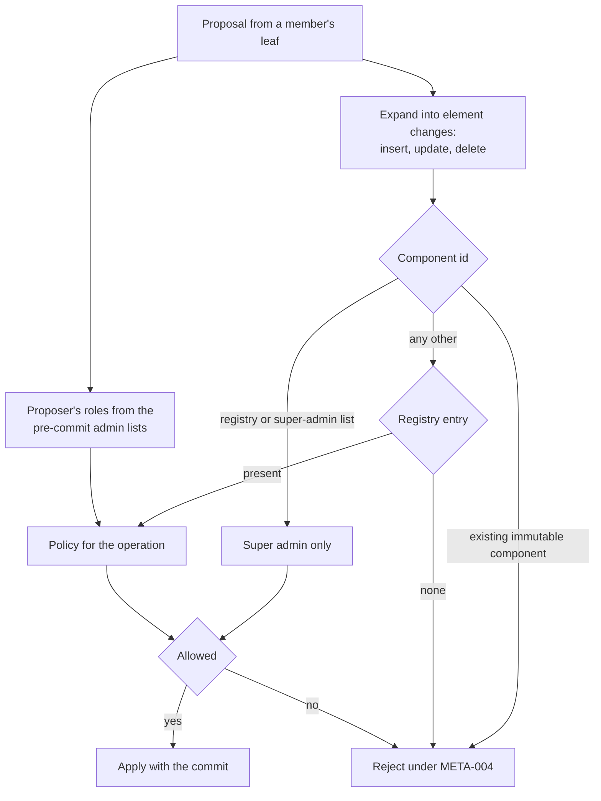

# Group permissions

Every change to a group's shared state after creation is a proposal a member signs, and a policy decides whether that member may make it. The policies live in the group itself: the component registry is one component of the group's app-data dictionary, so the rules travel inside the group context, every member reads the same rules, and a change to the rules is a change to the group that the same engine judges. A client that evaluates a policy differently from the others accepts a commit they reject, or rejects one they accept, and the group forks.

The engine has three inputs: the proposer's roles, read from the admin and super-admin lists as they stood before the commit; the operation, which is an insert, an update, or a delete of one element of one component; and the policy the registry stores for that component and operation. Two components are not governed by the registry, because the registry depends on them: the registry itself and the super-admin list are always super-admin-only. Membership changes carried as MLS Add and Remove proposals are judged by the membership component's policies, so one policy governs a member's presence however the change is carried.



## Scope

In scope: the roles and the components that hold them; the policy language and how it is evaluated; how a write to a component is authorised, including membership changes carried as MLS proposals; what a valid registry is and how an app changes a policy; the non-DM presets and their recognition; authority to act on leave requests; and compatibility across changes to commit acceptance.

Out of scope: when the engine runs and what a rejected commit does to the group (`GMOD`); component identifiers, the dictionary, registry structure, component types, and byte limits (`META`); fixed DM policies and the participant-add exception (DMS-002 and DMS-004); exact identity state (IDENT-070); and what a Welcome carries (`JOIN`).

| Related | Relation |
| --- | --- |
| `GMOD` | Owns the commit validation pipeline that invokes this engine, the membership component, and the protocol-version floor. GMOD-001 states which proposal types reach the engine. |
| `META` | Owns all component ids and ranges, the `ComponentMetadata` and `ComponentPermissions` messages, registry structure, and application of component deltas. |
| `DMS` | DMS-002 owns the fixed policies and initial roles; DMS-004 owns the participant-add exception used in section 3. |

## Terms

| Term | Meaning |
| --- | --- |
| Component | One entry of a group's app-data dictionary, named by a component id. Its value is bytes whose shape the registry's `component_type` names. Owned by META section 2. |
| Component id | The identifier assigned under META section 1. Components are named symbolically here. |
| Registry | `COMPONENT_REGISTRY`: maps component ids to `ComponentMetadata`. Its `permissions` field carries the policies this spec evaluates. |
| Admin list | `ADMIN_LIST`: the set of inbox ids that are admins. |
| Super-admin list | `SUPER_ADMIN_LIST`: the set of inbox ids that are super admins. |
| Admin | An inbox that is in the admin list. A super admin is not an admin unless it is also in the admin list, but every rule that admits an admin admits a super admin. |
| Super admin | An inbox that is in the super-admin list. |
| Proposer | The member whose leaf node signed a proposal. |
| Committer | The member whose leaf node signed a commit. |
| Element change | One insert, update, or delete of one element of a component, as section 3 derives it from a proposal. |
| Action policy | One of the four registry policies that govern membership and the admin list: `insert_policy` and `delete_policy` of the membership component, and `insert_policy` and `delete_policy` of the admin list. |
| Preset | One of the preconfigured policy sets of section 5. |

## 1. Roles

A group has three tiers: members, admins, and super admins. The two lists are components, so a change to a list is a proposal the engine judges like any other, and a receiver reads the roles from the group context it holds. The group's creator starts as the only super admin. There is no other standing role: the creator's inbox id is recorded in the group but grants nothing after creation.

Roles are read from the committed group context, never from a proposal inside the commit being judged. A commit that adds an inbox to the super-admin list and, in the same commit, has that inbox write a super-admin-only component is rejected, because the write is evaluated against the lists as they stood before the commit.

Two rules protect the top tier from the tiers below it. A super admin cannot be removed from the group, whatever the remove-member policy says, so an admin who was delegated removals cannot remove the person who delegated them. The super-admin list cannot be emptied, so a group never reaches a state in which nobody can change its rules. A super admin can remove itself from the list while another super admin remains.

| ID | Title | Requirement | Why |
| --- | --- | --- | --- |
| PERM-001 | Roles from the committed lists | The client MUST take a proposer's admin status from the admin list and its super admin status from the super-admin list of the committed group context, and MUST NOT take either from a proposal in the commit being judged. | A commit that grants a role and uses it in one step would let any member escalate. |
| PERM-002 | The creator is the first super admin | When a client creates a group whose conversation type is not DM, it MUST write the super-admin list containing only the creator's inbox id and the admin list empty. | |
| PERM-003 | Super admins stay members | If a commit removes from the membership component an inbox that is in the super-admin list, then the client MUST reject the commit, whatever the membership component's `delete_policy` says. | An admin who could remove the super admins takes the group from them. |
| PERM-004 | The super-admin list never empties | If a proposal would change a super-admin list that is not empty into one that is empty, then the client MUST reject it. | A group with no super admin has nobody who can change its rules, and no rule can restore one. |
| PERM-005 | Registry and super-admin list are super-admin-only | When a proposal writes the registry or the super-admin list and the proposer is not a super admin, the client MUST reject it, whatever the registry says. | These two components are the ones the registry's own authority rests on. |

## 2. The policy language

A policy is a `MetadataPolicy`: a base policy, or a condition over child policies. A component's entry in the registry carries three of them, one for each operation.

```proto
// A policy that governs updating metadata
message MetadataPolicy {
  // Base policy
  enum MetadataBasePolicy {
    METADATA_BASE_POLICY_UNSPECIFIED = 0;
    METADATA_BASE_POLICY_ALLOW = 1;
    METADATA_BASE_POLICY_DENY = 2;
    METADATA_BASE_POLICY_ALLOW_IF_ADMIN = 3;
    METADATA_BASE_POLICY_ALLOW_IF_SUPER_ADMIN = 4;
  }

  // Combine multiple policies. All must evaluate to true
  message AndCondition {
    repeated MetadataPolicy policies = 1;
  }

  // Combine multiple policies. Any must evaluate to true
  message AnyCondition {
    repeated MetadataPolicy policies = 1;
  }

  oneof kind {
    MetadataBasePolicy base = 1;
    AndCondition and_condition = 2;
    AnyCondition any_condition = 3;
  }
}
```

META section 2 defines `ComponentPermissions` and its three policy fields. The `MetadataPolicy` block above is the policy language used by those fields.

A base policy reads only the proposer's roles. It does not read the value being written or the element being changed.

| Base policy | Allowed when |
| --- | --- |
| `METADATA_BASE_POLICY_ALLOW` | Always |
| `METADATA_BASE_POLICY_DENY` | Never |
| `METADATA_BASE_POLICY_ALLOW_IF_ADMIN` | The proposer is an admin or a super admin |
| `METADATA_BASE_POLICY_ALLOW_IF_SUPER_ADMIN` | The proposer is a super admin |

A policy can be malformed: no `kind`, a `base` value the table does not list, or a condition with no children. A malformed policy denies. Evaluation of a condition stops at the first child that decides it, and a malformed child that is reached decides it as denied, so two clients that evaluate the same tree in the same order reach the same answer.

| ID | Title | Requirement | Why |
| --- | --- | --- | --- |
| PERM-006 | Base policy semantics | The client MUST evaluate a `base` policy as the table above states, against the proposer's roles under PERM-001. | |
| PERM-007 | Condition semantics | The client MUST evaluate the children of an `and_condition` in order and stop at the first child that is denied or malformed, with that child's result, and MUST evaluate the children of an `any_condition` in order and stop at the first child that is allowed or malformed, with that child's result. An `and_condition` whose children are all allowed MUST be allowed, and an `any_condition` whose children are all denied MUST be denied. | Two clients that stop at different children reach different answers for the same tree. |
| PERM-008 | A malformed policy denies | When the policy that governs a write has no `kind`, has a `base` value not in the table above, or is a condition with no children, the client MUST deny the write. | A policy that fails open turns a corrupt registry entry into an open door. |

## 3. Authorising a write

A proposal that writes a component is an `AppDataUpdate` proposal, defined in [draft-ietf-mls-extensions-08 §4.7](https://www.ietf.org/archive/id/draft-ietf-mls-extensions-08.html#section-4.7), whose operation is `Update` with a payload or `Remove`. The client first turns the proposal into element changes, because a delta to a set or a map can insert one element and delete another in one proposal, and the two operations can have different policies. The registry entry's `component_type` says how the payload is read; META-010 owns component types and encodings. PERM-014 owns authorization of a component with no built-in definition; META-010 owns its type-based decoding and application.

| Component type | Operation on the wire | Element changes |
| --- | --- | --- |
| A scalar (`COMPONENT_TYPE_BYTES`, `COMPONENT_TYPE_STRING`) | `Update` | One update, whether or not the component already has a value |
| A scalar | `Remove` | One delete |
| A set or a map | `Update` carrying a delta | One change per mutation in the delta: an insert for an insert, an update for an update, a delete for a remove, a remove-by-hash, or a delete |
| A set or a map | `Remove` | One delete |

META section 1 owns component id ranges. META-004 rejects writes to an existing immutable component, including insertion into an existing immutable collection. META-014 and META-015 own registry structure and immutable registry entries. These checks apply before policy evaluation; an allowing policy cannot bypass them.

Every other component is governed by its registry entry, and a component with no entry is denied to everyone. The entry is read from the committed registry, so registering a component and writing it are two commits; the same rule keeps a commit from changing a policy and using the changed policy in one step. A client that predates a component still has the registry entry, and evaluates the write under it rather than refusing what it does not know, because a refusal the other members do not share is a fork.

MLS Add and Remove proposals use the membership component's policies. For an inbox added or removed by a commit, every corresponding proposal retains its own proposer, including when several proposals name installations of that inbox. A change limited to installations of an inbox that remains a member is checked under GMOD and the membership entry's update policy. An inline proposal has the committer as proposer under [RFC 9420 §12.4.2](https://www.rfc-editor.org/rfc/rfc9420.html#section-12.4.2).

DMS-004 owns the participant-add exception. That exception takes precedence over denial by the membership insert policy in both the Add path and the dictionary-insert path. It uses the proposer under PERM-009 in both paths and at final membership validation. It does not bypass structural checks or authorize another mutation in the same proposal.

| ID | Title | Requirement | Why |
| --- | --- | --- | --- |
| PERM-009 | Judge each authenticated proposer | When the client evaluates a proposal, it MUST use that proposal's authenticated proposer and the roles under PERM-001, including when other proposals name the same inbox. It MUST NOT substitute another proposal's proposer or the committer when that actor differs. | A committer or a second proposer cannot lend authority to another member's proposal. |
| PERM-010 | The committed registry decides | The client MUST read the registry entry that governs a write from the committed group context, so that a component registered or a policy changed in the same commit does not govern a write in that commit. | |
| PERM-011 | Operation selects the policy | For each element change, the client MUST select `insert_policy`, `update_policy`, or `delete_policy` under the element-change table above and MUST reject the proposal if any selected policy denies, except for the membership insertion authorized by DMS-004. | |
| PERM-012 | Deny by default | When a write targets a component other than `COMPONENT_REGISTRY` or `SUPER_ADMIN_LIST` and the committed registry has no entry that decodes as a `ComponentMetadata` with all three policies present, the client MUST reject the write. | |
| PERM-014 | Unknown components are judged, not refused | When a proposal names a component the client has no built-in definition for, the client MUST evaluate it under the committed registry entry's `component_type` and policies, and MUST NOT reject it because the component is unknown. | A client that refuses what it does not know forks the group at the first component a newer release adds. |
| PERM-015 | Membership proposals use membership policies | When a commit adds or removes an inbox from `GROUP_MEMBERSHIP`, the client MUST evaluate the corresponding `insert_policy` or `delete_policy` against each proposer of an Add or Remove for that inbox under PERM-009 and reject a denial, subject to DMS-004 for adds and PERM-003 for removals. The client MUST apply the same policy checks to each standalone Add or Remove proposal. | |

## 4. The registry

A registry entry is validated when it is written, so that a corrupt entry never enters the committed registry and every later commit can be judged. The four action policies are validated as complete trees whenever a commit writes the registry, because a commit that leaves one of them malformed would make every later membership or admin change undecidable for every member. The admin list is constrained: its policies are base policies of deny, admin, or super admin, because unrestricted admin assignment would let a member grant itself every admin permission. PERM-005 separately protects the super-admin list.

The registry is written by super admins only (PERM-005), and no stored value changes that; the permission to update permissions is the super-admin role itself. An app changes a policy through its SDK, which names the action or the metadata field and a policy option; the client writes the registry field the table below names. META section 2 assigns the metadata component ids.

| App operation | Component | Registry field | Accepted options |
| --- | --- | --- | --- |
| Add member | `GROUP_MEMBERSHIP` | `insert_policy` | Allow, Deny, Admin only, Super admin only |
| Remove member | `GROUP_MEMBERSHIP` | `delete_policy` | Allow, Deny, Admin only, Super admin only |
| Add admin | `ADMIN_LIST` | `insert_policy` | Deny, Admin only, Super admin only |
| Remove admin | `ADMIN_LIST` | `delete_policy` | Deny, Admin only, Super admin only |
| Update a metadata field | That field's component | `insert_policy` and `update_policy` | Allow, Deny, Admin only, Super admin only |

| Policy option | Written as |
| --- | --- |
| Allow | `METADATA_BASE_POLICY_ALLOW` |
| Deny | `METADATA_BASE_POLICY_DENY` |
| Admin only | `METADATA_BASE_POLICY_ALLOW_IF_ADMIN` |
| Super admin only | `METADATA_BASE_POLICY_ALLOW_IF_SUPER_ADMIN` |

| ID | Title | Requirement | Why |
| --- | --- | --- | --- |
| PERM-017 | Action policies stay well-formed | If the registry a commit produces has no entry for the membership component or the admin list, or an action policy in it is malformed under PERM-008 at any node, or an admin list policy is not a `base` of `METADATA_BASE_POLICY_DENY`, `METADATA_BASE_POLICY_ALLOW_IF_ADMIN`, or `METADATA_BASE_POLICY_ALLOW_IF_SUPER_ADMIN`, then the client MUST reject the commit. | Every later membership or admin change would be undecidable, and a group whose commits cannot be judged is stuck for every member. |
| PERM-018 | Changing a policy | An SDK MUST let an app set each policy in the app-operation table to an option accepted for that operation, encoded under the policy-option table in the named registry fields. It MUST reject Allow for Add admin or Remove admin. | |

## 5. Preconfigured policy sets

An app creates a non-DM group with All members, Admins only, or custom policies. The creation table states all three policies for each governed component. Allow, Deny, Allow if admin, and Allow if super admin denote the base values in section 2. DMS-002 owns DM creation, including its fixed policies and empty role lists.

| Governed policy | All members | Admins only |
| --- | --- | --- |
| Membership: insert | Allow | Allow if admin |
| Membership: update | Allow | Allow |
| Membership: delete | Allow if admin | Allow if admin |
| Admin list: insert, update, delete | Allow if super admin | Allow if super admin |
| Group name, description, image URL, app data: insert and update | Allow | Allow if admin |
| Disappearing-message settings, both fields: insert and update | Allow if admin | Allow if admin |
| Minimum protocol version: insert and update | Allow if super admin | Allow if super admin |
| Each metadata field above: delete | Allow if super admin | Allow if super admin |
| Commit-log signer: insert, update, delete | Allow if super admin | Allow if super admin |
| Each immutable component: insert | Allow if super admin | Allow if super admin |
| Each immutable component: update and delete | Deny | Deny |

The registry and super-admin list have no registry policies; PERM-005 applies. META section 2 owns which component values exist at creation.

Preset recognition reports a policy view, not equality of the registry. The recognition table lists every comparison. Policies compare as ordered trees, including their base values and condition kinds. Metadata policies with a missing field or any malformed node are represented as Deny in this view. Invalid action policies fail under PERM-017.

| Policy in the recognition view | Comparison |
| --- | --- |
| Membership insert and delete | Equal to the preset's creation policies |
| Admin-list insert and delete | Equal to the preset's creation policies |
| Group name, description, image URL, app data, both disappearing-message fields, and minimum protocol version: update | Equal to the preset's creation policies |
| Authority to change permissions | Super admin under PERM-005 |

Membership and admin-list update policies, metadata insert and delete policies, commit-log signer policies, immutable-component policies, and application-component policies are absent from this view. A change to one of them can leave the reported preset unchanged. There is no DM preset result.

| ID | Title | Requirement | Why |
| --- | --- | --- | --- |
| PERM-019 | A preset writes the table | When the client creates a non-DM group with a preset, it MUST write the registry with every policy in that preset's creation-table column. | A preset chosen on one SDK must give every member the same rules. |
| PERM-024 | Recognise the exposed policy view | When an SDK reports a preset, it MUST report All members or Admins only exactly when the recognition view above equals that preset, and MUST report no preset when neither matches. | An app needs a stable meaning for the reported name even when the registry holds other policies. |

## 6. Authority to process leave requests

GMOD section 7 owns requesting leave, authenticating the requester, and completing removal. A request does not grant permission to remove a member. The responder still uses the group's committed roles and membership policy.

| ID | Title | Requirement | Why |
| --- | --- | --- | --- |
| PERM-025 | Leave responders need authority | When the client acts on a pending leave request by publishing a removal commit, it MUST do so only if its own inbox is a super admin under PERM-001 and the removal is authorized under PERM-003 and PERM-015. | A leave request does not grant its reader a role or override a membership policy. |

## 7. Introducing a new rule

A group's policies outlive each client version. PERM-014 permits new components whose registered type and policies existing members already understand. A change that makes clients accept different commits needs a version floor before it is used. This includes a new policy value or condition kind, component type, registry encoding, delta mutation, or validation invariant.

The required version is the lowest semantic client version that implements every changed rule the commit depends on. With multiple changed rules, it is the greatest of their first supported versions under GMOD-027. The preceding floor-raising commit uses only rules supported by clients at the old floor. GMOD-022 and GMOD-025 own its validation and the pause it causes.

Active group creation and commit validation use the dictionary and registry. Legacy extension readers, builders, migration helpers, and fixtures do not establish acceptance of those extensions in this workflow.

| ID | Title | Requirement | Why |
| --- | --- | --- | --- |
| PERM-023 | Changed acceptance follows the floor | Before publishing a commit that depends on a change under which older and newer clients accept different commits, the client MUST ensure that an earlier commit has set the group's floor to at least the required version defined above. The floor-raising commit MUST use only rules supported at the preceding floor. | A same-commit raise cannot protect an older client that cannot validate the new rule. |

## Known limitations

A client can check a component-specific invariant only when it implements that invariant. Registry policy evaluation alone cannot prevent different acceptance decisions. PERM-023 applies to these changes as well as new encodings.

Evaluation stops at the first child that decides a condition (PERM-007), so an `any_condition` with an allowing child ahead of a malformed one allows a write. The projection an SDK reports to an app validates the whole tree and reports a malformed metadata policy as deny, so the app can read deny for a field a write to which succeeds. The action policies do not have this gap, because PERM-017 keeps them well-formed at every node.

Legacy groups that carry no app-data dictionary do not satisfy this workflow. Their extension encodings are not an alternate source of authorization here.

The creator's inbox id is recorded in an immutable component but confers no role. A creator that removes itself from the super-admin list is an ordinary member.
