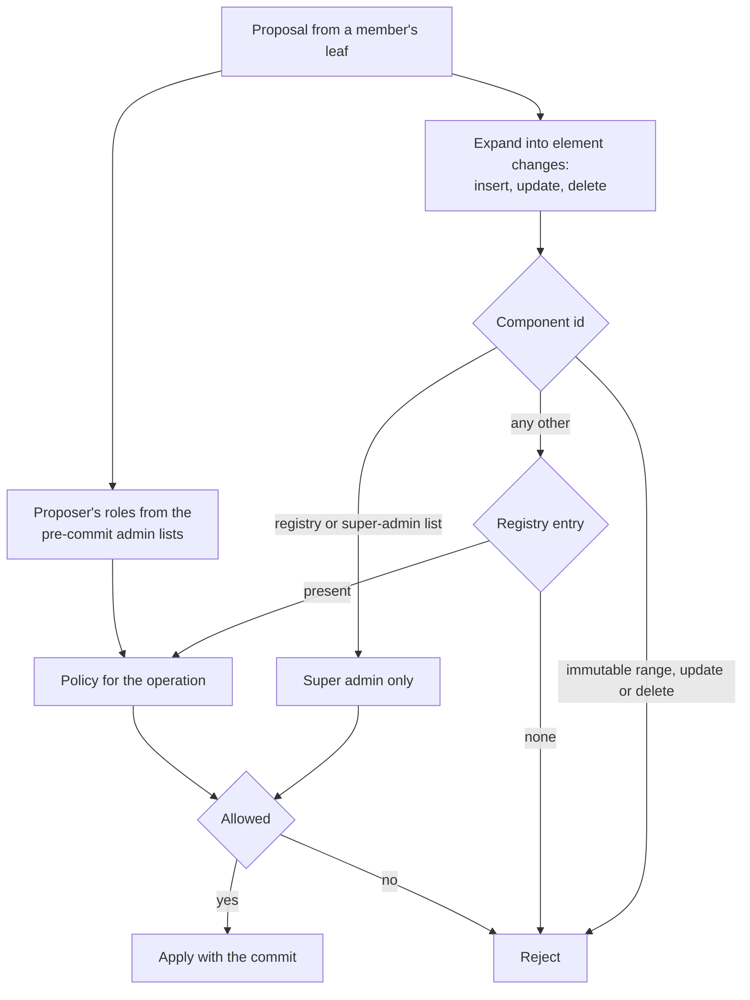

# Group permissions

Every change to a group's shared state after creation is a proposal a member signs, and a policy decides whether that member may make it. The policies live in the group itself: the component registry is one component of the group's app-data dictionary, so the rules travel inside the group context, every member reads the same rules, and a change to the rules is a change to the group that the same engine judges. A client that evaluates a policy differently from the others accepts a commit they reject, or rejects one they accept, and the group forks.

The engine has three inputs: the proposer's roles, read from the admin and super-admin lists as they stood before the commit; the operation, which is an insert, an update, or a delete of one element of one component; and the policy the registry stores for that component and operation. Two components are not governed by the registry, because the registry depends on them: the registry itself and the super-admin list are always super-admin-only. Membership changes carried as MLS Add and Remove proposals are judged by the membership component's policies, so one policy governs a member's presence however the change is carried.



## Scope

In scope: the roles and the components that hold them; the policy language and how it is evaluated; how a write to a component is authorised, including membership changes carried as MLS proposals; what a valid registry is and how an app changes a policy; the preconfigured policy sets, including the fixed DM policy; the DM exception; and how a new component or policy kind is introduced without forking older clients.

Out of scope: when the engine runs and what a rejected commit does to the group (`GMOD`); the app-data dictionary, the registry's own encoding, component types, and the content of components other than the policies (`?META`); a DM's identifier, stitching, and other properties (`?DMS`); the identity state a membership change is checked against (`?IDENT`); and what a Welcome carries (`JOIN`).

| Related | Relation |
| --- | --- |
| `GMOD` | Owns the commit validation pipeline that invokes this engine, the membership component, and the protocol-version floor. GMOD-001 states which proposal types reach the engine. |
| `?META` | Owns the app-data dictionary, the `ComponentMetadata` message and the registry's encoding, the component id assignments of the metadata fields, and how a delta is applied by component type. |
| `?DMS` | Owns everything about a DM other than its policy set (section 6). |

## Terms

| Term | Meaning |
| --- | --- |
| Component | One entry of a group's app-data dictionary, named by a component id. Its value is bytes whose shape the registry's `component_type` names. Owned by `?META`. |
| Component id | The 16-bit identifier of a component. Section 3 states the ranges this spec constrains. |
| Registry | The component with id `0x8000`: a map from component id to `ComponentMetadata`, whose `permissions` field carries the policies this spec defines. |
| Admin list | The component with id `0x8002`: the set of inbox ids that are admins. |
| Super-admin list | The component with id `0x8001`: the set of inbox ids that are super admins. |
| Admin | An inbox that is in the admin list. A super admin is not an admin unless it is also in the admin list, but every rule that admits an admin admits a super admin. |
| Super admin | An inbox that is in the super-admin list. |
| Proposer | The member whose leaf node signed a proposal. |
| Committer | The member whose leaf node signed a commit. |
| Element change | One insert, update, or delete of one element of a component, as section 3 derives it from a proposal. |
| Action policy | One of the four registry policies that govern membership and the admin list: `insert_policy` and `delete_policy` of the membership component, and `insert_policy` and `delete_policy` of the admin list. |
| Preset | One of the preconfigured policy sets of section 5. |

## 1. Roles

A group has three tiers: members, admins, and super admins. The two lists are components, so a change to a list is a proposal the engine judges like any other, and a receiver reads the roles from the group context it holds. The group's creator starts as the only super admin. There is no other standing role: the creator's inbox id is recorded in the group but grants nothing after creation.

Roles are read from the committed group context, never from a proposal inside the commit being judged. A commit that adds an inbox to the super-admin list and, in the same commit, has that inbox write a super-admin-only component is rejected, because the write is evaluated against the lists as they stood before the commit.

Two rules protect the top tier from the tiers below it. A super admin cannot be removed from the group, whatever the remove-member policy says, so an admin who was delegated removals cannot remove the person who delegated them. The super-admin list cannot be emptied, so a group never reaches a state in which nobody can change its rules. A super admin can remove itself from the list while another super admin remains.

| ID | Title | Requirement | Why |
| --- | --- | --- | --- |
| PERM-001 | Roles from the committed lists | The validator MUST take a proposer's admin status from the admin list and its super admin status from the super-admin list of the committed group context, and MUST NOT take either from a proposal in the commit being judged. | A commit that grants a role and uses it in one step would let any member escalate. |
| PERM-002 | The creator is the first super admin | When a client creates a group whose conversation type is not DM, it MUST write the super-admin list containing only the creator's inbox id and the admin list empty. | |
| PERM-003 | Super admins stay members | If a commit removes from the membership component an inbox that is in the super-admin list, then the validator MUST reject the commit, whatever the membership component's `delete_policy` says. | An admin who could remove the super admins takes the group from them. |
| PERM-004 | The super-admin list never empties | If a proposal would change a super-admin list that is not empty into one that is empty, then the validator MUST reject it. | A group with no super admin has nobody who can change its rules, and no rule can restore one. |
| PERM-005 | Registry and super-admin list are super-admin-only | When a proposal writes the registry or the super-admin list and the proposer is not a super admin, the validator MUST reject it, whatever the registry says. | These two components are the ones the registry's own authority rests on. |

## 2. The policy language

A policy is a `MetadataPolicy`: a base policy, or a condition over child policies. A component's entry in the registry carries three of them, one for each operation.

```proto
// A policy that governs updating metadata
message MetadataPolicy {
  // Base policy
  enum MetadataBasePolicy {
    METADATA_BASE_POLICY_UNSPECIFIED = 0;
    METADATA_BASE_POLICY_ALLOW = 1;
    METADATA_BASE_POLICY_DENY = 2;
    METADATA_BASE_POLICY_ALLOW_IF_ADMIN = 3;
    METADATA_BASE_POLICY_ALLOW_IF_SUPER_ADMIN = 4;
  }

  // Combine multiple policies. All must evaluate to true
  message AndCondition {
    repeated MetadataPolicy policies = 1;
  }

  // Combine multiple policies. Any must evaluate to true
  message AnyCondition {
    repeated MetadataPolicy policies = 1;
  }

  oneof kind {
    MetadataBasePolicy base = 1;
    AndCondition and_condition = 2;
    AnyCondition any_condition = 3;
  }
}
```

```proto
// Per-component permission policy with separate rules for insert, update,
// and delete operations.
//
// Insert and update are separate because some components need different
// permission levels for creating vs modifying entries. For example, group
// membership allows any member to update (installations/sequence ID) but
// only admins to insert (add a new member).
message ComponentPermissions {
  // Policy for inserting a new value (component does not yet exist)
  MetadataPolicy insert_policy = 1;
  // Policy for updating an existing value
  MetadataPolicy update_policy = 2;
  // Policy for deleting a value
  MetadataPolicy delete_policy = 3;
}
```

A base policy reads only the proposer's roles. It does not read the value being written or the element being changed.

| Base policy | Allowed when |
| --- | --- |
| `METADATA_BASE_POLICY_ALLOW` | Always |
| `METADATA_BASE_POLICY_DENY` | Never |
| `METADATA_BASE_POLICY_ALLOW_IF_ADMIN` | The proposer is an admin or a super admin |
| `METADATA_BASE_POLICY_ALLOW_IF_SUPER_ADMIN` | The proposer is a super admin |

A policy can be malformed: no `kind`, a `base` value the table does not list, or a condition with no children. A malformed policy denies. Evaluation of a condition stops at the first child that decides it, and a malformed child that is reached decides it as denied, so two clients that evaluate the same tree in the same order reach the same answer.

| ID | Title | Requirement | Why |
| --- | --- | --- | --- |
| PERM-006 | Base policy semantics | The validator MUST evaluate a `base` policy as the table above states, against the proposer's roles under PERM-001. | |
| PERM-007 | Condition semantics | The validator MUST evaluate the children of an `and_condition` in order and stop at the first child that is denied or malformed, with that child's result, and MUST evaluate the children of an `any_condition` in order and stop at the first child that is allowed or malformed, with that child's result. An `and_condition` whose children are all allowed MUST be allowed, and an `any_condition` whose children are all denied MUST be denied. | Two clients that stop at different children reach different answers for the same tree. |
| PERM-008 | A malformed policy denies | When the policy that governs a write has no `kind`, has a `base` value not in the table above, or is a condition with no children, the validator MUST deny the write. | A policy that fails open turns a corrupt registry entry into an open door. |

## 3. Authorising a write

A proposal that writes a component is an `AppDataUpdate` proposal, defined in [draft-ietf-mls-extensions §4.6](https://datatracker.ietf.org/doc/html/draft-ietf-mls-extensions#section-4.6), whose operation is `Update` with a payload or `Remove`. The validator first turns the proposal into element changes, because a delta to a set or a map can insert one element and delete another in one proposal, and the two operations can have different policies. The registry entry's `component_type` says how the payload is read; `?META` owns the component types and how a delta is applied, and is expected to require that a client applies a delta to a component it has no built-in definition for by that registered type.

| Component type | Operation on the wire | Element changes |
| --- | --- | --- |
| A scalar (`COMPONENT_TYPE_BYTES`, `COMPONENT_TYPE_STRING`) | `Update` | One update, whether or not the component already has a value |
| A scalar | `Remove` | One delete |
| A set or a map | `Update` carrying a delta | One change per mutation in the delta: an insert for an insert, an update for an update, a delete for a remove, a remove-by-hash, or a delete |
| A set or a map | `Remove` | One delete |

The component id ranges decide the first two checks. Ids `0x8000` to `0xBFFF` are the protocol's, `0xC000` to `0xFEFF` an application's, and `0xFF00` to `0xFFFF` reserved. The last 512 ids of each of the first two blocks, `0xBE00` to `0xBFFF` and `0xFD00` to `0xFEFF`, are immutable: a component there is written when the group is created and never changed. The reserved range can hold no registry entry (PERM-016), so a write there is denied by PERM-012.

Every other component is governed by its registry entry, and a component with no entry is denied to everyone. The entry is read from the committed registry, so registering a component and writing it are two commits; the same rule keeps a commit from changing a policy and using the changed policy in one step. A client that predates a component still has the registry entry, and evaluates the write under it rather than refusing what it does not know, because a refusal the other members do not share is a fork.

MLS Add and Remove proposals are judged by the membership component's `insert_policy` and `delete_policy`, per inbox, against the member that proposed that inbox's change. The committer's roles do not matter, so a member may commit proposals other members made (GMOD section 4) without lending them its authority or needing any.

| ID | Title | Requirement | Why |
| --- | --- | --- | --- |
| PERM-009 | Judge the proposer | The validator MUST evaluate every proposal against the roles of its proposer, and MUST NOT substitute the committer's roles when the two differ. | A super admin that commits pending proposals would otherwise lend its authority to every proposal it sweeps up. |
| PERM-010 | The committed registry decides | The validator MUST read the registry entry that governs a write from the committed group context, so that a component registered or a policy changed in the same commit does not govern a write in that commit. | |
| PERM-011 | Operation selects the policy | For each element change the validator MUST apply `insert_policy` to an insert, `update_policy` to an update, and `delete_policy` to a delete, where the changes are derived from the proposal as the table above states, and MUST reject the proposal when any one change is denied. | |
| PERM-012 | Deny by default | When a write names a component id other than `0x8000` and `0x8001` and the committed registry has no entry for it that decodes as a `ComponentMetadata` with all three policies present, the validator MUST reject the write. | |
| PERM-013 | Immutable components | When an element change is an update or a delete of a component whose id is in `0xBE00` to `0xBFFF` or `0xFD00` to `0xFEFF`, the validator MUST reject it, whatever the registry says. | The conversation type, the creator, and a DM's two members are what a joiner's checks rest on (JOIN-060). |
| PERM-014 | Unknown components are judged, not refused | When a proposal names a component the client has no built-in definition for, the validator MUST evaluate it under the committed registry entry's `component_type` and policies, and MUST NOT reject it because the component is unknown. | A client that refuses what it does not know forks the group at the first component a newer release adds. |
| PERM-015 | Membership proposals use the membership policies | For each inbox a commit adds to the membership component, the validator MUST evaluate the membership component's `insert_policy` against the proposer of that inbox's Add proposal, and for each inbox it removes, `delete_policy` against the proposer of its Remove proposal, and MUST reject the commit when either denies. | |

## 4. The registry

A registry entry is validated when it is written, so that a corrupt entry never enters the committed registry and every later commit can be judged. The four action policies are validated as complete trees whenever a commit writes the registry, because a commit that leaves one of them malformed would make every later membership or admin change undecidable for every member. The admin list is constrained: its policies are base policies of deny, admin, or super admin, because an admin list that anyone may write is a super-admin list that anyone may write.

The registry is written by super admins only (PERM-005), and no stored value changes that; the permission to update permissions is the super-admin role itself. An app changes a policy through its SDK, which names the action or the metadata field and a policy option; the client writes the registry field the table below names. The metadata field to component id assignment is owned by `?META`.

| App operation | Component | Registry field |
| --- | --- | --- |
| Add member | Membership component | `insert_policy` |
| Remove member | Membership component | `delete_policy` |
| Add admin | Admin list | `insert_policy` |
| Remove admin | Admin list | `delete_policy` |
| Update a metadata field | That field's component | `insert_policy` and `update_policy` |

| Policy option | Written as |
| --- | --- |
| Allow | `METADATA_BASE_POLICY_ALLOW` |
| Deny | `METADATA_BASE_POLICY_DENY` |
| Admin only | `METADATA_BASE_POLICY_ALLOW_IF_ADMIN` |
| Super admin only | `METADATA_BASE_POLICY_ALLOW_IF_SUPER_ADMIN` |

| ID | Title | Requirement | Why |
| --- | --- | --- | --- |
| PERM-016 | Registry entries are validated on write | When a registry delta inserts or updates an entry whose id is below `0x8000`, is `0xFF00` or above, or is `0x8000` or `0x8001`, or whose value does not decode as a `ComponentMetadata` with all three policies present, the validator MUST reject the proposal. When a delta updates or deletes an entry whose id is in an immutable range of PERM-013, or deletes one whose id is reserved or is `0x8000` or `0x8001`, the validator MUST reject the proposal. | |
| PERM-017 | Action policies stay well-formed | If the registry a commit produces has no entry for the membership component or the admin list, or an action policy in it is malformed under PERM-008 at any node, or an admin list policy is not a `base` of `METADATA_BASE_POLICY_DENY`, `METADATA_BASE_POLICY_ALLOW_IF_ADMIN`, or `METADATA_BASE_POLICY_ALLOW_IF_SUPER_ADMIN`, then the validator MUST reject the commit. | Every later membership or admin change would be undecidable, and a group whose commits cannot be judged is stuck for every member. |
| PERM-018 | Changing a policy | An SDK MUST let an app set each policy the first table above names to one of the options in the second table, and MUST write the change as an update of the named registry field to the named value. | An app on one SDK sets a policy that members on every other SDK then enforce. |

## 5. Preconfigured policy sets

An app creates a group with a preset, or with its own policies. Two presets exist for groups, and a DM is created with a fixed third set. The table gives the policy of every governed component and operation; a component the table does not name is created with `METADATA_BASE_POLICY_ALLOW_IF_ADMIN` for insert and update and `METADATA_BASE_POLICY_ALLOW_IF_SUPER_ADMIN` for delete. The membership component's `update_policy` is `METADATA_BASE_POLICY_ALLOW` in every set, because an update of a member's entry records an identity change any member may act on (GMOD section 2). The immutable components are `METADATA_BASE_POLICY_ALLOW_IF_SUPER_ADMIN` for insert and `METADATA_BASE_POLICY_DENY` for update and delete in every set. The metadata fields are named here by the name an app uses; `?META` owns their component ids.

| Governed policy | All members | Admins only | DM |
| --- | --- | --- | --- |
| Membership `insert_policy` (add member) | Allow | Allow if admin | Deny |
| Membership `delete_policy` (remove member) | Allow if admin | Allow if admin | Deny |
| Admin list `insert_policy` (add admin) | Allow if super admin | Allow if super admin | Deny |
| Admin list `delete_policy` (remove admin) | Allow if super admin | Allow if super admin | Deny |
| Group name, description, image URL, app data: insert and update | Allow | Allow if admin | Allow |
| Disappearing-message settings, both fields: insert and update | Allow if admin | Allow if admin | Allow |
| Minimum protocol version: insert and update | Allow if super admin | Allow if super admin | Allow |
| Commit-log signer: insert, update, and delete | Allow if super admin | Allow if super admin | Allow if super admin |
| Every metadata field: delete | Allow if super admin | Allow if super admin | Allow if super admin |

An SDK reports which preset a group's policies match, so that an app can show "admins only" without reading the registry. The match ignores components the table does not name.

| ID | Title | Requirement | Why |
| --- | --- | --- | --- |
| PERM-019 | A preset writes the table | When a client creates a group with a preset, it MUST write the registry with the policies the table above gives for that preset. | A preset chosen on one SDK must mean the same rules to the members on every other. |
| PERM-020 | Recognising a preset | An SDK MUST report a group as matching a preset exactly when every governed policy the table above names equals that preset's column, and MUST report no preset otherwise. | |

## 6. DMs

A DM is a group between two inboxes whose policies deny every membership and admin change, so no third inbox can enter and no role exists. The two inboxes are recorded in the immutable `DM_MEMBERS` component at creation (`?DMS` owns the DM's other properties). One exception is needed: the creator adds the other participant in a commit after creation, and a participant removed from the ratchet tree, or one with a new installation, is added back by the other. The exception admits exactly that add and nothing else.

| ID | Title | Requirement | Why |
| --- | --- | --- | --- |
| PERM-021 | The DM policy set | When a client creates a DM, it MUST write the registry with the DM column of the table in section 5, and MUST write the admin list and the super-admin list empty. | JOIN-060 rejects a Welcome for a conversation that claims to be a DM but whose rules admit a third inbox. |
| PERM-022 | The other participant may be added | When a group's `DM_MEMBERS` component names two inboxes and a proposal adds exactly one inbox to the membership component, that inbox is one of the two, and it is not the proposer's inbox, the validator MUST allow the add whatever the membership component's `insert_policy` says, and MUST apply the same exception to the Add proposals that carry that inbox's installations. | The DM add policy denies everyone, so without the exception the second participant could never be added or re-added. |

## 7. Introducing a new rule

A group's policies outlive every client version. The registry carries an entry for every governed component, including components a client has never heard of, and PERM-014 makes that client evaluate rather than refuse. The legacy permissions extension, group context extension type `0xff02` carrying a `GroupMutablePermissionsV1`, is not written by a client and is not read: a group's policies are the registry and nothing else, and GMOD-001 rejects the `GroupContextExtensions` proposal that used to carry it.

Three things a newer release can introduce are invisible to PERM-014: a new `MetadataBasePolicy` value, a new condition kind, and a new `component_type`. An older client evaluates the first two as malformed and denies, and cannot apply the third. Such a client would reject a commit the others accept. The protection is the group's protocol-version floor, owned by `GMOD`: GMOD-025 pauses a client below the floor instead of letting it reject, so a release that introduces one of these constructs raises the floor first, in a commit of its own that uses nothing new.

| ID | Title | Requirement | Why |
| --- | --- | --- | --- |
| PERM-023 | New constructs follow the floor | When a client publishes a commit that uses a `MetadataBasePolicy` value or a `kind` not in section 2, or a `component_type` not in `?META`, the minimum protocol version component of the committed group context MUST already be not less than the first client version that defines that construct. | A client below the floor pauses (GMOD-025); a client above the floor that meets the construct without warning rejects the commit, and the group forks around it. |

## Known limitations

A per-component invariant is enforced only by a client that has a built-in definition of the component. PERM-004 protects the super-admin list on every client, because every client defines it, but an invariant a newer release adds to a new component is checked by newer clients only. The registry policy still applies on every client.

Evaluation stops at the first child that decides a condition (PERM-007), so an `any_condition` with an allowing child ahead of a malformed one allows a write. The projection an SDK reports to an app validates the whole tree and reports a malformed metadata policy as deny, so the app can read deny for a field a write to which succeeds. The action policies do not have this gap, because PERM-017 keeps them well-formed at every node.

A group created before the registry existed carries the legacy extensions `0xff00` to `0xff02` and no app-data dictionary. No client reads those extensions, so such a group cannot be modified or joined. No such group exists on a self-hosted deployment created after the registry, and no migration is provided.

The creator's inbox id is recorded in an immutable component but confers no role. A creator that removes itself from the super-admin list is an ordinary member.
