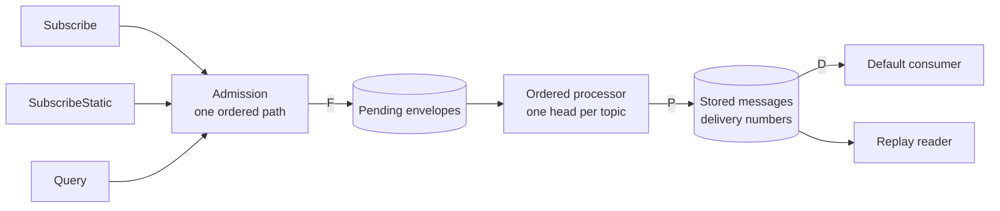

# Message processing

How a client turns envelopes from the network into durable, ordered local state, in order, without losing or double-applying anything, and how stored messages reach an app. These rules are payload-agnostic: they hold whatever the envelope contains. What applying an envelope means for each kind belongs to `?GMOD`, JOIN, and `?IDENT`.

The backend keeps one totally ordered log per topic. A client that reads it holds three positions. The received position is the prefix whose bytes it has stored. The processed position is the prefix it has applied or rejected. The delivery position is the prefix of stored messages an app has acknowledged. Every source of envelopes, whether a live stream, a static stream, or a query, feeds the same receipt path, so a message is admitted once, applied once, and delivered from local state rather than from the wire.

## Scope

In scope: the one receipt path that live streams, static streams, and queries share; the received, processed, and delivery positions and their invariants; ordered processing per topic; retry against terminal rejection; targets and what completion through a target means; capacity under backlog; reconnection; and delivery of stored messages to an app with acknowledgement.

Out of scope: the wire frames, limits, and error codes of the stream and query RPCs (`?API`); what applying a commit, proposal, or application message means and which commits are valid (`?GMOD`); Welcome validation and the join anchor (JOIN); identity update validation (`?IDENT`); the send path and intents (SEND); fork detection (`?FORK`); consent states (`?CONS`); and the topic layout (`?TOPIC`).

| Related | Relation |
| --- | --- |
| `?API` | Owns sequence id allocation and ordering, the `Subscribe`, `SubscribeStatic`, `Query`, and `QueryNewest` contracts, and the `message_hash` the backend assigns. This spec owns what a client does with what they return. |
| JOIN | Owns when a Welcome installs or replaces group state and the join anchor. This spec owns the queue a Welcome waits in and the positions a join sets. |
| `?GMOD` | Owns commit validation. This spec owns which validation outcomes advance the processed position and which hold it. |
| SEND | Owns intents and publishing. This spec owns how a published envelope is received back and confirmed. |

## Terms

| Term | Meaning |
| --- | --- |
| Topic log | The envelopes the backend stores on one topic, ordered by sequence id. |
| Received position | `F(topic)`: the highest sequence id on a topic such that every envelope at or below it is stored as pending or already handled. |
| Processed position | `P(topic)`: the highest sequence id on a group or identity topic such that every envelope at or below it is applied or terminally rejected. |
| Pending envelope | An admitted envelope the client has not yet applied or terminally rejected. |
| Head | The pending envelope with the lowest sequence id on a group or identity topic. |
| Admission | The transaction that stores a batch of envelopes as pending and advances `F`. |
| Target | `H(topic)`: a sequence id captured once for one operation, which that operation is complete through. |
| Terminal rejection | The refusal a client records for an envelope that a later attempt cannot change. It advances `P` past the envelope. |
| Held | A pending envelope that failed for a reason a later attempt can change: a storage failure, a missing dependency, or a version this client does not implement. |
| Delivery number | A database-local integer assigned to a stored message when it first becomes deliverable. It is immutable and increases with each assignment. |
| Delivery position | `D(group)`: the delivery number of the last message in a group that the default consumer acknowledged or excluded by filter. |
| Delivery cursor | A database identity and a delivery number. It means "resume strictly after this item". |
| Default consumer | The one message stream per client database that advances delivery positions. |
| Replay reader | A message stream started from an explicit delivery cursor. It neither reads nor writes delivery positions. |
| Acknowledgement | The point at which a delivered item is done: the callback returned, or the app asked for the next item. |

## 1. One receipt path

Envelopes reach a client three ways: a bidirectional `Subscribe` stream on native targets, a `SubscribeStatic` stream on browser targets, and a unary `Query`. All three deliver the same envelopes in the same per-topic order, and all three end in one admission transaction. Admission stores the exact envelope bytes as pending and advances `F` in the same transaction, so a crash after admission loses nothing and a crash before it changes nothing. Receipt is not processing: a stored envelope is ciphertext, and nothing about it is trusted until the processor applies it.

A batch is admitted only as a contiguous extension of the topic log. The client tells the backend the exclusive position it wants to read after, and a batch that starts above `F` is refused, because the envelopes between `F` and its start would never be fetched. A batch that overlaps `F` is the normal case on reconnect; the overlap is dropped and the suffix is stored. `?API` is expected to require that the backend orders envelopes on one topic totally by sequence id, that the order is stable once assigned, and that `Subscribe`, `SubscribeStatic`, and `Query` each return a topic's envelopes in that order from a supplied exclusive cursor.

`F` moves only over envelopes the client stored. A `QueryNewest` answer, a registration target, a publish response, and a push notification each name a sequence id without carrying the envelopes below it, so none of them may move `F`.

| ID | Title | Requirement | Why |
| --- | --- | --- | --- |
| PROC-001 | Admit only a contiguous prefix | When the client admits a batch for a topic whose exclusive start is greater than the topic's `F`, whose envelopes are not in strictly increasing sequence id order, or that contains an envelope whose topic is not the batch's topic, it MUST refuse the whole batch and leave `F` and the pending envelopes unchanged. | An envelope stored past a gap is applied out of order, and the gap is never fetched. |
| PROC-002 | Receipt is atomic | When the client admits a batch, it MUST store every envelope whose sequence id is greater than `F`, and none at or below it, and set `F` to the highest stored sequence id, in one transaction that either commits all of it or none of it. | A stored envelope without the position, or the position without the envelope, is either applied twice or never fetched. |
| PROC-003 | Only stored envelopes move F | The client MUST NOT set a topic's `F` to a sequence id from a `QueryNewest` answer, a registration target, a publish response, or a push notification. | Each of those names a position without carrying the envelopes below it, so the client would skip them. |
| PROC-004 | Every source shares one path | The client MUST admit an envelope from a `Subscribe` stream, a `SubscribeStatic` stream, and a `Query` through the checks of PROC-001 and PROC-002 and no other path, and MUST NOT apply an envelope that was not admitted. | An envelope applied straight from the wire bypasses the positions, so it can be applied twice or ahead of its predecessors. |

## 2. Positions and ordered processing

A group or identity topic is processed as a strict prefix. The processor takes the head, applies it or records a terminal rejection, and advances `P` to it, all in one transaction together with the state change and every message the envelope produced. A head that fails for a reason a later attempt can change stays where it is, and nothing behind it moves. Topics are independent: a held head on one topic does not stop another topic.

The two positions and the pending set are one structure. `P` never exceeds `F`, because the processor can only handle what admission stored. Neither position moves backwards. A join is the one operation that sets both at once: JOIN-046 requires that an installed group's `P` equals the Welcome's anchor, and this spec adds what happens to `F` and to pending envelopes around it. Pending envelopes at or below the anchor were sent to a membership this installation is not part of and are discarded; those above it are the messages the new membership sent while the Welcome was in flight, and they are kept.

The processor may run in more than one process on one database, and a process may restart between attempts. The positions and the pending set are therefore the only record of progress, and every attempt reads them fresh. PROC-006 and PROC-007 are the invariants CONF-022 and JOIN section 7 rely on: a stream closed by a latch leaves no position past the last processed envelope, and the cursor JOIN compares an anchor against only ever moves over applied messages.

| ID | Title | Requirement | Why |
| --- | --- | --- | --- |
| PROC-005 | Apply in sequence id order | When the client processes a group or identity topic, it MUST apply or terminally reject the head before any pending envelope with a higher sequence id on that topic. | MLS state is a chain. A commit applied before its predecessor forks the group. |
| PROC-006 | P advances only over handled envelopes | The client MUST set a group or identity topic's `P` to a sequence id only when every admitted envelope at or below it has been applied or terminally rejected, and MUST NOT set `P` above `F`. | A position past an unhandled envelope skips it, and the client has no way to learn what it skipped. |
| PROC-007 | Positions never move backwards | The client MUST NOT set a topic's `F` or `P` to a value less than its current value. | A position moved backwards re-applies envelopes, which produces duplicate messages and repeated commits. |
| PROC-008 | Processing is atomic | When the client applies an envelope, it MUST commit the state change, every message it produced, the removal of the pending envelope, and the advance of `P` in one transaction, and MUST leave none of them when the attempt fails. | A message stored without its `P` advance is delivered twice; a `P` advance without the state change loses the commit. |
| PROC-009 | Each envelope applies once | The client MUST apply the effects of a given group or identity envelope to its local state at most once, whatever the order and repetition in which the envelope is delivered and however many processes share the database. | A second application inserts the message twice and, for a commit, advances the epoch past where the group is. |
| PROC-010 | A join sets both positions | When the client installs group state from a Welcome whose anchor is `A`, it MUST set the group topic's `F` to the greater of its current value and `A`, MUST discard pending envelopes at or below `A`, and MUST retain those above `A`, in the join's transaction. | Envelopes below the anchor cannot be decrypted and would hold the topic for ever. Envelopes above it are messages sent to the new membership while the Welcome was in flight, and discarding them loses them. |

## 3. Retry and terminal rejection

Every failed attempt is one of two things. A property of the input, which a later attempt with the same prefix and the same state cannot change, is rejected terminally: `P` advances past the envelope in the same transaction and the topic continues. Anything else holds the head: a storage failure, a missing private key, an identity reference that has not been fetched yet, or a version this client does not implement. The distinction is the load-bearing decision in this spec. Rejecting a transient failure loses a message or a commit that the next attempt would have applied; holding on an input failure stops the topic behind an envelope that will never apply.

The table below is the disposition of each class. A requirement points at it, so it is normative. The MLS conditions are those of RFC 9420 as the client's MLS implementation reports them; `?GMOD` owns which XMTP commit validations fail terminally and which are dependencies, and is expected to require that a commit whose identity reference names a sequence id not less than the commit's own, or one the backend holds no update for after the client has fetched, is rejected, and that a reference the client has not yet fetched holds the commit. `?FORK` owns what follows an epoch mismatch; the client records the group as possibly forked when it rejects under the epoch row, and `?FORK` is expected to own that record and its recovery.

| Class | Condition | Disposition |
| --- | --- | --- |
| Malformed | The envelope does not decode, its group id is not the topic's, or its MLS message is not a `PrivateMessage` | Terminal rejection |
| Undecryptable | AEAD authentication fails, the generation is out of bound, the wire format is wrong, or the secret for the message was already consumed or discarded for forward secrecy | Terminal rejection |
| Epoch mismatch | The message names an epoch greater than the group's, or an epoch less than the group's by 3 or more | Terminal rejection |
| Invalid commit | The commit fails the checks of [RFC 9420 §12.4.2](https://www.rfc-editor.org/rfc/rfc9420.html#section-12.4.2) for a reason other than a missing local key, including a proposal reference the ordered prefix never carried | Terminal rejection |
| Unauthorized | The sender is not a member, or `?GMOD` rejects the commit under the group's permissions | Terminal rejection |
| Own without intent | The sender is this installation and no intent matches the payload (SEND section 4) | Terminal rejection |
| Already applied | The envelope's effects are already in local state | Terminal rejection |
| Local failure | Storage fails, a local key the message needs is absent, or the attempt is interrupted | Held; retried after 250 milliseconds |
| Dependency | The envelope references identity state the client has not fetched | Held while the fetch runs |
| Unsupported | The payload's MLS version is not 1.0, or the group requires a protocol version later than this client's | Held until the client is upgraded |

A held envelope keeps `P` where it is. An unsupported one is held with no deadline for a group or identity topic, because an upgrade is the only thing that makes it readable and the topic cannot skip it. A Welcome is different: it has no successors that depend on it, so JOIN-077 and JOIN-079 give it a deadline.

| ID | Title | Requirement | Why |
| --- | --- | --- | --- |
| PROC-011 | Reject only a property of the input | The client MUST record a terminal rejection for a group or identity envelope only under a class the table above marks terminal, and MUST advance `P` past the envelope in the same transaction as the record. | A rejection recorded for a transient failure loses the envelope permanently, and the client cannot ask for it again. |
| PROC-012 | Hold everything else | If an attempt fails under a class the table above marks held, then the client MUST keep the envelope pending, MUST NOT advance `P` to or past it, and MUST NOT apply a later envelope on that topic. | Skipping the envelope forks the group at the next commit; rejecting it loses a message the next attempt would apply. |
| PROC-013 | A hold stops only its topic | While a head is held, the client MUST continue to process every other topic whose head is ready. | One unreadable group would otherwise stop every conversation. |
| PROC-014 | Decide on the prefix alone | When the client decides whether an envelope is terminally rejected, it MUST decide from the ordered prefix, the installed state, and fetched identity state, and MUST NOT decide from wall-clock timing, an unpublished intent, or a delivery position. | A decision that depends on local timing gives two installations of one inbox different answers about the same envelope. |

## 4. Targets and completion

An operation that waits for the network, whether an explicit sync or a send waiting for its own envelope, needs a point at which it is done. That point is a target: a sequence id captured once from the backend for that operation. A target is a head the backend observed, including replica lag; it is not a promise about later publications, and a publication after capture does not move it. Without a fixed target a sync under continuous traffic never returns.

Completion through a target means processing, not receipt. For a group or identity topic it is `P` at or above the target, or the group inactive because a commit at or below the target removed this installation. For a Welcome topic it is `F` at or above the target with no pending Welcome at or below it, because Welcomes are independent of one another and a later success does not resolve an earlier one. A Welcome that installs a group at or below the Welcome target discovers work the operation did not know about: the operation captures a target for that group too, so that "synced" includes the conversations the sync found.

A sync shares receipt and processing with any open stream. It fetches by `Query` from `F` when `F` is below the target, and waits for the processor once `F` reaches it. It never re-fetches a stored prefix and never starts a second processor.

| ID | Title | Requirement | Why |
| --- | --- | --- | --- |
| PROC-015 | A target is captured once | When the client captures a target for an operation, it MUST take it from a `QueryNewest` answer, from the acknowledgement of a stream registration made for that operation, or from the publish receipt of the client's own envelope, and MUST NOT move it for a later publication. | A moving target never arrives under continuous traffic. |
| PROC-016 | Completion is processing through the target | The client MUST report an operation complete through a target only when, for each group or identity topic, `P` is not less than the target or the group is inactive at a removal at or below it, and for each Welcome topic, `F` is not less than the target and no pending Welcome at or below it remains. | An operation reported complete on receipt tells the app its messages are in when they are still ciphertext. |
| PROC-017 | Discovered groups join the operation | When a Welcome at or below an operation's Welcome target installs a group, the client MUST capture a target for that group and include it in the operation's completion under PROC-016. | A sync that ignores the conversations it just joined returns with those conversations empty. |
| PROC-018 | An incomplete operation says so | When an operation ends before PROC-016 holds for every topic, whether at its deadline, on a held head, or on cancellation, the client MUST return a failure that names each unfinished topic with its target, `F`, `P`, and cause, and MUST NOT return success. | A success that hides an unfinished topic makes the app act on state it does not have. |
| PROC-019 | Cancellation keeps pending work | When an operation is cancelled or reaches its deadline, the client MUST retain every pending envelope and every position. | Work discarded on cancellation has to be downloaded again, and a Welcome cannot be. |

## 5. Capacity

Admission and processing are bounded so that a backlog on one topic cannot exhaust the database or the client's memory. The client holds separate budgets for group, Welcome, and identity envelopes, so that a group backlog cannot starve the Welcomes and identity updates that group processing depends on. When a budget is full, receipt pauses for the topics holding the most pending data, and resumes as the processor drains them. The limits are internal constants, not app settings.

| Limit | Value |
| --- | --- |
| Rows and bytes in one admission batch | 128 rows, 32 MiB |
| Pending rows and bytes per topic | 1024 rows, 64 MiB |
| Pending rows and bytes across group topics | 8192 rows, 128 MiB |
| Pending rows and bytes across Welcome topics | 1024 rows, 64 MiB |
| Pending rows and bytes across identity topics | 4096 rows, 32 MiB |
| Rows and bytes in one local delivery read | 128 rows, 16 MiB |

Receipt is served in rotation: a topic that was read goes to the back of the ready set, and a newly ready topic joins the back, so no topic with pending catch-up is starved. That does not promise equal throughput.

| ID | Title | Requirement | Why |
| --- | --- | --- | --- |
| PROC-020 | Pressure never skips | When admitting a batch would exceed a limit in the table above, the client MUST refuse that batch, leave `F` and the pending envelopes unchanged, and resume admission for that topic from `F` once the budget allows, and MUST NOT discard a pending envelope to make room. | An envelope dropped for capacity is a gap the client never notices and the group forks at the next commit. |

## 6. Streams and reconnection

A client registers topics on a stream with the cursor it wants to read after, which is each topic's durable `F`. The stream's acknowledgement of a registration carries the topic's target for that registration, and every envelope after it is admitted under section 1. `?API` is expected to require that a registration delivers every retained envelope above the supplied cursor, because a sequence id gap is legal and the client cannot tell a skipped envelope from one that never existed. A group discovered by a Welcome while a stream over all groups is open is added to the stream from its `F`. On a browser target the same registration is a `SubscribeStatic` stream per group of topics, replaced when the interest set changes; on every target the interest set is the app's choice and consent does not gate it.

A stream fails for many reasons: the connection drops, the backend restarts, or no frame arrives for three keepalive intervals (30 seconds each unless the stream's first frame names another). Reconnection is transparent to the positions. The client reconnects with backoff, registers the current interest set again, and supplies each topic's `F` as recorded in the database at that moment, never a position it received but did not commit. Overlap with envelopes already admitted is dropped by PROC-002. A result that belongs to a registration the client has since replaced is discarded.

An app sees the connection's state and each topic's progress rather than a closed stream. A latch under CONF-022 is the one event that closes streams with an error.

| ID | Title | Requirement | Why |
| --- | --- | --- | --- |
| PROC-021 | Register from the durable position | When the client registers a topic on a stream, including on every reconnection, it MUST supply a position that is not greater than the topic's `F` as committed in the database, and MUST NOT supply a sequence id that admission has not committed. | A position ahead of `F` skips the envelopes between them; one behind it costs a re-download, which PROC-002 absorbs. |
| PROC-022 | Reconnection keeps progress | When a stream fails and the client reconnects, it MUST keep every position and pending envelope, and MUST NOT report the failure as completion of any operation. | A reconnection that resets positions replays every conversation from the start. |
| PROC-023 | Connection state is observable | An SDK MUST expose to an app, for each message stream, the connection state as connecting, connected, reconnecting, failed, or closed, and for each selected topic whether its registration is pending, active, or removed and whether its processing through the current target is pending, complete, blocked, or cancelled. | An app that cannot distinguish a reconnecting stream from a failed one either spins or gives up. |

## 7. Local delivery

An app's message stream reads stored messages, not the wire. Every message that becomes deliverable receives a delivery number in the transaction that made it deliverable, so the database holds a total order of deliverable messages that is independent of network sequence ids and of which source stored the message. A message becomes deliverable when it is stored with `Published` status by ordered processing, by a join, or by an import. An optimistic own message has no number until its envelope comes back and processing confirms it (SEND section 4), so an app never sees a message before it is published.

There are two kinds of reader. The default consumer is the one stream per client database that advances delivery positions: it reads, per selected group, every retained message above `D` in delivery number order, hands over one item at a time, and persists `D` when the app acknowledges. A replay reader starts from an explicit cursor the app supplies and never touches `D`. Both deliver the same items in the same order; only the default consumer remembers.

Acknowledgement is the boundary that makes delivery at-least-once rather than lossy. A callback that throws, an iterator that is dropped, or a crash before the write leaves the item unacknowledged, and it is delivered again with the same message id and the same delivery number. Delivery is not exactly-once and does not claim to be. Ownership of the default consumer is a lease: a second consumer is refused while the lease is live, and a stale owner cannot advance `D` after its lease expired, so two processes cannot interleave acknowledgements.

Scope and filter are different things. Scope is the set of groups a consumer reads; a group outside it keeps its `D` and its backlog. A filter, on consent state or conversation type, is applied to a candidate inside the scope; a candidate the filter excludes is acknowledged without a callback, so a filter change does not replay it. `?CONS` owns the consent states a filter names and is expected to require that a conversation starts in a state that decides whether it is streamed. Messages in a conversation of a kind the client uses between its own installations are never delivered; `?SYNC` owns that kind.

Conversation callbacks are live notifications and are not replayed; a conversation an app missed while it had no stream open is found by listing, not by a stream.

| ID | Title | Requirement | Why |
| --- | --- | --- | --- |
| PROC-024 | Delivery numbers are assigned once | When a stored message first has `Published` status, the client MUST assign it one delivery number greater than every delivery number assigned before in that database, in the transaction that gave it that status, and MUST NOT change or reuse the number afterwards, including after the message is deleted. | A number that moves or repeats makes a cursor resume in the wrong place. |
| PROC-025 | Only published messages are delivered | A message stream MUST deliver only stored messages that have `Published` status and a delivery number, and whose disappearing-message deadline, where it has one, has not passed, and MUST NOT deliver a message with `Unpublished` or `Failed` status. | An unpublished own message shown as received is shown twice, once now and once when it is confirmed. |
| PROC-026 | The default consumer resumes from D | The default consumer MUST deliver, for each group in its scope, every eligible message with a delivery number greater than the group's `D`, in delivery number order, including messages stored by another process, by a sync, or by an import, and including while the client has no network connection. | A stream that starts "now" loses everything that arrived while it was closed. |
| PROC-027 | Receipt and processing never advance D | The client MUST NOT advance a group's `D` by admitting, processing, or syncing envelopes; only an acknowledgement or a filter exclusion by the default consumer MUST advance it. | A sync that consumed messages on the app's behalf would hide them from the stream. |
| PROC-028 | One unacknowledged item | The default consumer MUST hold at most one delivered item without acknowledgement, MUST persist `D` for that item when the callback returns normally or the app requests the next item, and MUST NOT treat queuing the callback, a callback error, or dropping the iterator as acknowledgement. | An item acknowledged on enqueue is lost when the app crashes before it runs. |
| PROC-029 | A failed acknowledgement stops the reader | If persisting `D` fails, then the default consumer MUST NOT hand over another item until the write succeeds or the reader is closed, and MUST NOT skip the unacknowledged item on restart. | Continuing past a failed write delivers the next item and then replays this one behind it. |
| PROC-030 | Repeats keep their identity | When a message is delivered more than once, every delivery MUST carry the same message id and the same delivery cursor. | The id is the only thing an app can deduplicate on. |
| PROC-031 | One default consumer per database | While a default consumer's lease of 30 seconds is unexpired, the client MUST refuse to open a second default consumer with an error the app can distinguish, and MUST NOT advance `D` on behalf of a consumer whose lease has expired or been replaced. | Two consumers advancing one `D` skip each other's items. |
| PROC-032 | Scope excludes, filter consumes | When a group is outside the default consumer's scope, the client MUST leave that group's `D` unchanged; when a candidate inside the scope is excluded by the consent or conversation-type filter, the client MUST advance `D` past it without a callback. | Consuming an out-of-scope group loses its backlog when the app adds it back; replaying a filtered row shows an app a message it chose not to see. |
| PROC-033 | Every item carries a cursor | An SDK MUST attach to every delivered item, from either reader, a delivery cursor holding the database identity and the item's delivery number, and MUST reject a supplied cursor whose database identity is not the current database's with an error the app can distinguish. | A cursor from another database or from before a restore resumes at a number that means something else. |
| PROC-034 | Replay is independent | When an app opens a stream from a supplied cursor, the client MUST deliver every eligible message in scope with a delivery number greater than the cursor's, in delivery number order, then continue with new messages, and MUST NOT read, write, or lease `D`. | A replay that moved `D` would make the default consumer skip what the replay showed. |
| PROC-035 | History and stream meet without a gap | An SDK MUST let an app read history and a delivery cursor from one database snapshot, such that every eligible message stored after that snapshot has a delivery number greater than the cursor's. | A cursor taken after the history read misses messages stored between the two. |

## Known limitations

Delivery is at-least-once. A crash or a lease expiry between the app's handling of an item and the durable acknowledgement repeats that item with the same message id (PROC-030). An app that needs exactly-once handling deduplicates on the message id.

A group or identity envelope this client cannot read because of its MLS version or the group's required protocol version holds its topic with no deadline. Only an upgrade releases it. Nothing tells other members that this installation has stopped; they observe it when it next sends or fails to.

A target is the head a backend replica had at capture. A replica behind the primary yields a lower target, and an operation completes through it without the envelopes the primary already holds. The next operation captures a newer target.

Fairness across topics bounds starvation, not latency. A slow consumer or a shared connection still affects every topic on the stream.

Conversation callbacks are live only. A conversation joined while no stream was open is not replayed to a later stream; the app lists conversations to find it. A conversation notification follows the database at a 250 millisecond poll, so it can trail the join by that much.

The connection state `failed` is not terminal: the client keeps reconnecting with a delay that doubles from 5 seconds to 300 seconds while it reports `failed`. A held group or identity head is retried once when the client starts processing and then only after the client is created again; only held Welcomes are rescanned, every 3600 seconds.

Push notifications are not a receipt path. A push payload names an envelope; the client fetches from `F` under section 1 and never applies the payload directly. `?PUSH` owns the payload.
