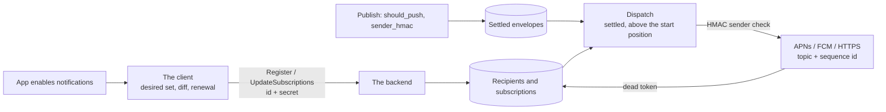

# Push subscriptions and webhooks

A client that is not connected still needs to learn that an envelope arrived. The backend delivers that fact itself: a recipient registers a random id and a bearer secret, names one channel (APNs, FCM, or an HTTPS webhook), and keeps a list of topics on the backend. The backend reads settled envelopes, drops the ones the recipient's own inbox sent, and sends a push body that carries the topic and the sequence id and nothing else. The app fetches and decrypts the envelope itself. A webhook receiver verifies every body against the signing key it registered.



## Scope

In scope: registration and the bearer secret; the three channels and the safety of a webhook destination; how a subscription is added, replaced, and removed, and where it starts; which envelopes are pushed; the delivery condition and what survives a restart; sender suppression; the push body and the provider contract; when a recipient is deleted; webhook signing; retention; the client's desired set, its sync, and its recovery; and what an SDK exposes to an app.

Out of scope: request authentication on the notification RPCs (AUTH-001, AUTH-003, AUTH-013); sequence ids and the publish contract (API-286 through API-289, API-210); the closed allocation boundary (API-203); the layout of a topic (TOPIC-001); how the root HMAC key is generated and reaches every installation of an inbox (SYNC-015, SYNC-022); consent states (`CONS` section 1); metrics, shutdown, and read routing (OPS-007, OPS-008, OPS-014, OPS-017); the operator's configuration file, provider credentials, and the backend's internal bounds, which belong to operator documentation; and the platform a deployment runs on.

| Related | Relation |
| --- | --- |
| `AUTH` | AUTH-001, AUTH-003, and AUTH-013 apply to the three notification RPCs as to every other path. No claim is read for ownership; the secret alone decides it. |
| `API` | Owns sequence ids (API-286 through API-289), the envelope wire format including `GroupMessage` (API-210), admission (API-230), and the closed allocation boundary (API-203). |
| `TOPIC` | TOPIC-001 gives the kind byte and identifier of a group-message topic and a welcome topic, the two kinds a subscription may carry. |
| `SYNC` | SYNC-015 and SYNC-022 own the inbox's 42-byte root HMAC key. This spec owns what is derived from it. |
| `OPS` | OPS-014 keeps request data out of telemetry; OPS-017 owns the metric catalogue; OPS-007 and OPS-008 own shutdown as a client sees it. |

API-203 defines the closed allocation boundary; PUSH-216 requires that a new subscription reads it in the transaction that stores the subscription. API-291 requires that the boundary never decreases.

## Terms

| Term | Meaning |
| --- | --- |
| Recipient id | `recipient_id`: 32 random bytes that name a push endpoint. |
| Recipient secret | `recipient_secret`: 32 random bytes that prove ownership of a recipient id. A bearer credential on the transport's TLS. |
| Channel | How the backend reaches a recipient: `CHANNEL_APNS`, `CHANNEL_FCM`, or `CHANNEL_HTTP`. |
| Delivery target | The APNs device token, the FCM registration token, or the webhook URL with its signing key. |
| Signing key | `HttpDelivery.signing_key`: 16 to 64 bytes a webhook recipient supplies, under which the backend signs every body sent to it. |
| Subscription | One (recipient, topic) pair with its key window, its start position, and its `include_commits` flag. |
| Start position | The closed allocation boundary (API-203) read in the transaction that first stored a subscription (PUSH-216). |
| HMAC epoch | A 30-day period: the Unix time in seconds divided by 2592000, rounded down. |
| Key window | The `hmac_keys` of a subscription: up to three 42-byte keys for consecutive HMAC epochs starting at `hmac_epoch_base`, so the key at index `n` is for epoch `hmac_epoch_base + n`. |
| Root key | The inbox's 42-byte random key from which every group HMAC key derives (SYNC-015). |
| Push-eligible envelope | A stored envelope that PUSH-219 makes eligible for delivery. |
| Settled envelope | An envelope whose sequence id is at or below the closed allocation boundary. |
| Dispatcher | The backend process that, at a given time, loads deliveries and records dispatch progress. |
| Delivery | One (envelope, subscription) send. |
| Attempt | One provider request for a delivery. |
| Push body | The JSON object a delivery carries, under PUSH-259. |
| Renewal time | The time of the recipient's last successful `Register` or `UpdateSubscriptions`, set under PUSH-255. |
| Receiver | The HTTPS server an app operates at a webhook URL. |
| Notification state | The client's local state: disabled, enabled, or failed with a cause. |
| Override | A per-conversation setting of enabled or disabled that replaces the rules for that conversation. |
| Effective value | Whether a conversation is desired: its override when it has one, otherwise whether its conversation consent state is in the enabled `consent_states`. |
| Uploaded set | The client's local record of the topics it has stored on the backend and the key window and `include_commits` it sent for each. |
| Desired set | The topics the client wants stored on the backend, under PUSH-238. |

## 1. Recipients and the bearer secret

A recipient is a push endpoint, not an installation. It is named by 32 random bytes and proven by 32 more, both generated by the client once for its database and sent on every request. The backend stores only the SHA-256 hash of the secret, so a database read yields nothing a caller can present. There is no binding to an inbox or an installation, so nothing on the wire identifies whose device a recipient is, and a revoked installation that still holds its secret can renew until it stops (Known limitations).

`Register` creates or renews a recipient and never touches its subscriptions, so a token refresh does not lose them. `Unregister` is a hard delete that takes the subscriptions with it. Every successful mutating call returns the backend's view in a `RecipientState`, which the client compares with its own record (section 8).

```proto
enum Channel {
  CHANNEL_UNSPECIFIED = 0;
  CHANNEL_APNS = 1;
  CHANNEL_FCM = 2;
  CHANNEL_HTTP = 3;
}

message ApnsDelivery {
  string token = 1;
}

message FcmDelivery {
  string token = 1;
}

message HttpDelivery {
  string url = 1;
  // Webhook signing key, 16 to 64 bytes.
  bytes signing_key = 2;
}

message RegisterRequest {
  // Random recipient identity and bearer secret, each 32 bytes.
  bytes recipient_id = 1;
  bytes recipient_secret = 2;
  oneof delivery {
    ApnsDelivery apns = 3;
    FcmDelivery fcm = 4;
    HttpDelivery http = 5;
  }
  reserved 6;
  reserved "metadata";
}

message UnregisterRequest {
  bytes recipient_id = 1;
  bytes recipient_secret = 2;
}

message UnregisterResponse {}

message RecipientState {
  uint64 topic_count = 1;
  Channel channel = 2;
  int64 expires_at_ns = 3;
}
```

Admission is one ordered contract. The checks below run in order on every notification RPC, after the request authentication of AUTH-001, and the first failure decides the status; a later check runs only when every earlier one passed. The client acts on the status (PUSH-262), so a malformed payload on an unknown recipient answers `NOT_FOUND` and not `INVALID_ARGUMENT`.

| Order | Condition | Status |
| --- | --- | --- |
| 1 | `recipient_id` or `recipient_secret` is not exactly 32 bytes | `INVALID_ARGUMENT` |
| 2 | `Unregister` or `UpdateSubscriptions` names a `recipient_id` no stored recipient carries | `NOT_FOUND` |
| 3 | a stored recipient's hash differs from the SHA-256 of `recipient_secret` | `PERMISSION_DENIED` |
| 4 | `Register`: the channel, delivery target, or signing key fails section 2, or the token or URL is empty, longer than 2048 characters, or contains a NUL character | the status section 2 gives, else `INVALID_ARGUMENT` |
| 4 | `UpdateSubscriptions`: a subscription fails PUSH-215 or the request exceeds PUSH-217 | the status those rows give |

| ID | Title | Requirement | Why |
| --- | --- | --- | --- |
| PUSH-200 | Registration wire format | The backend MUST serve `Register`, `Unregister`, and `UpdateSubscriptions` with the messages defined above and in section 3, with the field numbers and types shown, and MUST NOT reuse a field number of any of them for another meaning. | |
| PUSH-201 | Random recipient identity | When a client first enables notifications on a database, it MUST set `recipient_id` and `recipient_secret` to 32 bytes each drawn from a cryptographically secure random source, MUST NOT derive either from an inbox id, an installation key, or any other key, and MUST send the same pair on every later request from that database, across disable and enable. | A secret derived from something the backend can learn is no secret. A new pair on each enable leaves the old recipient registered until it expires, and its device receives every push twice. |
| PUSH-253 | Ordered admission | The backend MUST apply the admission table above to every notification RPC in the order given, fail the request with the status of the first condition that holds, and change nothing when any condition holds. The comparison in check 3 MUST run in constant time. | The client re-registers on `NOT_FOUND` and stops on `INVALID_ARGUMENT` (PUSH-262); a status decided by a later check for a missing recipient does the wrong one. |
| PUSH-254 | Secrets and private values stay private | The backend MUST store only the SHA-256 hash of a recipient secret, and MUST NOT place a recipient secret, a recipient id, a delivery token, a webhook URL, a signing key, or a topic in storage in clear other than the columns that serve delivery, in a status message, or in any telemetry field OPS-014 names. | A copy of the database must not be a set of valid credentials, and a log line must not name whose device a recipient is. |
| PUSH-255 | Registration and the reported state | When `Register` or `UpdateSubscriptions` passes PUSH-253, the backend MUST, in one transaction, store the request (for `Register`, the channel and delivery target, creating the recipient with no subscriptions when the id is unknown and otherwise leaving every subscription unchanged), set the renewal time to the current time, and return a `RecipientState` whose `topic_count` is the number of stored subscriptions, whose `channel` is the stored channel, and whose `expires_at_ns` is the renewal time plus `recipient_ttl_seconds` in nanoseconds. | A token refresh that dropped subscriptions would silence a device until its next full sync; a `topic_count` that is not the stored count starts a repair that never ends (PUSH-260). |
| PUSH-207 | Unregister deletes everything | When `Unregister` passes PUSH-253, the backend MUST delete the recipient and every subscription it holds. | |

## 2. Channels

A recipient has exactly one channel, and a channel exists on a deployment only when the operator configured it: a table for APNs with the provider key, its key id, the team id, the bundle id, and an `environment` of `production` or `sandbox`; a table for FCM with the service account; a table for HTTPS, which may be empty. A registration for a channel that has no table fails, so an app learns at enable time that the deployment cannot reach it.

A webhook is an HTTPS request from inside the deployment's network to a URL any registrant chooses, so the destination is checked at registration and again before every attempt, because a host can resolve to a different address later. The address classes below are never connected to unless the operator sets `allow_private_addresses`, which defaults to `false` and is for development and test only. When `allowed_domains` is set and not empty, a host must equal an entry, or, for an entry that starts with `*.`, end with the entry's text after the star with at least one label before it; the match is case-insensitive on the host name alone. The list binds at send time as well, so narrowing it stops deliveries to recipients registered before the change.

| Blocked address class | IPv4 | IPv6 |
| --- | --- | --- |
| Private | 10.0.0.0/8, 172.16.0.0/12, 192.168.0.0/16 | fc00::/7 |
| Shared and site-local | 100.64.0.0/10 | fec0::/10 |
| Loopback | 127.0.0.0/8 | ::1 |
| Link-local | 169.254.0.0/16 | fe80::/10 |
| Unspecified, broadcast, multicast | 0.0.0.0, 255.255.255.255, 224.0.0.0/4 | ::, ff00::/8 |
| IPv4-mapped | | ::ffff:0:0/96 mapping any address above |

| ID | Title | Requirement | Why |
| --- | --- | --- | --- |
| PUSH-210 | Channel must be configured | When `Register` names a channel whose configuration table is absent, the backend MUST fail the request with `FAILED_PRECONDITION`. | |
| PUSH-256 | Webhook destination safety | When an `HttpDelivery` has a `url` whose scheme is not `https` or that carries a username or password, a `signing_key` shorter than 16 or longer than 64 bytes, or a host that matches no entry of a non-empty `allowed_domains`, resolves to no address, or, while `allow_private_addresses` is `false`, resolves to an address in the blocked address table above, the backend MUST fail `Register` with `INVALID_ARGUMENT`. Before each webhook attempt the backend MUST resolve the host again, MUST NOT send when the host no longer matches a non-empty `allowed_domains` or, while `allow_private_addresses` is `false`, any resolved address is in the table, MUST connect only to an address it resolved then, and MUST NOT follow a redirect. | A redirect, a rebinding host, or a widened list moves a signed request to an address that was never checked. |

## 3. Subscriptions

A subscription is one topic a recipient wants pushes for. The client sends adds and removes, never a full list, so a change costs one row per changed topic and a large set is sent in batches. An add of a topic already stored replaces its key window and flag and keeps its start position, so a key rotation never re-delivers old envelopes. A new topic starts at the closed allocation boundary read in the transaction that stores it: the recipient never receives an envelope that settled before it subscribed. An envelope settled while the subscription's transaction was open can be missed (Known limitations).

A subscription may name only a group-message topic or a welcome topic (TOPIC-001). Nothing checks that the recipient is a member of the group or the installation of the welcome topic (Known limitations). `hmac_epoch_base` is read only when `hmac_keys` is not empty; the backend stores no base for a subscription without keys, whatever value the field carries.

```proto
message UpdateSubscriptionsRequest {
  bytes recipient_id = 1;
  bytes recipient_secret = 2;
  repeated Subscription adds = 3;
  repeated bytes removes = 4;
}

message Subscription {
  // Group-message or welcome topic bytes.
  bytes topic = 1;
  // First epoch of the consecutive key window; zero with no keys.
  int64 hmac_epoch_base = 2;
  // At most three keys, each 42 bytes.
  repeated bytes hmac_keys = 3;
  bool include_commits = 4;
}
```

| ID | Title | Requirement | Why |
| --- | --- | --- | --- |
| PUSH-215 | Malformed subscription | When a `Subscription` or a `removes` entry carries a topic that is not a group-message topic or a welcome topic under TOPIC-001, when a topic appears more than once across `adds` and `removes`, or when an add has a negative `hmac_epoch_base`, more than 3 `hmac_keys`, or a key that is not 42 bytes, the backend MUST fail the request with `INVALID_ARGUMENT` and apply nothing. | |
| PUSH-216 | Atomic application | When `UpdateSubscriptions` passes PUSH-253, the backend MUST apply every remove and every add in one transaction: a removed topic that is not stored changes nothing, an added topic already stored takes the new key window and `include_commits` and keeps its start position, and a new topic takes as its start position the closed allocation boundary read in that transaction. | A start position read outside the transaction, or moved on replacement, makes a subscribing client receive envelopes it had already read or miss ones it had not. |
| PUSH-217 | Topic limit | When applying a request would leave the recipient with more stored subscriptions than `max_push_topics`, whose default is 100000, the backend MUST fail the request with `RESOURCE_EXHAUSTED` and apply neither its adds nor its removes. | |

## 4. What is pushed

Eligibility is decided when an envelope is stored, from the `should_push` and `sender_hmac` fields of `GroupMessage` (API-210). A Welcome is always eligible: the joiner is offline by definition. A group message is eligible when the sender asked for a push, or when it is a commit or a proposal, which reaches only the subscriptions that opted in through `include_commits`. Key packages, identity updates, and commit-log entries are never pushed.

| ID | Title | Requirement | Why |
| --- | --- | --- | --- |
| PUSH-218 | Sender chooses the push | When the client publishes an application message, it MUST set `should_push` to the value the app gave for that send, and to `true` when the app gave none. When it publishes a commit or a proposal, it MUST set `should_push` to `false`. | |
| PUSH-219 | Eligibility at storage | The backend MUST treat as push-eligible a stored envelope that is a Welcome, or a group message whose `should_push` is `true`, or a group message that is a commit or a proposal, and MUST NOT deliver a push for any other envelope. | |

## 5. Dispatch

The backend reads push-eligible envelopes above its recorded position and up to the closed allocation boundary, joins them with the subscriptions on their topics, and sends one delivery per (envelope, subscription). The boundary is a ceiling: an envelope above it may still have an earlier sequence id in flight, so reading past it could skip one for ever. Below the boundary nothing is skipped.

The promise is about first attempts, not receipt. The recorded position moves past a window only when every delivery in it has had one attempt, so a crash, a lost dispatcher role, or a shutdown that runs out of drain time (OPS-008) resends the windows above the position, and a delivery whose attempt was sent but never answered may be repeated. A failed attempt is retried up to the channel's bound while the dispatcher that loaded it runs; a replay after a restart starts the count again. Delivery is therefore at-least-once-attempted and never exactly-once; a receiver that acts on a push more than once for the same `topic` and `sequence_id` does so at its own cost (Known limitations). Which process is the dispatcher, how the role moves, and the sizes of windows, pages, and in-flight sends are the implementation's choice.

The dispatcher also runs the retention pass: a recipient that has not renewed within `recipient_ttl_seconds` is deleted with its subscriptions. The client renews on its own schedule (PUSH-260), so a running client never expires.

| ID | Title | Requirement | Why |
| --- | --- | --- | --- |
| PUSH-257 | The delivery condition | For every push-eligible envelope whose sequence id is not greater than the closed allocation boundary when the window is read, and every subscription on its topic whose start position is less than that sequence id, whose `include_commits` is `true` or whose envelope is not a commit or a proposal, and whose recipient is stored on a configured channel, the backend MUST make at least one attempt to that recipient, including after a crash, a change of dispatcher, or a restart, unless PUSH-230 suppresses the delivery. The backend MUST NOT deliver an envelope to a subscription that fails any of those conditions. | A recipient woken for a group's history, or for every membership change, is a recipient that switches notifications off. A skipped envelope is one no device learns of until it polls. |
| PUSH-226 | Expiry deletes the recipient | While it is the dispatcher, the backend MUST run a retention pass no later than 3600 seconds after the previous pass ended, and each pass MUST delete every recipient whose renewal time is older than `recipient_ttl_seconds`, whose default is 2592000, together with its subscriptions. | A device that stopped renewing is gone or has disabled notifications, and its token would otherwise be sent to for ever. |

## 6. Sender suppression

A sender's own message must not wake the sender's devices. The backend cannot read the message to learn who sent it, so the sender attaches an HMAC and the recipient's installations upload the keys that verify it. Every installation of an inbox derives the same key for a group from the inbox's root key (SYNC-015, SYNC-022), so a match means "this recipient's inbox sent it". The key rotates every HMAC epoch and the client uploads a three-epoch window, so a key uploaded a month ago still covers the current epoch and the next.

The check runs only on a delivery that already passes PUSH-257, and it fails open. A missing `sender_hmac`, no key for the envelope's epoch, a payload that does not decode, or a key window that has not reached the backend yet all result in a push. The sender picks the epoch by its own clock at send time and the backend by the envelope's server timestamp, so a message near an epoch boundary can reach its own sender (Known limitations).

| ID | Title | Requirement | Why |
| --- | --- | --- | --- |
| PUSH-258 | Sender attaches the HMAC | When the client publishes a group message, it MUST set `sender_hmac` to the 32-byte HMAC-SHA256 ([RFC 2104 §2](https://www.rfc-editor.org/rfc/rfc2104#section-2)) of `data` under the group's key for the current HMAC epoch by its clock, where that key is the 42-byte output of HKDF-SHA256 ([RFC 5869 §2](https://www.rfc-editor.org/rfc/rfc5869#section-2)) with salt `libXMTP HKDF salt!`, input keying material the root key followed by the group id, and info the group id followed by the epoch as a signed 64-bit little-endian integer. | Two installations that derive different keys for the same group see the inbox's own messages pushed to one of them. |
| PUSH-229 | Upload the key window | When the client stores or replaces a group-message subscription, it MUST send the keys for the HMAC epochs current minus 1, current, and current plus 1 in that order with `hmac_epoch_base` equal to current minus 1, and it MUST send the subscription again when its uploaded window no longer covers the epoch after the current one or when the root key changed. | A window that lapses turns every own message into a push at the next epoch. |
| PUSH-230 | Backend suppresses a match | When a delivery that passes PUSH-257 carries a `sender_hmac` of exactly 32 bytes and the subscription's key window holds a key at index equal to the HMAC epoch of the envelope's server timestamp minus `hmac_epoch_base`, the backend MUST compute HMAC-SHA256 of the stored `GroupMessage.data` under that key, compare it with `sender_hmac` in constant time, and MUST NOT deliver when they are equal. In every other case the backend MUST NOT suppress the delivery. | Failing closed on a missing key would silence a recipient whose client is one upload behind. |

## 7. Delivery

No message content leaves the backend in a push. The body carries the topic and the sequence id, and on the webhook channel the recipient id, so a receiver that serves many recipients can tell them apart. `sequence_id` is decimal text on every channel so that a JavaScript consumer never rounds it. Every push is a background push: the app fetches the envelope and renders the notification itself.

Each channel maps the provider's answer to one of five outcomes, in the order the table lists them for that channel; the first row that matches decides. A transient outcome is retried after at least the delay shown, up to `max_attempts` attempts in total for the delivery, whose default is 3, while the dispatcher that loaded it runs. A rejected outcome stops after one attempt. A mismatch outcome names a token that does not belong to this sender, which one operator mistake in `environment`, the bundle id, or the FCM project produces for every recipient at once, so it keeps the recipient. A terminal outcome names a dead token and deletes the recipient, unless the recipient re-registered in the meantime. Every attempt, including a provider credential fetch, is bounded to 10 seconds, so a receiver that never answers holds nothing for longer than that.

| Channel | Request | Outcomes, first match decides |
| --- | --- | --- |
| APNs | HTTP/2 `POST` to the production or sandbox host for the configured `environment`, a provider token under ES256 for the configured key, `apns-topic` equal to the bundle id, `apns-push-type: background`, `apns-priority: 5`, `apns-collapse-id` equal to the base64 topic, body `{"aps":{"content-available":1},"topic":..,"sequence_id":..}` | `200`: delivered. `410` with reason `Unregistered` or `ExpiredToken`: terminal. `400` with reason `BadDeviceToken` or `DeviceTokenNotForTopic`: mismatch. `429`, `500`, `503`, timeout, connection error: transient, delay 1 second. `403 ExpiredProviderToken`: one token refresh and resend within the same attempt, then rejected. Anything else: rejected. |
| FCM | HTTP v1 `messages:send` for the service account's project with an OAuth2 token, `data` holding `topic` and `sequence_id`, `android.priority` `HIGH`, `apns.headers` `apns-priority: 5` and `apns-push-type: background`, `apns.payload.aps.content-available: 1`, no collapse key | `200`: delivered. `429`, a `google.rpc.QuotaFailure` detail, or `FcmError` `QUOTA_EXCEEDED`: transient, delay 60 seconds. `500`, `503`, timeout, connection error: transient, delay 10 seconds. `FcmError` `UNREGISTERED`: terminal. `FcmError` `SENDER_ID_MISMATCH`: mismatch. `FcmError` `UNAVAILABLE` or `INTERNAL`: transient, delay 10 seconds. Anything else, including an error with no typed `FcmError`: rejected. A `Retry-After` longer than the delay is honoured up to 300 seconds. |
| HTTPS | `POST` to the URL, `content-type: application/json`, the three signature headers of PUSH-235, body adds `"recipient_id"` | `2xx`: delivered. `404` or `410`: transient, delay 1 second, and terminal when every one of `max_attempts` attempts answered `404` or `410`. `5xx`, timeout, connection error: transient, delay 1 second. Anything else, including a redirect: rejected. |

| ID | Title | Requirement | Why |
| --- | --- | --- | --- |
| PUSH-259 | Channel requests and the push body | The backend MUST send each channel's request as the Request column of the table above states, carrying a JSON object whose `topic` is the standard base64 of the topic bytes and whose `sequence_id` is the envelope's sequence id as decimal text, with `recipient_id` as lowercase hex on the HTTPS channel and no payload bytes, message hash, inbox id, installation key, or secret; and MUST classify each answer, retry, and delay as the Outcomes column states. | An APNs push without the background type and priority 5 is refused or shown as an empty alert; an FCM push to an Apple device at high priority is refused; a body with content leaks it to the provider. |
| PUSH-234 | Dead tokens delete the recipient | When an attempt's outcome is terminal under the table above and the recipient's stored channel, delivery target, signing key, and secret hash still equal the ones the attempt used, the backend MUST delete the recipient and its subscriptions. On a mismatch, rejected, or transient outcome, and when the stored values differ, the backend MUST NOT delete it. | A provider's answer that arrives after a re-registration must not delete the new registration. |

### 7.1 Webhook signing

A receiver has no way to tell the backend from anyone else who learned its URL, except the signing key it registered. Every body is signed in the shape of the [Standard Webhooks specification](https://github.com/standard-webhooks/standard-webhooks/blob/main/spec/standard-webhooks.md), sections "Webhook ID", "Timestamp", and "Signature scheme", with the symmetric `v1` scheme, so an existing verifier library checks it. XMTP deviates in two places: `webhook-id` is new for every attempt rather than stable across the retries of one event, and the key is 16 to 64 raw bytes carried in `HttpDelivery.signing_key` rather than a `whsec_` string with the specification's 24-byte minimum. The backend emits the timestamp but enforces no replay window.

A receiver verifies before it acts: it recomputes the signature of PUSH-235 over the exact received body bytes with its signing key, compares in constant time, rejects a body whose signature does not match, rejects a `webhook-timestamp` outside a tolerance it chooses, and treats two bodies with the same `topic` and `sequence_id` as one notification. Those checks protect only the receiver, so they are guidance here and not requirements.

With `signing_key` of 32 bytes each `0x07`, `webhook-id` `fixed-id`, `webhook-timestamp` `1700000000`, and the body `{"topic":"AQID","sequence_id":"9007199254740993","recipient_id":"0101"}`, the signature is `v1,IszeBLRjxb7spJ5RLi+KW0w/aK3Buioq9E6jl3MKWZw=`.

| ID | Title | Requirement | Why |
| --- | --- | --- | --- |
| PUSH-235 | Every webhook body is signed | When the backend sends a webhook, it MUST set `webhook-id` to a value unique to that attempt, `webhook-timestamp` to the current Unix time in seconds as decimal text, and `webhook-signature` to `v1,` followed by the standard base64 of HMAC-SHA256 under the recipient's signing key over the string `webhook-id`, `.`, `webhook-timestamp`, `.`, and the exact body bytes. | |

## 8. The client

The client keeps notifications in step with consent, membership, overrides, and key rotation without an app call at every start. It records locally what it has uploaded, computes the difference from local tables alone, and sends it in batches of at most 1000 subscriptions. The backend's `topic_count` on every response is the one cross-check: when it disagrees with the local record, the client re-sends every topic it holds over later runs rather than clearing its record, so a client with more topics than fit in one request still converges.

The sync runs after each event that can change the desired set, at client start while enabled, and at least once an hour, so a wake lost to a crash costs at most an hour. Notification work never sits inside another operation's transaction, and a failed or slow notification request never fails a send or a consent write.

A revoked installation, an expired recipient, or a backend restored from a backup answers `NOT_FOUND`. The client treats that as "register again from nothing", for the configuration that is enabled now.

| ID | Title | Requirement | Why |
| --- | --- | --- | --- |
| PUSH-238 | The desired set | While notifications are enabled, the client's desired set MUST be the group-message topic of every group and DM in which the installation is an active member and whose effective value is enabled, plus the installation's welcome topic while `include_welcomes` is `true`, plus the group-message topic of every sync group in which the installation is an active member while `include_sync_groups` is `true`, and no other topic, with the `include_commits` rule on each group subscription and no keys on the welcome subscription. | |
| PUSH-260 | Sync, renewal, and recovery | While notifications are enabled, the client MUST send as adds every desired topic missing from its uploaded set and as removes every uploaded topic no longer desired after each of a consent write, a membership commit, an override change, a group creation, a Welcome, a root key change, and enabling, and no later than 3600 seconds after its previous sync run ended while it runs. It MUST send `Register` or `UpdateSubscriptions` before the `expires_at_ns` of the last `RecipientState` it received while it runs, or at its first sync run when it starts after that time. When a request answers `NOT_FOUND`, or a `RecipientState.topic_count` differs from the size of its uploaded set, the client MUST re-send every desired topic over later runs, after a `Register` on `NOT_FOUND`, and MUST NOT discard its uploaded set on a count mismatch. | An expired recipient is deleted with every subscription (PUSH-226); clearing the whole record on every mismatch never converges for a set larger than one request. |
| PUSH-240 | No collateral failure | The client MUST bound every notification request to 30 seconds of waiting on the backend, and MUST NOT fail, roll back, or hold for longer than that bound a message send, a consent write, welcome processing, or key package maintenance because of a notification request. | |
| PUSH-261 | Enable and disable | When an app enables notifications, the client MUST reject the call without storing anything when its background task runner is disabled or an HTTP signing key is shorter than 16 or longer than 64 bytes, and otherwise MUST store the channel and rules, set the state to enabled, send `Register`, and return its result, with a failure under PUSH-262 setting the state to failed and any other failure leaving it enabled with the registration retried. When an app disables notifications, the client MUST set the state to disabled and clear the channel and the uploaded set before it sends the disable's own `Unregister`, MUST treat `NOT_FOUND` on that call as success, MUST keep every override, and MUST NOT send any other notification request while the state is not enabled. | A request that reaches the backend after a disable re-registers a device the user switched off. |
| PUSH-262 | Error transitions | When a notification request for the enabled configuration fails with `PERMISSION_DENIED`, `INVALID_ARGUMENT`, `OUT_OF_RANGE`, `UNIMPLEMENTED`, or `FAILED_PRECONDITION`, the client MUST set the state to failed with that cause and MUST NOT send another notification request until the app enables notifications again. When it fails with `RESOURCE_EXHAUSTED`, the client MUST stop sending adds until the desired set changes and MUST keep sending removes; when it fails with `NOT_FOUND`, a timeout, or any other status, the client MUST keep the state enabled and retry under PUSH-260. | Each terminal status means the same request will fail the same way; retrying it hides the cause from the app. |

## 9. What an app can do

An app supplies the delivery target, because only the app holds the platform's push token or operates a receiver; the client never obtains one. The surface exists on the native and Node SDKs. The browser SDK has none: there is no channel a browser page can be reached on.

| ID | Title | Requirement | Why |
| --- | --- | --- | --- |
| PUSH-263 | The notification surface | A native or Node SDK MUST let an app enable notifications with a channel, a delivery target, and the rules `consent_states`, `include_welcomes`, `include_sync_groups`, and `include_commits`, applying `consent_states` of allowed only, `include_welcomes` `true`, `include_sync_groups` `false`, and `include_commits` `false` for a rule the app omits; disable them; read the notification state without a backend call; and set a conversation's override to enabled, disabled, or none and read the conversation's effective value. | |
| PUSH-251 | Failures are distinguishable | An SDK MUST let an app distinguish, as distinct kinds, a failed state caused by each status in PUSH-262, a channel the deployment has not configured (PUSH-210), a topic limit (PUSH-217), a request timeout, and a client whose background tasks are disabled. | |

## Known limitations

Anyone who holds a recipient can subscribe to any group-message or welcome topic. The push body carries no content, so what such a subscriber learns is that traffic exists on a topic, and when. The backend does not authorize a publisher either.

A recipient is not bound to an installation. A revoked installation that still holds its recipient secret keeps renewing and receiving pushes until it stops or its app disables notifications. An operator who needs to cut off a revoked device does so through request authentication (AUTH-001).

A subscription's start position is read inside its transaction, but dispatch does not wait for open subscription transactions. An envelope settled after that read and dispatched before the transaction commits is above the start position and never delivered to the new subscription.

Delivery is at-least-once-attempted. A crash, a change of dispatcher, a drain that runs out of time, or an attempt whose answer was lost after the request was sent repeats a delivery, and two dispatcher processes can overlap briefly while the role moves. APNs collapses repeats per topic on the device; a webhook receiver sees every one and deduplicates on `topic` and `sequence_id`.

The backend reads recipients and subscriptions from a read replica when the deployment has one. A deletion or a removal takes effect for dispatch when the replica shows it, and a recipient deleted while a window is in flight may still receive that window.

Sender suppression misses in three cases: the sender and the backend pick different HMAC epochs for a message sent near an epoch boundary; a message is sent before the sender's keys reach the backend; and the window after a root key cycle and before the re-upload. Each results in a push to the sender's own devices.

The client sends subscription changes when its sync runs. A wake lost to a crash delays a change by at most one hour plus one request.

The retention pass of PUSH-226 runs on the dispatcher, which exists only while at least one channel is configured. A deployment that removes every channel table keeps its recipients until a channel returns. Removing one channel's table keeps the registrations for it; later deliveries on that channel fail without a provider request, and the recipients expire on their own.

A failed `Unregister` is not retried. The client stays disabled and the backend deletes the recipient at expiry.

The client cannot learn which topics the backend holds, only how many. A difference in a stored key window or `include_commits` that does not change the count is invisible until the client's own staleness rules re-send the topic.

The browser SDK and the wasm binding expose no notification surface, so a browser app cannot receive pushes.

There is no rate limit on the notification RPCs.
