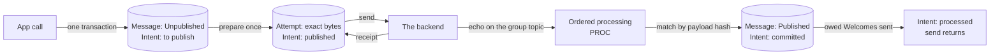

# Message sending

The path from an app call to a published envelope, and from the published envelope back to a confirmed message. An app needs to know what it can observe after a send fails, and whether retrying can duplicate a message.

A queued send is durable before its message is published. Queued acceptance returns an id that the app can use to read the local message; confirmed completion waits for ordered processing of the echo and every required follow-up Welcome. An ordinary send can perform installation and proposal work before it queues the message. A returned id from a queue operation is not confirmed send completion.



## Scope

In scope: what an app's send stores before publishing its message; the message id and the idempotency key; preparing an attempt once and retrying its exact bytes; publish receipts; the order in which a group's intents publish; confirmation through ordered processing; what an app observes for each failure; and what becomes of an intent that can never publish.

Out of scope: publish atomicity and duplicate detection on the backend (API); receipt and ordered processing of the echo (PROC); what a commit contains and how it is validated (GMOD); building and wrapping Welcomes (JOIN); the guarded app-data write (`?META`); the content encoding inside a message (CTYPE); consent recorded on send (CONS); and push flags (PUSH).

| Related | Relation |
| --- | --- |
| PROC | Owns the receipt path, ordered processing, and delivery to app streams. This spec owns what a send stores, what it sends, and how the echo resolves it. |
| API | Owns the publish RPC, the `message_hash` the backend assigns, and duplicate detection by that hash. This spec owns what the client sends and resends. |
| GMOD | Owns the content and validation of commits. This spec owns how a commit intent is queued, published, and resolved. |
| `?META` | Needs the guard comparison for an app-data write. This spec owns what a guard miss does to the intent. |

## Terms

| Term | Meaning |
| --- | --- |
| Intent | A durable record of one change an app asked for in one group: a message to send or a state change to commit. |
| Message intent | An intent whose payload is an application message. |
| State-change intent | An intent whose payload is a commit or a proposal: a membership, metadata, permission, admin, key, or app-data change. |
| Attempt | The exact envelope bytes prepared for an intent, together with the epoch and pending proposals they were built from. An intent has at most one current attempt. |
| Receipt | The backend's publish response for an attempt: the sequence id, timestamp, and `message_hash` of the stored envelope. |
| Echo | The client's own published envelope as ordered processing receives it on the group topic. |
| Payload hash | SHA-256 over the MLS message bytes inside an envelope. The key by which an echo is matched to its attempt. |
| Idempotency key | The `idempotency_key` of the `PlaintextEnvelope` a message is sent in: a string that distinguishes sends of equal content within a group. |
| Message id | The 32-byte identifier of a stored message, derived under SEND-002. |
| Rejected intent | An intent ordered processing or preparation refused for a reason a later attempt cannot change. |
| Superseded intent | A guarded app-data intent whose guard no longer matched when it was prepared. |

## 1. The send is stored first

The client stores a new message with `Unpublished` status and the work needed to publish it before sending that message. An optimistic queue operation returns after this durable acceptance. A normal send waits for SEND-011 before returning success and can do earlier network work to update installations or commit proposals. PROC-025 keeps an unpublished message off the app's message stream.

A message is sent inside a `PlaintextEnvelope`, whose `idempotency_key` distinguishes two sends of the same bytes. The message id is derived from the group id, that key, and the content bytes, and nothing else: not the epoch, not the ciphertext, and not the time. Every installation in the group derives the same id from the same envelope, so a reply or a reaction that names a message id names the same message everywhere, and a message the client stores twice, once optimistically and once from its echo, is one row.

```proto
message PlaintextEnvelope {
  // Version 1 of the encrypted envelope
  message V1 {
    // Expected to be EncodedContent
    bytes content = 1;
    // A unique value that can be used to ensure that the same content can
    // produce different hashes. May be the sender timestamp.
    string idempotency_key = 2;
  }

  // The nested V2 definition is shown in the next excerpt.

  // Selector which declares which version of the EncodedContent this
  // PlaintextEnvelope is
  oneof content {
    V1 v1 = 1;
    V2 v2 = 2;
  }
}
```

The second excerpt completes the nested `PlaintextEnvelope.V2` type. The outer selector and `V1` above are omitted from this excerpt only.

```proto
message PlaintextEnvelope {
  // Version 2 of the encrypted envelope
  message V2 {
    reserved 3, 4;
    reserved "device_sync_request", "device_sync_reply";

    // A unique value that can be used to ensure that the same content can
    // produce different hashes. May be the sender timestamp.
    string idempotency_key = 1;

    oneof message_type {
      // Expected to be EncodedContent
      bytes content = 2;
      // A serialized user preference update
      xmtp.device_sync.content.V1UserPreferenceUpdate user_preference_update = 5;
    }

    // Removed; moved to oneshot message
    reserved 6;
    reserved "readd_request";
  }
}
```

For V1, the message-id content bytes are the value of `V1.content`, before content decoding and without the surrounding protobuf field tags. The group id is its raw byte value and the key is UTF-8. V2 is a retained wire type for an earlier device-sync format; the current receive path consumes it without storing an application message, so it does not derive an application-message id from either V2 variant.

An app that needs a retry to name the same message supplies the same key. SEND-002 defines message identity; it does not prescribe key generation when the app supplies none.

| ID | Title | Requirement | Why |
| --- | --- | --- | --- |
| SEND-001 | Durable queued acceptance | When an app queues a new message, the client MUST durably store the message as `Unpublished` with its publish intent before publishing that message, and MUST return its message id only after that storage succeeds. A queue result MUST remain distinguishable from confirmed send completion under SEND-011. | A process crash must not lose an accepted send. |
| SEND-002 | Message id derivation | When the client stores a V1 application message, it MUST derive its id as SHA-256 over the raw group id, `0x09`, the UTF-8 `idempotency_key`, `0x09`, and the unmodified `V1.content` bytes of the `PlaintextEnvelope` defined above, in that order. | All installations need the same id for replies and deduplication. |
| SEND-003 | Same group, key, and content | When an app sends the same content and idempotency key in the same group, the client MUST reuse the stored message id without a second message or a second unresolved intent. If the message is already `Published`, it MUST NOT publish it again; if a previous intent was rejected and a new retry intent is queued, it MUST set the existing message to `Unpublished` until that retry is confirmed or fails. | A retried message must not remain visibly failed while new work is pending. |
| SEND-004 | Retries supply the key | When an app retries a send after a result other than success, the app SHOULD supply the idempotency key of the first send. | |
| SEND-005 | No send into an inactive group | When an app sends into a group whose local state is inactive because a commit removed this installation, the client MUST refuse before it stores a message or an intent, with an error the app can distinguish. | A message stored for a group the client has left is never published and never fails. |

## 2. Preparing and publishing an attempt

Publishing an intent has two halves, and the boundary between them is what makes a retry safe. The first half runs under the state writer: the client builds the MLS message from the current group state, which advances its sender ratchet, and in the same transaction stores the exact envelope bytes, their payload hash, and the epoch and pending proposals they were built from. Only after that commits does the second half send the bytes. A crash between the two leaves an attempt the next round resends, and never a ratchet advanced for bytes nobody holds.

An absent receipt can mean either that the backend never received the request or that it committed and its response was lost. API-211 owns the authoritative hash and API-222 owns duplicate publication. An ambiguous result preserves the attempt and its exact bytes, including required follow-up Welcome batches. A confirmed backend refusal has no echo to wait for; an ambiguous transport failure does not establish refusal.

API-284 prohibits an unchanged request after `OUT_OF_RANGE`, while API section 7 permits that status after a publish committed. SEND-007 preserves the attempt without requiring a prohibited resend. The missing recovery contract is `?API`: After a publish returns `OUT_OF_RANGE`, the backend MUST provide a recovery operation that resolves each submitted envelope as committed with its original receipt, definitely not committed, or still unknown, without resending the prohibited unchanged request. The client MUST retain the exact envelope bytes, including required follow-up Welcome batches, while any outcome is unknown, and MUST NOT replace, re-encrypt, or terminally fail that work until recovery establishes its outcome.

Preparation can also fail locally before any publish. CONF-073 owns the size bound. A definite local request-shape failure or a backend refusal that proves non-commit ends the affected attempt under SEND-009. It does not leave a state-change intent waiting for an echo that cannot arrive.

| ID | Title | Requirement | Why |
| --- | --- | --- | --- |
| SEND-006 | Preserve prepared publication | When the client prepares an intent or a required follow-up Welcome batch, it MUST durably preserve the exact envelope bytes before publishing them, together with the payload hash and base epoch for the group attempt and any staged state needed to apply it. A failed preparation MUST leave neither advanced sender state nor a partial prepared publication. | Regenerating lost ciphertext consumes another sender generation. |
| SEND-007 | Preserve bytes while outcome is unknown | While a group attempt or required follow-up Welcome batch has an unknown publish outcome, the client MUST retain its exact prepared bytes and MUST NOT replace or re-encrypt them. Any retry permitted by API-284 MUST reuse those bytes; an `OUT_OF_RANGE` result MUST use the recovery contract in `?API` instead of an unchanged request. | An ambiguous response can follow a committed publish. |
| SEND-008 | A receipt binds to its attempt | When a publish response arrives, the client MUST attach it only to the current attempt or follow-up Welcome batch whose bytes were sent, preserve its `message_hash` unchanged under API-211, and discard a response for an obsolete attempt. | A late reply must not confirm different bytes. |
| SEND-009 | Definite refusal ends publication | When preparation proves a request unsendable under CONF-073 or its request-shape checks, or the backend definitively refuses it without committing, the client MUST reject the affected intent, set its application message to `Failed`, and permit later intents to proceed without waiting for an echo. It MUST NOT classify an ambiguous transport failure or a status that can follow commit as such a refusal. | A refused request cannot produce the echo needed to release later work. |

## 3. Order within a group

One installation publishes a group's intents in the order the app queued them. Message intents publish in that order, several in one request when they are adjacent. A state-change intent is different: it produces a commit against a specific epoch, and until its echo says whether that commit landed, the client does not know what epoch the next intent must be built against. A published state-change intent therefore holds every intent behind it, and the client prepares at most one state-change attempt per group at a time.

| ID | Title | Requirement | Why |
| --- | --- | --- | --- |
| SEND-010 | Publish in queue order | The client MUST publish a group's intents in the order they were queued, and MUST NOT prepare any intent for a group while a state-change intent of that group is published and its echo is not yet applied or rejected. | A message built before the pending commit resolves is built against an epoch that may not exist. |

## 4. Confirmation

A publish receipt says the backend stored the envelope. It does not say the group accepted it: a commit can be superseded by another member's commit that landed first, and a message is not in the group's history until the client has applied its own envelope in sequence. The send therefore waits for its echo through ordered processing, with the receipt's sequence id as the target under PROC-015. Success is the intent applied, and for a membership commit, the Welcomes it owes sent.

The echo is matched to its attempt by payload hash, computed over the MLS message bytes the envelope carries. The receipt is not needed for the match, so an echo that arrives before the response still resolves the attempt. A commit echo from a past epoch needs the stale-commit rule in `?GMOD`. The required GMOD obligation is: If a commit the client published is read back after the group's epoch has advanced past the epoch it was built on, then the client MUST NOT apply it and MUST rebuild the change on the current state before it publishes again. A future epoch is a rejection under PROC-011, not a lost-race retry. Application-message and proposal intents do not use the staged-commit equality check; their validation is defined in PROC section 3 and GMOD.

When intent synchronization ends while a receipt exists but ordered processing has not resolved the attempt, the result is published but unconfirmed. The attempt remains current for later synchronization. The call has a retry budget and a deadline; neither ends the durable attempt. The wait starts inside intent synchronization, after earlier installation and proposal work, and can end before its deadline. This spec does not promise a fixed duration from the send call.

| ID | Title | Requirement | Why |
| --- | --- | --- | --- |
| SEND-011 | Success includes required follow-up | The client MUST report confirmed send success only after ordered processing applies the intent's echo and the backend acknowledges every required follow-up Welcome envelope, including pointers and pointees. It MUST preserve unresolved follow-up work under SEND-006 and SEND-007 across interruption and MUST NOT report success on the group publish receipt alone. | A membership change is incomplete for recipients without their Welcomes. |
| SEND-012 | Match the echo by payload hash | When ordered processing receives an envelope whose sender is this installation, the client MUST match it to an attempt by the SHA-256 of the envelope's MLS message bytes equal to the attempt's payload hash, and MUST NOT require the receipt to make the match. | An own envelope processed as a stranger's cannot be decrypted, so the message is rejected and never confirmed. |
| SEND-013 | Confirmation completes the message | When the client applies a message intent's echo, it MUST set the message's status to `Published`, its sequence id to the envelope's, and its sent timestamp to the backend's timestamp on the envelope, in the transaction that applies the envelope. | A timestamp taken from the sender's clock differs on every installation, so members disagree on the order of messages. |
| SEND-014 | Rebuild a stale commit | When an own commit echo names an epoch less than the group's current epoch, the client MUST resolve the attempt under `?GMOD` before preparing its replacement. It MUST NOT use that recovery for a future-epoch echo or apply it to every state-change intent regardless of payload kind. | A proposal and a staged commit have different validation rules. |
| SEND-015 | Published but unconfirmed | When intent synchronization ends with a publish receipt but no ordered resolution of the attempt, the client MUST return a typed published-but-unconfirmed result, keep the attempt current, and MUST NOT prepare a replacement because the call ended. | Ending the wait does not undo the backend publication. |
| SEND-016 | Rejection completes message status | When ordered processing terminally rejects an intent's echo for a reason other than a stale epoch, the client MUST reject the intent with a stable reason code, set its application message to `Failed`, and return that reason to the waiting send. | A rejected message left pending misleads the app. |

## 5. Intents that cannot publish

Three things end an intent without a successful echo. A rejection under SEND-009 or SEND-016. A guard miss under `?META`: the committed value no longer matches the write's guard, so the intent is superseded without publication. META needs to define which committed value the guard compares and how equality is tested. And removal: a commit that removes this installation makes every unpublished or unresolved intent of that group unpublishable, and the messages behind them are failed so that the app does not show them as pending for ever. An intent whose commit was applied before the removal still owes its Welcomes and completes them.

| ID | Title | Requirement | Why |
| --- | --- | --- | --- |
| SEND-017 | A superseded guard is terminal | When the client prepares a guarded intent whose guard no longer matches the committed value, it MUST mark the intent superseded without publishing, MUST NOT retry it, and MUST return a result the app can distinguish from a rejection. | Retrying a stale write spins until the deadline; reporting it as an error tells the app something broke when nothing did. |
| SEND-018 | Removal fails pending intents | When the client applies a commit that removes this installation from a group, it MUST mark every intent of that group that is unpublished, or published with no applied echo, as rejected, and MUST set each such message intent's message to `Failed` status, in the transaction that applies the removal. | A message left `Unpublished` in a group the client has left is shown as pending for ever. |
| SEND-019 | Outcomes are distinguishable | An SDK MUST expose the distinct send outcomes in the outcome table below and preserve a rejected intent's stable reason code. It MUST NOT report queued acceptance or an unknown publish outcome as confirmed completion or definite refusal. | The app needs to decide whether to wait, retry, or correct its request. |

The outcome names below are semantic kinds; an SDK can use its language's typed representation. An absent receipt is not a stable rejection code. A rejection code identifies the validation class without including payload or key material.

| Outcome | Meaning |
| --- | --- |
| Queued | Durable local acceptance; no claim that publishing succeeded |
| Confirmed | SEND-011 holds |
| Inactive group | The installation was removed; no new send is accepted |
| Unsendable or refused | A local request failure or backend refusal proves no publication for the affected work |
| Rejected | Ordered processing refused the echo, with its stable validation reason |
| Superseded | A guarded change was not published because its guard no longer matched |
| Published but unconfirmed | A receipt exists but ordered resolution did not complete before the wait ended |
| Outcome unknown | No receipt or definite non-commit result establishes whether publication occurred; the same prepared work remains pending |

## Known limitations

A published state-change attempt whose echo never resolves blocks later intents in its group. Each synchronization call ends under its retry budget or deadline, but no durable age or attempt limit releases that blockage. An attempt with receipts is not republished; an attempt without receipts remains eligible to retry its saved bytes subject to API-284. A later sync can resolve the work, and removal rejects unresolved intents under SEND-018.

The optimistic queue path does not yet check inactive membership before storage. Rejected echoes and removal can leave message status `Unpublished`; a same-key retry after a local oversize rejection can queue new work while the existing message remains `Failed`.

A call without an app-supplied idempotency key can use a new key. Retrying without the first key can publish the same content under a second id. Confirmation also replaces the provisional sent timestamp under SEND-013, so a message ordered by that timestamp can move.

V2 plaintext envelopes are decoded but produce no stored application message. Their fields remain in the wire type; no V2 application-message id derivation is promised.

Definite backend refusals are not yet separated from all ambiguous publish failures. The recovery contract for `OUT_OF_RANGE` remains required from API; retaining exact bytes alone cannot resolve it.
