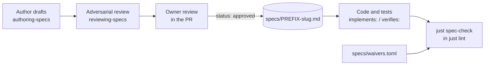

# Specification format

This document defines how libxmtp specifications are written, admitted, numbered, linked to code, and changed. A spec is a long-lived statement of the promises the system keeps. It is not a description of the current implementation and not a plan for one change. This document is a guide with requirement identifiers, so the checker, the skills, and reviewers cite one source. Section 6 lists the rules it exempts itself from, and why.



## Scope

In scope: every file in `docs/specs/`, the requirement identifier scheme, the admission test, backlinks from code and tests, waivers, the checker, and the "Spec changes" section that plans carry.

Out of scope: the format and tooling of plans, design notes under `docs/` and in module READMEs, and the XIP process.

| Related | Relation |
| --- | --- |
| `docs/specs/GLOSSARY.md` | Names the actors and shared terms every spec uses. Definitions only; obligations live in requirements (SPEC-072). |
| `docs/specs/PREFIXES.md` | The registry of requirement prefixes. Read by the checker. |
| `docs/specs/README.md` | The capability map: which spec owns what. Informative. |

## Terms

| Term | Meaning |
| --- | --- |
| Author | The person or agent that drafts or amends a spec. |
| Reviewer | The agent that reviews a draft before an owner sees it. |
| Owner | A human who approves a spec by reviewing its PR. |
| The checker | `just spec-check`, `just spec-index`, and `just spec-show`. |
| Requirement | One row of a requirements table, in the form of SPEC-034. |
| Normative text | Text that creates an obligation: a requirement row, and whatever a requirement points at (SPEC-041). |
| Design note | A Markdown file under `docs/` or a module README that explains mechanisms and choices. Never normative. |
| Legacy spec | A file under `docs/legacy-specs/` with `status: legacy`: being replaced. It stays binding for obligations whose replacement is not yet approved (SPEC-011). |

## 1. Files

One spec is one file. The file name carries the prefix so a reader who sees `JOIN-012` in code knows where to look. The frontmatter is the only machine-read metadata; everything else the checker needs, it parses from the body.

| ID | Title | Requirement | Why |
| --- | --- | --- | --- |
| SPEC-001 | One file per spec | A spec MUST be one Markdown file in `docs/specs/` named `PREFIX-slug.md`, where `PREFIX` is the spec's prefix in uppercase and `slug` is lowercase words joined by hyphens. | |
| SPEC-002 | Frontmatter keys | A spec MUST begin with YAML frontmatter with the keys `prefix` and `status`, whose value is `draft`, `approved`, or `legacy`, and MAY carry `owns` listing identifiers it holds from another prefix. | |
| SPEC-003 | Section order | After the title and its summary paragraphs, a spec MUST contain `## Scope`, then `## Terms`, then numbered capability sections `## 1.` to `## N.` in ascending order, then optionally `## Known limitations` as the last section. | |
| SPEC-004 | Owner sets status | An author MUST NOT set `status: approved`. Only an owner's review of the PR changes a spec to `approved`. | |
| SPEC-005 | Size ceiling | A spec other than this one MUST NOT contain more than 150 requirements. When a draft exceeds the ceiling, the author MUST split it into two specs. | |
| SPEC-006 | No implementation names | A spec MUST NOT name files, modules, functions, or crates, and MUST NOT contain phase or sequencing language, status prose, review logs, or revision numbers. Transport identifiers are the exception, under SPEC-040. | |
| SPEC-007 | Platform choices are not requirements | A spec MUST NOT state platform choices such as the database engine, the process model, or a storage library. Those belong in the implementing module's README. | |
| SPEC-008 | Specs supersede their sources | When an approved spec and an XIP, a legacy spec, or the code disagree, the spec MUST be followed. An XIP is a source with no authority of its own. | |
| SPEC-009 | Legacy specs | A legacy spec MUST carry `status: legacy` and a banner naming the specs that replace it. | `status: legacy` means "being replaced", not "no longer binding". |
| SPEC-010 | Prose style | Spec prose MUST be direct: it states what a mechanism is and what breaks without it, in short sentences with one term for each concept, and MUST NOT argue for the design, describe alternatives, or narrate decisions. Prose MUST name a thing in the term the protocol uses, without metaphor or a paraphrase of its effect. | A reader comes for the rules, and every sentence that defends a choice stands between the reader and them. |
| SPEC-011 | Legacy authority | Until an obligation receives a disposition under SPEC-013, that obligation MUST remain binding, and a reviewer MUST treat the legacy spec as authoritative for it. | |
| SPEC-013 | Legacy dispositions | Every obligation in a legacy document MUST receive one owner-approved disposition: carried into a replacement, retired, or moved out of the specs to a design note or a module README. An author MUST record the disposition of each one in the change summary. | some legacy clauses cannot be carried. A platform choice is barred from a replacement by SPEC-007, so without an explicit retirement it would either bind for ever or vanish when the file is deleted. |
| SPEC-012 | Deleting a legacy spec | A legacy file MUST be deleted once every obligation in it has a disposition, and the deleting PR MUST move every consumer that reads it. | a build or a test that reads a legacy spec breaks the moment the file goes. |

## 2. Admission

A spec is small because every requirement earns its place. The six questions below (SPEC-020 to SPEC-023, SPEC-092, and SPEC-088) counter the pull toward writing down whatever the current task touched. A statement that fails one question goes somewhere else: a design note, a named constant, a plan, or nowhere.

| ID | Title | Requirement | Why |
| --- | --- | --- | --- |
| SPEC-020 | Someone relies on it | A requirement MUST be one that a party outside the implementing module relies on: the other side of the wire, another installation or version of the client, an operator, an app developer, or a security property another party relies on. | |
| SPEC-021 | Violation is harm | A requirement MUST be one whose violation is observable as harm: data loss, wrong ordering, a security or privacy breach, an interoperability failure across versions, or a wrong user-visible result. | |
| SPEC-092 | Someone else observes the violation | A requirement MUST be one whose violation a party other than the actor it binds can observe. A rule whose violation harms only the actor that breaks it MUST NOT be a requirement. | An installation that forgets a rotation it owed keeps its own key live for longer, and only that installation pays. The rule belongs in the module's design note, not in the contract. |
| SPEC-022 | It survives a different implementation | A requirement MUST hold under a materially different implementation of the same capability. | |
| SPEC-023 | It is testable | A requirement MUST be one for which a scenario, a property check, or a repeatable manual analysis distinguishes compliance from violation. | |
| SPEC-088 | No belief requirements | A requirement MUST bind an observable act, and MUST NOT bind what an actor treats something as, concludes, considers, or assumes. | "a client MUST NOT treat acceptance as proof of membership" reads like a security property, but nothing distinguishes a client that holds the wrong belief and still performs every check. State the check. |
| SPEC-024 | It is not already stated | Before allocating an identifier, the author MUST search the index for the same obligation and reference the existing identifier instead of restating it. | |
| SPEC-028 | State the general invariant | A requirement MUST state the smallest invariant that covers its case, never one example of a rule the spec already makes, and a specific value MUST appear only when that value is the promise. A rule and the exact value it applies MUST be one requirement. Two requirements that a single act would violate MUST be merged. | "The payload `hello` survives" and "the payload `goodbye` survives" are two test cases for one invariant. "Use the advertised wrapper" and "the default wrapper is X" are one rule with its value. |
| SPEC-029 | Permissions bind a reader | A requirement that grants freedom with MAY MUST be paired with the obligation it creates for anyone relying on it, or MUST NOT be a requirement at all. | "the backend MAY batch publishes" cannot be violated, so it is untestable on its own. What is testable is the client obligation it implies: not to assume otherwise. |
| SPEC-025 | Excluded content | A spec MUST NOT contain task sequencing, the layout of internal storage such as tables, columns, and encodings, the client database schema, obligations about what a capability's tests must cover, or the details of a bug fix. A bug fix MAY yield the invariant it violated. | "Phase 3 tests must cover every limit" is work planning, and belongs in a plan. A stored value that a condition tests is not layout: SPEC-089 requires it to be named. This document's own evidence rules are exempt under SPEC-085. |
| SPEC-026 | Intended behaviour | When the code and the intended behaviour differ, the author MUST write the intended behaviour and record the gap as a waiver under SPEC-055. | |
| SPEC-027 | Compatibility behaviour | When a current client must still accept an old form, that acceptance MUST be a requirement. When the client merely tolerates the old form, it MUST be listed under Known limitations instead. | |

## 3. Requirements

A requirement is one row of a four-column table: the identifier, the title, the requirement sentence, and the reason. The sentence keeps the EARS shape, because putting the condition first is what makes a requirement testable, and uses MUST and MUST NOT, because every engineer and every agent already reads those words as binding. A row is one line, so a cell cannot hold a fenced block or a list; a type block sits above the table whose requirements point at it, and a pipe inside a cell is written `\|`.

Specs are written in waves, so one will often need an obligation another has not stated yet. The author writes `?PREFIX` where the identifier will go, says in the section's prose what the missing obligation should require, and carries on. The explanation goes in the prose rather than inside the requirement, because the Why cell states what breaks and nothing else. The marker is a visible debt: the checker reports every one, and the pull request that approves the owning spec has to pay them.

| EARS pattern | Shape | Example |
| --- | --- | --- |
| Ubiquitous | The actor MUST ... | The backend MUST derive the topic of every envelope from its payload. |
| Event-driven | When [event], the actor MUST ... | When a publish names more topics than the published limit, the backend MUST fail the request with `INVALID_ARGUMENT`. |
| State-driven | While [state], the actor MUST ... | While a client is latched on a backend mismatch, the client MUST NOT send any request. |
| Optional feature | Where [feature is present], the actor MUST ... | Where the commit log is enabled, the client MUST publish an entry for every commit it applies. |
| Unwanted behaviour | If [condition], then the actor MUST ... | If a Welcome names an epoch not later than the local epoch, then the client MUST discard it. |

| ID | Title | Requirement | Why |
| --- | --- | --- | --- |
| SPEC-030 | Identifier form | A requirement identifier MUST be `PREFIX-NNN`: three to five uppercase letters, a hyphen, and exactly three digits. | |
| SPEC-031 | Prefix registry | Every prefix MUST be registered in `docs/specs/PREFIXES.md`, and a spec MUST use only its own prefix for its requirements. | |
| SPEC-032 | Allocating a number | The author MUST give a new requirement the next unused number for the prefix, MUST NOT renumber an existing requirement, and MUST NOT reuse the number of a deleted requirement. | |
| SPEC-033 | Amending a requirement | When an amendment keeps the same obligation, the requirement MUST keep its identifier. When the obligation changes, the author MUST allocate a new identifier and delete the old row. A spec MUST NOT contain a table of retired requirements. | |
| SPEC-075 | Moving a requirement | When a split moves an unchanged obligation to another spec, it MUST keep its identifier, and the receiving spec MUST list that identifier in its `owns` frontmatter key. | changing an identifier because a file was reorganised breaks every backlink for an obligation nobody edited. Prose cannot record this, because the checker has to know. |
| SPEC-077 | Inheriting an identifier | A spec that carries an obligation forward from a superseded document under its original identifier MUST list that identifier in `owns`, and MUST NOT allocate any other identifier below its prefix's reuse floor. | |
| SPEC-034 | Row form | A requirement MUST be one row of a requirements table whose header is `\| ID \| Title \| Requirement \| Why \|`, in the form `\| PREFIX-NNN \| Title \| Sentence. \| Reason. \|`, with one obligation, the condition first, then the actor, then the keyword. A cell MUST NOT contain a fenced block or a list, and a pipe inside a cell MUST be written `\|`. | A row is one line, so no obligation can hide in a continuation, and a reader scans identifier, title, rule, and reason as columns. |
| SPEC-035 | Normative keywords | An obligation MUST use MUST or MUST NOT, and explicit freedom MUST use MAY. A requirement MUST use `SHOULD` only for an app or an operator, which the system cannot enforce, and MUST NOT use `SHALL`. Trigger words are lowercase. | |
| SPEC-036 | Requirement title | A requirement MUST have a title of two to seven words in the Title cell, with no trailing period. | |
| SPEC-037 | Length and rationale | The Requirement cell MUST be at most three sentences. The Why cell MUST state what breaks when the requirement is violated, or be empty, and MUST NOT restate the requirement. | Section prose carries the reasons by default. A Why that repeats the rule in other words costs a reader a sentence and teaches nothing. |
| SPEC-089 | Concrete conditions | A condition MUST name the field, stored value, or comparison it tests, and a bound MUST state its value, or its default and the rule that selects it when the value is a tunable. A word that stands in for a measure, such as "earliest", "confirmed", "usable", or "bounded", MUST NOT replace the measure. | "The earliest message at the location" is a claim; "the message with the lowest sequence id at the location" is a test. A bound with no value cannot be violated. |
| SPEC-038 | Naming the actor | A requirement MUST name its actor with a term from `docs/specs/GLOSSARY.md`, or with a process actor this document defines in its Terms. A new system actor MUST be added to the glossary, not defined in a spec. | |
| SPEC-039 | Exact values once | A wire field, topic byte, published limit, error code, or persisted format MUST be stated exactly once, in the spec that owns it. Other specs MUST reference it by identifier. | |
| SPEC-040 | Transport identifiers | A spec that states the contract of a transport format MAY use that format's identifiers and error codes, such as `xmtp.backend.v1.GetConfigurationResponse` or `INVALID_ARGUMENT`. | |
| SPEC-041 | Normative text | Only requirement rows, and the content a requirement points at, are normative. A table other than a requirements table, a type block, a diagram, a glossary entry, or an example MUST be treated as informative unless a requirement points at it. | |
| SPEC-072 | Every obligation has an owner | A behavioural constraint MUST be stated by a requirement. A definition, table, or type block MUST NOT introduce an obligation that no requirement states. | content that binds without an identifier cannot be amended, evidenced, or reviewed as a contract. |
| SPEC-073 | Pointing at a block | A requirement that makes a table or a type block binding MUST name it, and the block MUST appear in the same spec. | |
| SPEC-087 | Value tables bind by ownership | A table whose cells are only the exact values a spec owns under SPEC-039, such as wire identifiers or error codes, MUST be normative without a requirement pointing at it, and MUST NOT state behaviour. | the alternative is a requirement whose whole job is to make a table binding, which adds ceremony a reader gains nothing from. A cell that says what an actor does is behaviour and still needs its own requirement. |
| SPEC-042 | Reference, do not restate | A spec MUST reference another spec's obligation by identifier, or by section when no single identifier fits, and MUST NOT restate it. | |
| SPEC-078 | Unwritten references | Where the obligation a spec needs to reference is not written yet, the author MUST write `?PREFIX` naming the spec expected to own it, and the enclosing section's prose MUST say what that obligation is expected to require. | the alternatives are worse. Inventing a number creates a reference that resolves to the wrong requirement once the number is allocated, and omitting the reference loses the dependency entirely. |
| SPEC-079 | Resolving them | A spec MUST NOT be approved while it contains a `?PREFIX` marker whose owning spec is approved, and the PR that approves a spec MUST replace every marker naming it in another spec. | a marker is a debt against a spec that does not exist. Once it does, the debt is due, and nothing else will force it. |
| SPEC-043 | Type block notation | A protobuf message MUST be written as protobuf, a structure that is not a wire format MUST be written as WebIDL, and a wire format defined elsewhere MUST be referenced rather than reproduced, following section 3.1. | |
| SPEC-044 | Version conditions | A requirement MAY carry a version condition where behaviour differs by client or group version, whether or not the switch exists yet. It MUST name the version that divides the cases, not the release that shipped it. | a promise about older clients is a promise about a protocol version, which outlives any particular build. |
| SPEC-045 | Known limitations | A known limitation MUST be plain prose that states what is accepted and why, without an identifier. | |
| SPEC-046 | Diagrams are welcome | A spec MAY contain a Mermaid diagram wherever it explains faster than prose, including one per section. | |

### 3.1 Type blocks

A spec describes two kinds of shape, and they take different notations.

A **wire message** is bytes that one party sends and another parses. Its field numbers, types, and presence rules are the compatibility contract: change a field number and every existing client breaks. Those specs inline protobuf, the language the wire actually uses. Translating a wire message into another notation loses the field numbers and invites the spec and the proto to drift apart.

An **internal structure** is a shape a spec needs in order to state a rule, but that never appears on the wire: a stored row, a snapshot a client holds, a value handed to an app. It has no field numbers and no encoding, so it is written in [WebIDL](https://webidl.spec.whatwg.org/), which is standardised and describes shape without implying an encoding.

A **foreign wire format** is a payload this repository carries but does not define. An MLS key package and a Welcome are encoded in TLS presentation language under RFC 9420, and travel inside an opaque protobuf field. A spec names that format and the section that defines it, and states its own obligations about the bytes: what must be validated beyond what the standard already requires, what must be preserved, what must be rejected. It does not restate the foreign schema or the standard's own validation, because doing so would create a second definition that can drift from the real one.

| ID | Title | Requirement | Why |
| --- | --- | --- | --- |
| SPEC-047 | Protobuf for protobuf messages | A message carried by the gRPC schema MUST be written as protobuf in a fenced `proto` code block, with the field numbers and types it has on the wire. | |
| SPEC-074 | Foreign formats and procedures | A payload, validation, or procedure defined outside this repository, such as an MLS object or its validation under RFC 9420, MUST be referenced by naming the document and the section that defines it, with a link, and MUST NOT be reproduced as protobuf, WebIDL, or prose. A requirement about it MUST state only what this system adds to or removes from that section. | Those bytes travel inside a protobuf field, but the field is an opaque carrier. Rewriting the payload or its checks here states a second definition that nothing implements and that drifts from the first. |
| SPEC-048 | Copy, do not paraphrase | A protobuf block MUST agree field for field with the schema in this repository, which is the one baseline every reader shares. A spec MUST include only the messages the surrounding requirements constrain, and MAY omit unrelated fields with a comment saying so. | |
| SPEC-076 | Not yet implemented | A protobuf block for a field the schema does not carry yet MUST mark that field with a `pending` comment, and its requirements MUST be waived as `gap` under SPEC-057 until the schema carries it. | a spec may lead its implementation, so the format has to say how, rather than forbidding the workflow it recommends. |
| SPEC-049 | WebIDL for internal structures | A structure that is not a wire format MUST be written as WebIDL in a fenced `webidl` code block, as a `dictionary`. A spec MUST NOT use `interface`, which carries methods and object identity that a data structure does not have. | |
| SPEC-070 | Opaque bytes in WebIDL | In a WebIDL block, a field of opaque bytes MUST have the type `sequence<octet>`, and a fixed length MUST be stated in a trailing comment, because WebIDL has no length-parameterised type. | |
| SPEC-071 | Variants in WebIDL | In a WebIDL block, a set of mutually exclusive variants MUST be written as one dictionary with an `enum` discriminant and a comment saying exactly one member is present. A union of dictionary types MUST NOT be used, because WebIDL requires the members of a union to be distinguishable and two dictionaries never are. | |

In a protobuf block, presence and defaults are protobuf's own: a scalar that is absent reads as its zero value, and where absent and zero mean different things the block says so in a comment. In a WebIDL block, presence is carried by `required`, and integer widths follow the wire: `unsigned long` for 32 bits, `unsigned long long` and `long long` for 64.

A wire message, as it appears on the wire:

```proto
message WelcomeMessage {
  message V1 {
    bytes installation_key = 1;  // 32 bytes; derives the topic
    bytes data = 2;              // encrypted MLS Welcome
    bytes hpke_public_key = 3;   // unset when this is the pointee of a pointer
    xmtp.mls.message_contents.WelcomeWrapperAlgorithm wrapper_algorithm = 4;
    bytes welcome_metadata = 5;
  }

  message WelcomePointer {
    bytes installation_key = 1;  // 32 bytes; derives the topic
    bytes welcome_pointer = 2;   // encrypted pointer
    bytes hpke_public_key = 3;
    xmtp.mls.message_contents.WelcomePointerWrapperAlgorithm wrapper_algorithm = 4;
  }

  oneof version {
    V1 v1 = 1;
    WelcomePointer welcome_pointer = 2;
  }
}
```

An internal structure, which never appears on the wire:

```webidl
dictionary ConfigurationSnapshot {
  required DOMString backend_identifier;
  required DOMString backend_url;          // the URL the copy was fetched from
  required unsigned long max_group_members;
  boolean commit_log_enabled;              // absent means the compiled default
};
```

## 4. Backlinks

A backlink is a comment token that ties a place in the code or the tests to one requirement. The aim is navigation and evidence, not a coverage metric: a link count measures annotations, never correctness.

Links stay sparse by naming the decision point rather than every line that participates, and by tagging only a test whose assertions establish the obligation. They are not capped at a fixed number, because one obligation can need evidence in several places.

Two things make a test worth linking: where it runs, and what it establishes. A payload-preservation promise is proven separately in Rust, Kotlin, Swift, and TypeScript, four places, one property each. A transactional promise is proven in one place by three tests, for the normal path, the rollback, and the restart. Both are real evidence, and a rule that counted only places would discard the second. Two tests are redundant only when they establish the same property in the same place.

| ID | Title | Requirement | Why |
| --- | --- | --- | --- |
| SPEC-050 | Implements link | An implementation MAY carry `implements: PREFIX-NNN` in a comment on the line above the item that enforces the requirement. A link MUST name the decision point that enforces the obligation, not every site that participates in it. | |
| SPEC-051 | Verifies link | A test MUST carry `verifies: PREFIX-NNN` or `verifies: PREFIX-NNN, PREFIX-MMM` in a comment on the line above the test item when its assertions establish the obligation. An approved requirement MUST have at least one such link, unless SPEC-054 exempts it or SPEC-055 waives it. | |
| SPEC-052 | Distinct evidence only | A test MUST carry a link only when no already-linked test establishes the same property in the same place. When two tests establish the same property in the same place, only one MUST carry the link, and it MUST be the Rust test when there is one. | a rule counting only places would reject a rollback test that shares a place with the normal-path test, and those establish different properties. |
| SPEC-053 | No other mentions | A comment in code MUST NOT mention a requirement identifier except in an `implements:` or `verifies:` token. The checker reports a stray mention as an error when the identifier's spec is approved and as a warning otherwise. | |
| SPEC-054 | Evidence exemptions | This document and any requirement whose keyword is `SHOULD` MUST be exempt from SPEC-051 and from SPEC-055. | |
| SPEC-055 | Waiver entries | A requirement that SPEC-054 does not exempt and that carries no `verifies:` link MUST have an entry in `docs/specs/waivers.toml` with the identifier, a `kind`, and a reason. A waiver MUST be reviewed like a spec change. | |
| SPEC-056 | The checker gates merges | `just lint` MUST run `just spec-check`, and a PR MUST pass it. | |
| SPEC-058 | Evidence gate rollout | While backlinks are being added to the code, the checker MAY report a missing `verifies:` link as a warning rather than an error. Once the last approved spec has its links, an owner MUST turn the gate to error, and it MUST stay there. | a gate that fails every pull request on the day it lands gets switched off. Saying so here is honest; leaving SPEC-051 to read as enforced when it is not would not be. |
| SPEC-057 | Waiver kinds | A waiver entry's `kind` MUST be `analysis` when a recorded review establishes the obligation and no test can, or `gap` when the implementation does not yet satisfy it. A `gap` entry MUST name an owner and an issue. | a security property proven by cryptographic review is not the same as behaviour known to be wrong, and hiding both behind one word loses the distinction that matters. |

## 5. Plans and spec changes

Plans are out of scope and tooling-agnostic; this section is the one rule they carry. A plan changes code. A spec change is a change to a promise, and it is reviewed by an owner even when it lands inside a larger plan.

| ID | Title | Requirement | Why |
| --- | --- | --- | --- |
| SPEC-060 | Spec changes section | A plan MUST contain a section titled "Spec changes" that lists the requirement identifiers the plan implements and every identifier it adds, amends, or removes, or states "None". | |
| SPEC-061 | Owner review | A change to a file in `docs/specs/` MUST be reviewed by an owner. A plan MUST NOT treat a proposed spec change as approved before that review. | |
| SPEC-062 | Spec first | A project MAY land its spec change with waivers in the first PR of a stack and remove the waivers in later PRs. | |

## 6. This document

This document is a spec about specs, so a few of its own rules cannot apply to it. The exemptions are listed rather than left implicit, because an unstated exception is one a reviewer has to invent, and two reviewers will invent different ones.

| ID | Title | Requirement | Why |
| --- | --- | --- | --- |
| SPEC-080 | Admission exemption | This document's rules MUST be exempt from SPEC-020 through SPEC-023, which test obligations about system behaviour. | "a requirement has a title" binds an author, not the system, so asking who relies on it at runtime has no answer. |
| SPEC-081 | Evidence and size exemptions | This document MUST be exempt from SPEC-005, SPEC-051, and SPEC-055. | |
| SPEC-082 | Process actors | This document MAY use the process actors in its Terms section, which the glossary does not define. | |
| SPEC-084 | Naming its own artefacts | This document MUST be exempt from SPEC-006 for the files, recipes, and keys it defines, which it MUST be able to name. | a format that may not write `docs/specs/waivers.toml` cannot say where a waiver goes. |
| SPEC-085 | Test obligations about specs | This document's rules about evidence MUST be exempt from SPEC-025, which bars obligations about a capability's tests. | SPEC-025 keeps work planning out of a capability spec. Requiring a spec's own requirements to carry evidence is a rule about specs, not about a capability's test plan. |
| SPEC-086 | Permissions in this document | A MAY in this document MUST be exempt from SPEC-029, which requires a permission to name the obligation it creates for a reader. | |
| SPEC-083 | No other exemptions | Every rule this document states that it does not list here MUST apply to it. | the format has to survive being read by a reviewer who follows it literally. |

## Known limitations

The checker cannot tell whether a `verifies:` test establishes the obligation or merely runs the code path. Reviewers read the assertions; the link is a claim of relevance, not proof.

The rule against reusing a deleted number is a convention. The checker sees only the current tree; an author in doubt runs `git log -S PREFIX-NNN`.

The checker counts sentences approximately and reports a long requirement as a warning, not an error.

SPEC-089 and SPEC-092 are judgement rules. The checker does not enforce them; the reviewing skill does.
