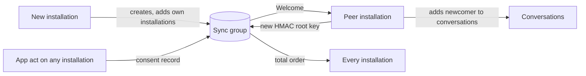

# Device sync

A user's installations exchange preferences over a group only they belong to: the sync group. What travels over it is a consent record (`CONS`) or the HMAC root key that push suppression derives from (PUSH-258). Both are the user's own state, so accepting an invitation to a sync group grants access to that state, and the rule for trusting one is a security boundary.

A new installation creates a sync group and adds every other installation of its inbox. The Welcome it sends is how those installations learn that it exists: each adds the new installation to the user's conversations and publishes a fresh HMAC root key so that the newcomer holds it. Every later preference change is published to the sync group and merged on each installation under a total order, so the same updates applied in any order leave the same state.



## Scope

In scope: when a sync group is created and who is in it, the trust rule for a sync-group Welcome and for a sync message, what a peer does when it learns of a new installation, the preference update wire format, how an update is applied, what a restart preserves, and that a sync group is hidden from an app.

Out of scope: the consent record and its merge (`CONS`), the join itself (`JOIN`), the membership commit that adds an installation (GMOD-029), HMAC key derivation and its use by a push server (PUSH-258), the archive and its transport (`ARCH`), and the content type envelope (CTYPE-001).

| Related | Relation |
| --- | --- |
| `CONS` | Owns the consent record, its wire form, and the merge. This spec owns carrying it. |
| `JOIN` | Owns the join. SYNC-010 adds the check a sync-group Welcome gets under JOIN-060. |
| `GMOD` | GMOD-029 owns the commit that reconciles a group's installations with identity state. SYNC-014 owns when a peer runs it for a newcomer. |
| `PUSH` | PUSH-258 owns the HMAC root key's derivation into per-conversation keys; PUSH-219 owns push eligibility. This spec owns the root key's cycling and propagation. |
| `CTYPE` | Owns `EncodedContent` and `ContentTypeId`, which a sync message is wrapped in, and CTYPE-001, which selects a codec by them. |
| `META` | Owns `CONVERSATION_TYPE` and `CREATOR_INBOX_ID` in immutable metadata, and META-019, which rejects a Welcome that lacks them. |
| `PROC` | Owns how a stored envelope is processed and how a message stream excludes a conversation kind (PROC-032). |

## Terms

| Term | Meaning |
| --- | --- |
| Sync group | A group whose immutable metadata `CONVERSATION_TYPE` is `CONVERSATION_TYPE_SYNC`. |
| Sync message | An application message in a sync group whose content is a `DeviceSyncContent` under the content type in section 3. |
| Preference update | One `PreferenceUpdate`: a consent record or an HMAC root key. |
| Admissible update | A preference update in a sync message that SYNC-011 does not exclude and SYNC-023 does not ignore. |
| HMAC root key | The 42-byte secret every installation of an inbox shares, from which PUSH-258 derives per-conversation keys. |
| Cycle time | The `cycled_at_ns` of an HMAC root key: the clock of the installation that generated it. |
| Local join time | The stored time at which the client created a group or completed its join from a Welcome. |
| Own inbox | The inbox the acting client belongs to. |

## 1. The sync group

Each installation that holds no sync group creates one and adds every other installation its inbox's identity state associates. An installation therefore belongs to one sync group per installation registered after it, plus its own, and the newest one is the one every current installation is in. A client publishes to that one and reads all of them, so an installation that has not yet received the newest Welcome still hears from the ones it has.

A sync group is the user's own state, not a conversation. It is never listed or streamed to an app that did not ask for sync groups, and its messages produce no push notification: PUSH-219 makes a group message push-eligible only when `should_push` is true. Whether a consent record exists for a sync group has no effect; SYNC-005 hides it by conversation type.

| ID | Title | Requirement | Why |
| --- | --- | --- | --- |
| SYNC-001 | Create when none | When a client that may reach the backend runs and holds no sync group, it MUST create a group whose immutable metadata `CONVERSATION_TYPE` is `CONVERSATION_TYPE_SYNC` and add every installation that its inbox's identity state associates other than itself. | A peer installation learns of this one from the Welcome. Without it the peer never adds this installation to a conversation. |
| SYNC-002 | Publish to the newest | When the client publishes a preference update, it MUST publish it to the sync group with the greatest local join time, and on an equal time the greatest group id under byte order. | That group was created by the newest installation and contains every installation known to it. An older group leaves out every installation registered after it. |
| SYNC-003 | Read every sync group | The client MUST apply admissible updates from every sync group it belongs to, not only the one SYNC-002 selects. | An installation that has not received the newest Welcome publishes to an older group, and a reader of the newest alone misses it. |
| SYNC-004 | No push for sync messages | When the client publishes a sync message, it MUST publish it with `should_push` false. | Every consent change would otherwise notify the user on every device. |
| SYNC-005 | Hidden from the app | The client MUST NOT return a sync group in a listing or stream of conversations, or its messages in a stream of messages across conversations, unless the app asked for sync groups. | |

## 2. Trust

A Welcome names the inbox that added the recipient (JOIN-025) and the membership it asserts (JOIN §8). JOIN §8 checks that every leaf node belongs to the inbox it claims; it does not ask which inbox that is. For every other conversation kind the joiner accepts strangers; a sync group is the one kind in which it may not. A sync group created by another inbox, or one with another inbox in it, is a group into which this client would publish its consent decisions and the key its push suppression depends on. JOIN-060 rejects a Welcome that fails the checks its kind demands; SYNC-010 states the checks for this kind.

The same rule applies to what is read. A sync message is applied only when its sender is an installation of the own inbox, whatever group it arrived in.

| ID | Title | Requirement | Why |
| --- | --- | --- | --- |
| SYNC-010 | Only the own inbox invites | When a Welcome carries a group whose `CONVERSATION_TYPE` is `CONVERSATION_TYPE_SYNC`, the client MUST record a terminal rejection for it unless the adder under JOIN-025 is the own inbox and every leaf node in the ratchet tree names the own inbox. | Anyone can create a group and name it a sync group. Accepting one makes it the group this client publishes to under SYNC-002, and its members read every consent decision and the HMAC root key. |
| SYNC-011 | Only the own inbox is applied | When a sync message's sender, read from the credential of the sender's leaf node, is not an installation of the own inbox, the client MUST NOT apply its preference updates. | An accepted update sets consent and replaces the HMAC root key. From a stranger it hides conversations or breaks push suppression on every device. |

## 3. Preference updates

A sync message is an application message whose content is an `EncodedContent` with `ContentTypeId` authority `xmtp.org`, type `application/x-protobuf`, and major version 1, and whose `content` bytes are an encoded `DeviceSyncContent`. CTYPE-001 selects the codec by those three values.

```proto
// All potential device sync group messages
message DeviceSyncContent {
  reserved 1, 3;
  reserved "request", "reply";

  oneof content {
    DeviceSyncAcknowledge acknowledge = 2;
    PreferenceUpdates preference_updates = 4;
  }
}

// Acknowledges a request
message DeviceSyncAcknowledge {
  string request_id = 1;
}

// Preference updates
message PreferenceUpdates {
  repeated PreferenceUpdate updates = 1;
}

// Preference update
message PreferenceUpdate {
  oneof update {
    xmtp.device_sync.consent_backup.ConsentSave consent = 1;
    HmacKeyUpdate hmac = 2;
  }
}

// Hmac key update
message HmacKeyUpdate {
  bytes key = 1;
  int64 cycled_at_ns = 2;
}
```

Fields 1 and 3 of `DeviceSyncContent` carried a history transfer that older installations still send. `acknowledge` is its reply and carries nothing to apply. A message a client cannot use is ignored and does not stop the messages behind it. The sync group carries no archive; an archive travels by a channel the app chooses (`ARCH`).

What is published is what carries a decision: a record stored under CONS-011, CONS-020, or CONS-021, including a repeated decision that only moves the record's time. A join default (CONS-022 to CONS-025) is not published: every installation derives it from its own Welcome, and at consent time 0 it would change nothing. A record received from a peer or an archive is not republished.

Both update kinds merge under a total order, the consent record under CONS-010 and the HMAC root key under SYNC-022, and neither depends on which sync group an update arrived in. That is what makes applying a message idempotent: a message applied twice, or after a greater one, changes nothing, so a client needs no other record of what it has applied to stay correct. The client's own messages are applied like a peer's.

| ID | Title | Requirement | Why |
| --- | --- | --- | --- |
| SYNC-020 | Wire format | When the client publishes a preference update, it MUST publish a sync message whose `DeviceSyncContent` carries `preference_updates` with each update as a `PreferenceUpdate` defined above, with a consent record encoded under CONS-002. | |
| SYNC-021 | Publish every decision | When the client stores a consent record under CONS-011, CONS-020, or CONS-021, it MUST publish that record as a preference update, whether or not its state differs from the record it replaced, and MUST NOT publish a record it stored under CONS-010, CONS-023, CONS-025, or DMS-010. | A repeated decision that stays on one device loses to an older decision made elsewhere; a republished record makes every installation echo every other. |
| SYNC-022 | The greater root key wins | When the client receives an `HmacKeyUpdate` whose `key` is 42 bytes, it MUST store the received key and `cycled_at_ns` when it holds no root key, or when `cycled_at_ns` is greater than the stored cycle time, or when they are equal and the received `key` is greater under byte order; otherwise it MUST leave the stored key unchanged. When `key` is not 42 bytes, it MUST NOT store it. | Two installations that keep different root keys register different per-conversation keys, and a message one of them sends notifies the other. A tie left to arrival order leaves two devices with two keys. |
| SYNC-023 | Ignore what cannot be used | When a sync message's `DeviceSyncContent` has no `content` set, carries `acknowledge`, or contains a `PreferenceUpdate` with no `update` set, the client MUST ignore that content or that update without failing the message and MUST apply the other admissible updates in the same message. | An older installation's history transfer, or a newer installation's update kind, would otherwise stop every update behind it. |

## 4. A new installation

The Welcome to a sync group is the signal that an installation exists. On it, a peer does two things. It adds the new installation to the user's conversations, so that the newcomer can read them without waiting for each conversation's next reconciliation under GMOD-029; and it publishes a new HMAC root key, so that the newcomer receives one. The key is also cycled when an installation is revoked, so that the revoked installation's copy stops matching what the others register; the revoked installation reads the new key until it is removed from the sync group (Known limitations).

Which conversations the newcomer is added to is a consent decision. A denied conversation is not shared, and a conversation with no activity for 90 days is left for its next reconciliation. A conversation's activity time is the `sent_at_ns` of its last stored message when it has one, and its local join time otherwise.

The newcomer receives no existing consent record. It holds the defaults it derives from its own Welcomes and what DMS-010 carries, and every decision made after it joined the sync group (Known limitations).

Both acts survive a restart. The add is a commit the peer owes until it lands or the group is gone; an update the client received is applied whether or not the process that received it is the one that applies it. How a stored envelope is processed is owned by `PROC`; this spec owns only the effect on stored consent and the root key.

| ID | Title | Requirement | Why |
| --- | --- | --- | --- |
| SYNC-014 | Add the newcomer to conversations | When the client joins a sync group from a Welcome, it MUST, for every group and DM whose conversation consent is allowed or unknown and whose activity time is greater than the current time minus 90 days, publish a commit that adds each installation that its inbox's identity state associates and the group's membership lacks, and MUST complete that commit after any restart until it lands or the group is no longer held. | A newcomer no peer adds reads nothing until each conversation's next reconciliation, which for a quiet one is never. |
| SYNC-015 | Cycle the root key | When the client joins a sync group from a Welcome, or revokes an installation of its inbox, it MUST publish an `HmacKeyUpdate` whose `key` is 42 bytes drawn from a cryptographically secure random source for that update and whose `cycled_at_ns` is the current time. | The newcomer holds no key until one is published. A revoked installation that keeps a valid key can still suppress the user's notifications. |
| SYNC-016 | Updates survive a restart | After a restart, the stored consent and HMAC root key MUST reflect every admissible update the client received before the restart, merged under CONS-010 and SYNC-022, whether or not the process that received it applied it. | A restart mid-way otherwise leaves a device that never converges, and neither device can tell. |
| SYNC-017 | One failure does not block the rest | If applying an admissible update fails, then the client MUST still apply the other admissible updates it holds. | |

## Known limitations

A revoked installation stays in the sync group until a commit removes it, and reads the root key published under SYNC-015 in the meantime. The cycle limits how long the old key is valid; it does not deny the new key to a device that has not yet been removed.

A new installation receives no consent record that predates it. A conversation the user allowed on an older device is unknown on the new one until the user decides again on any device, unless it was created by the own inbox (CONS-023) or is a DM the new device already holds a record for (DMS-010).

An installation that needs a per-conversation key before it holds a root key generates one and does not publish it. Its keys differ from its peers' until the next cycle under SYNC-015.

A sync group is never removed. An inbox with many installations holds one sync group per installation, and each installation reads all of them.

The cycle time is the generating installation's clock. Under SYNC-022 an installation whose clock is ahead wins every merge, including against a key generated later on another device.

A member added to a sync group by a later commit is not checked against SYNC-010, which runs at join. Only the own inbox is a member at join, and only members can commit, so the addition would have to come from an installation of the own inbox.
