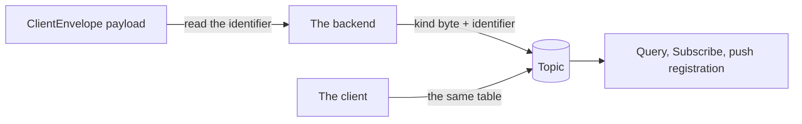

# Topic format

Every envelope the backend stores is routed by a topic: one kind byte followed by an identifier the backend reads out of the payload. A client names topics when it queries, subscribes, and registers for push; the backend names them when it stores. Both sides compute the same bytes from the same table, so the table is the whole interoperability contract. It lives here so that the specs that use topics reference it instead of each restating it.

## Scope

In scope: the kind byte of each topic kind, the length of its identifier and the payload field it is read from, the rule that the backend derives every stored envelope's topic from its payload, and the rejection of a topic a request names that does not match the table.

Out of scope: what the backend does with an envelope once routed, the envelope wire format, and the publish rejection an unroutable payload receives (`API`); which topics a client reads and how it keeps its position on them ([PROC](PROC-message-processing.md)); which topic kinds a push subscription may name (PUSH-215); inbox id derivation (IDENT-010); installation keys ([IDENT section 8](IDENT-identity-updates.md#8-installations)); and group id generation (`?GMOD`).

| Related | Relation |
| --- | --- |
| `API` | Owns the envelope payloads the identifiers are read from, the publish admission that rejects a payload this spec cannot route (API-230), and the status codes (API-281). |
| `JOIN` | Owns the welcome pointer whose `destination` is a welcome topic identifier the sender generates (JOIN-029), and the key package the installation key is read from (JOIN-001). |

## Terms

| Term | Meaning |
| --- | --- |
| Kind byte | The first byte of a topic, which names the payload kind stored under it. |
| Identifier | The bytes after the kind byte: the group id, installation key, or inbox id the payload names. |

## 1. Layout

A topic is one kind byte and one identifier, with nothing before, between, or after them. The identifier has a fixed length for each kind, so a topic parses without a length prefix and two implementations cannot disagree about where it ends. The backend reads the identifier from the payload; a publish request carries no topic field, so a client cannot store an envelope anywhere but where its payload says. A group's message topic and its commit-log topic carry the same 16 bytes under different kind bytes.

The table below is the layout. Its kind bytes and lengths are the exact values this spec owns (SPEC-039).

| Kind byte | Payload | Identifier | Read from |
| --- | --- | --- | --- |
| `0x00` | Group message | 16-byte group id | The `group_id` of the `PublicMessage` or `PrivateMessage` ([RFC 9420 §6](https://www.rfc-editor.org/rfc/rfc9420.html#section-6)) carried in `GroupMessage.data`. |
| `0x01` | Welcome | 32-byte installation key | `installation_key` of `WelcomeMessage.V1` or of `WelcomeMessage.WelcomePointer`. |
| `0x02` | Identity update | 32-byte inbox id | `IdentityUpdate.inbox_id`, 64 hexadecimal characters, decoded. |
| `0x03` | Key package | 32-byte installation key | The `signature_key` of the leaf node of the `KeyPackage` ([RFC 9420 §10](https://www.rfc-editor.org/rfc/rfc9420.html#section-10)) carried in `KeyPackage.key_package_tls_serialized`. |
| `0x04` | Commit-log entry | 16-byte group id | `PlaintextCommitLogEntry.group_id` decoded from `CommitLogEntry.serialized_commit_log_entry`. |

API-210 owns `ClientEnvelope` and its payloads, and [JOIN section 1](JOIN-joining-groups.md#1-what-a-key-package-carries) defines `KeyPackage`, and [JOIN section 4](JOIN-joining-groups.md#4-unwrapping-a-welcome) defines `WelcomeMessage`. IDENT-001 owns the identity update; [FORK section 2](FORK-fork-recovery.md#2-keys-and-signatures) defines the commit-log wire messages. This spec reads the identifier field of each payload.

| ID | Title | Requirement | Why |
| --- | --- | --- | --- |
| TOPIC-001 | Topic is derived from the payload | The backend MUST set the topic of every stored envelope to the kind byte the table above gives for its payload kind, followed by the identifier read from the payload field the table names, and nothing else. A kind byte in the table MUST NOT be assigned to another payload kind. | A client that computes a topic from the table and the backend that stores under it must reach the same bytes, or every query and subscription misses. |
| TOPIC-002 | Unroutable payloads are not stored | If the identifier read from a payload is not the length the table gives for its kind, or `IdentityUpdate.inbox_id` is not 64 hexadecimal characters, then the backend MUST NOT store the envelope. | An envelope under a topic no client can compute is unreachable, and storing it would still consume a sequence id on nothing. |
| TOPIC-003 | Reject a malformed topic | When a request names a topic whose kind byte is not in the table, or whose identifier length is not the one the table gives for that kind byte, the backend MUST fail the request with `INVALID_ARGUMENT`. | A topic that cannot be stored under can never match an envelope, so a read or a subscription that names one waits for ever without an error. |

## Known limitations

A topic binds an envelope to the identifier its payload names, not to the publisher. Anyone who can reach the backend can publish a parseable group message naming any group id, a Welcome naming any installation key, or a commit-log entry naming any group id; `API` states what admission establishes for each kind. Such an envelope consumes storage and the recipient's processing capacity without disclosing group plaintext.

A welcome topic's identifier need not be a registered installation key. A welcome pointer's pointee is stored under 32 random bytes that name no installation (JOIN-029), and the backend cannot tell that topic from a real installation's.
