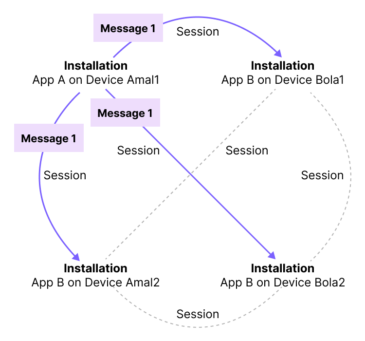
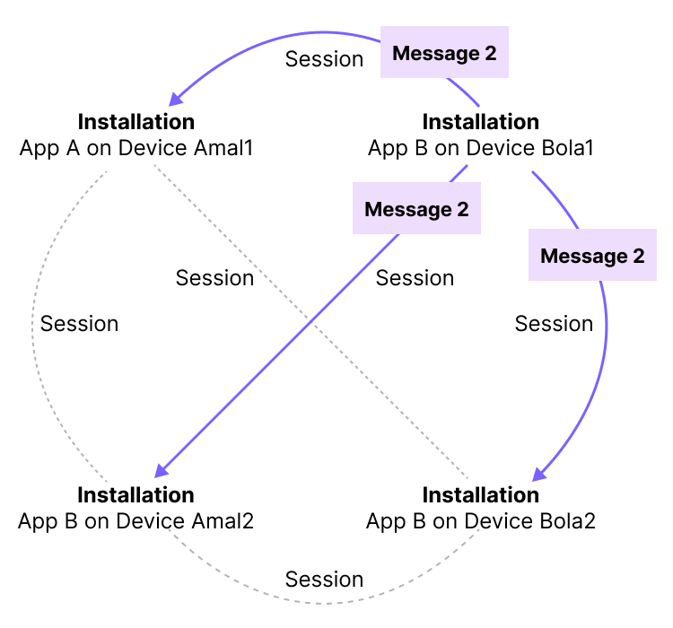

# CLI


This is a demo XMTP v3-alpha console client (CLI) that you can use to send and receive messages via the command line. Specifically, you can use it to try out [double ratchet messaging](#double-ratchet-messaging) and [installation key bundles](#installation-key-bundles) enabled by XMTP v3-alpha.

> **Important**  
> This software is in **alpha** status and ready for you to start experimenting with. Expect frequent changes as we add features and iterate based on feedback.

## Send a double ratchet message

Use the CLI to send a [double ratchet message](#double-ratchet-messaging) between test wallets using a local XMTP node and database running in Docker Desktop.

1. In the root directory of this repo, run:

   ```bash
   dev/up
   ```

2. Create a sender wallet account (user1). Create an [installation key bundle](#installation-key-bundles) and store it in the database. Grant the installation key bundle permission to message on behalf of the sender address. This will allow the CLI to message on behalf of the sender address.

   ```bash
   ./xli.sh --db user1.db3 register
   ```

3. Likewise, create a recipient wallet account (user2) and an installation key bundle.

   ```bash
   ./xli.sh --db user2.db3 register
   ```

4. Get the recipient's wallet address.

   ```bash
   ./xli.sh --db user2.db3 info
   ```

5. Send a message into the conversation. The message is sent using [one session between each installation](#installation-key-bundles) associated with the sender and recipient. The message is encrypted using a session key dedicated to this single message per the [double ratchet algorithm](#double-ratchet-messaging).

   ```bash
   ./xli.sh --db user1.db3 send <user2_address> "hello"
   ```

6. List conversations.

   ```bash
   ./xli.sh --db user1.db3 list-conversations
   ```

## Double ratchet messaging

**What**: XMTP v3-alpha introduces the use of the [double ratchet algorithm](https://signal.org/docs/specifications/doubleratchet/) to keep past and future messages secure.

**Why**: With double ratchet messaging, each message is encrypted by its own session key. If the session key a sender used to send a message becomes compromised:

- All of their past messages remain secure. (Forward secrecy)

  Specifically, a malicious actor can’t decrypt and read the user’s past messages.

- Future messages will be secure. (Future, or post-compromise, secrecy)

  Specifically, a malicious actor can’t decrypt and read future messages. They also can’t send new messages impersonating the user.

In contrast, with XMTP v2, if a user’s key bundle becomes compromised:

- All of their past messages might not remain secure.
- Future messages might not remain secure.

**How**: Specifically, it uses the Rust version of [Olm](https://gitlab.matrix.org/matrix-org/olm/-/blob/master/docs/olm.md), which is Matrix protocol’s implementation of double ratchet. To learn more about the double ratchet algorithm and how sessions and session keys work, see [The Double Ratchet Algorithm](https://signal.org/docs/specifications/doubleratchet/).

## Installation key bundles

**What**: With XMTP v2, a user signs with their blockchain account to create an XMTP identity the first time they use an app built with XMTP. The user then signs to create a [user key bundle](https://xmtp.org/docs/concepts/key-generation-and-usage) that is stored on the XMTP network and used to [encrypt](https://xmtp.org/docs/concepts/invitation-and-message-encryption) and exchange messages.

With XMTP v3-alpha, there is no XMTP user key bundle. Instead, the user signs with their blockchain account to grant permission to an installation key bundle to send messages from their account address. The user signs to grant permission to an installation key bundle for each installation of an app built with XMTP. The installation key bundle is stored on each device and is not required to be stored on the XMTP network.

**Why**: Storing keys on the XMTP network makes them potentially available to anyone. Moving key storage to devices significantly improves security, as keys never leave a user’s device. Additionally, installation key bundles provide separate and revocable keys for each app installation on a device, simplifying key management. When a user revokes (deletes) a key from a device, you can be sure that it is gone.

**How**: If a user has App A installed on Device 1, App B installed on Device 1, and App A installed on Device 2, they will sign three times to grant permission to an installation key bundle per installation.

When a user sends a message using an installation, the installation sends the message to all installations associated with the blockchain account addresses in the conversation.

For example, let’s take a look at a conversation between Amal and Bola. Amal sends a message to Bola using App A on their Amal1 device. The message is [sent in a session](https://www.notion.so/XMTP-v3-alpha-doc-updates-6cb0328f5d5e4415a49f0b8bcc9c9135?pvs=21) (with its own session key) to each installation for which Bola has granted permission to an installation key bundle. The message is also sent to all installations for which Amal has granted permission to an installation key bundle.



The same sending pattern applies when Bola sends a message to Amal:


