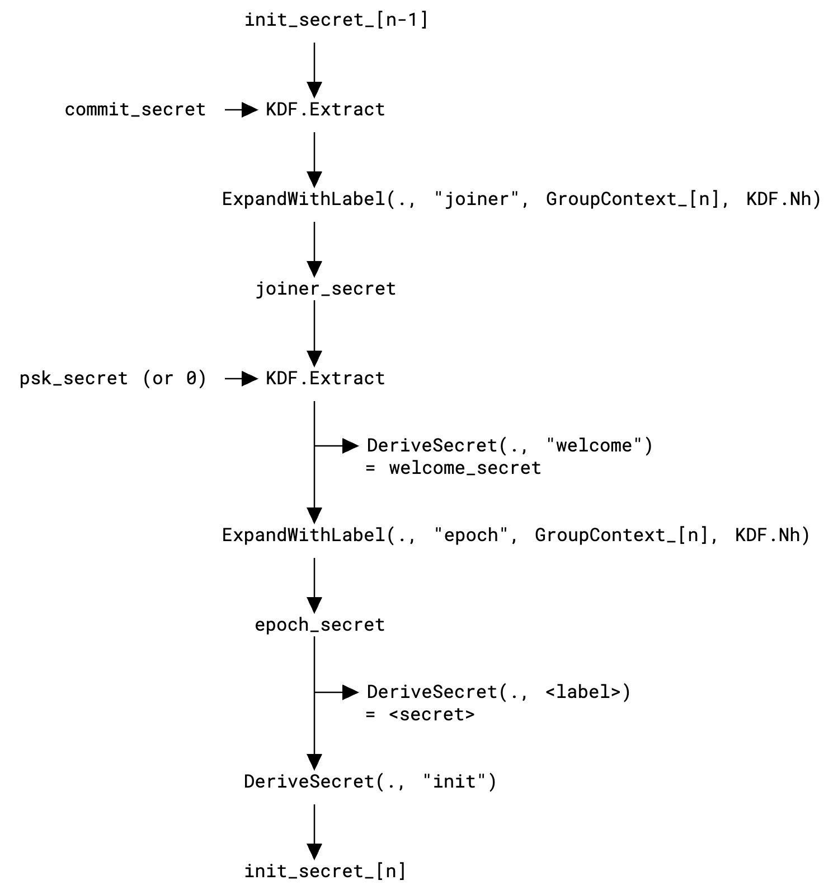

# HNDL Security of XMTP with MLS

The goal of this analysis is to show that the XMTP-MLS provides Harvest Now Decrypt Later (HNDL) forward security. To this end we describe which MLS features and messages break HNDL security and what exact type of HNDL security is provided.

In this document we call the flavor of MLS that XMTP uses XMTP-MLS[^1]. That is, only private messages are used. External proposals and commits are not allowed. And an additional HPKE encryption of `Welcome` messages is performed, which is using a post-quantum secure ciphersuite[^2]. XMTP-MLS uses `MLS_128_HPKEX25519_CHACHA20POLY1305_SHA256_Ed25519`[^3].

In this analysis we assume that all symmetric cryptography is post-quantum/HNDL secure.We further do not aim to formally prove anything about MLS, only sketch an informal argument. In particular, we assume that the key schedule is HNDL secure. See academic work[^4],[^5] for details on the security of the key schedule. Instead, we assume that the key schedule is HNDL secure, given that it only relies on the SHA-256 hash function, which we assume to be HNDL secure.

We show that XMTP-MLS provides HNDL forward security, but falls short when removing clients from the group or considering post compromise security.

# Security Notions

Before arguing that we can reach some form of HNDL security with XMTP-MLS, we need to define what that means. The security notions for HNDL are not fully defined or well understood in the literature yet. We define the following two notions of HNDL.

#### HNDL Forward Secrecy (HNDL-FS)

Similar to regular forward security, which says that keys, and therefore messages, before a compromise must stay secure in future, HNDL forward secrecy is defined such that even an attacker with access to a quantum computer in the future can not gain access to old keys and messages.

Suppose a protocol derives a key `K` at time `T`. We say that `K` is HNDL forward secure if the following holds:

* if the adversary records all communication in all epochs, including the ciphertexts produced with `K`, and  
* if `K` is subsequently deleted at `T’ > T` from all machines, and  
* if `K` was not known to the adversary before `T’`, and  
* if in epoch `T’’ > T’`, a quantum adversary is able to break classical asymmetric cryptography,  
* then the adversary will not be able to distinguish key `K` from a randomly chosen key `K’`.

In the context of MLS, `K` will typically refer to the `epoch_secret` in a given epoch, which is subsequently used to derive all the message encryption keys. Consequently, this HNDL-FS for MLS means that a quantum adversary who can break all ECDH from time `T’’` can still not decrypt messages encrypted under `K`.

#### HDNL Post Remove Security (HNDL-PRS)

Similar to classical security guarantees, we also need to look at cases where keys are compromised. This is usually captured with a definition of Post-Compromise Security (PCS)[^6]. PCS considers different “compromise” scenarios for protocol participants where for example only parts of the secret state of a participant may be compromised.

Here, we use the weaker, but more targeted and easier to understand notion of Post Remove Security (PRS). Informally, removed devices should not be able to read or write subsequent messages. Unlike PCS, PRS security does not require a fine-grained compromise scenario. Instead, it captures the natural MLS behaviour of removing a participant from the conversation. PRS is not a very interesting property in a 1:1 conversation (considering only single devices), because the conversation ends with removing a participant. In a group conversation however (or when considering multiple devices per user), this property has more weight because the conversation continues and a member (or device) that was removed explicitly is not supposed to have access to subsequent messages anymore.

The following definition captures the HNDS-PRS property in the context of MLS. In particular, a removed client must not be able to decrypt messages that were sent in the group after they were removed even if it gets access to a quantum computer.

Suppose key `K` defines the epoch secret for an epoch `E` that is created with (say) a commit at time `T`. We say that `K` is HNDL forward secure if the following holds:

* if the adversary records all communication in all epochs, including the ciphertexts produced with `K`, and  
* if the adversary has been a member in the group from epoch `U` to epoch `J`, where `U<J<T`, and  
* if `K` is subsequently deleted at `T’ > T` from all machines, and  
* if `K` was not known to the adversary before `T’`, and  
* if in epoch `T’’ > T’`, a quantum adversary is able to break classical asymmetric cryptography,  
* then the adversary will not be able to distinguish key `K` from a randomly chosen key `K’`.

# MLS

We recall the MLS key schedule from RFC here to make the remainder of the document easier to understand. Please refer to RFC 9420[^7] for the full description of MLS structs and mechanisms.  



Since the key schedule is purely symmetric, it is sufficient to show that if at least one of the `init_secret` or the `commit_secret` are HNDL secure, the `joiner_secret` and the `epoch_secret` are HNDL secure, and therefore MLS.

Since PSKs are not used in xmtp-mls, we do not further investigate the use of the `psk_secret`.

The `epoch_secret` is used to generate secrets such as the `sender_data_secret` and `encryption_secret`, which are used for message encryption, using the secret tree. They are therefore the input key material for all encryptions of handshake and application messages.

## The secrets

The two secrets, `commit_secret` and `init_secret`, bind the secret to i) the tree, and ii) to the previous epoch.

### Commit secret

The `commit_secret` is the `DeriveSecret(path_secret[n-1], "path")` secret from updating the tree with a fresh leaf node. The `commit_secret` is empty if the commit adding the new leaf has no path.

The `Welcome` message contains the `path_secret` of the *lowest common ancestor* between the committer and the new member. From there, the remaining path secrets are derived.

The `path_secret[0]` is chosen at random. And `DeriveSecret := HKDF(salt, “”, label)`.

### Init secret

The `init_secret` on group creation (epoch 0\) is chosen at random. In every subsequent epoch it is derived as shown in the key schedule above.

### Derivation

The derivation of the `joiner_secret` for epoch `n` is defined as `KDF(init_secret[n-1], commit_secret, joiner || GroupContext_[n])` with `KDF := HKDF(salt, ikm, label)`. We assume that given the output of the `KDF`, it is not possible to distinguish this value from a randomly chosen byte string of the same length. HKDF[^8] is used for all KDFs.

## Messages with secrets

MLS has many different messages that may change the group state, i.e. contain (encrypted) secret values. It is therefore important to inspect every possible message to reason about the security.

### Welcome

The `Welcome` message sends the encrypted group secrets to the new joiner. These secrets include the `joiner_secret`, the `path_secret` (if present), and all `psks` (their IDs, not the actual keys).

```c
struct {
  opaque path_secret<V>;
} PathSecret;

struct {
  opaque joiner_secret<V>;
  optional<PathSecret> path_secret;
  PreSharedKeyID psks<V>;
} GroupSecrets;

struct {
  KeyPackageRef new_member;
  HPKECiphertext encrypted_group_secrets;
} EncryptedGroupSecrets;

struct {
  CipherSuite cipher_suite;
  EncryptedGroupSecrets secrets<V>;
  opaque encrypted_group_info<V>;
} Welcome;
```

In XMTP-MLS the entire `Welcome` message is encrypted again with HPKE.

```rust
encrypt_with_label(
    hpke_welcome_key,
    "MLS_WELCOME",
    &[],
    welcome_payload,
    CIPHERSUITE,
    &crypto,
)
```

The `hpke_welcome_key` is a fresh  XWing-06[^9] key pair, generated with 32 bytes of fresh randomness. The encryption key is stored in an opaque extension in the key package. The `”MLS_WELCOME”` label is unique in XMTP-MLS, and the `welcome_payload` is the TLS serialized `Welcome` message that would be sent out in regular MLS. The XWing-06 key is rotated together with the key package. Note that XMTP-MLS uses only last resort key packages.

### Commit

The `Commit` message contains the encrypted `path_secret`s for the new path from the committer to the root. Note that the path may be omitted in certain cases. But we assume that all commits contain paths here. The `path_secret`s lead to the `commit_secret` as described above.

```c
struct {
    HPKEPublicKey encryption_key;
    HPKECiphertext encrypted_path_secret<V>;
} UpdatePathNode;

struct {
    LeafNode leaf_node;
    UpdatePathNode nodes<V>;
} UpdatePath;

struct {
  ProposalOrRefType type;
  select (ProposalOrRef.type) {
    case proposal:  Proposal proposal;
    case reference: ProposalRef reference;
  };
} ProposalOrRef;

struct {
    ProposalOrRef proposals<V>;
    optional<UpdatePath> path;
} Commit;

struct {
    opaque group_id<V>;
    uint64 epoch;
    ContentType content_type;
    opaque authenticated_data<V>;
    opaque encrypted_sender_data<V>;
    opaque ciphertext<V>;
} PrivateMessage;
```

The `ciphertext` is the encrypted `PrivateMessageContent` struct, which contains the `Commit`, and is encrypted with the handshake message keys from the key schedule of the current epoch. `N` is the index in the array representation of the tree, and the secret tree mimics the MLS group tree with the `encryption_secret` in the root node. This can be abstracted to the following, which is used to then derive key and nonce for the AEAD scheme.

```py
handshake_ratchet_secret_[N]_[0] = KDF(encryption_secret, "handshake")
```

Therefore, if the `epoch_secret` in epoch `T` is HNDL secure, the `path_secrets` in the `Commit` message are HNDL protected.

### External messages, ReInits, PSKs

MLS has more messages that modify the group state. However, they are not used in XMTP-MLS and are therefore not analyzed any further here.

The reinitialization proposal allows the group to reinitialize with different parameters, while linking it to the previous group. The link is done with a `PSK`, which is a `resumption_psk` from the key schedule of the previous epoch. In addition, the group is freshly set up, and everyone is invited again with `Welcome` messages.

Out-of-band distributed PSKs may also be mixed into the `joiner_secret` in the key schedule. However, in xmtp-mls, PSKs are not used and we therefore do not consider the HNDL implications of PSKs.

External initialization allows a party that is not in the group, i.e. does not have knowledge of the symmetric key material within the group, to initialize a new epoch. This will most likely break HNDL security unless it is protected with a post-quantum secure asymmetric mechanism.

# HNDL Forward Security of XMTP-MLS

In XMTP-MLS we claim that, if in epoch `n` either the `init_secret` or the `commit_secret` is HNDL secure, the `epoch_secrets` as well as the new `init_secret` in epoch `n+1` is HNDL secure. This implies that HNDL-FS holds for XMTP-MLS.

## Epoch 0

In epoch `0` this is trivially correct because no secrets are sent over the wire, not even encrypted. Unless other users are added to the group, we assume that the group stays in epoch `0`.

## Epoch 1

We assume that new users are added in epoch `1`. Any other case is trivial because only a single user is in the group. This requires `Welcome` messages to be sent to all new users. The welcome messages are HPKE encrypted with XWing-06.

If the attacker, at time `T’’` with access to a quantum computer, can distinguish between a randomly chosen `joiner_secret` and `path_secret`, and the values inside one of the `Welcome` messages, the attacker can break XWing-06. Referring to the proof for XWing[^10], we know that this is not possible without breaking the security of ML-KEM-768[^11].

No other operations are available at this point because the group only has a single member and is not fully functional yet.

## Epochs \> 1

Now we show that if the `epoch_secret`s in epoch `n` were HNDL secure, the `epoch_secret`s in epoch `n+1` are HNDL secure. Given that the `epoch_secret_[n]` is HNDL secure, the combination of the `init_secret_[n]` with the attacker known `commit_secret` is HNDL secure as well, considering that HKDF is a dual-PRF[^12]. Note that knowledge of other `commit_secret`s from other epochs is irrelevant as each commit secret is the output of an HKDF chain with a fresh `leaf_secret` as input. If a new client is added to the group in the attacked epoch, the adversary could also attack the `Welcome` message. However, we argued in the previous section already that the attacker can not use a `Welcome` message to retrieve the `joiner_secret`. Therefore, additional welcome messages do not give the attacker additional capabilities.

# XMTP-MLS and HNDL-PRS

XMTP-MLS is not post-remove HNDL secure. For PRS we consider the attacker to have been part of the group at some point. While this would allow the attacker to also send messages to the group, this is not relevant for the attack. Once the HNDL chain, starting with the post-quantum secure `Welcome` message, is broken because the attacker is part of the group, it can not be restored without another post-quantum secured message.

The `Commit` messages that are healing MLS to provide PRS are not HNDL secure. While private messages are used in XMTP-MLS, the key that is used to symmetrically encrypt the message is known to the attacker. The attacker therefore has access to the `init_secret` (because it was part of the group), and is able to decrypt the `commit_secret` from the `Commit` message. The protocol is therefore not HNDL-PRS.

# Closing Remarks

We believe that the arguments above are sufficient to argue that XMTP-MLS provides HNDL-FS for real-world use. This is similar to the security provided by protocols like PQXDH[^13] (without the post-quantum ratchet). While HNDL-PRS in a group context like MLS, is a relevant security property, HNDL-FS in XMTP-MLS provides a high level of protection against HNDL attackers.

However, this is not a proof of the security of XMTP-MLS. A mechanised cryptographic proof, or a rigorous analysis of the security reductions would be needed to gain full confidence in the desired security guarantee. 

The HNDL security of the initial `Welcome` message allows the protocol to establish an HNDL secure chain. However, as soon as we consider removing clients from the group, the HNDL security fails. This is because the `Commit` messages are not HNDL secure. Other MLS mechanisms like resumption or PSKs would also be able maintain the HNDL chain but are out of scope for XMTP-MLS for now.

To achieve HNDL-PRS for XMTP-MLS, the `Commit` messages could be protected with a post-quantum secure, asymmetric mechanism in the future. This could be done with every commit, or could be amortised as done by PQ3[^14] or Signal’s sparse post-quantum ratchet[^15], or by other mechanisms that may be standardized for MLS.

[^1]:  [XMTP MLS](https://github.com/xmtp/libxmtp/tree/main/xmtp_mls) 

[^2]:  [Create post quantum keys in all key packages \#1851](https://github.com/xmtp/libxmtp/pull/1851) 

[^3]:  [Messaging security properties with XMTP](https://docs.xmtp.org/protocol/security) 

[^4]:  [Cryptographic Security of the MLS RFC, Draft 11](https://eprint.iacr.org/2021/137) 

[^5]:  [TreeKEM: A Modular Machine-Checked Symbolic Security Analysis of Group Key Agreement in Messaging Layer Security](https://eprint.iacr.org/2025/410) 

[^6]:  [Post-Compromise Security](https://eprint.iacr.org/2016/221.pdf) 

[^7]:  [RFC 9420: The Messaging Layer Security (MLS) Protocol](https://www.rfc-editor.org/rfc/rfc9420.html) 

[^8]:  [Cryptographic Extraction and Key Derivation: The HKDF Scheme](https://eprint.iacr.org/2010/264) 

[^9]:  [X-Wing: general-purpose hybrid post-quantum KEM](https://www.ietf.org/archive/id/draft-connolly-cfrg-xwing-kem-06.html#name-use-in-hpke) 

[^10]:  [X-Wing: The Hybrid KEM You’ve Been Looking For](https://eprint.iacr.org/2024/039) 

[^11]:  [FIPS 203, Module-Lattice-Based Key-Encapsulation Mechanism Standard | CSRC](https://csrc.nist.gov/pubs/fips/203/final) 

[^12]:  [When Messages are Keys: Is HMAC a dual-PRF?](https://eprint.iacr.org/2023/861) 

[^13]:  [Signal \>\> Specifications \>\> The PQXDH Key Agreement Protocol](https://signal.org/docs/specifications/pqxdh/) 

[^14]:  [iMessage with PQ3: The new state of the art in quantum-secure messaging at scale](https://security.apple.com/blog/imessage-pq3/) 

[^15]:  [GitHub \- signalapp/SparsePostQuantumRatchet: Provides SPQR, a chunked post-quantum ratchet usable in parallel with DH ratchets for the libsignal protocol.](https://github.com/signalapp/SparsePostQuantumRatchet) 
